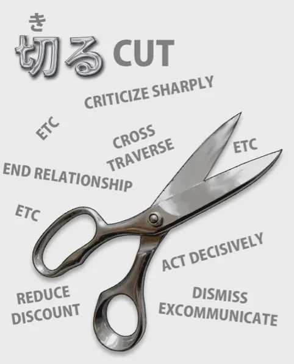
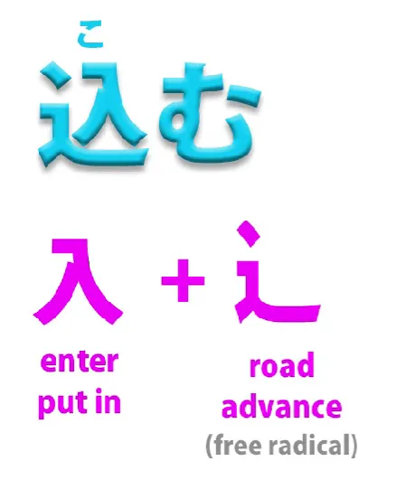
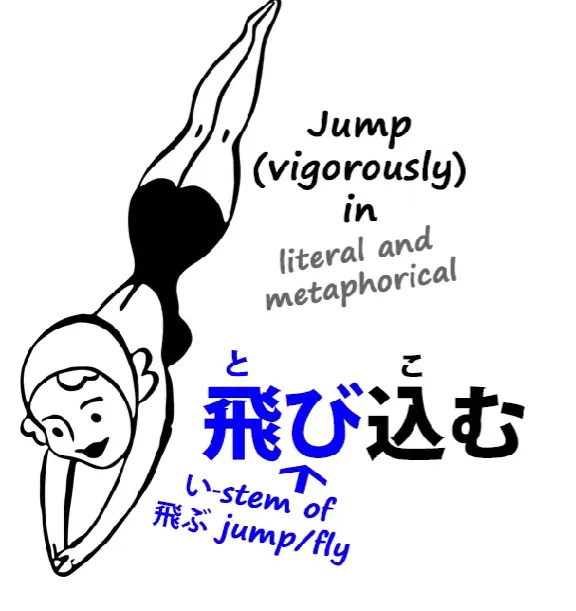

# **57. 込む (Komu) dan rahasia kata-kata Jepang yang memiliki banyak arti**

[**込む Komu dan rahasia kata-kata Jepang yang memiliki banyak arti | Pelajaran 57**](https://www.youtube.com/watch?v=31xnxSFUCiw&amp;list;=PLg9uYxuZf8x_A-vcqqyOFZu06WlhnypWj&amp;index;=59&amp;pp;=iAQB)

こんにちは。

Hari ini kita akan membahas satu kata tertentu yang memiliki banyak arti berbeda dalam konteks yang berbeda dan dapat digabungkan dengan kata lain. Namun, lebih dari itu, kita akan membahas bagaimana kata semacam ini bekerja dan bagaimana kita dapat memahaminya.

Kita sering menemukan di kamus kata-kata yang memiliki rentang makna yang berbeda-beda dan tampaknya tidak berhubungan. Saya tidak membicarakan homofon di sini, di mana kanji-nya berbeda. Mungkin mereka tidak terkait, meskipun kadang-kadang memang terkait.

Namun, yang saya maksud adalah kata-kata yang sebenarnya adalah kata yang sama tetapi memiliki rentang makna yang berbeda. Dan dalam kasus-kasus ini, hal penting yang perlu dipahami adalah bahwa biasanya ada makna dasar yang konkret, dan dari sana muncul sejumlah makna metaforis.

Dan ini bukan sekadar masalah sampingan dalam bahasa manusia. Bahasa manusia, setiap kali membahas abstraksi, menggunakan kata-kata yang didasarkan pada metafora konkret dan fisik. Dan kita mungkin terkadang melupakan metafora konkret dan fisik tersebut, tetapi metafora itu selalu ada.

Bahkan ketika kita berbicara tentang waktu, kita harus membicarakannya dalam kerangka ruang. Kita berbicara tentang waktu <code>going forward</code> atau <code>going backward</code>. Kita membicarakan waktu <code>line</code> — garis adalah entitas yang ada di ruang.

Kita sebenarnya tidak bisa membahas waktu tanpa membahasnya dalam kerangka ruang. Dan hal ini berlaku untuk semua abstraksi lain dalam bahasa manusia.

Kata <code>focus</code> awalnya berarti <code>hearth</code>. Orang-orang dulu duduk mengelilingi api perapian dan itu menjadi pusat, fokus dari aktivitas mereka. Dan dari metafora fisik itulah muncul semua makna yang diperluas dan abstrak dari kata <code>focus</code>.

Kata <code>stimulus</code> awalnya berarti sebuah <code>ox-goad</code>, sebuah tongkat runcing yang digunakan untuk menggiring sapi. Dan dari situ muncul semua makna abstrak dari <code>stimulus</code>. <code>Politics</code> berasal dari kata yang secara harfiah berarti <code>city</code>.

<code>Economics</code> berasal dari kata yang secara sederhana berarti <code>house</code>. Sekarang, kita tidak perlu mengetahui metafora fisik yang menjadi dasar kata-kata seperti ini, tetapi ketika kita menemukan kata-kata dalam bahasa Jepang yang tampaknya memiliki makna yang berbeda dan bertentangan, kita perlu memahami metafora dasarnya agar dapat memahami makna-makna lainnya tanpa harus menghafalnya sebagai daftar panjang hal-hal yang tampaknya acak.

Jadi, jika kita melihat kata <code>切る</code> dalam kamus — yang berarti <code>cut</code> — kita akan melihat banyak sekali arti untuknya seperti <code>ending a conversation</code>, <code>severing a relationship</code>, <code>crossing a field</code>.

Dan semua ini berasal dari makna dasar <code>cut</code>. Bahkan dalam bahasa Inggris kita berbicara tentang <code>cutting across a field</code>. Nah, itu cukup mudah, selama kita memahami prinsipnya, dengan kata seperti <code>cut</code>, di mana kita memiliki padanan yang sangat pasti dan jelas (jika boleh saya katakan) dalam bahasa Inggris.

Namun, ketika kita berhadapan dengan kata-kata yang tidak memiliki padanan yang tepat dalam bahasa Inggris, hal ini bisa menjadi sedikit lebih sulit kecuali kita memahami apa artinya. Dan salah satu kata tersebut, yang akan kita temui di mana-mana dalam bahasa Jepang, adalah kata <code>込む</code>.

## 込む

Sekarang, <code>込む</code> tidak memiliki arti yang tepat dalam bahasa Inggris, tetapi kita dapat memahami artinya dengan melihat kanji-nya. Kanji tersebut pada dasarnya adalah kanji dari <code>入る / 入る / 入れる</code>  — <code>go in</code> atau <code>put in</code> — dan itu ada di <code>road</code>.

Ini adalah jalan yang oleh sebagian orang disebut <code>the water slide</code>. Saya selalu melihatnya sebagai <code>fast road</code> dan itulah tepatnya yang terjadi di sini.

Artinya &quot;meluncur di seluncuran air / meluncur dengan sepatu roda / memadatkan dalam jumlah besar / memasukkan dengan cepat / memasukkan dengan penuh semangat&quot;. Itulah yang <code>込む</code> artinya.

Sekarang, kita mungkin menemukannya pertama kali dalam arti yang sangat sederhana dan konkret seperti <code>込んでいる</code>, keadaan <code>込む</code>, dan itu berarti <code>crowded</code>: banyak orang berdesakan di ruang yang sama, ramai. Sekarang, kata ini bisa memiliki makna yang lebih abstrak seperti <code>complicated</code>, yang pada dasarnya sama: banyak ide, banyak konsep, yang berdesakan dalam ruang mental yang sama, itulah yang disebut kerumitan.

### 飛び込む

Kemudian kata ini menjadi kata bantu yang melekat pada I-stem dari kata kerja lain. Jadi kita memiliki <code>飛び込む</code>, yang berarti <code>jump in</code>.

Secara harfiah, kata ini bisa berarti melompat ke dalam air atau semacamnya, tetapi juga bisa berarti terjun dengan penuh semangat ke dalam percakapan, situasi, atau penggunaan metaforis lainnya dari <code>jumping in</code>.

### 黙り込む

Istilah ini bisa menjadi lebih abstrak, dengan konsep seperti <code>黙り込む</code>. <code>黙る</code> berarti <code>be silent</code>. <code>黙り込む</code> berarti <code>be quiet</code> tentang sesuatu / <code>clam up</code> tentang sesuatu, dengan kata lain, diam dan menyimpan segala sesuatu di dalam diri sendiri, tidak membiarkan apa pun keluar.

### 読み込む

Sekarang, kata <code>読み込む</code> adalah kata yang akan sering Anda temui jika Anda memiliki komputer atau tablet atau apa pun dalam bahasa Jepang. (Dan jika belum, mengapa tidak?) Anda akan sering melihat kata tersebut muncul <code>読み込み中</code>.

Sekarang, <code>-中</code> berarti <code>in process of</code>. Artinya secara harfiah <code>in the middle of</code> — sebuah metafora lain, karena secara harfiah artinya <code>middle</code> atau <code>center</code> atau <code>inside</code>. Namun dalam kasus ini, ketika kata tersebut melekat pada kata kerja seperti ini, <code>中</code> berarti <code>in the process of</code>.

Seperti yang mungkin kita katakan dalam bahasa Inggris, <code>in the middle of doing something</code>. <code>読み込み中</code> adalah <code>being in the process of 読み込む-ing</code>, dan <code>読み込む</code> di sini berarti <code>loading</code>.

Artinya <code>reading and cramming in</code>: membaca data dan menyimpannya ke dalam memori. Namun, kata tersebut memiliki berbagai arti lain, dan meskipun berbeda, semuanya didasarkan pada metafora dasar yang sama.

Jadi <code>読み込む</code> dapat berarti membaca sesuatu beberapa kali, membacanya secara menyeluruh. <code>込む</code> dapat berarti melakukan sesuatu berulang kali, karena sekali lagi ini adalah menjejalkan iterasi dari melakukannya, menjejalkan pengulangan, bisa dibilang begitu. Namun, ini bisa berarti membaca secara mendalam, bisa berarti membaca berulang kali; bagaimanapun, ini berarti menjejalkan materi tersebut ke dalam pikiran Anda.

Dan sekali lagi, <code>読み込む</code> dapat berarti membaca sesuatu ke dalam sesuatu: seseorang mengatakan sesuatu atau Anda melihat sebuah teks, dan Anda memasukkan makna tambahan yang Anda yakini ada di sana. Dan seringkali memang demikian. Teks dapat memiliki implikasi.

Membaca sesuatu ke dalam sesuatu lagi dapat berarti <code>読み込む</code>. Dan sekali lagi, ini adalah penggunaan metafora yang sangat jelas dan alami.

Dan sekali lagi, <code>読み込む</code> dapat berarti membaca puisi atau sesuatu dengan perasaan, dengan emosi. Anda tidak hanya membacanya; Anda memasukkan sesuatu ke dalamnya, Anda memasukkan emosi, Anda memadatkannya dengan sesuatu, dengan emosi, dengan perasaan, dengan ekspresi.

Jadi, semua makna <code>読み込む</code> berbeda-beda, namun pada dasarnya semuanya sesuai dengan metafora yang sama: membaca dan mengisi sesuatu ke dalamnya.

### 思い込む

Sekarang, kata kerja gabungan lain yang umum dengan <code>込む</code> adalah <code>思い込む</code>. Nah, penggunaan yang paling umum dari kata itu, menurut saya, adalah <code>be under the impression / to be convinced of</code> sesuatu, biasanya sesuatu yang ternyata tidak benar, tetapi tidak harus demikian.

Jadi, <code>思い</code> adalah <code>thought</code> dan <code>込む</code> adalah <code>cramming in</code>, jadi Anda memiliki pemikiran ini yang ditanamkan, atau serangkaian pemikiran yang ditanamkan ke dalam pikiran Anda. Baik itu benar atau tidak, pemikiran-pemikiran itu ada di sana, tertanam di dalam pikiran Anda.

Dan, yang menarik, dalam bahasa Inggris kuno, orang-orang terkadang berbicara tentang <code>cramming</code> seseorang, yang berarti mengisi mereka dengan gagasan yang salah, memberi mereka kesan yang keliru, menjejalkan ke dalam pikiran mereka serangkaian gagasan tertentu yang umumnya tidak benar, setidaknya menurut pendapat si pembicara.

Jadi <code>思い込む</code> dalam arti itu biasanya berarti memiliki kesan yang kuat, keyakinan yang kuat, gagasan yang kuat bahwa sesuatu itu benar padahal sebenarnya mungkin tidak.

Namun <code>思い込む</code> juga bisa berarti hal lain. Kata tersebut bisa berarti <code>being in love</code> dan bisa berarti <code>having one&#x27;s heart set</code> pada sesuatu. Dan untuk memahami hal itu, kita perlu mengetahui sedikit lebih banyak tentang kata <code>思い</code>, yang, seperti yang saya tunjukkan di bagian akhir video lain, tidak selalu berarti <code>thought</code> atau <code>feeling</code>.

Kata tersebut juga bisa berarti <code>love</code> atau <code>desire</code>. Jadi, misalnya, kata <code>片思い</code> berarti <code>one-sided love</code>. <code>片</code> secara umum berarti <code>side</code> atau <code>direction</code> dan <code>片思い</code> adalah <code>one-sided or one-directional love / unrequited love</code>.

Jadi <code>思い</code> kata &quot;there&quot; digunakan dalam arti <code>love / affection / desire</code>. Jadi <code>思い込む</code> dapat berarti <code>being in love</code>. Kata itu juga bisa berarti <code>having one&#x27;s heart set on something</code>, dan itu tidak selalu berarti mencintai seseorang.

Itu bisa berarti memiliki tekad yang kuat untuk pergi piknik, atau apa pun. Intinya di sini adalah bahwa <code>思い</code> dalam arti keinginan dan cinta tergabung menjadi satu.
Ini bukan sekadar keinginan sesaat, melainkan sesuatu yang menjadi fokus sepenuh hati,  
sesuatu <code>crammed in</code>.

---

Kita akan menemui beberapa arti lain dari <code>込む</code> juga, terutama ketika kata ini digunakan,  
seperti yang sering terjadi, sebagai kata bantu yang ditambahkan ke A-stem kata &quot;い&quot; dari kata kerja lain. Namun begitu kita memahami poin ini, bahwa hal ini berkaitan dengan memadatkan, dengan mengisi, dengan ketelitian, kelengkapan, atau dengan mengunci rapat, maka kita dapat memahami bagaimana kata-kata lain ini akan berfungsi saat kita mendengarnya.

::: info
ada satu [**komentar**] yang menarik*(https://www.youtube.com/watch?v=31xnxSFUCiw&amp;lc;=Ugx7rl5ZlBI3QADLH3R4AaABAg&amp;ab;_channel=OrganicJapanesewithCureDolly)*. Sayang kita tidak bisa mendengar pendapat Dolly tentang hal ini :{
:::
