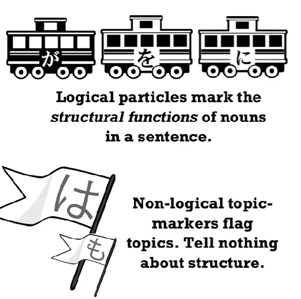
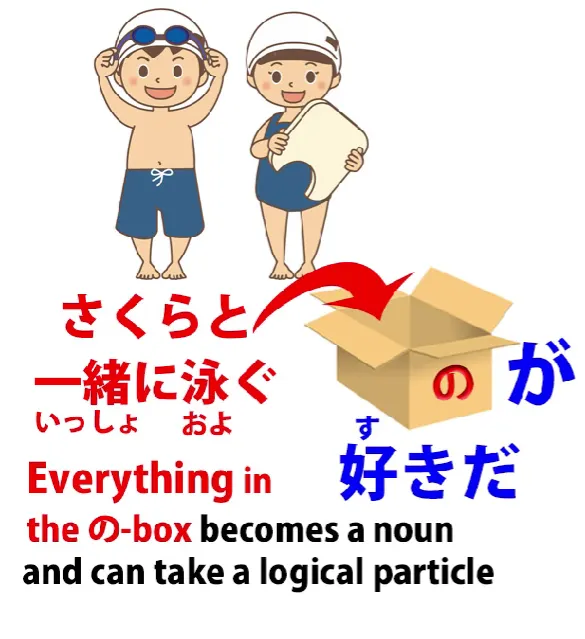

# **58. Partikel ganda dalam bahasa Jepang. Cara kerjanya**

[**Partikel ganda dalam bahasa Jepang. Cara kerjanya yang sebenarnya | Pelajaran 58: Kombinasi Partikel**](https://www.youtube.com/watch?v=iPiLVZoYhfM&amp;list;=PLg9uYxuZf8x_A-vcqqyOFZu06WlhnypWj&amp;index;=60&amp;pp;=iAQB)

こんにちは。

Hari ini kita akan membahas <code>combined particles</code> atau <code>double particles</code> atau nama-nama konyol apa pun yang digunakan buku teks dan situs tata bahasa Jepang untuk menyebutnya. Dan sebentar lagi saya akan menjelaskan mengapa saya menyebutnya <code>silly</code>. Yang saya maksud adalah partikel dalam kombinasi seperti <code>には</code>, <code>にも</code>, <code>-とは</code>, <code>のが</code> dll.

Dan jika Anda melihat situs-situs tersebut, Anda akan menemukan banyak aturan seperti <code>you can use に with は and も, but you can&#x27;t use it with が or で</code>; <code>you can use -と with this, but not that</code>, dan seterusnya. Dan Anda tidak perlu mempelajari aturan-aturan ini. Jika Anda memahami apa yang terjadi dan mengapa hal itu terjadi, semuanya akan masuk akal secara logis. Tidak ada aturan acak di sini, hanya logika yang lugas.

Alasan mengapa tata bahasa Jepang dalam bahasa Inggris begitu membingungkan adalah karena mereka tidak hanya memberikan jawaban yang salah. Mereka memberikan jawaban yang salah untuk pertanyaan yang salah. Mereka mengajukan pertanyaan yang seharusnya tidak pernah diajukan sejak awal.

**Sebenarnya tidak ada yang namanya <code>double particle</code> atau <code>combined particle</code>.** Yang terjadi sepanjang waktu adalah partikel-partikel tersebut hanya menjalankan fungsinya seperti biasa.

Lalu bagaimana dengan semua aturan acak tentang kapan partikel-partikel tersebut boleh digunakan dan kapan tidak? Sebenarnya, semua aturan tersebut didasarkan pada apa itu partikel dan apa yang sebenarnya mereka lakukan.

Jadi, perbedaan pertama yang harus dibuat, yang tidak pernah disebutkan oleh buku teks dan situs web, adalah perbedaan antara partikel logis dan non-logis. Ini sangat penting.

## Partikel logis &amp; non-logis

Jadi, mari kita mulai dengan melihat lima partikel logis utama. Partikel-partikel inilah yang memberi tahu kita apa yang sedang terjadi dalam kalimat. Partikel-partikel ini menandai setiap kata benda dengan peran yang dimainkannya dalam kalimat, apakah itu orang yang melakukan sesuatu, benda yang sedang dilakukan, benda yang menjadi objek tindakan, tempat di mana tindakan itu dilakukan, dan seterusnya.

Nah, hal pertama yang perlu dipahami adalah bahwa kamu tidak bisa menggabungkan kelima partikel logis ini dengan yang lain. Mengapa tidak? Karena fungsi mereka. Partikel-partikel ini menandai setiap kata benda dengan fungsinya dalam kalimat. Sebuah kata benda tidak bisa memiliki lebih dari satu kelas kata pada saat yang sama, jadi menggabungkan kelima partikel ini satu sama lain sama sekali tidak masuk akal.

---

Namun, partikel-partikel ini dapat digabungkan dengan partikel non-logis, terutama dua penanda topik non-logis, yaitu &quot;は&quot; dan &quot;も&quot;. Anda dapat menggabungkannya karena tidak bertentangan secara logis. &quot;

は&quot; dan &quot;も&quot; tidak memberi tahu kita apa pun tentang fungsi kata benda dalam kalimat. Penanda ini hanya berfungsi untuk menandai hal tersebut sebagai topik, baik untuk menjadikannya topik kalimat maupun sub-topik karena alasan strategis, yang akan kita bahas sebentar lagi.

## Partikel utama &amp; sekunder

Sekarang, hal berikutnya yang perlu diketahui adalah bahwa dua partikel utama, atau partikel utama dan sekunder, yaitu **が dan を, tidak digabungkan dengan partikel non-logis.**

Mengapa demikian? Nah, が adalah partikel primer: ia harus ada dalam setiap kalimat dari segala jenis; を adalah partikel sekunder: ia menandai objek langsung. Ini berarti bahwa dalam setiap kalimat yang transitif langsung, を harus ada, terlepas dari apakah kita dapat melihatnya atau tidak.

---

Sekarang, apa yang saya maksud dengan transitif langsung? Semua buku teks dan kamus mencampuradukkan transitivitas dengan kata kerja gerak diri dan gerak orang lain dalam bahasa Jepang. Dan dalam arti tertentu hal ini dapat dimengerti, karena ada banyak kesamaan di antara keduanya.

**Namun, keduanya bukanlah hal yang sama.**

Jadi, mari kita lihat di sini apa yang dimaksud dengan transitivitas sebenarnya. Jika saya mengatakan <code>I walk</code>, <code>I sing</code>, <code>I eat</code>, itu semua adalah kata kerja intransitif karena saya yang melakukan kata kerja tersebut dan tidak melakukannya pada hal lain. Kata kerja tersebut tidak memiliki objek langsung. Jika saya mengatakan <code>I sing a song</code> atau <code>I read a book</code> atau <code>I eat bread</code>, maka ini transitif karena kata kerja tersebut memiliki objek langsung.

Sekarang, ketika saya mengatakan <code>directly transitive</code>, yang saya maksud adalah kata kerja yang dilakukan langsung kepada suatu objek. Jadi, misalnya, saya bisa mengatakan <code>I talk to Sakura</code> tetapi dalam bahasa Inggris, seperti yang Anda lihat, kita harus menggunakan preposisi di sana.

Kita tidak mengatakan <code>I talk Sakura</code>, jadi kita tidak secara langsung transitif, melainkan transitif secara tidak langsung melalui perantara preposisi.

Sekarang, bahasa Jepang memiliki perbedaan yang sama. Kita **tidak** mengatakan <code>さくらを話す</code>, yang setara dengan <code>I talk Sakura</code>. Kita mengatakan <code>さくらと話す</code> atau <code>さくらに話す</code>.

Sekarang, tolong jangan langsung menghindar dari ini dengan anggapan bahwa partikel seperti に dan - と sama dengan preposisi dalam bahasa Inggris. Mereka tidak sama. Jika Anda ingin membandingkannya dengan bahasa Eropa mana pun, Anda harus membandingkan semua partikel logis tersebut dengan struktur kasus dalam bahasa Jerman atau Latin. Anda mungkin tidak tahu apa itu dan Anda tidak perlu mengetahuinya, karena saya memodelkannya dengan cara yang tidak memerlukan pengetahuan tentang tata bahasa Eropa.

Namun intinya di sini adalah bahwa partikel-partikel tersebut bukanlah preposisi, tetapi untuk keperluan kita di sini, kita dapat mengatakan bahwa partikel-partikel tersebut digunakan dalam keadaan yang sama dengan penggunaan preposisi dalam bahasa Inggris.

Jadi, jika kita mengatakan <code>I eat bread</code>, itu transitif langsung. Jika kita mengatakan <code>I talk to Sakura</code>, itu transitif tidak langsung. Dalam bahasa Jepang, jika kita menggunakan partikel &quot;を&quot;, itu transitif langsung. Jika kita menggunakan partikel lain, seperti &quot;と&quot; atau &quot;に&quot;, itu transitif tidak langsung.

Dalam beberapa kasus, bahasa Inggris dan Jepang akan berbeda pendapat mengenai apa yang bersifat transitif langsung dan apa yang bersifat transitif tidak langsung, tetapi pada banyak sekali kesempatan keduanya sebenarnya sepakat karena ini merupakan faktor-faktor dasar dalam komunikasi manusia.

---

Sekarang, intinya di sini adalah bahwa kedua partikel penunjuk arah ini — jika kita mengatakan <code>I hit Sakura</code> tidak ada preposisi di mana pun. Ini sepenuhnya langsung. Saya yang memukul dan saya memukul sesuatu, saya memukul Sakura. Saya tidak memukul ke arah Sakura atau memukul di dekat Sakura atau memukul melalui Sakura.

Saya memukul Sakura secara langsung. Karena sifat langsung dari kedua partikel ini, mereka tidak bisa ditambahkan partikel non-logis.

Jadi, jika Anda ingin menggunakan partikel non-logis di sini, Anda bisa melakukannya. Tetapi cara melakukannya adalah dengan hanya menambahkan partikel non-logis **dan menghilangkan partikel logis**.

Dan karena partikel-partikel ini sangat mendasar bagi setiap kalimat, mereka dapat dipahami oleh pendengar dalam bahasa Jepang.

Jadi, jika kita mengatakan <code>さくらはなぐった</code> — <code>I hit Sakura</code> — ini berarti <code> *(zeroが)* さくらは**zeroを**なぐった</code>,

**tetapi kita tidak mengatakan <code>さくらはをなぐった</code> atau <code>さくらをはなぐった</code>.** Karena Anda tidak bisa menempatkan apa pun di antara dua partikel logis dasar langsung ini dan hal yang mereka hubungkan secara langsung.

Jadi sekarang kita memahami dasar dari hampir semua aturan aneh yang akan Anda dengar. Anda hanya perlu mengingat dua fakta ini: **Anda tidak boleh menggabungkan salah satu dari lima partikel logis utama ini dengan salah satu dari empat partikel lainnya** dan
**Anda tidak boleh menempatkan partikel non-logika sebelum atau setelah dua partikel utama が dan を.**

Sekarang, setelah kita tahu itu, apa yang tersisa dan bagaimana cara kerjanya? Kita dapat memasangkan partikel non-logis dengan salah satu partikel logis yang tersisa. Dan alasan kita melakukan ini bukanlah untuk membuat kombinasi pasangan yang aneh atau tidak biasa. Kita hanya menggunakan fungsi keduanya secara bersamaan.

Jadi, hal paling sederhana yang kita lakukan di sini adalah menjadikan sesuatu sebagai topik. Jika kita mengatakan <code> *(zeroが)* 冬には雪だるまを作る</code>, kita berarti <code>In the winter we make a snowman.</code>

Sekarang, kita bisa mengatakan <code> *(zeroが)* 冬に雪だるまを作る</code>. **Kita tidak perlu menyertakan は di sana.**

Lalu mengapa kita kadang-kadang memilih untuk menyertakan は di sana? Nah, dalam kasus ini kita menjadikannya topik kalimat. Kita mengatakan <code>here&#x27;s winter/speaking of winter, this is what we do.</code>

Dan kata itu juga memainkan peran lain yang selalu dimainkan oleh &quot;は&quot; sebagai perpanjangan dari sifatnya yang menjadikan sesuatu sebagai topik. Dan saya telah membuat [**video**](https://www.youtube.com/watch?v=9l_ZlQQU4ZE&amp;ab;_channel=OrganicJapanesewithCureDolly) tentang berbagai penggunaan は ini, jadi jika Anda belum familiar dengan hal ini, silakan tonton videonya, karena ini cukup penting untuk memahami apa yang sedang terjadi di sini.

Jadi, kita sedang membahas topik musim dingin dan juga membedakan musim dingin dari musim-musim lainnya. Kita mengatakan <code>冬には</code> — <code>As for winter, as opposed to the other seasons, we make a snowman.</code>

Sekarang, jika orang yang Anda ajak bicara berasal dari tempat yang sangat, sangat dingin, mereka mungkin akan mengatakan <code> *(zeroが)* 春にも雪だるまを作る</code>.

Jadi yang mereka katakan adalah <code>We make a snowman in the spring as well.</code> Jadi kita bisa menggunakan partikel eksklusif は atau partikel inklusif も. Dan keduanya menambahkan tingkat makna tersebut.

Sekarang, mengapa kita memiliki に di sini? Karena kita sebenarnya membutuhkan に. **Kita membutuhkan に untuk menandai fakta bahwa kita sedang melakukan suatu aktivitas pada waktu tertentu.** Inilah fungsi logis dari &quot;に&quot;. Dan setelah melakukannya, kita juga bisa menjadikannya sebuah topik. Dan itulah yang sedang kita lakukan di sini.

Dalam kasus lain, kita mungkin mengatakan <code>明日学校に行く</code> dan itu hanya berarti saya akan pergi ke sekolah. Jika kita mengatakan <code>明日学校には行く</code>, implikasinya adalah kita pergi ke sekolah tetapi kita tidak pergi ke tempat lain yang mereka kira mungkin kita tuju.

Jika kita mengatakan <code>明日学校にも行く</code>, kita mengatakan bahwa saya pergi ke sekolah serta ke tempat lain yang sudah Anda ketahui.

Jadi, kamu lihat, dalam setiap kasus ini, partikel non-logis kita hanya menambahkan makna pada partikel logis yang sudah ada. Keduanya tidak bertentangan, karena satu logis dan yang lain non-logis, jadi mereka tidak memberi kita informasi yang bertentangan.
**Mereka memberi kita informasi yang saling melengkapi.**

Dan itulah mengapa kamu bisa menggunakannya seperti itu dan mengapa kamu tidak bisa menggabungkan satu Partikel logis dengan partikel logis lainnya atau satu Partikel non-logis dengan partikel non-logis lainnya.

---

Sekarang, ada partikel lain yang dapat dipasangkan dengan partikel lain, tetapi sekali lagi, konsep &quot;pemasangan&quot; ini adalah cara yang salah untuk memandangnya. Seperti biasa, partikel-partikel tersebut hanya melakukan apa yang mereka lakukan.

Misalnya, partikel &quot;の&quot;, jika itu adalah &quot;の&quot; yang menominalkan, yaitu &quot;の&quot; yang mengubah sesuatu menjadi kata benda, jadi, misalnya, <code>泳ぐの</code> adalah <code>swimming</code>, **kata benda** <code>swimming</code>, aktivitas yang disebut <code>swimming</code>.

Kita dapat mengatakan <code>泳ぐのが好きです</code>. Kita bisa mengatakan <code>泳ぐのをします</code>.

**Kamu bisa menggabungkan partikel logis apa pun dengan &quot;の&quot; karena jenis &quot;の&quot; ini mengubah kata di depannya menjadi semacam kata benda, dan kata benda bisa dipadukan dengan partikel logis apa pun.**

Bisa juga berupa klausa logis yang lebih panjang: <code>さくらと一緒に泳ぐのが好きだ</code> — <code>I like swimming together with Sakura</code>. / **Sakura bersama dengan berenang menyenangkan adalah.**
::: info
memberikan terjemahan yang sedikit lebih harfiah untuk berjaga-jaga, &quot;好き&quot; adalah kata benda yang berfungsi sebagai kata sifat. Ikuti Dolly saja.
:::

Namun intinya adalah bahwa begitu Anda menempatkan partikel nominalisasi の di akhir kalimat, **ketika の-lah yang mengubah sesuatu menjadi kata benda, maka Anda memperlakukannya sebagai kata benda**.

Dan apa yang Anda lakukan dengan kata benda? Anda menempatkan Partikel logis di atasnya, bukan? Jadi, ini adalah logika sederhana.

Jika Anda memiliki pertanyaan atau komentar, silakan tulis di kolom Komentar di bawah ini dan saya akan menjawabnya seperti biasa.

Saya ingin mengucapkan terima kasih kepada para pendukung Gold Kokeshi saya, serta semua pendukung dan penggemar saya di Patreon dan di mana pun.
