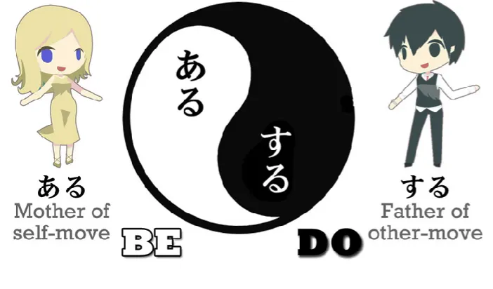
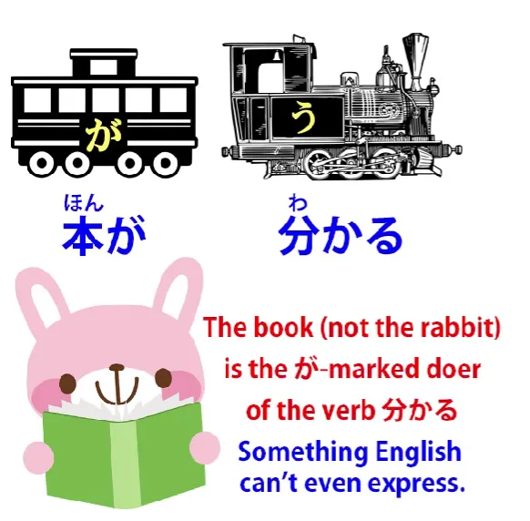
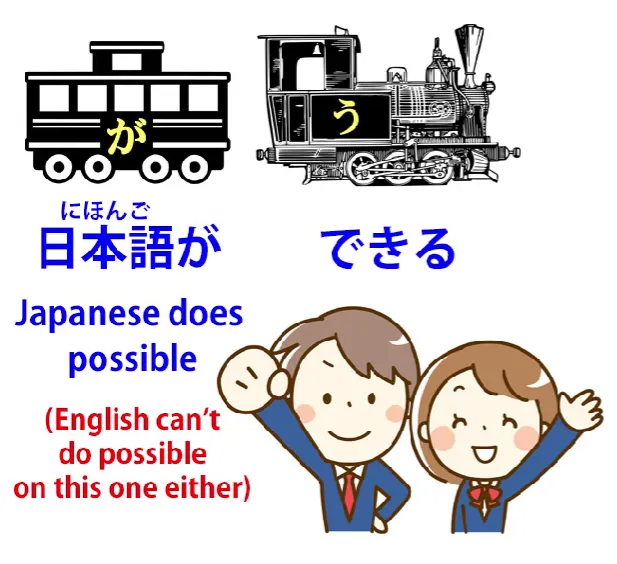
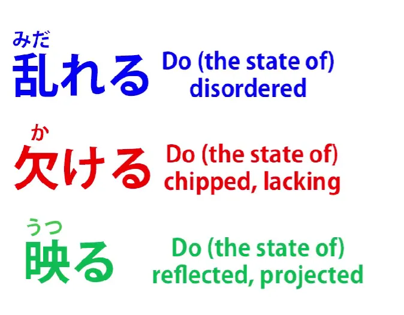
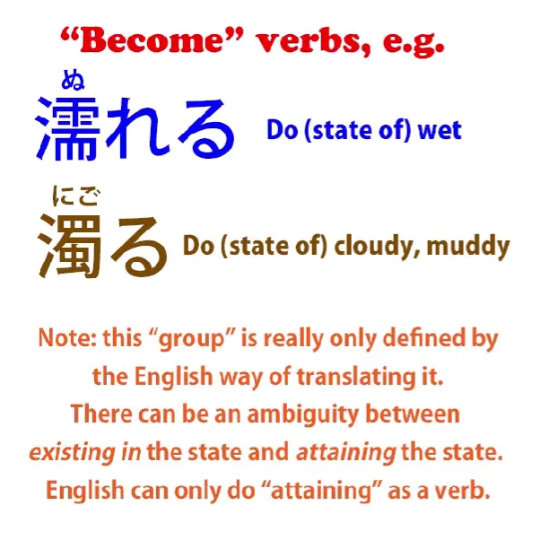

# **59. Ada Bahasa Jepang yang Tak Dapat Diterjemahkan! Cara Memahaminya**

[**Ada Bahasa Jepang yang Tak Dapat Diterjemahkan! Cara Memahaminya | Pelajaran 59**](https://www.youtube.com/watch?v=wLrK_YxdPoM&amp;list;=PLg9uYxuZf8x_A-vcqqyOFZu06WlhnypWj&amp;index;=61&amp;pp;=iAQB)

こんにちは。

Hari ini kita akan membahas sesuatu yang membuat berbagai macam kalimat dalam bahasa Jepang sulit dipahami oleh pelajar bahasa Inggris.

Dan itu adalah sesuatu yang saya sebut <code>the problem of passivity in Japanese</code>. Dan yang saya maksud di sini bukanlah apa yang disebut kalimat pasif dalam bahasa Jepang, yang sebenarnya merupakan kata kerja bantu reseptif. Itu menjadi masalah karena kecenderungan untuk menyebutnya pasif padahal sebenarnya bukan, tetapi sebenarnya ada beberapa konstruksi bahasa Jepang yang lebih mendalam dari ini dan menimbulkan masalah karena dianggap dan diterjemahkan sebagai pasif meskipun sebenarnya tidak disebut pasif.

Dan ini penting karena jika kita menganggapnya sebagai kalimat pasif, maka kita akan salah memahami kalimat tersebut, kita tidak akan mengerti mengapa Partikel logis berada di tempat-tempat tertentu, dan terutama pada kalimat yang lebih kompleks,  
kita sama sekali tidak akan bisa memahami apa yang sedang terjadi.

Sekarang, seperti yang telah saya katakan sebelumnya, tidak ada bentuk pasif gramatikal yang sebenarnya dalam bahasa Jepang, tetapi hal yang perlu dipertimbangkan di sini adalah adanya sesuatu yang dapat kita sebut sebagai sifat pasif dari bahasa Jepang secara keseluruhan. Dan ini tidak ada hubungannya dengan bentuk pasif gramatikal seperti yang ada dalam bahasa Inggris. Ini lebih merupakan pasivitas filosofis daripada pasivitas gramatikal.

Dan dengan <code>passive</code> sini saya hanya bermaksud kebalikan dari aktif. Seperti yang telah saya jelaskan sebelumnya, kata kerja dasar dalam bahasa Jepang adalah <code>ある</code> dan <code>する</code>, <code>ある</code> yang berarti <code>be</code> dan <code>する</code> berarti <code>do</code>.

Dan meskipun kita menyebutnya <code>Adam and Eve</code>, kita sebenarnya harus menyebutnya sebagai <code>Eve and Adam</code>, karena dalam bahasa Jepang ada kecenderungan untuk menganggap <code>being</code> sebagai yang lebih utama dan mendahului <code>doing</code>, sedangkan bahasa Inggris cenderung memandang hal-hal sebaliknya. Bahasa Inggris cenderung bersifat aktif.

Dan ada berbagai macam kata kerja dalam bahasa Jepang yang tidak menggambarkan tindakan sebagaimana kita memahaminya, melainkan keadaan keberadaan yang secara tata bahasa dianggap seolah-olah merupakan tindakan. Dan sekali lagi, memahami hal ini sangat penting untuk memahami cara kerja kalimat.

Dan kita bisa memulainya dengan sesuatu yang sebenarnya biasanya tidak diterjemahkan sebagai kalimat pasif, tetapi akan sedikit lebih baik jika diterjemahkan sebagai kalimat pasif, dan itu adalah sesuatu yang telah kita bahas sebelumnya dalam konteks lain, yaitu jika kita mengatakan <code>本が分かる</code>, ini diterjemahkan ke dalam bahasa Inggris sebagai <code>I understand the book</code> dan itu sama sekali tidak berarti demikian, karena seperti yang dapat kita lihat, buku adalah subjek yang ditandai dengan &quot;が&quot; dalam kalimat tersebut.

Jadi, buku itulah yang melakukan sesuatu, bukan saya. Saya tidak melakukan apa-apa. Dan sebenarnya, struktur kalimatnya jauh lebih terjaga jika kita menerjemahkannya sebagai <code>The book is understandable (to me)</code>.

Ini hampir sama dengan apa yang dimaksud dalam bahasa Jepang. Buku itulah subjeknya dan buku itulah yang sebenarnya melakukan tindakan tersebut. Alasan <code>The book is understandable to me</code> terjemahan ini tidak sempurna adalah karena, seperti yang Anda lihat, ini sebenarnya bukan kalimat A-adalah-B.

Jadi, kita tidak seharusnya mengatakan <code>The book is understandable (to me).</code> Apa yang harus kita katakan agar sesuai dengan bahasa Jepang adalah <code>The book **does** understandable (to me).</code> Dan tentu saja itu sama sekali tidak masuk akal dalam bahasa Inggris karena dalam bahasa Inggris <code>being understandable</code> dianggap sebagai keadaan.

Tetapi dalam bahasa Jepang, hal itu dianggap sebagai tindakan, yang mungkin kita sebut <code>stative action</code>, suatu tindakan yang bersifat keberadaan, seperti <code>being</code> sendiri. Bahkan dalam bahasa Inggris kita bisa mengatakan bahwa sesuatu <code>exists</code>. Namun secara umum, bahasa Inggris mengharuskan benda-benda bergerak atau melakukan sesuatu agar dapat dikatakan bahwa mereka melakukan suatu tindakan.

Namun dalam bahasa Jepang, tindakan berada dalam keadaan tertentu sering kali diungkapkan dengan kata kerja. Dan ini penting karena hal ini meluas ke berbagai macam kata dalam bahasa Jepang, ke できる dan ke kata kerja apa pun yang memiliki kata bantu potensial yang melekat.

Jadi, jika kita mengatakan <code>日本語ができる</code>

maka akan diterjemahkan menjadi <code>I can do Japanese</code> atau <code>I can speak Japanese</code>, yang bahkan lebih aneh karena tidak ada <code>speak</code> di sana dan yang sebenarnya dimaksud adalah bahwa <code>Japanese is possible (to me)</code>, tetapi sekali lagi ini adalah konstruksi A-adalah-B padahal sebenarnya ini adalah kalimat A-melakukan-B. Yang dimaksud adalah <code>Japanese **does** possible (to me)</code>.

Sekarang, ini mungkin tampak seperti perdebatan yang remeh, tetapi ini bukan perdebatan karena partikel, struktur, dan kerangka keseluruhan kalimatnya berbeda. Dan dalam kalimat sederhana seperti ini mungkin tidak terlalu penting, tetapi seiring kalimat menjadi lebih rumit, masalah ini menjadi lebih penting karena kita mulai menemui kalimat yang hampir mustahil dipahami kecuali kita mengenali struktur sebenarnya dari kalimat tersebut.

---

Dan ada berbagai macam kata kerja yang merujuk pada apa yang dalam bahasa Inggris disebut sebagai keadaan. Dan dalam kasus-kasus ini, terjemahan bahasa Inggrisnya selalu pasif. Dan harus pasif, karena memang tidak ada cara lain untuk mengatakannya dalam bahasa Inggris.

Misalnya, <code>乱れる</code> — tersebar atau tidak teratur; <code>欠ける</code> — terkelupas, rusak, atau tidak cukup; <code>映る</code> — tercermin atau diproyeksikan.

Masing-masing dari itu, seperti yang Anda lihat, saya terjemahkan dengan bentuk pasif dalam bahasa Inggris karena itulah satu-satunya cara untuk menerjemahkannya ke dalam bahasa Inggris yang alami.

**Namun, sebenarnya kalimat-kalimat tersebut tidak bersifat pasif dalam bahasa Jepang.** Kalimat-kalimat ini dianggap sebagai tindakan yang dilakukan oleh
-   benda yang berantakan,
-   benda yang rusak,
-   benda yang dipantulkan.

Jadi, jika tidak ada alternatif lain selain menerjemahkannya sebagai kalimat pasif, bukankah kita dibenarkan untuk melakukannya? Dan jawabannya adalah, ya tentu saja kita sepenuhnya dibenarkan melakukannya jika yang kita coba lakukan adalah menjelaskan kepada seseorang yang tidak tahu bahasa Jepang dan tidak sedang belajar bahasa Jepang apa yang sedang dikatakan atau, lebih tepatnya, apa yang akan dikatakan oleh penutur bahasa Inggris dalam situasi yang sama.

Tetapi jika, sebagai pembelajar bahasa Jepang, kita tidak tahu apa yang sebenarnya dilakukan oleh kalimat tersebut, kita akan terjebak dalam kebingungan yang mengerikan. Kita akan melihat kalimat-kalimat dan bertanya-tanya apa artinya, dan jika kita mencoba membuat kalimat sendiri, kita tidak akan bisa melakukannya karena kita akan mencari konstruksi pasif, kita akan mencoba membangun kalimat berdasarkan prinsip-prinsip yang belum diperkenalkan kepada kita dan tidak kita pahami.

**Jadi, hal yang perlu dipahami di sini adalah bahwa dalam bahasa Jepang, kata kerja dapat dan sering kali mewakili apa yang dalam bahasa Inggris hanya dapat diekspresikan sebagai keadaan atau tindakan pasif.**

---

Lalu ada kelompok kata kerja lain yang secara tipe sangat mirip dengan ini, di mana kata kerja tersebut diterjemahkan sebagai <code>becoming</code> sesuatu yang spesifik:
<code>濡れる</code> — menjadi basah;
<code>濁る</code> — menjadi keruh atau berlumpur.

Sekali lagi, dalam bahasa Jepang hal ini tidak dibicarakan sebagai <code>becoming</code> apa pun.  
Ini hanyalah sebuah tindakan itu sendiri.

Jika kita ingin menemukan cara untuk mengungkapkannya dalam bahasa Inggris, kita harus menciptakan kata seperti <code>muddify</code> atau <code>cloudify</code> atau <code>wetiniflicate</code>, tetapi pada kenyataannya kata-kata ini tentu saja tidak ada dalam bahasa Inggris.

**Dan kunci untuk memahaminya dalam bahasa Jepang bukanlah dengan mencoba menerjemahkannya ke dalam bahasa Inggris, melainkan dengan melihat bagaimana kata-kata tersebut sebenarnya berfungsi dalam bahasa Jepang dan menyadari bahwa terjemahan satu-ke-satu tidak mungkin dilakukan dalam kasus-kasus ini.**

Dan kata-kata yang menjadi seperti <code>濁る</code> atau <code>濡れる</code> juga dapat digunakan dalam bentuk present continuous untuk membawa kita kembali ke keadaan pasif yang kita miliki dengan kata-kata lain.

Jadi, misalnya, <code>濁ている</code>: kita mengatakan apa yang dalam bahasa Inggris hanya dapat diterjemahkan sebagai &quot;to <code>be cloudy</code>, tetapi dalam bahasa Jepang, sekali lagi, itu adalah <code>exist in a state of cloudiness</code>.

Jadi ini adalah masalah yang cukup sederhana dan jelas, tetapi sangat penting bagi kita untuk menyerap dan memahami prinsip ini, atau kita akan mengalami banyak kesulitan dengan berbagai macam ungkapan dalam bahasa Jepang..
