# **6. Kata Sifat**

[**Pelajaran 6: Bahasa Jepang `Adjectives` - rahasia sebenarnya yang membuatnya mudah. Yang tidak pernah diajarkan di sekolah.**](https://www.youtube.com/watch?v=iyVZlaEqU24&list=PLg9uYxuZf8x_A-vcqqyOFZu06WlhnypWj&index=6)

こんにちは。

Hari ini kita akan membahas tentang kata sifat (*adjectives*). Nah, konsep kata sifat dalam bahasa Jepang itu tidak sama persis dengan bahasa Inggris. Seperti yang sudah kita pelajari, kalimat bahasa Jepang terbagi menjadi tiga jenis dasar, tergantung pada jenis "engine" yang menggerakkannya.

Kita punya: kalimat dengan engine "う" (kalimat kata kerja); kalimat dengan engine "だ" (kalimat kata benda/kopula); dan Kereta kalimat "い" (kalimat kata sifat). 
**Namun, rahasia besarnya adalah: ketiga jenis struktur tersebut pada dasarnya BISA disulap dan digunakan sebagai kata sifat.**

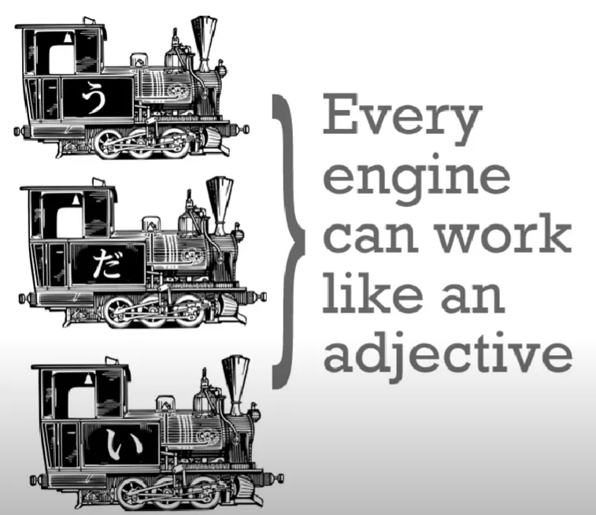

Mari kita mulai dari kelompok yang paling jelas dulu, yaitu kelompok yang padanannya paling mirip dengan kata sifat di bahasa Inggris.

## Kata sifat "い"

Contoh kalimat sederhana dengan engine "い" adalah: `ペンがあかい`. Seperti yang sudah kamu pahami dari bab sebelumnya, `あかい` (akai) itu tidak berdiri sendiri sebagai benda `merah`, melainkan sudah bermakna `is-red` (berwarna merah).

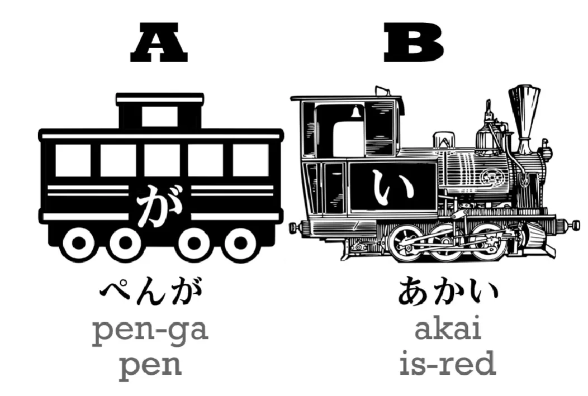

Sekarang, kita bisa mengubah warna engine hitam ini menjadi putih dan memindahkannya ke belakang kata pena. Sekarang kita memiliki: `あかいペンが`.

`あかいペン` berarti `is-red pen` atau, kalau diterjemahkan ke bahasa Indonesia normal, `red pen` (pena merah). Seperti yang kamu lihat, **susunan ini bukanlah sebuah kalimat utuh lagi. Kenapa? Karena si engine putih tidak lagi bertugas menarik rangkaian kereta, melainkan murni hanya memberikan detail informasi tambahan tentang benda apa pun yang berada di belakangnya.**

Jadi, begitu `あかい` berubah wujud menjadi engine putih, ia cuma berfungsi memberi tahu kita detail ciri-ciri dari gerbong utamanya, yaitu si `ペン` (pena). Kalau kita mau menjadikannya kalimat utuh, kita butuh sebuah engine baru. Mari kita pakai `ちいさい` (chiisai), yang berarti `is-small` (kecil).

`あかいペンがちいさい` – `The red pen is small` (Pena merah itu kecil).

Sangat simpel dan logis, kan?

## Menggunakan Kata Kerja sebagai Kata Sifat

Sekarang mari kita lihat bagaimana cara kerja kata kerja. Kalau selama ini kamu dibikin pusing oleh istilah "*Na-adjectives*" yang ada di buku teks—tenang, abaikan dulu. **Mereka itu sejatinya adalah kata benda**, dan kita akan membedahnya sebentar lagi. 

**Fakta paling krusial: Setiap kata kerja (Engine-う), dalam bentuk waktu (*tense*) apa pun, BISA digunakan layaknya sebuah kata sifat.**

Contoh, kita bisa membuat kalimat utuh: `しょうじょがうたった`. `歌った/うたった` (utatta) berarti `sang` (telah bernyanyi). Kata dasar untuk "bernyanyi" adalah `うたう` (utau), jadi bentuk lampau "た"-nya adalah `うたった`.

Jadi, `しょうじょがうたった` – `The girl sang` (Gadis itu bernyanyi).

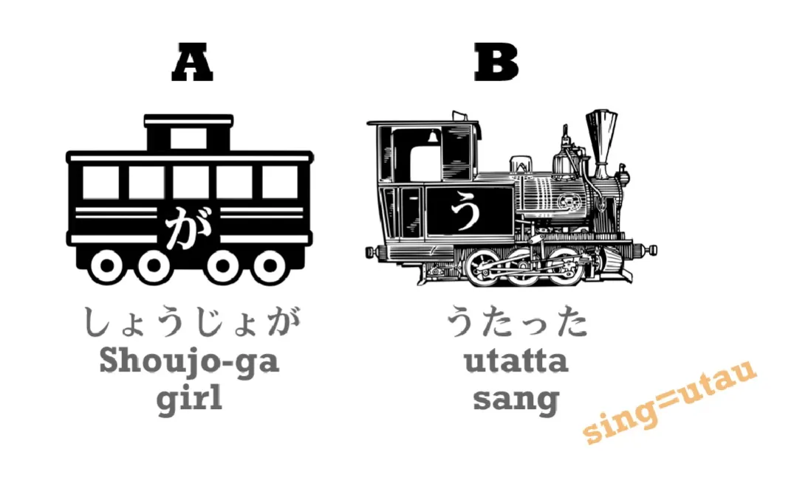

Nah, jika kita mengubah engine tersebut menjadi engine putih (sebagai pemodifikasi) dan meletakkannya di depan si gadis, kita akan mendapatkan: `うたったしょうじょ` – `the girl who sang` (Gadis yang bernyanyi itu).

Tentu saja, sama seperti contoh pena tadi, susunan ini bukanlah sebuah kalimat utuh. Tapi hebatnya, kita bisa menyisipkannya ke dalam kalimat baru apa pun yang kita suka, contohnya: `うたったしょうじょがねている` – `the girl who sang is sleeping` (Gadis yang bernyanyi itu sedang tidur).

**Konsep ini sangat amat penting, karena ada banyak sekali kalimat bahasa Jepang yang dirakit dengan cara seperti ini. Kita bisa mencopot satu kalimat utuh (yang mengandung kata kerja) lalu menggunakannya sebagai sebuah kata sifat raksasa kapan pun kita mau, dan hal ini sangat lazim dilakukan.**

Contoh lain: `いぬがじしょをたべた` – `the dog ate the dictionary` (Anjing itu memakan kamus).

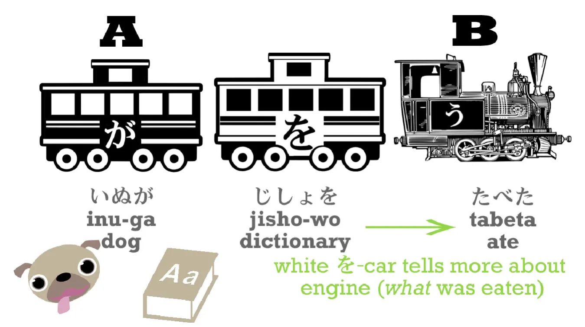

Kita bisa menyulapnya menjadi: `じしょをたべたいぬが` – `the dog who ate the dictionary` (Anjing yang memakan kamus itu).

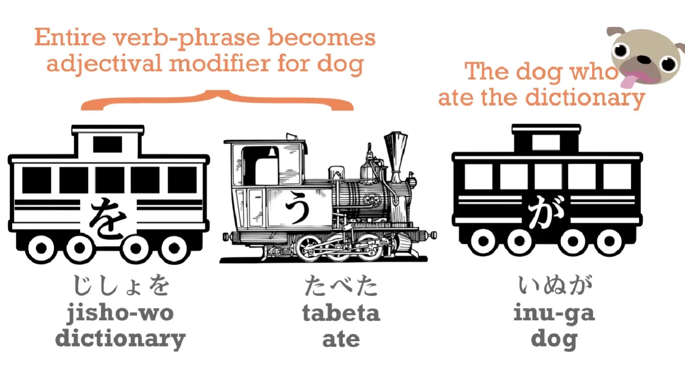

Atau kita bisa memutarnya menjadi: `いぬがたべたじしょ` – `the dictionary that was eaten by the dog` (Kamus yang dimakan oleh anjing itu).

> **Catatan Tambahan:**
> Dalam struktur bahasa Jepang murni, ini sama sekali bukan kalimat pasif. Hanya saja, saat kita menerjemahkannya ke dalam bahasa Inggris/Indonesia, kalimatnya agak sulit dibaca kalau tidak dipasifkan. Seperti yang bisa kamu lihat, logika struktur Jepangnya jauh lebih sederhana dan langsung ketimbang terjemahannya.

Lalu, bongkahan "kata sifat raksasa" ini bisa dikembangkan lagi menjadi sebuah kalimat utuh: `じしょをたべたいぬがやんちゃだ`. Kata `やんちゃ` (yancha) adalah kata benda yang berarti `naughty` (nakal). Jadi kalimat sempurnanya: `the dog who ate the dictionary is bad` (Anjing yang memakan kamus itu nakal).

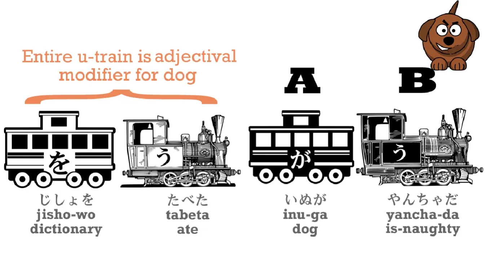

## Menggunakan Kata Benda sebagai Kata Sifat

Ini membawa kita ke pembahasan tentang "engine kata benda". Jika kita hanya mengatakan `いぬがやんちゃだ`, ini adalah kalimat kata benda yang sangat sederhana (Anjing = nakal). Namun, kita juga bisa mengubah engine kopula ini menjadi engine putih dan meletakkannya di depan si anjing. Syaratnya, ada satu perubahan mutlak yang harus kita lakukan.

**Ketika kita mengubah kopula `だ` atau `です` menjadi engine putih (untuk dihubungkan dengan benda di belakangnya), wujudnya BERUBAH dari `だ` menjadi `な` (na).**

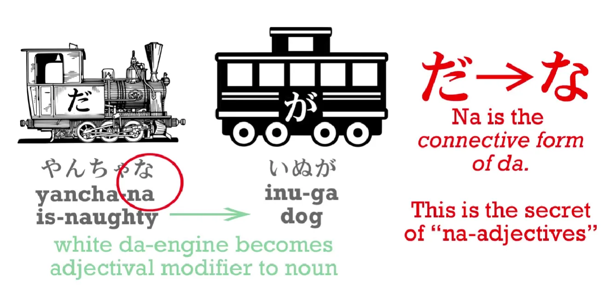

Jadi, kalimat asalnya `いぬがやんちゃだ`, tetapi saat dibalik posisinya menjadi `やんちゃないぬ`. Makna logisnya persis sama dengan `やんちゃだいぬ` – `is-bad dog / the dog that is bad / the bad dog` (Anjing yang nakal).

Lalu kita bisa merakitnya menjadi kalimat utuh: `やんちゃないぬがねている` – `the bad dog is sleeping` (Anjing nakal itu sedang tidur).

**Sekarang, hal terpenting yang perlu kamu garis bawahi di sini: kamu TIDAK BISA melakukan trik "na" ini ke sembarang kata benda. Hanya ada kelas/golongan kata benda tertentu yang memang khusus dan sering difungsikan sebagai kata sifat, yang bisa kamu olah dengan cara ini.**

Golongan inilah yang sering dilabeli oleh buku-buku teks dengan istilah `な-adjectives` (Kata Sifat-Na). Istilah ini lumayan menyesatkan, karena seperti yang baru saja kita buktikan, mereka sejatinya adalah sejenis kata benda. **Hanya saja, mereka merupakan sub-kelas tertentu dari kelompok kata benda.**

> **Info Penting:**
> Perhatikan frasa `sub-kelas tertentu dari kata benda`. Mereka ini BUKANLAH kata benda mandiri. Kamu tidak bisa menggunakan mereka sendirian sebagai sebuah subjek. Karena sifat ganda inilah para ahli tata bahasa memberikan nama yang berbeda-beda buat mereka di berbagai buku: Kata Benda Adjektival, Kata Sifat-Na, Kata Sifat Nominal, dll.
> Intinya, wujud fisik dan cara pakai mereka (yang butuh kopula/kata penghubung) itu mirip banget sama kata benda biasa, jadi mereka masuk dalam "rumpun" kata benda, meskipun peran spesifiknya murni sebagai pemberi sifat.

---

**Lalu pertanyaannya: apakah kita bisa menggunakan kata benda jenis lain (kata benda murni di luar kelas Na) sebagai kata sifat? Jawabannya: YA, BISA! Tetapi cara pemakaiannya sedikit berbeda dan mereka tidak menggunakan sistem "engine".**

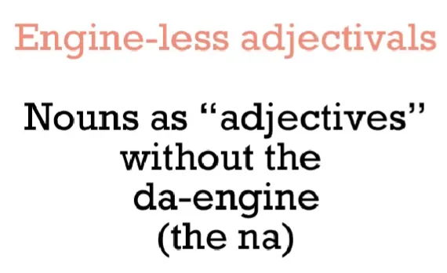

## Kereta "の"

Untuk menjelaskan hal ini, kita harus memasukkan satu jenis kereta baru ke dalam rangkaian kita. Namanya Kereta "の" (no). **Partikel の adalah partikel yang luar biasa simpel, karena fungsinya persis seperti tanda apostrof-s ('s) penunjuk kepemilikan di dalam bahasa Inggris.**

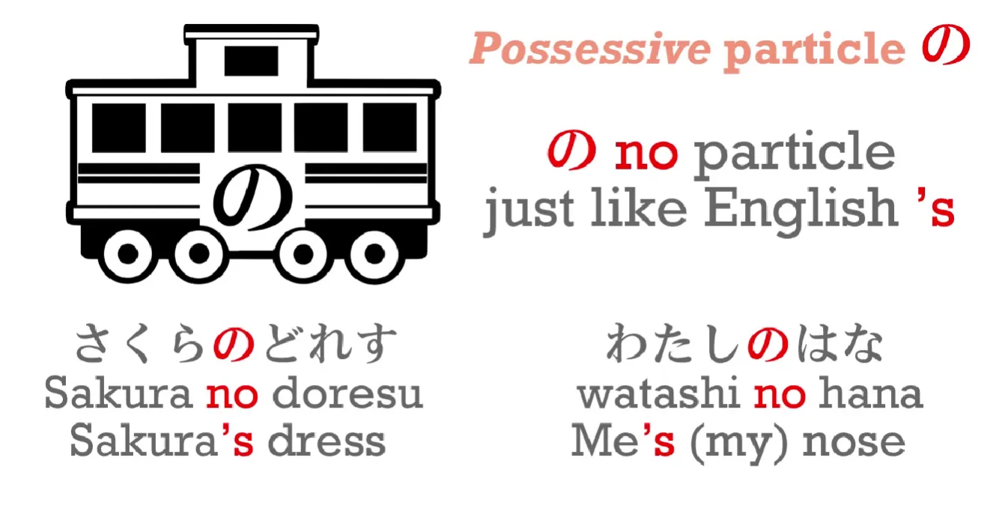

Jadi, `さくらのドレス` berarti `Sakura's dress` (Gaun milik Sakura). `わたしのはな/鼻` berarti `my nose` (Hidungku). 

> **Catatan Logika:**
> Atau seperti logika visual yang ditunjukkan pada gambar, secara harfiah artinya adalah `Me's nose`.

Untungnya, kita tidak perlu repot-repot menghafalkan berbagai bentuk perubahan kata ganti kepemilikan seperti `my`, `your`, `her`, dan `his` dalam bahasa Jepang. **Kita pukul rata, selalu cukup menggunakan `の`.**

---

Nah, karena `の` adalah partikel kepemilikan, fungsi ini bisa diperluas jangkauannya. Pada bagian pembuka video-video lama saya, saya selalu mengucapkan: `カワジャパのキュアドリです` – `(I am) KawaJapa's Cure Dolly` (*Cure Dolly miliknya KawaJapa*).

**Dengan kata lain, penggunaan partikel "の" ini menunjukkan bahwa KawaJapa adalah grup, komunitas, atau wadah tempat saya bernaung.**

Logika kepemilikan kelompok ini bisa kita pakai secara lebih luas untuk mendefinisikan "kelas/kategori" dari suatu benda. 
Mari kita ambil contoh kata warna. `あかい` berarti `red` (merah) karena kita punya fasilitas struktural untuk mengubah kata benda `あか` menjadi kata sifat murni berakhiran `あかい`. **Sayangnya, kita tidak bisa melakukan hal instan itu untuk semua warna.**

Ambil contoh `ピンクいろ` (pinku iro / warna pink). `いろ/色` berarti `color`. Jadi kalau kita bilang `ピンクいろ`, itu murni merupakan sebuah kata benda. **Kata tersebut tidak punya versi akhiran "-い". Dan kata tersebut juga tidak terdaftar ke dalam kelompok kata benda adjektival (atau "kata sifat-Na").**

Jadi, solusi untuk menjadikannya kata sifat adalah dengan menggunakan `の`. 
`ピンクいろのドレス` – `pink dress`. Arti struktural logisnya adalah: `dress belonging to the class of pink things` (**Gaun yang termasuk ke dalam kategori hal-hal berwarna pink**).

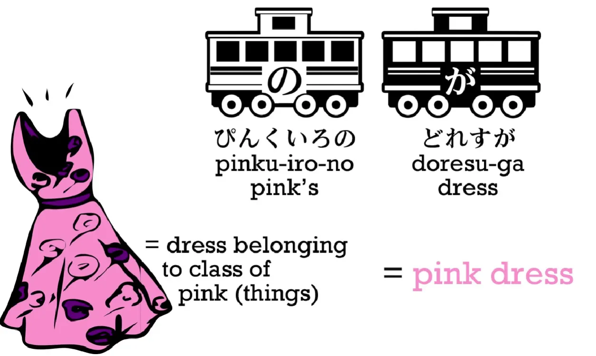

> **Catatan Tulisan:**
> Dolly menggunakan huruf Hiragana di videonya untuk menuliskan kata `Pink`. Di kehidupan nyata, kata-kata serapan asing seperti ini normalnya selalu ditulis menggunakan huruf Katakana (ピンク).

Contoh lainnya, jika kita ingin menyebut karakter `Oscar the Rabbit` (Oscar si Kelinci), kita akan mengatakannya: `ウサギのオスカル`. Secara harfiah frasa ini berarti `rabbit's Oscar`, yang logika aslinya adalah: `Oscar who belongs to the class "rabbit"` (**Oscar yang termasuk ke dalam golongan/kelas "kelinci"**).

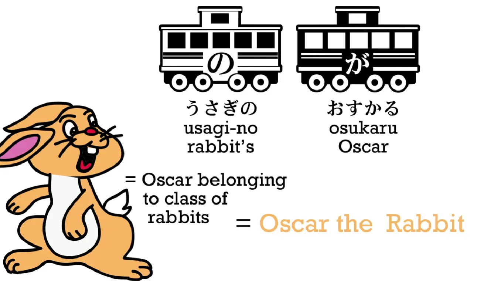

`ゼルダのでんせつ` berarti `the legend of Zelda`. `でんせつのせんし` berarti `legendary warrior`, yang logika aslinya adalah: **Ksatria yang termasuk ke dalam kategori hal-hal legendaris**.

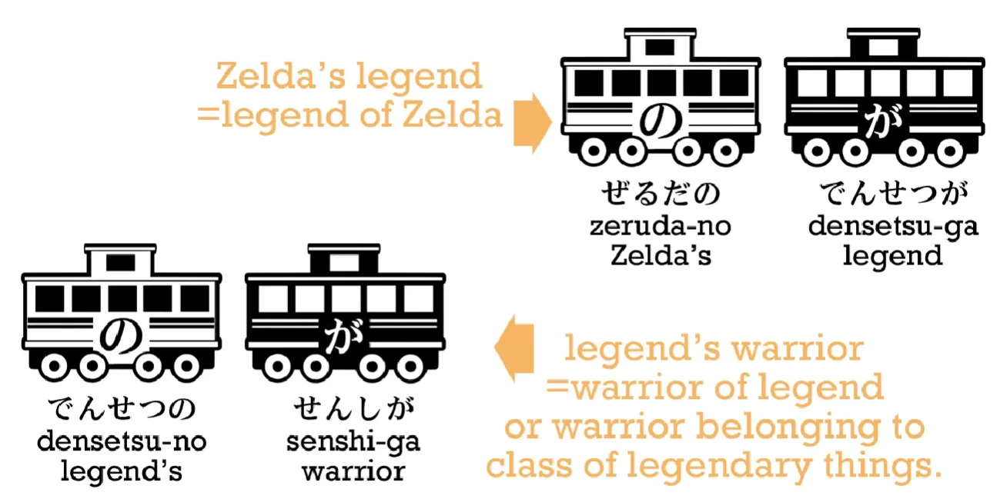

Sebagai kesimpulan, kita memiliki total empat jurus untuk merakit kata sifat: **menggunakan tiga engine, ditambah dengan satu gerbong "の".**

Hanya dengan berbekal keempat jurus ini, kita bisa menciptakan berbagai macam kalimat mulai dari yang sederhana hingga yang sangat kompleks—terutama jika dipadukan dengan trik "kata sifat verbal" di mana kita bisa membungkus satu kejadian panjang menjadi satu kata sifat besar pembidik benda.

Saya akan membuat beberapa [**lembar kerja**](https://learnjapaneseonline.info/2022/03/28/worksheets/) yang bisa membantumu terbiasa dengan struktur kalimat kompleks tersebut. Tautannya sudah saya cantumkan di bagian deskripsi di bawah [**video ini**](https://www.youtube.com/watch?v=iyVZlaEqU24&list=PLg9uYxuZf8x_A-vcqqyOFZu06WlhnypWj&index=12).

Sampai di titik ini, kamu mungkin mulai panik dan berpikir: `Karena ada golongan kata benda yang harus pakai "な" dan ada yang harus pakai "の", apakah itu artinya saya harus mulai mencari tabel dan menghafalkan daftar panjang mana benda yang pakai "の" dan mana yang "な"?`

Jawaban saya sangat tegas: **Saya sama sekali tidak melihat ada alasan logis untuk melakukan itu, KECUALI kalau kamu terpaksa harus mempelajarinya demi lulus ujian sekolah.**

Kenapa tidak perlu dihafal? Coba pikirkan pakai logika alamiah. Kalau kamu mendengar seseorang ngobrol menggunakan `の` atau `な`, otakmu pasti otomatis paham apa maksud mereka. Begitu juga sebaliknya, kalau kamu lagi ngomong lalu *kepleset* salah pasang akhiran, tidak ada orang Jepang yang akan kesulitan menangkap inti ucapanmu. Itu adalah kesalahan teknis super kecil yang sangat lumrah dilakukan bule (orang asing). Jujur saja, masalah sepele itu adalah hal paling terakhir yang harus kamu pusingkan di tahap awal belajar. Kalau kamu mau menulis sesuatu secara resmi, kamu kan bisa mencarinya di kamus dengan mudah.

---

**Seiring dengan makin seringnya kamu menggunakan bahasa Jepang, mendengarkan, dan membaca teks bahasa Jepang, otakmu akan membangun instingnya sendiri untuk menebak secara akurat mana yang pakai `の` dan mana yang pakai `な`.** 
Dan sebaliknya, kalau kamu memang tidak berencana untuk sering berinteraksi dengan bahasa Jepang, buat apa juga kamu repot-repot membuang waktu menghafal daftarnya?

Bagi saya, belajar bahasa Jepang itu bukanlah semacam *game* konyol untuk menghafal setumpuk informasi abstrak tanpa tujuan. Ini adalah bahasa yang mayoritas polanya bisa kita serap secara natural. Dan memahami struktur aslinya sejak awal akan sangat membantu proses penyerapan alami tersebut.

> **Pesan Semangat:**
> Kalau materi bab ini terasa terlalu berat dan bikin ngebul, saya selalu menyarankan untuk mampir membaca komentar-komentar diskusi di bawah [video](https://www.youtube.com/watch?v=iyVZlaEqU24&list=PLg9uYxuZf8x_A-vcqqyOFZu06WlhnypWj&index=12). Dan tentu saja, istirahatlah, baca ulang, dan resapi logikanya sedikit demi sedikit. Kamu pasti bisa! ＼(⌒▽⌒)
