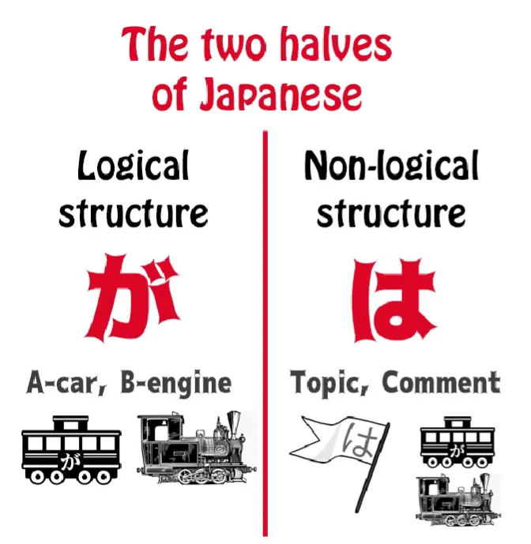
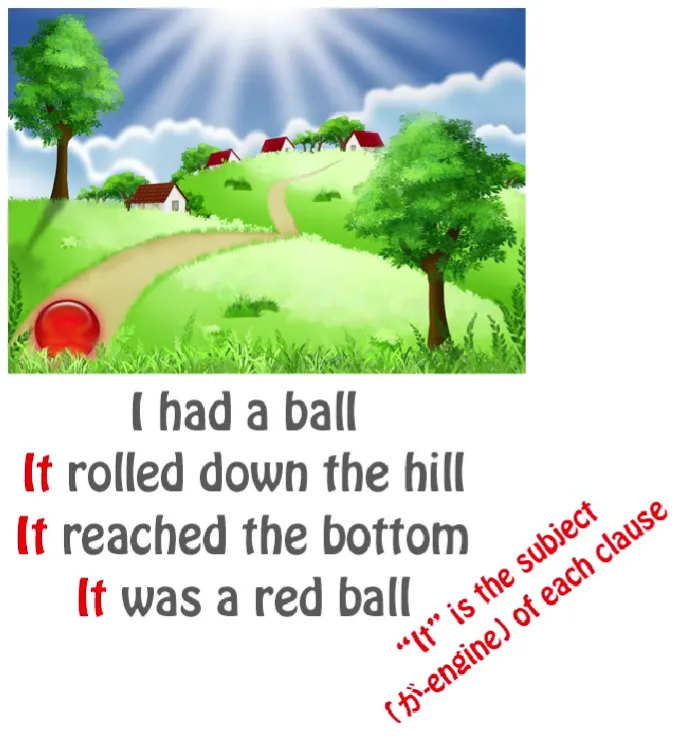
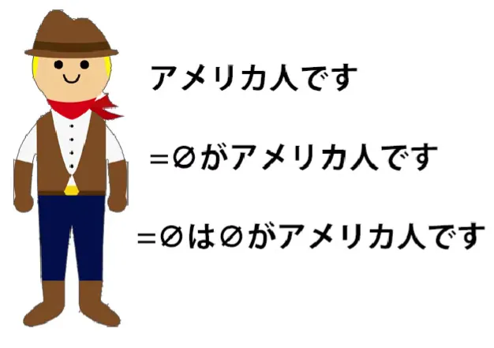
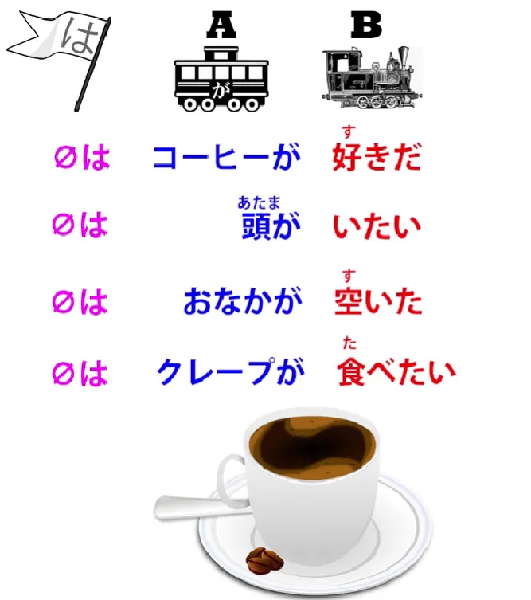
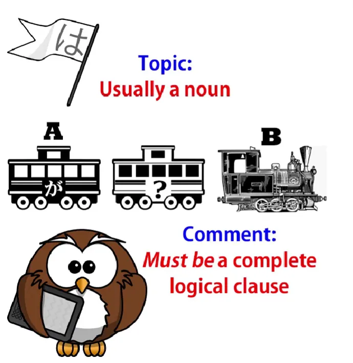
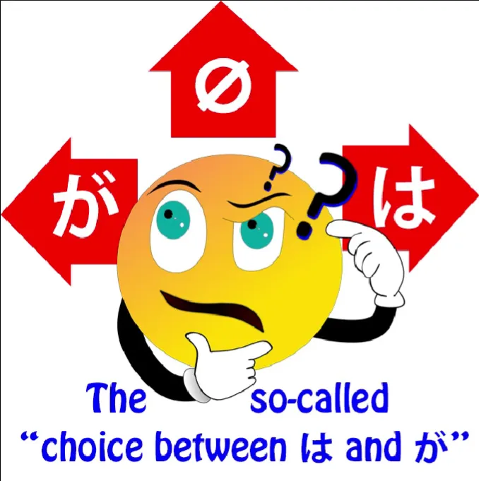

# **60. Bagian LAIN dari Struktur Bahasa Jepang - Struktur topik/komentar non-logis**

[**Bagian LAIN dari Struktur Bahasa Jepang - Struktur topik/komentar non-logis | Pelajaran 60**](https://www.youtube.com/watch?v=_nXHpkTTfGs&amp;list;=PLg9uYxuZf8x_A-vcqqyOFZu06WlhnypWj&amp;index;=62&amp;pp;=iAQB)

こんにちは。

Hari ini kita akan membahas salah satu
topik terpenting dalam struktur bahasa Jepang. Sebenarnya, ini adalah bagian lain dari struktur bahasa Jepang.

Kita telah sering menyebutnya. Anda tidak bisa benar-benar menguasai bahasa Jepang tanpa ini. Namun, kita belum pernah membahasnya secara langsung, dan itulah yang akan kita lakukan sekarang.

Yang akan kita bahas adalah struktur topik - komentar. Dan ini sama pentingnya dengan struktur logis, subjek - predikat, A-car - B-engine.

Dalam buku saya <code>*Unlocking Japanese*</code>, saya menyebut &quot;が&quot; sebagai raja bahasa Jepang dan &quot;は&quot; sebagai ratu bahasa Jepang. &quot;が&quot; adalah pemimpin Partikel logis, sisi logis dari bahasa tersebut.
&quot;は&quot; adalah pemimpin Partikel dan strategi non-logis,  
sisi non-logis dari bahasa tersebut.

Dan kita bahkan dapat mengatakan bahwa tidak hanya setiap kalimat Jepang memiliki  
sebuah A-car yang ditandai dengan &quot;が&quot;, terlepas dari apakah kita dapat melihatnya atau tidak, **setiap kalimat Jepang juga memiliki topik yang ditandai dengan &quot;は&quot;, terlepas dari apakah kita dapat melihatnya atau tidak.**

## Topik

Jadi, apa itu topik? Setiap bahasa memiliki topik; kebanyakan bahasa tidak, seperti bahasa Jepang, menonjolkan topik. Namun, untuk menjelaskan apa itu topik dalam bahasa Inggris, berikut contoh singkatnya.

Dalam bahasa Inggris, kita melacak topik dengan menggunakan kata ganti, dan itulah mengapa bahasa Inggris menggunakan begitu banyak kata ganti. Itulah mengapa dikatakan <code>it</code> pada saat itu.

Jadi, kita bisa mengatakan &quot;Saya punya bola. Bola itu menggelinding menuruni bukit. Bola itu sampai di bawah. Itu adalah bola merah.&quot;

Seperti yang Anda lihat, setiap kali bola ditandai dengan <code>it</code>, dan Anda mungkin mengatakan bahwa yang dilacak di sini adalah subjek, karena bola itulah yang menggelinding menuruni bukit, bola itulah yang mencapai dasar, bola itulah yang berwarna merah.

Tapi kita juga bisa mengatakan &quot;Aku punya sebuah bola. Aku menjatuhkannya. Bola itu menggelinding menuruni bukit. Ketika bola itu sampai di bawah, Sakura mengambilnya dan pergi membawanya.&quot;

Nah, kamu lihat, yang pertama <code>it</code> adalah objek dari tindakan saya menjatuhkannya: <code>I dropped it.</code> Yang kedua dan ketiga <code>it</code>: <code>It rolled down the hill... it reached the bottom</code> — dalam kedua kalimat itu, bola adalah subjeknya.

Dan kemudian <code>Sakura picked it up</code>, dan bola itu menjadi objek lagi, kali ini objek dari tindakan Sakura. Jadi <code>it</code> tidak melacak subjek, tidak melacak objek, melainkan melacak topik, hal yang sedang kita bicarakan.

Itulah yang dimaksud dengan topik.

Dan seperti yang saya katakan, bahasa Jepang selalu memiliki topik, meskipun kita tidak selalu bisa melihatnya.

Jadi, jika kita mengatakan <code>アメリカ人です</code>, biasanya kita akan memetakan kalimat tersebut sebagai <code>zeroがアメリカ人です</code> – <code>I am an American</code>, tetapi untuk lebih teliti, kita harus memetakan kalimat tersebut sebagai <code>**zeroは**zeroがアメリカ人です</code>, yaitu <code>I am the topic, I am the subject, and I&#x27;m an American.</code>

Kita tidak perlu melakukan semua itu setiap kali, tetapi penting untuk mengetahui bahwa hal itu ada. Ketika topik dan subjeknya sama, hal itu tidak terlalu penting, tetapi seperti yang kita ketahui, keduanya seringkali berbeda.

Dan dalam bahasa Jepang, jauh lebih sering daripada dalam bahasa Inggris, keduanya seringkali berbeda. Jadi, dalam kalimat seperti <code>コーヒーが好きだ</code>, <code>頭が痛い</code>, <code>おなかが空いた</code>, <code>クレープが食べたい</code>, semua ini adalah kalimat logis yang lengkap: <code>Coffee is likeable</code>; <code>Head hurts</code>; <code>Stomach is empty</code>; <code>Crepes are eat-want-inducing</code>.

Dalam setiap kasus, kita memiliki mobil A, kita memiliki engine B, kita memiliki klausa logis yang lengkap. Namun, meskipun secara logis lengkap, kalimat tersebut tidak lengkap secara tata bahasa tanpa memahami bahwa ada juga topik tak terlihat yang ditandai dengan は:

<code>**zeroは**コーヒーが好きだ</code>; <code>**zeroは**頭が痛い</code>;  
<code>**zeroは**おなかが空いた</code>; <code>**zeroは**クレープが食べたい</code>.

<code>**In relation to me**, coffee is likeable/pleasing</code>; <code>**In relation to me**, head hurts</code>; <code>**In relation to me**, stomach is empty</code>; <code>**In relation to me**, crepes are eat-want-inducing</code>.

Dan meskipun, seperti halnya subjek tak terlihat yang tidak ditandai dengan が, defaultnya adalah <code>I</code> tetapi tidak harus demikian <code>I</code>, sehingga hal yang sama berlaku untuk subjek tak terlihat yang ditandai dengan は.

Misalnya, jika kita melihat seseorang yang tinggi lewat dan kita berkata <code>背が高い、ね?</code>, secara harfiah, <code>back is high, isn&#x27;t it?</code> dan itulah cara kita mengatakan seseorang itu tinggi. Namun seperti yang Anda lihat, ini tidak lengkap tanpa subjek tak terlihat yang ditandai dengan は: <code>zeroは背が高い</code> – <code>In relation to that person, back is tall</code>.

Dan karena bahasa Jepang memiliki begitu banyak konstruksi yang tidak berpusat pada ego, seperti yang kita bahas dalam salah satu video sebelumnya[[9]](./9-the-subject-of-the-japanese-sentence-expressing-desire- ほしい - たい - たがる.md), begitu banyak konstruksi di mana baik &quot;A-car&quot; maupun &quot;B-engine&quot; sebenarnya bukanlah orang yang dimaksud, seperti semua contoh yang baru saja kita bahas, **sangat penting dalam banyak kasus agar kita memahami bahwa topik yang ditandai dengan は ada di sana.**

Dan hal lain yang perlu kita pahami tentang struktur topik-komentar adalah bahwa **komentar selalu merupakan klausa logis yang lengkap.**

Topik biasanya berupa kata benda (bisa juga yang lain) **tetapi komentar selalu dan harus selalu berupa klausa logis yang lengkap.** Ini adalah sesuatu yang tidak dijelaskan dalam buku teks, dan mungkin merupakan hal yang baik bahwa mereka tidak menjelaskannya, karena jika mereka melakukannya, saya rasa kita tahu bagaimana mereka akan melakukannya.
Mereka akan menyajikannya sebagai semacam aturan Oriental aneh yang harus kita hafal.

Tapi bukan itu masalahnya: ini adalah keharusan logis. Seperti yang kita ketahui, setiap kalimat, setiap klausa logis, harus memiliki A-car dan B-engine, subjek dan predikat,  
dan seperti yang kita ketahui dari pelajaran ketiga kita tentang は, **kata は tidak pernah dapat menandai baik A-car maupun B-engine, atau elemen lain dari kalimat logis. Ia hanya dapat menandai topik non-logis.**

Artinya, jika kita ingin memiliki kalimat sama sekali, kedua elemennya harus berada di luar topik. Kita harus memiliki topik dan juga harus memiliki A-car, serta harus memiliki B-engine.

---

Oleh karena itu, setiap kalimat topik-komentar hanya memiliki dua unsur, yaitu topik dan komentar. **Kedua unsur klausa logis tersebut harus berada di dalam komentar.** Oleh karena itu, secara logis, dalam kalimat topik-komentar, komentar selalu merupakan klausa logis.

Dalam [**video**](https://www.youtube.com/watch?v=9l_ZlQQU4ZE) saya telah membahas, dan akan membahas lagi, tentang beberapa implikasi dari apa yang disebut pilihan antara &quot;は&quot; dan &quot;が&quot;; apa artinya ketika kita menandai sesuatu dengan &quot;は&quot;, apa artinya ketika kita menandainya dengan &quot;が&quot;.

Dan ada banyak implikasi yang terlibat di sini. Saya tidak akan membahasnya dalam video ini, tetapi Anda dapat menonton [**video lainnya**](https://www.youtube.com/watch?v=9l_ZlQQU4ZE) dan saya akan menampilkan kartu untuk itu.

Namun, hal yang perlu diingat di sini karena kita sedang membahas struktur sebenarnya, adalah bahwa ketika orang membicarakan pilihan antara は dan が, hal itu membingungkan dan agak menyesatkan karena menyiratkan bahwa は dan が agak mirip,  
bahwa keduanya melakukan pekerjaan yang serupa.

**Dan kita tahu bahwa sebenarnya tidak demikian. Kita tahu bahwa** **keduanya adalah jenis partikel yang benar-benar berbeda.**

Dan yang kita ketahui dari pelajaran ini adalah bahwa yang sebenarnya kita lakukan **ketika kita membuat** **pilihan antara は dan が adalah kita memilih** **mana dari dua elemen yang selalu ada yang akan ditampilkan, apakah kita menampilkan は, が, atau tidak menampilkan keduanya.**

Jadi kita bisa mengatakan <code>アメリカ人です</code>, kita bisa mengatakan <code>私はアメリカ人です</code>, dan kita bisa mengatakan <code>私がアメリカ人です</code>. Dan masing-masing memiliki implikasi yang sedikit berbeda.

Ketika kita sebenarnya tidak memilih antara は dan が, yang kita pilih untuk lakukan adalah menonjolkan, dengan membuatnya terlihat, sifat topik dari subjek atau sifat subjek dari topik, atau keduanya tidak.

Dan mana yang kita pilih untuk ditonjolkan memiliki implikasi besar terhadap apa yang kita katakan dan apa yang kita maksudkan…
