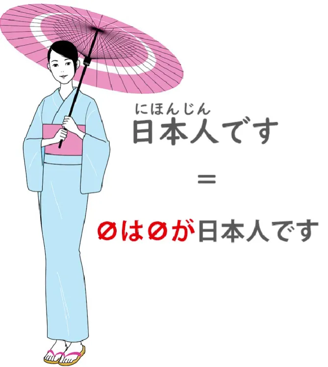
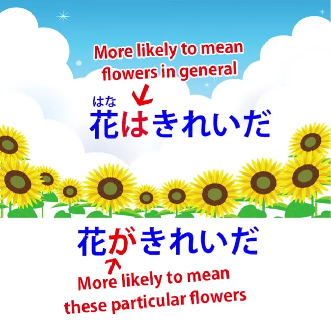
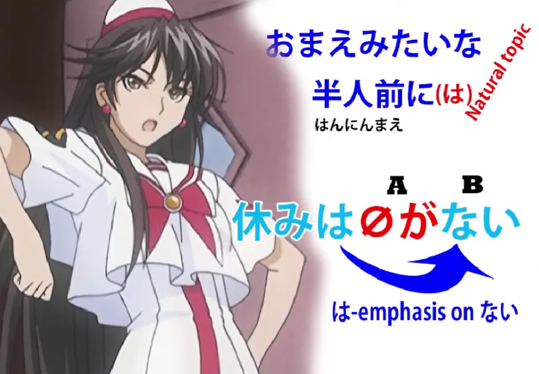

# **61. は dan が: Rahasia yang Lebih Dalam! Struktur Yin-Yang dalam Bahasa Jepang**

[**WA dan GA: Rahasia yang Lebih Dalam! Struktur Yin-Yang dalam Bahasa Jepang | Pelajaran 61**](https://www.youtube.com/watch?v=o-hK4-qv9Yk&amp;list;=PLg9uYxuZf8x_A-vcqqyOFZu06WlhnypWj&amp;index;=63&amp;pp;=iAQB)

こんにちは。

Hari ini kita akan membahas makna yang lebih halus dari partikel &quot;は&quot; dan &quot;が&quot;, serta implikasi yang dapat timbul dari penggunaannya yang berbeda. Minggu lalu[[60]](./60-the-other-half-of-japanese-structure-non-logical-topic-comment-structure.md) kita telah membahas fakta bahwa struktur topik-komentar merupakan hal mendasar dalam bahasa Jepang.

Setiap kalimat dalam bahasa Jepang memiliki topik serta subjek, sehingga dapat dikatakan bahwa ketika topik dan subjek tidak dinyatakan secara eksplisit, kalimat dalam bahasa Jepang memiliki &quot;が&quot; yang tak terlihat dan &quot;は&quot; yang tak terlihat. Jadi, <code>日本人です</code>, artinya <code>I am a Japanese person</code>, secara ketat <code>zeroはzeroが日本人です</code> — <code>I am the topic, I am the subject, and I am a Japanese person.</code>

Secara keseluruhan, kita tidak perlu khawatir tentang は yang tidak terlihat, dan itu karena dalam bahasa Inggris dan bahasa-bahasa terkait, kita biasanya tidak perlu menyatakan topik secara eksplisit. Kita memang perlu menyatakan subjek secara berulang-ulang, sehingga kita merasa sedikit bingung jika tidak tahu di mana letaknya. Dan itulah mengapa kita menggunakan model &quot;が&quot; yang tidak terlihat.

Namun, hal penting yang kita simpulkan dalam pelajaran terakhir adalah bahwa pilihan yang disebut-sebut antara &quot;は&quot; dan &quot;が&quot;, yang tentu saja hanya ada dalam kalimat di mana topik dan subjek kebetulan sama, dan apa yang kita lakukan sebenarnya bukan membuat topik atau subjek: kita menekankan fakta bahwa sesuatu adalah topik atau subjek. Dan pilihan ini penting untuk implikasi yang akan kita berikan pada topik/subjek tersebut. Dan untuk memahami implikasi tersebut, kita memang harus memiliki gambaran tentang cara paling alami untuk mengungkapkannya.

Dan inilah mengapa saya selalu mengatakan bahwa struktur itu penting, tetapi Anda tidak bisa memahami bahasa Jepang hanya dengan struktur saja. **Anda harus memiliki cukup paparan untuk memahami apa yang terdengar alami.** Dan dari itu ditambah penggunaan struktur, Anda dapat memahami implikasi apa yang dibuat oleh pernyataan tertentu.

---

Sekarang, ketika kita memperlakukan sesuatu sebagai topik dan menandainya dengan は atau も, **ini tidak boleh berupa informasi baru.** Sama seperti dalam bahasa Inggris jika kita mengatakan, <code>Speaking of Melfrog Pooftoofular</code>, tidak ada gunanya mengatakan itu jika pendengar Anda tidak tahu siapa atau apa <code>Melfrog Pooftoofular</code> itu. Anda harus mulai dengan memperkenalkannya <code>Melfrog Pooftoofular</code> terlebih dahulu.

**Jadi, penanda topik hanya dapat menandai informasi lama.** Dan ini penting karena informasi lama adalah informasi yang tidak penting. Informasi baru adalah apa yang sebenarnya ingin Anda sampaikan kepada seseorang. Begitulah cara bahasa bekerja. Kita tidak seharusnya memberitahu orang hal-hal yang sudah mereka ketahui. Kita seharusnya menambahkan sesuatu yang tidak mereka ketahui, dan itulah isi informasi sebenarnya dari pernyataan tersebut.

Jadi, dalam arti tertentu, &quot;は&quot; bekerja seperti <code>the</code> dalam bahasa Inggris, hanya dalam satu hal ini, yaitu tidak dapat menandai informasi baru. Jadi, jika kita mengatakan <code>I fed the iguana</code>, kecuali orang-orang sudah tahu tentang iguana ini, mereka akan langsung berkata, &quot;Iguana apa? Kamu belum pernah membicarakan iguana sebelumnya. Apa yang kamu bicarakan, &#x27;the iguana&#x27;?&quot;

Jika kamu mengatakan <code>I fed an iguana</code>, itu tidak masalah. Dan kita juga perlu memahami bahwa **konsep informasi lama versus baru dan informasi penting versus tidak penting ini sangat erat kaitannya.**

Jadi, Anda sebenarnya bisa mengatakan <code>I fed the dog</code> tanpa ada yang tahu bahwa kamu bahkan punya anjing, karena sangat normal dan wajar bagi seseorang untuk memiliki anjing. Mereka tidak terlalu ingin berhenti dan meminta penjelasan tentang hal itu. Jadi <code>I fed the dog</code> akan diartikan sebagai <code>I fed the dog that I keep at home, even though you didn&#x27;t know I kept a dog at home, you do now</code>.

Jika saya mengatakan <code>I fed the iguana</code>, itu akan menghentikan percakapan. Jika Anda tidak memperkenalkan iguana terlebih dahulu, tidak ada yang akan menganggapnya sebagai hal yang sudah diketahui — <code>Yes-yes, she&#x27;s got an iguana at home, like most people.</code>

Jadi Anda lihat bahwa meskipun secara linguistik kita mengatakan <code>new information</code> dibandingkan <code>old information</code>, hal itu sedikit lebih rumit dari itu. Ini <code>new, important, relevant information</code> versus <code>old information or information that we can easily take as read</code>. Dan bahkan ini adalah cara yang cukup kasar untuk menggambarkannya.

Mari kita lihat bagaimana hal semacam ini bekerja dalam praktiknya dalam bahasa Jepang. Jika kita mengatakan <code>本を買った</code>, ini adalah cara paling umum untuk mengatakannya <code>I bought a book</code>. Seperti yang kita ketahui, subjek tak terlihat secara default berarti <code>I</code> ketika konteks tidak memberi tahu kita bahwa itu adalah hal lain. Jadi <code>本を買った</code> tidak memberikan penekanan khusus pada apa pun; ini hanya mengatakan, secara netral, <code>I bought a book</code>.

Sekarang, dalam kalimat ini, <code>I</code> adalah subjek dan topiknya. Jika kita memilih untuk menekankan <code>I</code> sebagai topik dan mengatakan <code>私**は**本を買った</code>, **kita sedang <code>私</code> menjadi informasi lama, pembelian buku menjadi informasi baru, dan karena itu, は memiliki fungsi pembeda.**

---

Ketika kita menggunakan &quot;は&quot;, kita sedang menetapkan atau mengubah topik.  
Dan bahkan menetapkan topik pada kebanyakan kasus berarti mengubahnya, karena kita dapat mengasumsikan ada topik sebelumnya. Jadi kita mengubah topik menjadi <code>I</code> dan mengatakan bahwa saya membeli sebuah buku.

Dan kita tahu bahwa apa yang dilakukan oleh &quot;は&quot; bukan hanya mengubah topik menjadi apa pun yang ditandainya (dalam hal ini <code>I</code>) **tetapi juga menyiratkan bahwa komentar pada topik baru  
berbeda dari komentar pada topik lama.** Dan jika sebenarnya tidak ada topik lama, hal itu tetap menyiratkan bahwa komentar tersebut berbeda dari komentar **pada topik-topik lain yang mungkin ada.**

Jadi, <code>私は本を買った</code> pada dasarnya mengatakan &quot;Yang saya lakukan adalah membeli sebuah buku. Anda mungkin telah membeli sesuatu yang lain, orang lain mungkin tidak membeli apa pun, tetapi yang saya lakukan adalah membeli sebuah buku.&quot; Kita menekankan fakta bahwa **saya membeli sebuah buku dibandingkan dengan topik-topik lain yang mungkin ada** **yang tidak membeli buku.**

Ini berarti bahwa secara implisit ini adalah jawaban atas pertanyaan yang mungkin sebenarnya belum diajukan: <code>What did you do?</code> Jawaban atas <code>What did I do?</code> adalah <code>I bought a book</code> saat Anda memberi tanda <code>I</code> dengは

---

Sekarang, jika Anda mengatakan <code>私が本を買った</code>, Anda telah mengubah penekanan. **Anda telah membalikkan penekanan.** Informasi lama sekarang adalah pembelian buku dan **informasi baru adalah <code>I</code>.**

Jadi, dalam keadaan apa Anda mengatakan itu? Nah, misalkan orang-orang melihat ruang kosong di rak buku dan bertanya-tanya apa yang terjadi, lalu Anda berkata <code>私が本を買った</code> – <code>I&#x27;m the one who bought the book.</code> Kita semua tahu bahwa buku itu hilang, kita tahu sesuatu telah terjadi pada buku itu, sekarang saya memberi Anda informasi baru: **<code>I</code> adalah orang yang membeli buku itu.**

Jadi, meskipun <code>私は本を買った</code> secara implisit merupakan jawaban atas pertanyaan <code>What did you do?</code>, <code>私が本を買った</code> secara implisit merupakan jawaban atas <code>Who bought the book?</code>

---

Penting juga untuk memahami apa cara alami dan netral untuk mengatakan sesuatu. Kita tahu dalam kasus ini bahwa cara alami dan netral untuk mengatakan <code>I bought a book</code> tanpa menekankan apa pun hanyalah dengan mengatakan <code>本をかった</code>.

Jadi, jika kita mengatakan <code>私は</code> atau <code>私が</code>, **kita secara khusus menekankan suatu poin di sini.** **Kita menambahkan sesuatu pada pernyataan netral bahwa saya membeli sebuah buku.**

Sekarang, dari arah penekanan ini ke depan atau ke belakang,  
は, dan が dapat menandai hal-hal khusus sebagai lawan dari hal-hal umum.

Jadi, misalnya, jika kita mengatakan <code>花が綺麗だ</code>, kita menekankan <code>花</code> sebagai subjek dan ini berarti <code>The flower (or these flowers) are pretty</code>. <code>Pretty</code> adalah yang penting, tetapi subjek sebenarnya adalah <code>these flowers</code>. Bunga-bunga inilah yang cantik, ini adalah bunga-bunga yang cantik.

Jika kita mengatakan <code>花は綺麗だ</code>, kemungkinan besar kita mengatakan bahwa bunga pada umumnya cantik. Kita tidak menyoroti bunga tertentu sebagai subjek; kita menjadikan <code>flowers</code> topiknya, dan informasi baru yang penting adalah keindahan. **Bunga itu sendiri bukanlah hal baru.** Bunga adalah sesuatu yang sudah kita ketahui sejak lama. **Fakta bahwa bunga itu indah adalah komentar saya, penilaian saya terhadap bunga.**

<code>花が綺麗だ</code> – bunga-bunga dianggap sebagai sesuatu yang baru. Mereka dianggap sebagai subjek tertentu itu sendiri, sehingga kita lebih mungkin membicarakan bunga-bunga tertentu daripada bunga pada umumnya.

---

Sekarang, sepanjang waktu kita membicarakan kecenderungan di sini, bukan? Tidak ada alasan logis atau struktural mengapa mengatakan <code>I fed the iguana</code> berbeda dengan mengatakan <code>I fed the dog</code>. Hal itu menjadi berbeda karena ekspektasi.

Kita mengharapkan seseorang sangat mungkin memiliki anjing, sehingga ini bukanlah informasi baru atau penting. Kita tidak mengharapkan seseorang memiliki iguana, sehingga ini dianggap sebagai informasi baru dan penting, dan Anda tidak bisa menyelinapkannya dengan <code>the</code> seperti halnya dengan anjing.

**Demikian pula, &quot;が&quot; dapat menandai materi baru maupun materi lama,  
tetapi &quot;は&quot; tidak dapat menandai materi baru.** **&quot;は&quot; dapat menandai hal-hal spesifik maupun hal-hal umum, tetapi &quot;が&quot; tidak benar-benar dapat menandai hal-hal umum.**

Jadi, kita sedang membicarakan nuansa yang cukup halus di sini. Sekarang, mengetahui cara biasa untuk mengatakannya, sekali lagi, adalah hal yang memberikan penekanan pada penggunaan strategi yang berbeda.

Jadi, seperti yang saya bahas dalam [**video sebelumnya**](https://www.youtube.com/watch?v=9l_ZlQQU4ZE) tentang は dan が (yang saya sarankan untuk ditonton, karena mencakup beberapa materi yang tidak saya bahas di sini), kita tahu bahwa <code>雨が降っている</code> berarti <code>it&#x27;s raining</code>. Ini adalah cara biasa untuk mengatakan sedang hujan. Kita menggunakan &quot;が&quot;. Kita tidak bisa menggunakan &quot;nothing&quot; karena kita harus menyebutkan apa yang jatuh, dan kita biasanya tidak menggunakan &quot;は&quot;.

Jadi <code>雨が降っている</code> hanya berarti <code>rain is falling</code>. <code>雨は降っている</code> adalah sesuatu yang akan Anda katakan ketika mungkin ada ekspektasi bahwa akan turun salju.

Hujan adalah topiknya dan komentarnya adalah bahwa hujan sedang turun, dengan implikasi bahwa jika topiknya berbeda, komentarnya juga akan berbeda, karena **kita menggunakan &quot;は&quot;** bukan &quot;も&quot;, dan **&quot;は&quot; adalah penanda topik eksklusif, sedangkan** **&quot;も&quot; adalah penanda topik inklusif.**

---

Sekarang, ini tidak hanya digunakan untuk membedakan; ini juga digunakan karena menonjolkan penekanan. Ini juga digunakan untuk penekanan.

Jadi, saya akan mengambil contoh dari salah satu anime favorit saya, yaitu Aria the Animation. Sayangnya, saya rasa anime ini tidak memiliki subtitle bahasa Jepang, jadi Anda mungkin harus menunggu sebentar sebelum menontonnya. Saya tahu Anda tidak pernah menonton apa pun dengan subtitle bahasa Inggris lagi dan saya mengucapkan selamat atas hal itu.

Jadi kalimatnya adalah <code>おまえみたいな半人前に休みはない</code>. <code>おまえみたいな半人前に休みはない</code> Dan artinya adalah <code>For trainees like you, there are no rests</code>.

Sekarang, menarik untuk memperhatikan apa yang terjadi di sini. Apa topik dari kalimat ini? Sebenarnya, <code>trainees like you</code>: <code>おまえみたいな半人前に</code> bisa saja <code>おまえみたいな半人前には</code> dan ini akan menjadikan <code>trainees like you</code>, dan komentar atas hal ini adalah klausa logis <code>休みがない</code> — <code>there are no rests</code>.

---

**Namun, penutur telah memilih untuk melakukan sesuatu yang berbeda.** **Dia memilih untuk mengurangi penekanan pada topik dengan tidak menandainya menggunakan kata &quot;は&quot;,** **tetapi hal ini tidak menghentikan kalimat tersebut menjadi topik.** Kalimat tersebut tetap menjadi topik yang dikomentari oleh klausa logis.

Dan **dia telah menjadikan <code>休み</code> — <code>rests</code>.** Mengapa dia melakukan itu?

**Karena ketika Anda menjadikan sesuatu sebagai topik, meskipun itu semacam subtopik seperti ini,** **Anda mengalihkan penekanan ke bagian yang mengikutinya.** Anda menjadikan bagian yang mengikutinya sebagai informasi yang menonjol dan penting dalam kalimat tersebut.

Jadi, yang dimaksud di sini adalah <code>休みは *(zeroが)* ない</code> — <code>As for rests, *(they)* don&#x27;t exist</code>: <code>For trainees like you, as for rests, *(they)* don&#x27;t exist.</code> Nah, ini tidak sesulit kedengarannya dalam bahasa Inggris karena &quot;は&quot; adalah partikel yang jauh lebih fleksibel dan dapat digunakan dengan lebih mudah daripada hal-hal seperti <code>as for</code> dalam bahasa Inggris.

Namun, partikel ini menggunakan strategi dasar yang sama untuk memusatkan seluruh penekanan kalimat tersebut pada kata terakhir, <code>ない</code> — <code>they don&#x27;t exist</code> — <code>forget about rests, you&#x27;re not getting any.</code>

Sekarang, saya harap ini membuat partikel penanda topik &quot;は&quot; dan partikel penanda subjek &quot;が&quot; sedikit lebih jelas dalam implikasi yang lebih dalam dan halus…

::: info
Ini mungkin hal yang cukup sulit untuk dipahami, seperti biasa, komentar di bawah [**video**](https://www.youtube.com/watch?v=o-hK4-qv9Yk&amp;ab;_channel=OrganicJapanesewithCureDolly) mungkin bisa sedikit membantu. Otak pada akhirnya akan memahaminya melalui masukan alami dan mudah dipahami melalui paparan organik aktif terhadap bahasa dan penggunaannya yang aktif. Teruslah berusaha (•̀o•́)ง
:::
