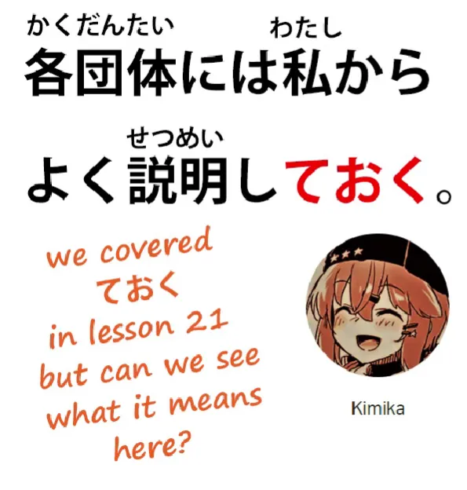
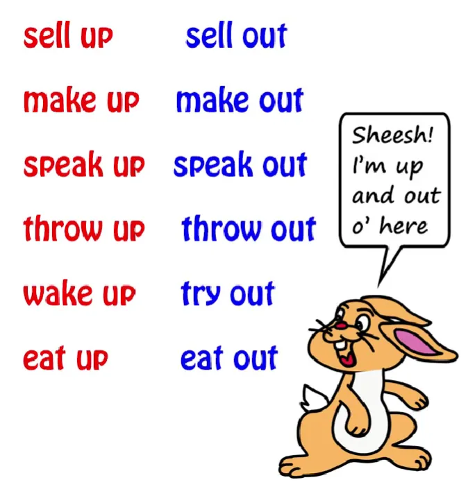
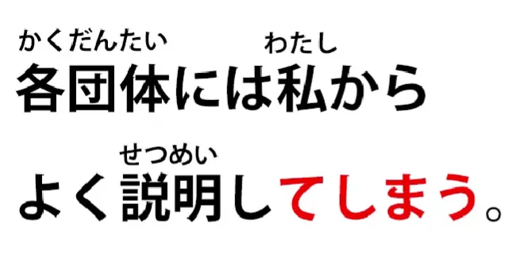

# **62.ておく

vsてしまう

, rahasia kata bantu**

[**Te-oku vs te-shimau, rahasia kata bantu.ておく

てしまう

| Pelajaran 62**](https://www.youtube.com/watch?v=q6vDkjv4ac0&amp;list;=PLg9uYxuZf8x_A-vcqqyOFZu06WlhnypWj&amp;index;=64&amp;pp;=iAQB)

こんにちは。

Hari ini kita akan mulai membahas apa yang saya sebut jembatan antara pembelajaran struktural dan imersi nyata, karena kita mempelajari ungkapan dan struktur, namun terkadang ketika menemukannya dalam penggunaan nyata, kita tidak sepenuhnya memahami fungsinya di sana.

Saya akan mengambil contoh dari pendukung saya, Kimika-sama, yang memberikan kalimat ini kepada saya:

<code>各団体には私からよく説明しておく</code>Sekarang, Kimika-sama mampu menerjemahkan kalimat ini dengan cukup tepat (secara umum artinya dalam bahasa Inggris

<code>I will give each group a good explanation from me</code>),

tetapi masih belum memahami mengapa <code>おく</code> digunakan sebagai kata kerja bantu untuk <code>説明する</code>.

Dan untuk memahaminya lebih mendalam, saya pikir kita perlu meneliti hal ini sedikit lebih dalam. Ini adalah fakta bahwa orang Jepang sangat menyukai kata kerja bantu mereka dan sering menggunakannya dalam berbagai situasi. Apakah ini sesuatu yang dapat kita pahami dari sudut pandang bahasa Inggris?

Saya akan mengatakan ya, memang begitu. Kita melakukan hal yang sama dalam bahasa Inggris, meskipun tidak terlalu sering dengan kata kerja melainkan dengan preposisi, terutama preposisi <code>up</code> dan <code>out</code>.

Kita menghabiskan makanan, kita mengada-ada, kita berteriak, kita kalah, kita memikirkan ide, kita merumuskan ide, dan seterusnya. Sekarang, **Bahasa Jepang tidak memiliki preposisi sama sekali.** **Sama sekali tidak ada.** Jika Anda berpikir ada, sudah waktunya membuang buku teks itu ke luar jendela.

Yang digunakan sebagai pengganti preposisi-preposisi Bahasa Inggris <code>up</code>, <code>out</code>, dan seterusnya, adalah kata kerja — kata kerja bantu. Dan perbedaan antara kata kerja bantu dalam bahasa Jepang dan preposisi bantu dalam bahasa Inggris adalah, pertama-tama, jumlahnya jauh lebih banyak dan, karena itu, maknanya jauh lebih spesifik. Jika Anda melihat berbagai cara penutur bahasa Inggris menggunakan <code>up and </code>menggunakan<code> — they even </code>&quot;peace out&quot;, apa pun artinya — Anda bisa melihat bahwa karena jumlahnya hanya sedikit, kata-kata itu digunakan di mana-mana dalam segala macam situasi dan hanya ada sedikit alasan yang mendasari cara penggunaannya.

---

Sekarang, karena ada lebih banyak kata kerja bantu, penggunaannya bisa jauh lebih terarah. Jadi, meskipun digunakan secara luas dalam berbagai situasi, kita umumnya dapat mengetahui apa yang dilakukan oleh kata kerja bantu tertentu, asalkan kita memahami bahwa kita memerlukan interpretasi yang cukup luas.

Jadi, apa <code>-ておく</code> yang dilakukannya di sini sebenarnya sama dengan yang selalu dilakukannya. Jika kita mengatakan <code>窓を開けておく</code>, yang kita maksud adalah  
&quot;buka jendela agar jendela itu terbuka dan kemungkinan ventilasi akan masuk ke dalam ruangan&quot;.

Buka jendela itu untuk suatu tujuan, lakukan tindakan tersebut:

<code>おく</code>, yang berarti <code>put in a place</code>. Lakukan tindakan tersebut agar kemudian　  
mengubah keadaan sesuai dengan yang kita inginkan. Dalam hal ini, mengudara ruangan.

Dan hal yang sama berlaku untuk <code>説明</code> di sini. <code>説明しておく</code> — lakukan tindakan menjelaskan, atau berikan penjelasan, sehingga setelah itu, setiap kelompok akan memahami apa yang sedang terjadi, mereka tidak akan lagi kebingungan mengenai hal itu.

---

Sekarang, kita dapat membandingkan ini dengan kata kerja bantu lain yang sangat umum, yaitu <code>しまう</code> dan berbagai variannya seperti <code>ちゃった</code>, <code>じゃった</code> dll. Kita bisa mengatakan <code>説明してしまう</code>, tetapi itu akan memiliki implikasi yang sama sekali berbeda.

Dalam kasus khusus ini, itu mungkin berarti sesuatu seperti  
&quot;Aku akan langsung menjelaskan kepada mereka, meskipun itu bukan yang diharapkan dariku, atau mungkin bukan yang orang-orang ingin aku lakukan.  
Aku akan langsung menjelaskan kepada mereka — <code>説明してしまう</code> 

Dalam situasi lain, kita mungkin mengatakan sesuatu seperti

<code>聞かないでよ。さくらは説明してしまうから</code>,

yang berarti <code>Don&#x27;t ask, because Sakura will explain</code>

Namun, yang <code>しまう</code> mungkin menyiratkan sesuatu seperti  
&quot;Jangan tanya, karena jika kamu melakukannya, Sakura akan menjelaskan dan kita akan terjebak di sini selama berjam-jam dengan penjelasan panjang lebar Sakura.&quot;

Jadi, <code>しまう</code> memiliki beragam implikasi, beberapa di antaranya negatif, tidak semuanya negatif, tetapi <code>おく</code> memiliki rentang makna yang sama sekali berbeda.

---

**<code>しまう</code> berbicara tentang melanjutkan dan  
melakukan sesuatu, sesuatu yang terjadi secara tidak sengaja;**

Seperti yang saya katakan dalam video di <code>しまう</code>[[44]](./44-how-to-use-natural-japanese- ちゃう - ちゃった.md), pada dasarnya ketika dalam bentuk lampau, semua hal yang bisa kita maksudkan dengan <code>done</code> — <code>I done explained</code>, <code>I done fell over</code>, <code>she done stole my cake</code>, <code>I done won the lottery</code> — tidak harus negatif, tetapi memiliki nuansa seru seperti tanda seru.

**Itu terjadi, meskipun Anda mungkin tidak mengharapkannya atau mungkin tidak menginginkannya.**

**Itu terjadi.**

---

**<code>おく</code> tidak memiliki nuansa tanda seru.**

**Ini memiliki nuansa yang lebih praktis:**

itu dilakukan untuk mewujudkan tindakan, untuk mencapai hasil, untuk mengubah keadaan dari apa yang sebelumnya menjadi sesuatu yang lebih sesuai dengan apa yang kita inginkan, baik itu membuka jendela atau menjelaskan kepada beberapa kelompok apa situasi yang sedang terjadi…
