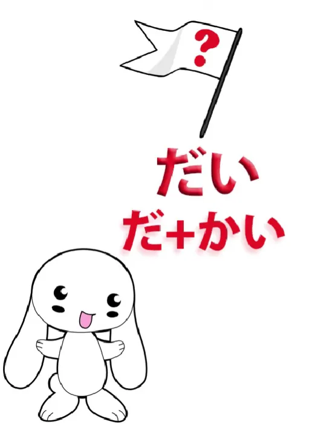
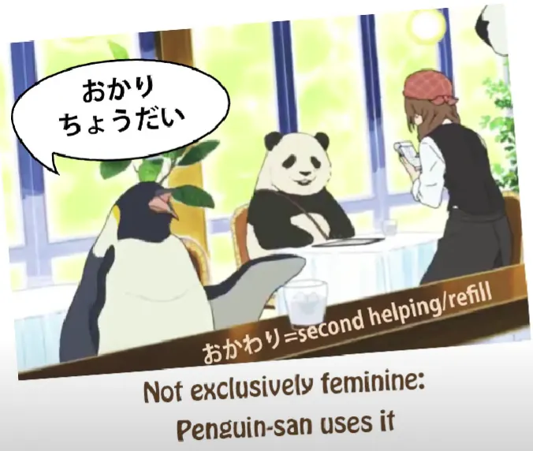
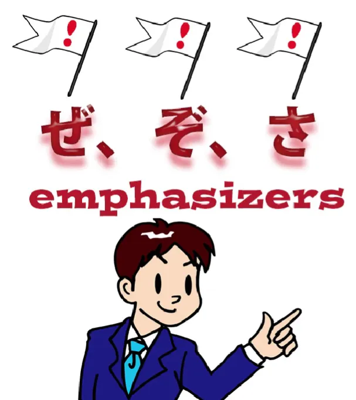
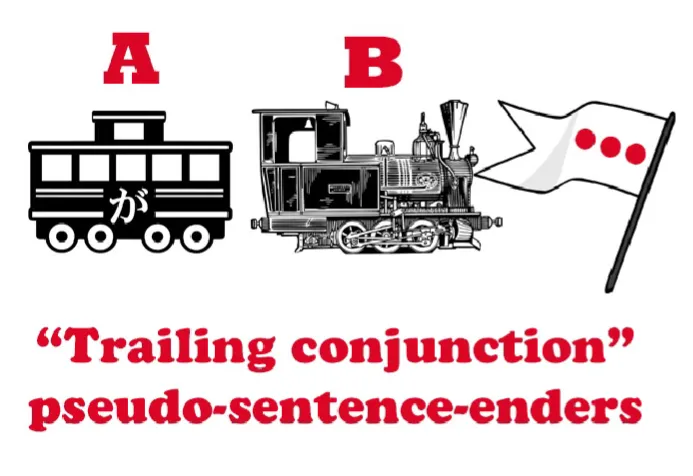

# **63. Penutup kalimat WILD dalam bahasa Jepang sehari-hari かい、だい, 、ぜ、ぞ、さ、から、し、ちょうだい**

[**Penutup kalimat WILD dalam bahasa Jepang sehari-hari かい、だい, 、ぜ、ぞ、さ、から、し、ちょうだい | Pelajaran 63**](https://www.youtube.com/watch?v=CVJ4jTlxyno&amp;list;=PLg9uYxuZf8x_A-vcqqyOFZu06WlhnypWj&amp;index;=65&amp;pp;=iAQB)

こんにちは。

Hari ini kita akan membahas beberapa hal lain yang langsung menyadarkan kita begitu kita meninggalkan taman tertutup bahasa Jepang teoretis dan menjelajah ke hutan liar bahasa Jepang yang sesungguhnya. Salah satu hal yang sering ditanyakan orang kepada saya adalah berbagai akhiran kalimat yang mereka temui. Dan saya tidak sedang membicarakan yang biasa-biasa saja seperti <code>ね</code>, <code>よ</code> dan <code>な</code> – saya sudah membuat [**video**](https://www.youtube.com/watch?v=IWEok4Ivfyc) tentang itu jika Anda tertarik dan saya akan menaruh tautannya di atas.

Tapi hari ini kita akan membahas beberapa penutup kalimat yang lebih kasual dan tidak konvensional yang akan Anda temui begitu Anda terjun ke <code>wild Japanese</code>  
dalam anime, manga, dll.

## かい

Jadi, salah satu yang sering ditanyakan kepada saya adalah <code>かい</code>,  
dan <code>かい</code> hanyalah bentuk yang lebih lembut dan kasual dari <code>か</code>. Seperti yang kita ketahui, <code>か</code> biasanya digunakan dalam bahasa Jepang formal, di mana kita menggunakan akhiran &quot;です&quot; / &quot;ます&quot; di akhir kalimat untuk membentuk pertanyaan. Jadi kita mengatakan <code>何々しますか / 何々ですか</code>.

Namun dalam bahasa Jepang sehari-hari, kita tidak terlalu sering menggunakan <code>か</code> sebagai penanda pertanyaan di akhir kalimat sesering itu. **Kita memang menggunakannya di posisi lain** — dan saya telah membuat video tentang berbagai cara kita menggunakan <code>か</code>[[39]](./39-the- か -particle-buried-questions- かな - もんか - かどうか.md) dan saya akan menyertakan tautan untuk itu di atas juga. Namun, secara umum, kita cenderung tidak menggunakannya dalam percakapan informal di akhir kalimat yang menandai pertanyaan, seperti yang dilakukan dalam bahasa Jepang です / ます.

Dan itu bukan karena tidak sesuai tata bahasa, sebenarnya itu sangat sesuai tata bahasa, tetapi dalam bahasa Jepang modern hal itu terdengar sedikit kasar, jadi meskipun Anda mungkin mendengarnya di antara pria yang sedang <code>one of the boys</code> bersama-sama, Anda tidak sering mendengarnya dalam percakapan wanita atau dalam ucapan siapa pun yang berusaha bersikap sopan. Jadi, apa yang harus kita lakukan? Sebagian besar waktu, kita cukup menggunakan intonasi naik dalam percakapan atau tanda tanya dalam tulisan saat menggambarkan percakapan santai. Dan tidak ada yang salah dengan hal ini.

Bahasa Spanyol terus-menerus membentuk pertanyaan dengan hanya menambahkan intonasi naik pada kalimat pernyataan yang setara dan tidak ada masalah di sana. Tidak ada masalah juga dalam bahasa Jepang. Terkadang kita menambahkan <code>の</code>, yang ambigu, karena bisa menandai baik pertanyaan maupun pernyataan, tetapi sekali lagi itu tidak terlalu penting karena intonasi berfungsi dengan baik.

Namun, kita memang memiliki penanda pertanyaan informal yang tidak terdengar kasar <code>かい</code>. Anda mungkin berpikir bahwa itu akan digunakan sepanjang waktu, **tetapi tidak**,  
karena memang terdengar sangat kasual dan terkadang sedikit... yah, seperti bahasa rakyat. Beberapa sumber mengatakan bahwa itu terutama digunakan oleh pria dan itu setengah benar. Anda tidak akan sering mendengar penutur perempuan muda menggunakannya, tetapi Anda kadang-kadang mendengar penutur perempuan yang lebih tua menggunakannya.

## &quot;だい&quot; (&amp; &quot;どうだい&quot;)

<code>かい</code> juga memiliki pasangan, yaitu <code>だい</code>.

**<code>だい</code> sebenarnya <code>だ</code> ditambah <code>かい</code>.**

Jadi ini adalah bentuk <code>かい</code> yang kita gunakan dalam  
kalimat yang diakhiri dengan kata penghubung, <code>だ</code>kalimat yang diakhiri dengan.

Dan hampir semua yang saya katakan tentang <code>かい</code> juga berlaku untuk <code>だい</code>,  
**kecuali** bahwa ada kolokasi tertentu, <code>どうだい</code>, yang jauh lebih umum digunakan. Jadi, jika seseorang sedang makan sesuatu dan Anda berkata <code>どうだい?</code> — <code>what&#x27;s it like? / how is it?</code> — dan mereka mungkin berkata <code>おいしい/美味しい!</code> atau mereka mungkin berkata <code>まずい/不味い</code>, tetapi **bertanya dengan cara itu adalah sesuatu yang bisa dilakukan siapa saja asalkan dalam suasana informal.**

## ちょうだい

Orang-orang juga sering menemui ungkapan <code>ちょうだい</code>, **dan itu tidak terkait dengan <code>かい</code> atau <code>だい</code> sama sekali;**
**itu adalah padanan informal dari <code>ください</code>.** Jadi biasanya ditambahkan ke bentuk て dari sebuah kata kerja untuk meminta seseorang melakukan sesuatu. Kadang-kadang dianggap sebagai bahasa perempuan **tetapi tidak eksklusif demikian.**

## ぜ、ぞ、さ

Penanda akhir kalimat lain dalam percakapan santai adalah <code>ぜ</code>, <code>ぞ</code> dan <code>さ</code>. Sekarang, <code>ぜ</code> dan <code>ぞ</code> sangat sederhana. Keduanya hanyalah tanda seru verbal yang memberikan sedikit penekanan pada apa pun yang Anda katakan. **Keduanya cukup kasar dan benar-benar merupakan gaya bicara maskulin**
**dan Anda mungkin akan lebih sering melihatnya**
**di anime dan manga daripada di kehidupan nyata.**

<code>さ</code> serupa tetapi tidak sekeras itu. **Ini jauh lebih umum digunakan**, Anda akan sering melihatnya, dan mendengarnya di kehidupan nyata. Biasanya disebut sebagai bahasa maskulin, tetapi sekali lagi **ini bukan bahasa maskulin eksklusif**. Semua jenis orang menggunakannya.

**Penting untuk tidak mengacaukan <code>さ</code>, penutup kalimat yang memberi penekanan,**
**dengan <code>さあ</code>, yang muncul di awal kalimat dan lebih merupakan ekspresi jeda untuk berpikir.**

---

Sekarang, ada juga penutup kalimat **yang sebenarnya bukan penutup kalimat tetapi secara efektif berfungsi sebagai penutup kalimat**, karena orang-orang memang sering menggunakannya setelah kata kerja di akhir kalimat.

  
Di sini, Dolly juga menyarankan untuk menonton [**video**](https://www.youtube.com/watch?v=Au5JOtcwE7A&amp;ab;_channel=OrganicJapanesewithCureDolly) tentang pseudo-enders, のに &amp; なのに masing-masing.

Salah satunya adalah <code>から</code>.

## から <code>sentence-ender</code>

Sekarang, <code>から</code>, seperti yang Anda ketahui, **secara teknis bukanlah penutup kalimat.**
**Yang sebenarnya adalah sebuah konjungsi yang menghubungkan dua klausa logis untuk membentuk kalimat majemuk.** Jadi, penggunaan yang tepat dari <code>から</code> mungkin adalah: <code>さくらが来ないから帰ります</code>, yang berarti  
<code>Because Sakura isn&#x27;t coming, I&#x27;m going home / Sakura isn&#x27;t coming, so I&#x27;m leaving</code>.

Namun, Anda mungkin cukup mengatakan saat Anda pergi, <code>さくらが来ないから</code>,  
dan itu hanya berarti membiarkan bagian lain dari kalimat tidak diucapkan karena sudah jelas. Sekarang, dari situ, <code>から</code> dapat ditambahkan ke banyak kalimat untuk menyiratkan bahwa ada hal lain yang akan datang.

**Hal lain yang dimaksud itu tidak selalu sepenuhnya jelas.** Faktanya, <code>から</code> mungkin menjalankan fungsi untuk melunakkan apa yang ditandainya atau justru memperkuatnya.

Hal itu dapat melunakkannya dengan membuat pernyataan tersebut terasa seperti penjelasan; hal itu dapat memperkuatnya dengan membuatnya terdengar seolah-olah merupakan bagian dari argumen logis atau bagian dari penalaran alami yang seharusnya dipahami dan disetujui oleh pendengar.

Jadi, misalnya, jika Anda sedang mengendarai sepeda di tempat yang tidak boleh dikendarai sepeda dan seseorang yang berwenang menghampiri Anda dan berkata <code>自転車に乗るのは禁止ですから</code> \[nada sopan\], itu bersifat mendamaikan, dan sebenarnya yang ingin mereka katakan hanyalah <code>It&#x27;s forbidden to ride a bicycle around here</code>, tetapi dengan menambahkan <code>から</code> di bagian akhir, mereka seolah-olah melunakkannya, mengubahnya menjadi penjelasan untuk Anda.

Sebaliknya, mereka mungkin berkata <code>自転車に乗るのは禁止ですから</code> \[nada tegas\], dan itu memiliki implikasi yang berbeda. Di situ, <code>禁止</code> ditekankan dengan lebih keras karena <code>から</code>.

Jadi, <code>から</code> dapat memiliki berbagai macam penggunaan, seringkali bergantung pada konteks, cara pengucapannya, sikap orang yang mengatakannya, dan situasi secara keseluruhan.

## Partikel penutup kalimat &quot;し&quot;

<code>し</code> adalah partikel penutup kalimat lain yang sangat umum, yang mirip dengan <code>から</code> dan memiliki makna di bidang yang sama. <code>し</code> sebenarnya dapat menggabungkan berbagai kondisi atau pernyataan, **tetapi penggunaan yang paling umum dan lazim adalah untuk menggabungkan alasan.**

Jadi, misalnya, kita mungkin mengatakan, <code>遅くなったしさくらが来ないし帰ります</code>, dan itu berarti &quot;Karena sudah larut dan karena Sakura tidak datang, aku pulang&quot;. Dan **ini adalah jenis penggunaan <code>し</code>.**

---

Namun, kita sering menggunakannya hanya untuk satu kondisi, yang menyiratkan kondisi lainnya. Misalnya, jika kita mengatakan <code>遅くなったし帰ります</code>, kita mengatakan <code>because it&#x27;s gotten late, I&#x27;m going home</code>, **tetapi kita juga menyiratkan bahwa fakta bahwa sudah larut bukanlah satu-satunya alasan:** <code>Because it&#x27;s gotten late (and for other reasons) I&#x27;m going home.</code>

Dan ini, dalam kasus khusus ini, mungkin menyiratkan bahwa bukan hanya karena sudah larut, **tetapi juga karena Sakura tidak datang, namun kita tidak menyebutkan bagian yang lebih pribadi dari hal tersebut.**

Sebaliknya, kita mungkin mengatakan <code>さくらが来ないし帰ります</code> dan kali ini kita telah memasukkan bagian yang paling penting, alasan sebenarnya kita pergi, tetapi dengan mengatakan <code>し</code> daripada <code>から</code> kita juga mengatakan <code>Because Sakura isn&#x27;t coming (and for other reasons) I&#x27;m leaving.</code>

**Hal ini berfungsi untuk mengurangi tekanan pada Sakura.** Meskipun dia mungkin alasan utamanya, kita sedikit meredamnya dengan menyiratkan bahwa ada alasan lain juga.
**Dan kita mungkin melakukan ini ketika sebenarnya tidak ada alasan lain sama sekali,**
**hanya sebagai cara untuk melunakkan dan meredam pernyataan tersebut.**

Contoh lain mungkin adalah, misalkan kamu sedang mengendarai sepeda lagi di tempat yang seharusnya tidak boleh kamu kendarai, dan kali ini seorang teman mendekatimu dan berkata, <code>自転車に乗るのは禁止し</code>.

::: info
Ya, biasanya, setelah 禁止, akan ada だ sebelum し. Namun karena ini bersifat santai, bagian tersebut dihilangkan.
:::
Sekarang, **perbedaan antara ini dan <code>から</code> pernyataan**
**hanyalah bahwa <code>し</code> mengurangi intensitasnya.** Artinya, &quot;Oh, karena dilarang mengendarai sepeda di sini dan karena alasan lain...&quot;

**Sekarang, tidak ada <code>other reasons</code> sama sekali, tetapi**
**yang dilakukan ini adalah membuatnya terdengar sedikit lebih santai, sedikit lebih ramah**,  
dan sedikit mengaburkan <code>から</code> yang bisa terdengar terlalu seperti perintah. Ini hanya mengatakan <code>Oh, for that and other reasons</code>.

Dan <code>vaguing up</code> sering terjadi dalam bahasa. Dalam bahasa Inggris, hal ini sering dilakukan dengan menambahkan kata-kata seperti <code>like</code> atau <code>kinda</code> pada apa yang Anda katakan.

Sekarang, cara kerja akhiran kalimat ini tidak bisa dipelajari hanya dari struktur atau dari pengajaran abstrak saja. **Kita perlu membenamkan diri dalam bahasa Jepang untuk merasakan**
**apa yang dimaksud orang ketika mereka mengatakan hal-hal ini.**

Namun sebaliknya, memahami strukturnya, memahami bagaimana semuanya benar-benar saling berkaitan, memberi kita dorongan yang signifikan dalam memahami pengalaman imersi kita. Ini mirip seperti tali dan mendaki gunung.

::: info
Memang, ini sedikit dimodifikasi …agak…\*batuk\*…aneh… ╮(︶▽︶)╭  
*Jika Anda memiliki tali, itu akan membantu Anda mendaki gunung,
:::

tetapi jika Anda hanya berdiri menatap dan mempelajari segala hal tentang tali, Anda tidak akan pernah sampai ke puncak gunung. Sebaliknya, jika Anda mencoba mendaki gunung tanpa tali, Anda mungkin tidak akan jauh-jauh…
