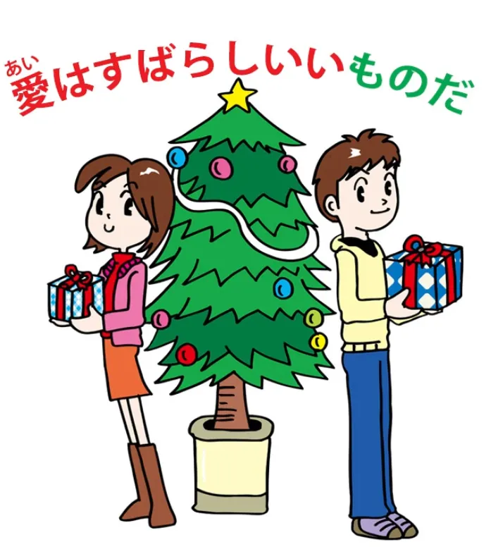
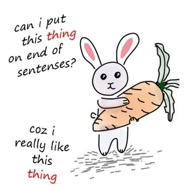
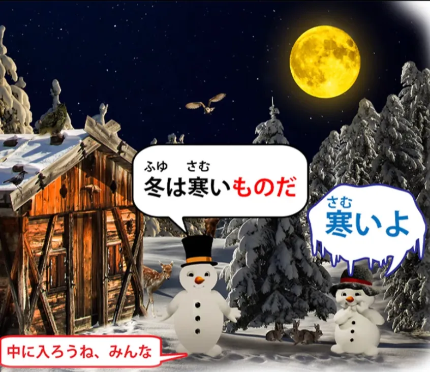
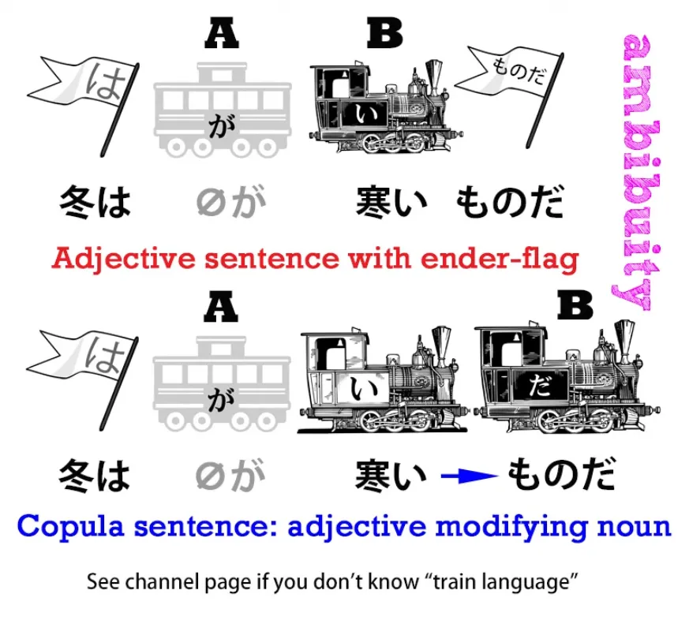
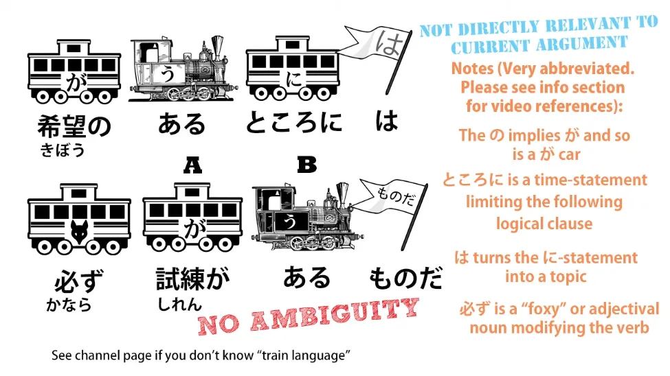
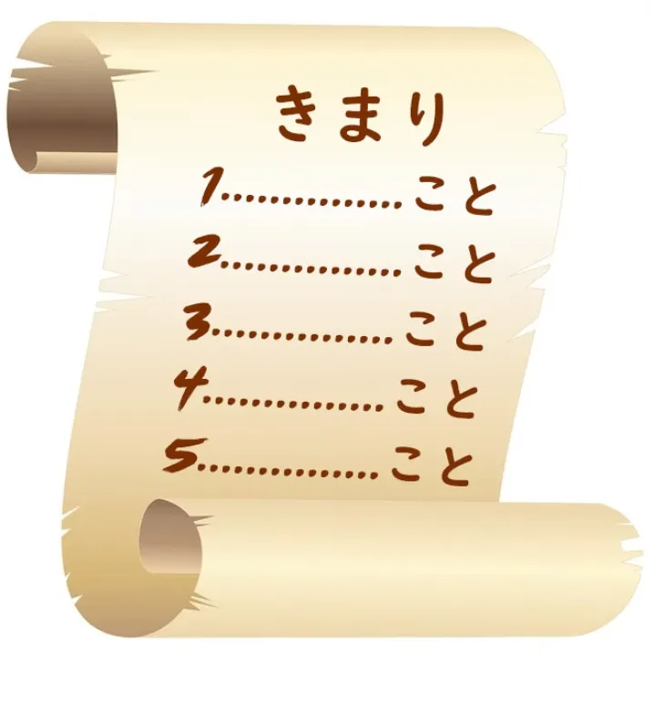
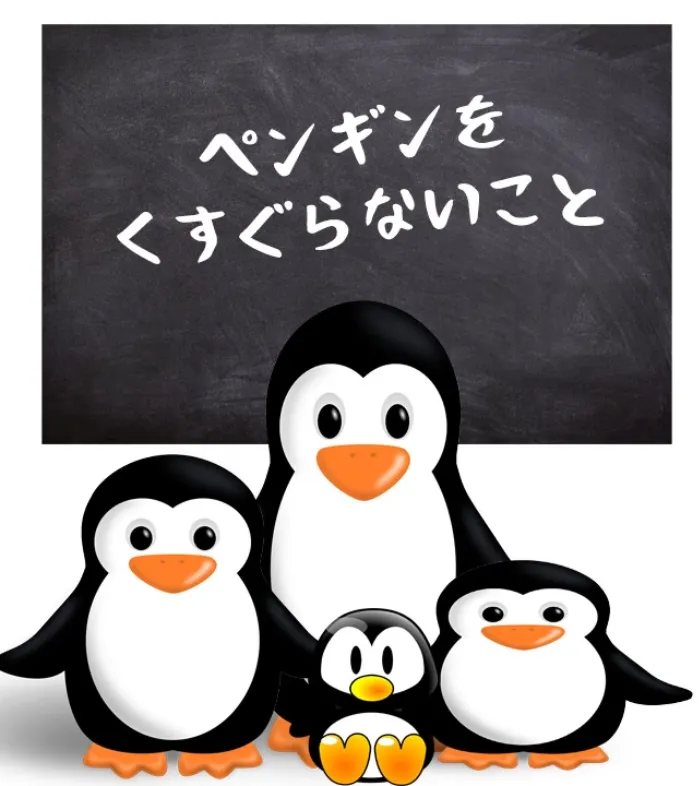

# **64. <code>Things</code> Dapatkan Strange! もの dan こと - Rahasia tingkat lanjut: ものだ, ことがある, こと sebagai penutup kalimat**

[**<code>Things</code> get Strange! Mono dan Koto: rahasia lanjutan: ものだ, ことがある, こと sebagai penutup kalimat | Pelajaran 64**](https://www.youtube.com/watch?v=aYlgQaK7lS4&amp;list;=PLg9uYxuZf8x_A-vcqqyOFZu06WlhnypWj&amp;index;=66&amp;pp;=iAQB)

こんにちは。

Hari ini kita akan membahas <code>もの</code> dan <code>こと</code> dalam beberapa arti yang lebih kompleks.

Nah, di awal kursus ini kita sudah membahas <code>もの</code> dan <code>こと</code>, dan saya mengatakan apa yang biasanya orang katakan, yaitu bahwa <code>もの</code> adalah benda konkret, seperti pensil atau apel atau pohon, dan <code>こと</code> adalah hal yang abstrak, seperti situasi, keadaan, atau tindakan.

Nah, hal ini secara umum benar dan tentu saja merupakan cara terbaik untuk memahaminya di awal, tetapi kemudian kita menemui beberapa situasi lain yang tampaknya tidak sesuai dengan hal tersebut.

Salah satu pendukung saya menulis untuk mendiskusikan kalimat: <code>愛はすばらしいいもの</code>, yang artinya <code>Love is a wonderful thing</code>.

Sekarang, tentu saja cinta itu abstrak. Anda tidak bisa memasukkannya ke dalam kotak dan membawanya dari Kyoto ke Tokyo. Jadi, apa yang terjadi di sini?

Patrons saya mengatakan bahwa dia mencarinya di berbagai situs pembelajaran bahasa Jepang dan mereka sama sekali tidak bisa menjelaskannya. Mereka hanya mengatakan bahwa Anda harus mempelajari kasus mana yang digunakan <code>もの</code> dan kasus mana yang harus digunakan <code>こと</code>.

Ini sama sekali bukan masalahnya. Apa yang <code>もの</code> yang sebenarnya dimaksudkan adalah sebuah <code>thing</code>. Dan suatu benda adalah kata benda, jadi bisa berupa benda konkret seperti apel atau buku atau alam semesta, tetapi juga bisa berupa benda abstrak seperti cinta atau kebahagiaan. Ini semua adalah kata benda.

Jadi <code>愛はすばらしいいものど</code> adalah satu-satunya cara untuk mengatakannya, karena <code>ai</code> adalah <code>もの</code>, bukan <code>koto</code>. Itu adalah kata benda. Itu adalah benda. Itu bukan keadaan, bukan tindakan, bukan kondisi. Itu adalah benda.

Dan kita perlu mengingat hal ini saat kita melihat beberapa makna yang lebih luas dari <code>もの</code> dan <code>こと</code>, saat kita mulai melihat <code>もの</code> dan <code>こと</code> kadang-kadang digunakan sebagai semacam penutup kalimat.

Namun sebelum kita membahas hal itu, mari kita lihat beberapa penggunaan lain dari <code>こと</code>. Nah, salah satu yang paling umum adalah <code>したことがある</code>.

Misalnya, kita mungkin mengatakan <code>日本に行ったことがある</code>. Dan itu berarti <code>I have been to Japan</code>.

Dan, seperti yang Anda lihat, <code>I have been to Japan</code> adalah jenis pernyataan yang berbeda dari <code>I went to Japan</code>. <code>I went to Japan</code> merujuk pada satu kejadian tertentu saat pergi ke Jepang. <code>I have been to Japan</code> mengatakan bahwa di masa lalu, mungkin pada satu kesempatan, mungkin pada banyak kesempatan, pergi ke Jepang adalah sesuatu yang pernah saya lakukan. Dalam bahasa Jepang, yang secara harfiah kita katakan adalah <code>The activity, the fact, of my having been to Japan in the past exists.</code>

Dulu, saya pernah memiliki seorang Pelanggan asal Italia yang menantang saya mengenai pelajaran awal saya tentang tenses dalam bahasa Jepang. Saya mengatakan bahwa bahasa Jepang hanya memiliki tiga tenses. Dan itu benar: bahasa Jepang hanya memiliki tiga tenses. Dan teman Italia saya bertanya kepada saya, &quot;Jadi, bagaimana cara saya mengatakan sesuatu seperti &#x27;Saya pernah ke Jepang&#x27; dibandingkan dengan &#x27;Saya pergi ke Jepang&#x27;?&quot; Dan saya menjelaskan bagaimana caranya. Dan dia berkata <code>Well, in that case, Japanese doesn&#x27;t just have three tenses. It&#x27;s just like Italian or French or other European languages...</code> Bahasa Jepang memiliki tenses sempurna, tenses lampau sempurna, dan semua hal rumit yang dimiliki bahasa-bahasa Eropa.

Dan oleh karena itu, saya seharusnya mengajarkannya dengan cara itu. Saya seharusnya mengajarkan masa lalu, sekarang, masa depan, lampau sempurna, dan tenses sempurna dalam bahasa Jepang, serta semua hal semacam itu.

Tapi itu adalah contoh sempurna dari apa yang salah dengan pengajaran bahasa Jepang di Barat. Itu sama saja dengan mengklasifikasikan bahasa Jepang seolah-olah itu adalah bahasa Eropa yang salah. Tentu saja, bahasa apa pun yang kompleks harus mampu mengekspresikan hampir semua jenis hubungan waktu.

Tapi bahasa Jepang tidak melakukannya dengan cara yang sama seperti bahasa-bahasa Eropa. Ia tidak melakukannya melalui konjugasi kata kerja. Faktanya, seperti yang sudah saya katakan sebelumnya, bahasa Jepang sama sekali tidak mengkonjugasi kata kerja, bahkan dalam kasus-kasus yang terlihat sedikit mirip bagi mata orang Barat.

Bahasa Jepang menggunakan strategi yang sama sekali berbeda. Bahasa Jepang mengatakan <code>The fact of my having been to Japan exists</code>.

Sekarang, jika kita beralih <code>したことがある</code> ke waktu sekarang, <code>することがある</code>, jika alih-alih mengatakan <code>日本に行ったことが ある</code>, kita mengatakan <code>日本に行くことがある</code>, kita sekarang mengatakan <code>The fact of my going to Japan exists</code>.

Dengan kata lain, kita mengatakan <code>I sometimes go to Japan / going to Japan is a fact that exists</code>. Jika kita mengatakan <code>どんな人にも失敗することがある</code>, kita mengatakan <code>everybody sometimes makes mistakes / whatever kind of person it may be, the fact of making mistakes exists</code>.

Sekarang, jika Anda akan mulai menyebut hal-hal ini sebagai tenses, itu haruslah tense masa lalu-sekarang-dan-masa depan-yang-kadang-kadang-terjadi, yang tidak masuk akal, tetapi begitu pula dengan sisanya.

Ini hanyalah strategi bahasa Jepang untuk menyatakan bahwa suatu kategori peristiwa terkadang terjadi—fakta bahwa peristiwa itu terjadi memang ada.

Sekarang, <code>もの</code> kadang-kadang digunakan dengan cara yang benar-benar tampak seperti penutup kalimat. Dan cara pertama di mana hal ini terjadi adalah ketika kita menambahkan <code>mono だ</code> ke klausa logis yang lengkap.

Dan artinya, klausa logis yang kita bicarakan, secara umum, adalah kenyataan—itu adalah <code>もの</code>, itu adalah sesuatu, itu adalah hal yang harus kita hadapi, itu adalah hal yang harus kita terima.

Dan inilah mengapa kita menggunakan <code>もの</code> di sini dan bukan <code>こと</code>. Ketika kita mengatakan <code>ことがある</code>, kita secara harfiah sedang membicarakan <code>こと</code>, suatu keadaan, suatu fakta yang terjadi, tetapi di sini kita mengkonsolidasikan apa yang kita bicarakan menjadi sebuah <code>thing</code>.

Ini bukan secara harfiah sebuah benda, bukan sesuatu yang bisa kamu pegang di tanganmu, tapi kita menggunakan hiperbola dengan mengatakan bahwa itu adalah benda.

Jika kita mengatakan <code>冬は寒いものだ</code>, yang kita maksud adalah &quot;musim dingin itu dingin, dan itu memang begitu, itu kenyataan, kamu harus menerimanya&quot;.

Seseorang berkata <code>Ooh, it&#x27;s cold</code> dan kamu berkata <code>冬は寒いものだ</code> — <code>winter IS cold / winter&#x27;s a cold thing</code>.

Sekarang, kita sebenarnya bisa menguraikannya seperti itu. Kita bisa menjadikannya <code>冬は寒い</code> adalah kalimat lengkap, tetapi kita juga bisa mengatakan <code>冬は寒いものだ</code> - <code>winter is a cold thing</code>, dan ini akan menjadi kalimat logis yang lengkap. Apakah itu dimaksudkan seperti itu atau tidak tidak selalu bisa diketahui, dan hal itu cenderung tidak penting karena maknanya hampir sama dalam kedua kasus.

Namun, ada kalimat yang tidak mungkin dibaca sebagai sekadar kalimat gramatikal. Jadi, misalnya, kita mungkin mengatakan <code>希望のあるところには必ず試練があるものだ</code>, dan yang kita maksud di sini adalah <code>Where there&#x27;s hope, there&#x27;s always a test</code>, di mana &quot;ujian&quot; di sini berarti sesuatu yang harus kita atasi, sesuatu yang harus kita lakukan untuk mencapai harapan tersebut.

Sekarang, tidak ada cara untuk mengaitkan ini secara logis. Kita hanya memiliki kalimat logis yang lengkap <code>希望のあるところには必ず試練がある</code> dan kemudian kita menambahkan di bagian akhir kalimat tersebut, sebagai semacam penutup kalimat, <code>ものだ</code>.

Secara logis memang tidak masuk akal, tetapi yang Anda lakukan adalah membuat pernyataan itu lalu menekankannya dan juga memberikan penekanan khusus padanya dengan mengatakan <code>ものだ</code> – <code>that&#x27;s just how it is, it&#x27;s a thing, that&#x27;s something we have to understand, that&#x27;s something we have to get used to, it&#x27;s something that doesn&#x27;t change, it&#x27;s something that&#x27;s inevitable</code>: <code>ものだ</code> – <code>it&#x27;s a thing</code>.

Sekarang, yang menarik, itulah saat kita menggunakan <code>ものだ</code> di masa kini; ketika kita menempatkannya di masa lalu, hal itu memiliki implikasi yang berbeda. Dan sekali lagi, ini bukanlah aturan aneh yang harus kita pelajari.

Sama seperti <code>することがある</code> versus <code>したことがある</code>, ada alasan yang sangat masuk akal mengapa harus seperti itu. <code>ものだ</code> yang baru saja kita bahas harus dalam bentuk sekarang karena kita sedang membicarakan generalisasi, dan bentuk sekarang, seperti yang kita ketahui, sebenarnya bukanlah bentuk sekarang.

Tenses ini mencakup masa kini dan masa depan, dan meskipun disebut tenses non-masa lalu — sebenarnya ini adalah tenses tak tentu — tenses ini juga dapat mencakup masa lalu selama juga mencakup masa kini dan masa depan. Jadi, dalam kasus ini, ini adalah bentuk kalimat generalisasi. Namun, ketika kita mengatakannya dalam bentuk lampau, maknanya berbeda.

Jika kita mengatakan <code>子供のころには、よくこちらに来たものだ</code>, yang kita maksudkan adalah <code>When I was a child I often used to come to this place.</code>

<code>ものだ</code> di sini merujuk pada sesuatu di masa lalu.
---
Dan yang dimaksud adalah bahwa di masa lalu hal itu pernah ada. Dan hal ini memiliki implikasi pribadi. <code>It&#x27;s a thing, it&#x27;s a thing I think about, it&#x27;s a thing I remember / to me, those past memories are a thing, they&#x27;re a reality.</code>

Jadi sekali lagi, kita menggunakan ini <code>もの</code> untuk sesuatu yang pada dasarnya abstrak.

Apa bedanya antara mengatakan <code>東京に行ったものだ</code> dan <code>東京に行ったことがある</code>?

Kalimat <code>ことがある</code> hanyalah pernyataan literal: <code>The fact of my having been to Tokyo exists.</code>

<code>東京に行ったものだ</code> dalam bahasa Inggris sama seperti mengatakan <code>I used to go to Tokyo</code> dan memiliki bobot emosional yang jauh lebih besar. Ini seperti mengatakan <code>This is a thing I used to do, this is something that used to happen</code>.

Dan kamu lihat, kita mengkonkretkannya dengan menyebutnya secara kiasan <code>a thing</code>: itu adalah <code>もの</code>, itu adalah suatu hal, itu adalah sesuatu yang dulu pernah terjadi.

Sekarang, saya tidak akan membahas kalimat-kalimat yang mengakhiri klausa logis dengan <code>ということ</code> atau <code>というもの</code>, karena itu akan membawa kita ke makna-makna yang lebih luas dari <code>という</code> dan fungsi kutipan, yang merupakan bidang yang sama sekali berbeda.

Namun, saya akan membahas secara singkat tempat di mana kita melihat <code>こと</code> digunakan sendiri sebagai semacam penutup kalimat.

Kita melihat klausa logis yang diikuti oleh <code>こと</code>. Dan orang-orang kadang-kadang mengatakan bahwa ini menandakan perintah, tetapi itu tidak sepenuhnya benar.

Yang ditandainya adalah aturan atau peraturan. Dan itu adalah perbedaan yang penting. Anda akan melihat alasannya sebentar lagi.

Jadi, jika Anda pergi ke sebuah dojo dan melihat daftar aturan yang ditempel di dinding, mungkin ada nomor urutnya dan tertulis <code>一何々こと, 二何々こと, 三何々こと</code>, dan itu sebenarnya sama saja dengan mengatakan <code>Rule 1: 何々, Rule 2: 何々</code>, dll.

Anda mungkin masuk ke salah satu Penguin Café di mana para pelayan semuanya adalah penguin dan Anda mungkin melihat sebuah papan bertuliskan <code>ペンギンをくすぐらないこと</code> dan itu berarti <code>Don&#x27;t tickle the penguins</code>.

Dan alasan mengapa ditandai dengan <code>こと</code> adalah karena ini adalah aturan tempat tersebut. Jika Anda masuk ke kafe itu, Anda wajib tidak menggelitik penguin-penguin tersebut, selamanya, seberapa pun menggoda pun hal itu, karena itu adalah <code>こと</code>.

Dan apa itu <code>こと</code>? Dalam hal ini, itu adalah keputusan yang juga berarti aturan atau peraturan.

Saya pernah membuat video sebelumnya tentang ungkapan <code>ことになる</code> dan <code>ことにする</code>. Ketika Anda menempatkan <code>ことにする</code> di akhir klausa logis, kita menyatakan bahwa ada <code>decided to do</code> tindakan dari klausa logis tersebut.

Ketika kita memiliki <code>ことになる</code>, itu berarti bahwa tindakan dari klausa logis tersebut telah diputuskan. Dan kita harus mengungkapkannya secara pasif dalam bahasa Inggris, karena tidak ada cara lain untuk menerjemahkannya ke dalam bahasa Inggris, tetapi dalam bahasa Jepang hal ini tidak bersifat pasif.

Seperti yang kita ketahui, bahasa Jepang tidak memiliki bentuk pasif. Jadi, ini sama <code>こと</code> — <code>a decided thing</code>.

Dan dalam bahasa Jepang, ini juga menyiratkan suatu aturan atau peraturan. Salah satu kata yang paling umum untuk aturan atau peraturan dalam bahasa Jepang adalah <code>決まり</code>.

Sekarang, <code>決まり</code> adalah bentuk I-stem, bentuk kata benda dari kata kerja <code>決まる</code>. Dan <code>決まる</code> adalah versi gerak mandiri dari pasangan <code>決める / 決まる</code>.

<code>決める</code> berarti <code>decide something</code> dan <code>決まる</code> berarti <code>something has been decided</code>. Dan sekali lagi, kita terpaksa mengungkapkannya secara pasif dalam bahasa Inggris meskipun dalam bahasa Jepang tidak pasif.

Dan saya telah membuat video tentang masalah pasifitas ini yang dimiliki bahasa Inggris dalam hubungannya dengan bahasa Jepang. Jadi, jika Anda ingin mendalaminya lebih lanjut, saya sarankan Anda menonton video tersebut.

Jadi, <code>こと</code> sama dengan <code>決まり</code>: <code>a decided thing / a rule / a regulation</code>. Dan ketika ditempatkan di akhir klausa logis, hal itu hanya menandai klausa logis tersebut sebagai aturan atau peraturan.
