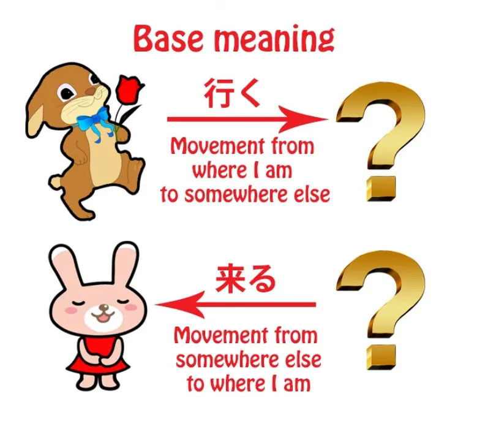
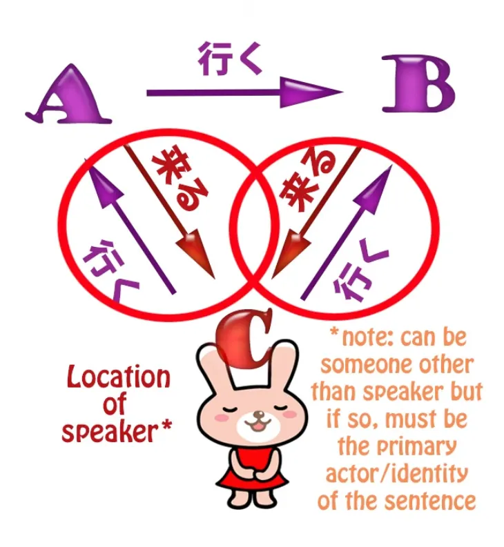
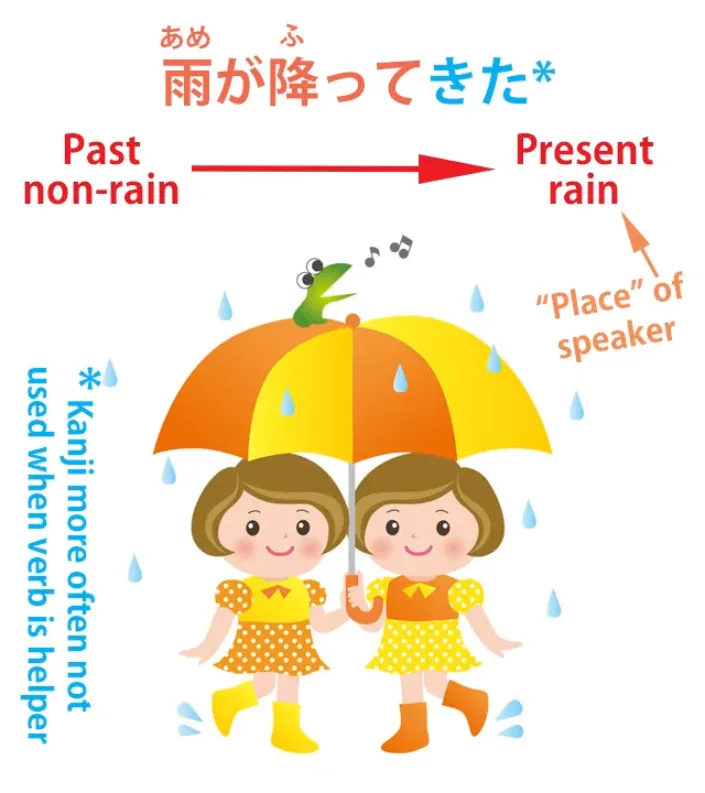
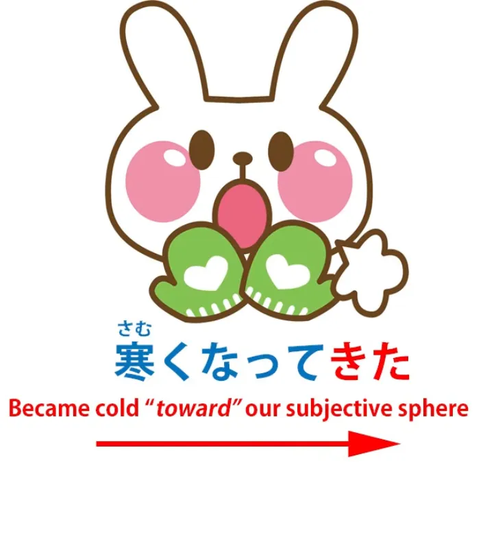
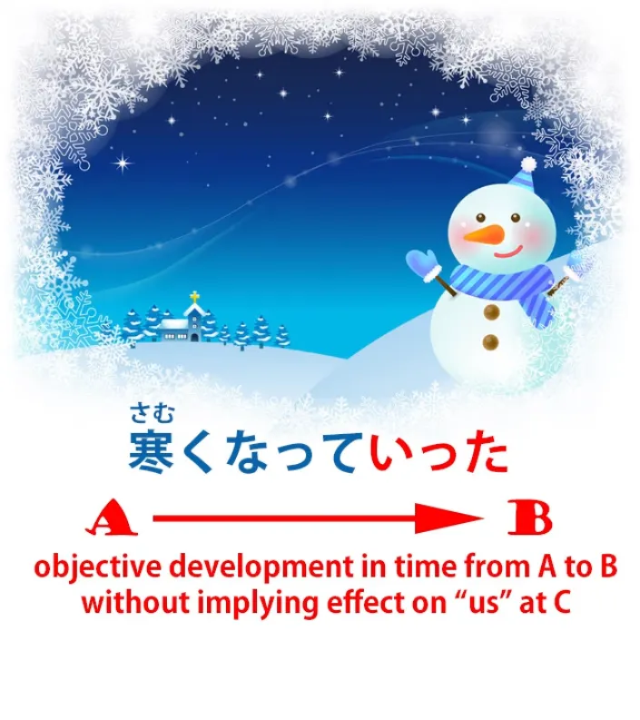

# **65. Datang dan Pergi: Rahasia lebih dalam di balik 行く dan 来る、て行く dan て来る (te-iku, te-kuru)**

こんにちは。

Hari ini kita akan membahas tentang datang dan pergi dalam bahasa Jepang.

Nah, <code>行く</code> dan <code>来る</code> adalah dua kata pertama yang kita pelajari saat mulai belajar bahasa Jepang, dan kita belajar bahwa artinya <code>come</code> dan <code>go</code>, dan secara umum memang demikian. Namun, seiring kemajuan kita, kita memahami bahwa hal itu tidak sesederhana itu. Kata-kata tersebut memiliki banyak makna kiasan dan makna yang lebih halus, tetapi bahkan makna fisiknya pun tidak sepenuhnya sesuai dengan kata-kata dalam bahasa Inggris <code>come</code> dan <code>go</code>.

Pada dasarnya, <code>iku</code> berarti <code>go from where the speaker is to somewhere else</code>, dan <code>kuru</code> berarti <code>come from somewhere else to where the speaker is</code>.

&gt; 

Bukankah itu sama saja dengan bahasa Inggris <code>come</code> dan <code>go</code>? Nah, tidak sepenuhnya.

Misalnya, kita bisa berkata kepada seseorang di telepon <code>Shall I come over to see you?</code> atau mungkin Anda akan mengatakan <code>Will you come to me, or shall I come to you?</code>

Dan dalam bahasa Jepang hal itu tidak mungkin, karena kamu tidak bisa <code>come</code> ke tempat di mana kamu tidak berada. <code>Coming</code> berarti datang dari suatu tempat di mana si pembicara tidak berada ke tempat di mana si pembicara berada. Jadi, kamu tidak bisa mengatakan kepada seseorang di telepon <code>Shall I come to you?</code> dengan <code>来る</code>. Anda hanya bisa mengatakan <code>Shall I go to you?</code> dengan <code>行く</code>.

<code>Shall I go to you?</code> akan terdengar aneh dalam bahasa Inggris, jadi kita melihat bahwa <code>来る</code> dan <code>行く</code> tidak sepenuhnya dapat dipertukarkan dengan bahasa Inggris <code>come</code> dan <code>go</code>. <code>来る</code> hanya bisa berarti <code>move from where the speaker isn&#x27;t to where the speaker is</code>.

<code>行く</code> tidak seketat itu.

Kita bisa membicarakan seseorang <code>行く</code>-ing dari A ke B saat kita sebenarnya berada di C, tetapi <code>来る</code> harus selalu berarti pergerakan menuju C, tempat di mana kita berada. Dan ini penting untuk dipahami saat kita membahas makna-makna yang lebih metaforis dari <code>来る</code> dan <code>行く</code>.

Kita telah membahas beberapa makna yang diperluas dalam pelajaran sebelumnya, tetapi masih dalam konteks fisik, terutama yang [**melibatkan menghubungkan <code>来る</code> atau <code>行く</code> Bentuk-te dari sebuah kata kerja**](https://www.youtube.com/watch?v=PsTsliRe2Cg).

Jadi <code>持ってくる</code> berarti <code>bring (to the place where I am)</code>; <code>持っていく</code> berarti <code>take (from the place where I am)</code>. Namun <code>the place where I am</code> sebenarnya bisa berarti waktu atau bisa juga berarti keadaan mental identifikasi.

Jadi kita mendapatkan makna yang lebih kompleks yang semuanya didasarkan pada metafora fisik dasar tentang datang ke tempat di mana seseorang berada, pergi dari tempat di mana seseorang berada, atau pergi dari atau menuju tempat lain (tetapi bukan datang dari satu tempat ke tempat lain karena itu tidak mungkin).

Jadi, contoh yang sangat sederhana adalah kita mungkin mengatakan <code>雨が降ってきた</code> — dan kita memiliki ungkapan bahasa Inggris yang hampir setara: kita mungkin mengatakan <code>It came on to rain</code>.

Dan metafora di sini adalah metafora waktu. Hujan datang kepada kita dalam waktu, dari waktu ketika hujan belum ada hingga waktu di mana kita berada, saat hujan sudah ada.

Jika kita mengatakan <code>だんだん雨が降っていく</code>, kita sedang mengatakan <code>It&#x27;s getting rainier and rainier</code> dan kita memproyeksikan ke masa depan. <code>いく</code> adalah bergerak dari tempat kita berada menuju masa depan.

Sekarang, karena waktu, setidaknya secara tampaknya, bergerak maju, kita hanya dapat menggunakan <code>いく</code> dalam arti bergerak maju dalam waktu, menjauh dari kita, menjauh dari titik di mana kita berada, bukan bergerak mundur dalam waktu menjauh dari titik di mana kita berada, karena hal itu saat ini tidak mungkin.

Jadi, <code>雨が降っていく</code> dalam hal ini menyiratkan bahwa cuaca telah menjadi hujan (<code>降って来た</code>) dan bahwa hal itu akan semakin sering terjadi di masa depan.

Sekarang, kita juga dapat menggunakan <code>くる</code> dan <code>いく</code> dengan cara yang lebih halus lagi, yang tidak berkaitan dengan ruang atau waktu tetapi dengan subjektivitas, dengan keadaan mental kita. Jadi, ungkapan yang sangat umum adalah <code>分かってくる</code>, yang dalam bahasa Inggris mungkin diterjemahkan sebagai <code>come to understand</code>, tetapi tentu saja ini salah.

Mari kita ambil contoh mengapa. Kita mungkin mengatakan <code>勉強すれば、だんだん数学が分かってくる</code> Dan itu biasanya diterjemahkan sebagai <code>if you study, you will come to understand mathematics</code>.

Dan seperti yang bisa Anda lihat, jika Anda memperhatikan, ada kontradiksi di sini. Dalam bahasa Jepang, Anda tidak bisa datang ke tempat di mana Anda belum berada. Anda tidak bisa menggunakan <code>くる</code> untuk berbicara tentang datang ke suatu tempat yang belum Anda tempati saat ini tetapi akan Anda tempati di masa depan. Haruslah <code>いく</code>, bukan?

Jadi mengapa <code>くる</code> digunakan di sini? Nah, jika Anda telah mengikuti kursus ini, Anda mungkin sudah tahu jawabannya.

<code>分かる</code> tidak berarti <code>understand</code>. Artinya <code>be understandable / be clear</code> atau secara harfiah artinya adalah <code>do understandable</code>.

Jadi, yang sebenarnya kita katakan adalah bahwa jika Anda belajar, matematika akan menjadi mudah dipahami bagi Anda.

Dengan kata lain, matematika akan berubah dari sesuatu yang jauh dari Anda menjadi sesuatu yang lebih dekat dan dapat dipahami. Jadi, kita menggunakan ini dalam arti subjektif.

Dan ini adalah hal penting yang perlu dipahami, dan penting untuk memahami bahwa <code>くる</code> dan <code>いく</code> dapat mewakili pergerakan dalam waktu, menuju atau menjauhi sesuatu, pergerakan dalam ruang, menuju atau menjauhi sesuatu, pergerakan dalam subjektivitas, menuju kondisi atau keadaan mental seseorang atau menjauhi hal tersebut, tetapi juga <code>iku</code> dapat mewakili objektivitas versus <code>kuru</code> mewakili subjektivitas.

Dan alasan untuk ini adalah sesuatu yang telah kita bahas sebelumnya, yaitu bahwa <code>iku</code> dapat berarti bergerak dari A ke B sementara kita berada di C. Oleh karena itu, <code>iku</code> dapat mewakili pergerakan dari satu tempat ke tempat lain yang tidak melibatkan kita, baik secara fisik, temporal, maupun mental atau emosional.

Jadi, jika kita mengatakan <code>samuku natte kita</code>

kita sedang mengatakan <code>it became cold</code>, dan menambahkan bahwa <code>kita</code> (<code>kuru</code>) mengaitkannya dengan kita: <code>It became cold (coming toward me or us).</code> Jadi yang kita katakan bukan hanya bahwa cuaca menjadi dingin, tetapi menyiratkan bahwa hal itu memengaruhi saya atau kita secara subjektif: <code>Samuku natte kita</code>.

Sebaliknya, <code>samuku natte itta</code> lebih objektif. Hal itu tidak melibatkan kita. Hal itu tidak menyiratkan bahwa hal itu memengaruhi saya atau kita dengan cara apa pun. Itu hanya terjadi. Cuaca menjadi lebih dingin.

Karena ini adalah <code>itta</code> yang dalam istilah spasial berarti berpindah dari A ke B, secara objektif, tanpa melibatkan saya atau kita.

Sekarang, Anda mungkin bertanya, &quot;Bagaimana saya tahu kapan itu pergerakan dalam ruang, kapan itu pergerakan dalam waktu,

kapan itu pergerakan dalam hal mentalitas dan subjektivitas, dan kapan <code>kuru</code> dan <code>iku</code> mewakili subjektivitas versus objektivitas?&quot;

Dan jawabannya adalah: Tidak ada aturan dan kita tidak seharusnya mencari aturan dalam kasus seperti ini. Alasan kita mempelajari cara kerja hal-hal ini bukanlah sebagai tujuan akhir, bukan sebagai sekumpulan fakta yang harus dipelajari, melainkan sebagai bantuan untuk memahami bahasa Jepang yang sesungguhnya.

Saat kita membenamkan diri dalam bahasa Jepang, saat kita menonton anime, membaca novel, bermain game dalam bahasa Jepang, hal-hal ini mulai masuk akal.

Yang kita butuhkan adalah prinsip-prinsip yang mendasari hal-hal tersebut, yang memberi kita keunggulan dalam memahaminya. Namun, struktur tidak akan pernah bisa menggantikan imersi.

Struktur adalah landasan yang membuat imersi menjadi lebih cepat, lebih mudah, dan lebih mudah dipahami..
