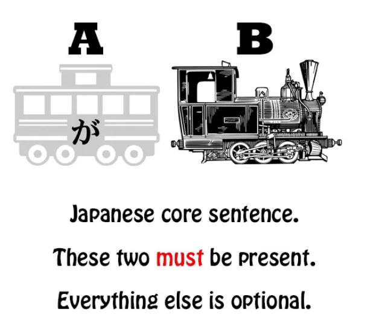
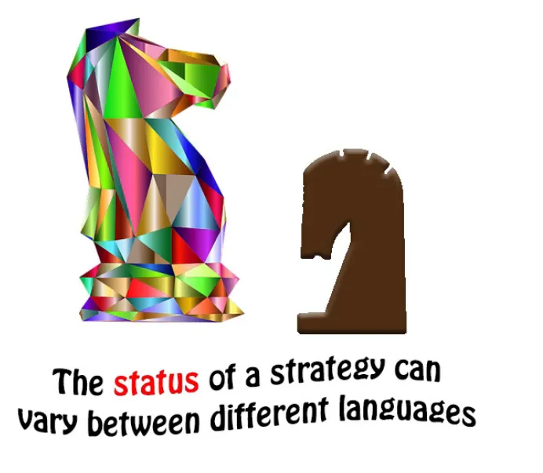
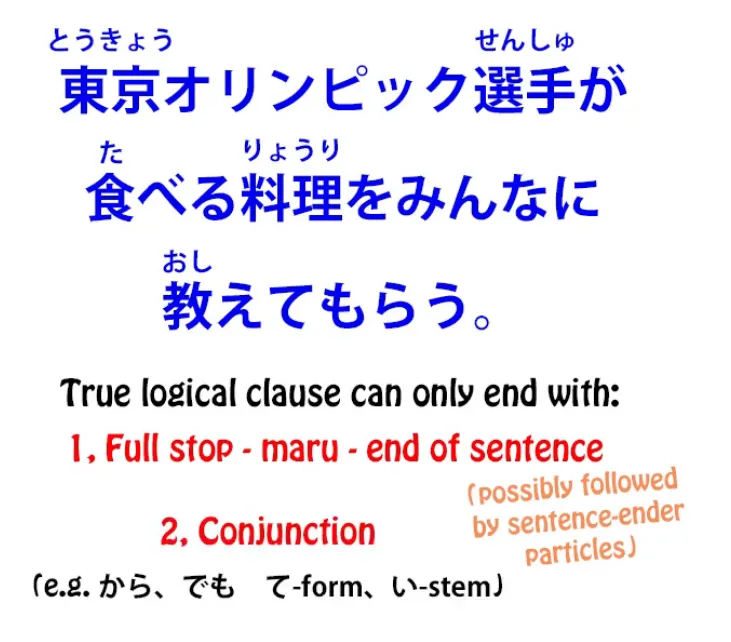
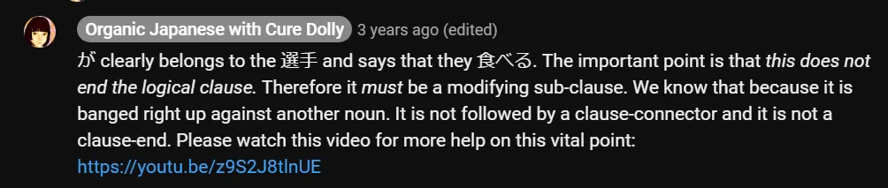
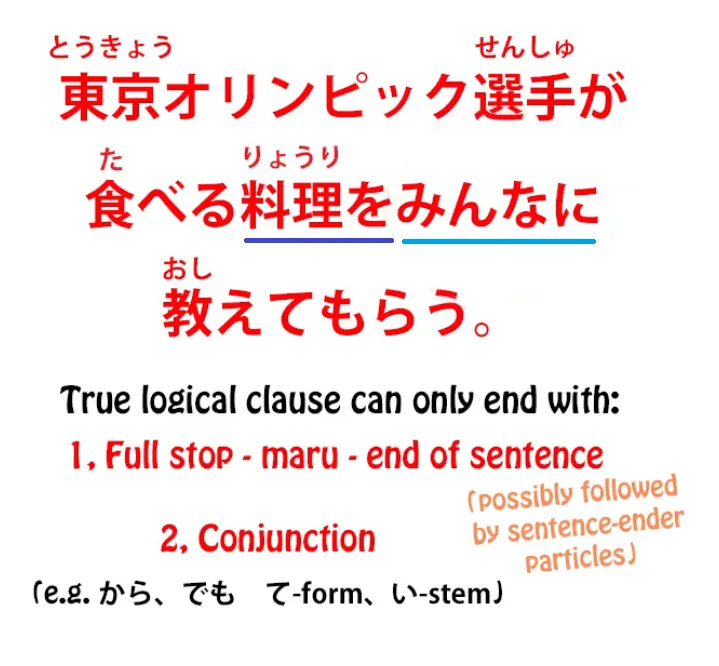
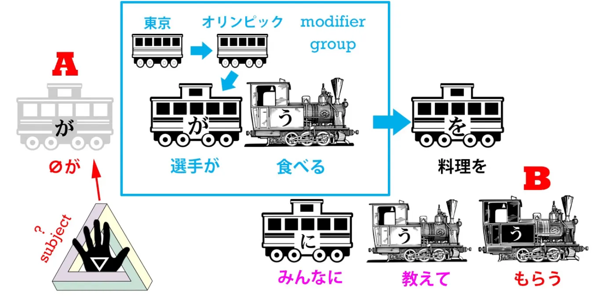
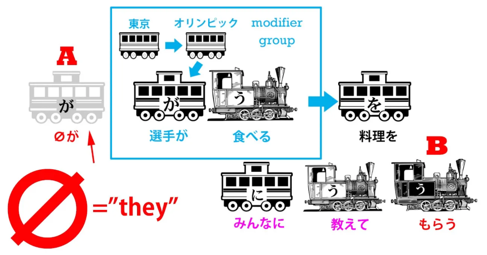
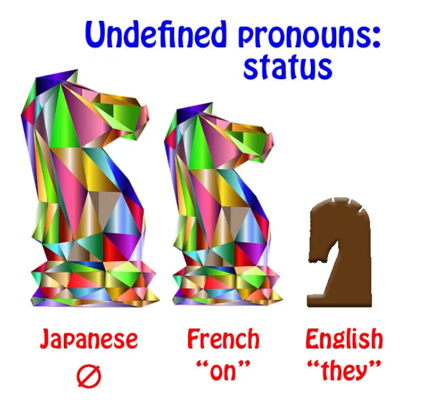

# **66. Subjek Tersembunyi dalam Bahasa Jepang - dan cara memahaminya**

[**Subjek Tersembunyi dalam Bahasa Jepang - dan cara memahaminya | Pelajaran 66**](https://www.youtube.com/watch?v=GN_tGX0W-LE&amp;list;=PLg9uYxuZf8x_A-vcqqyOFZu06WlhnypWj&amp;index;=68&amp;ab;_channel=OrganicJapanesewithCureDolly)

こんにちは。

Hari ini kita akan membahas <code>hidden hand</code> dalam bahasa Jepang. Apa yang saya maksud dengan itu?

## Tidak ada subjek dalam bahasa Jepang?

Nah, banyak orang mengklaim bahwa bahasa Jepang tidak memiliki subjek. Dan saya pikir kita sudah membuktikan tanpa ragu bahwa bahasa Jepang tidak hanya memiliki subjek[[9]](./9-the-subject-of-the-japanese-sentence-expressing-desire- ほしい - たい - たがる.md) tetapi bahwa Anda tidak bisa memiliki kalimat bahasa Jepang tanpa subjek, meskipun Anda tidak selalu bisa melihat atau mendengar subjeknya. Subjek tersebut bisa berupa <code>zero-pronoun</code>.

Yang saya maksud dengan subjek, tentu saja, adalah kata A dalam sebuah kalimat. Dan karena setiap kalimat memberi tahu kita bahwa <code>A is B</code> atau itu <code>A does B</code>, Jelas kita tidak bisa memiliki kalimat tanpa A.

Sesederhana itu. Namun, ada kalanya kita tidak hanya tidak bisa melihat subjek, yaitu A-car, tetapi juga sulit untuk menentukan apa sebenarnya subjek tersebut.

Dan kesulitan ini akan terlihat berasal dari kurangnya pemahaman yang mendalam tentang bagaimana beberapa aspek bahasa Jepang bekerja. Satu hal yang perlu kita pahami adalah bahwa bahasa yang berbeda memiliki strategi ekspresi yang berbeda pula.

## Strategi ekspresi yang berbeda

Kita sudah tahu betapa merugikannya mengatakan bahwa <code>コーヒーが好きだ</code> berarti <code>I like coffee</code>. <code>I like coffee</code> adalah apa yang akan kita katakan dalam bahasa Inggris, tetapi bahasa Inggris menggunakan strategi ekspresi yang sama sekali berbeda dari bahasa Jepang.

Menyukai diungkapkan dengan kata kerja, dan pelaku kata kerja tersebut adalah orang yang menyukai kopi. Dalam bahasa Jepang, menyukai diungkapkan dengan kata benda yang berfungsi sebagai kata sifat, dan subjek dari kata benda tersebut adalah kopi. Jadi, strategi ekspresi bahasa Jepang di sini lebih dekat dengan bahasa Spanyol daripada bahasa Inggris, meskipun keduanya tidak identik.

Sekarang, meskipun bahasa-bahasa memiliki strategi ekspresi yang berbeda, ternyata bahasa-bahasa, bahkan ketika tidak terkait, cenderung memiliki kumpulan trik yang relatif terbatas yang mereka gunakan. Jadi, kita menemukan strategi ekspresi yang sama dalam bahasa yang berbeda, tetapi tidak selalu di tempat yang sama. Selain itu, status strategi ekspresi juga dapat bervariasi antar bahasa.

## Kata bantu reseptif

Jadi, salah satu alasan mengapa bahasa Inggris yang disebut <code>Japanese grammar</code> salah menyebut kata kerja bantu reseptif dalam bahasa Jepang sebagai konjugasi pasif atau kalimat pasif, adalah karena meskipun hal tersebut memang ada dalam bahasa Inggris, statusnya tidak terlalu tinggi.[[13]](./13-passive-conjugation-receptive-helper-verb.md) Karena kita menggunakan kata bantu reseptif dalam bahasa Inggris dengan menggunakan kata <code>got</code> dalam berbagai situasi seperti <code>I got rescued by my big sister</code>, <code>The sandwiches got eaten by the dog</code> — tetapi ini tidak dianggap sebagai bahasa Inggris yang baik.

Faktanya, bahwa hal ini tidak dianggap sebagai bahasa Inggris yang baik hanyalah masalah tren. Secara tata bahasa, hal ini benar-benar sah. Hanya saja, hal ini kebetulan tidak populer atau memiliki status rendah dalam bahasa tersebut. Ini sebenarnya hanyalah sebuah kebetulan sejarah.

Sekarang, serupa dengan itu, ada strategi ekspresi lain dalam bahasa Jepang yang tidak dianggap memiliki status tinggi dalam bahasa Inggris dan dapat membingungkan kita. Jadi, saya akan mengambil sebuah kalimat di sini yang diajukan kepada saya oleh salah satu penonton saya, yang mengalami kesulitan besar dalam memahami apa sebenarnya subjek kalimat ini. Dan itu sangat bisa dimengerti, karena sebelum Anda memahami strategi ekspresi ini, hal itu tidak sepenuhnya jelas.

## Analisis kalimat dengan subjek tersembunyi

Kalimat ini berasal dari NHK News Easy, yang merupakan layanan berita yang sangat baik untuk pemula dalam bahasa Jepang. Dan kalimatnya adalah: <code>東京オリンピック選手が食べる料理をみんなに教えてもらう</code>

Jadi, menurut Anda apa subjek, yaitu mobil A, dari kalimat ini?

Hal pertama yang harus dilakukan saat menganalisis kalimat adalah seperti yang saya jelaskan dalam video saya tentang analisis kalimat[[37]](./37-new-structure-secrets- な -vs- の - なる - たる -adjectives.md)

, yaitu kita perlu melihat di mana klausa logis berakhir dalam sebuah kalimat. Sebuah klausa logis yang berfungsi sebagai klausa logis dan bukan sebagai deskriptor atau penunjang bagi hal lain hanya dapat berakhir dengan dua cara,
yaitu dengan titik, yang menandakan akhir kalimat, atau dengan konjungsi, yang menandakan bahwa klausa tersebut merupakan klausa logis pertama dalam kalimat majemuk.

Tentu saja, jika berada di akhir kalimat, klausa tersebut mungkin diikuti oleh satu atau lebih partikel penutup kalimat, tetapi harus menjadi elemen terakhir dalam kalimat: kata kerja terakhir, kata benda ditambah kopula, atau kata sifat. Jadi, mari kita bahas ini dengan cara yang telah saya ajarkan kepada Anda sebelumnya.

<code>東京オリンピック選手が食べる...</code> Apakah itu klausa logis? Nah, itu bisa jadi klausa logis, bukan? Artinya <code>The Tokyo Olympic athletes eat.</code>

Namun, apakah itu diikuti oleh titik, oleh partikel penutup kalimat dengan titik, atau apakah itu diakhiri dengan semacam penghubung klausa seperti <code>から</code> atau <code>でも</code> atau bentuk &quot;て&quot; atau akar kata kerja &quot;い&quot;? Tidak, kalimat itu tidak diakhiri dengan salah satu dari itu, bukan? Kalimat itu langsung diikuti oleh kata benda.

Dan, seperti yang kita ketahui, ketika sebuah klausa logis langsung diikuti oleh kata benda, fungsinya adalah memodifikasi kata benda tersebut. Dengan kata lain, klausa tersebut tidak berfungsi sebagai klausa logis aktif; melainkan berfungsi, pada dasarnya, sebagai kata sifat, yaitu pemodifikasi kata benda. Jadi <code>東京オリンピック選手が食べる</code> semua itu hanya berfungsi sebagai modifikator <code>料理</code>. Itu hanya memberi tahu kita lebih banyak tentang makanan tersebut.

Jadi, kita memiliki: <code>...料理をみんなに教えてもらう</code> Sekarang, kita masih belum sampai pada subjek kalimat, bukan? Karena subjek dari setiap kalimat harus ditandai dengan が.

Yang <code>選手</code> ditandai dengが, tetapi kita tahu mereka bukan subjek kalimat; mereka hanya membantu memodifikasi <code>料理</code>.

  
::: info
Letakkan ini di sini… tautan ini untuk Pelajaran 47. Periksa juga Pelajaran 46.
:::
<code>料理</code> tidak bisa menjadi subjek kalimat karena ditandai dengan を, bukan が.

<code>みんな</code> tidak bisa menjadi subjek kalimat karena ditandai dengan に, bukan が.

Jadi, apa yang sebenarnya terjadi di sini?

## Tindakan kalimat dengan subjek tersembunyi

Nah, apa sebenarnya yang dikatakan kalimat ini? Kalimat ini mengatakan bahwa seseorang, subjek kalimat, siapa pun dia, sedang meminta semua orang untuk mengajari atau memberi saran kepadanya tentang makanan yang harus dimakan oleh para atlet Olimpiade.

Nah, penanya saya sebenarnya sudah sampai sejauh ini, tetapi kemudian bingung dengan pertanyaan tentang siapa orang atau orang-orang yang tidak disebutkan namanya ini. Mungkinkah para atlet? Yah, itu tidak mungkin, dan kita selalu harus mempertimbangkan kemungkinan dalam menyelesaikan segala jenis ambiguitas.[[48]](./48-dealing-with-ambiguity-in-japanese.md) Ini sebenarnya bukan kalimat yang ambigu, tetapi konteksnya cukup jelas menunjukkan bahwa itu bukan para atlet.

Pertama-tama, secara default kalimat-kalimat ini <code>-てもらう</code> kalimat ini berarti bahwa seseorang secara aktif meminta orang lain untuk melakukan sesuatu.[[49]](./49-japanese-point-of-view-deconfused- もらう - てもらう.md) Jadi, orang yang melakukan <code>もらう</code> *(subjek A zero が)* sedang *(melatih Kereta kalimat B - もらう)* orang *(みんなに)* yang melakukan kata kerja berbentuk て untuk melakukan kata kerja berbentuk て *(教えて)*.

Jadi, jika kita mengatakan <code>お医者さんに見てもらう</code>, kita berarti mengatakan <code>have the doctor look at me</code>. Jadi, ada seseorang yang meminta semua orang untuk mengajarinya atau memberikan pendapat mereka tentang apa yang seharusnya dimakan para atlet.

Apakah ini kemungkinan besar para atlet? Well, tidak benar-benar. Apakah mereka kemungkinan besar berkumpul dan bertanya kepada semua orang apa yang seharusnya mereka makan?

### Siapa subjeknya di sini?

Jadi, siapa itu? Siapa subjek tak terlihat yang ditandai dengan が, subjek, atau A-car dari kalimat ini? Dan jawabannya adalah, itu hanyalah subjek tak terlihat yang tidak ditentukan.

Sekarang, itu mungkin terdengar sangat aneh, tetapi sebenarnya tidak. Faktanya, kita sering menggunakannya dalam bahasa Inggris. Namun, Anda tidak akan pernah melihatnya di koran atau layanan berita seperti yang ada di sini, itulah yang membuatnya membingungkan.

Jadi, kapan kita menggunakan kata ganti tak terdefinisi seperti ini? Baiklah, mari kita pikirkan. Misalkan seseorang berkata <code>I hear they&#x27;re putting a man on Mars next year.</code>

Nah, siapa <code>they</code>? Nah, kita tidak tahu siapa <code>they</code> itu. Mungkin siapa pun yang mengirim manusia ke Mars — NASA atau Tuan Musk, atau seseorang.

Sekarang, misalkan saya berkata <code>They&#x27;re getting everyone&#x27;s opinion on what the Olympic athletes should eat.</code> Nah, sekali lagi, seseorang mungkin saja mengatakan itu dalam bahasa Inggris. Anda tidak akan melihatnya di koran, tetapi seorang teman mungkin saja mengatakannya kepada Anda: <code>You know, they&#x27;re getting everybody&#x27;s opinion on what the Olympic athletes should eat.</code>

Siapa <code>they</code>? Yah, kita tidak benar-benar tahu. Siapa pun yang bertanggung jawab memberi makan para atlet Olimpiade, mungkin.

Dan ini adalah konstruksi yang akan sering kamu temui dalam bahasa Jepang, yaitu <code>they</code>, siapa pun mereka. Anda mendengarnya dalam bahasa Inggris sepanjang waktu tetapi statusnya rendah.

Anda tidak akan menemukannya dalam dokumen resmi, surat kabar, atau hal-hal semacam itu. Anda hanya mendengarnya dalam percakapan yang relatif santai. Dalam bahasa Prancis, Anda mungkin mendengarnya lebih sering.

<code>On</code> (mereka, satu) dapat digunakan secara lebih umum pada tingkat wacana yang lebih tinggi daripada dalam bahasa Inggris.

Jadi, setelah kita mengetahui hal ini, cukup mudah untuk menentukan subjek kalimat ini. Dan ini adalah hal penting untuk diketahui karena kita akan sering menjumpai konstruksi semacam ini dalam bahasa Jepang.
