# **67. もう dan まだ: hubungan waktu yang memberikan makna pada keduanya**

[**もう dan まだ hubungan waktu yang menjelaskannya (mou dan mada) Pelajaran 67**](https://www.youtube.com/watch?v=sBhD_Z5_pHw&amp;list;=PLg9uYxuZf8x_A-vcqqyOFZu06WlhnypWj&amp;index;=69&amp;ab;_channel=OrganicJapanesewithCureDolly)

こんにちは。

Hari ini kita akan membahas <code>もう</code> dan <code>まだ</code>, dua ungkapan yang bisa sedikit membingungkan, terutama <code>もう</code>.

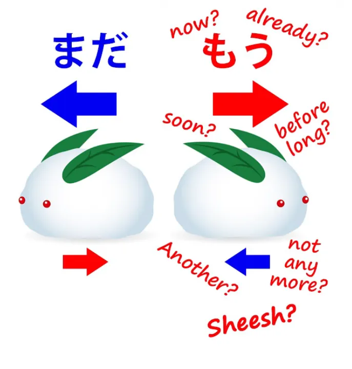

Jika kita mencari <code>もう</code> di kamus Jepang-Inggris, kita akan diberitahu bahwa artinya <code>now, already, soon, before long</code> dan terkadang bahkan <code>not any more</code>, serta berarti <code>another</code> dan merupakan ungkapan kekesalan. Bagaimana mungkin kata ini bisa berarti semua hubungan waktu yang berbeda ini pada saat yang sama? Nah, kita akan mengetahuinya hari ini. Dan kita akan melihat bahwa hal ini tidak serumit kelihatannya.

Namun, pertama-tama saya ingin membahas <code>まだ</code>, yang sedikit lebih mudah dipahami tetapi akan memberi kita prinsip-prinsip yang kita butuhkan untuk memahami bagaimana <code>もう</code> bekerja. Baiklah.

## まだ

Jadi, <code>まだ</code> memiliki kumpulan definisi yang tidak terlalu membingungkan. Pada umumnya kita diberitahu bahwa itu berarti <code>still</code> atau <code>not yet</code>.

Jadi, mari kita mulai dengan melihat apa arti sebenarnya, apa yang sebenarnya dilakukannya. <code>まだ</code> melakukan sejumlah hal. Ia memberi tahu kita tentang waktu sekarang. Ia menempatkan waktu sekarang di dalam segmen waktu yang membentang ke masa lalu dan diharapkan akan berakhir atau setidaknya kemungkinan berakhirnya sedang dipertimbangkan. Paling sering, ia diharapkan akan berakhir.

Sekarang, hal ini melakukan tiga hal. Hal ini memberi tahu kita tentang masa kini, sehingga kita dapat mengatakan bahwa ini sebenarnya adalah cara untuk mengatakan <code>now</code>, tetapi <code>now</code> dalam hubungan tertentu dengan masa lalu dan masa depan.

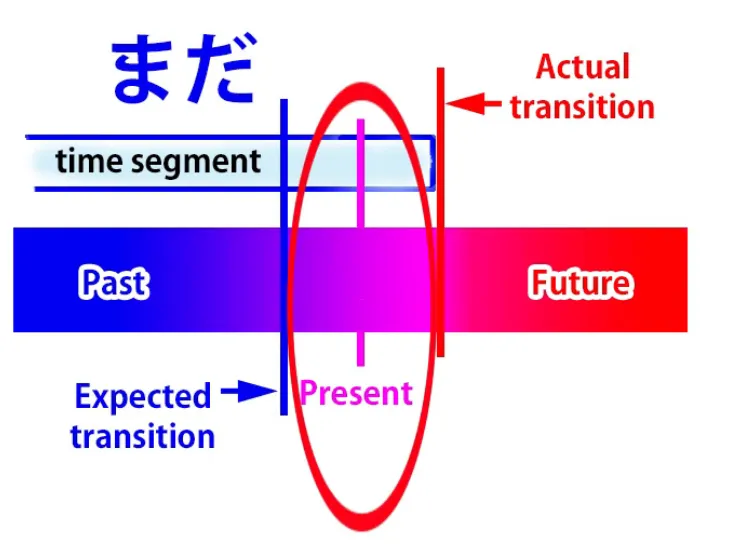

Apa hubungan itu? Nah, seperti yang Anda lihat, ada dua hal. Ada bagian waktu di mana <code>now</code> terdapat dan kita memiliki titik transisi.

Karena ini adalah bagian waktu, ia tidak bisa berlangsung selamanya, jadi ada titik transisi di mana ia berubah menjadi bagian waktu lain dengan kualitas berbeda yang diharapkan di masa depan atau setidaknya dipertimbangkan sebagai kemungkinan di masa depan. Sekarang, <code>まだ</code> memberikan dua kontras. Bagian waktu tersebut dikontraskan dengan masa depan ketika ia akan atau mungkin berubah, tetapi momen sekarang dikontraskan dengan masa lalu ketika ia mungkin diharapkan untuk berubah.

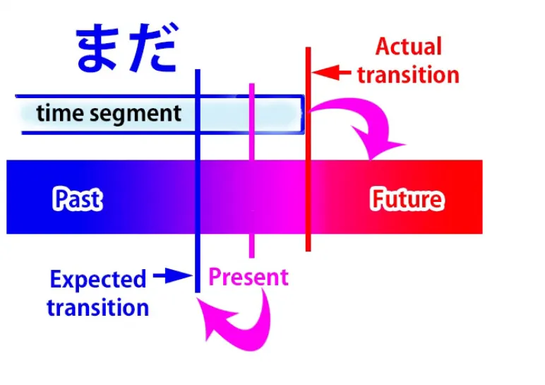

Jadi, yang dimaksud dengan ini dalam bahasa Inggris pada dasarnya adalah <code>still</code>. Dan ini mungkin tampak agak abstrak, tetapi saya rasa kita akan memahaminya dengan cukup jelas saat melihat cara kerjanya.

Jadi, jika kita mengatakan <code>宿題はまだしなかった</code>, kita berarti <code>I haven&#x27;t done my homework yet</code> atau <code>I still haven&#x27;t done my homework.</code>

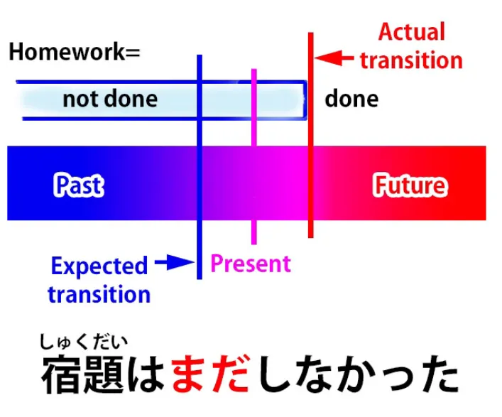

Sekarang, seperti yang Anda lihat, ini berarti kita berada dalam rentang waktu di mana saya belum mengerjakan PR saya. Ini meluas ke masa lalu dan dibandingkan dengan periode di masa depan di mana saya akan telah mengerjakan PR saya. Namun, waktu sekarang dikontraskan dengan waktu di masa lalu di mana saya mungkin sudah atau seharusnya sudah mengerjakan PR saya.

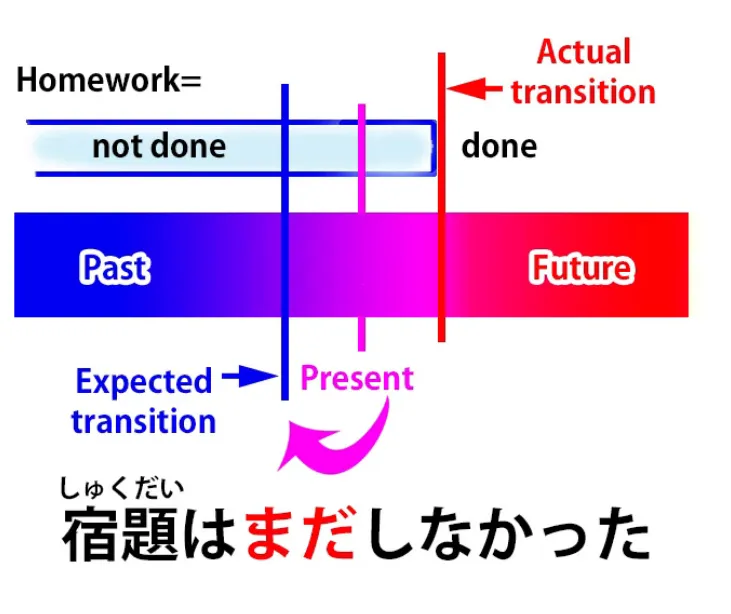

Itulah mengapa kita mengatakan <code>まだ</code> dan itulah mengapa dalam bahasa Inggris kita akan mengatakan <code>still</code> atau <code>haven&#x27;t yet</code>. Dengan kata lain, ada waktu di masa lalu di mana hal itu mungkin diharapkan terjadi, tetapi belum terjadi. Jadi, hal itu masih dalam keadaan yang tidak akan berubah hingga masa depan. Dan inilah yang kita maksud dengan istilah-istilah seperti <code>still</code> dan <code>yet</code> dalam bahasa Inggris.

Jika kita mengatakan <code>さくらはまだ若い</code>, kita berarti <code>Sakura is still young.</code>

Sekali lagi, yang kita maksudkan adalah bahwa  
waktu sekarang berada dalam periode di mana Sakura masih muda,  
periode tersebut membentang ke masa lalu dan diperkirakan akan berubah pada suatu saat di masa depan. Dia tidak akan muda selamanya, dia akan menua. Jadi kita bisa melihat bahwa periode waktu saat Sakura masih muda dikontraskan dengan masa depan ketika dia akan menua.

Namun, momen saat ini dikontraskan dengan masa lalu.

Itulah mengapa kita mengatakan <code>まだ</code> atau mengapa dalam bahasa Inggris kita akan mengatakan <code>still</code>. Yang kita maksud adalah <code>She hasn&#x27;t stopped being young yet</code>. Berbeda dengan kemungkinan bahwa dia berhenti menjadi muda di masa lalu, dia belum berhenti menjadi muda di masa lalu — dia masih muda sekarang, meskipun dia tidak akan muda di masa depan.

Jika kita mengatakan <code>さくらはまだ大人ではない</code>, kita mengatakan <code>Sakura is not yet grown-up</code>.

Jadi sekarang kita menggunakan bentuk negatif, dan itulah mengapa <code>まだ</code> dapat berarti <code>still</code> atau <code>not yet</code>. Itu hanya tergantung, setidaknya dalam kasus ini, pada fakta bahwa kalimat tersebut digunakan dengan bentuk negatif.

Jadi, jika kita mengatakan <code>さくらはまだ大人ではない</code>, kita berarti mengatakan bahwa pada saat ini Sakura belum dewasa. Meskipun kamu mungkin berpikir dia sudah dewasa beberapa waktu lalu, sebenarnya belum. Tapi tentu saja dia akan dewasa di masa depan.

Seperti yang bisa kamu lihat, alasan mengapa kalimat ini diterjemahkan baik sebagai <code>still</code> dan <code>not yet</code> adalah karena bahasa Jepang menyusun kalimatnya sedikit berbeda dari bahasa Inggris. Dalam bahasa Inggris kita mengatakan <code>Sakura is not yet grown-up</code>. Namun, dalam bahasa Jepang, yang sebenarnya kita katakan adalah <code>Sakura is still not grown up</code>.

Namun, untuk <code>まだ</code> untuk berarti <code>not yet</code> kita tidak perlu menggunakan kata negatif secara eksplisit. Misalnya, jika seseorang berkata kepada Anda <code>日本語は上手いね</code> — <code>Your Japanese is very good, isn&#x27;t it?</code> Nah, orang Jepang cenderung mengatakan itu meskipun Anda bisa berjalan terhuyung-huyung <code>こんにちは</code>. Dan meskipun bahasa Jepangmu benar-benar sangat baik, kamu mungkin akan menjawab <code>いえまだまだです</code>.

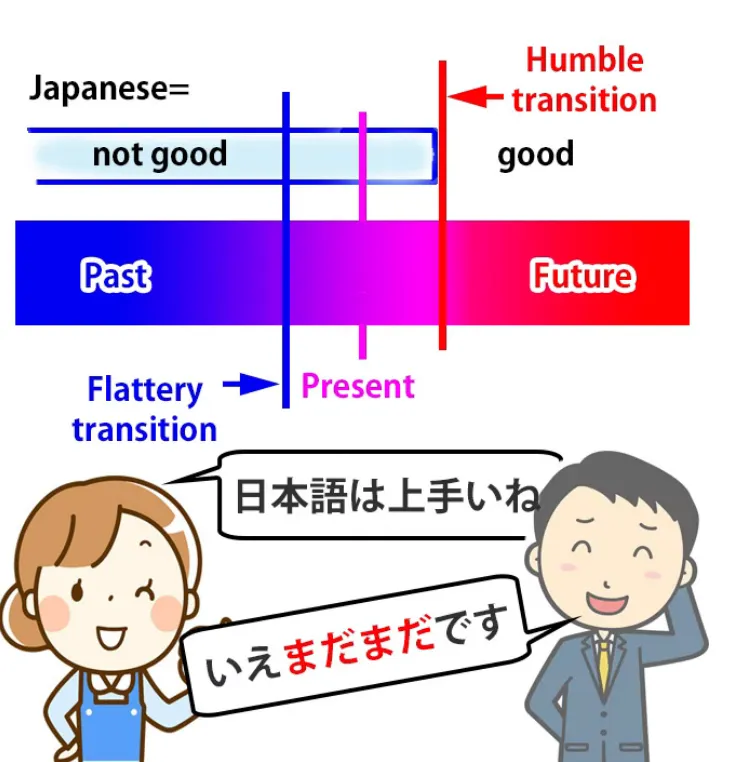

<code>まだまだ</code> dalam hal ini berarti <code>not yet</code>. Dengan kata lain, kita masih berada dalam periode di mana bahasa Jepang saya belum baik. Perubahan itu tidak terjadi di masa lalu, seperti yang Anda katakan; perubahan itu harus terjadi di masa depan.

Dan sekadar catatan budaya
Di Barat, kadang-kadang dianggap sedikit tidak sopan
untuk membantah seseorang yang telah mengatakan hal baik kepadamu, tetapi dalam bahasa Jepang kita melakukannya sepanjang waktu. Dianggap sedikit sombong jika tidak melakukannya.

## もう

Sekarang, mari kita lanjutkan ke <code>もう</code>, di mana kita akan menghadapi beberapa komplikasi yang tampak, tetapi sebenarnya bukan komplikasi, seperti yang akan kita lihat.

<code>もう</code> pada dasarnya adalah kebalikan dari <code>まだ</code>. Terjemahan terbaiknya dalam bahasa Inggris adalah <code>already</code>. Artinya, kita sekarang berada dalam rentang waktu yang membentang ke masa depan. Jadi, kebalikan dari <code>まだ</code>.

Segmen waktu ini dibandingkan dengan masa lalu ketika kondisi saat ini belum berlaku, dan masa kini dibandingkan dengan masa depan ketika transisi tersebut mungkin diharapkan terjadi, tetapi pada kenyataannya sudah terjadi.

Jadi, jika seseorang berkata <code>宿題をしなさい。</code> (<code>Do your homework!</code>), Anda mungkin menjawab <code>もうやったよ</code> (<code>I already did it</code>).

Jadi yang kami maksud adalah kami sekarang berada di segmen waktu di mana PR saya sudah selesai, saya sudah menyelesaikannya, dan transisi tersebut tidak akan terjadi di masa depan, seperti yang mungkin Anda pikirkan; hal itu sudah terjadi di masa lalu.

Jadi mengapa terkadang diterjemahkan sebagai memiliki arti yang berbeda dari <code>already</code>, seperti <code>now</code>? Nah, seperti yang telah kita lihat, baik <code>まだ</code> (<code>still</code>) dan <code>もう</code> (<code>already</code>) sebenarnya adalah jenis dari <code>now</code>. Kita sedang membicarakan masa kini. Kita hanya membuat perbandingan yang berbeda dengan masa lalu dan masa depan saat membicarakan masa kini.

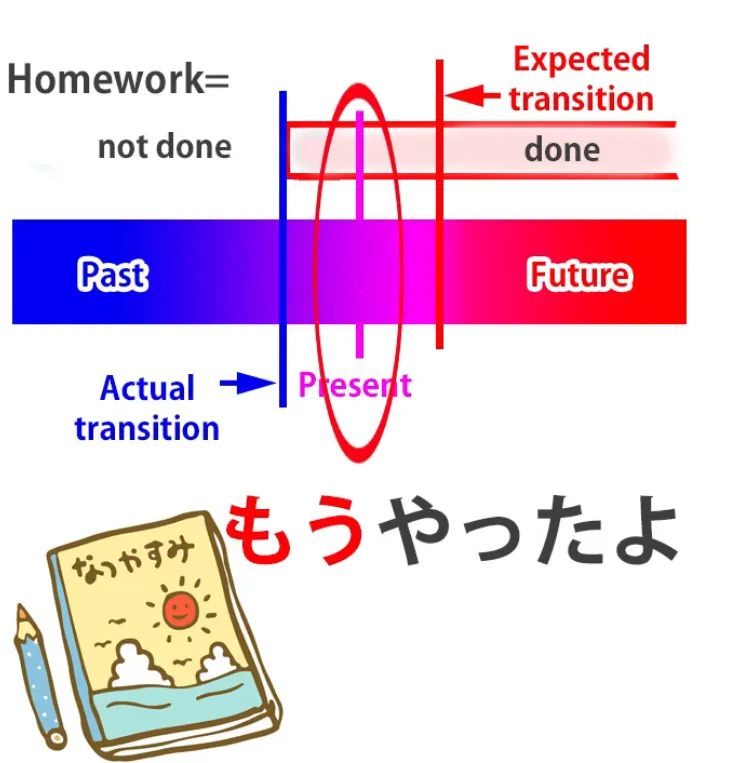

Jadi, tentu saja, <code>もう</code> memang berarti <code>now</code>, sama seperti <code>already</code> memang berarti. Namun, karena kata-kata dalam bahasa yang berbeda sangat jarang menempati rentang yang persis sama dalam [**spektrum makna**](https://www.youtube.com/watch?v=CpiELpGR-VU&amp;ab;_channel=OrganicJapanesewithCureDolly), terkadang kita menggunakan <code>もう</code> di tempat-tempat di mana kita akan menggunakan <code>now</code> dalam bahasa Inggris.

Dan karena kamus J-E bersifat Anglosentris, mereka akan mencoba menerjemahkan <code>もう</code> sebagai <code>now</code> dalam kasus-kasus tersebut.

Jadi, misalnya, jika Anda terluka dan sedang bangun, lalu seseorang berkata <code>大丈夫?</code> dan Anda menjawab <code>もう大丈夫</code>,  
cara menerjemahkan ini ke dalam bahasa Inggris biasanya <code>I&#x27;m all right now</code>.

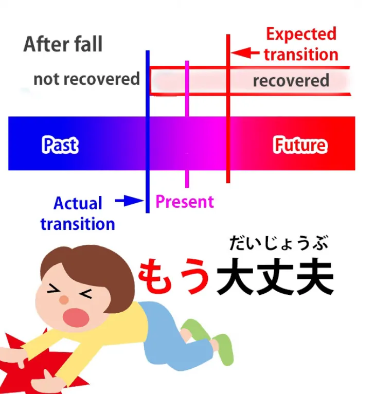

Dalam bahasa Inggris, Anda biasanya tidak akan mengatakan <code>I&#x27;m already all right</code>. Nah, dalam bahasa Jepang Anda juga bisa mengatakan <code>今大丈夫</code>, yang juga berarti <code>I&#x27;m all right now</code>, tetapi ketika Anda mengatakan <code>もう大丈夫</code> Anda secara khusus menambahkan nuansa bahwa, meskipun sebelumnya Anda tidak baik-baik saja, sekarang Anda baik-baik saja, bukan hanya akan baik-baik saja di masa depan yang dekat. Dengan kata lain, Anda tidak memerlukan waktu lagi untuk pulih, Anda sudah baik-baik saja. Dalam bahasa Inggris, kita tidak menggunakan <code>already</code> untuk itu. Secara logis kita bisa, tetapi dalam praktiknya kita biasanya tidak melakukannya.

Sekarang, benar sekali untuk mengatakan bahwa <code>もう</code> juga digunakan sebagai ungkapan kejengkelan atau kekesalan: <code>もう!</code>

Dan ungkapan ini merangkum segala macam keluhan atau gerutuan, atau bisa juga berdiri sendiri: <code>もう!</code> Bagaimana cara kerjanya? Menariknya, <code>already</code> dalam beberapa keadaan, kata &quot;can&quot; bisa memiliki sedikit nuansa seperti itu dalam bahasa Inggris. Jadi, jika seseorang berkata <code>Enough already!</code> yang dimaksud adalah, pada saat ini, bukan di masa depan, saya sudah muak dengan hal itu. Dan itulah sebenarnya arti <code>もう!</code> biasanya dimaksudkan dalam bahasa Jepang. Jadi itu cukup sederhana.

### &quot;もう&quot; yang kedua?

Namun, ada satu aspek dari <code>もう</code> yang sedikit membingungkan sampai Anda memahaminya, yaitu sebenarnya ada dua kata <code>もう</code>. Nah, ini mungkin sedikit kontroversial, tetapi sebenarnya dalam kamus aksen nada, keduanya diberi dua penekanan yang berbeda, satu untuk <code>もう</code> yang telah kita bicarakan, yang berarti <code>already</code>, dan satu lagi untuk yang lain <code>もう</code>, yang cukup mirip dalam banyak hal dan saya akan menjelaskan mengapa keduanya cukup mirip nanti. Namun, pertama-tama mari kita lihat area di mana keduanya tidak begitu mirip.

Yang kedua ini <code>もう</code>, menurut saya, pada akhirnya terkait dengan partikel <code>も</code> dan memiliki makna tambahan yang sama seperti <code>another</code>.

Jadi, jika kita mengatakan <code>もう一つ</code>, kita berarti <code>another one</code>. Jika kita mengatakan <code>もう一人</code>, kita sebenarnya mengatakan <code>another person</code>. Jadi, jika kita menjelaskannya seperti itu, kita bisa melihat bahwa kita sebenarnya berurusan dengan dua kata yang terpisah, dua konsep yang terpisah.

Sekarang, hal ini menjadi sedikit lebih membingungkan, dan saya akan menjelaskan alasannya. Hal ini bahkan membingungkan orang Jepang, yang sebenarnya sering kali tidak menggunakan aksen nada dengan benar, karena gagasan bahwa keduanya adalah kata yang berbeda sering kali terlewatkan bahkan oleh penutur asli Jepang.

Dan alasannya adalah karena ada banyak kasus di mana keduanya terdengar sangat mirip. Mengapa? Nah, seperti yang telah kita lihat, <code>もう</code> memberi tahu kita tentang hubungan waktu, ini adalah kata yang berkaitan dengan waktu, dan artinya <code>already</code>. Dan juga kamus memberitahu kita bahwa artinya <code>soon</code>. Mengapa mereka mengatakan bahwa itu berarti <code>soon</code>?

Nah, kata itu sendiri tidak berarti &quot;segera&quot;, tetapi artinya <code>soon</code> dalam kombinasi tertentu. Jadi, misalnya, jika kita mengatakan <code>もうすぐ</code>, yang berarti <code>soon</code>, yang sebenarnya kita maksudkan adalah: <code>すぐ</code> berarti <code>soon</code> dan <code>もう</code> berarti <code>already</code>, sehingga <code>もう</code> menekankan <code>soon</code>: sudah sebentar lagi, bukan akan sebentar lagi di masa depan, tapi sebentar lagi sekarang juga.

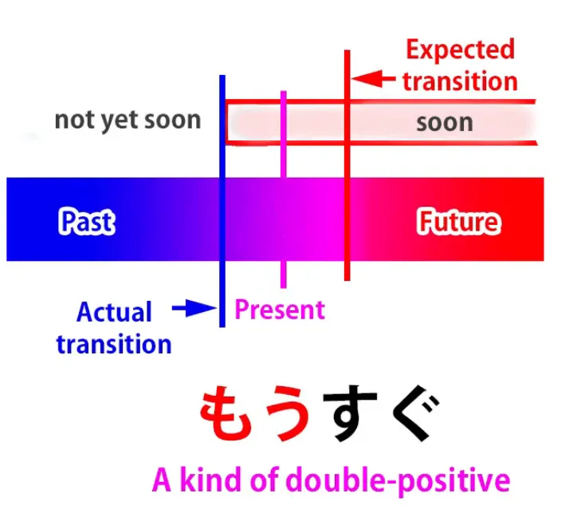

Sekarang, kita juga bisa mengatakan <code>もう少し</code>. Misalnya, jika beberapa orang sedang berjalan ke suatu tempat dan mereka sudah berjalan cukup lama serta mulai lelah, seseorang mungkin akan berkata <code>もう少し!</code> yang berarti <code>just a little more / just a little extra</code>. Dan itu bisa berarti <code>just a little more effort</code>, tetapi bisa juga berarti <code>just a little more time</code>.

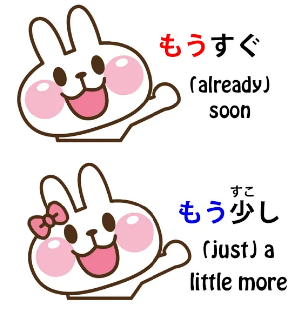

Jadi, kamu lihat, <code>もうすぐ</code> dan <code>もう少し</code>, meskipun keduanya adalah kata yang berbeda <code>もう</code>, dalam beberapa keadaan memiliki arti yang sangat mirip.

Dan yang lainnya <code>もう</code>, kata sambung <code>もう</code>, juga sering digunakan untuk mengekspresikan hubungan waktu. Jadi, jika kita mengatakan <code>もう一度</code>, kita berarti <code>one more time</code>. Sekarang jelas ini memiliki arti yang hampir sama dengan ketika kita mengatakan <code>もう一つ</code>, yang berarti <code>one more thing</code> — satu permen lagi, satu apa pun lagi.

Namun, ungkapan ini juga sangat sering digunakan dengan <code>一度</code>: satu kali lagi. <code>もう二度来ない</code> berarti <code>I&#x27;ll never come again</code>, secara harfiah <code>I won&#x27;t come for another second time</code>.

Jadi, kita bisa melihat bahwa kedua <code>もう</code>s cukup berdekatan dalam hal makna. Keduanya dapat digunakan untuk hubungan waktu dan dalam beberapa konteks, seperti <code>もう少し</code> dan <code>もうすぐ</code>, maknanya hampir identik.

Namun, begitu kita memahami keduanya dan cara kerjanya, saya rasa tidak akan ada lagi ruang untuk kebingungan…

::: info
Akan ditambahkan di sini:

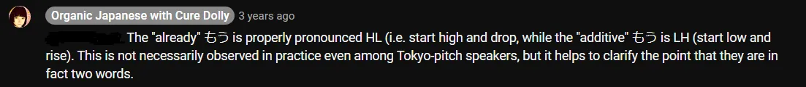
:::
