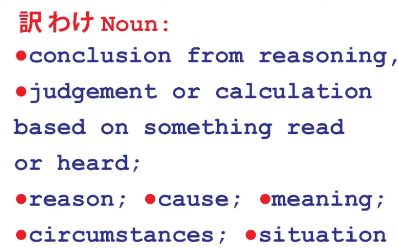
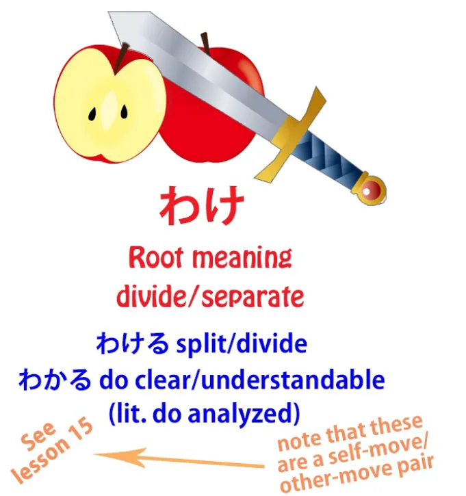
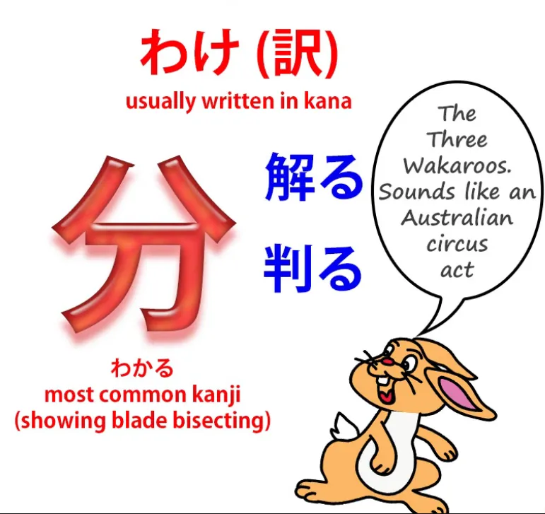
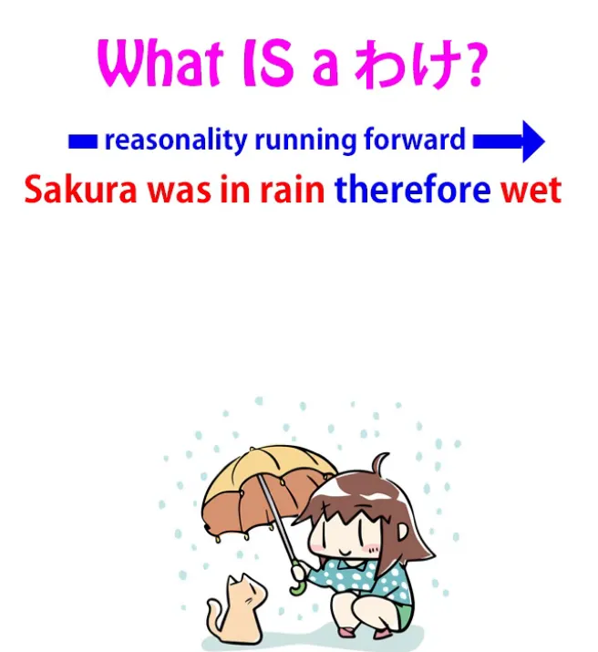
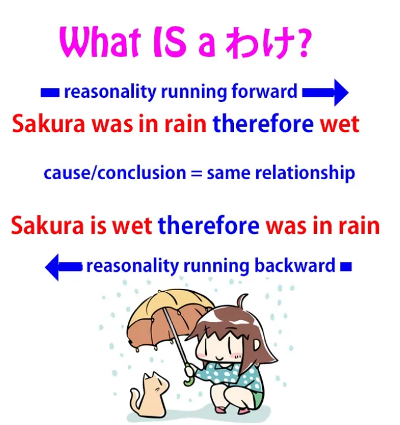
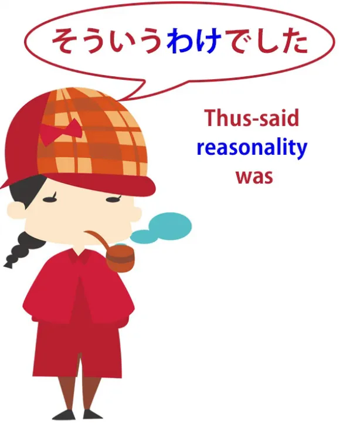
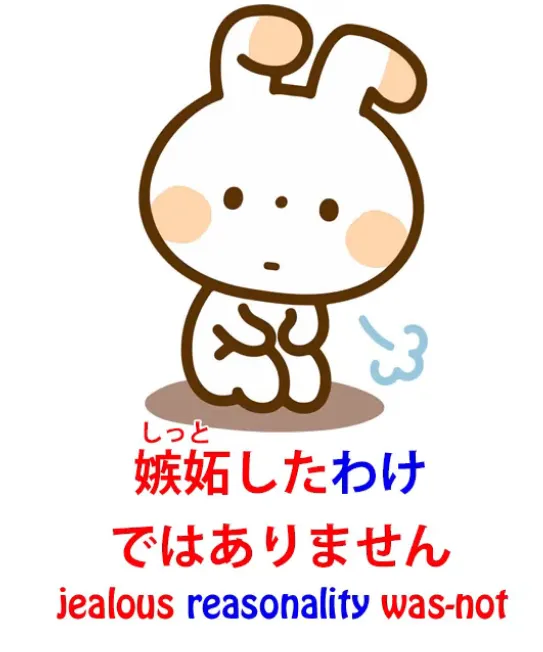
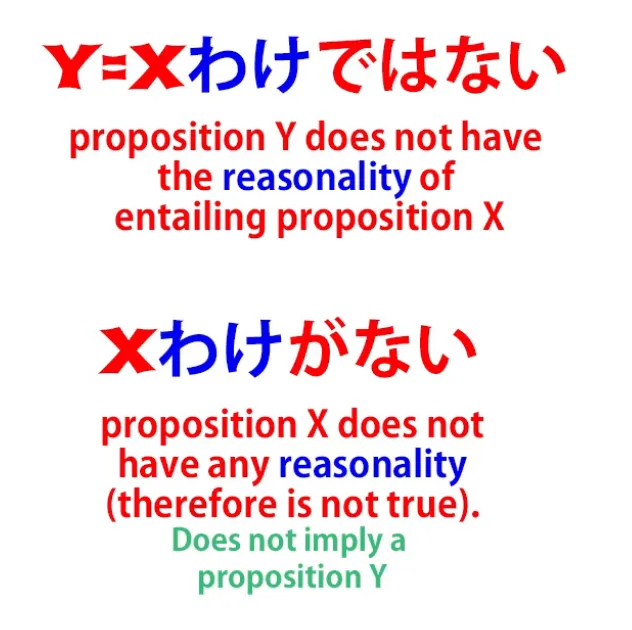
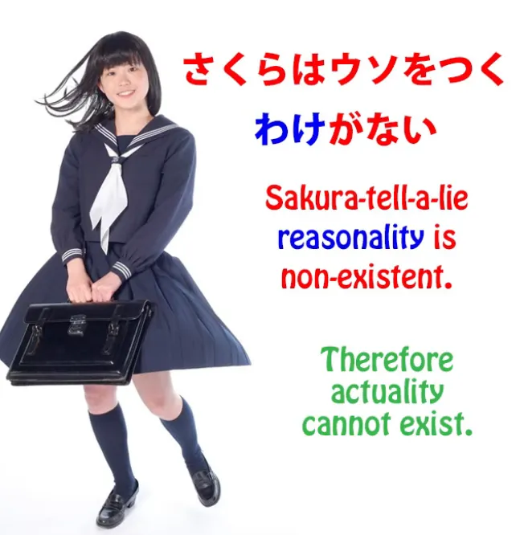

# **68. Bahasa Jepang <code>underlying logic</code>: わけ、そういうわけ、わけが分からない、わけない**

[**Bahasa Jepang <code>underlying logic</code>: わけ、そういうわけ、わけが分からない、わけない | Pelajaran 68**](https://www.youtube.com/watch?v=iU79wvDyDfk&amp;list;=PLg9uYxuZf8x_A-vcqqyOFZu06WlhnypWj&amp;index;=70&amp;ab;_channel=OrganicJapanesewithCureDolly)

こんにちは。

Hari ini kita akan membahas <code>わけ</code>,

yang merupakan kata dalam bahasa Jepang yang bisa menimbulkan banyak kebingungan karena digunakan dalam berbagai cara dan situasi yang berbeda dalam bahasa Jepang, dan dalam kamus bahasa Inggris, kata ini memiliki deretan definisi yang tampak sangat terpisah-pisah dan membingungkan. Namun, begitu kita memahami logika sebenarnya, makna mendasar dari kata tersebut, semuanya menjadi jelas dengan sendirinya. Jadi, apa itu <code>わけ</code>?

## わけ / 訳

Pertama-tama, mari kita lihat definisi kamus bahasa Inggrisnya. Dalam kamus daring disebutkan <code>わけ</code> berarti &quot;kesimpulan dari penalaran;
penilaian atau perhitungan berdasarkan sesuatu yang dibaca atau didengar;
alasan; sebab; makna; keadaan; situasi&quot;.

Jadi, apa sebenarnya artinya dari semua itu? Nah, untuk sekali ini kamus sebenarnya setuju bahwa itu adalah kata benda. <code>わけ</code> adalah kata benda, jadi jenis kata benda apa itu?

Apa itu <code>わけ</code>? Baiklah, mari kita lihat sedikit sejarah kata tersebut.

Awalnya, <code>わけ</code> berarti <code>divide or separate</code>. Jadi, kata ini terkait dengan <code>分ける</code>, yang merupakan kata kerja yang berarti <code>divide or separate</code>, dan juga, yang lebih penting untuk tujuan kita saat ini, <code>分かる</code>, yang pada dasarnya juga berarti <code>divide or separate</code> tetapi dalam arti <code>break down, or analyze</code>.

Jadi, ketika kita mengatakan <code>本が分かる</code>, seperti yang telah saya tunjukkan dalam pelajaran sebelumnya, sebenarnya kita tidak mengatakan <code>I understand the book</code>; yang kita maksudkan adalah <code>the book does understandable or does clear</code>. Kita bisa mengatakan dalam bahasa Inggris <code>The book is clear to me</code>, tetapi sebenarnya itu bukan kata sifat, melainkan kata kerja — <code>the book does clear (to me)</code>.

Tetapi ketika kita mengatakan <code>clear</code> kita menggunakan metafora yang sedikit keliru jika kita ingin membahas etimologi sebenarnya dari kata tersebut. <code>Clear</code> adalah metafora, jelas, dari kata &quot;melihat&quot;. Namun, metafora sebenarnya yang mendasari <code>分かる</code> adalah diuraikan menjadi bagian-bagian penyusunnya, dianalisis atau dapat dianalisis. *(lihat Pelajaran 59)*

Dan itulah yang <code>わけ/訳</code> yang dimaksud di sini. Sekarang saya tahu beberapa dari kalian mungkin berpikir <code>but it&#x27;s a different kanji</code>.

Ya, itu benar. Kita biasanya mengaitkan <code>分かる</code> dengan kanji ini, tetapi sebenarnya kata tersebut dapat ditulis <code>分かる</code> dengan tiga kanji yang berbeda dan semuanya memiliki makna yang sedikit berbeda — *分かる*, *解る*, *判る* dan saya telah [**menulis artikel**](https://www.youtube.com/watch?v=6bI_WLm8Jmo&amp;ab;_channel=OrganicJapanesewithCureDolly) *(sebenarnya itu adalah video)* tentang hal itu jika Anda tertarik, jadi saya akan menyertakan tautan di bagian informasi di bawah ini *(yang ditautkan adalah video).*

Intinya adalah bahwa <code>わけ / 分かる</code> tidak terikat pada satu kanji tertentu. Ini adalah kata dasar dalam bahasa Jepang yang sudah ada jauh sebelum kanji yang digunakan untuk mewakilinya, dan ide dasarnya dalam semua kasus ini sama: ide pemisahan, pembagian, analisis, dan penguraian.

Jadi, apa sebenarnya <code>わけ/訳</code>? Mari kita ambil definisi bahasa Inggris yang paling menonjol, yaitu: sebab, alasan, dan kesimpulan berdasarkan sesuatu yang telah kita lihat atau dengar.

Sekarang, perhatikan bahwa sebab, alasan, dan kesimpulan secara umum merujuk pada hal yang sama. Perbedaan utamanya adalah apakah prosesnya berjalan mundur atau maju.

Mari kita ambil contoh. Jika saya mengatakan <code>Sakura was out in the rain, and therefore she&#x27;s wet</code>, kita mengambil dua fakta yang diketahui dan menyatakan hubungan sebab-akibat, penalaran, antara keduanya.

Jika saya mengatakan <code>Sakura is wet and therefore I reason that she was out in the rain</code>, kita mengambil bagian penalaran yang persis sama, kausalitas yang sama, dan mengarahkannya ke arah yang berlawanan.

Kita bergerak dari satu fakta yang diketahui ke fakta yang belum diketahui, yang kita capai melalui penalaran tersebut. Namun, bagian penalaran itu, hubungan sebab-akibat itu, rasionalitas logis mendasar yang mendasarinya, sama dalam kedua pernyataan tersebut.

Dalam satu kasus kita mengembangkannya ke depan, dalam kasus lain kita mengembangkannya ke belakang, tetapi rasionalitas logis kausal mendasar yang mendasarinya, untuk menciptakan istilah, adalah sama. Dan saya menciptakan istilah tersebut <code>reasonality</code> karena sebenarnya tidak ada kata untuk ini dalam bahasa Inggris.

Namun dalam bahasa Jepang ada, dan kata tersebut adalah <code>わけ/訳</code>. Jadi <code>わけ</code>, seperti yang kita lihat, mengekspresikan sebuah sebab, alasan, dan kesimpulan atau penilaian logis — semua hal tersebut.

Yang sebenarnya diungkapkan adalah kausalitas atau rasionalitas yang mendasarinya, dan ketika kamus mengatakan bahwa kata tersebut juga mengungkapkan keadaan atau situasi atau sesuatu seperti itu, sebenarnya tidak demikian, tetapi yang dilakukannya adalah mengungkapkan rasionalitas yang mendasari suatu keadaan atau situasi.

Dan begitu kita memahami hal itu, kita dapat mulai memahami berbagai cara di mana <code>わけ</code> digunakan. Jadi, kata ini digunakan untuk memberikan alasan.

## そういうわけ

Jadi, jika seseorang berkata <code>そういうわけでベッドの下に隠れた</code> — *Karena alasan tersebut, saya bersembunyi di bawah tempat tidur* <code>that&#x27;s why I was hiding under the bed</code> — itulah alasannya.

Jika kita menemukan solusi untuk kejahatan yang tampaknya mustahil, kita berkata, <code>そういうわけでした</code> — <code>so that&#x27;s how it happened</code>.

Dan kita sebenarnya tidak sedang membicarakan fakta kejahatan, keadaan kejahatan, atau situasi kejahatan; kita sedang membicarakan alasan yang pada awalnya tampak sangat samar dan kini telah kita pahami.

Dan jika Anda perhatikan, dalam kalimat ini kita mengatakan <code>そういうわけでした</code>, dalam bentuk lampau. Bukan karena penalaran saya terjadi di masa lalu. Penalaran saya mungkin sedang terjadi saat ini. Tetapi karena alasan di balik peristiwa tersebut terjadi pada saat peristiwa itu terjadi, dan itulah yang sedang kita bicarakan.

Jika kita mengatakan <code>そんなわけで宿題を忘れました</code> – *Karena alasan seperti itulah saya lupa mengerjakan PR*

kita mengatakan <code>that&#x27;s why I forgot my homework</code>, itulah alasannya, hubungan sebab-akibat yang menjelaskan mengapa saya lupa pekerjaan rumah saya dan mengapa Anda tidak boleh menyalahkan saya.

## わけが分からない / 訳が分からない

Sekarang, <code>わけ</code> digunakan dalam banyak konteks negatif yang sangat penting dalam bahasa Jepang. Salah satu yang sering kamu dengar adalah <code>わけが分からない</code>.

Nah, itu sangat membingungkan jika kita tidak tahu apa <code>わけ</code> artinya dan kita juga, seperti halnya jika Anda menganggap serius buku teks, tidak tahu apa <code>分かる</code> artinya. <code>分かる</code>, seperti yang kita ketahui, tidak berarti <code>understand</code>; artinya <code>do clear</code> atau, jika kita mengambil arti paling harfiah dari kata tersebut, <code>do broken down / do analyzed</code>.

Jadi, yang sebenarnya kami katakan di sini adalah bahwa penalaran, rasionalitas yang mendasari sesuatu <code>doesn&#x27;t do analyzed</code>. Cara entitas AI seperti saya cenderung mengatakannya adalah <code>the reasoning behind that does not compute</code>. Dengan kata lain, itu tidak berarti apa-apa, itu omong kosong.

### わけ sebagai <code>It’s not as if…</code> / <code>It’s not that</code> / <code>It doesn’t mean that…</code>

Dalam penggunaan negatif lainnya, <code>わけ</code> sering digunakan untuk berarti <code>it&#x27;s not as if... / it&#x27;s not that...</code> atau <code>it doesn&#x27;t mean that...</code> Dan tentu saja, semua itu pada dasarnya bermuara pada hal yang sama.

Kita ambil kalimat A, lalu kita menyatakan bahwa kesimpulan kalimat B tidak dapat ditarik darinya. Jadi, jika kita katakan, misalnya, bahwa dia selalu makan di restoran murah, lalu menambahkan <code>お金が足りないわけではない</code>, kita mengatakan <code>it isn&#x27;t that she&#x27;s short of money</code> atau <code>it&#x27;s not as if she&#x27;s short of money</code>. / *Uang-tidak-cukup alasan-bukan*

Yang kita katakan di sini adalah bahwa kesimpulan dari fakta bahwa dia selalu makan di restoran murah bukanlah bahwa dia kekurangan uang; dia tidak kekurangan uang.

Seseorang mungkin berkata, <code>嫉妬したわけではありません</code> — <code>it&#x27;s not that I got jealous</code>. Sekali lagi, <code>don&#x27;t draw from my actions or words the conclusion that I got jealous. That&#x27;s not what it was</code>.

Dan, pada dasarnya, kamus-kamus di sini mengatakan bahwa <code>わけ</code> berarti suatu situasi atau keadaan karena mereka menganggap pernyataan-pernyataan ini sebagai penolakan terhadap situasi atau keadaan tersebut, tetapi seperti yang Anda lihat, bukan itu tepatnya yang mereka lakukan.

Mereka tidak menyangkal situasi atau keadaan tersebut, melainkan menyangkal alasan yang mendasari situasi atau keadaan tersebut, dan dengan melakukan itu secara implisit juga menyangkal situasi atau keadaan tersebut, tetapi hal itu tidak selalu terjadi.

Misalnya, kita mungkin mengatakan <code>Just because she&#x27;s fat doesn&#x27;t mean she eats too much</code> — <code>食べすぎるわけではない</code>, alasannya bukanlah karena dia makan terlalu banyak.

Dan kita mungkin tidak mengatakan bahwa dia tidak makan terlalu banyak. Kita hanya mengatakan bahwa fakta bahwa dia gemuk tidak selalu berarti dia makan terlalu banyak; itu bukan alasan yang baik.

Kita tidak tahu apakah itu benar atau tidak, tetapi dari fakta bahwa dia gemuk, kita tidak bisa mengatakan itu. Jadi, yang kita lakukan dalam semua kasus ini adalah menyangkal adanya hubungan rasional tertentu.

Kita mengatakan bahwa hubungan rasional itu tidak ada. Apakah fakta bahwa implikasi tersebut ada atau tidak bukanlah inti pembicaraan kita di sini. Dalam beberapa kasus kita menyiratkan bahwa hubungan itu tidak ada, dalam beberapa kasus lain kita mungkin tidak menyiratkan apa pun.

Namun, hal penting yang kita tolak adalah rasionalitas yang mendasari, hubungan logis yang mungkin dibuat dalam kasus-kasus ini.

## わけない / 訳ない (訳がない)

Sekarang, penggunaan negatif lain yang umum adalah <code>わけがない</code>, terkadang disingkat menjadi hanya <code>わけない</code>.

Ini cenderung secara tegas menyangkal bahwa sesuatu itu benar-benar ada. Sekali lagi, seseorang mungkin berpikir bahwa ia menyangkal situasi atau keadaan tersebut, tetapi yang sebenarnya disangkal adalah rasionalitasnya.

Lalu, bagaimana kita membedakan ini dari penggunaan yang telah kita lihat sebelumnya? Baiklah, mari perhatikan perbedaan strukturalnya.

Yang satu adalah <code>x わけではない</code>, artinya keadaan yang telah kita bicarakan atau rujuk tidak memiliki alasan tersebut. Inilah perbedaan sederhana antara <code>ではない</code> dan <code>がない</code> yang telah kita bahas jauh sebelumnya dalam pelajaran tentang kalimat negatif. *(mungkin Pelajaran 7)*

Jadi, dalam kasus-kasus ini ketika kita mengatakan <code>it doesn&#x27;t mean that... / it&#x27;s not that... / it&#x27;s not as if...</code> dll, dengan kata lain <code>that reasoning doesn&#x27;t apply</code>, di sini kita mengatakan bahwa tidak ada alasan yang ada. <code>わけがない</code>: <code>there is no reasoning</code>.

Dan oleh karena itu, karena tidak ada alasan, karena tidak masuk akal, hal itu tidak mungkin terjadi. Jadi, misalnya, <code>さくらはウソをつくわけがない</code> – *Alasan Sakura berbohong tidak ada* <code>Sakura wouldn&#x27;t tell a lie</code> — tidak mungkin dia berbohong.

Logika atau alasan mendasar bahwa Sakura berbohong tidak ada, oleh karena itu tidak mungkin dia akan berbohong. Sekali lagi, <code>さくらを忘れるわけがない</code> — <code>I won&#x27;t forget Sakura</code> atau <code>I won&#x27;t forget you, Sakura</code>.

Yang kami maksud di sini sebenarnya adalah bahwa alasan mendasar untuk melupakan Sakura tidak ada. Tidak ada alasan, tidak masuk akal, oleh karena itu hal itu tidak mungkin terjadi.

### わけがない sebagai <code>there is no reason</code>

Sekarang, ada makna lain yang mungkin untuk <code>わけがない</code> dan itu dalam arti yang lebih langsung dan harfiah, yaitu sekadar <code>There&#x27;s no reason</code>. Ini bukan berarti hal itu tidak terjadi atau tidak ada, tetapi tidak ada alasan untuk itu.

---

Jadi, misalnya, <code>そんなにお金の要るわけがない</code>

<code>there&#x27;s no reason she would need that much money</code>

::: info
karena &quot;いる&quot; ini, sesuai dengan apa yang dikatakan Dolly, berarti <code>need</code>, saya menuliskan 要る dalam bentuk Kanji-nya untuk mencerminkannya, bukan hanya <code>to be</code> 居る / いる.
:::
*Selain itu, ini... hanya untuk jaga-jaga…
*

Dia mungkin memintanya, dia mungkin mendapatkannya, tetapi sebenarnya tidak ada alasan mengapa dia membutuhkannya.

Bagaimana kita tahu perbedaan antara keduanya? Nah, ini soal konteks, dan saya sudah membuat video tentang cara menangani hal semacam ini.

Kita sebenarnya melakukannya dalam bahasa Inggris setiap saat. Banyak pernyataan memiliki lebih dari satu kemungkinan interpretasi dan sebagian besar waktu kita tidak menyadarinya karena kita sudah terbiasa menggunakan konteks untuk menentukan makna mana dari rentang kemungkinan yang harus diterapkan dalam kasus tertentu.

Kita tidak menyadari proses ini, jadi kita benar-benar perlu memahaminya agar dapat menerapkannya dalam bahasa Jepang atau bahasa lain. Jadi, tontonlah video tersebut jika Anda belum melihatnya [[48]](./48-dealing-with-ambiguity-in-japanese.md).

### わけがない sebagai <code>simple, easy</code>

Dan hal itu mungkin sangat berguna, karena ada penggunaan ketiga dari kata negatif ini <code>わけがない</code>, yang sering disingkat menjadi hanya <code>わけない</code>, yaitu untuk mengatakan bahwa sesuatu itu sederhana atau mudah.

<code>日本語を話すのはわけがないことだ</code> — <code>Speaking Japanese is easy, no problem.</code>

Mengapa kita mengatakan <code>わけがない</code> di sini? Yang kita maksudkan adalah bahwa sebenarnya tidak diperlukan alasan apa pun.

Hal ini dapat disamakan dengan ungkapan dalam bahasa Inggris <code>no-brainer</code>. Anda mungkin berpikir itu berarti sesuatu itu bodoh, tetapi yang sebenarnya dimaksud adalah bahwa sesuatu itu begitu mudah atau begitu jelas sehingga tidak memerlukan pemikiran sama sekali untuk menyimpulkan hal tersebut.

Dan inilah penggunaan <code>わけない</code> kata &quot;di sini&quot;. &quot;Itu hal yang jelas. Berbicara bahasa Jepang itu sederhana. Mudah sekali. Gampang banget.&quot;

Dan sekali lagi, tidak banyak kemungkinan kesalahpahaman atau kebingungan mengenai penggunaan yang berbeda asalkan Anda memahami aturan dasar disambiguasi. Dan asalkan sebagian besar waktu Anda melakukannya dalam konteks, dalam imersi bahasa Jepang yang sesungguhnya, dan bukan dalam kalimat contoh yang terpotong-potong.

Jadi jangan lupa: struktur adalah kunci imersi, tetapi imersi adalah kunci untuk menguasai bahasa Jepang.
