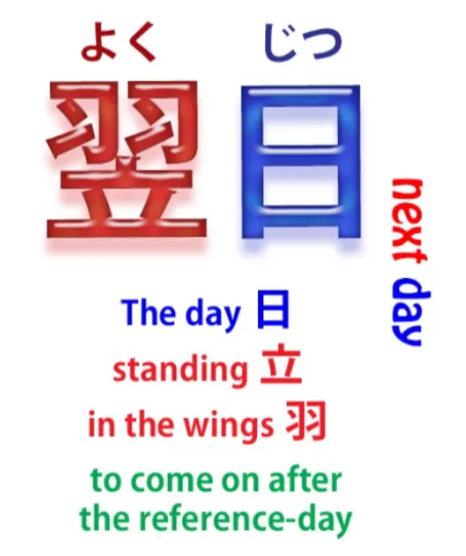
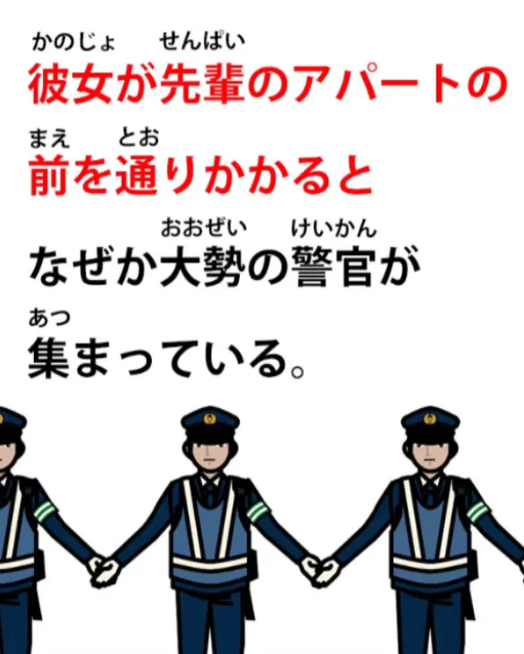
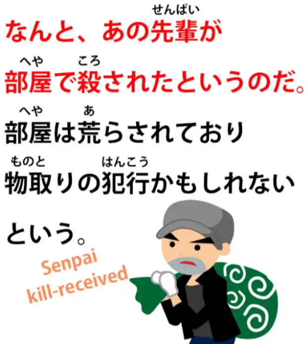
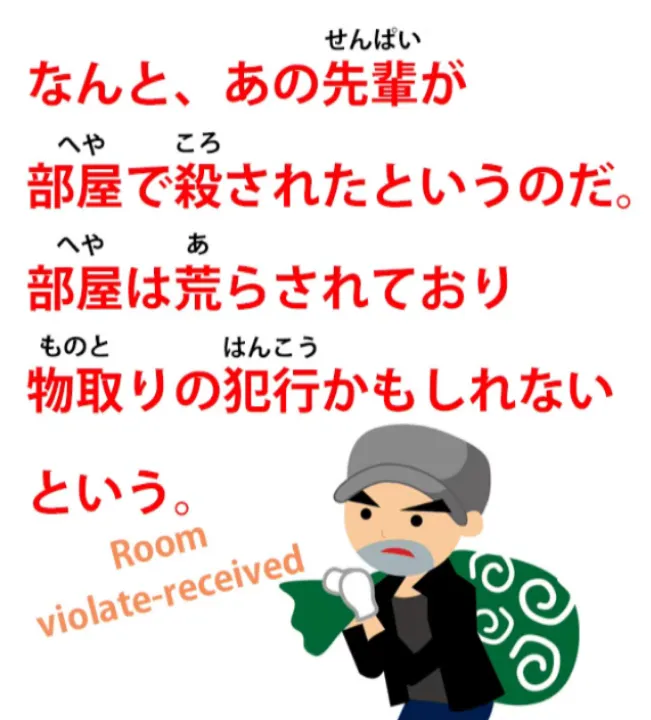
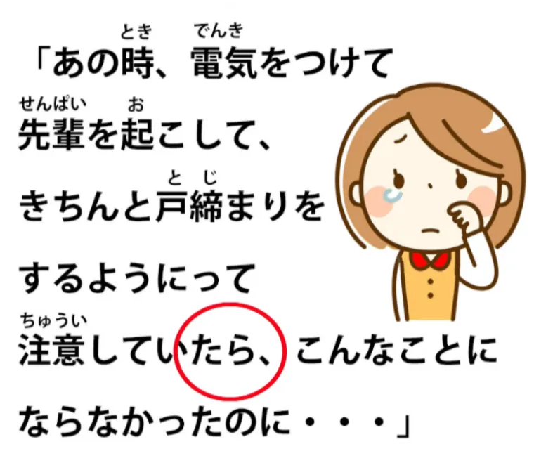
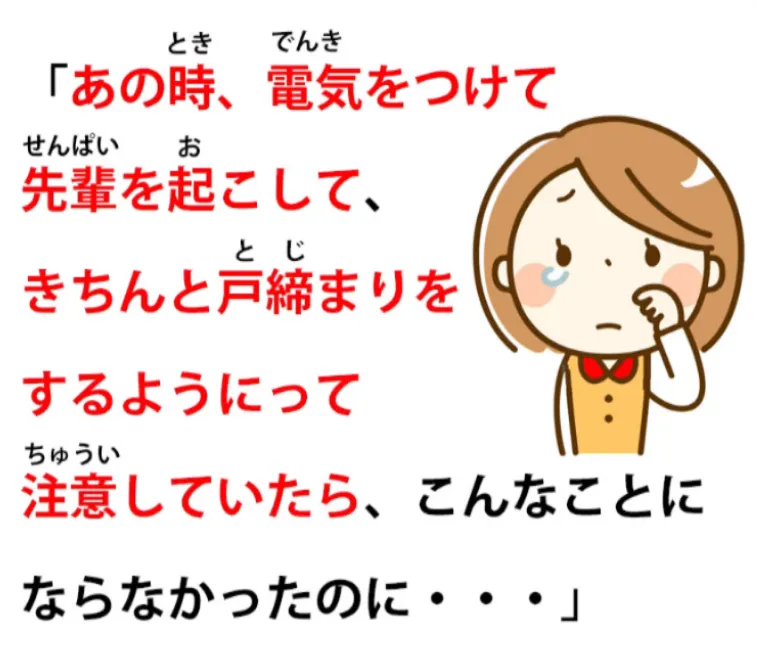
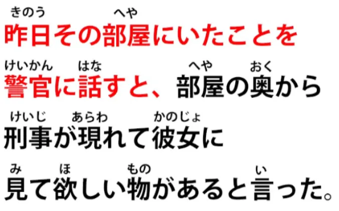
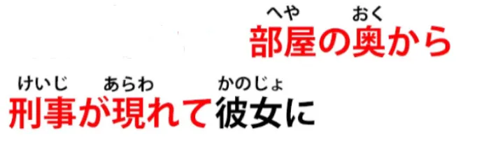
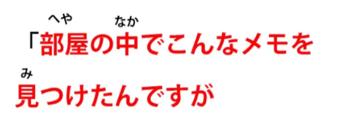
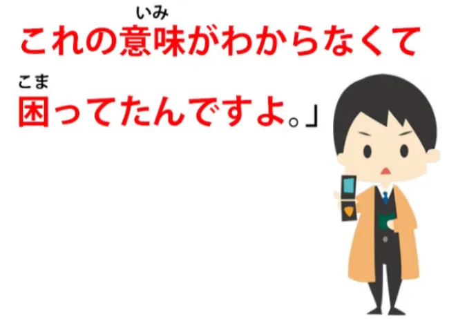

# **69.** **Bahasa Jepang di Dunia Nyata! Menghadapi materi asli berbahasa Jepang. 怪談 4**

[**Bahasa Jepang di Alam Liar! Menghadapi materi asli Jepang. Kaidan 4 | Pelajaran 69**](https://www.youtube.com/watch?v=Iezf0NR-cTE&amp;list;=PLg9uYxuZf8x_A-vcqqyOFZu06WlhnypWj&amp;index;=71&amp;ab;_channel=OrganicJapanesewithCureDolly)

こんにちは。

Hari ini kita akan kembali ke &quot;怪談&quot; / &quot;かいだん&quot;, cerita horor Jepang yang kita mulai beberapa episode lalu, agar kita bisa menghadapi tantangan-tantangan lain dalam membaca bahasa Jepang asli yang sesungguhnya. Saya telah mengumpulkan semua episode ini dalam satu daftar putar, sehingga Anda dapat melihat keseluruhan &quot;怪談&quot; di satu tempat, dan saya akan menyertakan tautannya tepat di atas kepala saya di sini.

Sekarang, untuk merangkum cerita sejauh ini, tokoh utama kita pergi ke pesta minum di apartemen Senpai-nya dan, saat pulang larut malam, dia menyadari bahwa dia telah meninggalkan &quot;携帯&quot;-nya (telepon genggamnya) di apartemen Senpai. Jadi, dia kembali, mengetuk pintu, dan tidak ada jawaban. Dia mencoba pegangan pintu dan pintunya tidak terkunci, jadi dia masuk.

Dan di dalam sana gelap gulita, jadi dia mengira Senpai sudah tidur. Dia berpikir untuk menyalakan lampu dan membangunkan Senpai, tapi mengingat dia cukup mabuk saat pergi, dia memutuskan untuk tidak melakukannya. Dia meraba-raba dalam kegelapan untuk mencari &quot;携帯&quot;-nya, lalu pergi. Dan itulah ceritanya sejauh ini.

---

Jadi, mari kita lihat apa yang terjadi keesokan harinya.

<code>翌日</code> — itu artinya <code>next day</code>. Kata ini <code>翌</code> — seperti yang Anda lihat, kanji-nya adalah bulu atau sayap dan kanji untuk berdiri. Jadi kita bisa mengatakan bahwa itu adalah hari di mana dia berdiri di belakang panggung menunggu giliran untuk tampil,  
yang kini telah terjadi.

<code>翌日</code> — Keesokan harinya — <code>彼女は先輩のアパートの前を通りかかると...</code>

Jadi, kita memiliki klausa logis pertama di sini dan kita memiliki <code>と</code> yang merupakan kalimat bersyarat “jika/ketika”. Jadi akan ada sesuatu yang mengikutinya, tapi mari kita lihat yang pertama ini saja: <code>通りかかる</code> secara harfiah berarti <code>pass hang</code>, tetapi artinya, menurut kamus-kamus Jepang, adalah <code>ちょうどその場所に通る</code>, yang artinya sebenarnya <code>just happened to be passing that particular place</code>. Jadi dia tidak pergi ke sana untuk tujuan apa pun, dia hanya kebetulan lewat.

<code>なぜか大勢の警官が集まっている</code> –

<code>大勢</code> berarti jumlah yang banyak, kerumunan — mengacu pada orang — <code>警官</code>, seperti yang pasti Anda ketahui, adalah seorang polisi. Jadi, <code>なぜか...</code> (<code>なぜか</code> — <code>for some reason</code>) banyak polisi berkumpul — <code>集まっている</code>.

<code>集まる</code> adalah <code>gather</code>; <code>集まっている</code> — <code>exist in a state of being gathered</code>. Banyak polisi berkumpul.

<code>事情を聞いて彼女は驚いた</code>

<code>事情</code> adalah <code>the situation or circumstances</code>. Dalam bahasa Inggris, kita mungkin akan mengatakan <code>She asked what was going on</code>.

Dan <code>驚いた</code> biasanya diterjemahkan sebagai <code>be surprised</code> tetapi bisa lebih kuat dari itu, dan kita bisa melihat bahwa dalam kasus ini, artinya lebih kuat dari itu. Ketika dia menanyakan situasi tersebut, dia terkejut atau kaget. Dan <code>彼女は</code> di sini juga memberikan penekanan pada <code>驚いた</code>, dan kita akan membahas hal itu dalam sebuah video dalam waktu dekat, sifat penekanan dari &quot;は&quot; *(video belum diketahui)*.

Ketika dia menanyakan situasi tersebut, dia terkejut atau kaget dengan apa yang didengarnya.

<code>なんと... </code> — Apa! / Apa ini? 

<code>なんとあの先輩が部屋で殺されたというのだ</code> — <code>That senpai, in that apartment, received the action of being killed.</code>

Dan ini adalah bentuk pasif, bukan? Dia menerima tindakan <code>being killed</code>.

<code>というのだ</code> : <code>という</code> — itulah yang diberitahukan kepadanya, itulah yang dikatakan; <code>のだ</code> — nah, kita sudah membahas <code>んだ / のだ</code> akhir [**di video lain**](https://www.youtube.com/watch?v=lYvIOi8Q3I8&amp;ab;_channel=OrganicJapanesewithCureDolly).

Jadi ini benar-benar mengatakan, <code>It was that senpai had, in that room, received the action of being killed.</code> Itulah yang terjadi; itulah yang sedang terjadi.

Ketika dia bertanya tentang situasinya, ternyata senpai itu telah dibunuh di ruangan itu.

---

<code>部屋は荒らされており</code>

<code>荒らす</code> adalah <code>storm or violate or mess up</code>. Jadi, ruangan itu mengalami tindakan yang merusak atau melanggar.

Dan kata kerja bantu penerima berbentuk &quot;て&quot; dan diikuti oleh <code>おり</code>. Sekarang, <code>居る / おる</code> — seperti yang kita bahas di episode sebelumnya dalam seri ini, <code>居る / おる</code> adalah cara sastra, yang agak kuno, untuk mengatakan <code>居る / いる</code>. Jadi <code>荒らされておる</code> sama dengan <code>荒らされている</code>: <code>was in a state of having received being violated or messed up</code>.

Dan kemudian <code>おる</code> dimasukkan ke dalam bentuk kata dasarnya (い), <code>おり</code>, yang sekali lagi, seperti yang telah kita bahas sebelumnya, merupakan cara yang sedikit lebih sastrawi untuk menggabungkan dua klausa dalam kalimat majemuk. Jadi ini menghubungkan klausa ini dengan klausa berikutnya, yang memberikan dugaan tentang situasi tersebut: <code>The room was in a state of having received being messed up or violated, and...</code>

<code>物取りの犯行かもしれないという</code> :

<code>物取り</code> adalah <code>もの/物</code> (sesuatu) + <code>取る</code> (mengambil), jadi <code>物取る</code> — <code>take thing</code>; <code>物取り</code> — kata benda dari mengambil benda, jadi <code>物取り</code> di sini <code>theft</code>; <code>犯行</code> adalah <code>criminal act</code>, sebuah <code>criminal going</code>, secara harfiah, tetapi sebuah tindakan kriminal.  
Jadi ini mungkin atau kemungkinan besar adalah kejahatan pencurian, perampokan...

<code>という</code> — <code>was said</code>. Dan siapa yang mengatakannya? Nah, mungkin polisi.

---

Sekarang, bagian selanjutnya ditulis dalam tanda kutip, tanda kutip persegi Jepang itu, dan ini adalah sesuatu yang dia pikirkan dalam hati. Dan kita akan melihat ada sejumlah klausa yang digabungkan di sini, dan semuanya akan diakhiri dengan - たら sebelum kita beralih ke komentar tentangnya.

Jadi, semua klausa yang berujung pada akhiran - たら ini adalah pernyataan if, pernyataan if bersyarat. Kita sudah membahas pernyataan bersyarat - たら, bukan? [[32]](./32-the- たら - なら -conditionals.md)

Jadi, <code>あの時</code> — <code>at that time</code> — 「電気を付けて先輩を起こして」 — <code>if I had put on the light</code> –

<code>***きちんと***/ちゃんと戸締りをするようにって</code>.

Sekarang, <code>ちゃんと</code> berarti <code>properly or correctly</code>;
::: info
Dalam video/gambar, Dolly justru memberikan きちんと alih-alih ちゃんと.  
Namun secara umum, keduanya tampaknya memiliki arti yang sama - kurang lebih seperti <code>properly</code>, jadi seharusnya tidak menjadi masalah besar. Mungkin ada perbedaan, tetapi seharusnya tidak merugikan di sini…
:::

<code>戸締り</code> — <code>戸</code> adalah <code>door</code>, <code>締まる</code> adalah <code>closing</code>, jadi <code>戸締り</code> adalah <code>door-closing</code>.

Dan kemudian <code>をする</code>: kamu bisa saja mengatakan <code>戸締りをする</code> — <code>do closing the door</code> — tetapi di sini <code>戸締りをするようにって注意をしたら</code>.

<code>ように</code> dalam hal ini berarti <code>making (something) become like (something)</code>. Jadi yang sebenarnya dimaksud adalah <code>made it so that the door was properly closed</code>.

Dan kemudian itu <code>って</code> adalah singkatan dari <code>という</code> (kita sudah membahas hal itu). *- Pelajaran 18* Jadi <code>という</code> artinya dalam hal ini <code>that kind of</code>; <code>注意をして</code> — <code>注意</code> adalah <code>care or caution</code> — kamu sering melihat tanda-tanda di Jepang <code>注意をしてください</code> – <code>take care please / act cautiously</code>.

Jika dia bertindak dengan hati-hati dengan menyalakan lampu, membangunkan Senpai, memastikan pintu tertutup rapat — dan kemudian semua ini berakhir dengan - たら. Jika dia melakukan ini...

<code>こんなことにならなかったのに</code>

Sekarang, <code>こんなこと</code> adalah <code>a state of affairs like this / this state of affairs</code> ; <code>にならなかったのに</code> : sekarang, seperti yang kita lihat, ini adalah klausa logis dan membutuhkan subjek, membutuhkan mobil A yang ditandai dengan -が. Jadi apa itu? Nah, itu adalah mobil nol, bukan?

<code>(Zeroが) こんなことにならなかった</code> — <code>It would not have become a thing like this.</code> Sekarang, apa artinya itu? Saya pikir kita bisa melihat analogi bahasa Inggris yang sangat mirip dengan ini.

Dalam bahasa Inggris, kita mungkin akan mengatakan, <code>it wouldn&#x27;t have come to this.</code> Yang dia katakan adalah, <code>it wouldn&#x27;t have become this kind of situation.</code> Jadi ini adalah strategi ekspresi yang sangat mirip.

Jika dia telah melakukan semua hal itu: jika dia telah memastikan semuanya aman dan tertata di rumah, bahkan dengan risiko mengganggu seorang senpai yang mabuk, hal mengerikan ini tidak akan terjadi.

—

<code>彼女が自責の念でいっぱいになりながら.</code>

<code>自責</code> adalah <code>self-blame / self-reproach</code> — <code>責</code> di sini, kanji ini sama dengan kanji untuk <code>責める</code> — <code>criticize or blame</code> — dan <code>ji</code> adalah <code>self</code>, jadi <code>自責... でいっぱいなりながら</code> — <code>-ながら</code>, seperti yang kita ketahui, adalah kata bantu, yang berarti melakukan kata kerja yang menyertainya sambil melakukan hal lain.

Nah, yang dia lakukan di sini adalah dipenuhi oleh <code>自責の念</code> — <code>thoughts (or feelings) of self blame</code>. Jadi, sambil dipenuhi perasaan menyalahkan diri sendiri, <code>昨日その部屋にいたことを警官に話すと</code> –

Sekarang, <code>と</code> memberi kita pernyataan if/when, tapi kita akan membahas ini dulu. <code>昨日その部屋にいたこと</code> berarti <code>the fact that she was in the room yesterday</code>.

Sekarang, kita tahu dia sedang membicarakan seseorang (atau seekor hewan) di sini karena itu <code>いた</code>, jadi satu-satunya yang mungkin adalah dirinya sendiri, fakta bahwa dia ada di dalam ruangan. Seandainya <code>昨日その部屋にあったこと</code>, mungkin artinya <code>the thing that took place in the room yesterday</code>. Nah, kita tahu itu tidak mungkin karena ini <code>いた</code> bukan <code>あった</code>.

Jadi, kita sedang membicarakan seseorang; kita sedang membicarakan dia. <code>昨日その部屋にいたことを警官に話す</code> dan kemudian <code>と</code>, yang merupakan pernyataan if/when kita.

Jadi, ketika dia memberi tahu polisi bahwa dia berada di kamar itu kemarin...

<code>部屋の奥から刑事が現れて...</code>

Sekali lagi, kalimat ini diakhiri dengan bentuk &quot;て&quot;; ini akan mengarah ke hal lain. Jadi ini adalah kalimat majemuk, tetapi sebenarnya tidak sulit karena terdiri dari klausa-klausa logis yang jelas yang saling membangun satu sama lain menjadi kesatuan yang lebih besar.

Jadi, <code>部屋の奥から刑事が現れて</code>: dari dalam ruangan, dari bagian dalam ruangan — <code>奥</code>, <code>the inside /the interior</code> — <code>刑事</code>, itu adalah seorang detektif polisi, <code>現れて</code> — <code>appeared</code>. Seorang detektif polisi muncul dari dalam ruangan, dan...

<code>彼女に見て欲しい物があると言った</code>

Sekarang, <code>見て欲しい</code> berarti <code>want someone else to see</code> sama seperti, seperti yang telah kami jelaskan dalam pelajaran sebelumnya[[49]](./49-japanese-point-of-view-deconfused- もらう - てもらう.md), <code>見てもらう</code> berarti <code>have someone else see</code>, <code>見て欲しい</code> berarti <code>want someone else to see</code>.

Dan sama seperti dengan <code>もらう</code>, orang yang Anda minta untuk melihat atau ingin melihat (atau ingin melakukan hal lain) ditandai dengan に sebagai sasaran kalimat tarik. Jadi, <code>もらう</code> dan <code>欲しい</code>, mereka menerima kalimat tipe pull, sehingga objek tidak langsungnya adalah orang yang melakukan hal yang kita ingin mereka lakukan, yang kita lihat mereka lakukan, dan sebagainya.

Jadi, artinya <code>彼女に見て欲しい物がある</code> – <code>a want-her-to-see thing exists</code>. <code>There&#x27;s something I want you to look at</code> adalah cara kita mengatakannya dalam bahasa Inggris. <code>と言った</code> — kata detektif itu, ada sesuatu yang ingin saya tunjukkan kepada Anda.

Dan dalam tanda kutip ini adalah kata-kata detektif tersebut:

<code>「部屋の中で</code> — <code>inside the room</code> — <code>こんなメモを見つけたんですが… – </code>memo semacam ini (atau sebenarnya, memo ini) yang kami temukan, *tapi* –

<code>見つけた</code>, <code>found/discovered/saw</code> – kami menemukan memo ini — <code>んですが</code>. <code>んですが</code> — sekali lagi kita memiliki <code>んです / のです</code> akhir cerita ini. Jadi yang dia katakan, <code>It is that we found this memo in the room</code>.

Itulah yang dimaksud / inilah intinya: <code>It is that we found this memo in the room, but/が...</code> — <code>これの意味が分からなくて...</code>

Sekali lagi kita diarahkan ke hal lain. &quot;Maknanya tidak jelas, dan...

<code>困ってんですよ」</code> — <code>困る</code> adalah <code>be at a loss / not know what to do</code> begitulah <code>because its meaning does not do understandable...</code> karena kita tidak bisa memahami maknanya, seperti yang kita katakan dalam bahasa Inggris, <code>...we&#x27;re at a loss</code>. Dan sekali lagi <code>んです</code> penutup: <code>It is that because we can&#x27;t understand its meaning, we&#x27;re at a loss.</code>

::: info
Kalimat tersebut mungkin sedikit lebih sulit dibaca, tetapi saya tidak bisa memperbesar lebih jauh, karena entah mengapa bagian akhir komentar akan tersembunyi secara permanen dengan <code>...</code> bukan teks..
:::
<code>彼女はそのメモを見て青ざめた</code>

Dia melihat memo itu dan... <code>青ざめる</code>.

Dalam bahasa Inggris, itu biasanya diterjemahkan sebagai <code>turned pale</code>. Arti harfiahnya adalah: <code>青</code> tentu saja <code>blue</code> dan <code>ざめる</code> di sini berarti <code>fade or lose color</code>.

Jadi, dia berubah menjadi biru, itulah arti harfiahnya. Dan kamu mungkin pernah melihat di anime dan manga dsb. bahwa memang begitulah cara mereka biasanya menggambarkan situasi ini.

Kamu sering melihat wajah orang diwarnai biru, biasanya dari dahi hingga sekitar tengah wajah. Jadi, memucat adalah cara mereka menggambarkan apa yang dalam bahasa Inggris kita sebut <code>turning pale</code>, dan kita melihatnya ketika seseorang terkejut atau sakit atau semacamnya.

Jadi, wajahnya memucat.

<code>そこにはこう書かれていた</code> — <code>In that place</code>, artinya, pada lembar kertas itu, <code>it had received being written this way / it was in a state of having received being written this way</code>. Dalam bahasa Inggris kita hanya akan mengatakan <code>this is what was written</code>.

Dan apa yang tertulis?

<code>電気をつけなくてよかったな</code> : <code>It&#x27;s a good thing you didn&#x27;t turn the lights on.</code>

Jadi, apa pendapat Anda tentang itu? Siapa yang menulis memo itu?

Dan apa maksudnya? Apa yang terjadi di ruangan itu malam itu?
