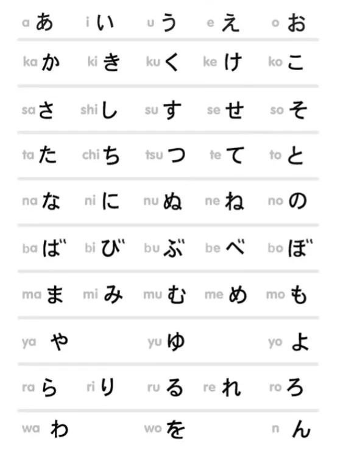
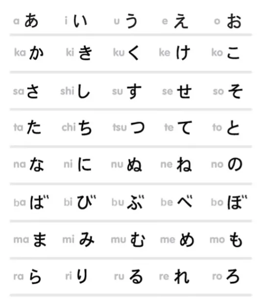
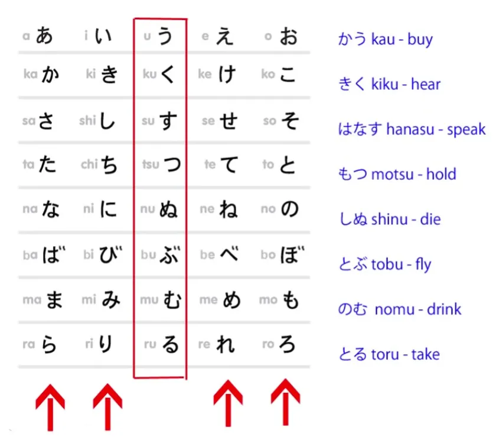
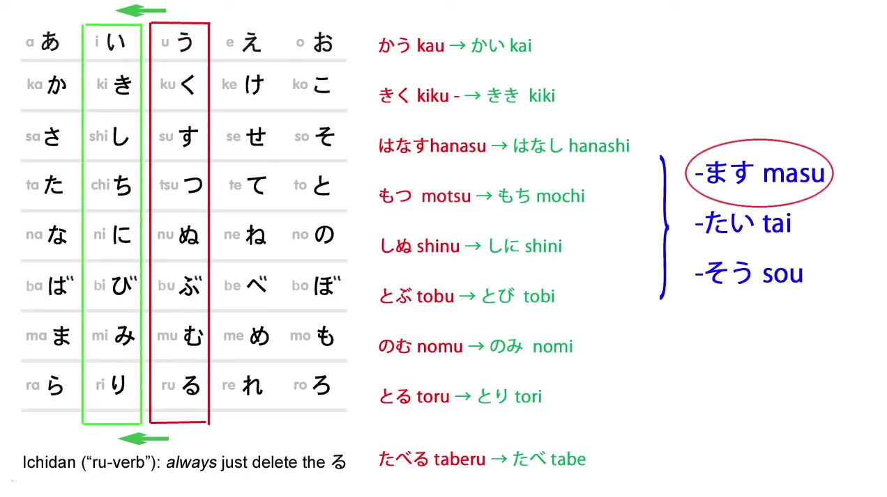
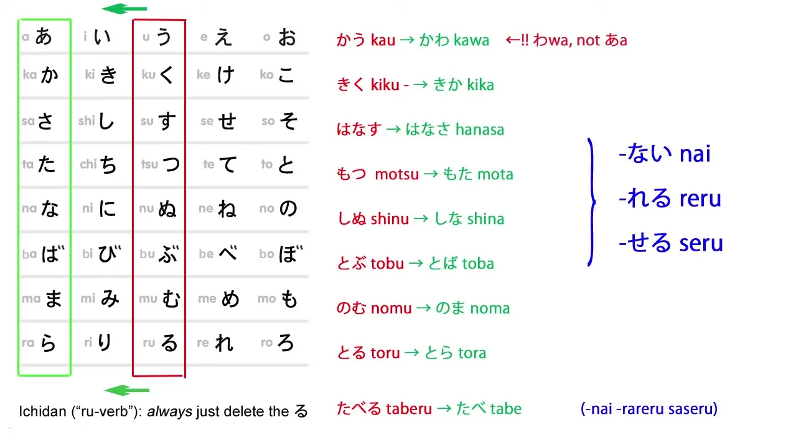
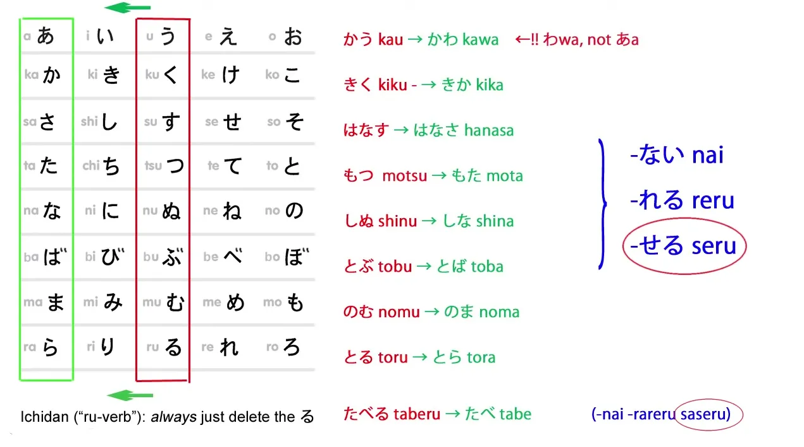

# **7.5. Konjugasi**

[**Konjugasi bahasa Jepang jadi mudah! Kunci super sederhana untuk semua konjugasi.**](https://www.youtube.com/watch?v=FhyrskGBKHE&amp;list;=PLg9uYxuZf8x_A-vcqqyOFZu06WlhnypWj&amp;index;=8)

Hari ini kita akan membahas konjugasi bahasa Jepang.

Konjugasi yang mana?, mungkin Anda bertanya. Nah, semuanya. Kecuali bentuk &quot;た&quot; dan &quot;て&quot;, yang akan kita bahas di video lain[[81]](./81-global-principle-of-all-japanese-word-forms.md).

Mengapa kita membahas semuanya sekaligus? Karena kita bisa. Karena konjugasi bahasa Jepang semuanya bekerja dengan cara yang sama. Sangat sederhana, sangat logis, dan sangat konsisten, serta sangat mudah dipahami.

Namun, ketika kita melihat buku teks, kita mendapat kesan bahwa ada banyak aturan dan bentuk berbeda yang harus dipelajari untuk setiap konjugasi tertentu. Mengapa demikian? Mengapa buku teks membuatnya tampak begitu rumit padahal sebenarnya sangat sederhana?

Ada dua alasan. Yang pertama adalah mereka bersikeras pada **konsep Eropa** tentang konjugasi. Sebenarnya, apa yang kita lakukan sama sekali bukan konjugasi.

::: info
*Jika Anda benar-benar menyukai membaca, ada [**diskusi menarik**](https://www.youtube.com/watch?v=cvV6d-RETs8&amp;lc;=UgzXdC7vyB-XKN543tt4AaABAg) tentang hal ini di bawah Pelajaran 13, jadi terserah Anda bagaimana menyebutnya; menyebutnya konjugasi boleh saja, terutama karena istilah itu sering digunakan, jadi setidaknya kenali dulu konsepnya.*
:::

::: detail Hanya salah satu catatan terminologi saya yang berbelit-belit dan beberapa hal lain yang berbelit-belit… (klik panah untuk memperluas)
Secara linguistik, bisa dibilang memang ada sesuatu seperti konjugasi dalam bahasa Jepang, tetapi tampaknya sangat berbeda dengan bahasa-bahasa Eropa, yang mungkin menjadi alasan mengapa Dolly menghindarinya, agar kita tidak menafsirkannya seperti itu dan menjadi bingung. Mengenai mengapa sebagian besar sumber menyebutnya konjugasi.

Sekali lagi, jangan anggap ini sebagai pernyataan definitif, ini hanya untuk menghindari asosiasi yang muncul dari kata tersebut <code>conjugation</code> dalam konteks bahasa-bahasa Eropa, karena memang ada bentuk konjugasi dalam bahasa Jepang, sama seperti Kata Benda Adjektival pada dasarnya adalah kata benda, TETAPI bukan kata benda sendiri (meskipun itu hanyalah 1 model dari banyak model lainnya).  
Ini hanya untuk menunjukkan bahwa ada banyak cara memandang sesuatu dan tidak selalu hitam-putih; ini adalah model, dan karena Anda tidak bisa menjelaskan segalanya sekaligus, Anda menyederhanakan beberapa hal.

---

Namun, perlu diingat bahwa Dolly terkadang terlalu negatif terhadap buku teks (meskipun beberapa kritiknya valid, buku teks memiliki tujuan yang berbeda dan selama sumber apa pun membantu Anda memulai imersi yang masif, itu sudah baik) dan terkadang menggambarkan dirinya sebagai <code>the best way</code> untuk mempelajari tata bahasa atau judul-judul clickbait pada beberapa videonya, saya tidak setuju dengan pola pikir/penyajiannya tersebut dan akan menerimanya dengan bijaksana. Karena Dolly menggunakan penjelasan sederhana agar mudah dipahami, beberapa hal yang dia katakan disederhanakan dan disesuaikan dengan modelnya, dan terkadang dia setidaknya sedikit tidak akurat/salah, setidaknya dari beberapa contoh yang saya dengar dibahas di internet dan di beberapa Discord oleh orang-orang yang tampaknya memiliki pemahaman yang lebih dalam tentang bahasa Jepang, meskipun saya tidak akan menarik kesimpulan apa pun karena saya sama sekali bukan ahli dalam hal apa pun yang berkaitan dengan Jepang atau mampu mencapai kesimpulan semacam itu sendiri.

Jika Anda ingin tahu alasannya, silakan lihat [**diskusi Discord MoeWay ini**](https://discord.com/channels/617136488840429598/1170582570161950752). **Jadi, jangan anggap Dolly sebagai kebenaran mutlak, tapi hanya sebagai cara berguna untuk menguasai dasar-dasar bahasa Jepang yang mendorong Anda ke dalam imersi = hal yang benar-benar penting.**  

---

Penjelasan saya hanyalah tebakan dan pemahaman pribadi saya, tetapi jelas tidak sepenuhnya akurat karena saya bukan ahli bahasa atau semacamnya (setidaknya belum dan tidak dalam waktu yang lama lol), jadi jelas apa yang saya katakan juga kemungkinan besar tidak sepenuhnya benar dan mungkin salah/tidak lengkap/disederhanakan (itulah mengapa saya ingin diberi tahu jika ada yang salah dari apa yang saya katakan, jika Anda menyadarinya).

Namun, jika klaim tersebut benar dan Dolly memang salah setidaknya dalam beberapa kasus atau sebagian, itu tetap tidak masalah karena Dolly ada di sini hanya untuk memperkenalkan dasar-dasar paling dasar, dan di situ hal itu tidak terlalu penting karena hal tersebut dapat <code>fixed</code> melalui imersi. Dolly hanya berfungsi untuk mendorong Anda agar terbenam dalam bahasa tersebut daripada menunjukkan bahasa Jepang yang lengkap; bahasa Jepang yang lengkap tidak bisa dipelajari, tidak ada bahasa yang bisa… bahasa hanya bisa diperoleh melalui konsumsi dan penggunaan yang masif terhadap bahasa asli yang alami.  

---

Dalam linguistik dan tata bahasa, hal-hal tidaklah sederhana, sehingga jika Anda ingin menjelaskannya secara sederhana, Anda harus mengorbankan sebagian akurasi demi penyederhanaan. Ingatlah bahwa hal-hal menjadi lebih kompleks seiring Anda menyelami lebih dalam, dan saya sarankan untuk menganggap Dolly hanya sebagai dasar, bukan penilaian 100% akurat tentang bahasa Jepang, karena hal itu mungkin bahkan tidak mungkin kecuali Anda menggunakan sumber linguistik tingkat lanjut 100% asli Jepang, dan bahkan di sana pun ada perbedaan pendapat tentang beberapa hal, jadi semuanya tergantung pada model / fokus.
:::

## Pengantar Konjugasi

::: info
Inilah yang dikatakan Dolly dalam bukunya <code>Unlocking Japanese</code> tentang Konjugasi, jadi ingatlah hal ini:

:::

**Yang kita lakukan sepanjang waktu adalah menambahkan kata kerja bantu sederhana – atau kata sifat bantu atau kata benda bantu – ke akar kata kerja.**

Dan begitu kita memahami cara kerjanya, hal ini menjadi sangat, sangat sederhana dan mudah dipahami.

Masalah lainnya adalah mereka menghabiskan banyak waktu menjelaskan perubahan yang terjadi dalam sistem bunyi Romawi – alfabet. Namun, hal itu justru menimbulkan banyak kebingungan dan kesulitan.

**Begitu kita melihatnya dalam konteks di mana sistem itu sebenarnya ada, yaitu sistem bunyi \*Jepang\*, semuanya menjadi sangat logis.**

Saya akan mengatakan ini 100% konsisten, logis, dan sederhana – kecuali ada satu pengecualian dalam sistem ini, dan ada dua kata kerja tidak beraturan, jadi mungkin lebih baik kita katakan 99,9% logis, konsisten, dan mudah dipahami.

Baiklah. Jadi, mari saya berikan bagan utama ini, yang akan menunjukkan kepada Anda bagaimana semua ini bekerja.

チャートをください!

Jadi, inilah bagan kana Jepang yang sudah familiar, dengan semua bunyi dalam bahasa Jepang.

Saya telah memutarnya ke samping, karena alasan yang akan segera jelas. Semua kata kerja Jepang berakhir dengan salah satu kana di baris tengah – terlihat seperti kolom karena saya telah memutarnya ke samping. Itu adalah baris &quot;う&quot; – う, く, す, つ, ぬ, dll.

Namun, tidak ada kata kerja yang berakhiran ゆ, jadi kita bisa menghapus dua kolom ini dan menyederhanakan tabel.

Sebenarnya, hanya ada satu kata kerja yang berakhiran ぬ – yaitu しぬ, yang berarti mati – jadi kita bisa menghapusnya juga dan membuatnya terlihat lebih sederhana, tetapi saya tetap menyertakannya demi kelengkapan.

Jadi, **setiap kata kerja berakhir dengan salah satu kana dalam kotak merah.** Mari kita lihat contoh untuk setiap akhiran yang mungkin:  
かう, membeli; きく, mendengar; はなす, berbicara; もつ, memegang; しぬ, mati; とぶ, terbang; のむ, minum; とる, mengambil.

Sekarang, seperti yang Anda lihat, ada empat akhiran lain yang mungkin dimiliki oleh kata kerja, dan sebenarnya setiap akhiran tersebut digunakan.

**Dan ketika kita menggunakan salah satu akhiran lain tersebut, kata kerja tersebut berhenti menjadi kata kerja dan menjadi apa yang saya sebut &#x27;sticky stem&#x27;, yaitu, sebuah akar kata yang kita tambahkan sesuatu di belakangnya.**

## Akar kata &#x27;い&#x27;

Jadi, inilah A-stem &#x27;い&#x27;.

::: info
Jika Anda bertanya-tanya mengapa &#x27;そう&#x27; ada di sana, namun tidak disebutkan di sini. Hal itu akan dibahas di Pelajaran 24. 
:::

Dengan akar kata yang melekat (い), kita mengubah kana baris (う) menjadi kana baris yang sesuai (い). Jadi, かう menjadi かい, きく menjadi きき, はなす menjadi はなし, dan seterusnya.

Apa yang harus kita lakukan dengan akar kata tetap baris **い**?

### Kata kerja bantu ます

Nah, hal yang pasti sudah kalian lihat semua adalah kita dapat menambahkan kata kerja bantu ます ke akar kata tetap baris い.

**&quot;ます&quot; bukanlah konjugasi. Itu adalah kata kerja. Itu adalah kata kerja bantu dan melekat pada akar kata &quot;い&quot;**. **Hal itu tidak mengubah arti kata kerja tersebut, tetapi menjadikannya formal.** *(sopan)*

Jadi, &quot;かう&quot; adalah versi reguler dan informal, yang berarti &quot;membeli&quot;; &quot;かいます&quot; adalah versi formal. &quot;きく&quot; adalah versi informal, yang berarti &quot;mendengar&quot;; &quot;ききます&quot; adalah versi formal.

### Kata sifat bantu &quot;たい&quot;

Apa lagi yang bisa kita lakukan dengan akar kata &quot;い&quot;?

Nah, kita bisa menambahkan kata sifat bantu たい. **たい adalah kata sifat bantu yang berarti ingin.**

Jadi, かいたい berarti ingin membeli; ききたい, ingin mendengar; はなしたい, ingin berbicara, dan seterusnya.

::: info
Sedangkan dalam bahasa Inggris biasanya diterjemahkan sebagai kata kerja, dalam bahasa Jepang kata ini merupakan kata sifat.
:::

### Mengubah kata kerja menjadi kata benda

**Kami juga menggunakan akar kata &quot;い&quot; untuk menggabungkan kata benda guna mengubah kata kerja menjadi kata benda baru.**

Jadi, &quot;かいもの&quot;, yaitu &quot;benda beli&quot;: artinya berbelanja. &quot;のみもの&quot;, &quot;benda minum&quot;, artinya minuman. &quot;はなしかた&quot; (かた berarti bentuk atau wujud)... &quot;はなしかた&quot; berarti cara berbicara, gaya berbicara.

Jadi sekarang kita tahu cara menempelkan semua ini kecuali yang disebut <code>る-verbs</code>, yaitu kata kerja ichidan, dan ini sangat sangat sederhana, karena yang perlu Anda lakukan dengan kata-kata ini, selalu, hanyalah **memotong akhiran &quot;る&quot; dan Anda akan mendapatkan \*semua\* akar kata yang mungkin dari kata kerja ichidan.**

Jadi, &quot;たべる&quot; menjadi &quot;たべ&quot;; &quot;たべます&quot; adalah bentuk formal dari kata kerja tersebut;  
&quot;たべたい&quot;, ingin makan; &quot;たべもの&quot;, makanan.

::: info
Ada juga kata benda 買い (ini adalah kata benda), yang berarti berbelanja, membeli, produk, dll.  
Jadi artinya mirip, saya tidak tahu apa hubungannya dengan 買い物 atau sejenisnya, tapi sekadar agar Anda tahu ada beberapa kasus seperti itu. Ini juga menunjukkan bahwa tidak setiap kata yang berakhiran &quot;い&quot; otomatis menjadi kata sifat, meskipun sebagian besar memang demikian... mungkin &quot;い&quot; juga pernah menjadi kata benda Kanji di masa lalu dan sekarang tidak lagi menggunakan bentuk Kanji-nya???, siapa yang tahu…

:::

## Akar kata &quot;あ&quot;

Sekarang kita sampai pada A-stem &quot;あ&quot;, dan ini memiliki satu pengecualian.

Dan Anda akan berkata, <code>Ah, languages! Full of exceptions!</code>

**Ini adalah satu-satunya pengecualian di seluruh sistem**, dan ini adalah pengecualian yang sangat alami yang dapat Anda pahami dengan baik.

Kata kerja dengan akhiran う tidak berubah menjadi <code>かあ</code>, **melainkan <code>かわ</code>**, yang jauh lebih mudah diucapkan dan dipahami dalam percakapan, bukan?

Jadi かう tidak menjadi <code>かあない</code>, **melainkan menjadi かわない.**

::: info
Di kolom komentar di bawah video, ada [**komentar**](https://www.youtube.com/watch?v=FhyrskGBKHE&amp;lc;=UgzzF0FxyJJZX7z94Yp4AaABAg) yang menarik dari seseorang <code>pycage</code> tentang pengecualian ini yang sebenarnya bukanlah pengecualian jika kita melihat sejarah bahasa Jepang. Anda bisa membacanya jika tertarik (o^▽^o) Namun, penjelasannya cukup mendalam.
:::

Lalu, untuk apa kita menggunakan akar kata dengan akhiranあ

?

### Kata sifat bantuない

Saya sudah menyebutkannya[[7]](./7-negative-forms-and-adjectives-in-past-tense.md)

– kemungkinan penggunaan yang paling umum adalah untuk melekatkan kata sifat bantuない

ke akar kata yang melekat dari sebuah kata kerja.

**Akhiran ini melekat pada akar kata yang tetap (あ

)**, jadi &quot;かう

&quot; (beli) menjadi &quot;かわない

&quot;, bukan &quot;buy&quot;;  
&quot;きく

&quot; (dengar) menjadi &quot;きかない

&quot;, bukan &quot;hear&quot;;  
&quot;はなす

&quot; (bicara) menjadi &quot;はなさない

&quot;, bukan &quot;speak&quot;, dan seterusnya. Sangat sederhana.

### Bentuk causatif

Kita juga menggunakan akar kata -あ

-sticky untuk bentuk causatif dan yang disebut <code>passive</code> bentuk kata kerja *(bentuk pasif)*, dan hal ini <code>conjugations</code> seringkali membuat para pemula cukup kesulitan.

Dan saya telah membuat video *(pelajaran selanjutnya)* yang menunjukkan betapa sederhananya bentuk-bentuk ini sebenarnya, bagaimana cara kerjanya, apa artinya, dan betapa sederhananya jika Anda memahaminya sebagaimana adanya.

Hari ini kita hanya akan melihat strukturnya.

Jadi, bentuk causative dari sebuah kata kerja, yang berarti **membiarkan seseorang melakukan sesuatu atau membuat seseorang melakukan sesuatu**, dibentuk **dengan menambahkan kata kerja bantu せる / させる ke akar kata yang menempel pada baris あ**.

Sekarang, saya mengatakan せる / させる – apa artinya itu?

**Nah, artinya sebenarnya ada dua bentuk dari kata kerja bantu ini.**

せる melekat pada semua akar kata yang kita bahas – semua yang berubah.  

::: info
Dolly di sini mengacu pada kata kerja godan.
:::

Dan させる melekat pada kata kerja ichidan – yang disebut <code>る-verb</code> – akar kata yang berubah.

Jika ada sedikit variasi pada kata kerja bantu, kita selalu menemukan bahwa versi yang lebih panjang melekat pada kata kerja ichidan, karena kata kerja tersebut umumnya lebih pendek.

---

Pada kata kerja ichidan, kita menghilangkan seluruh suku kata terakhir; sedangkan pada kata kerja godan, yang memiliki akar kata yang berubah, kita tidak menghilangkan suku kata terakhir, melainkan mengubahnya menjadi bunyi yang berbeda.

Jadi, &quot;せる&quot; / &quot;させる&quot; membentuk bentuk causative dari sebuah kata kerja.

かう menjadi かわせる, mengizinkan untuk membeli, membuat membeli;  
はなす menjadi はなさせる, mengizinkan untuk berbicara, membuat berbicara;

::: info
はなすadalah kata kerja godan yang berakhiran す, jadi berubah menjadi あ -batang + せる, yang terlihat sama dengan bentuk causative ichidan dari させる. Dolly menjelaskan hal-hal seperti ini di pelajaran selanjutnya.
:::

のむ, menjadi のませる, membiarkan minum, membuat minum;

dan たべる menjadi たべさせる, membiarkan makan, membuat makan.  

::: info
たべるadalah kata kerja ichidan, jadi cukup menghapus る dan menambahkan させる untuk membentuk bentuk causative.
:::

### Bentuk reseptif / pasif

Yang disebut bentuk pasif – yang sebenarnya bukan pasif *(ini bisa diperdebatkan, tapi mari kita fokus pada Dolly sekarang)*, dan kami memiliki video yang membantu Anda memahami apa yang sebenarnya dilakukannya dan betapa sederhananya hal itu – yang disebut pasif, **bentuk reseptif**, dibentuk dengan **kata kerja bantu れる / られる**.

Jadi, &quot;かう&quot; menjadi &quot;かわれる&quot;, yang berarti &quot;dibeli&quot;, &quot;dibeli&quot;, &quot;dibeli&quot; – **&quot;dibeli&quot; lebih baik karena itu lebih dekat dengan apa yang sebenarnya dimaksud dalam bahasa Jepang**, dan Anda akan memahaminya saat menonton video[[13]](./13-passive-conjugation-receptive-helper-verb.md); &quot;

きく&quot; menjadi きかれる, didengar; のむ menjadi のまれる, diminum – **Saya tidak bermaksud mabuk, saya maksudkan cara cangkir kopi itu diminum;** たべる menjadi たべられる, dimakan.

---

Jadi seperti yang Anda lihat, sebenarnya – selain satu pengecualian itu, tidak ada banyak sekali cara berbeda untuk menggabungkan kata-kata ini. Hal ini karena disajikan sebagai *(<code>West-based</code>)* dan karena dijelaskan seolah-olah ditulis dalam huruf Romawi, maka timbul kebingungan.

Kita bisa melihat bahwa sebenarnya ini sangat, sangat teratur.

Kita hanya berpindah ke baris あ dan menambahkan kata sifat bantu ない, kata kerja bantu れる / られる, kata kerja bantu せる / させる, dan sesederhana itu.

## Akar kata &quot;え&quot;

Sekarang kita sampai pada A-stem &quot;え&quot;.

Sama seperti yang lain, ini sangat konsisten. Anda hanya perlu mengganti kana baris う dengan kana baris え yang sesuai.

Jadi かう menjadi かえ, きく menjadi きけ, はなす menjadi はなせ, dan seterusnya.

### Bentuk Potensial

**Kita menggunakan akar kata yang melekat pada baris え untuk membentuk bentuk potensial kata kerja**, yang berarti Anda <code>can do</code> kata kerja tersebut.

Kata kerja bantu, yang ditempelkan pada akar kata &quot;え&quot;, adalah &quot;る&quot; / &quot;られる&quot;.

**Dan ya, meskipun hanya berupa る, hanya satu karakter itu saja, itu adalah kata kerja bantu** – jika Anda mencarinya di kamus Jepang (bukan kamus Jepang-Inggris, tetapi kamus Jepang yang sesungguhnya), Anda akan menemukan る di sana sebagai 助動詞 /*じょどうし*, sebuah kata kerja bantu – dan ia memiliki dua bentuk ini, る dan られる.

**&quot;られる&quot; adalah, seperti yang mungkin sudah Anda perhatikan, sama dengan yang disebut bentuk pasif** *(bentuk reseptif)*, れる / られる, sehingga bentuk ichidan dari pasif dan potensial sama** – tetapi karena penggunaannya sangat berbeda, sangat jarang sekali Anda akan bingung membedakan keduanya, jadi ini bukan masalah yang serius.

---

Jadi, kita memiliki かえる, bisa membeli; きける, bisa mendengar; はなせる, bisa berbicara, dan seterusnya;  
ditambah たべられる, bisa makan. 
::: info
bisa seperti dalam <code>is possible / is able</code>, akan dibahas nanti di Pelajaran 10.
:::

## Akar kata &quot;お&quot;

Jadi, sekarang kita sampai pada akar kata yang terakhir, akar kata &quot;お&quot;, dan sama seperti yang lain, ini sangat konsisten.

かうmenjadi かお; きく menjadi きこ; はなす menjadi はなそ.

### Bentuk volisional

**Dan yang kita lakukan dengan akar kata ini adalah menambahkan う, dan, seperti yang Anda ketahui, う ketika ditambahkan ke お umumnya memperpanjang お.**

Jadi かう tidak menjadi kao-u, **melainkan menjadi かおう /kaō**;  

::: info
Dolly mengacu pada pelafalan di sini, bukan mengucapkan o dan u secara terpisah, melainkan hanya o panjang.  
:::

きくmenjadi きこう /kikō; はなす menjadi はなそう /hanasō.

Bentuk volisional memiliki sejumlah kegunaan, dan saya hanya membahas struktur di sini, jadi saya akan menggunakan salah satu kegunaannya saja.

かうmenjadi かおう, mari kita beli; きく menjadi きこう, mari kita dengarkan, mari kita dengar;  
はなす menjadi はなそう, mari kita bicara.

**Dalam bentuk ichidan, kita menambahkan よう di akhir akar kata ichidan.** *(Dan tentu saja hapus る)*

Jadi たべる menjadi たべよう, mari kita makan.

**Salah satu keunikan bentuk volisional adalah Anda juga dapat membuatnya dengan mengubah bentuk ます agar menggunakan bentuk volisional dalam mode formal** *(sopan)* **.**

Dan ketika Anda melakukan ini, Anda mengatakan &quot;ましょう&quot; alih-alih &quot;ます&quot;, dan ketika Anda melakukannya, secara alami **Anda menggunakan akar kata &quot;い&quot;, sama seperti yang Anda lakukan dengan bentuk reguler &quot;ます&quot;.**

Jadi, &quot;い&quot; **き&quot;**ましょう, ayo pergi.