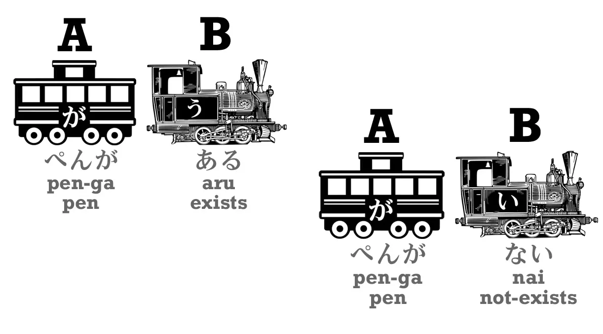
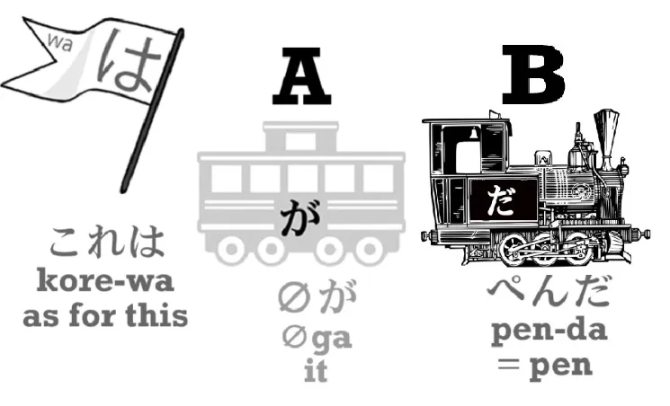
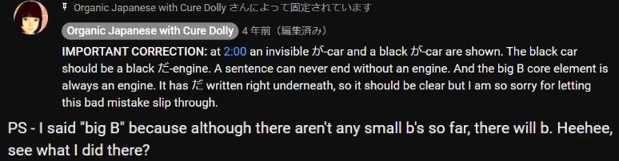
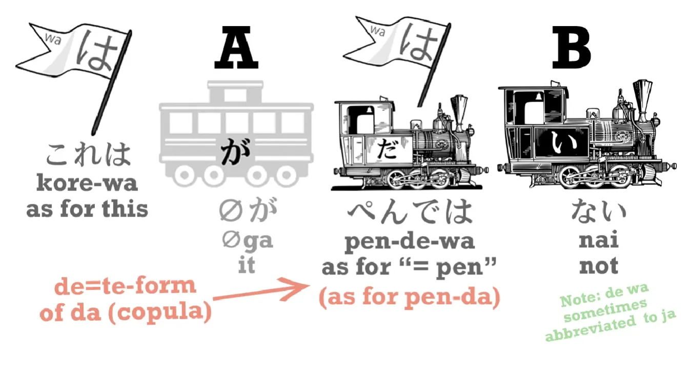
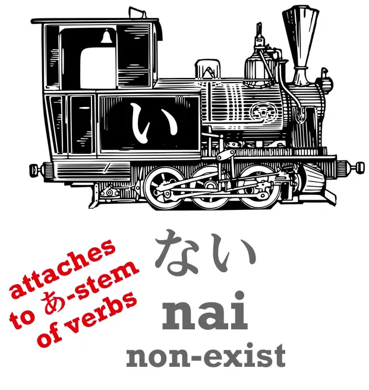
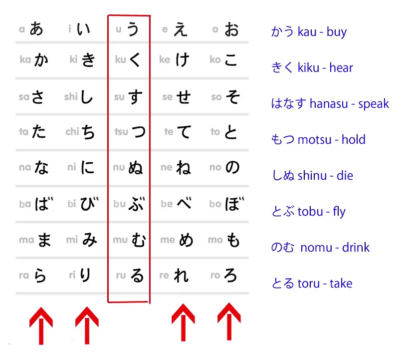
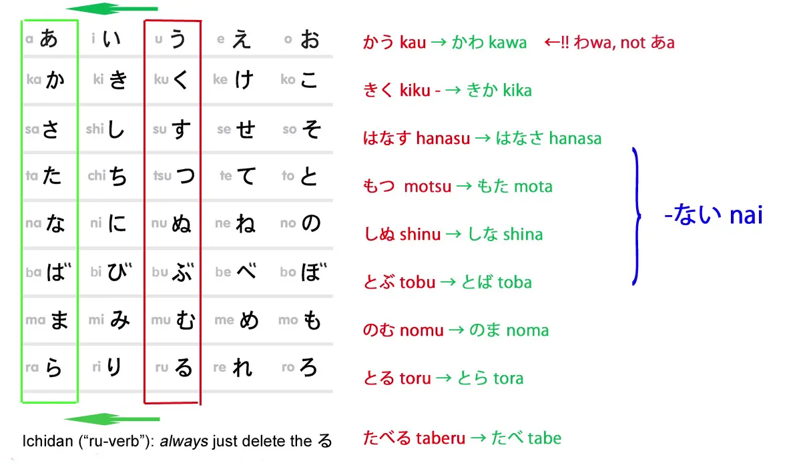
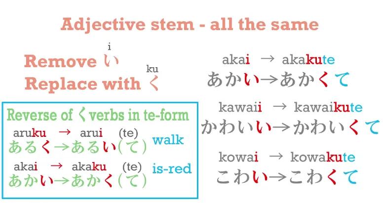
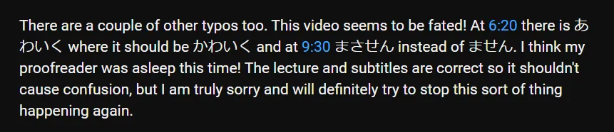
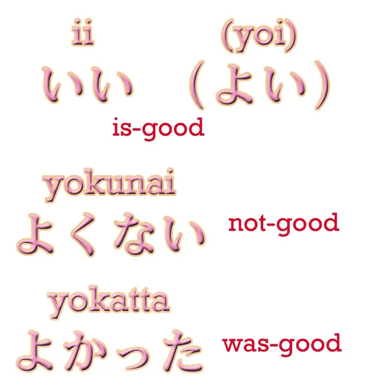

# **7. Bentuk Negatif dan Kata Sifat dalam Bentuk Lampau**

[**Pelajaran 7: Rahasia kata kerja negatif dan kata sifat dalam bahasa Jepang <code>conjugations</code>**](https://www.youtube.com/watch?v=KIPhvGxp43c&amp;list;=PLg9uYxuZf8x_A-vcqqyOFZu06WlhnypWj&amp;index;=7)

Hari ini kita akan membahas bentuk negatif. Dan untuk itu, kita harus memperkenalkan salah satu rahasia mendasar bahasa Jepang yang hampir tidak pernah diajarkan di sekolah atau buku teks. Hal ini akan membuat seluruh bahasa Jepang menjadi jauh lebih mudah. Namun sebelum kita membahasnya, mari kita lihat dasar-dasar bentuk negatif dalam bahasa Jepang.

## Kata sifat ない

**Dasar fundamental dari kalimat negatif adalah kata sifat <code>ない</code>.** Kata sifat ini berarti <code>non-exist / not-be</code>.

Kata untuk <code>exist</code> untuk benda apa pun, benda mati apa pun, langit, laut, alam semesta, sebutir beras, bunga, pohon, apa pun, adalah <code>ある</code>. Jadi, jika kita ingin mengatakan, <code>There is a pen / A pen exists</code>, kita mengatakan <code>ペンがある</code>. Tetapi jika kita ingin mengatakan tidak ada pulpen, kita mengatakan <code>ペンがない</code>.

Sekarang, mengapa kita menggunakan kata kerja untuk &quot;ada&quot; dan kata sifat untuk &quot;tidak ada&quot;? Karena hal ini terjadi di seluruh bahasa Jepang. Setiap kali kita MELAKUKAN sesuatu, kita menggunakan kata kerja. Baik kita berjalan, bernyanyi, berlari, atau apa pun – itu adalah kata kerja. **Tetapi jika kita tidak melakukannya, maka kita menambahkan <code>ない</code> pada kata kerja tersebut dan itulah yang menjadi inti kalimat.** Jadi, ketika kita mengatakan bahwa kita **tidak** melakukan sesuatu, **kita tidak menggunakan kata kerja, melainkan kata sifat.**

Mengapa demikian? Karena bahasa Jepang sangat logis. Saat kita melakukan sesuatu, sebuah tindakan sedang berlangsung. Itu adalah kata kerja. Namun, saat kita tidak melakukannya, tidak ada tindakan yang berlangsung dan kita sedang menggambarkan keadaan tanpa tindakan. Jadi, itu adalah kata sifat. Baiklah. 

Jadi, jika kita ingin mengatakan, <code>There is no pen</code>, kita mengatakan <code>ペンがない.</code> Tapi bagaimana jika kita ingin mengatakan, <code>This is not a pen</code>? Itu tidak persis sama, bukan? Jadi, bagaimana cara mengatakannya? 

Jika kita ingin mengatakan <code>There is a pen</code>, seperti yang kita tahu, kita mengatakan <code>これは (</code>これ<code> – </code>ini<code>)... これはペンだ</code>. <code>As for this, pen = / As for this, it&#x27;s a pen.</code>

::: info
Dalam video tersebut, Dolly membuat kesalahan dan menampilkan mobil hitam が di ペンだ.  
Saya memperbaikinya dengan keterampilan «sangat profesional» saya di Paint (•̀o•́)ง… bagaimanapun, berikut komentarnya.

:::

Tapi kalau kita mau bilang, <code>This is not a pen</code>, kita katakan, <code>これは *(zeroが)* ペンではない</code>.

Jadi apa artinya itu? **Nah, <code>で</code> adalah bentuk &quot;て&quot; dari <code>だ</code> atau <code>です</code>.** Jadi kita masih memiliki <code>これはペンだ</code> dalam bentuk <code>これはペンで</code> dan kemudian kita menambahkan <code>ない</code>. Jadi yang kita katakan adalah, <code>As for this, as for being a pen, it isn&#x27;t / This is not a pen</code>. Baiklah.

## Bentuk negatif kata kerja

Sekarang mari kita lanjut ke bagian terbesar dari pertanyaan ini, yaitu kata kerja. Untuk mengubah kata kerja menjadi bentuk negatif, **kita harus menambahkan <code>ない</code>,** **dan kita melakukannya dengan menempelkannya pada A-stem &quot;あ&quot;.** 

Apa artinya itu? Baiklah, mari kita lihat sistem akar kata. Sistem akar kata kerja Jepang adalah sistem transformasi kata kerja yang paling sederhana, paling logis, dan paling indah di dunia ini. Sistem ini hampir sepenuhnya teratur. Begitu Anda tahu caranya, Anda bisa membuat transformasi apa pun (kecuali bentuk &quot;て&quot; dan &quot;た&quot;, yang sudah Anda ketahui). 

Namun, sekolah dan buku pelajaran tidak memberitahu Anda hal ini. Alih-alih memberitahu Anda hal ini, mereka memaparkan masing-masing <code>conjugation</code>, sebagaimana mereka menyebutnya (dan sebenarnya itu bukanlah konjugasi)... mereka menyajikan masing-masing sebagai kasus terpisah dengan aturan terpisah yang tampak acak. Dan karena mereka tidak memberitahukan logika dasar dari seluruh sistem ini, serta karena mereka menggambarkan perubahan yang terjadi seolah-olah ditulis dalam alfabet Romawi padahal sebenarnya ditulis dalam kana, hal itu benar-benar terlihat seperti itu.

---

Para siswa benar-benar berpikir mereka harus memperlakukan setiap kasus sebagai kasus terpisah dan mempelajari aturan terpisah di setiap kasus. Padahal, Anda tidak perlu melakukannya. Anda hanya perlu memahami sistem akar kata. 

Jadi, mari kita lihat. Seperti yang telah kita pelajari, setiap kata kerja berakhir dengan salah satu kana dari baris う. Dan saya memutar tabel ini ke samping di sini karena alasan yang akan Anda lihat sebentar lagi. Jadi, kana dalam kotak merah ini adalah yang dapat mengakhiri kata kerja. Bukan semua kana baris う, tetapi sebagian besar di antaranya. Jadi, kita memiliki kata kerja seperti <code>かう</code> (membeli), <code>きく</code> (mendengar), <code>はなす</code> (berbicara), <code>もつ</code> (memegang) dll.

Sekarang, seperti yang Anda lihat, ada empat cara lain di mana sebuah kata kerja bisa berakhir. Dan masing-masing dari empat cara tersebut digunakan, dan mereka disebut akar kata kerja.

Hari ini kita hanya akan membahas akar kata &quot;あ&quot;, karena itulah yang kita butuhkan untuk bentuk negatif. Jadi, untuk membentuk akar kata &quot;あ&quot;, kita cukup memindahkan kana terakhir dari kata kerja tersebut dari baris &quot;う&quot; ke baris &quot;あ&quot;. Jadi <code>きく</code> (mendengar) menjadi <code>きか</code>, <code>はなす</code> (berbicara) menjadi <code>はなさ</code>, <code>もつ</code> (memegang) menjadi <code>もた</code>, dan seterusnya.

Hanya ada satu pengecualian dalam sistem ini – dan ketika saya mengatakan itu, maksud saya adalah seluruh sistem, semua akar kata – hanya ada satu pengecualian ini, yaitu bahwa **ketika sebuah kata diakhiri dengan kana う, akarnya tidak berubah menjadi <code>-あ</code>, melainkan berubah menjadi <code>わ</code>.** Jadi, bentuk negatif dari <code>かう</code> bukan <code>かあない</code>, melainkan <code>かわない</code>. Dan pengecualian ini hanya ada pada akar kata yang berakhiran あ, jadi itulah satu-satunya pengecualian dalam seluruh sistem, dan Anda bisa melihat mengapa hal itu ada: <code>かあない</code> tidak semudah diucapkan seperti <code>かわない</code>, bukan?

**Semua yang lain sangat teratur.** <code>きく</code> (hear) menjadi <code>きかない</code> (tidak-mendengar); <code>はなす</code> (berbicara) menjadi <code>はなさない</code> (tidak-berbicara); <code>もつ</code> (memegang) menjadi <code>もたない</code> (tidak memegang), dan seterusnya. 

Dan seperti yang sudah kita ketahui, **pada kata kerja ichidan, mereka hanya menghilangkan <code>-る</code> dan menambahkan apa pun yang ingin kita tambahkan**, jadi <code>たべる</code> (makan) menjadi <code>たべない</code> (tidak makan). Dan itu saja. Begitulah cara kita mengubah kata kerja menjadi bentuk negatif. Sangat, sangat sederhana.

## Bentuk negatif kata sifat

Lalu, bagaimana dengan kata sifat? Bagaimana cara mengubah kata sifat menjadi bentuk negatif? Nah, saat kita mengubah kata sifat, **yang selalu kita lakukan adalah mengubah <code>-い</code> di bagian akhir kata sifat tersebut menjadi <code>-く</code>:** <code>あかい</code> (merah) menjadi <code>あかく</code>; <code>かわいい</code> (is-cute) menjadi <code>かわいく</code>; こわい (is-scary) menjadi <code>こわく</code>.

Dan inilah cara kita membuat bentuk て dari kata sifat: <code>あかく</code> menjadi <code>あかくて</code>. 

**Dan ini juga cara kita membentuk bentuk negatif:** <code>あかい</code> menjadi <code>あかくない</code> (tidak-merah). 

Nah, yang menarik, -く ini kebalikan dari apa yang terjadi pada bentuk て, bukan? Jika sebuah kata berakhiran -く, dalam bentuk て kita mengubah -く menjadi -い. **Tetapi pada kata sifat, kita mengubah -い menjadi -く.**

::: info
Dolly membuat sedikit kesalahan ketik di sini, dalam video, dia menulis かわいく sebagai あわいく. Saya telah memperbaikinya.
::: 

## Kata sifat dalam bentuk lampau

Jika kita ingin mengubah kata sifat menjadi bentuk lampau, **kita menghilangkan akhiran -い dan menggunakan -かった.** Jadi <code>こわい</code> (is-scary) menjadi <code>こわかった</code> (was-scary). Dan karena <code>ない</code> juga merupakan kata sifat yang berakhiran -い, ketika kita mengubahnya ke bentuk lampau, kita juga mengatakan <code>なかった</code>. Jadi, jika kita ingin mengatakan <code>Sakura runs</code>, kita mengatakan <code>さくらがはしる</code>; jika kita ingin mengatakan <code>Sakura doesn&#x27;t run</code>, kita mengatakan <code>さくらがはしらない</code>;  jika kita ingin mengatakan <code>Sakura ran (in the past)</code>, kita mengucapkannya <code>さくらがはしった</code> – karena ini adalah kata kerja godan;

::: info
Perhatikan bentuk &quot;っ&quot; sebelum &quot;た&quot; alih-alih hanya &quot;た&quot;, seperti yang dijelaskan dalam Pelajaran 5 Kelompok Kata Kerja Godan 1.*  
:::

dan jika kita ingin mengatakan <code>Sakura didn&#x27;t run (in the past)</code>, kita mengatakan <code>さくらがはしらなかった</code>. <code>はしらない</code>, lalu kita ubah <code>ない</code> ke bentuk lampau: <code>はしらなかった</code>. 

Sekarang, seperti yang kita semua tahu. <code>さくらがはしる</code> adalah bahasa Jepang yang agak tidak wajar, sama seperti halnya dalam bahasa Inggris. Kita mengatakan <code>Sakura is running</code> dalam bahasa Inggris, dan dalam bahasa Jepang kita mengatakan <code>さくらがはしっている</code>. Jadi, jika kita ingin mengubah semua itu ke masa lalu, apa yang harus kita lakukan? Nah, yang harus kita lakukan hanyalah mengubahnya <code>いる</code> ke masa lalu. 

Jadi kita mengatakan <code>さくらがはしっていた</code> – <code>Sakura was running</code>.

Dan jika kita ingin mengatakan <code>Sakura wasn&#x27;t running</code>, kita mengatakan <code>さくらがはしっていなかった</code>. Itu <code>いる</code> adalah kata kerja ichidan sederhana, jadi kita cukup menghilangkan akhiran -る dan menambahkan た *(masa lalu positif)* atau ない *(negatif)* dan, untuk masa lalu, なかった. *(karena ない di masa lalu menjadi なかった)*

**Saya selalu mengatakan bahwa bahasa Jepang itu seperti Lego.** **Begitu Anda mengetahui blok-blok pembangun dasarnya, Anda bisa membangun apa saja.** **Dan hampir tidak ada pengecualian dalam bahasa Jepang.**

## Pengecualian

Dari semua yang telah kita bahas hari ini, sebenarnya hanya ada dua pengecualian. Dan saya akan memperkenalkannya agar Anda mengetahui semua yang perlu Anda ketahui. 

**Satu-satunya pengecualian nyata dari setiap kata kerja yang dibuat menjadi negatif dengan menambahkan <code>ない</code> adalah kata kerja <code>ます</code>, yang merupakan kata kerja bantu yang membuat kata-kata menjadi formal.** *(sopan)* **Kita menambahkannya ke A-stem kata kerja &quot;い&quot;**, dan kita akan membahas A-stem kata kerja &quot;い&quot; nanti, tetapi saya pikir Anda sudah bisa menebak apa itu. 

Jadi, <code>はなす</code> menjadi <code>はなします</code>, <code>きく</code> menjadi <code>ききます</code> dan seterusnya. Ketika Anda <code>ます</code> ke dalam bentuk negatif, kata kerja tersebut tidak menjadi <code>まさない</code>, seperti yang Anda harapkan – **melainkan <code>ません</code>.**

**Karena ini formal, agak kuno, dan menggunakan bentuk negatif Jepang kuno <code>せん</code> bukan <code>ない</code>.**

::: info
Dolly sekali lagi membuat kesalahan ketik di sini dalam video, saya memperbaikinya lagi.

:::

Satu-satunya pengecualian lain yang terlihat adalah bahwa <code>いい</code> , kata sifat <code>いい/良い</code>, yang berarti <code>is-good</code>, memiliki bentuk yang lebih tua, <code>よい/良い</code>, yang masih cukup sering digunakan. Dan **ketika kita melakukan transformasi apa pun pada <code>いい</code>, ia kembali menjadi <code>よい</code>**, jadi dalam bentuk lampau kita tidak mengatakan <code>いかった</code>, **kita mengatakan** <code>**よ**かった</code> – dan jika kamu sering menonton anime, kamu mungkin sudah sering mendengar ini.

<code>よかった</code>, secara harfiah <code>(zeroが)よかった</code> – <code>(It) was good / That turned out well / That&#x27;s great</code>. Dan jika Anda ingin mengatakan sesuatu itu tidak baik, Anda tidak mengatakan <code>いくない</code>, **kamu mengatakan** <code>**よ**くない</code>. Dan itu adalah satu-satunya pengecualian.
