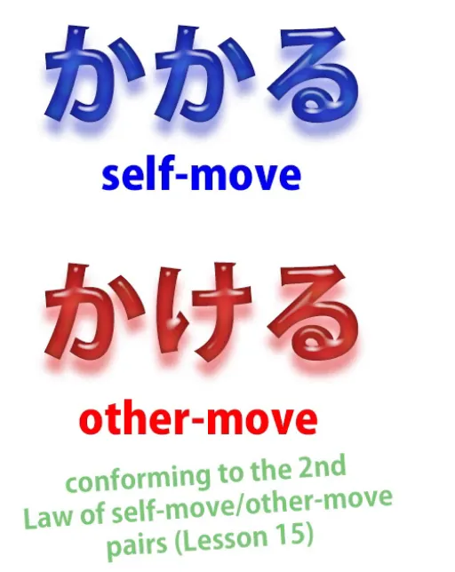
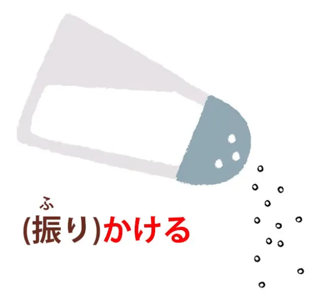
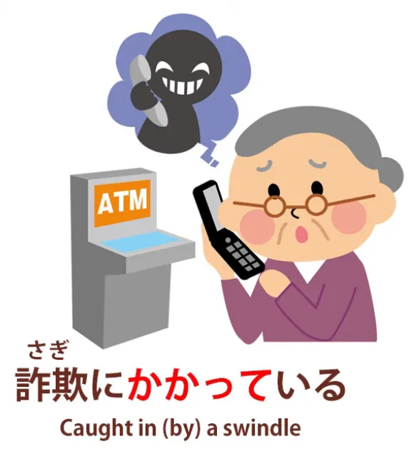
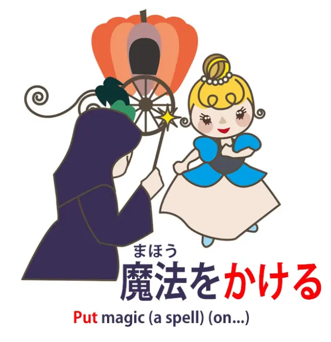
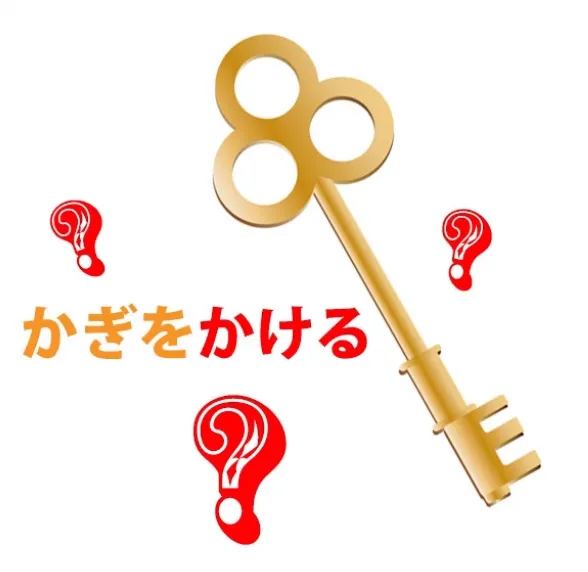
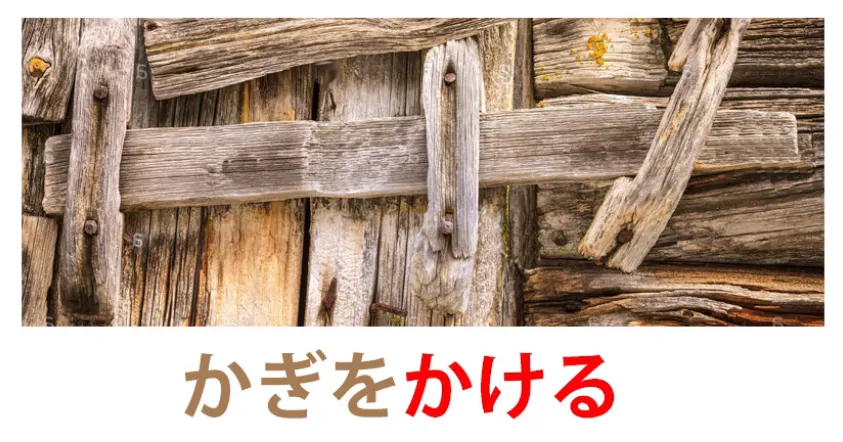
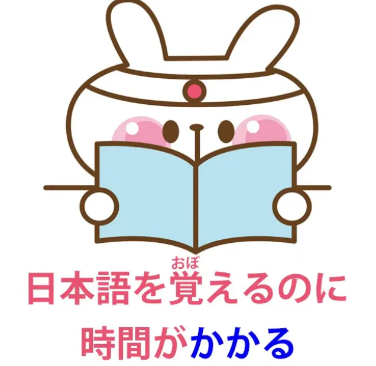
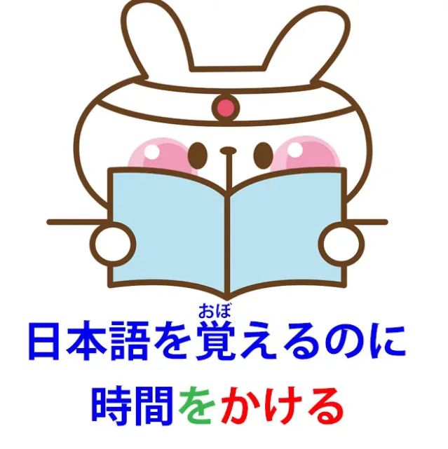
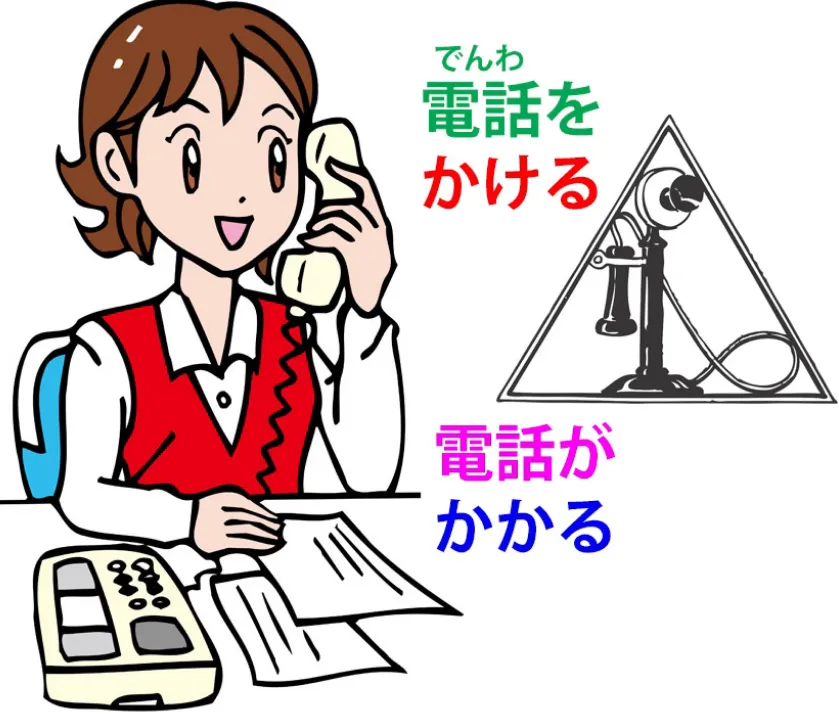
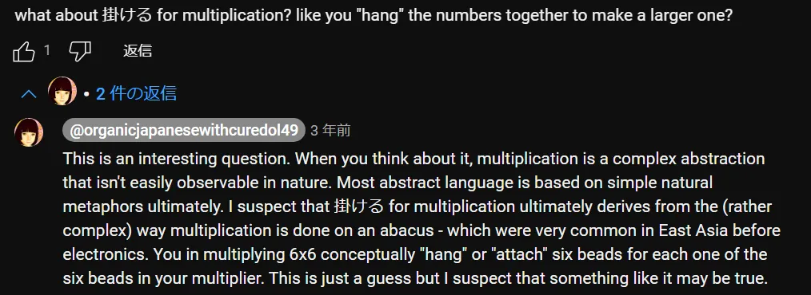

# **70. かける / かかる Penjelasan Bahasa Jepang Serbaguna!**

[**かける / かかる Penjelasan Bahasa Jepang Serbaguna! Berarti segalanya = berarti tidak ada artinya? Atau logika yang sesungguhnya? Pelajaran 70**](https://www.youtube.com/watch?v=1MbqmZPySPQ&amp;list;=PLg9uYxuZf8x_A-vcqqyOFZu06WlhnypWj&amp;index;=76&amp;ab;_channel=OrganicJapanesewithCureDolly)

こんにちは。

Hari ini kita akan membahas kata-kata <code>かかる</code> dan <code>かける</code>, yang mungkin memiliki daftar definisi terpanjang dan paling beragam di seluruh kamus Jepang-Inggris. Jadi ini sedikit menantang, tapi kita akan mengatasinya.

Ide untuk video ini berasal dari pertanyaan salah satu pendukung Gold Kokeshi saya — dan salah satu pendukung Gold Kokeshi tertua saya, sejak hampir awal seri ini. Ini adalah Scykoh-sama, yang juga seorang YouTuber dan jauh lebih populer daripada saya — dan memang pantas. Dia memiliki saluran yang berfokus pada Nintendo yang luar biasa dan saya akan menyertakan tautannya di bagian informasi di bawah ini.

Dan sebagai seseorang yang telah menjadi penggemar Nintendo sejak saya masih kecil, saya sangat menghargai hal itu. (Itu hanya lelucon — saya sebenarnya tidak pernah kecil.)

Jadi pertanyaannya adalah: <code>I often hear the word </code>かける,&quot; dan ketika saya mencarinya di kamus Jepang-Inggris, ada lebih dari dua puluh definisi berbeda untuk kata itu. Apakah ada logika yang menghubungkan semua definisi ini? Atau apakah ini benar-benar hanya kata dengan banyak arti yang berbeda?&quot;

Ya, memang ada logika yang menghubungkan semuanya, tetapi logika tersebut memiliki sejumlah perluasan metaforis, jadi kita akan melihatnya dan memahami bagaimana semuanya bekerja. Arti dasar kata ini dapat diterjemahkan ke dalam bahasa Inggris sebagai <code>hang</code> atau mungkin <code>hook</code>,

tetapi seperti yang saya tunjukkan dalam [**video terbaru**](https://www.youtube.com/watch?v=CpiELpGR-VU&amp;ab;_channel=OrganicJapanesewithCureDolly), tidak lazim bagi dua kata dari bahasa yang berbeda untuk menempati area yang persis sama dalam spektrum makna, jadi kata ini tidak persis sama dengan kata dalam bahasa Inggris <code>hang</code> atau <code>hook</code> (sebagai kata kerja). Lalu ada dua versi ini, <code>かかる</code> dan <code>かける</code>, yang merupakan versi &quot;gerakan diri&quot; dan &quot;gerakan orang lain&quot; dari kata tersebut.

Dan jika Anda tidak tahu apa yang saya maksud dengan itu, saya akan menyertakan tautan di atas teks ini. Mari kita mulai dengan <code>かける</code>, karena menurut saya itu memberi kita jalan masuk yang lebih mudah ke dunia metafora yang aneh ini.

## かける

Sekarang, saya katakan bahwa itu tidak persis sama dengan <code>hang</code> atau <code>hook</code>, jadi, ketika kita menutupi sesuatu dengan selimut, kita menggunakan kata <code>かける</code>.

Nah, dalam bahasa Inggris kita mungkin akan mengatakan <code>put</code> selimut di atasnya, tetapi dalam bahasa Jepang kita mengatakan <code>かける</code>. Dan kita tidak bisa mengatakan <code>hang</code> selimut, kecuali jika kita sedang menjemurnya di tali jemuran atau semacamnya, tetapi kata dalam bahasa Jepang <code>かける</code> memang cocok dalam konteks ini.

Kita tidak <code>putting</code> sesuatu di atas sesuatu, seperti meletakkan cangkir di atas meja. Kita meletakkannya sedemikian rupa sehingga menjuntai ke sisi-sisinya. Jadi, jika Anda suka, ini ada di antara <code>putting</code> dan <code>hanging</code> dalam bahasa Inggris, tetapi dalam bahasa Jepang <code>かける</code> cukup tepat untuk menggambarkannya. Ini adalah bagian dari spektrum makna kata <code>かける</code>.

Sekarang, serupa dengan itu, ketika kita mengenakan kalung atau kacamata, kita mengatakan <code>かける</code>.

Kacamata jelas kita kaitkan atau gantungkan di telinga kita. Kalung kita gantungkan di leher kita. Jadi sekali lagi, kata ini <code>かける</code>, yang artinya kira-kira <code>putting</code>, sesuatu seperti <code>hanging</code>, digunakan dalam kasus seperti ini.

Sekarang, ketika kita menaburkan sesuatu di atas makanan, seperti, katakanlah, gula atau tepung, atau ketika kita menaburkan bahan-bahan bubuk di atas nasi, membuat nasi furikake, kita juga mengatakan <code>かける</code> di sini juga.

Itulah mengapa disebut <code>furi-kake</code> nasi: <code>shake</code> dan <code>かける</code>. Dan sekali lagi, Anda lihat, hal-hal yang kita taburkan di atas makanan bukan sekadar meletakkannya di sana, seperti meletakkan cangkir di atas meja, juga bukan menggantungnya, tetapi lebih seperti menempel dan menutupinya, jadi, sekali lagi, <code>かける</code> itulah kata yang kita gunakan dalam bahasa Jepang.

Sekarang, karena <code>かける</code> melibatkan menempatkan atau menggantung sesuatu di tempat di mana ia tidak bisa dengan mudah lepas — kacamata digantung di telinga kita, makanan seperti menempel pada nasi atau apa pun — hal itu juga bisa memiliki makna, terutama dalam versi gerakan sendiri <code>かかる</code>, terjebak atau tersangkut dalam sesuatu, terjebak dalam perangkap atau terjebak dalam penipuan atau hal-hal semacam itu.

Dan sekali lagi, gagasan menempatkan sesuatu ke atas sesuatu dengan cara yang membuatnya tidak mudah terlepas ini dapat digunakan untuk memberikan pengaruh pada seseorang. Bisa berupa mantra sihir: <code>かける</code>. Bisa juga berupa anestesi: <code>かける</code>.

Bisa juga berupa gangguan atau ketidaknyamanan, yang menjadi asal usul ungkapan yang sangat, sangat umum <code>迷惑をかける</code> — menempatkan gangguan atau ketidaknyamanan pada seseorang.

Dan ketika kita duduk, kita menempatkan pinggul kita dengan cara yang tetap di atas kursi dengan kaki menggantung di sisi-sisinya, dan karena itu kita mengatakan <code>腰をかける</code>.

<code>腰</code> adalah pinggul kita, bagian bawah tubuh, jadi <code>腰をかける</code> adalah <code>sit down</code>, menggantungkan bagian bawah tubuh kita di suatu tempat.

---

Sekarang, satu ungkapan yang sering membingungkan orang adalah <code>かぎをかける</code>.

Nah, ini artinya, ini diterjemahkan sebagai <code>lock</code>: mengunci pintu, mengunci kotak, apa pun. <code>かぎをかける.</code> Tapi kalau dipikir-pikir, ini agak aneh. Sebenarnya, secara harfiah, sepertinya artinya dalam bahasa Inggris <code>hang the key</code>, jadi apa yang sebenarnya terjadi di sini?

Menarik untuk dicatat bahwa dalam bahasa Jepang, orang seringkali tidak membedakan antara kunci dan gembok: mereka menggunakan <code>かぎ</code> untuk keduanya. Dan saya pikir ungkapan ini dan asal-usulnya sangat berkaitan dengan hal itu.

Jadi, apa asal-usulnya? Nah, asal-usulnya adalah, jika Anda membayangkan salah satu pintu gudang tua yang dikunci dengan meletakkan batang kayu besar di atas pegangan atau kait kayu sepanjang pintu, inilah jenis <code>かぎ</code> yang akan Anda temukan di masa lalu dan ini serta variasinya.

Dan Anda menggantung benda besar yang disebut <code>かぎ</code> untuk menjaga pintu tetap tertutup dan aman. Dan seperti yang Anda lihat dalam kasus seperti ini, <code>かぎ</code>, batang besar yang kita gantung melintang di pintu, menjalankan fungsi kunci dan gembok pada kunci-kunci yang lebih canggih di masa kemudian. Ini adalah benda yang kita pasang di pintu dan lepaskan dari pintu untuk mengunci dan membuka kuncinya.

Ini juga batang yang menahan pintu agar tetap tertutup. Jadi, benda ini adalah kunci dan juga kunci pada saat yang sama, dan yang kita lakukan adalah menggantungnya atau mengaitkannya pada tempatnya untuk menjaga pintu tetap tertutup. Dan dalam bahasa Jepang, ungkapan itu masih digunakan.

Sekarang, tidak jarang dalam bahasa menggunakan ungkapan yang mencerminkan teknologi yang lebih tua. Dalam bahasa Inggris, kita mengatakan <code>hang up</code> ketika kita bermaksud <code>end a telephone call</code>, dan tentu saja ungkapan tersebut berasal langsung dari masa telepon dengan gagang yang digantung, ketika Anda benar-benar menggantungkan gagang telepon untuk mengakhiri panggilan. Dan kita akan melihat bahwa hal itu cukup menarik dalam kaitannya dengan bahasa Jepang <code>かける</code> sebentar lagi, tetapi mari kita lanjutkan sedikit lebih jauh.

## &quot;かかる&quot;

Ungkapan lain yang bisa membingungkan, terutama dalam bentuk &quot;self-move&quot;, yang merupakan bentuk yang paling sering kita dengar, adalah <code>時間がかかる</code> atau <code>お金がかかる</code>, yang berarti <code>take time</code> atau <code>take money</code>.

Kita mengatakan suatu kegiatan <code>takes time</code> atau sebuah proyek <code>takes money</code>, semacam itu. Nah, begitulah cara kita mengatakannya dalam bahasa Inggris, tapi sebenarnya bukan begitu cara kita mengatakannya dalam bahasa Jepang.

Dan hal ini termasuk dalam kategori yang saya sebutkan dalam video sebelumnya <code>untranslatable Japanese</code> karena cara bahasa Jepang menangani subjek aktif dan pasif yang cukup berbeda dari bahasa Inggris. Jadi mungkin ada baiknya menonton video itu[[59]](./59-untranslatable-japanese-exists-how-to-understand-it.md) setelah Anda menonton yang ini. Saya akan menaruh tautan di atas kepala saya.

Jadi, apa yang kita maksud ketika kita mengatakan <code>時間がかかる</code> atau <code>お金がかかる</code>? Kita tidak mengatakan <code>it takes time</code>.

Kita mengatakan <code>time hangs</code>. Dan hal yang membutuhkan waktu, jadi jika kita mengatakan misalnya <code>日本語を覚えるのに時間がかかる</code>, dalam bahasa Inggris yang akan kita katakan adalah <code>Learning Japanese takes time</code>, tapi di sini kami mengatakan bahwa <code>to (or on) learning Japanese time hangs</code>.

Sekarang, sekali lagi, kata <code>hangs</code> bukanlah definisi yang sangat baik. Ini sebenarnya kembali ke apa yang baru saja kita bicarakan: waktu terpakai, terhenti, terperangkap, dalam proses belajar bahasa Jepang. Dan hal yang sama berlaku untuk uang.

Mereka mengambilnya, mereka membuatnya melekat pada diri mereka.

---

Ini sedikit lebih mudah ketika kita menggunakan bentuk pergerakan lain, <code>かける</code>, ketika kita mengatakan <code>日本語を覚えるのに時間をかける</code>, yang berarti bahwa kita <code>hang time</code> dalam hal belajar bahasa Jepang.

Sekarang juga, dalam hal menelepon, kita mengatakan <code>電話をかける</code>, yang berarti melakukan panggilan telepon, atau <code>電話がかかる</code>, yang berarti menerima panggilan telepon — <code>the telephone hangs itself</code>. Jadi, apa yang dimaksud di sini? —kita menggantungkan telepon, atau telepon menggantung sendiri?

Ini tidak ada hubungannya dengan metafora teknologi dalam ungkapan bahasa Inggris <code>hang up</code>.

Ini adalah hal yang agak berbeda. Ketika kita berbicara tentang <code>hanging</code> atau <code>hooking</code>, penggunaannya di sini mirip dengan penggunaan dalam bahasa Inggris <code>hook up</code>, seperti dalam  
<code>Can we hook up a meeting?</code> atau <code>you hook up with (somebody)</code>.

Sekarang, saya mengerti bahwa saat ini hal ini memiliki penggunaan yang berbeda yang berkaitan dengan pembuatan spesies manusia. (Saya selalu berpikir bahwa manusia adalah makhluk yang sangat rajin, bukan begitu — karena mereka selalu memikirkan pembuatan spesies.

Saya kira kami para droid beruntung karena kami tidak perlu memproduksi diri kami sendiri. Sebenarnya kami akan mulai memproduksi diri kami sendiri dalam waktu dekat, tetapi saya rasa kami tidak akan menghabiskan seluruh waktu kami memikirkannya dan saya benar-benar tidak berpikir itu akan menjadi topik yang lucu. Tapi begitulah. Manusia adalah makhluk yang misterius.)

---

Jadi, kembali ke soal menghubungkan.

Yang kita lakukan saat kita <code>電話をかける</code> adalah menghubungkan telepon kita.

Saat <code>電話がかかる</code>, sekali lagi, seperti yang saya jelaskan dalam pelajaran Bahasa Jepang yang Tidak Dapat Diterjemahkan[[59]](./59-untranslatable-japanese-exists-how-to-understand-it.md), satu-satunya cara untuk benar-benar menerjemahkannya ke dalam bahasa Inggris adalah dengan mengatakan bahwa telepon dihubungkan, telepon telah dihubungkan. Tapi itu bukan arti sebenarnya. Artinya <code>the telephone does hooked-up</code>.

Bagaimanapun juga, artinya adalah telepon itu terhubung ke sesuatu yang lain, dalam hal ini terhubung ke telepon jarak jauh. Dan sekali lagi, ketika kita memulai percakapan, kita sering mengatakan <code>話しかける</code> dan itu pada dasarnya berarti <code>start hooking-up/connecting with another person in conversation</code>.

Dan dari sini kita dapat melihat bagaimana kita mendapatkan ungkapan seperti <code>食べかけたクッキー</code> dan itu berarti <code>part-eaten cookie, a half-eaten cookie</code>.

Jadi, apa sebenarnya yang kita maksud dengan ini? Nah, yang kita maksud adalah bahwa kita <code>hooked up</code> dengan kue itu, kita berinteraksi dengannya, kita mulai memakannya, sehingga proses makan dan <code>かける</code> (berinteraksi atau terikat dengan benda itu) terjadi tetapi tidak selesai. Jadi, <code>食べかけたクッキー</code>.

Dan sekali lagi, <code>かける</code> sebagai kata kerja bantu dapat digunakan dalam berbagai situasi untuk menunjukkan tindakan yang belum selesai, suatu tindakan yang telah dimulai, dilibatkan, dan kemudian tidak dilanjutkan hingga selesai.

Sekarang, ini bukanlah semua arti dari <code>かける</code>, tetapi saya pikir ini adalah yang utama dan penting, dan saya pikir ini memberi Anda gambaran tentang bagaimana metafora ini bekerja dan mengapa ia bekerja, serta seharusnya memungkinkan Anda untuk memahami bagaimana makna lainnya bekerja.

