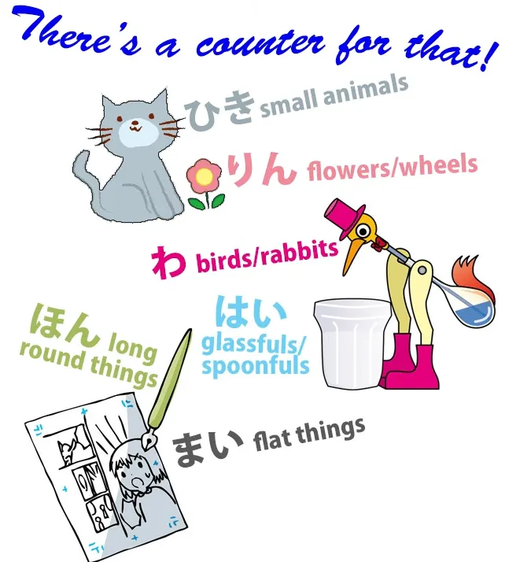
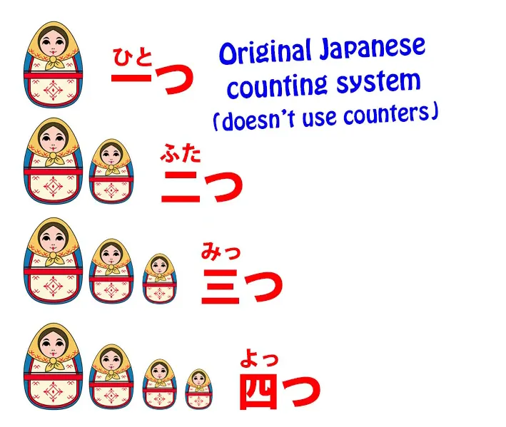
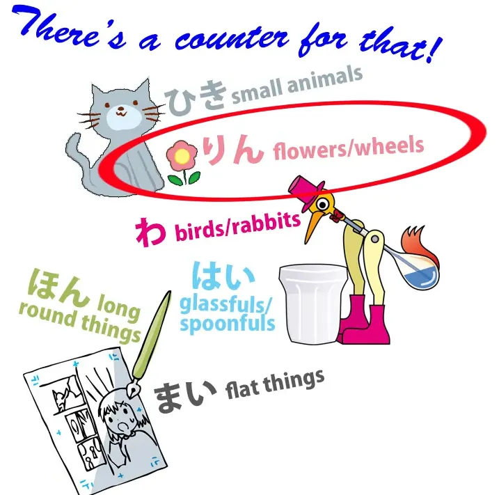
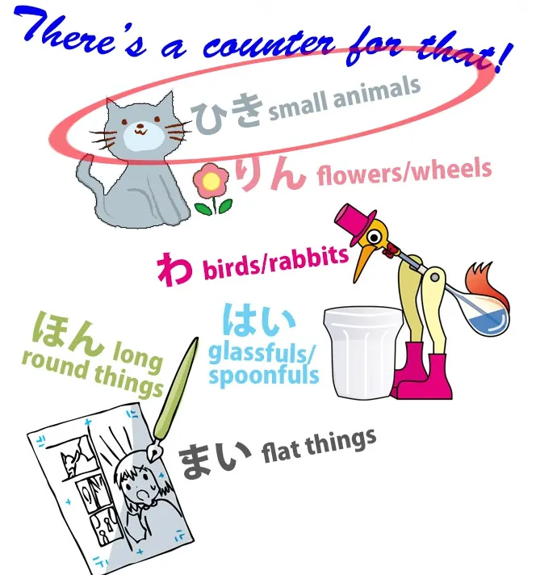
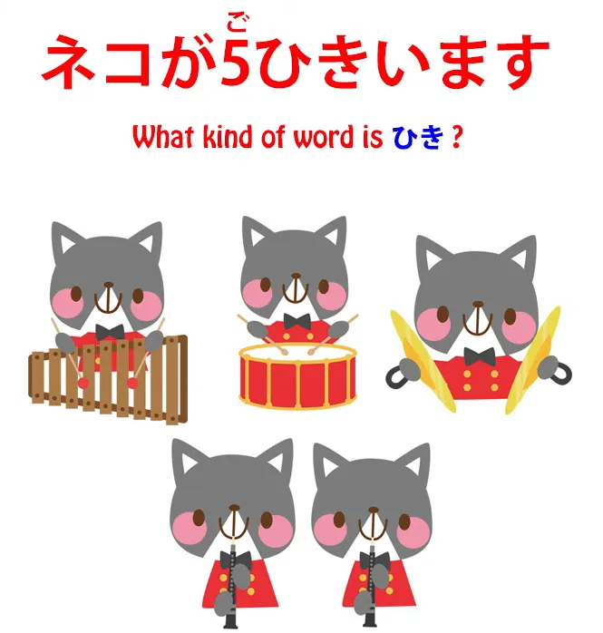
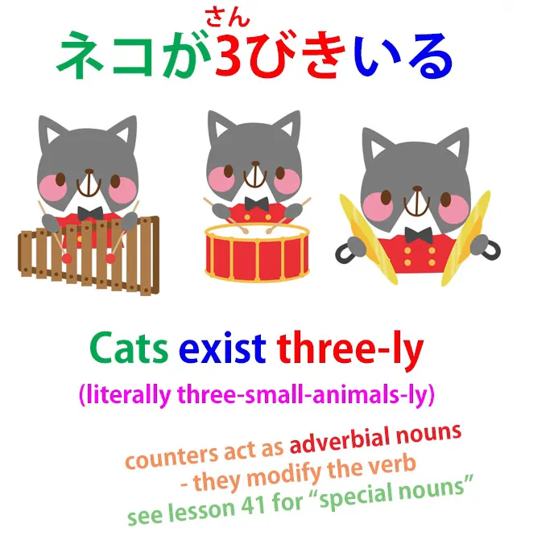
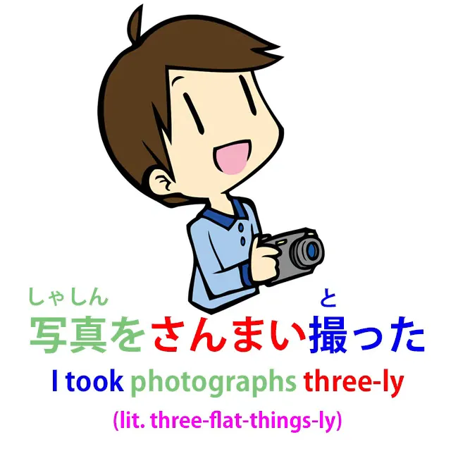
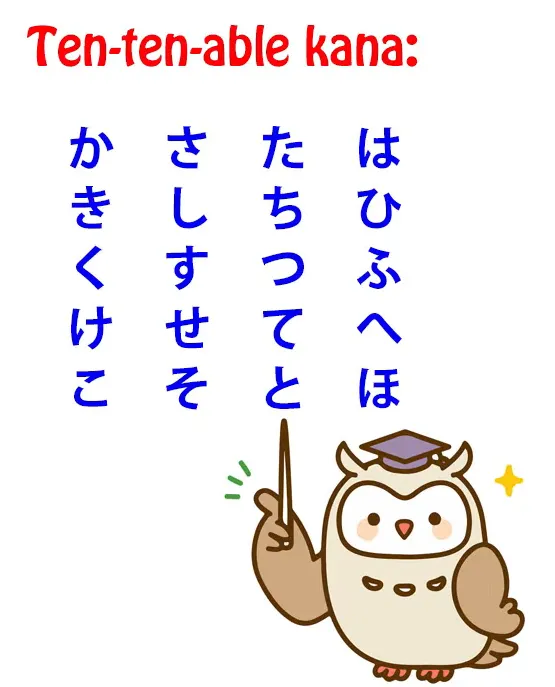
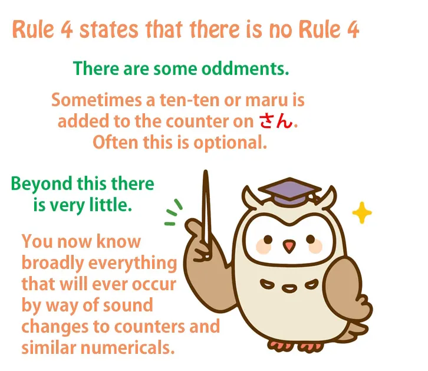

# **71. Bilangan hitung dalam bahasa Jepang: 3 aturan sederhana**

[**Bilangan hitung dalam bahasa Jepang: 3 aturan sederhana yang memudahkan! Pelajaran 71**](https://www.youtube.com/watch?v=OA78aKz0oIQ&amp;list;=PLg9uYxuZf8x_A-vcqqyOFZu06WlhnypWj&amp;index;=73&amp;ab;_channel=OrganicJapanesewithCureDolly)

こんにちは。

::: info
Yomichan atau Rikaichamp akan berguna di sini… Saya memutuskan untuk menggunakan bentuk Kanji terutama, karena menurut saya hal itu mungkin akan menunjukkan penghitungan dengan lebih baik, meskipun mungkin lebih sulit dibaca.
:::
Hari ini kita akan membahas penghitungan dalam bahasa Jepang.

Sekarang, seperti yang kita semua tahu, buku teks sering menggambarkan bahasa Jepang sebagai bahasa yang misterius, penuh dengan aturan dan hal-hal yang sepenuhnya acak dan tidak masuk akal, yang harus kita pelajari tanpa alasan khusus. Dan, seperti yang kalian semua tahu jika telah mengikuti pelajaran video saya, sebagian besar waktu hal ini tidak benar. Sebagian besar hal yang terjadi dalam bahasa Jepang sebenarnya masuk akal dan logis jika kita tahu cara kerjanya, yang tampaknya tidak dipahami oleh orang-orang yang menulis buku teks.

*(atau lebih tepatnya mereka tahu, tetapi menyederhanakannya untuk pelajar bilingual, karena ini hanyalah buku teks…)*

Namun, bilangan penghitungan mungkin tampak seperti pengecualian dari aturan ini. Ada banyak sekali bilangan penghitungan. Sangat banyak. Dalam bahasa Jepang, Anda tidak bisa hanya mengatakan <code>one dog</code> atau <code>two flowers</code> atau <code>three birds</code>.
Anda harus menggunakan bilangan penghitungan.

Jadi kita mengatakan <code>一匹の犬 / いっぴきの犬</code> — <code>one dog</code> — dan bilangan pengulang di sini adalah <code>匹 / ひき</code>, yang diucapkan <code>ぴき</code> dalam kasus ini. *(Ini adalah bilangan penghitungan untuk hewan kecil)*

Untuk <code>three birds</code> kita mengatakan <code>三羽の鳥 / さんわの鳥</code>, dan <code>羽 / わ</code> adalah penghitungan *(untuk burung…)*. Jadi sepertinya kita harus belajar banyak sekali penghitungan, bukan, hanya untuk mengatakan apa yang dalam bahasa Inggris bisa diungkapkan dengan angka dan benda itu. Dan memang ada banyak sekali penghitungan — puluhan dan puluhan *(sebenarnya, ratusan (″ロ゛)*.

Jadi ini terlihat seperti masalah, bukan? Tapi sebenarnya, ini tidak serumit yang terlihat.

Pertama-tama, meskipun ada banyak sekali kata penghitungan, hanya sekitar selusin di antaranya yang benar-benar sering digunakan *(Terima kasih, Tuhan Dio…ε=ε=┌(;￣▽￣)┘)*.

---

Kedua, sebagian besar waktu kita bisa menghindarinya dengan menggunakan sistem penghitungan asli Jepang, yang tidak memerlukan bilangan penghitungan.

Jadi, jika kita menggunakan <code>一つ, 二つ, 三つ, 四つ, 五つ</code> sistem penghitungan ini, kita tidak memerlukan kata penghitungan. Kita bisa menggunakannya untuk hampir segala hal — bukan orang, bukan hewan kecil, tetapi hampir segala hal lainnya; kita bisa menggunakan sistem penghitungan Jepang jika kita mau.

Jadi, hal penting di sini, seperti yang pasti tidak akan mengejutkan Anda, adalah bahwa yang tidak akan kita lakukan adalah mulai menghafal daftar kata penghitungan.

Itu, maafkan ungkapan ini, hanya akan kontraproduktif. Dan ada beberapa alasan mengapa kita tidak perlu melakukannya.

## Menghafal bilangan penghitungan tidak diperlukan

Pertama-tama, dalam hal memahami bahasa Jepang, bilangan penghitungan sama sekali tidak menimbulkan banyak masalah. Jika kita mendengar seseorang menyebut angka dan benda yang kita kenal, jika ada kata kecil di antara keduanya, kita tahu itu adalah bilangan penghitungan.

Jadi kita tahu apa yang mereka katakan. Jika mereka mengatakan <code>一輪の花</code>, kita tahu mereka mengatakan <code>one flower</code>. <code>一... 花</code>, dan <code>輪 / りん</code> pasti adalah bilangan penghitungan. *(輪 / りん, bilangan penghitungan untuk roda &amp; bunga)*

Jika kita mendengar seseorang mengatakan <code>二羽の鳥</code>, kita tahu bahwa mereka mengatakan <code>two birds</code>: <code>二... 鳥</code>, dan <code>羽</code> adalah bilangan pengulang.

Jika kita mendengar seseorang mengatakan <code>三匹の猫 / さんびきの猫</code> — sekarang, meskipun kita tahu <code>匹 / ひき</code>, tetapi kita tidak tahu bahwa pada angka tiga menjadi <code>びき</code>, itu bukan masalah karena kita tahu <code>三</code>, kita tahu <code>猫</code>, dan kita tahu bahwa hal-hal yang berada di antara angka dan objeknya akan menjadi kata penghitungan.

Haruskah kita memasukkannya ke dalam Anki kita? Ya, kita harus. Kita akan mengenalnya seiring waktu. Tapi kita tidak perlu khawatir tentang mempelajarinya.

Dan seperti yang saya tunjukkan, bilangan hitung tidak selalu diucapkan dengan cara yang sama, dan itu jauh lebih tidak menjadi masalah daripada yang terlihat jika kita memahami cara kerjanya. Dan saya akan membahasnya di bagian akhir, tapi itu sebenarnya tidak terlalu penting. Sebenarnya, jauh lebih penting untuk memahami bagaimana strukturnya bekerja.

Ada dua cara menggunakan bilangan penghitungan, dan cara kedua itulah yang menurut saya sering membingungkan orang asing.

## Dua cara menggunakan bilangan penghitungan

Cara pertama, sebenarnya, cukup mirip dengan bahasa Inggris. Jadi, ketika kita menggunakan <code>匹 / ひき</code> untuk hewan atau <code>枚 / まい</code> lembaran kertas, katakanlah, itu tidak jauh berbeda dengan mengatakan <code>five heads of cattle</code> atau <code>a dozen sheets of paper</code> dalam bahasa Inggris. Tidak persis sama, tapi sangat mirip.

### Penggunaan kedua

Penggunaan yang membingungkan orang adalah ketika kita mengatakan hal-hal seperti <code>猫が五匹います</code> *(ひき).*

Dan itu akan diterjemahkan menjadi <code>There are five cats</code>, dan begitulah cara kita mengatakannya dalam bahasa Inggris. Dalam bahasa Jepang, kita mengatakan sesuatu yang sedikit berbeda. Dan untuk memahami strukturnya, kita perlu memahami hal itu.

Jadi, pertama-tama, jenis kata apa itu &quot;counter&quot;? Bagian kata apa yang diwakilinya? Nah, itu bukan kata kerja dan bukan kata sifat.

Itu bukan partikel dan bukan kata sambung. Jadi, sembilan dari sepuluh kali, apa itu kata jika bukan kata kerja atau kata sifat atau partikel atau kata sambung?

Apa itu? Itu adalah kata benda!

Hampir selalu itu adalah kata benda, dan hal itu berlaku untuk kata pengukur. Kata pengukur adalah kata benda. Itulah mengapa kita menggunakan kata benda (の) setelahnya.

Kita mengatakan <code>一輪の花</code>, <code>三匹の猫</code>, sama seperti yang kita lakukan dengan kata benda lainnya: <code>魔法の杖</code> — <code>magic wand</code>; <code>三匹の猫</code> — <code>three cats</code>.

---

Tetapi ketika kita mengatakan <code>猫が三匹いる</code> — <code>there are three cats</code> dalam bahasa Inggris — apa yang sebenarnya kita katakan?

Nah, hal yang perlu dipahami di sini adalah bahwa kata pengukur bukanlah kata benda biasa. Mereka adalah apa yang saya sebut dalam video saya tentang jenis kata benda khusus[[41]](./41-5-key-facts-about-the-basic-structure-of-japanese.md), mereka adalah apa yang saya sebut <code>foxy nouns</code>, yaitu kata benda adverbial.

Mereka adalah kata benda yang memiliki sifat khusus yaitu dapat memodifikasi kata kerja. Dan itulah yang terjadi di sini.

Ketika kita mengatakan <code>猫が三匹います</code>, sebenarnya kita mengatakan <code>cats, three-small-animals-ly exist</code>. Nah, hal itu sangat sulit dalam bahasa Inggris, bukan? Kita bisa membuatnya terdengar sedikit lebih sederhana dengan mengatakan <code>cats three-ly exist</code> atau <code>cats exist threefold-ly</code>, tetapi sebenarnya karena sistem penghitungan, kita mengatakan <code>cats exist three-small-animals-ly</code>.

Kita sedang mendeskripsikan cara mereka ada. Mereka ada dalam cara tiga-hewan-kecil. Jika jumlahnya empat, mereka akan ada dalam cara empat-hewan-kecil.

Dan itulah mengapa kalimat seperti itu harus diakhiri dengan kata kerja. Kata kerja yang dimodifikasi oleh penghitungan seringkali, seperti dalam kasus ini, adalah kata kerja &quot;ada&quot;, tetapi tidak harus demikian. Misalnya, kita mungkin mengatakan <code>写真を三枚取った</code> — <code>I took photographs three-flat-things-ly</code>.

Dan meskipun hal itu sangat berbeda dari cara kita mengatakannya dalam bahasa Inggris, penting bagi struktur bahasa untuk memahami bahwa itulah yang sebenarnya terjadi dalam bahasa Jepang.

Sekarang, bagaimana dengan mempelajari bilangan penghitungan dan perubahan bunyi bilangan penghitungan, yang seringkali membuat orang khawatir.

---

Seperti yang saya katakan, kita tidak perlu menghafal daftar bilangan penghitungan. Kita akan mempelajari bilangan penghitungan seiring berjalannya waktu dalam proses pencelupan bahasa Jepang kita. Ketika kita menemukan bilangan penghitungan baru dalam bacaan atau anime berteks Jepang, kita bisa memasukkannya ke dalam Anki dan secara bertahap membangun koleksi bilangan penghitungan kita.

Bilangan penghitungan yang umum digunakan jumlahnya tidak terlalu banyak. Kita memiliki <code>枚</code> untuk benda datar seperti lembaran kertas atau koin. Kita memiliki <code>本</code> untuk benda-benda panjang dan bulat, <code>冊</code> untuk buku.

Hal itu mungkin terdengar aneh karena mengapa kita memiliki <code>冊</code> untuk buku dan <code>本</code> untuk benda-benda panjang dan bulat, padahal <code>本</code> sebenarnya berarti <code>book</code>?

---

Nah, itu karena ketika kata <code>本</code> pertama kali muncul dan berarti, di antara hal-hal lain, sebuah buku, pada saat itu buku adalah benda-benda panjang dan bulat. Mereka adalah gulungan.

Jadi, buku dihitung dengan cara yang sama seperti benda-benda panjang dan bulat lainnya. Namun kemudian, ketika buku menjadi benda datar dengan halaman, bilangan penghitangnya diubah menjadi <code>冊</code>.

Jadi, kita mungkin membutuhkan sekitar selusin kata penghitungan untuk penggunaan sehari-hari dan kita akan mempelajarinya dengan cukup cepat.

## Perubahan bunyi pada kata penghitungan

Tapi bagaimana dengan semua perubahan bunyi itu?

Mari kita ambil <code>匹 / ひき</code>, yang merupakan penghitungan untuk hewan kecil. Kita mengatakan <code>いっぴきの猫</code> — satu kucing, <code>にひきの猫</code> — dua kucing; <code>さんびきの猫</code> — tiga kucing; <code>よんひきの猫</code> — empat kucing; <code>ごひきの猫</code> — lima kucing; <code>ろっぴきの猫</code> — enam kucing; <code>ななひきの猫</code> — tujuh kucing; &quot;はっぴきの猫 — delapan kucing; <code>きゅうひきの猫</code> — sembilan kucing; <code>じゅっぴきの猫</code> — sepuluh kucing.
::: info
よんひき dalam Kanji terlihat menarik :D 四匹.
:::

Dan kemudian bilangan penghitungan lainnya memiliki variasi lain. Jadi, hal ini mulai terlihat sangat, sangat rumit, tetapi sebenarnya variasi tersebut tidak terlalu banyak, dan mengikuti pola yang sangat sederhana.

### Baris kana tanpa perubahan bunyi - ま, ら, わ (+ saya kira な, や jika ada)

#### Aturan 1

Pertama-tama, jika kana pertama dari sebuah hitungan tidak bisa menggunakan ten-ten *=〃 (nama lain untuk <code>[**Dakuten**](https://en.wikipedia.org/wiki/Dakuten_and_handakuten)</code>)*, maka tidak akan ada variasi sama sekali.

Hal itu langsung menyelesaikan lebih dari setengah masalah.

---

Jadi, jika kita memiliki hitungan seperti <code>枚</code>, penghitung untuk benda datar seperti koin atau lembaran kertas. Bisakah Anda menempatkan ten-ten pada <code>枚</code>? Tidak, tidak bisa. Anda tidak bisa menempatkan &quot;ten-ten&quot; pada kolom mana pun dari ま - み - む - め - も, dan oleh karena itu tidak akan ada variasi pada <code>枚</code>: <code>一枚, 二枚, 三枚, 四枚, 五枚</code> dan seterusnya.

<code>輪</code>, penghitung untuk bunga dan roda — Bisakah Anda menempatkan sepuluh-sepuluh pada <code>り</code>? Tidak, Anda tidak bisa. Anda tidak bisa menempatkan sepuluh-sepuluh pada salah satu kolom ら - り - る - れ - ろ, bukan?

Jadi kita tahu bahwa <code>輪</code> tidak boleh ada pengecualian: <code>一輪, 二輪, 三輪, 四輪</code> dll.

Atau bagaimana dengan <code>羽</code>, penghitung untuk burung? Bisakah kamu menempatkan angka sepuluh-sepuluh di <code>羽</code>? Tidak, kamu tidak bisa.

Jadi sekali lagi itu harus sepenuhnya teratur: <code>一羽, 二羽, 三羽, 四羽...</code>

Jadi sekarang kita sudah menyingkirkan banyak sekali penghitungan, bukan? Semua itu hanya sederhana dan teratur.

Bagaimana dengan yang lain?

### Baris kana dengan perubahan bunyi - た, さ, か, は

Nah, mana saja kana yang bisa diberi tanda &quot;ten-ten&quot;?

Itu adalah kolom た, kolom さ, kolom か, dan tentu saja kolom は, yang dapat ditambahkan ten-ten untuk menjadi ば - び - ぶ - べ - ぼ atau maru *= ゜* untuk menjadi ぱ - ぴ - ぷ - ぺ - ぽ.

#### Aturan 2

Apa yang kita ketahui tentang ini? Nah, pertama-tama, kita tahu bahwa pada angka pertama dan terakhir dalam urutan tersebut, semuanya bekerja secara berbeda dari kana non-ten-tenable dan semuanya bekerja sama seperti satu sama lain.

::: info
[**Tautan video di sana**](https://www.youtube.com/watch?v=nsDS5xalWGg&amp;ab;_channel=OrganicJapanesewithCureDolly), jika Anda ingin menontonnya, karena tidak ada dalam transkrip (saya kira).
:::
Jadi, jika kita ambil <code>階 / かい</code>, penghitung lantai di sebuah gedung, kita tidak mengatakan <code>いちかい</code> — kita mengatakan <code>いっかい</code>.

Jika kita mengambil <code>歳 / さい</code>, penghitungan untuk usia,
::: info
ada juga 才, yang tampaknya merupakan <code>kid</code> alternatif untuk &quot;歳&quot; (tetapi [**bukan versi sederhananya**](https://japanese.stackexchange.com/a/1844)).**
**Namun, &quot;歳&quot; tampaknya merupakan satu-satunya yang benar-benar digunakan dalam komunikasi resmi.
:::

kita tidak mengatakan <code>いちさい</code> — kami mengatakan <code>いっさい</code>.

Jika kita mengambil <code>匹</code>, yang telah kita bahas sebelumnya, kita tidak mengatakan <code>いちひき</code> — kita mengatakan <code>いっぴき</code>. Jadi, hal itu berlaku sama.

Dan dengan sepuluh, di ujung lain skala dasar, kita tidak mengatakan <code>じゅうさい</code> — kita mengucapkannya <code>じゅっさい / 十歳</code>.
::: info
Kamus mungkin juga menyebutkan bahwa angka ini dapat dibaca sebagai <code>じっさい</code>, **[yang tampaknya kuno](https://ja.hinative.com/questions/4546115#answer-12128924).**
:::
Kita mengatakan <code>じゅっかい / 十階</code>, lantai kesepuluh; <code>じゅっぴきの猫</code>, sepuluh kucing.

#### Aturan 3

Sekarang, <code>か</code> dan <code>は</code> baris, kita cenderung melakukan hal yang sama dengan <code>六</code> dan <code>八</code> juga.

Jadi kita katakan <code>ろっぴき (六匹); はっぴき (八匹); ろっかい (六階); はっかい (八階)</code>. Dan ketika kita tahu itu, kita sudah hampir tahu semuanya.

#### Aturan 4?

Terkadang sepuluh-sepuluh diletakkan di atas meja di <code>さん</code> juga. Jadi kita mengatakan <code>さんびき (三匹)</code> dan kita mengatakan <code>さんがい (三階)</code>.

Tapi ini tidak sepenuhnya teratur. Tidak semua orang mengatakan <code>さんがい</code>. Dan banyak variasi yang tidak sepenuhnya teratur.

Yang baru saja saya jelaskan cukup teratur. Yang lain yang aneh-aneh biasanya tidak terlalu teratur.

Jadi, jika Anda mengerti itu, kedengarannya agak rumit. Saya tidak akan menghabiskan terlalu banyak waktu mencoba mempelajari apa yang baru saja saya katakan, tetapi ingatlah hal ini, karena itu akan membuatnya sedikit lebih mudah untuk memahaminya saat Anda melihatnya.

<code>いっぴき, にひき, さんびき</code> — yang merupakan kecenderungan yang <code>さん</code> tentu saja hanya ada pada kana yang dapat dibaca dengan angka sepuluh — <code>ごひき</code> — yang akan selalu sama — <code>ろっぴき</code>

<code>ななひき</code> — yang selalu sama dengan semuanya — <code>はっぴき, きゅうひき, じゅっぴき</code>.

Mungkin bahkan pada tahap ini hal itu mulai masuk akal. Hal itu sesuai dengan pola yang teratur. Pola tersebut tidak tersebar di mana-mana.

Ada beberapa pengecualian dan hampir semua hal yang benar-benar di luar pola yang telah saya ajarkan kepada Anda cenderung bersifat opsional. Lagipula, tidak semua penutur bahasa Jepang akan menggunakannya setiap saat.

Mereka akan berkata <code>いっぴき</code>; mereka tidak akan mengatakan <code>いちひき</code>; mereka akan mengatakan <code>ろっぴき</code>; mereka tidak akan mengatakan <code>ろくひき</code>. Jika Anda salah dan mengatakan <code>ろくひき</code>, itu sebenarnya bukan akhir dari dunia.

Semua orang akan mengerti maksud Anda. Hanya saja akan terdengar sedikit lucu dan asing.

Dan Anda akan menguasainya seiring waktu, karena ini adalah jenis hal yang Anda dengar berulang kali, dan akhirnya menjadi alami.
::: info
Jika kamu melakukan banyak input atau imersi, pada akhirnya kamu akan menguasai perasaannya.
:::
Dan karena pola-polanya hampir teratur di seluruh rentang kana 10-10, kamu mulai tahu apa yang terdengar benar, sehingga tanpa banyak usaha belajar intensif, kamu akan mengucapkannya dengan benar sembilan dari sepuluh kali setelah paparan yang cukup.

Jadi, ini sebenarnya bukan sesuatu yang perlu Anda pelajari secara khusus. Anda bisa menghemat waktu dan tenaga untuk hal-hal yang benar-benar penting…
