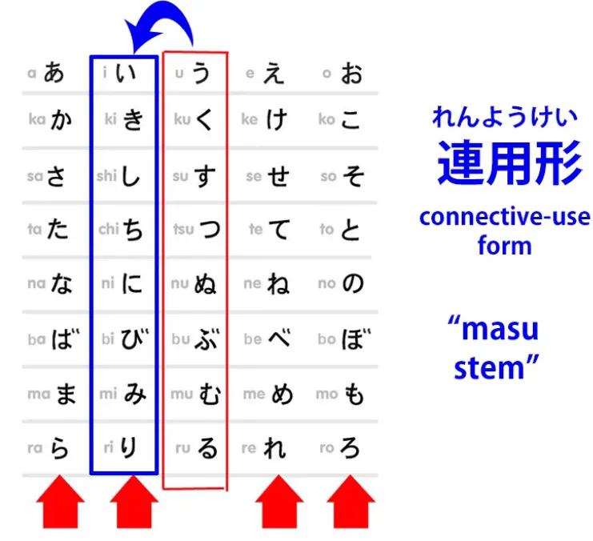
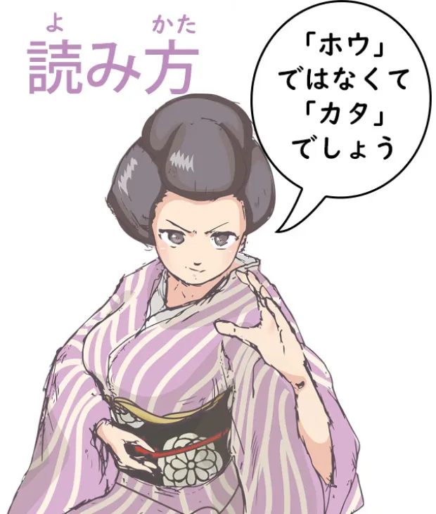
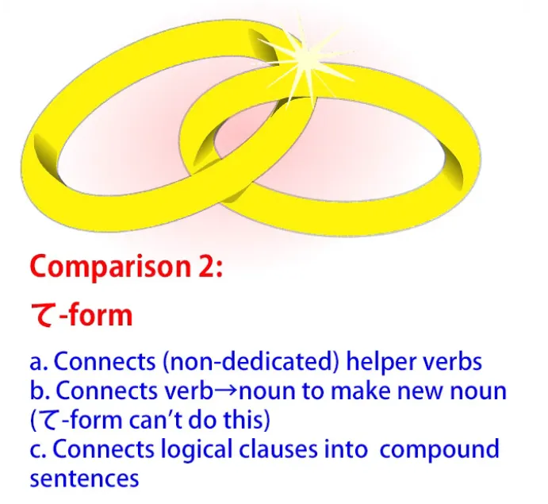
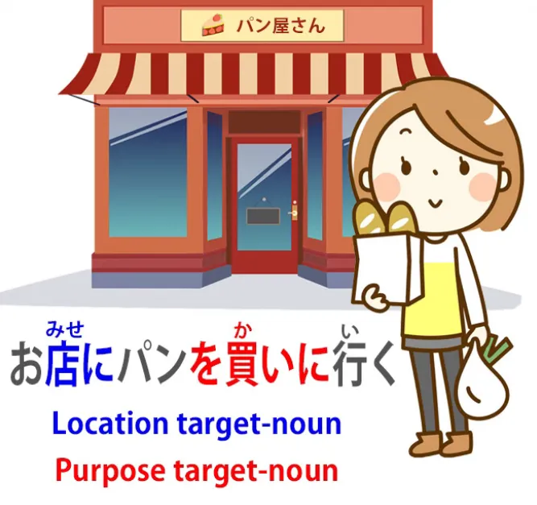

# **72. Penghubung Hebat (Keajaiban A-stem い)**

[**Rahasia tersembunyi struktur bahasa Jepang - The Great Connector (い -A-stem magic) | Pelajaran 72**](https://www.youtube.com/watch?v=_qj9ZkAC2tE&amp;list;=PLg9uYxuZf8x_A-vcqqyOFZu06WlhnypWj&amp;index;=74&amp;ab;_channel=OrganicJapanesewithCureDolly)

こんにちは。

Hari ini kita akan membahas salah satu aspek paling serbaguna dalam struktur bahasa Jepang. Aspek ini mencakup sejumlah area yang dapat dibandingkan dengan aspek lain dalam struktur bahasa Jepang, dan hidup kita akan jauh lebih mudah jika kita membuat perbandingan tersebut, jadi itulah yang akan kita lakukan. Ini adalah sesuatu yang tidak dijelaskan dengan baik oleh kebanyakan buku teks, terutama karena mereka tidak mengenali sistem akar kata kerja, yang benar-benar menjadi inti dari cara kerja kata kerja dalam bahasa Jepang.

Jadi, apa yang akan kita bahas adalah akar kata kerja &quot;い&quot; dalam bahasa Jepang. Dalam bahasa Jepang, ini disebut <code>連用形 / れんようけい</code>, yang berarti <code>connective use form</code>.

Dan kita mungkin menyebutnya <code>The Great Connector</code>, karena ia melakukan berbagai macam fungsi penghubung, yang akan kita bahas sekarang.

Dalam bahasa Inggris, kadang-kadang disebut <code>ます stem</code>, yang tidaklah salah karena tentu saja, di antara banyak hal lainnya, ia menghubungkan kata kerja bantu <code>ます</code>. Saya tidak menyukai ungkapan ini karena berasal dari seluruh ekologi di mana bentuk kata kerja yang disebut &quot;ます&quot;, yang berarti kata kerja yang bergeser ke akar &quot;い&quot; dan memiliki <code>ます</code> kata kerja bantu yang melekat padanya, dianggap sebagai bentuk dasar kata kerja.

Itu bukanlah bentuk dasar kata kerja. Itu hanyalah kata kerja dengan salah satu dari banyak elemen bantu lainnya yang melekat padanya. Dan jika kita menganggapnya sebagai bentuk dasar kata kerja, kita akan sangat bingung tentang apa itu kata kerja dan bagaimana cara kerjanya.

Dan saya telah membuat video tentang hal itu, jadi jika Anda ragu tentang semua ini, Anda mungkin ingin menontonnya. Jadi, apa itu akar kata い ini, <code>連用形 / れんようけい</code> dan mengapa hal ini begitu penting? Nah, jelas, yang dimaksud hanyalah kata kerja yang dipindahkan dari bentuk dasarnya う -row ke bentuk い -row.

Sehingga kata kerja yang berakhiran く berakhiran -き, kata kerja yang berakhiran す berakhiran -し, dan seterusnya.

Karena ini merupakan unsur struktural yang sangat luas, saya akan membandingkannya dengan beberapa hal yang berbeda. Hal pertama, yang paling jelas, untuk dibandingkan adalah tiga I-stem lainnya.

Tentu saja ini mirip dengan mereka, karena seperti semuanya, ini digunakan untuk melekatkan kata bantu dasar. Dan yang saya maksud dengan kata bantu dasar adalah hal-hal yang kadang-kadang disebut <code>conjugations</code> dalam buku teks.

Seperti yang kita ketahui, tidak ada yang namanya konjugasi dalam bahasa Jepang. *(atau lebih tepatnya dalam arti Barat)* Hanya ada empat akar kata dan berbagai kata kerja bantu, kata benda, serta kata sifat, beberapa di antaranya disebut <code>conjugations</code>, beberapa tidak, dan tergantung buku teks mana yang Anda baca, Anda mungkin akan mendapatkan pandangan yang sedikit berbeda mengenai mana yang termasuk <code>conjugations</code> dan mana yang bukan, yang sangat wajar karena ini adalah kategori yang sepenuhnya sewenang-wenang — tidak ada yang namanya konjugasi dalam bahasa Jepang, jadi semuanya hanyalah khayalan. Dan kita tidak selalu mengharapkan konsistensi dalam khayalan.

---

Jadi, akar kata &quot;い&quot;, seperti yang kita ketahui, menghubungkan <code>ます</code> kata kerja pembantu.

Bentuk ini juga menghubungkan berbagai apa yang bisa kita sebut kata benda bantu khusus dan kata sifat bantu. Secara umum, jika kita akan menempelkan kata sifat bantu atau kata benda bantu ke sebuah kata kerja, kita akan menempelkannya ke akar kata &quot;い&quot;. Ini bukan aturan mutlak, tetapi hal ini terjadi hampir setiap saat.

Seperti yang kita ketahui, kata sifat bantu -ないmenempel pada A-stem あ, tetapi hal itu tidak umum. Jadi, kita dapat menempelkan berbagai kata sifat bantu ke A-stem い.

Sebagai contoh, saya akan mengambil kata kerja <code>読む</code> sebagai model untuk sebagian besar yang akan kita lakukan hari ini. Jadi, mari kita ambil kata kerja <code>読む</code> dan ubah menjadi akar kata &quot;い&quot; <code>読み</code> dan kita dapat menambahkan kata sifat seperti <code>やすい</code>: <code>読みやすい</code> (mudah dibaca), <code>にくい</code>: <code>読みにくい</code> (sulit dibaca).

---

Kita juga menambahkan hal-hal seperti <code>ながら</code>.  
<code>ながら</code> berarti melakukan satu hal sambil melakukan hal lain, sehingga kita bisa mengatakan <code>歩きながら読む</code> atau <code>読みながら音楽を聴く</code>: jadi itu <code>while walking, I read</code>, <code>while reading, I listen to music</code>.

---

Partikel <code>そう</code> kata bantu, yang memberi kita makna kesamaan, juga melekat pada kata kerja dengan akar kata &quot;い -A-stem&quot;.

Jadi kita mengatakan <code>雨が降りそうだ</code> (sepertinya akan hujan) / *Hujan tampak akan turun.* dan saya telah membahas bentuk <code>そう</code> bentuk ini dan berbagai struktur terkait dalam video lain, yang akan saya tautkan.[[24]](./24-hearsay-guesses- そう - そうだ - そうです.md)

## Penghubung &quot;連用形&quot; &amp; penghubung bentuk &quot;て&quot;

Sekarang, ini beralih ke area di mana kita dapat mulai membandingkan akar kata &quot;い&quot;, <code>連用形</code>, Sang Penghubung Agung, dengan bentuk て. Sekarang, bentuk て adalah penghubung hebat lainnya, tentu saja.

Ia menghubungkan segala macam hal.

Akhiran い adalah penghubung yang bahkan lebih hebat: ia dapat menghubungkan sebagian besar jenis hal yang juga dihubungkan oleh bentuk て dan ia dapat melakukan banyak hal lain di samping itu.

Jadi, dengan bentuk て kita sering menghubungkan kata kerja bantu yang bukan kata kerja bantu khusus, yang memiliki kehidupan sendiri di luar kapasitas bantuannya. Jadi kita mengatakan <code>持って来る</code>, yang berarti <code>fetch</code> (memegang + datang); kita dapat mengatakan <code>やって見る</code> (coba saja, secara harfiah lakukan + lihat).

### Kata kerja majemuk

Sekarang, dengan cara yang sama kita dapat membentuk kata kerja majemuk dengan A-stem い. Misalnya, kita mengatakan <code>振り回す</code> (mengibarkan).

Dan kembali ke kata <code>読む</code>, kita bisa mengatakan <code>読み始める</code>, yang berarti <code>start reading</code> atau <code>読み込む</code>, yang berarti baca + masukkan, yang sebenarnya berarti <code>load</code> dalam konteks komputer.

Dan saya telah membuat video lengkap tentang ini <code>込む</code> yang bisa Anda tonton jika tertarik.[[57]](./57- 込む -komu-and-the-secret-of-multi-meaning-japanese-words.md) Saya akan menaruh tautannya di atas dan di bagian informasi di bawah bersama dengan yang lainnya.

Di layar pemuatan komputer, Anda sering akan melihat <code>読み込み中</code>, yang menarik, karena di sini Anda melihat ada dua A-stem い, ditumpuk bersama. <code>読み込む</code> sendiri mengambil akar kata い dan menghubungkannya ke <code>中</code> (tengah).

Jadi <code>読み込み中</code> secara harfiah dibaca read + pack in + middle — <code>in the process of loading</code>. Dan ini, tentu saja, adalah kata benda: <code>中</code> adalah kata benda dan setiap kata majemuk mengambil karakter dari unsur terakhirnya dalam bahasa Jepang.

Jadi, <code>読み込み中</code> adalah kata benda yang dibentuk oleh gabungan dua kata kerja dengan akar kata &quot;い&quot; dan sebuah kata benda.

### Menggabungkan kata kerja dengan kata benda untuk membentuk kata benda baru

Dan ini mengarah pada sesuatu yang dapat dilakukan oleh akar kata &quot;い&quot; yang tidak bisa dilakukan oleh bentuk &quot;て&quot;. Yaitu, menggabungkan kata kerja dengan kata benda untuk membentuk kata benda baru.

Jadi, misalnya, kita memiliki <code>泣き虫</code>: <code>泣き</code> adalah akar kata &quot;い&quot; dari I-stem <code>泣く</code> (menangis), <code>虫</code> berarti <code>insect</code>. Jadi <code>泣き虫</code> adalah <code>cry-bug</code>, yang merupakan istilah Jepang untuk orang yang mudah menangis.

Dan kembali ke teman kita <code>読む</code>, kita bisa memiliki <code>読み方</code>:

<code>方 / かた</code> berarti <code>form, or manner, or way</code> — mungkin kamu pernah mendengar <code>方</code> dalam karate, seni bela diri — jadi <code>読み方</code> berarti <code>form or manner or way of reading</code>, dan yang biasanya dimaksudkan di sini adalah pengucapan kanji, cara membaca kanji dalam konteks tertentu.

Jadi, bentuk dasar &quot;い&quot; memiliki kemampuan kata majemuk dari bentuk &quot;て&quot; dan melampaui bentuk &quot;て&quot;. Dan ia juga dapat mengambil salah satu fungsi dasar bentuk &quot;て&quot;, karena, seperti yang kita ketahui, bentuk &quot;て&quot; dapat menghubungkan dua bagian dari kalimat majemuk.

Kita bisa mengatakan <code>お店に行ってパンを買った</code>.

Jadi, di sana terdapat dua klausa logis: <code>I went to the shops</code> dan <code>I bought some bread</code>. Dan alih-alih menggunakan <code>and</code>, seperti yang kita lakukan dalam bahasa Inggris, kita menggunakan bentuk て.

::: info
Anda dapat memeriksa [**pohon komentar ini**](https://www.youtube.com/watch?v=_qj9ZkAC2tE&amp;lc;=UgzBHAJNYjRy5GdLuE94AaABAg&amp;ab;_channel=OrganicJapanesewithCureDolly) di bawah video ini. Mungkin berguna.
:::

Saya telah membuat video tentang kalimat majemuk, yang akan saya tautkan.[[11]](./11-compound-sentences- くれる - あげる -and-more-uses-of-the- て -form.md)

Sekarang, akar kata い dapat melakukan hal yang persis sama. Kita dapat mengatakan <code>お店に行きパンを買った</code>, yang sama persis dengan mengatakan  
<code>お店に行ってパンを買った</code>.

Kita tidak sering mendengarnya, tapi hal ini sama sekali tidak jarang. Kita akan lebih sering menemukannya dalam bentuk tertulis, tapi jika Anda melakukan imersi, membaca buku, bermain game yang banyak teksnya, serta dalam manga dan anime, Anda akan menemui penggabungan kalimat majemuk dengan い -stem ini.

Ini adalah bagian fundamental lain dari bahasa Jepang. Jadi, Anda melihat bahwa A-stem (い) dapat melakukan sebagian besar hal yang dapat dilakukan oleh bentuk kata kerja (て). Dengan kata majemuk, A-stem tidak menggabungkan kata-kata yang sama seperti bentuk kata kerja, tetapi menggabungkan kata-kata dengan cara yang sangat mirip.

## Bentuk kata kerja -連用形, memberikan bentuk nomina dari kata kerja (klausa kata kerja)

Namun, bentuk kata kerja -い- tidak berhenti di situ. Bentuk ini dapat melakukan satu hal lain yang sangat penting.

Bentuk ini memberikan bentuk nomina dari kata kerja.

Kita telah membahas sebelumnya tentang apa yang kadang-kadang disebut &quot;nominalisasi kata kerja&quot;, yaitu menggunakan akhiran &quot;の&quot; atau &quot;こと&quot; atau cara lain untuk mengubah sesuatu yang verbal menjadi kata benda. Nah, ini sebenarnya bukan menominalkan kata kerja, itulah sebabnya saya cenderung menghindari istilah tersebut, karena yang sebenarnya kita lakukan di sini bukanlah mengubah kata kerja menjadi kata benda, melainkan mengubah seluruh klausa kata kerja menjadi semacam kata benda.

Kita sebenarnya tidak mengubahnya menjadi kata benda.

Yang kita lakukan adalah mengemasnya ke dalam kotak yang dibuat oleh kata ganti seperti &quot;の&quot; atau &quot;こと&quot;, dan saya telah membahas di berbagai tempat tentang memasukkan klausa kata kerja ke dalam kotak &quot;の&quot; atau ke dalam kotak &quot;こと&quot;. Dalam beberapa kasus, tentu saja, kita mungkin juga mengemas ke dalam kata ganti tersebut secara harfiah sebuah kata kerja tunggal, jadi jika kita mengatakan <code>泳ぐのが好きだ</code>, kita berarti <code>I like swimming</code>, dan itu berarti <code>I like the activity of swimming</code>.

Namun, sekali lagi, ini bukanlah fungsi dari A-stem い. Fungsi dari A-stem い adalah memberikan bentuk kata benda sejati dari sebuah kata kerja.

Dan dalam bahasa Inggris, hal ini biasanya diwakili oleh kata kerja yang tidak berubah, sehingga bentuk kata kerja dan bentuk kata benda identik dalam bahasa Inggris. Dalam bahasa Jepang, keduanya tidak identik. Dalam bahasa Jepang, kita memiliki bentuk dasar, yaitu bentuk akhiran &quot;う&quot;, untuk kata kerja, dan untuk bentuk kata benda, kita memiliki akar kata &quot;い&quot;.

Jadi, mari kita ambil contoh agar Anda mengerti apa yang saya bicarakan di sini. Dalam bahasa Inggris, kita memiliki <code>rest</code>, kata <code>rest</code>, yang bisa menjadi kata kerja atau kata benda. Kita menggunakan kata kerja <code>rest</code> ketika kita mengatakan <code>I need to rest</code>.

Kita menggunakan bentuk kata benda <code>rest</code> ketika kita mengatakan <code>I need a rest</code>.

Jadi, jika kita ambil kata kerja <code>休む</code> dalam bahasa Jepang sebagai semacam padanan kasar dari <code>rest</code> dalam bahasa Inggris, kita memiliki <code>休む</code>, yang merupakan kata kerja <code>rest</code>, dan <code>休み</code>, yang merupakan kata benda <code>rest</code>. Jadi, <code>休む</code> adalah tindakan beristirahat, kata kerjanya <code>rest</code>; <code>休み</code> adalah <code>a rest</code>, kata benda <code>rest</code>.

Dan kita menggunakan kata ini baik secara terpisah maupun dalam kata majemuk seperti <code>夏休み</code>, yang berarti <code>summer vacation</code> atau <code>summer break</code>. Dan, seperti yang kita lihat, kita tidak akan menyebutnya <code>summer rest</code> dalam bahasa Inggris, tetapi itu karena, seperti yang telah kita bahas sebelumnya, sangat jarang kata dalam bahasa Jepang mencakup area spektrum makna yang persis sama dengan kata dalam bahasa Inggris.

Jadi, kata <code>休み</code> dapat berarti <code>rest</code> secara harfiah seperti berbaring, beristirahat; bisa berarti tidak masuk sekolah atau tidak masuk kerja karena sakit; bisa berarti liburan, seperti <code>夏休み</code>. Namun intinya adalah bahwa bentuk kata kerjanya adalah <code>休む</code>, sedangkan bentuk kata benda adalah <code>休み</code>.

Dan hampir semua kata kerja yang secara logis dapat memiliki bentuk kata benda akan memiliki bentuk kata benda tersebut yang diwakili oleh akar kata kerja &quot;い -A-stem&quot;. Dan seringkali keduanya sama dalam bahasa Inggris; terkadang berbeda.

Jadi, misalnya, <code>痛む</code> berarti <code>hurt</code>; <code>痛み</code> berarti <code>pain</code>.

Sekali lagi, kita memiliki bentuk kata benda dari <code>hurt</code>, yaitu <code>pain</code>. Dan ini sangat penting karena tidak hanya memberi kita berbagai macam kata benda yang terbentuk dari kata kerja, tetapi juga berperan dalam struktur lain yang sangat jarang dijelaskan oleh buku teks.

---

Jadi jika kita mengatakan, misalnya, <code>お店にパンを買いに行く</code> atau <code>公園に遊びに行く</code>,

apa yang dimaksud dengan A-stem &quot;い&quot; dari <code>買う</code>, yang merupakan <code>買い</code>, atau akar kata &quot;い&quot; dari <code>遊ぶ</code>, yang adalah <code>遊び</code>? Yang dimaksud adalah kata benda, jadi ketika kita mengatakan <code>公園に遊びに行く</code>, kita menandai tujuan lokasi tempat yang akan kita tuju — kita akan pergi ke taman, <code>公園</code> — dan kemudian kami menyatakan tujuan kami. 

Tujuan kami adalah bermain, bersenang-senang, dan itulah <code>遊び</code>. Jadi secara harfiah kita mengatakan <code>I&#x27;m going to the park for play</code>.

Jika kita mengatakan <code>お店にパンを買いに行く</code>, kita mengatakan <code>I&#x27;m going to the shops for bread-buying</code>. Begitulah strukturnya, dan saya rasa sangat sedikit buku teks yang benar-benar menjelaskan bahwa yang kita gunakan di sini adalah bentuk kata benda dari kata kerja.

Dan itu penting, karena seperti yang saya ajarkan dalam pelajaran kita tentang partikel logis[[8b]](./8b-particles-explained.md), lima partikel logis utama hanya dapat melekat pada kata benda. *(が, を, の, に, へ, で)*

::: info
Sama seperti yang dikatakan Dolly dalam Pelajaran 8b, &quot;の&quot; juga termasuk dalam Partikel logis,
:::

Jadi, jika tidak dijelaskan bahwa <code>遊び</code> di sini dan <code>買い</code> di sini adalah kata benda, saya tidak yakin apa yang dipikirkan kebanyakan pelajar tentang struktur sebenarnya.

---

Dan kita akan menemukan dalam berbagai struktur bahwa bentuk kata benda dari kata kerja digunakan, dan struktur tersebut hanya benar-benar masuk akal jika kita memahami bahwa itu adalah bentuk kata benda dari kata kerja.

Jadi di sini kita memiliki akar kata &quot;い&quot; I-stem. Ini adalah Penghubung Utama dan juga A-stem pembentuk kata benda dari kata kerja yang mendasar. Jadi, ia memiliki rentang aplikasi yang sangat luas.

Akhiran ini dapat melakukan segala hal yang dapat dilakukan oleh akar kata biasa, melakukan segala hal yang dapat dilakukan oleh bentuk kata kerjて, dan mengubah kata kerja menjadi kata benda untuk digunakan sebagai kata benda biasa seperti <code>痛み</code> (sakit) atau <code>休み</code> (istirahat/beberapa istirahat) dan juga untuk struktur yang lebih dalam seperti <code>遊びに行く</code> (pergi untuk bermain, pergi untuk melakukan aktivitas bermain).

Jika Anda memiliki pertanyaan atau komentar *(sekali lagi, disarankan untuk membaca komentar video setelahnya)*, silakan tulis di kolom Komentar di bawah dan saya akan menjawab seperti biasa.

Saya ingin mengucapkan terima kasih kepada para pendukung Gold Kokeshi saya dan semua pendukung serta pendukung saya di Patreon dan di mana pun, yang membuat semua ini mungkin.
::: info
Di kolom komentar, ada komentar yang cukup menarik dari shary0 tentang bentuk kata &quot;て&quot;.  
Jika ada yang ingin mempelajari akar kata &quot;い&quot; dalam bahasa yang lebih <code>text-booky</code> bahasa - berikut adalah **[tautan sumber](https://jref.com/articles/renyoukei.107/).  
:::
**Selain itu, silakan lihat [**diskusi komentar di bawah video ini.**](https://www.youtube.com/watch?v=_qj9ZkAC2tE&amp;lc;=Ugy_D9a0k-_X9AujzO94AaABAg&amp;ab;_channel=OrganicJapanesewithCureDolly)*

