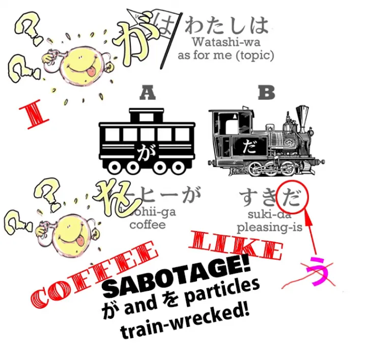
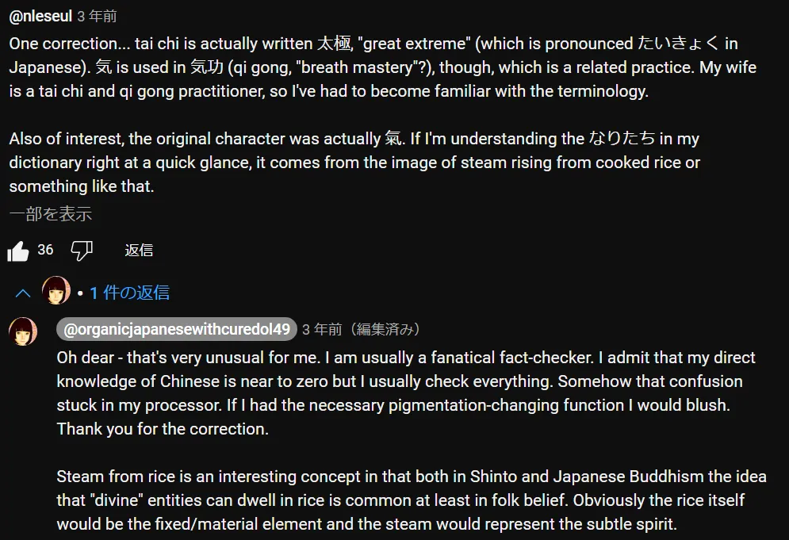
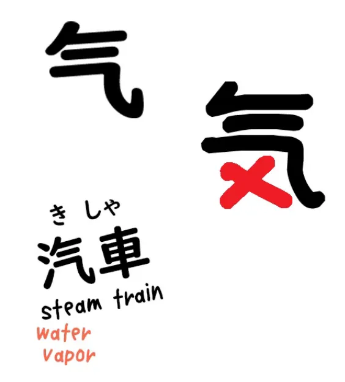
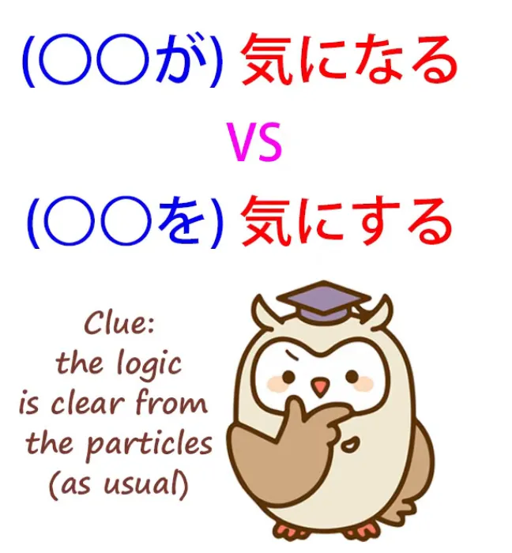
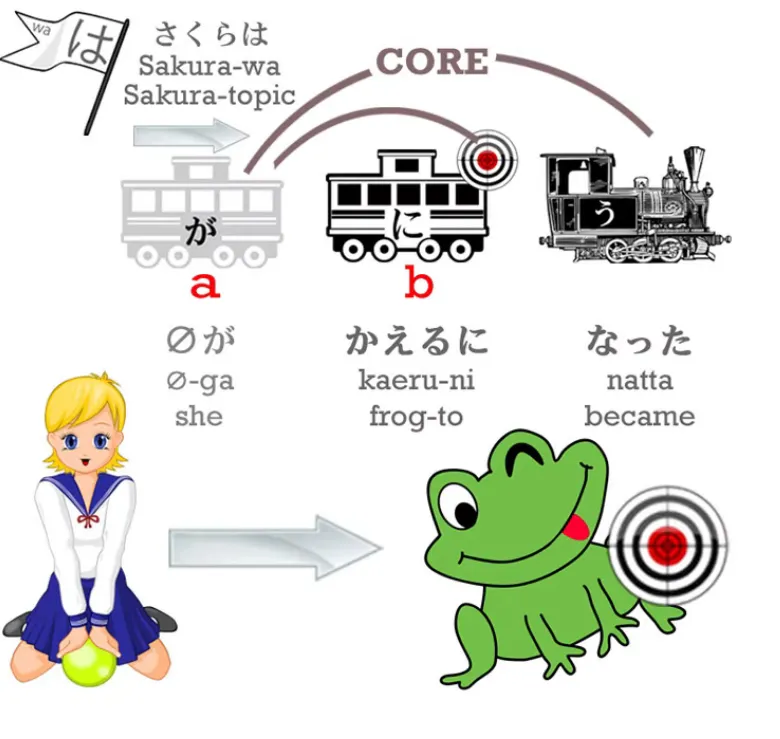
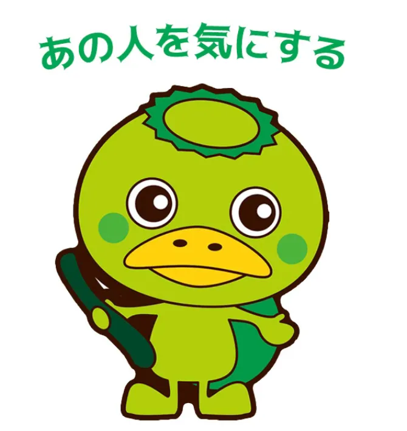
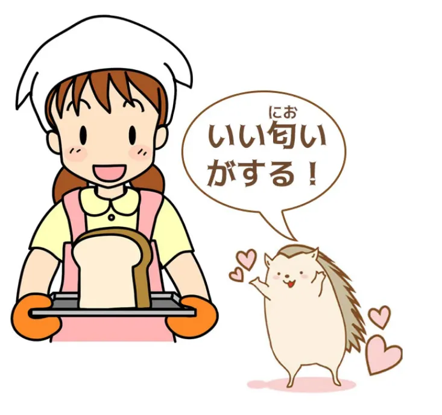
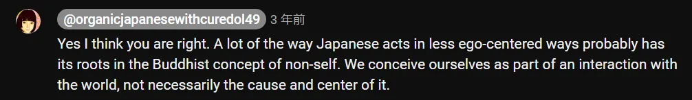

# **73. Rahasia &quot;気&quot;: &quot;気になる&quot;, &quot;気にする&quot;, &quot;気がする&quot;, &quot;気に入る&quot;, dll.**

[**Rahasia 気 Ki - ki ni naru, ki ni suru, ki ga suru, ki ni iru, dll. 気になる、気にする、気がする、気に入る | Pelajaran 73**](https://www.youtube.com/watch?v=ZHHd3nHkFb0&amp;list;=PLg9uYxuZf8x_A-vcqqyOFZu06WlhnypWj&amp;index;=75&amp;ab;_channel=OrganicJapanesewithCureDolly)

こんにちは。

Hari ini kita akan membahas kata <code>気</code> dan berbagai ungkapan yang menggunakannya, seperti <code>気にする</code>, <code>気がする</code>, <code>気になる</code>, <code>気に入る</code> dan sebagainya.

Nah, orang-orang sering kali merasa bingung dan sulit memahami bagaimana tepatnya strukturnya, bagaimana cara kerjanya, dan bagaimana kita harus menggunakannya. Ada dua alasan untuk hal ini. Yang pertama adalah kita perlu memahami apa <code>気</code> sebenarnya berarti.

Dan yang kedua adalah kita perlu memiliki pemahaman yang sangat kuat tentang Partikel logis jika kita ingin membedakan hal-hal seperti <code>気にする</code>, <code>気になる</code>, <code>気がする</code>, satu sama lain. Dan tentu saja jika Anda belajar bahasa Jepang konvensional dari buku teks, pemahaman yang kuat tentang sifat Partikel logis yang tidak berubah adalah hal yang justru tidak Anda miliki, karena jika Anda diajarkan hal-hal seperti <code>コーヒーが好きだ</code> berarti <code>I like coffee</code>, Anda tidak akan pernah benar-benar memahami apa sifat tak berubah dari partikel が, misalnya.

Dan jika Anda memiliki keraguan tentang sifat lima partikel logis utama, saya sangat merekomendasikan Anda menonton video ini tentang topik tersebut[[8b]](./8b-particles-explained.md), karena ini adalah fondasi utama bahasa Jepang. Jika Anda masih bingung tentang Partikel logis, maka Anda juga bingung tentang bahasa Jepang, titik.

Baiklah. Jadi, apa itu <code>気</code>? <code>気</code> yang berasal dari bahasa Tionghoa.

<s>Kanji-nya adalah kanji yang sama dengan yang ada di <code>tai chi</code>.</s>  
::: info
Dolly salah di sini, 気 tidak digunakan di 太極. Untungnya, ada <code>nleseul</code> yang menjelaskannya, salut untuk mereka.*  

:::

Ini adalah konsep Taoisme dan kemungkinan berasal dari masa sebelum apa yang kita kenal sekarang sebagai Taoisme. Hingga saat ini konsep tersebut digunakan dalam pengobatan Tiongkok, seni bela diri Tiongkok dan Jepang, serta bidang-bidang lainnya.

Intinya adalah semangat dasar dari energi yang mengalir dalam diri seseorang atau sesuatu lainnya. Awalnya hal ini dikaitkan dengan napas, dan dalam banyak bahasa, <code>breath</code> dan <code>spirit</code> sebenarnya merupakan kata yang sama. Bahasa Latin <code>spiritus</code>, Yunani <code>pneuma</code>, Ibrani <code>ruach</code>, Sanskerta <code>atma</code>: semuanya berarti baik nafas maupun roh.

Sekarang, makna nafas dari <code>気</code> tidak lagi digunakan, tetapi tetap merupakan prinsip roh yang mengalir di dalam diri seseorang.

---

Jika kita melihat kanji-nya, menariknya, bagian ini 气 ***([Radikal 84](https://en.wikipedia.org/wiki/Radical_84))*** (yang juga diucapkan <code>き</code>) berarti uap atau asap. Jadi, <code>汽車</code> adalah engine uap.

Dan kemudian kita memiliki ini <code>メ</code>, seolah-olah, dan di sini <code>メ</code> benar-benar <code>marks the spot</code>. (気)  

Kita memiliki bagian silang yang tetap dan bagian yang cair serta beruap. Dan kedua aspek tersebut <code>気</code> penting, dan Anda tidak pernah bisa sepenuhnya memisahkan keduanya, meskipun kita bisa berpindah dari ujung skala yang tetap ke ujung skala yang cair.

Jadi, untuk memberikan contoh dari kedua ujung skala tersebut, mari kita ambil dua ungkapan yang hampir pasti Anda ketahui.

---

Yang pertama adalah <code>元気</code>, yang kedua adalah <code>やる気</code>. Sekarang, <code>元気</code>, seperti yang Anda ketahui, adalah kekuatan atau kesehatan. Kata <code>元</code> berarti asli, mendasar.

Jadi, <code>気</code> adalah sehat dan bertenaga. Jika terjadi sesuatu yang salah, kita mungkin menjadi <code>病気</code> (sakit atau lesu). Dan tujuan kita kemudian adalah mengembalikan <code>気</code> ke keadaan aslinya yang sehat dan bersemangat, untuk memulihkan <code>元気</code>.

<code>やる気</code> adalah kemauan untuk melakukan sesuatu. Jadi, ini adalah semangat untuk bertindak, semangat untuk bangkit dan bergerak. Dan jenis <code>気</code> bukanlah <code>気</code> yang dalam arti tertentu tetap konstan di dalam diri kita. Ini adalah <code>気</code>, yaitu <code>気</code> untuk melakukan hal tertentu.

Jadi kita bisa mengatakan

<code>海外で勉強する気がある</code>

Dan yang kami maksud di sini adalah bahwa <code>気</code> ada di dalam diri kita yang merupakan <code>気</code> untuk belajar di luar negeri. Jadi dalam arti ini <code>気</code> adalah keinginan atau kecenderungan untuk melakukan suatu hal tertentu.

Ketika kita mengatakan <code>気を付ける</code>, ini secara harfiah berarti melekatkan atau menempelkan jiwa Anda.

Jadi, jika seseorang berkata <code>階段に気を付ける</code>, yang mereka katakan secara harfiah adalah <code>attach your spirit to the staircase</code>. Nah, yang akan kita katakan dalam bahasa Inggris adalah <code>watch out for the staircase</code> atau <code>take care on the staircase</code>.

Tempelkan semangatmu, kesadaranmu, perasaanmu, pikiranmu, pada tangga; perhatikanlah; berhati-hatilah. Dan itu mungkin bukan hal tertentu. Seringkali orang mengatakan <code>気を付けて</code> (tempelkan rohmu). Dan ini bukan menempelkannya pada hal tertentu, tetapi menempelkannya pada apa pun yang pantas untuk ditempelkan; miliki kesadaran situasional, seperti yang mungkin dikatakan dalam istilah modern; berhati-hatilah.

## 気になる &amp; 気にする

Sekarang, ketika kita membahas hal-hal seperti <code>気になる</code> dan <code>気にする</code> — kita telah membahasnya dalam pelajaran sebelumnya[[8]](./8-the- に -and- へ -particles.md)[[18]](./18- って - は -mysteries-explained- おうとする - とする - として - という - っていう.md) dengan <code>になる</code> dan <code>にする</code>.　

Jadi, misalnya, jika kita mengatakan <code>さくらがカエルになる</code>, kita mengatakan Sakura berubah menjadi katak.

Jika kita mengatakan <code>魔女がさくらをカエルにする</code>, kita mengatakan bahwa seorang penyihir mengubah Sakura menjadi katak.

Dan tentu saja kita tahu siapa yang melakukan apa berkat Partikel logis. Jadi apa artinya ketika kita membicarakan <code>気になる</code> dan <code>気にする</code>?

Kita mengatakan bahwa sesuatu menjadi jiwa kita. Apa yang kita maksud dengan itu? Nah, untuk memahaminya, kita perlu memahami hal lain. Kita perlu memahami bahwa menjadi sebuah perasaan, emosi, atau ekspresi emosi, adalah sesuatu yang kita lakukan dalam bahasa Jepang.

Kita tidak melakukannya dalam bahasa Inggris. Jadi, misalnya, dalam lagu AKB48 <code>Heavy Rotation</code> ada baris:

<code>こんな気持ちになれるって僕はついているね</code>

Dan ini berarti <code>That I could become this feeling, I&#x27;m lucky, aren&#x27;t I?</code> Sekarang, dalam bahasa Inggris kita tidak membicarakan <code>becoming</code> perasaan, tetapi dalam bahasa Jepang kita memang membicarakan hal itu.

Dan saya pikir ini agak terkait dengan konsep <code>気</code> dan juga dengan gagasan Buddha bahwa sebenarnya tidak ada diri. Apa yang kita alami bukanlah sesuatu yang tetap dan mutlak. Diri pada dasarnya adalah kumpulan tindakan dan reaksi, perasaan dan sensasi yang terus berubah.

Jadi, kita mungkin untuk sementara waktu menjadi suatu perasaan tertentu. Anda bahkan mungkin menjadi, dalam bahasa Jepang, ekspresi dari suatu perasaan. Kita mungkin mengatakan <code>深刻な表情になる</code> — seseorang menjadi wajah yang serius atau cemas. Untuk sesaat itu, seluruh dirinya berubah menjadi ekspresi keseriusan dan kekhawatiran tersebut.

Nah, inilah yang kita maksud ketika kita mengatakan <code>気になる</code> dan <code>気にする</code>. Jika kita mengatakan <code>あの人は気になる</code>, kita mengatakan bahwa orang itu berubah menjadi rohku.

Rohku seolah-olah dibentuk ulang, sebagian darinya, untuk jangka waktu tertentu, menjadi bentuk atau wujud orang tersebut. Apa artinya itu? Artinya, orang tersebut, seperti yang kita katakan dalam bahasa Inggris, menduduki perasaanku.

Sekarang, ini bisa berarti berbagai hal. Bisa berarti bahwa kita peduli atau khawatir terhadap orang tersebut. Bisa berarti bahwa orang tersebut membuat kita penasaran. Bisa berarti bahwa kita merasa ada misteri seputar orang tersebut. Atau apa pun itu, orang tersebut mendominasi perasaan kita, sensasi kita, pikiran kita; dalam bahasa Jepang, menjadi perasaan kita, sensasi kita, pikiran kita, <code>気</code>.

Nah, hal penting yang perlu diperhatikan di sini adalah bahwa kita cenderung melihat dalam buku tata bahasa dan kamus <code>**気になる** means this</code>, <code>**気にする** means that</code>, tetapi hal penting yang perlu dipahami adalah bahwa <code>気になる</code> sendiri tidak berarti apa-apa. Begitu pula <code>気にする</code>. <code>気になる</code> merupakan bagian akhir dari sebuah klausa logis yang lengkap.

<code>なる</code> adalah engine-nya, <code>気に</code> memberi tahu kita lebih banyak tentang engine-nya. Mobil A dalam kasus <code>気になる</code> adalah apa pun yang memenuhi pikiran kita, apa pun yang berubah menjadi jiwa kita. Jadi dalam hal ini <code>あの人</code> adalah mobil A dan apa yang kita katakan tentang orang itu, apa yang dilakukan orang itu, menjadi bagian dari jiwa kita.

Sekarang, ketika kita mengambil <code>気にする</code>, kita mengatakan <code>あの人を気にする</code>.

Jadi sekarang pelaku tindakan itu bukanlah orang tersebut; pelaku tindakan itu adalah saya. Saya sedang mengubah orang tersebut menjadi bagian dari jiwa saya. Saya sedang memikirkan orang tersebut.

Dan hal itu memiliki dua implikasi. Yang pertama adalah bahwa dalam arti tertentu kita melakukan kekerasan terhadap jiwa kita. Bukan hanya jiwa kita secara alami menjadi orang tersebut — kita yang membuatnya demikian. Dan hal itu cenderung memberinya makna yang sedikit lebih negatif.

Sementara <code>気になる</code> dapat mencakup spektrum makna yang luas, mulai dari merasa tertarik hingga merasa khawatir, <code>気にする</code> biasanya berarti khawatir.

Sekarang, implikasi lainnya adalah bahwa kita yang mengendalikannya. Jiwa kita tidak sekadar berubah menjadi orang itu. Kita yang mengubah jiwa kita menjadi orang itu.

Dan itulah mengapa Anda sering mendengar orang berkata <code>気にしないで</code> (jangan jadikan itu sebagai jiwa Anda). Tidak masuk akal untuk mengatakan <code>気にならないで</code>, karena kamu tidak membuat apa pun terjadi. Jiwamu hanya berubah menjadi hal itu.

Tetapi <code>気にしないで</code> mengatakan kepada Anda untuk mengendalikan sesuatu yang Anda kendalikan: <code>Don&#x27;t turn it into your spirit; don&#x27;t worry about it; don&#x27;t be concerned.</code>

Sekarang, kita memiliki <code>気にする</code> dan <code>気になる</code>.

## 気がする

Bagaimana dengan <code>気がする</code>?

Lagi-lagi, partikel tersebut memberi kita petunjuk tentang apa yang sedang terjadi. Ketika kita mengatakan <code>気がする</code>, yang <code>気</code>, roh itu sendiri, yang bertindak. Bukan sesuatu yang menjadi roh kita, bukan kita yang mengubah sesuatu menjadi roh kita. Melainkan roh kita yang melakukan sesuatu atau aspek tertentu dari roh kita yang bertindak (<code>する</code>, melakukan, atau bertindak).

Bagaimana kita memahami hal ini? Nah, sekali lagi kita perlu memahami hal lain dalam bahasa Jepang sebelum dapat memahami hal ini dengan benar. Ketika kita menggunakan ungkapan seperti <code>いい匂いがする</code> atau <code>綺麗な音がする</code>, yang kita maksud adalah <code>There&#x27;s a good smell</code>, <code>There&#x27;s a pretty sound / a pretty sound happened / a pretty sound acted</code>.

Yang kita maksud dengan <code>する</code> dalam kasus bau atau suara adalah satu-satunya hal yang dapat dilakukan oleh bau atau suara: bau berbau dan suara berbunyi. Ketika kita mengatakan <code>匂いがする</code>, yang kita maksud adalah bahwa bau itu beraksi, bau itu aktif, saya dapat mendeteksi bau.

<code>音がする</code>: suara itu bertindak, suara itu aktif, saya dapat mendeteksi suara. Ketika kita mengatakan <code>気がする</code>, yang kami maksud adalah suatu semangat tertentu, suatu pikiran tertentu, suatu kesadaran tertentu sedang aktif, saya dapat mendeteksi kesadaran itu, saya dapat mendeteksi perasaan itu.

Jadi, jika kami mengatakan <code>騙されているような気がする</code>, kita mengatakan &quot;Aku merasa kita sedang ditipu, aku merasa kita sedang dipermainkan&quot; — <code>気</code>, perasaan seperti itu, sedang aktif.

Jika kita mengatakan <code>強くなった気がする</code>, kita sedang mengatakan <code>I feel that I got stronger, I sense that I got stronger</code> — bahwa semangat, kecenderungan emosi, dan pikiran itu aktif, sama seperti bau atau suara yang aktif.

## 気に入る

Sekarang, satu hal terakhir yang menurut saya lebih membingungkan daripada yang lain karena pada dasarnya menggunakan kata dengan cara yang tidak umum adalah <code>気にいる</code>.

Jika kita mengatakan <code>それを気に入る</code>, kita berarti <code>I like that</code>.  
::: info
それが気に入るjuga mungkin. Seperti yang diberikan Dolly dengan これを気に入る.
:::

Sekarang, yang sebenarnya kita katakan adalah bahwa saya membiarkan hal itu masuk ke dalam jiwa saya.

Yang membingungkan di sini adalah bahwa <code>入る/いる</code> tidak digunakan dalam arti biasanya. <code>入る</code> biasanya berarti masuk atau datang. Dan jika kita berbicara tentang memasukkan sesuatu ke dalam sesuatu, kita mengatakan <code>入れる</code>.

Namun dalam kasus ini, <code>入る</code>, mungkin karena ini adalah penggunaan lama yang sudah melekat dalam bahasa pada frasa yang sangat umum ini, <code>入る</code> sebenarnya berarti membiarkan masuk ke dalam jiwa seseorang.

Jadi, orang yang melakukan <code>気に入る</code> adalah diri sendiri. Dan kita tahu bahwa memang demikian karena begitulah cara partikel bekerja. Kita selalu bisa mempercayai partikel.

Jika partikel-partikel tersebut menyatakan satu hal dan bentuk kata tersebut menyatakan hal lain, kita dapat yakin dalam setiap kasus bahwa partikel-partikel tersebut tahu apa yang mereka maksud dan kata tersebut mungkin telah berubah maknanya seiring waktu.

<code>気に入る</code> adalah sesuatu yang akan Anda dengar dalam berbagai kesempatan, dan salah satu ciri khasnya adalah bahwa ungkapan ini jauh lebih mudah digunakan untuk orang lain daripada hal-hal seperti <code>欲しい</code> atau <code>好き</code>.

Ini bukan berarti kita bisa dengan gamblang menyatakan apa yang disukai dan tidak disukai orang lain, bahkan dengan menggunakan <code>気に入る</code>, tetapi jika kita akan membicarakan perasaan orang lain, menanyakan perasaan mereka, atau menyarankan apa yang mungkin mereka rasakan, <code>気に入る</code> jauh lebih sopan daripada menggunakan istilah seperti <code>たい</code> atau <code>好き</code> atau <code>欲しい</code>.

Jadi, Anda akan sering melihat <code>気に入る</code> dalam referensi terhadap perasaan orang lain maupun perasaan sendiri.

Jadi, saya harap ini membuat keseluruhan <code>気</code> penggunaannya menjadi sedikit lebih jelas…  
::: info
[**Konsep Buddha tentang <code>non-self</code>**](https://en.wikipedia.org/wiki/Anatt%C4%81) mungkin merupakan bahan studi yang baik untuk memahami cara kerja bahasa Jepang.
:::

