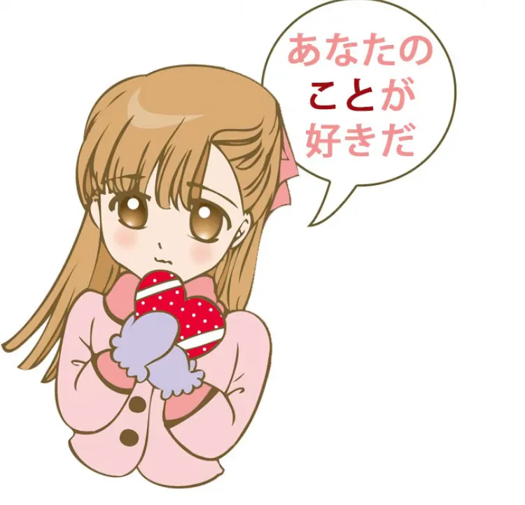
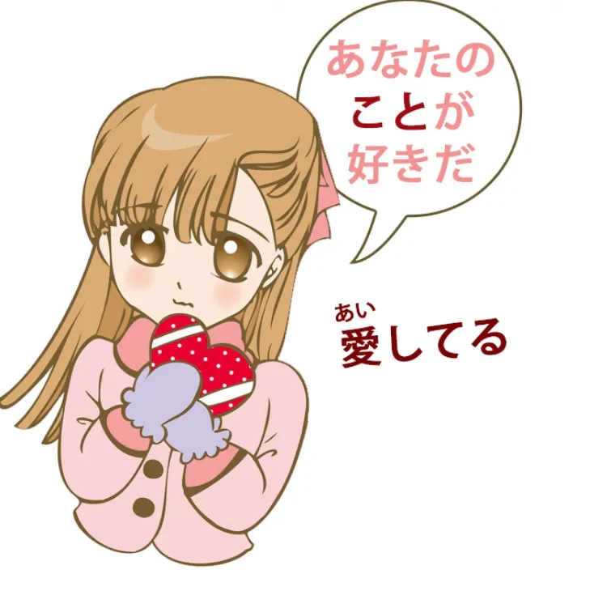
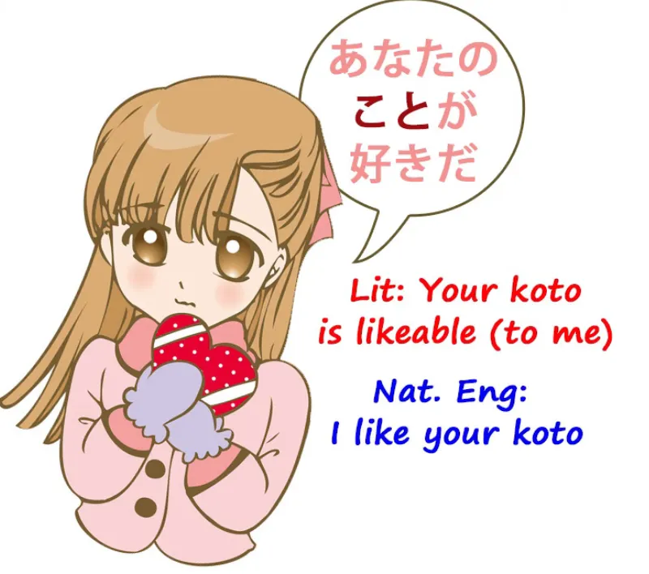
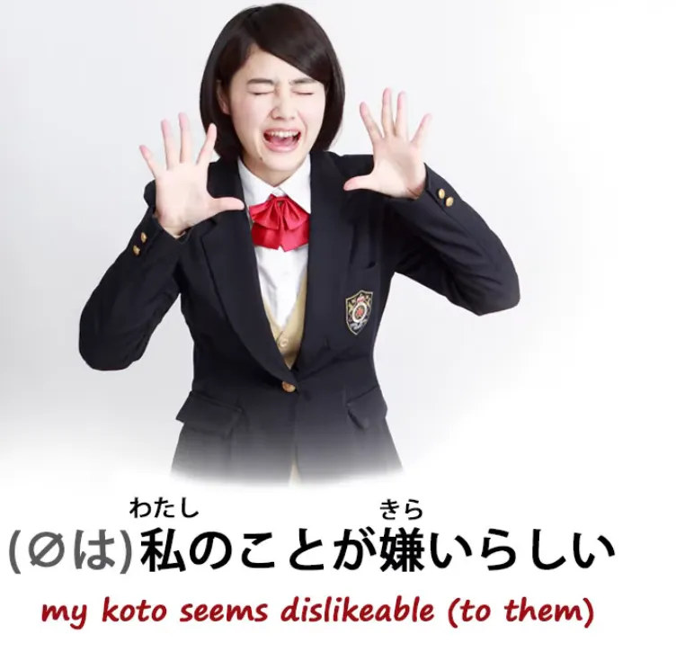
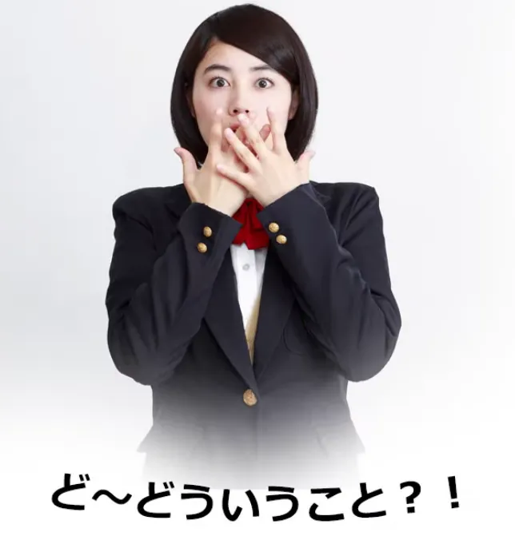
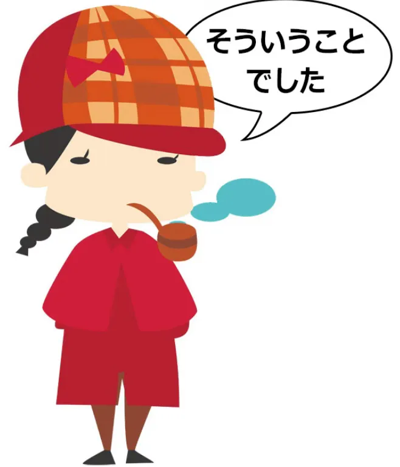

# **74. CINTA dan misteri-misteri lain dari こと! あなたのことが好き, 私のことが嫌い, ということ, そういうこと, どういうこと, そんなこと**

[**CINTA dan misteri-misteri lain dari KOTO! あなたのことが好き、私のことが嫌い、ということ、そういうこと、どういうこと、そんなこと | Pelajaran 74**](https://www.youtube.com/watch?v=aoP6sFyTsIk&amp;list;=PLg9uYxuZf8x_A-vcqqyOFZu06WlhnypWj&amp;index;=76&amp;ab;_channel=OrganicJapanesewithCureDolly)

こんにちは。

Hari ini kita akan membahas beberapa misteri dari kata <code>こと</code>. Dan hal ini memang bisa sangat membingungkan bagi pelajar asing, karena beberapa makna memang tidak bisa diterjemahkan ke dalam bahasa Inggris atau bahasa lain.

Kita bisa memahaminya, tetapi kita harus memahaminya sebagai konsep Jepang. Salah satu contohnya adalah ketika kita menemui ungkapan seperti <code>あなたのことが好きだ</code>.

## あなたのことが好きだ

Sekarang, saya rasa kita semua tahu apa artinya ini dalam istilah buku frasa. Artinya, kurang lebih, <code>I love you</code>. Sebenarnya, itu bukan cara kita mengucapkan frasa tersebut <code>I love you</code> dalam bahasa Jepang, yang seharusnya <code>愛してる</code>, dan itu adalah ungkapan yang, meskipun secara teknis berarti <code>I love you</code>, hampir tidak pernah digunakan oleh siapa pun dalam bahasa Jepang.

<code>あなたのことが好きだ</code> cukup mudah dimengerti jika hanya <code>あなたが好きだ</code> (<code>I like you</code>), tetapi sebenarnya yang kami maksud adalah bahwa saya menyukai <code>こと</code>.

Lalu apa sebenarnya artinya? Mungkin cara terbaik untuk menerjemahkannya adalah dengan mengatakan <code>I like things about you</code> atau <code>I like the thing about you</code>.

Dalam praktiknya, ini menyiratkan bahwa saya menyukai hal-hal seperti tawa Anda, kilauan di mata Anda, cara Anda berjalan, cara Anda minum kopi, topi biru kecil lucu Anda, dan implikasinya adalah bahwa Anda telah menjadi akrab melalui pengamatan atau kedekatan dengan berbagai hal tentang orang tersebut dan bahwa hal ini secara bertahap terakumulasi menjadi perasaan cinta.

Nah, kamu tidak bisa mengatakannya dalam bahasa Inggris tanpa menulis esai pendek atau lagu untuk seseorang, tetapi dalam bahasa Jepang, semuanya terangkum dalam kata <code>こと</code>.

Jadi, yang bisa kita katakan adalah bahwa <code>こと</code> sangat, sangat fleksibel, lebih fleksibel daripada kebanyakan kata fleksibel dalam bahasa Jepang. Dan konsep fleksibilitas linguistik sangat, sangat penting dan sepenuhnya diabaikan dalam sebagian besar pengajaran bahasa.

Apa yang bisa kita katakan dengan cara yang fleksibel bukan hanya soal kenyamanan. Hal itu sangat memengaruhi cara kita mengekspresikan diri dan apa yang kemungkinan besar akan kita katakan. Hal-hal yang dapat diungkapkan dengan cara yang fleksibel dalam suatu bahasa adalah hal-hal yang paling mungkin kita ungkapkan dan ungkapkan secara rutin.

Sebaliknya, hal-hal yang ingin diungkapkan oleh suatu budaya adalah hal-hal yang menjadi fleksibel dalam bahasa tersebut. Jadi, jika Anda ingin mempelajari lebih lanjut tentang kelincahan, silakan tonton video saya mengenai topik ini[[56]](./56-agility-deeper-secrets-of- は -and- の -particles.md).

Penggunaan <code>koto</code> di sini kurang langsung, seperti yang kadang-kadang dikatakan buku teks. Ini bukan sekadar soal kurang langsung. Hal ini menghindari kesan fisik yang langsung dan cenderung memberikan implikasi tentang mekar perlahan-lahan cinta melalui pemahaman tentang hal-hal mengenai seseorang.

Ini adalah sesuatu yang ingin sering diekspresikan dalam bahasa Jepang sehingga hal ini menjadi sesuatu yang sangat mudah untuk diungkapkan.

## 私のことが嫌い

Sekarang, serupa dengan itu, kita mungkin mengatakan hal-hal seperti <code>*(zeroは)*私のことが嫌いらしい</code> (<code>that person, or those people, appear to find my **こと** dislikeable</code>).

Mengapa kita mengatakan itu? Nah, menurut saya, banyak alasannya terkait dengan cara berpikir yang juga berarti bahwa
kita tidak bisa secara langsung mengekspresikan emosi orang lain,
yang tentu saja merupakan fakta nyata yang sering diabaikan oleh bahasa-bahasa Eropa:

fakta bahwa kita sebenarnya tidak pernah benar-benar mengetahui perasaan atau emosi orang lain.

Demikian pula, tidak ada yang benar-benar mengenal orang lain secara langsung. Kita tidak bisa benar-benar mengenal orang lain. Kita tidak bisa mengetahui kedalaman keberadaan mereka. Saya yakin banyak orang yang menonton ini mengira bahwa saya adalah manusia yang berpura-pura menjadi android.
Begitulah sedikitnya yang bisa kita ketahui tentang makhluk lain mana pun.

Jadi, ketika kita berbicara tentang sesuatu yang lebih dalam yang memengaruhi emosi kita daripada sekadar kenalan dengan seseorang, sungguh tidak masuk akal membicarakan bahwa mereka adalah reaksi terhadap kita. Mereka bukan reaksi terhadap kita; mereka bukan reaksi terhadap keberadaan kita yang sebenarnya.

Mereka adalah reaksi terhadap apa yang mereka amati dari perilaku kita, penampilan kita, kata-kata kita. Dan itu, <code>こと</code>, adalah hal yang mungkin mereka sukai atau tidak sukai.

Sekarang, di mana tidak ada faktor budaya, <code>こと</code> dalam beberapa keadaan bisa jadi jauh lebih mudah untuk diterjemahkan dan dipahami.

Jadi, misalnya, jika kita mengatakan <code>田中さんのこと</code> dan kita tidak memiliki rasa sayang khusus terhadap Tanaka-san, hal ini biasanya cukup mudah diterjemahkan menjadi ungkapan seperti <code>the matter of Tanaka-san / the affair concerning Tanaka-san</code> atau sekadar <code>the fact that Tanaka-san is a bit of an awkward person to deal with</code>.

Apa yang sebenarnya kita maksud dengan <code>田中さんのこと</code> akan bergantung pada apa yang diketahui pendengar tentang sejarah diri kita dan Tuan Tanaka. Jadi ini sebenarnya sama sekali tidak sulit.

## どういうこと, そういうこと &amp; ということ

Namun banyak orang telah meminta saya untuk menjelaskan ungkapan seperti <code>どういうこと</code> dan <code>そういうこと</code>, dan saya sudah pernah membahasnya sebelumnya[[20]](./20-directionals- それ - その - そんな - そう -etc.md), jadi saya akan membahasnya sedikit saja.

<code>言う/いう</code> dan <code>こと</code> dalam arti tertentu saling terkait, karena <code>こと</code> adalah suatu situasi, suatu keadaan, yang secara implisit memerlukan sedikit penjelasan. Dan gagasan tentang penjelasan, gagasan tentang ekspresi, serta gagasan tentang <code>こと</code>, menurut saya, selalu sangat dekat dalam bahasa Jepang.

Itulah mengapa bacaan kun dari kanji yang kita gunakan dalam <code>言う</code>, bacaan kun lainnya, yaitu saat kata tersebut berfungsi sebagai kata benda, adalah <code>こと</code>.
::: info
Sebagai informasi tambahan, Kanji 言 dalam Kun-yomi dapat dibaca sebagai <code>い</code> atau sebagai <code>こと</code>, yang terakhir biasanya digunakan saat kata tersebut berfungsi sebagai kata benda. Dalam そう言う事, koto adalah kanji &quot;事&quot;, berbeda dengan &quot;言&quot; - こと.
:::
Ini bukan kata yang sama <code>こと</code>, tetapi seperti yang kita ketahui jika kita memahami bahasa Jepang dan kanji dengan baik, seringkali ada kanji alternatif untuk kata yang sama.

Sekarang, kata-kata ini tidak sepenuhnya sama, tetapi saling terkait. Dan inilah mengapa kita sering menemukan ungkapan seperti <code>そういうこと</code>, <code>どういうこと</code>, <code>ということ</code>, karena <code>こと</code> adalah sesuatu yang diucapkan, sesuatu yang dijelaskan, suatu situasi yang membutuhkan kata-kata.

Jadi pertanyaan <code>どういうこと</code> adalah pertanyaan yang sering kita dengar. Artinya, dalam arti tertentu, <code>what kind of こと?</code>

Dan <code>what kind of...</code>, kita diajarkan di Genki dan buku teks lainnya, adalah <code>どんな</code> dalam bahasa Jepang, dan memang benar, tetapi kita cenderung menggunakan <code>どういう</code> lebih sering dalam kasus-kasus di mana penjelasan lebih lanjut mungkin diperlukan atau di mana penjelasannya mungkin sedikit kurang diharapkan.

---

Jadi, misalnya, ketika seorang karakter mendapati dirinya dalam situasi yang aneh atau sekadar tidak tahu apa yang sedang terjadi karena semuanya sangat aneh dan tak terduga, dia sangat mungkin akan berkata <code>どういうこと</code> — &quot;hal macam apa ini? Bagaimana situasi ini terjadi atau telah terjadi di sini?&quot;

Demikian pula, ketika Katrielle Layton memecahkan kasus tersebut, dia berkata <code>そういうことでした</code> (<code>So that&#x27;s how the situation was explained</code>).

Dan kalimat tersebut menggunakan bentuk lampau karena ide dasarnya adalah dia telah memecahkan misteri yang sudah ada sejak lama; dengan kata lain, inilah penjelasan yang sebenarnya sejak awal dan dia baru saja menemukannya.

Sekarang, <code>そういうこと</code> atau <code>どういうこと</code> tidak harus sesuatu yang sangat rumit atau sulit, tetapi hal ini cenderung menyiratkan kedalaman penjelasan yang lebih besar daripada sekadar <code>どんな</code>.

## そんなこと

Di sisi lain, kita juga memiliki <code>どんな</code>mitra <code>そんな</code> sering digunakan dengan <code>こと</code>, dan dalam kasus-kasus ini implikasinya seringkali adalah bahwa meskipun <code>こと</code> relatif mudah dipahami atau dijelaskan, kita memiliki semacam reaksi negatif terhadapnya.

Nah, itu bisa berupa penolakan, protes, atau kekecewaan. Jadi, misalnya, jika seseorang memuji kita, Anda mungkin akan mengatakan <code>そんなことがない</code> (<code>that&#x27;s not true!</code>), karena dalam bahasa Jepang, menolak pujian dianggap sopan.

Dan hal ini begitu sering terjadi sehingga sering disederhanakan menjadi <code>そんなこと</code> atau bahkan hanya <code>そんな、そんな</code>. Jadi, kita mengatakan bahwa apa yang Anda katakan, situasi yang Anda gambarkan tentang saya ini, tidaklah benar: Saya tidak layak menerima pujian ini.

Dan kita juga sering mendengar karakter atau orang-orang hanya mengatakan <code>そんなこと</code> atau hanya <code>そんな</code> dan implikasinya adalah bahwa apa yang terjadi sangat tidak memuaskan atau bahwa apa yang dikatakan seseorang adalah hal yang buruk atau tidak baik.

Jadi, <code>そんなこと</code>, atau lebih sering <code>そんな</code>, mewakili reaksi negatif terhadap situasi tersebut. Dan hal ini menarik karena jelas ini adalah kalimat yang belum selesai. Anda hendak mengatakan sesuatu tentang <code>そんなこと</code>.

Namun tidak seperti banyak kalimat yang tidak selesai dalam bahasa Jepang, kalimat ini, <code>そんな</code> yang bersifat protes, sudah begitu melekat dalam bahasa sehingga sebenarnya sulit untuk menyelesaikan kalimat tersebut. Sebenarnya sulit untuk mengatakan apa yang mungkin dikatakan orang tersebut jika mereka menyelesaikan kalimatnya, karena kalimat ini hampir tidak pernah diselesaikan.

<code>そんな!</code> telah berevolusi menjadi sebuah protes terhadap betapa mengerikannya sesuatu itu dengan sendirinya…
