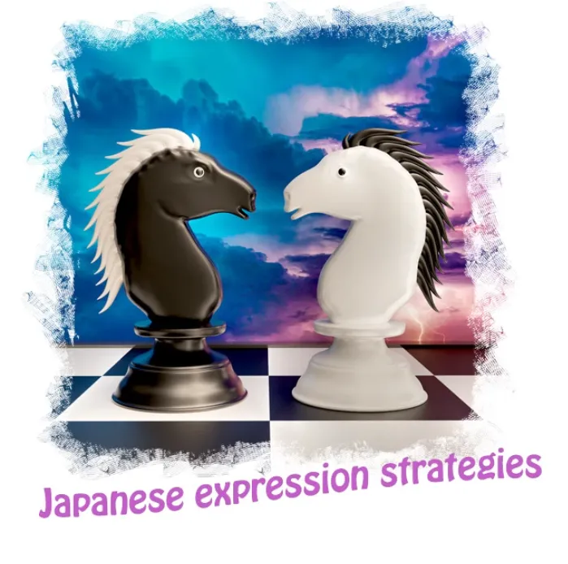
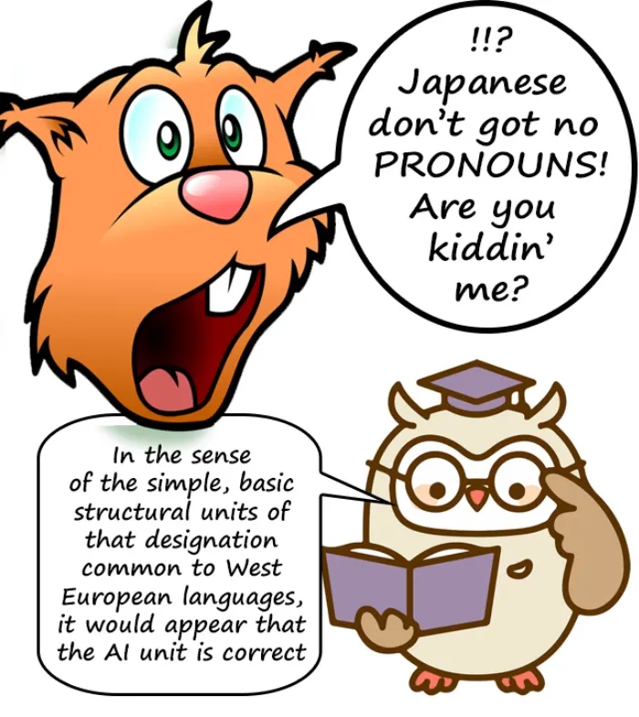
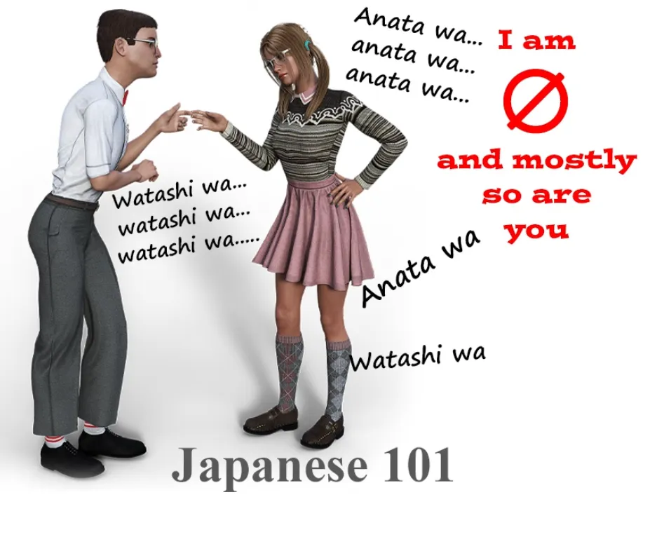
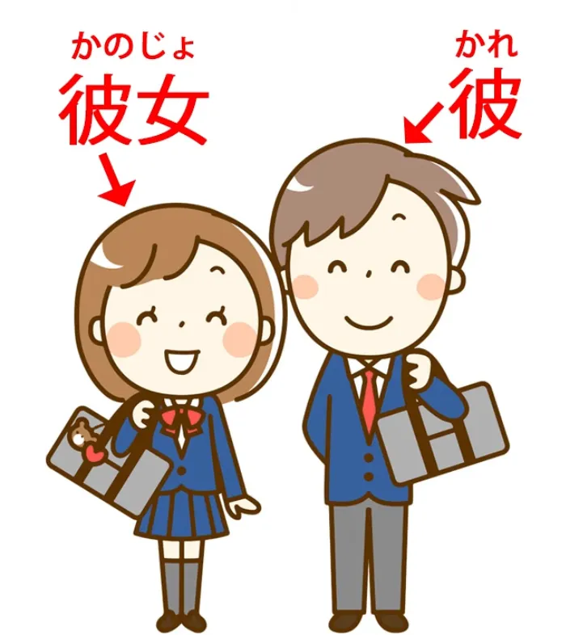
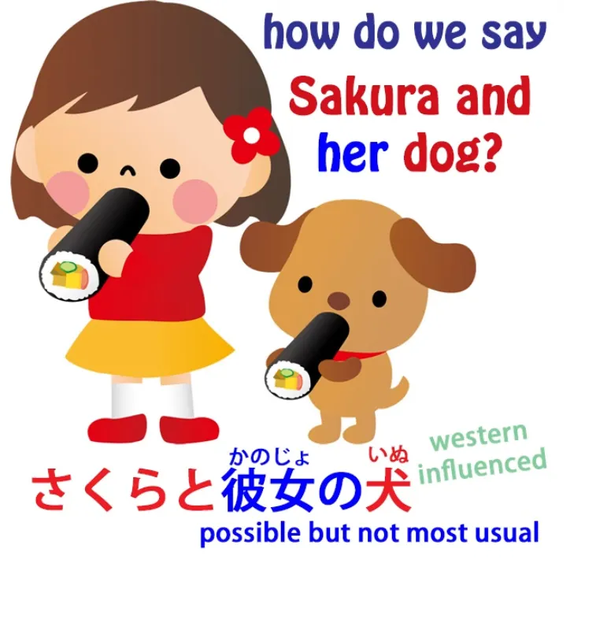

# **75. Bahasa Jepang BUKAN Bahasa Inggris: Perbedaan Strategi Ekspresi | Bahasa Jepang yang Sopan = Bahasa Jepang yang Kasar**

[**Bahasa Jepang BUKAN Bahasa Inggris: Perbedaan Strategi Ekspresi | Bahasa Jepang yang Sopan = Bahasa Jepang yang Kasar | Pelajaran 75**](https://www.youtube.com/watch?v=UCmnwgCc54A&amp;list;=PLg9uYxuZf8x_A-vcqqyOFZu06WlhnypWj)

こんにちは。

Hari ini kita akan membahas strategi ekspresi dalam bahasa Jepang yang sangat berbeda dari padanan bahasa Inggrisnya sehingga dapat menimbulkan kesulitan besar begitu kita memasuki dunia nyata bahasa Jepang.  Dan kesulitan ini diperparah oleh cara pengajaran bahasa Jepang dalam buku teks dan situs web konvensional serta seluruh <code>英本語</code> model bahasa Jepang, yang pada dasarnya mengajarkan bahasa Jepang dengan berpura-pura bahwa bahasa tersebut jauh lebih mirip bahasa Inggris daripada yang sebenarnya dan <code>dumbing down</code> mengubah ungkapan-ungkapan bahasa Jepang menjadi padanan sepert英本語.

Jadi, mari kita mulai dengan salah satu hal yang paling menyulitkan karena hal ini sangat mendasar dalam bahasa Inggris namun tidak ada dalam bahasa Jepang.

Yaitu, kata ganti. Dalam bahasa Inggris, kita tidak bisa melewati kalimat yang cukup rumit tanpa menggunakan kata ganti seperti <code>it</code>. Jika kita berbicara tentang objek apa pun, mulai dari galaksi Andromeda hingga serangga, bahkan paragraf yang cukup rumit tentang hal itu akan berisi <code>it</code> berulang-ulang.

Dan ini bukanlah cara kerja bahasa Jepang. Sebenarnya, saya akan mengatakan sesuatu yang mungkin terdengar terlalu radikal. Saya akan mengatakan bahwa bahasa Jepang sama sekali tidak memiliki kata ganti sederhana, tidak dalam arti yang dipahami dalam bahasa Inggris dan bahasa-bahasa Eropa lainnya. Sekarang, itu mungkin terdengar agak ekstrem, tapi izinkan saya menjelaskan maksud saya.

## Kata Ganti <code>it</code>, <code>I</code> dan <code>you</code> dalam bahasa Jepang

Pertama-tama, mari kita ambil kata ganti yang paling dasar, <code>it</code>. Tidak ada kata yang setara dalam bahasa Jepang untuk <code>it</code>. Di mana pun dalam bahasa Jepang, Anda tidak akan menemukan apa pun yang sesuai dengan <code>it</code> kecuali nol.

Satu-satunya cara untuk mengekspresikan apa yang kita maksud ketika kita hanya mengatakan <code>it</code> dalam bahasa Inggris adalah dengan tidak mengatakan apa-apa atau tidak menulis apa-apa: menggunakan subjek tak terlihat.

Sekarang, Anda mungkin berkata bahwa meskipun kita menerima hal ini, pasti sebenarnya ada kata ganti. Lagipula, kebanyakan buku teks memulai dengan kata ganti <code>私</code>. Hampir setiap kalimat dasar dalam buku teks dasar adalah <code>私 this, 私 that, 私 the other</code>.

Dan yang tidak menggunakan kata ganti tersebut adalah <code>あなた this, あなた that, and あなた the other</code>. Jadi, bukankah bahasa Jepang setidaknya memiliki kata ganti dasar <code>you</code> dan <code>I</code>? Dan jawabannya adalah <code>No, not in the European sense.</code>

Dalam bahasa-bahasa Eropa, selalu ada satu kata ganti dasar dan sederhana yang berarti <code>I</code>. Itu adalah kata ganti ego: <code>I</code> dalam bahasa Inggris, <code>ich</code> dalam bahasa Jerman, <code>je</code> dalam bahasa Prancis, <code>yo</code> dalam bahasa Spanyol.

Tidak ada padanan untuk kata ganti ini dalam bahasa Jepang. Ada banyak cara untuk mengatakannya <code>I</code>: 私, 僕, 俺, あたい, わがはい.

Semua itu sebenarnya adalah cara tidak langsung untuk merujuk pada diri sendiri. Saat merujuk pada orang yang Anda ajak bicara, Anda bisa mengatakan <code>あなた</code>. Anda juga bisa mengatakan: お前, 手前, きさま, 君, dan berbagai hal lainnya.

Dengan kata lain, kata ganti orang pertama dasar ini sebenarnya tidak ada. Dan meskipun kita dapat mengidentifikasi <code>私</code> dan <code>あなた</code> sebagai yang paling dasar di antara semuanya, kata ganti ini tetap tidak sama dengan kata ganti orang Eropa.

Sebagian besar waktu kita tidak menggunakannya. Semua ini <code>私 this, 私 that, 私 the other</code> yang ada di buku teks itu sangat tidak alami. Kecuali jika kita mencoba menekankan suatu poin tertentu, kita tidak mengatakan hal ini.

Kata yang biasa digunakan untuk <code>I</code> adalah nol. Kata yang biasa digunakan untuk <code>you</code> adalah nol atau nama orang tersebut.

Tidak ada satu pun kata untuk <code>you</code> yang saya sebutkan di atas, termasuk <code>あなた</code>, tidak terlalu sering digunakan karena, antara lain, kata-kata tersebut tidak terlalu sopan. Dan ini adalah salah satu hal yang mencolok tentang buku teks yang menyebabkan kerusakan besar pada pemahaman dan penguasaan struktur bahasa Jepang oleh para pelajar dengan memaksa mereka untuk menempelkan partikel bantu -ます di akhir kata kerja dan membiarkan mereka percaya bahwa ini adalah bentuk dasar kata kerja, serta membiarkan mereka percaya bahwa kata sifat memerlukan kopula padahal sebenarnya tidak

(dan jika Anda ingin tahu lebih lanjut tentang kerusakan yang ditimbulkan oleh です / ます terhadap pemahaman dasar kita tentang bahasa ini jika kita mempelajarinya sebelum mempelajari dasar-dasar bahasa Jepang yang fundamental, saya telah membuat video tentang hal itu dan akan menyertakan tautannya di atas kepala saya dan di kolom Komentar di bawah) ([***Pelajaran 17***](https://www.youtube.com/watch?v=ymJWb31qWI8&amp;t;=0s)).

---

Buku teks melakukan hal ini, yang merupakan hal yang sangat merusak, karena jika Anda pergi ke Jepang dan tidak menggunakan です / ます kepada orang-orang seperti guru Anda, atasan Anda, atau orang asing yang Anda temui, mereka akan menganggap Anda tidak sopan.

Sekarang, ini benar adanya, tetapi tentu saja sebelum Anda menguasai dasar-dasar bahasa tersebut, Anda tidak akan berbicara kepada siapa pun, dan jika Anda melakukannya, itu akan sangat canggung sehingga hal terakhir yang akan mereka pikirkan adalah apakah Anda menambahkan です / ます di akhir kalimat Anda.

Namun, setelah merusak pembelajaran struktur dengan menggunakan です / ます, mereka kemudian melanjutkan dengan mengajarkan Anda untuk menyapa orang sebagai <code>あなた</code>, yang sebenarnya lebih kasar daripada tidak menggunakan

ですdan - ます. Jika Anda tidak menggunakan です / ます dan bahasa Jepang Anda cukup buruk, kebanyakan orang akan menganggap Anda seperti anak kecil Jepang yang belum benar-benar menguasai partikel-partikel tersebut. Jika Anda memanggil orang <code>あなた</code>, meskipun mereka akan memberi Anda sedikit kelonggaran karena Anda orang asing, mereka mungkin akan merasa sulit untuk tidak meringis.

Anda tidak menelepon guru Anda <code>あなた</code>, Anda tidak memanggil atasan Anda <code>あなた</code>, Anda tidak memanggil orang asing <code>あなた</code>, tetapi bahkan dengan teman-teman, kepada siapa Anda tidak perlu menggunakan &quot;です&quot; / &quot;ます&quot;, Anda juga tidak memanggil mereka

<code>あなた</code> juga.

Lalu mengapa buku teks, ketika mereka sebenarnya menguji pemahamanmu tentang struktur bahasa Jepang dengan memaksamu menggunakan &quot;です&quot; / &quot;ます&quot; terlalu dini, kemudian melanjutkan dengan mengajarkan sesuatu yang jauh lebih tidak sopan daripada tidak menggunakan &quot;です&quot; / &quot;ます&quot;?

---

Nah, alasannya adalah mereka siap mengorbankan apa pun demi menyusun bahasa Jepang seolah-olah itu bahasa Inggris. Dalam bahasa Inggris, Anda menggunakan kata ganti orang pertama tunggal yang sederhana dan netral <code>you</code> , sedangkan dalam bahasa Jepang tidak. Namun, mereka tampaknya menganggap Anda terlalu bodoh untuk memahami hal itu.

Mereka tampaknya beranggapan bahwa kecuali kalimat-kalimat bahasa Jepang disusun sedemikian rupa sehingga terdengar tidak alami tetapi terasa seperti kalimat bahasa Inggris bagi Anda,

dengan <code>私 this, 私 that, あなた this, あなた that</code>, Anda tidak akan bisa memahaminya.

Jadi, bahasa Jepang tidak memiliki <code>it</code> dan sebenarnya tidak memiliki <code>you</code> atau <code>I</code> dalam arti seperti yang dimiliki bahasa-bahasa Eropa. Bagaimana dengan <code>he</code> dan <code>she</code>? Setidaknya bahasa Jepang memiliki <code>彼</code> dan <code>彼女</code>, bukan?

Nah, <code>彼</code> dan <code>彼女</code> diperkenalkan ke dalam bahasa Jepang pada akhir zaman Edo dan awal zaman Meiji untuk menerjemahkan novel-novel Eropa abad ke-19 ke dalam bahasa Jepang. Itulah tujuan awalnya.

Sejak saat itu, kata-kata tersebut telah terintegrasi ke dalam bahasa dan kadang-kadang digunakan dalam percakapan sehari-hari, tetapi tidak se sering subjek tak terlihat digunakan. Untuk setiap satu kali penggunaan <code>彼女</code> atau <code>彼</code> digunakan untuk <code>he</code> atau <code>she</code>, setidaknya ada seratus kali ketika subjek tak terlihat digunakan dalam konteks tersebut.

Jadi, apa yang kita lakukan ketika, misalnya, kita ingin mengekspresikan kepemilikan? Misalkan kita ingin mengatakan <code>Sakura and her dog</code>. Nah, kita bisa mengatakan <code>さくらと彼女の犬</code>.

Itu adalah bahasa Jepang yang gramatikal, tetapi bukan bahasa Jepang yang umum. Cara umum untuk mengatakannya adalah <code>さくらとその犬</code>.

Dan kata ini <code>その</code> sangat penting di sini.

## その

Kita diajarkan sejak awal *([**Lesson 20**](https://www.youtube.com/watch?v=xLkY6whr7T4&amp;ab;_channel=OrganicJapanesewithCureDolly))*, bahwa artinya <code>that</code>, dalam arti <code>that dog</code>, <code>that hat</code>, <code>that country</code>, dan memang begitu, tetapi seperti yang telah kita pelajari sebelumnya, kata-kata dalam bahasa Jepang sangat jarang sesuai dengan bagian yang persis sama dari spektrum makna yang sesuai dengan padanan bahasa Inggrisnya.

Jika dalam bahasa Inggris kita mengatakan sesuatu seperti <code>that dog</code> atau <code>that tree</code> maksudnya adalah yang sedang kita bicarakan, yang terkait dengan topik saat ini. Namun dalam bahasa Jepang, hal ini jauh lebih luas dari itu.

Jadi, <code>さくらとその犬</code> berarti Sakura dan seekor anjing yang terkait dengannya, dengan kata lain, Sakura dan anjingnya. Dan kemampuan <code>その</code> untuk mengekspresikan hal-hal seperti kepemilikan dan keterkaitan ini melahirkan berbagai strategi. Namun, begitu kita memahami maknanya, strategi-strategi tersebut menjadi jauh lebih mudah dipahami.

Jadi, misalnya, kamus bahasa Jepang Sanseido yang sederhana mendefinisikan kata <code>立ち会う</code>, yang sebenarnya tidak dapat diterjemahkan ke dalam kata bahasa Inggris tertentu karena artinya adalah pergi ke tempat tertentu dalam kapasitas sebagai saksi atau bertindak dalam kapasitas sebagai saksi.

Definisi Sanseido adalah <code>証人としてその場に出る</code> : sebagai saksi, pergi ke tempat itu. Nah, itulah arti yang paling mendekati dalam bahasa Inggris tanpa membuatnya menjadi rumit.

Apa <code>that place</code> artinya di sini? Satu-satunya cara untuk menerjemahkannya dengan benar ke dalam bahasa Inggris adalah dengan mengatakan sesuatu seperti <code>as a witness, go to the place which is whatever place is involved at the time – that place, the place to which you go as a witness</code>.

Jadi hal ini membuka berbagai kemungkinan penggunaan <code>その</code> yang sebenarnya tidak memiliki padanan dalam bahasa Inggris. <code>その</code> adalah hal yang terkait, hal yang sedang dibicarakan saat itu, hal yang dimiliki oleh orang yang sedang kita bicarakan, atau apa pun, dan ini memberikan strategi yang pada dasarnya menggantikan kata ganti dalam bahasa Inggris.

Dan ada berbagai strategi lain yang menggantikan kata ganti.

Misalnya, kita pernah membahas sebelumnya tentang <code>くれる</code> dan <code>あげる</code>[[48]](./48-dealing-with-ambiguity-in-japanese.md), dan saya rasa kita sering mendapat kesan bahwa hal ini sangat berkaitan dengan rasa hubungan yang lebih personal.

Kita tidak hanya membicarakan apa yang dilakukan, tetapi apakah hal itu dilakukan sebagai bantuan bagi diri kita sendiri, apakah dilakukan sebagai bantuan bagi orang lain, dan hal-hal semacam itu.

Dan itu juga penting. Namun, hal itu juga menggantikan kata ganti. Jika kita mengatakan <code>教えてくれた</code>, yang kita maksudkan adalah <code>she taught me</code>.

Kita tahu bahwa orang lain yang melakukannya, karena bentuk <code>-てくれる</code> bentuknya hanya bisa merujuk pada sesuatu yang dilakukan oleh orang lain. Kita tahu bahwa mereka melakukannya kepada saya karena <code>くれる</code> berarti saya atau seseorang dalam lingkaran saya.

Jadi, kita bisa mengatakan <code>教えてくれた</code> . Tidak ada <code>she</code> dan tidak ada <code>me</code> dalam kalimat itu, tetapi bentuk kalimat tersebut memberi tahu kita apa yang akan disampaikan oleh kata ganti dalam bahasa Inggris.

Sekali lagi, jika kita mengatakan <code>殺してやる</code>, itu berarti <code>I&#x27;ll kill you</code>. Dan sekali lagi, <code>-てやる</code> yang memberi kita baik <code>you</code> dan <code>I</code>.

Dan secara umum, jika kita menggunakan kata kerja biasa yang tidak dalam bentuk lampau dan merujuk pada masa depan, penggerak defaultnya adalah <code>I</code>. Jika kita mengatakan <code>今帰る</code>, ini berarti <code>I&#x27;m going home now</code>.

Bagaimana kita tahu bahwa itu <code>I</code>? Nah, pertama-tama, <code>I</code> adalah default, dan kedua, kita memprediksi suatu tindakan yang ada dalam pikiran kita sendiri.

Kita tidak bisa memprediksi tindakan orang lain kecuali dalam keadaan khusus. Jadi, kecuali konteksnya menunjukkan sebaliknya, ini pasti <code>I</code>: <code>I&#x27;m going home now.</code>

Dan agak terkait dengan penggunaan <code>その</code>, kita memiliki penggunaan <code>ある</code>.

Dan cerita sering kali dimulai dengan <code>ある日</code>, dan orang-orang sering bertanya-tanya mengapa <code>ある日</code>. <code>ある</code> hanya berarti <code>being</code>.

Sekarang, seperti yang kita ketahui, setiap kata kerja atau klausa kata kerja dapat memodifikasi kata benda apa pun. Jadi mengapa <code>ある日</code>? <code>ある</code> hanya berarti <code>exist</code>. Jadi <code>ある日</code> berarti <code>existing day</code>.

Sekarang, ketika sebuah cerita dimulai dengan <code>ある日</code>, kita mengatakan <code>One day</code>. Jika kita mengatakan <code>ある国のある村に</code>, kita berarti <code>In a certain village, in a certain country</code> dan ini adalah pengaturan lain yang sangat umum untuk sebuah cerita. Namun, kita tidak mengatakan <code>a certain</code>, karena strategi ekspresi dalam bahasa Jepang berbeda dengan dalam bahasa Inggris.

---

Dalam bahasa Inggris kita mengatakan <code> a certain...</code> — dan apa yang kita maksud dengan itu?

Nah, yang kita maksud adalah tempatnya pasti. Kita tahu di mana letaknya, kita tahu apa itu, kita hanya tidak memberitahukannya kepada Anda. Yang, jika dipikir-pikir, merupakan cara penyampaian yang agak aneh. Satu-satunya alasan kita benar-benar mengatakan <code>a certain...</code> adalah karena kami ingin memperkenalkannya tanpa mengatakan apa pun tentangnya.

Dan bahasa Jepang, yang seringkali lebih logis daripada bahasa Inggris, melakukannya dengan cara yang paling logis. Ia tidak memberi tahu kita apa pun tentangnya kecuali fakta bahwa tempat itu ada. Dan jika hal itu tidak ada, maka tidak akan ada di sana, tidak akan ada yang bisa dibicarakan, jadi kami hanya mengatakan hal paling minimal yang bisa kami katakan, yaitu bahwa hal itu ada.

Tentu saja, hal itu mungkin bahkan tidak ada dalam kenyataan, tetapi hal itu ada dalam kaitannya dengan narasi, jadi hal itu ada:

<code>ある国のある村には...</code>

Dan sebagai tambahan, saya ingin membahas <code>ある日のこと</code> atau bahkan <code>ある国のこと</code>,

yang sekali lagi dapat memperkenalkan sebuah cerita.

## のこと

Mengapa kita mengatakan <code>のこと</code> di sini?

Nah, perlu diingat bahwa <code>こと/事</code> tidak hanya berarti situasi atau keadaan, tetapi juga merupakan semacam kerabat dari <code>こと/言</code> dari <code>言葉</code>.
::: info
Lihat Pelajaran 74 untuk ini.
:::
Sebuah <code>こと</code> adalah suatu hal, suatu keadaan, sesuatu yang tidak bisa Anda lihat atau sentuh begitu saja; Anda memerlukan cerita atau deskripsi verbal untuk mengungkapkannya.

Jadi, <code>ある日のこと</code> pada dasarnya berarti peristiwa pada hari tertentu. <code>ある村のこと</code> berarti peristiwa di sebuah desa tertentu. Dan kami mengatakan ini sebagai pengantar cerita. Kami mengatakan bahwa yang akan mengikuti adalah peristiwa pada suatu hari / peristiwa di sebuah desa tertentu. Dan karena kemiripannya dengan <code>言葉</code>, hal ini memiliki nuansa <code>the story of a certain village / the story of a certain day</code>.

Jadi, di sini kita memiliki beberapa strategi ekspresi yang sangat berbeda dari strategi bahasa Inggris, sulit dipahami sampai kita tahu apa artinya, dan sangat sulit dipahami ketika kita telah disesatkan untuk berpikir bahwa strategi ekspresi bahasa Jepang jauh lebih dekat dengan strategi bahasa Inggris daripada kenyataannya.

*Tautan dari komentar: [**Spektrum Makna yang diperkenalkan dalam video ini**](https://www.youtube.com/watch?v=CpiELpGR-VU), [**Bagaimana です・ます (desu/masu) merusak pemahaman struktural awal**](https://www.youtube.com/watch?v=ymJWb31qWI8&amp;t;=0s), [**Sono dan kata-kata sejenisnya (sono, sonna, sore, konna, kono, kore, dll.)**](https://www.youtube.com/watch?v=xLkY6whr7T4)*
