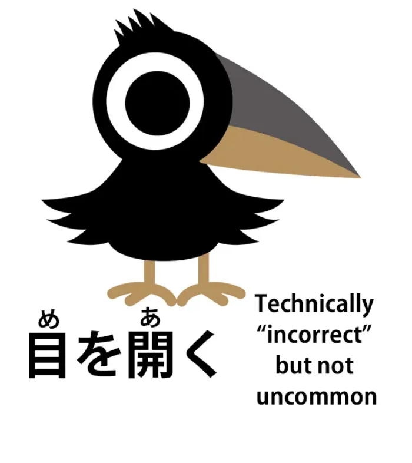
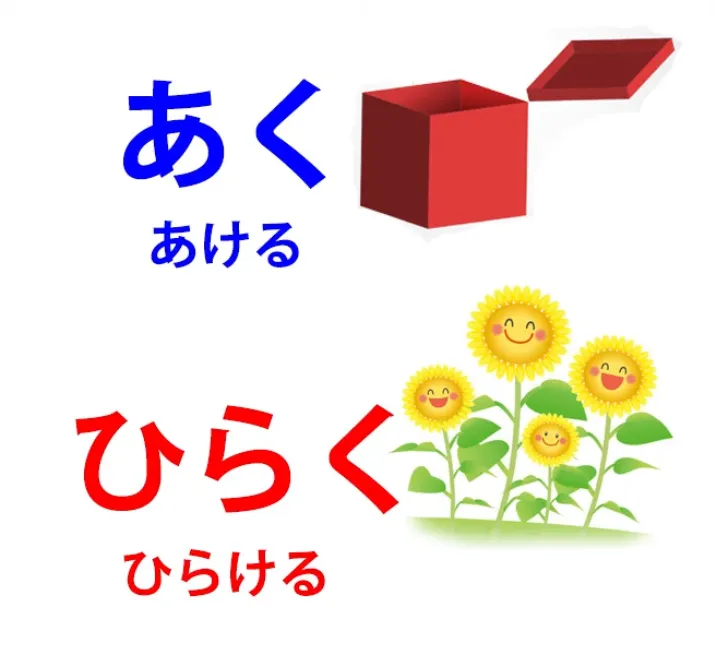
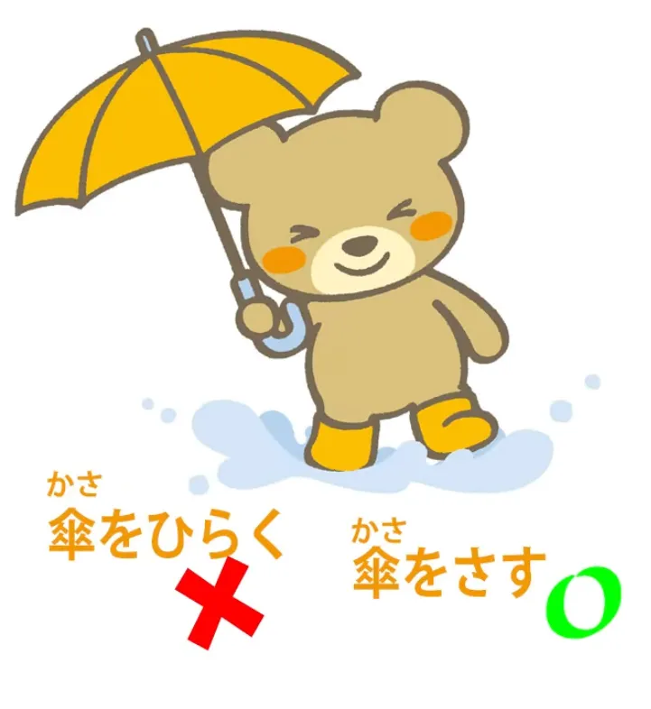
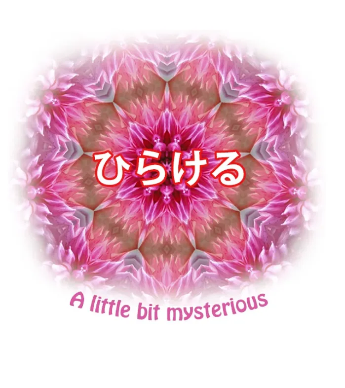
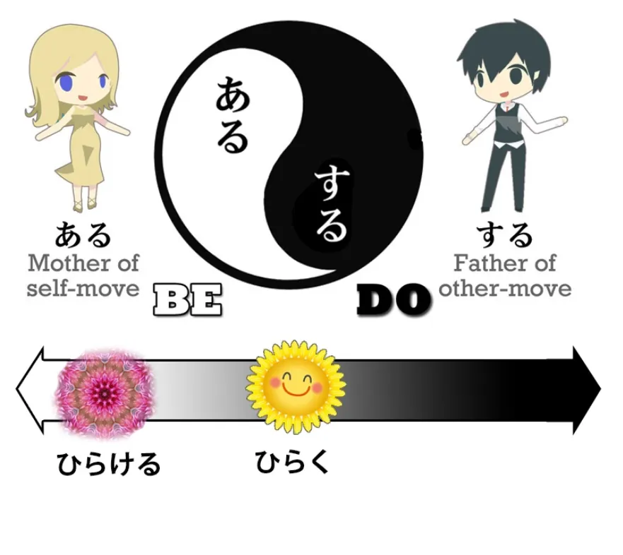
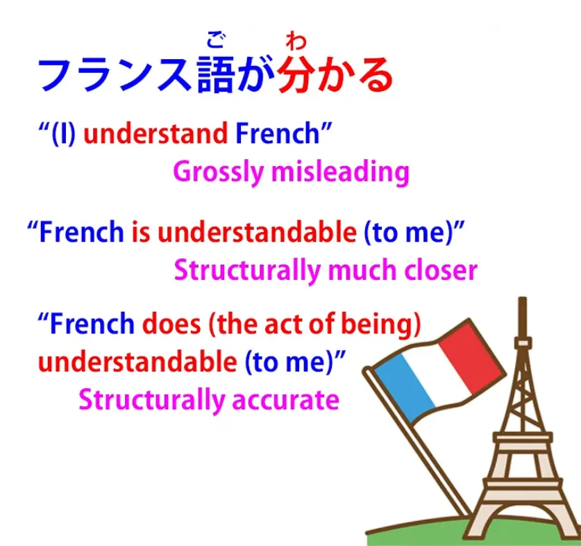
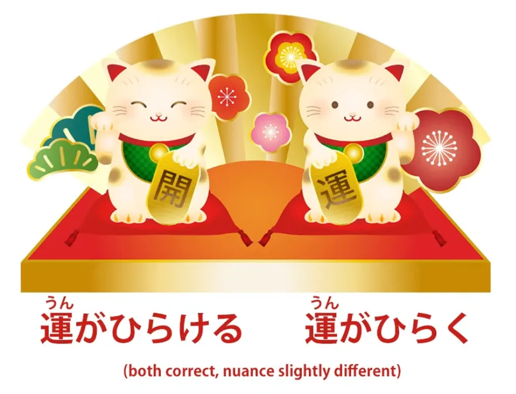

# **76. Pembukaan yang Tepat? | あく, あける, ひらく, ひらける, 開く, 開け** 

[**Pembukaan yang Tepat? aku, akeru, hiraku, hirakeru | あく、あける、ひらく、ひらける、 開く、開け | Pelajaran 76**](https://www.youtube.com/watch?v=QEInorgR6Rs&amp;list;=PLg9uYxuZf8x_A-vcqqyOFZu06WlhnypWj&amp;index;=78&amp;pp;=iAQB)

こんにちは。

Hari ini kita akan membahas sesuatu yang penting secara intrinsik, namun juga menyoroti beberapa nuansa bahasa Jepang yang sangat berguna untuk diketahui seiring kita memasuki tahap imersi yang lebih dalam. Jadi, yang akan kita bahas adalah empat cara berbeda untuk mengekspresikan sesuatu yang dalam bahasa Inggris semuanya ditutupi oleh satu kata <code>open</code>.

Nah, ini adalah <code>開く</code>, <code>開ける</code>, <code>開く</code>, <code>開ける</code>.　

::: info
Ini dibaca sebagai *あく, あける, ひらく, *dan* ひらける*, masing-masing, meskipun memiliki kanji dan okurigana yang sama. Dolly menjelaskan hal ini lebih lanjut di bagian akhir pelajaran.
:::

Sekarang, ketika kita melihat ini pada awalnya, tampaknya seperti dua pasangan gerakan sendiri/gerakan lain, bukan? Dan sampai batas tertentu memang demikian.

Namun, hal ini akan menggambarkan kehalusan konsep gerak diri/gerak orang lain dalam bahasa Jepang, berbeda dengan kontras yang jauh lebih teknis dan jelas antara transitif dan intransitif dalam bahasa Inggris dan bahasa-bahasa Barat lainnya.

Jadi, jika Anda belum familiar dengan konsep kata kerja self-move dan other-move (yang di Barat cenderung disebut kata kerja transitif dan intransitif), saya akan menyertakan tautan ke video saya tentang topik tersebut di atas dan di kolom Komentar di bawah.

Hal kedua yang kita perhatikan adalah bahwa ketika Anda menuliskannya dengan kanji, Anda sebenarnya tidak dapat melihat perbedaan antara <code>あく/あける</code> dan <code>ひらく/ひらける</code>. Hal ini sebagian disebabkan karena keduanya sebenarnya dapat saling dipertukarkan dalam banyak kasus dan secara keseluruhan, jika bukan kasus yang benar-benar membutuhkan <code>ひらく/ひらける</code>,  
orang pada umumnya akan membaca <code>あく/あける</code>.

Tetapi jika seorang penulis ingin menegaskan bahwa ia menggunakan <code>ひらく</code> untuk efek tertentu (dan kita akan melihat beberapa efek tersebut nanti), ia akan menuliskannya dalam huruf hiragana agar hal tersebut jelas.

Baiklah. Jadi, pertama-tama mari kita lihat dua yang teratas, <code>あく・あける</code>. <code>あく</code> adalah gerakan sendiri. <code>あくる</code> adalah gerakan orang lain. Keduanya berarti <code>open</code>. Jadi, <code>あく</code>: pintu terbuka, botol terbuka; <code>あける</code>: membuka pintu, membuka botol.

Setidaknya itulah teorinya.

Dalam praktiknya, kita sering mendengar orang Jepang mengatakan hal-hal seperti <code>目を開く</code> (membuka mata seseorang), yang secara teknis salah menurut para ahli tata bahasa karena <code>開く</code> adalah gerakan diri dan mereka menggunakannya dalam konteks gerakan orang lain: membuka mata seseorang.

Sekarang, saya agak menantang para ahli tata bahasa di sini dan saya akan memberi tahu Anda alasannya sebentar lagi, tetapi Anda sebaiknya tetap berpegang pada model tata bahasa yang sebenarnya karena hanya ada sejumlah contoh terbatas di mana orang Jepang memang menggunakan <code>開く</code> secara transitif (dan saya menggunakan kata <code>transitively</code> secara sengaja di sini – Anda akan tahu alasannya sebentar lagi) dan Anda tidak ingin menghafal mana saja contoh-contoh tersebut.

Jika Anda menggunakan <code>あける</code> sebagai versi gerakan lain – membuka mulut, membuka pintu, membuka apa pun – Anda tidak akan pernah salah. Itu selalu benar.

Jadi mengapa saya menantang pandangan resmi bahwa <code>あける</code> seharusnya bersifat intransitif? Nah, saya memiliki sedikit perasaan di sini bahwa ahli tata bahasa Jepang sedikit dipengaruhi oleh pemikiran Barat dan oleh konsep-konsep Barat mengenai transitivitas dan intransitivitas.

Ketika orang Jepang mengatakan <code>目を開く</code>, saya percaya insting atau perasaan di baliknya adalah bahwa membuka mata lebih condong ke sisi &quot;ある&quot; pada peta &quot;ある・する&quot; yang kita bahas dalam pelajaran transitivitas saya.

Dengan kata lain, membuka mata lebih dekat dengan gerakan diri sendiri, lebih dekat dengan &quot;menjadi&quot; daripada &quot;melakukan&quot;, berbeda dengan membuka pintu, membuka botol, atau objek eksternal lainnya.

Nah, itu pendapat saya mengenai hal ini, dan Anda boleh mengabaikannya jika mau, tetapi kita akan membahas lebih banyak lagi hal-hal rumit seperti ini yang tidak diperdebatkan oleh siapa pun seiring berjalannya waktu.

## 開く (ひらく &amp; あく)

Jadi sekarang mari kita lihat perbedaan antara <code>あく</code> dan <code>ひらく</code>.

Keduanya berarti <code>open</code>. <code>あく</code> secara resmi adalah langkah sendiri, meskipun kita dapat melihat bahwa ada sedikit kelonggaran di sini; <code>ひらく</code> secara formal berarti baik gerakan sendiri maupun gerakan orang lain.

Perbedaan di antara keduanya tidak ada hubungannya dengan gerakan sendiri atau gerakan orang lain. Hal ini berkaitan dengan jenis pembukaan yang sedang kita bicarakan.

Jadi, jika kita berbicara tentang membuka botol, melepas tutup kotak, atau hal-hal semacam itu, itu pasti <code>あける</code>. Di sisi lain, jika kita berbicara tentang bunga yang mekar, itu pasti <code>ひらく</code>.

Jadi sesuatu yang membentang, terbuka, adalah <code>ひらく</code>. Sesuatu yang sekadar menjadi terbuka alih-alih tertutup adalah <code>あく・あける</code>.

Dan jika Anda menyukai lagu anak-anak Jepang, Anda mungkin pernah mendengar lagu permainan tangan yang berbunyi 「むすんでひらいててをうってむすんで」.

<code>むすんで</code> adalah <code>結ぶ</code>, yang berarti <code>gathered or joined</code> dan itu merujuk pada tangan yang tertutup. <code>開いて</code> merujuk pada tangan yang terbuka lebar seperti bunga yang mekar.

Sekarang, ada berbagai konteks di mana kedua istilah ini dapat digunakan secara bergantian, tetapi bahkan ketika dapat digunakan bergantian, keduanya menekankan aspek yang berbeda.

Jadi, misalnya, pintu Prancis dapat <code>あく</code> (terbuka) atau <code>ひらく</code> (terbuka lebar). Mata umumnya <code>あく</code>, tetapi dapat dikatakan <code>ひらく</code>, dan ketika kita menggunakan <code>ひらく</code> sebagai gantinya <code>あく</code> dalam kasus-kasus ini, hal itu mirip seperti dalam film ketika Anda memperbesar mata seseorang yang perlahan terbuka atau pintu yang perlahan terbuka lebar.

Ada kesan yang lebih nyata tentang proses pembukaan itu sendiri, tentang proses membentang. Jadi, hal ini memberikan nuansa halus yang tidak kita miliki dalam bahasa Inggris, yang dapat disisipkan ke dalam ucapan atau tulisan hanya dengan memilih <code>ひらく</code> daripada <code>あく</code>.

Sekarang, ketika kita membahas penggunaan yang lebih metaforis atau abstrak, perbedaan ini kembali menjadi penting. Misalnya, kita bisa mengatakan <code>店をあらく</code> atau <code>店をひらく</code> dan keduanya berarti <code>open a shop</code>, tetapi <code>店を 開ける</code> menunjukkan sekadar membuka toko di pagi hari untuk beroperasi atau membuka kembali setelah istirahat makan siang atau semacamnya, secara harfiah sekadar membuka toko, hanya membuka pintu agar pelanggan bisa masuk.

<code>店をひらく</code> menyiratkan membuka toko untuk pertama kalinya, membuka untuk umum. Dengan kata lain, mekar seperti bunga, berubah dari sesuatu yang tertutup menjadi sesuatu yang terbuka.

Dan sekadar catatan tambahan di sini: dengan payung, yang juga mekar dan Anda mungkin tergoda untuk mengatakan <code>ひらく</code>, kita biasanya tidak menggunakan itu, umumnya <code>さす</code> untuk membuka payung.

## 開ける

Sekarang, bagaimana dengan <code>ひらける</code>?

Para ahli tata bahasa Jepang, atau setidaknya banyak di antara mereka, sebenarnya menetapkan <code>ひらける</code> sebagai versi gerakan diri dari <code>ひらく</code>.

Namun, hal itu sebenarnya tidak masuk akal, karena <code>ひらく</code> sendiri merupakan baik gerakan sendiri maupun gerakan orang lain. Jadi, apa yang sebenarnya terjadi di sini? Ini cukup menarik.

<code>ひらく</code>, yang bisa berupa gerakan sendiri atau gerakan ke lawan, berada lebih jauh ke <code>する</code> sisi peta daripada <code>ひらける</code>. Dan apa yang saya maksud dengan itu?

Nah, beberapa waktu lalu saya membuat video tentang apa yang saya sebut bahasa Jepang yang tidak dapat diterjemahkan. Dan ini tentang kata kerja dalam bahasa Jepang yang benar-benar tidak dapat direproduksi dalam bahasa Inggris karena kata-kata tersebut mengekspresikan keadaan, bukan tindakan, dengan cara yang tidak ada dalam bahasa Inggris.

Contoh yang sangat sederhana dan umum adalah <code>分かる</code>, yang sering diterjemahkan oleh kamus dan buku teks bahasa Inggris sebagai <code>understand</code>.

Tentu saja itu tidak berarti <code>understand</code>, tetapi jika Anda mendapatkan terjemahan yang lebih baik, itu cenderung menjadi <code>be understandable</code> atau <code>be clear</code>, dan itu jauh lebih mendekati arti sebenarnya dari <code>分かる</code> sebenarnya, tetapi arti sebenarnya tidak dapat diterjemahkan ke dalam bahasa Inggris karena sebenarnya itu bukan kata sifat seperti <code>clear</code> atau <code>understandable</code>. Itu adalah kata kerja.

Jadi yang sebenarnya kita katakan adalah <code>do understandable / do the act of understandability</code> dan ini tidak memiliki terjemahan dalam bahasa Inggris. Ada banyak kata kerja statif seperti ini dan saya telah membahasnya dalam video.

Dan <code>ひらける</code> sebenarnya lebih mendekati salah satu dari kata kerja ini. <code>濡れる</code>, yang sering diterjemahkan sebagai <code>become wet</code>, tetapi sebenarnya tidak berarti <code>become wet</code> – Kata itu bisa mencakup arti tersebut tetapi menyiratkan <code>existing in the state of being wet</code>.

Mungkin berarti <code>become wet and then continue to be wet</code> atau bisa juga hanya berarti <code>be wet</code>, tetapi tentu saja bukan <code>be wet</code>, sebenarnya itu <code>do wet</code>, yang tidak dapat diterjemahkan ke dalam bahasa Inggris.

Hal yang sama berlaku untuk <code>ひらける</code>. Jadi kata itu digunakan dalam kasus seperti, misalnya, kita sering mengatakan <code>運が開ける</code>, yang berarti <code>one&#x27;s luck opens</code>.

Sekarang, kita bisa mengatakan <code>運が開く</code>, dan itu berarti <code>one&#x27;s luck unfolds like a flower, becomes open</code>, tetapi <code>ひらける</code> menunjukkan tidak hanya terungkap tetapi juga terus ada dalam keadaan terungkap tersebut.

Alasan kita cenderung mengatakan <code>店をひらく</code> adalah sebagian karena ini lebih merupakan tindakan orang lain daripada <code>ひらける</code> dan kita sebenarnya melakukannya pada toko tersebut, kita membukanya; juga karena penekanan ada pada tindakan membuka toko ini.

<code>運がひらける</code>: penekanan pada pembukaan keberuntungan itu sendiri kurang penting dibandingkan fakta bahwa hal itu akan berubah. Mulai saat itu, kita akan beruntung, sedangkan saat ini kita tidak begitu beruntung.

Jadi, menurut saya ini memberi kita gambaran tidak hanya tentang empat kata untuk &quot;membuka&quot; dalam bahasa Jepang dan cara kerjanya, serta bagaimana mereka saling berinteraksi. Seringkali kata-kata tersebut tumpang tindih satu sama lain dan tidak terlalu masalah mana yang Anda gunakan.

Dalam beberapa kasus, hal ini benar-benar penting, baik untuk apa yang Anda katakan secara spesifik maupun untuk nuansa, implikasi, dan suasana yang ingin Anda bangun dengan mengatakannya.

*Tautan di deskripsi: [**Self-move/other-move the aru-suru axis**](https://www.youtube.com/watch?v=ELk1dqaEmyk&amp;t;=0s), [**Bahasa Jepang yang tidak dapat diterjemahkan**](https://www.youtube.com/watch?v=wLrK_YxdPoM), [**Lagu tangan むすなでひらいて**](https://www.youtube.com/watch?v=BSZC0WBldv4)*
