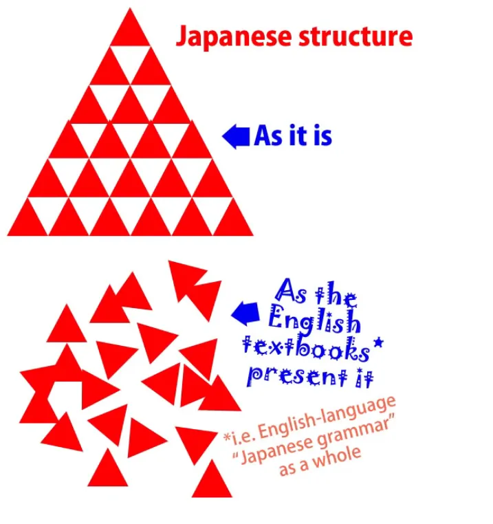
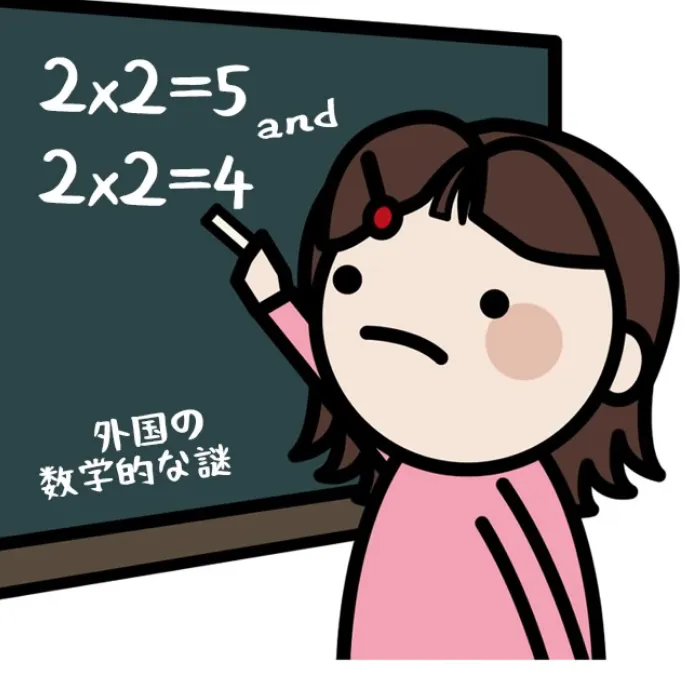
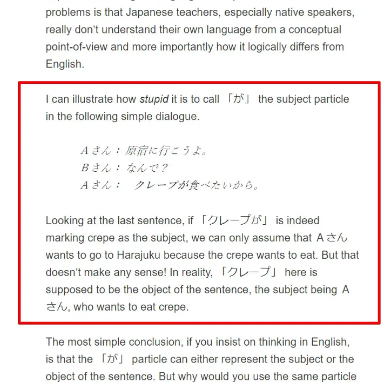

# **77. Struktur Bahasa Jepang Asli vs Tae Kim: Ulasan Struktur Tata Bahasa Jepang Karya Tae Kim** 

[**Struktur Bahasa Jepang yang Sesungguhnya vs Tae Kim - Ulasan Struktur Tata Bahasa Jepang Tae Kim | Pelajaran 77**](https://www.youtube.com/watch?v=-JuHi-yKGFc&amp;list;=PLg9uYxuZf8x_A-vcqqyOFZu06WlhnypWj&amp;index;=80&amp;ab;_channel=OrganicJapanesewithCureDolly)

こんにちは。

Video hari ini adalah video pertama yang benar-benar membuat saya ragu dan berpikir dua kali untuk membuatnya, tetapi saya memutuskan untuk tetap melanjutkannya. Ini adalah video yang menurut saya akan memberikan pemahaman lebih dalam bagi kita semua mengenai struktur bahasa Jepang. Dan video ini akan melakukannya dengan mengambil sudut pandang yang sedikit berbeda serta membandingkannya dengan hal yang berbeda dari yang biasanya saya bandingkan.

Biasanya, saya membandingkan bahasa Jepang dengan model tata bahasa konvensional <code>Eihongo</code> model tata bahasa Jepang konvensional.

Dan beberapa orang sebenarnya telah mengkritik saya karena terlalu sering mengkritik model-model tersebut, karena terus-menerus menyoroti kelemahan model-model tersebut daripada sekadar menjelaskan apa yang perlu saya jelaskan. Dan saya melakukan ini karena suatu alasan, dan alasannya adalah ini: tata bahasa Eihongo/Jepang Barat konvensional sebenarnya tidak berubah sejak ratusan tahun yang lalu, ketika orang-orang Barat mulai memaksakan tata bahasa Eropa klasik pada bahasa Jepang dalam upaya untuk menjelaskannya kepada orang-orang Barat lainnya.

Dan penjelasan-penjelasan ini diabadikan di tempat-tempat paling bergengsi. Mereka diajarkan di universitas oleh orang-orang dengan deretan gelar di belakang nama mereka. Mereka diajarkan di semua buku teks standar dan kemudian disebarkan ke semua orang yang memiliki situs web atau saluran pembelajaran bahasa Jepang.

Dan karena hal ini, karena prestise dan kemana-mana-nya model-model ini, ketika orang mendengar model lain, mereka sangat mungkin bertanya-tanya bagaimana mereka bisa menyatukan keduanya. Model lama <code>must</code> pasti benar karena sangat bergengsi, dan model baru juga terdengar benar, jadi bagaimana kita menyatukannya, bagaimana kita menyelaraskannya? Dan jawabannya tentu saja bahwa kita sebenarnya tidak bisa menyelaraskannya.

Jika 2 ditambah 2 sama dengan 4, maka tidak mungkin juga sama dengan 5.

Dan penting untuk menyoroti hal ini karena orang-orang akan mencoba menyatukannya jika mereka tidak menyadari hal itu, dan hal itu akan membawa kita ke berbagai macam kekacauan logis.

Sekarang, Tae Kim-sensei, yang akan kita bahas hari ini, cukup cerdas dan berani untuk melihat kelemahan mendasar dalam model-model konvensional Barat dan Jepang. Ia melihat bahwa model-model tersebut penuh dengan kontradiksi, ketidakkonsistenan, dan ketidaklogisan, dan ia berusaha menciptakan model-model yang lebih konsisten dan lebih logis. Masalahnya adalah bahwa di bidang-bidang yang paling penting, pada dasarnya yang ia lakukan adalah mempertahankan bagian-bagian yang salah dan mencoba menyatukan bagian-bagian yang benar dengan bagian-bagian tersebut.

Jadi, kita akhirnya mendapatkan sesuatu yang dalam banyak hal lebih buruk daripada model-model Eihongo asli. Sekarang, saya ingin menegaskan bahwa saya tidak bermaksud melakukan <code>hit job</code> terhadap Tae Kim-sensei. Saya sangat menghormatinya dan saya mengakui bahwa dia adalah satu-satunya orang (selain Jay Rubin) yang menyadari adanya masalah dengan bahasa Jepang Eihongo konvensional dan memiliki keberanian untuk mencoba melakukan sesuatu tentang hal itu.

::: info
Jay Rubin tampaknya menjadi dasar penjelasan Dolly.
:::
Orang-orang yang menyadari masalah dan berusaha menyelesaikannya lah yang memajukan pengetahuan.

Dan proses memajukan pengetahuan ini dipenuhi dengan eksperimen yang tidak berhasil dan model yang pada akhirnya tidak lolos uji. Itu tidak membuat mereka bodoh. Mereka adalah bagian dari jalan pengetahuan.

## Tae Kim

Tae Kim-sensei memiliki banyak informasi online dan banyak dari apa yang dia katakan berguna. Area di mana kita harus membantah modelnya pada dasarnya ada tiga, dan sayangnya ketiga hal ini begitu dekat dengan inti struktur bahasa sehingga mereka memang menaungi segala hal lainnya, karena memiliki konsekuensi logis.

Jadi, ketiga hal tersebut pada dasarnya adalah:  
partikel &quot;が&quot;, yang merupakan tulang punggung mutlak struktur bahasa Jepang,  
kopula <code>だ</code>, yang esensial bagi semua struktur A-is-B non-adjektival, dan mitos konjugasi bahasa Jepang[[10]](./10-helper-verbs-the-potential-helper-verb.md).

Jadi, seperti yang Anda lihat, ini adalah trio yang cukup tangguh yang benar-benar membayangi segalanya. Namun, jika kita cukup menyadari masalahnya, masih mungkin untuk menggunakan setidaknya sebagian dari karya Tae Kim.

Dan pendekatannya terhadap imersi itu sendiri sebenarnya lebih dekat dengan apa yang saya yakini daripada hal lain yang pernah saya lihat. Jadi, mari kita lihat ketiga masalah tersebut. Yang pertama adalah partikel &quot;が&quot;.

## Partikel &quot;が&quot;

Sekarang, partikel &quot;が&quot;, seperti yang telah saya jelaskan pada berbagai kesempatan sebelumnya, adalah inti mutlak dari bahasa Jepang[[1]](./1-the-basic-types-of-sentences.md).

Anda tidak bisa memiliki kalimat tanpa partikel が, meskipun Anda tidak selalu bisa melihatnya. Terkadang partikel ini hanya hadir sebagai entitas logis. Namun, partikel ini selalu ada, dan jika kita tidak memilikinya, kita tidak memiliki kalimat. Sesederhana itu.

---

Fungsi partikel &quot;が&quot; adalah menandai subjek kalimat, yaitu hal yang sedang kita bicarakan. Kita bisa mengatakan <code>A is B</code> atau <code>A does B</code>. Apa yang dimaksud dengan &quot;A-car&quot; adalah subjek kalimat, yaitu pelaku atau pelaku tindakan dalam kalimat tersebut.

Partikel &quot;が&quot; menandai hal ini. Partikel ini tidak pernah menandai hal lain. Namun, bahasa Jepang konvensional membuat kekacauan dalam hal ini dengan salah menafsirkan beberapa kalimat Jepang hingga harus mengatakan bahwa &quot;が&quot; hanya kadang-kadang menandai subjek kalimat; di lain waktu, partikel ini menandai objek.  
Sekarang, ini adalah omong kosong dan saya telah membuktikan bahwa ini omong kosong.

が が tidak pernah menandai apa pun selain subjek. Tae Kim mencoba menyelesaikan masalah ini dengan mengatakan bahwa  tidak menandai subjek dan bahkan sampai mengatakan bahwa tidak ada yang namanya subjek dalam bahasa Jepang dan mengatakan bahwa ada subjek hanyalah memaksakan konsep-konsep Eropa pada bahasa tersebut.

Kenyataannya, setiap bahasa manusia memiliki subjek, yang kita sebut sebagai &quot;A-mobil&quot;, dan predikat, yang kita sebut sebagai &quot;B-engine&quot;. Yang kami maksudkan ketika mengatakan ini adalah bahwa setiap bahasa manusia dapat mengatakan sesuatu tentang sesuatu. Bahasa dapat mengambil suatu hal tertentu dan mengatakan hal tertentu tentangnya.

Hal tertentu yang diambilnya disebut <code>subject</code>. Hal tertentu yang dikatakannya tentang hal tersebut adalah predikat *(=pada dasarnya segala sesuatu kecuali subjek)*. Sesederhana itu.

Jika kita tidak memiliki subjek dan predikat, kita tidak memiliki bahasa dalam arti yang sesungguhnya. Yang bisa kita lakukan, jika kita tidak bisa mengatakan sesuatu yang spesifik tentang sesuatu yang spesifik, hanyalah mengeluarkan suara yang mengekspresikan bahwa kita bahagia, sedih, marah, atau takut, sama seperti yang dilakukan hewan. Tanpa subjek dan predikat, tidak ada bahasa.

Sesederhana itu. Bahasa-bahasa yang berbeda mungkin mengolahnya dengan cara yang sangat berbeda, tetapi konsep-konsep tersebut harus ada.

---

Sekarang, apa yang membuat Tae Kim-sensei menyatakan bahwa bahasa Jepang begitu berbeda dari bahasa manusia mana pun sehingga tidak memiliki subjek? Nah, ironisnya, hal itu disebabkan oleh fakta bahwa ia tidak bisa lepas dari pendekatan tata bahasa Eihongo yang terus-menerus memaksakan struktur bahasa Inggris ke dalam bahasa Jepang. Itu karena mereka tidak dapat membayangkan (dan tampaknya Tae Kim-sensei juga tidak dapat membayangkannya) bahwa bahasa Jepang dapat menghilangkan ego dari inti kalimat subjektif.

Jadi, contoh yang ia gunakan untuk <code>prove</code> menunjukkan bahwa bahasa Jepang tidak memiliki subjek adalah frasa <code>クレープが食べたい</code>, yang tentu saja di semua buku teks diterjemahkan sebagai <code>I want to eat crepes</code>.

::: info
Penjelasan Tae Kim-sensei.
:::
Dan, seperti biasa dalam bahasa Inggris, subjek yang mengalami subjektivitas, yaitu ego, ditempatkan di tengah.

Itulah subjeknya, itulah pelakunya: <code>I want to eat crepes.</code> Dan tentu saja crepes ditandai oleh &quot;が&quot;, dan mereka bukan subjek, bukan? Jadi &quot;が&quot; tidak menandai subjek. Dalam hal ini, Tae Kim-sensei dan bahasa Jepang konvensional (Eihongo) sependapat.

Bahasa Jepang konvensional (Eihongo) menjelaskannya dengan mengatakan bahwa &quot;が&quot; hanya kadang-kadang menandai subjek. Tae Kim-sensei menjelaskannya dengan mengatakan bahwa tidak ada subjek sama sekali dalam bahasa tersebut. Namun, alasan sederhana di balik kedua pernyataan ini adalah ketidakmampuan total untuk mempertimbangkan fakta bahwa bahasa Jepang mungkin menggunakan ekspresi yang berbeda dari bahasa Inggris dan bahwa mungkin saja untuk menghilangkan ego dari pusat pernyataan tentang subjektivitas.

Nah, hal yang aneh tentang ini adalah kita bahkan tidak perlu melihat sejauh bahasa Jepang untuk tahu bahwa hal ini terjadi sepanjang waktu. Hal ini terjadi dalam bahasa Spanyol. <code>Me gusta el Tequila</code> tidak mengatakan <code>I like Tequila</code>, meskipun semua buku teks akan mengatakan demikian.

Yang dimaksud adalah <code>Tequila does pleasing to me</code>.

Sekarang, ini mungkin bukan cara bahasa Inggris ingin mengatakannya, tetapi itulah cara bahasa Spanyol mengatakannya. <code>クレープが食べたい</code> berarti <code>Crepes are eat want-inducing (to me)</code>.

Sekali lagi, ini mungkin bukan cara bahasa Inggris mengatakannya, tetapi inilah cara bahasa Jepang mengatakannya. Partikel &quot;が&quot; melakukan apa yang selalu dilakukannya. Partikel ini menandai subjek, pelaku, atau A-car, dari kalimat tersebut.

Hanya saja, subjek, pelaku, atau A-car, dari kalimat dalam bahasa Jepang tidak sama dengan yang akan digunakan jika orang Inggris mencoba mengekspresikan perasaan yang sama.

Subjek kalimatnya adalah crepes. Crepes-lah yang membuat si penikmat ingin memakannya. Dan jika kita memahami hal ini, kita tidak perlu mengatakan bahwa &quot;が&quot; menandai subjek hanya pada beberapa kesempatan.

Kita dapat melihat bahwa &quot;が&quot; selalu menandai subjek. Dan kita tidak perlu mulai mengatakan bahwa tidak ada yang namanya subjek dalam bahasa Jepang.

Karena satu-satunya bahasa di mana tidak ada yang namanya subjek adalah <code>wanwan</code> dan <code>nyan-nyan</code> bahasa.
::: info
Karena saya tidak dapat menemukan apa pun tentang mereka, saya cukup yakin itu adalah lelucon (￣□￣」)
:::
Bahasa manusia harus memiliki subjek dan predikat atau ia berhenti menjadi bahasa.

## Perangkap Metafisik

Sekarang, beberapa dari kalian mungkin bertanya, bagaimana saya bisa mengatakan bahwa model saya adalah kebenaran?

::: info
Dan ya, Linguistik memang merupakan bidang ilmu pengetahuan juga.
:::
Bahwa seluruh tata bahasa Jepang konvensional tidak benar dan Tae Kim-sensei, yang saya akui sebagai sosok yang sangat cerdas, juga menghasilkan model-model yang tidak benar?

Dan jawabannya adalah, saya sama sekali tidak mengatakan hal itu.

---

Tidak ada yang namanya kebenaran dalam struktur bahasa atau linguistik, sama seperti tidak ada yang namanya kebenaran dalam ilmu pengetahuan. Manusia memiliki pikiran metafisik. Mereka menginginkan narasi dan mereka menginginkan kebenaran serta kebohongan.

Keduanya diwarisi dari intuisi metafisik yang dalam dan kuno. Dan saya tidak mengatakan apa pun di sini tentang apakah intuisi-intuisi itu benar atau salah. Yang saya katakan hanyalah, jika intuisi-intuisi itu benar, baik sains maupun linguistik bukanlah tempat untuk mencarinya.

Jika kita memiliki model yang tidak konsisten dan harus terus-menerus dipaksakan dengan aturan dan pengecualian agar berfungsi, atau kita memiliki model yang terlalu kabur untuk berguna, dan kemudian kita memiliki model yang presisi, konsisten, dan selalu berfungsi, kita cenderung mengatakan bahwa model ketiga itulah yang benar. Namun sebenarnya ini adalah terjebak dalam perangkap metafisika. Saya mungkin sesekali berbicara seperti itu sendiri, tetapi mari kita perjelas: ini hanyalah trik bahasa.

Jika dibandingkan dengan model yang tidak konsisten atau model yang samar, model yang konsisten dan dapat memprediksi secara akurat bukanlah <code>truer</code>, tetapi lebih berguna. Sains tidak memberi tahu kita kebenaran. Sains memprediksi berbagai hal. Sains memberi tahu kita bahwa ketika kita melakukan A dan B, hasilnya akan menjadi C.

Ini tidak ada hubungannya dengan kebenaran, metafisika, narasi, atau hal lain apa pun; ini hanyalah metode prediksi. Dan jika kita dapat memprediksi hal-hal, kita dapat melakukan hal-hal berguna dengan prediksi tersebut. Hal ini persis sama dengan bahasa.

Jadi, model konvensional cukup tidak konsisten sehingga dalam banyak kasus tidak sesuai untuk tujuan tersebut, setidaknya tidak jika kita dapat menemukan model yang lebih baik untuk menggantikannya. Jawaban Tae Kim-sensei terhadap hal ini adalah menciptakan model yang begitu samar sehingga tidak dapat dibantah.

Sekarang, ketika kita berbicara tentang model atau teori, dapat dibantah mungkin terdengar seperti hal yang negatif, tetapi sebenarnya tidak. Itu adalah hal yang positif.

Karena jika tidak ada keadaan di mana suatu teori dapat dibantah, maka pada dasarnya teori tersebut tidak berarti apa-apa. Teori bekerja dengan mendefinisikan fenomena; artinya, menetapkan batas-batasnya: menetapkan kondisi di mana teori tersebut berlaku dan kondisi di mana teori tersebut tidak berlaku. Jika kita membuat teori yang berlaku di bawah semua kondisi yang mungkin, maka teori tersebut sebenarnya tidak berarti apa-apa.

Jika Anda memberi saya sebuah objek dan bertanya apa itu, jika saya mengatakan itu adalah bola marmer, atau kotak, atau ranting, Anda dapat memverifikasi atau membantah pernyataan tersebut. Jika saya mengatakan itu adalah sebuah benda, Anda tidak dapat membantahnya, karena segala sesuatu adalah benda, tetapi di sisi lain, saya tidak memberi tahu Anda apa pun yang layak diketahui.
::: info
Bagian di atas sangat bagus. Hal itu menunjukkan bahwa linguistik tidak hanya hitam dan putih, tidak hanya ada <code>right</code> dan <code>wrong</code> ide - melainkan, <code>more useful</code> dan <code>less useful</code> ide bagi individu TERTENTU. Bagi sebagian orang, penjelasan Tae Kim-sensei jauh lebih baik daripada penjelasan Dolly, dan itu tidak masalah…jika seseorang terus belajar/terpapar, pada akhirnya mereka akan memahami bagaimana bahasa itu benar-benar bekerja meskipun pada awalnya mereka diberi informasi yang bertentangan - karena otak kita merestrukturisasi dan memecahkan masalah bahasa melalui pola alami, logika, dll.
:::
---

Apa yang dilakukan Tae Kim dengan partikel &quot;が&quot; adalah menyebutnya <code>identifier particle</code>. Nah, jika Anda melangkah sedikit lebih jauh, hal itu mungkin berguna. Apakah partikel itu mengidentifikasi subjek? Apakah partikel itu mengidentifikasi objek?

Apakah partikel tersebut mengidentifikasi kategori yang sama sekali berbeda? Dan jawabannya adalah, kita tidak diberitahu. Yang perlu Tae Kim-sensei sampaikan kepada kita hanyalah bahwa partikel tersebut menandakan bahwa penutur ingin mengidentifikasi sesuatu yang tidak spesifik.

Sekarang, ketidakjelasan ini mungkin dianggap tidak terlalu merusak, tetapi sebenarnya sangat merusak karena pada dasarnya hal itu menghilangkan kemampuan kita untuk mendefinisikan apa pun.

Kita tidak dapat melihat bagaimana kalimat inti dalam bahasa Jepang bekerja karena kita tidak memiliki partikel &quot;が&quot;. Kita tidak bisa membicarakan perbedaan antara partikel logis dan non-logis[[8b]](./8b-particles-explained.md), seperti penanda topik &quot;は&quot; dan &quot;も&quot;, karena kita tidak memiliki partikel logis kunci.

Jika kita harus membangun teori di sekitar partikel &quot;が&quot; yang tidak terdefinisi ini, maka kita akan memiliki jenis teori yang sangat tidak terdefinisi. Jadi, pada dasarnya kita telah menciptakan struktur yang meniadakan struktur inti bahasa Jepang sejak awal. Dan setelah kita melakukannya, secara logis kita akan menemukan diri kita harus melakukan hal-hal lain yang semakin menjauhkan teori ini dari kegunaan dan prediktabilitasnya.

Jadi, dalam pelajaran kita berikutnya[[78]](./78-breaking-the-core-tae-kim-vs-the-copula-japanese-structure-based-critical-review.md), kita akan melihat apa yang terjadi pada <code>だ</code> copula dalam teori Tae Kim-sensei dan beberapa konsekuensi lainnya.

Sekarang, sekali lagi, saya tidak bermaksud merendahkan Tae Kim-sensei. Sebenarnya, alasan saya menyorotinya adalah karena dia satu-satunya orang yang benar-benar menantang model Eihongo konvensional pada tingkat yang cukup mendalam untuk memberi kita perspektif lain, sudut pandang lain dalam menilai struktur bahasa Jepang.

Dan hanya karena beliau begitu penting dan cerdas itulah saya mengambil keputusan sulit untuk membuat video ini dan video berikutnya.
::: info
Untuk menegaskan kembali, ini BUKAN Dolly yang merendahkan Tae-Kim-sensei atau mengatakan caranya lebih unggul, karena bahasa bukanlah hal yang hitam dan putih... Ini hanya membandingkan pemahaman Dolly dengan Tae-Kim.  
Dan sangatlah wajar untuk memiliki cara pandang yang berbeda tentang hal-hal dalam bahasa. Hal ini sering terjadi dalam linguistik. Ini sama sekali tidak dimaksudkan untuk menimbulkan niat buruk atau ejekan apa pun.  
:::
Kita semua berbeda dan bagi masing-masing dari kita, hal yang berbeda pula yang berhasil, jadi ada manfaatnya.*
