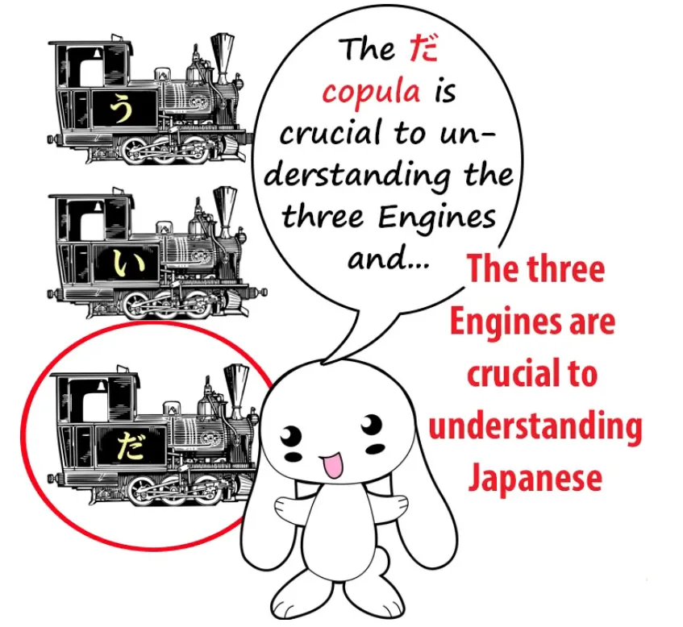
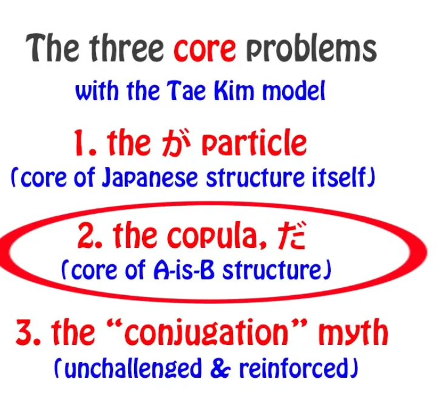
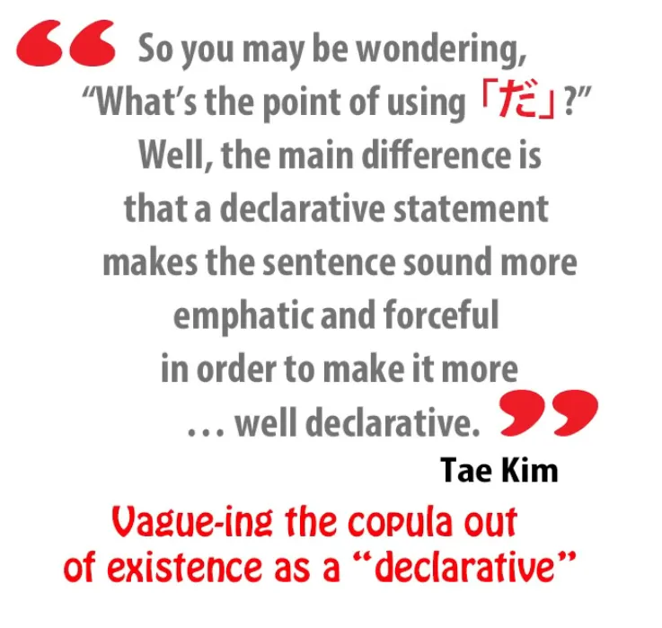
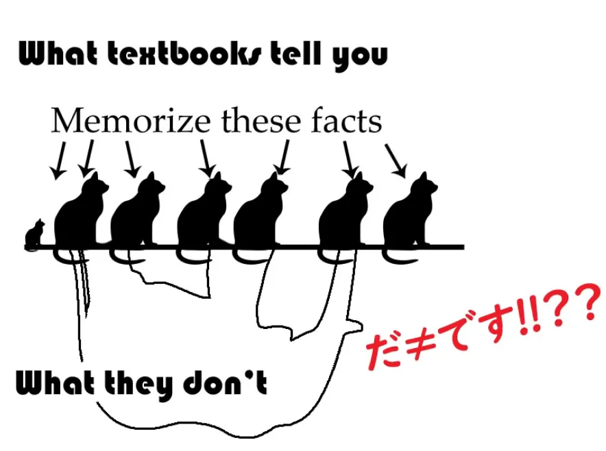
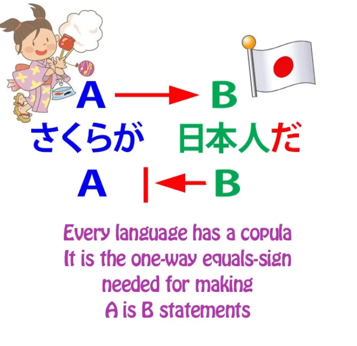
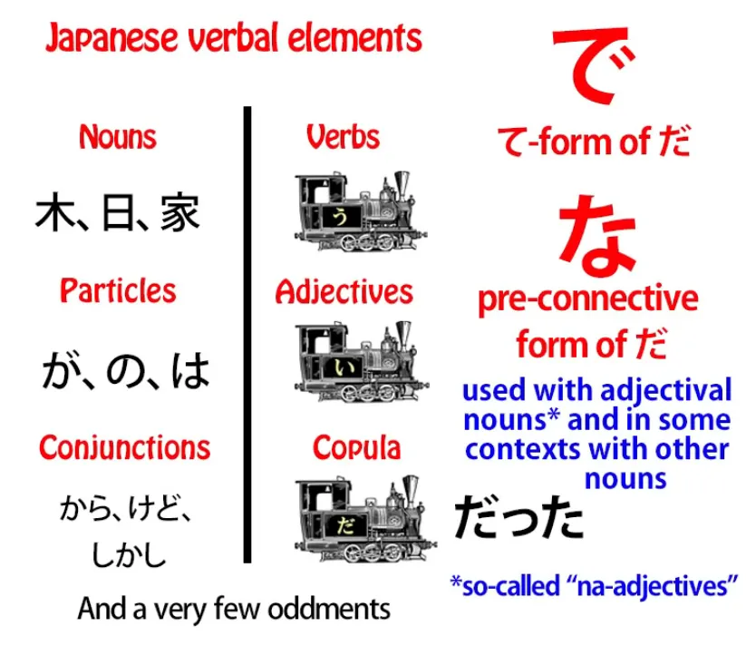
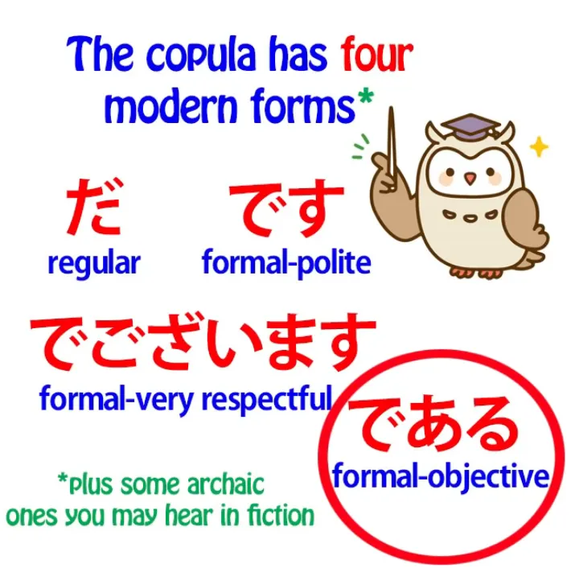
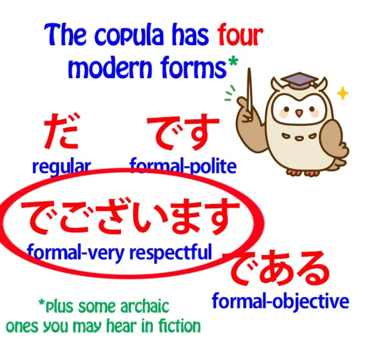
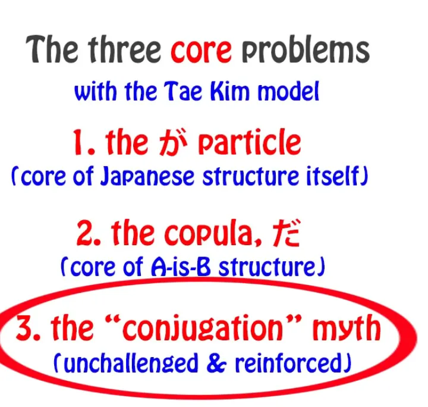

# **78. Mengurai Inti: Tae Kim vs Kopula | Ulasan Kritis Berbasis Struktur Bahasa Jepang** 

[**Struktur Bahasa Jepang yang Sebenarnya vs Tae Kim - Ulasan Struktural Tata Bahasa Jepang Tae Kim | Pelajaran 77**](https://www.youtube.com/watch?v=-JuHi-yKGFc&amp;list;=PLg9uYxuZf8x_A-vcqqyOFZu06WlhnypWj&amp;index;=80&amp;ab;_channel=OrganicJapanesewithCureDolly)

こんにちは。

Hari ini kita akan membahas inti dari struktur bahasa Jepang dan kita akan melihatnya dari sudut pandang yang berbeda dengan membandingkannya dengan sesuatu yang berbeda dari yang biasanya kita bandingkan.

Yaitu, kita akan melihat apa yang dilakukan Tae Kim-sensei dengan hal tersebut. Minggu lalu kita telah melihat apa yang dilakukan Tae Kim-sensei dengan partikel &quot;が&quot;, yang merupakan inti dan pusat mutlak dari setiap kalimat logis dalam bahasa Jepang.

Hari ini kita akan melihat apa yang dilakukannya dengan <code>だ</code>.

Dan dalam hal ini, hal ini sejalan dengan apa yang dia lakukan dengan が.

## Partikel penghubung &quot;だ&quot; (&amp; &quot;です&quot;)

Artinya, dia pada dasarnya mengaburkan partikel tersebut hingga tak terlihat, menghilangkan fungsi logisnya, dan memberinya fungsi yang samar-samar.

Lalu, mengapa ia melakukan ini? Sekali lagi, pada dasarnya karena alasan yang sama: karena interpretasi tata bahasa Eihongo konvensional agak berantakan dan tidak logis, dan Tae Kim-sensei ingin merapikannya.

Namun pada dasarnya sekali lagi yang dilakukannya adalah mengambil bagian yang salah dan mencoba mendamaikan bagian yang benar dengan itu. Jadi, kita berakhir dengan sesuatu yang sebenarnya lebih merusak dan kurang berguna daripada campuran Eihongo yang kita miliki sejak awal, yang setidaknya memiliki sebagian struktur bahasa Jepang yang sebenarnya di dalamnya, meskipun dengan cara yang agak tidak logis dan berantakan.

Dan dia juga menyangkal bahwa <code>だ</code> dan <code>です</code> sebenarnya adalah hal yang sama, dan ini sebenarnya karena tiga alasan.

Pertama, jika Anda menyangkal fungsi kopula, tidak terlalu penting apa sebenarnya bentuknya. Kedua, <code>です</code> sedikit eksentrik.

Ia melakukan satu hal yang <code>だ</code> tidak dilakukannya. Hanya satu hal.

Tetapi juga karena model bahasa Jepang Eihongo begitu membingungkan dan begitu terikat pada mitos yang disebut <code>Japanese conjugation</code>, yang tidak ada, sehingga keanehan tunggal itu <code>です</code> terlihat seperti lebih dari satu.

---

Sepertinya semuanya berantakan, padahal sebenarnya hanya ada satu keanehan — yang memang sedikit membingungkan, tetapi ketika Anda melihatnya apa adanya, itu hanyalah satu hal itu.

Jadi, seberapa pentingkah kita salah memahami <code>だ</code> kopula?

Hal ini tidak sepenting partikel &quot;が&quot; dalam setiap kalimat Jepang, jadi apakah itu seburuk itu? Sebenarnya, memang begitu, karena hal ini menghilangkan salah satu pilar utama dalam memahami struktur bahasa Jepang.

Dan itu adalah, memahami tiga engine dan tiga kalimat inti.

---

Hanya ada tiga cara kalimat Jepang yang logis dapat diakhiri: dengan kata kerja, kata sifat, atau kata benda + kopula. Kalimat tidak bisa diakhiri dengan kata benda saja; kalimat hanya bisa diakhiri dengan kata benda + kopula.

Dan ini sangat penting secara fundamental, dan kita akan membahas alasannya sebentar lagi, tetapi saya hanya ingin mencatat di sini bahwa bagian dari alasan di balik pernyataan Tae Kim bahwa kopula hanyalah sebuah pernyataan — ia sebenarnya tidak melakukan apa pun secara logis dan gramatikal, ia hanya menekankan apa yang ingin kita sampaikan — adalah karena dalam percakapan **kasual** <code>だ</code> kadang-kadang dihilangkan.

Sekarang, hal penting yang perlu dipahami di sini adalah bahwa **ini tidak berarti bahwa hal itu tidak diperlukan**. Dalam bahasa Inggris, kita sering mengatakan hal-hal seperti <code>Got up early this morning</code>, <code>Fancy a cup of coffee?</code>, <code>Call that a rabbit? Looks more like a teddy bear in a rabbit suit to me!</code>

Dan dalam semua kasus ini kita tahu, semua orang tahu, bahwa kalimat-kalimat tersebut tidak sepenuhnya gramatikal. Anda harus mengatakan, <code>I got up early this morning</code>, <code>Do you fancy a cup of coffee?</code>, <code>Do you call that a rabbit? It looks more like a teddy bear in a rabbit suit to me!</code>

Ini sangat alami. Semua bahasa menghilangkan unsur tata bahasa yang diperlukan ketika hal tersebut dapat dengan mudah dipahami oleh \[pendengar\] dalam percakapan yang sangat santai. Anda tidak bisa melakukannya dalam esai atau tulisan formal atau dokumen hukum atau sejenisnya, tetapi Anda bisa melakukannya dalam percakapan santai.

---

Dalam bahasa Jepang, tidak hanya kopula yang dihilangkan, **setengah dari partikel juga bisa dihilangkan dalam percakapan yang sangat santai**. Dan saya rasa tidak ada yang berargumen bahwa partikel-partikel itu tidak diperlukan.

Jadi, **dalam bahasa Jepang yang benar-benar gramatikal**, Anda hanya bisa mengakhiri kalimat dengan salah satu dari tiga cara tersebut. Kalimat bisa diakhiri dengan kata kerja, kata sifat, atau kopula, dan **kopula selalu harus melekat pada kata benda**, karena begitulah cara kerja kopula.

Dan seperti yang kita ketahui, fungsi kopula adalah memberi tahu kita bahwa A adalah B. <code>さくらが日本人**だ**</code> berarti <code>Sakura **is** a Japanese person</code>.

Hal ini hanya berlaku satu arah. Seorang orang Jepang tidak selalu berarti Sakura. Sakura adalah seorang orang Jepang.

Itulah yang disampaikan oleh kalimat dengan kopula.

---

Sekarang, jika kita melihat semua unsur dalam bahasa Jepang, khususnya unsur-unsur verbal, jumlahnya tidak banyak. Berbeda dengan bahasa Inggris, berbeda dengan bahasa-bahasa Eropa, jumlahnya benar-benar sangat sedikit.

Ada kata kerja, kata sifat, dan kopula, dan selain itu, kita memiliki kata benda — hampir semua yang bukan kata kerja atau kata sifat adalah kata benda.

Ada juga partikel, dan ada beberapa konjungsi seperti <code>なら</code> dan <code>けれど</code>. Hampir semua yang bukan kata kerja atau kata sifat sebenarnya adalah kata benda. Ada beberapa pengecualian, tetapi tidak banyak.

Sekarang, mengapa kita membaginya seperti ini? Di satu sisi kita memiliki kata kerja, kata sifat, dan kata penghubung; di sisi lain kita memiliki kata benda, partikel, dan kata sambung.

Alasannya adalah bahwa ketika kita membaginya seperti ini, selain fakta bahwa kita memiliki ketiga engine tersebut bersatu, ketiga engine tersebut memiliki karakteristik lain, kualitas lain.

Mereka semua <code>用言</code>, semuanya merupakan unsur verbal yang berubah-ubah, artinya, semuanya dapat berubah secara gramatikal.
::: info
Dolly tidak memberikan bentuk Kanji dari 「ようげん」tetapi saya hampir yakin itu adalah yang ini.
:::
Mereka tidak berubah sebanyak yang dipercayai oleh bahasa Jepang konvensional atau Tae Kim-sensei. Mereka tidak mengalami konjugasi.

Namun **mereka memang mengubah kana terakhir** (dalam beberapa kasus sedikit lebih dari sekadar kana terakhir) dan kemudian, dalam kasus kata kerja dan kata sifat, **mereka dapat menambahkan kata kerja bantu, kata sifat bantu, dan kata benda bantu**. Dan ini merupakan dasar fundamental cara kerja bahasa Jepang.

Di kolom lain, kita memiliki kata benda, partikel, dan konjungsi, dan ini tidak pernah berubah. **Kata benda tidak pernah berubah secara tata bahasa**. Kata benda tidak pernah mengalami transformasi atau modifikasi apa pun untuk tujuan tata bahasa.

**Partikel tidak pernah berubah**. Partikel melekat pada kata benda tetapi selalu tetap sama.

Konjungsi, seperti <code>から</code> dan <code>けれど</code>, tidak mengubah bentuknya untuk tujuan tata bahasa. Satu-satunya unsur kata yang melakukan hal itu dalam bahasa Jepang adalah tiga engine utama: kata kerja, kata sifat, dan kata penghubung.

Namun, jika Anda melihat buku teks dan situs web tata bahasa Jepang konvensional, Anda pada umumnya tidak akan mengetahui bahwa **kopula adalah salah satu dari unsur-unsur yang mengalami transformasi tata bahasa ini**. Kita tahu bahwa kata kerja termasuk di dalamnya. Kita tahu bahwa kata sifat termasuk di dalamnya.

Kita tahu bahwa <code>だ</code> sebenarnya dapat berubah menjadi bentuk lampau dan menjadi <code>だった</code>, tetapi kita tidak menyadari bahwa itu adalah unsur yang sepenuhnya, meskipun sedikit terbatas, namun bersifat memodulasi.

Fakta bahwa kita tahu ia memiliki satu modifikasi justru membuat semuanya semakin membingungkan. Hal ini tampak seperti keanehan. Namun, ini bukanlah keanehan.

**Sama seperti kata kerja dan kata sifat, kopula adalah unsur yang sepenuhnya mengubah bentuk.** **Kopula memiliki bentuk dasar (て)**, sama seperti kata kerja dan kata sifat. **Dan bentuk dasar (て) tersebut adalah <code>で</code>**, dan **bentuk て-nya sama baik itu <code>だ</code> versi atau <code>です</code> versi**.

**Dan ia memiliki bentuk konjungsi** *(な)*, yang digunakan ketika ia berada di depan kata benda yang dimodifikasinya, bukan di belakang kata benda tersebut.

Kita dapat mengatakan, <code>女の子は綺麗**だ**</code> (gadis itu **cantik**), atau kita bisa mengatakan <code>綺麗**な**女の子</code>. Dan ketika kita membalikkannya seperti ini, <code>だ</code> menjadi <code>な</code>.

**Jika kita ingin menggabungkan dua kata benda yang berfungsi sebagai kata sifat, kita menggunakan bentuk て dari kata hubung.** Dan ini sama persis dengan apa yang kita lakukan dengan kata sifat.

Jika kita ingin mengatakan <code>Sakura is small and pretty</code>, kita mengatakan <code>さくらが小さくて綺麗だ</code>. Jika kita ingin mengatakan, <code>Sakura is pretty and small</code> (cantik, <code>綺麗</code>, adalah kata benda, kata benda yang berfungsi sebagai kata sifat — kita tahu itu kata benda karena dapat ditulis dengan semua kanji dan apa pun yang ditulis dengan dua atau lebih kanji serta hampir semua yang ditulis dengan satu kanji selalu merupakan kata benda), kita mengatakan <code>さくらが綺麗**で**小さい</code>.

Jika kita ingin mengatakan <code>Sakura is genki</code>, kita mengatakan <code>さくらが元気だ</code>. Jika kita ingin mengatakan <code>Sakura is genki and pretty</code>, kita mengatakan <code>さくらが元気**で**綺麗だ</code>.
::: info
Saya kira karena kopula melekat pada kata benda, itulah sebabnya kita memiliki bentuk kopula &quot;て&quot; —「で」—setelah &quot;元気&quot; dan juga bentuk kopula reguler &quot;だ&quot; di akhir setelah &quot;綺麗&quot;. Jadi pada dasarnya ada 2 kopula, tetapi salah satunya juga menghubungkan kata benda-kata benda tersebut. Tapi ini hanya tebakan saya, jadi ambil dengan sebutir garam.
:::
Dan Anda lihat, kita telah melakukan persis seperti yang kita lakukan dengan kata sifat.

**Dengan kata sifat**, jika kita ingin menghubungkan dua kata sifat, kita mengubah kata sifat pertama menjadi bentuk &quot;て&quot;: <code>さくらが小さく**て**かわいい.</code>
::: info
Jika saya mengerti dengan benar, bentuk &quot;て&quot; adalah bentuk kopula penghubung kata sifat seperti &quot;で&quot;, dan bentuk &quot;い&quot; terakhir dalam &quot;かわいい&quot; adalah bentuk kopula biasa dari kata sifat tersebut seperti yang dijelaskan dalam pelajaran 6.
:::
---

Jika kita ingin menggabungkan **dua kata benda adjektival** beserta kopulanya, **kita mengubah kopula pertama menjadi bentuk &quot;て&quot;**, yaitu <code>で</code>.

Sekarang, entah mengapa buku teks tidak pernah menjelaskan hal ini. Mereka mencoba memberi tahu kita bahwa kata benda kata sifat adalah sesuatu yang aneh yang disebut <code>な-adjective</code> yang memiliki hal yang disebut <code>な</code> menempel padanya tanpa alasan yang bisa kita pahami, meskipun ketika berada di akhir kalimat, ia memiliki <code>だ</code> seperti kata benda lainnya.

Dan kemudian, ketika kita ingin menggabungkan dua kata benda, kebanyakan orang, menurut saya, sungguh-sungguh percaya bahwa partikel &quot;で&quot;, tanpa alasan yang dapat dijelaskan, digunakan untuk tujuan ini.

Tentu saja, **bukan partikel &quot;で&quot;**; **melainkan bentuk &quot;て&quot; dari kata hubung <code>だ</code> atau <code>です</code>**.

Dan saya rasa fakta bahwa hal ini tidak pernah dijelaskanlah yang membuat Tae Kim-sensei percaya bahwa <code>だ</code> hanyalah sebuah kalimat deklaratif. Jika itu kalimat deklaratif, mengapa perlu bentuk て? Mengapa Anda memerlukan bentuk て pada apa yang pada dasarnya hanyalah tanda seru verbal?

Mengapa Anda memerlukan bentuk konjungsi lunak pada sesuatu yang pada dasarnya hanyalah tanda seru verbal? Anda tidak akan membutuhkannya.

Namun, karena bahasa Jepang Eihongo konvensional tidak pernah menjelaskan kepada kita bahwa inilah yang sebenarnya terjadi, bahwa **<code>な</code> adalah bentuk pra-konjungsi dari <code>だ</code>**, bahwa **<code>で</code> dalam kasus-kasus ini adalah bentuk &quot;て&quot; dari <code>だ</code> kopula**, karena tidak pernah menjelaskannya, hal ini memungkinkan bahkan seseorang secerdas Tae Kim-sensei untuk salah memahami apa <code>だ</code> sesungguhnya dan apa fungsinya.

Dan setelah melakukan itu, kita benar-benar kehilangan pemahaman kita tentang tiga engine fundamental dari setiap kalimat bahasa Jepang.

Dan saya harus mengatakan bahwa **<code>だ</code> dan <code>です</code> sebenarnya bukanlah dua-satunya bentuk kopula** dalam bahasa Jepang modern. Keduanya adalah bentuk yang paling umum, tetapi **ada juga dua bentuk lainnya.**

## Bentuk kopula である

Terkadang kita menggunakan <code>である</code>, yang agak kuno.

**Ini adalah bentuk kuno dari kopula** dan **digunakan dalam konteks formal, tetapi tidak selalu sopan.** Jadi, bentuk ini dapat digunakan misalnya dalam laporan surat kabar yang bersifat formal dan objektif, bukan khusus sopan.

Novel terkenal <code>I Am a Cat</code> , dalam bahasa Jepang, <code>我輩は猫である</code>, dan alasan penggunaan <code>我輩</code> untuk <code>I</code> dan <code>である</code> sebagai kopula menyampaikan dalam bahasa Jepang, dengan cara yang tidak dapat disampaikan oleh terjemahan bahasa Inggris, karakter kucing yang dimaksud, yang memiliki kepribadian seperti <code>偉そう</code>, seorang pria yang agak sombong yang menyebut dirinya sendiri sebagai <code>我輩</code> dan menggunakan kata hubung yang agak kuno dan formal tetapi tidak terlalu sopan <code>である</code>.
::: info
わがはいmemiliki dua bentuk - 我輩 dan 吾輩, keduanya pada dasarnya identik, tetapi tampaknya,  
[**sepertinya 吾輩 sedikit kurang megah/terkendali dan 吾 bukanlah bentuk 常用漢字.**](https://chigai-hikaku.com/?p=49060)
:::

## Bentuk kopula &quot;でございます&quot;

Kopula lain yang sering kita dengar adalah <code>でございます</code>, dan **itu sangat sopan**.

**Itu adalah &quot;敬語&quot;**, dan Anda akan sering mendengarnya di hotel-hotel Jepang dan tempat-tempat sejenis.

**Semua itu adalah bentuk-bentuk kopula**,  
dan **semua memiliki bentuk &quot;て&quot; yang sama, <code>で</code>**, **dan bentuk penghubung yang sama, <code>な</code>**.

## Keunikan です &amp; ます

Sekarang, hal lain, menurut saya, yang memungkinkan kita membayangkan bahwa <code>です</code> bukanlah kopula yang sama dengan <code>だ</code> adalah bahwa **<code>です</code> dan <code>ます</code> keduanya sedikit eksentrik** — dan saya telah membuat video lengkap tentang hal ini. **[[17]](./17-polite-japanese-and-the-volitional.md)**

Dan karena alasan inilah, karena keanehan mereka sebenarnya mengganggu pemahaman kita tentang tata bahasa inti dasar bahasa Jepang — begitu kita terbiasa, cukup mudah untuk menambahkan <code>です</code> dan <code>ます</code> , tetapi sebaiknya biarkan saja pada awalnya karena **mereka melakukan hal-hal yang tidak dilakukan oleh kata-kata Jepang modern lainnya**.

---

Dan **satu hal yang <code>です</code> dilakukan dalam kasus ini adalah bahwa kata ini dapat ditambahkan ke kata sifat**. Jadi kita mengatakan <code>女の子がかわいい**です**</code>.

::: info
Meskipun hal ini akan dibahas dalam Pelajaran 79. Ini bukan sekadar penanda kosong acak.
:::
Sekarang, **ini <code>です</code> tidak berfungsi sebagai kopula**. **Ini hanyalah penanda formalitas.**

Dan **alasan keberadaannya adalah karena tidak ada versi formal dari engine kata sifat**. Dan hal ini hanya terjadi dalam satu kasus ini, dan hanya terjadi karena kata sifat tidak memiliki cara lain untuk memformalkan diri mereka sendiri dan entah bagaimana bahasa Jepang menetapkan gagasan ini untuk menggunakan kopula formal sebagai penanda formalitas dalam kasus khusus tersebut.

Yang lain, **bentuk kopula yang tidak sopan, <code>だ</code> dan <code>である</code>,** **tidak ditempatkan di akhir kata sifat.**

Dan tentu saja ini bukan hanya soal kata sifat. **Bentuk penghubung kopula dan bentuk *て* kopula digunakan** **di berbagai tempat dalam bahasa Jepang untuk membentuk berbagai konstruksi yang berbeda.**

Dan saya telah menyertakan beberapa di antaranya dalam sebuah video *(seharusnya Pelajaran 40)* yang akan saya tautkan di atas dan di bagian informasi di bawah ini jika Anda ingin mempelajarinya lebih lanjut.

Dan jika kita tidak tahu bahwa kopula memiliki bentuk penghubung (て) atau bentuk konektif, maka kita akan mengalami banyak kesulitan dalam memahami apa yang sebenarnya dilakukan oleh konstruksi-konstruksi ini.

Dan jika kita mengikuti tata bahasa Jepang konvensional Eihongo, kita mungkin tidak akan tahu hal ini, dan jika kita mengikuti Tae Kim-sensei, kita bahkan tidak akan tahu bahwa ada kopula. Dan ini akan membuat berbagai konstruksi menjadi sangat sulit.

## Masalah dengan konjugasi

Dan kita harus benar-benar membahas di sini masalah lain dengan Tae Kim, yang sebenarnya tidak lebih buruk daripada buku teks Eihongo, tetapi juga tidak lebih baik.

Dan itu adalah bahwa dia, seperti mereka, menerima mitos <code>Japanese conjugation</code>. Dia percaya bahwa kata kerja Jepang mengalami konjugasi, padahal yang sebenarnya terjadi hanyalah perubahan satu kana dan penambahan kata benda, kata kerja, dan kata sifat bantu.
::: info
Lebih tepatnya dalam konteks struktur dan logika bahasa Barat. Secara linguistik, menurut saya bisa diperdebatkan apakah bahasa Jepang benar-benar tidak memiliki atau justru memiliki jenis konjugasi tertentu…  
Secara keseluruhan, pada akhirnya hal itu tidak terlalu penting selama bahasa Jepang dipelajari sebagai bahasa Jepang.
:::

Dan hal itu menjadi penting dalam kasus khusus ini karena membuatnya tampak seolah-olah keunikan <code>です</code> mencakup cakupan yang lebih luas daripada yang sebenarnya.

Jika saya mengatakan bahwa <code>です</code> hanya digunakan sebagai penanda formalitas kosong pada kata sifat, seseorang yang mengikuti bahasa Jepang konvensional atau Tae Kim mungkin akan berkata, &quot;Nah, bukan hanya kata sifat. Hal ini juga terjadi pada kata kerja yang dikonjugasi, seperti misalnya **食べないです** atau **食べたいです**.

Itu bukan kata sifat, kan? Itu adalah kata kerja yang dikonjugasi.&quot;

Dan jawabannya tentu saja, ya, **itu adalah kata sifat**. **Itu bukan kata kerja yang dikonjugasi.** Tidak ada kata kerja yang dikonjugasi dalam bahasa Jepang.

**<code>ない</code> adalah kata sifat bantu yang ditambahkan ke akar kata <code>食べる</code>**. **<code>たい</code> adalah kata sifat pembantu lain yang ditambahkan ke akar kata <code>食べる</code>**. Dan saya telah menjelaskan semua ini dalam video saya tentang sistem akar kata dalam bahasa Jepang. [[7.5]](./7-5-conjugation.md)

**Kata bantu ini terlihat seperti kata sifat, berfungsi dalam segala hal seperti kata sifat**, dan ada alasan yang kuat untuk itu. **Mereka adalah kata sifat.**

Jadi, **versi penanda formalitas kosong dari <code>です</code>**tidak melekat pada semua jenis kata yang berbeda. Ia hanya **melekat pada satu jenis kata, yaitu kata sifat.**

Dan hal ini menunjukkan kepada kita bagaimana satu kesalahan logis dalam bahasa Jepang sebenarnya memicu kesalahan lainnya. Karena kita tidak memahami bahwa kopula bermodulasi, hal ini dapat memicu kesalahan yang jauh lebih besar: bahwa sebenarnya tidak ada kopula sama sekali.

Karena kita tidak memahami sistem akar kata dan kata bantu serta percaya bahwa kata kerja dalam bahasa Jepang berkonjugasi, kita bisa percaya bahwa  penanda formalitas kosong <code>です</code> digunakan dalam berbagai situasi yang berbeda, padahal sebenarnya hanya digunakan dalam satu situasi.

Sekarang, seperti yang telah saya katakan sebelumnya, **saya tidak bermaksud menyerang Tae Kim-sensei**. **Beliau telah melakukan banyak pekerjaan luar biasa** dan fakta bahwa beliau salah memahami banyak hal tentang bahasa Jepang pada dasarnya karena **beliau melihat apa yang salah dengan tata bahasa Eihongo konvensional dan berusaha memperbaikinya.**

Sayangnya, alih-alih membuangnya ke tempat sampah, dia malah menyapu hal itu ke karpet ruang tamu. Namun **itu bukan karena dia tidak logis**. Itu karena dia logis dan dia hanya tidak memahami dengan tepat apa yang sebenarnya terjadi.

Dan itu tidak mengherankan, karena tidak ada yang mengajarkannya, tidak ada yang memberitahu siapa pun.

Jadi, saya harap saya telah membantu sedikit meluruskan hal-hal di sini..
::: info
Saya mencoba menggunakan garis bawah lagi, dalam gaya ini saya merasa tampilannya cukup bagus dan bisa membantu menonjolkan bagian-bagian penting dengan lebih baik. Tapi tentu saja Anda bisa memberi tahu saya pendapat Anda tentang hal ini* (o≧▽゜)o
:::
