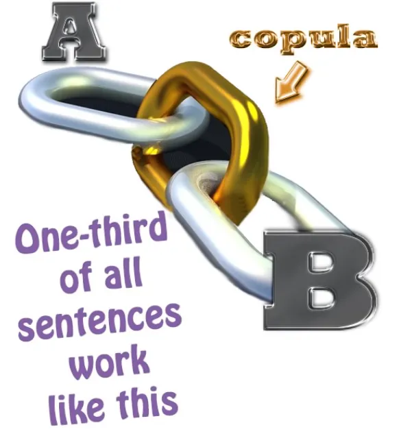
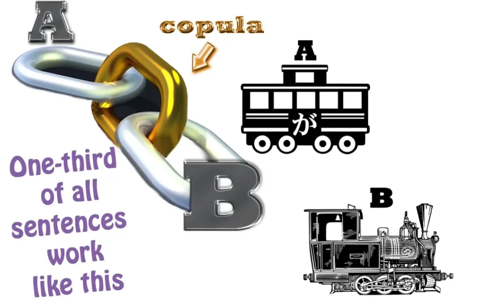
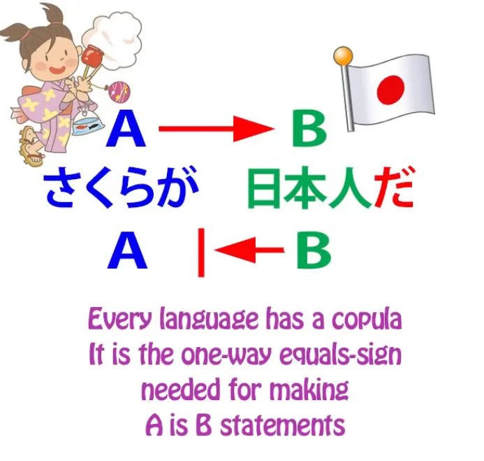
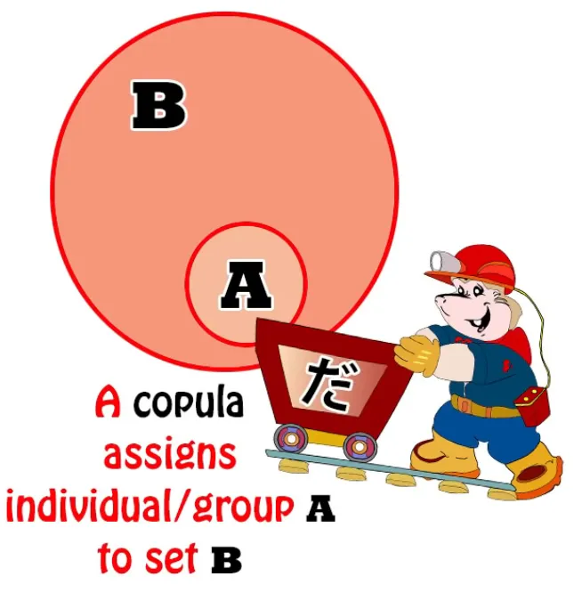
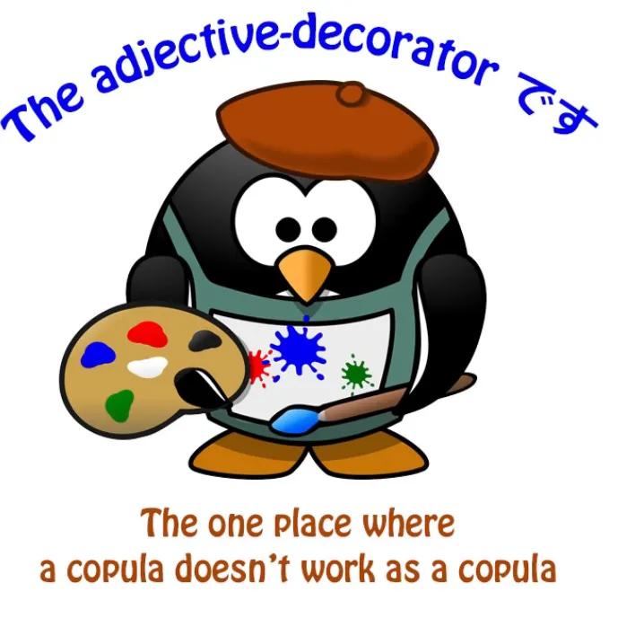
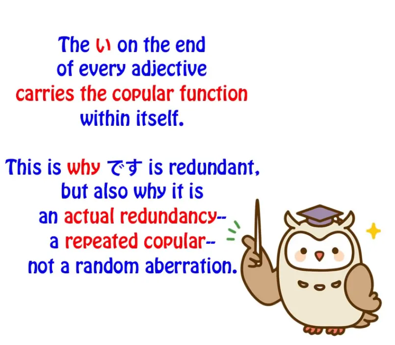

# **79. Rahasia lebih dalam tentang kopula** 

[**1/3 dari semua kalimat bahasa Jepang terpecahkan! Rahasia lebih dalam dari kopula. +Kekeliruan Tae Kim | Pelajaran 79**](https://www.youtube.com/watch?v=euHYPcMoao4&amp;list;=PLg9uYxuZf8x_A-vcqqyOFZu06WlhnypWj&amp;index;=81&amp;ab;_channel=OrganicJapanesewithCureDolly)

こんにちは。

Hari ini kita akan membahas sesuatu yang sangat krusial bagi struktur inti bahasa Jepang. Kita baru saja membahas hal ini terkait dengan Tae Kim-sensei dan cara dia mengacaukan pemahaman kita tentang hal ini. Hal tersebut adalah kopula, dan ini benar-benar mengatur banyak hal yang dapat kita katakan dan komunikasikan dalam bahasa itu sendiri. Ini sangat penting bagi cara kita memaknai dunia.

Sekarang, Tae Kim sebenarnya tidak pernah menggunakan kata &quot;kopula&quot;, <code>copula</code>, dan itulah sebagian besar masalahnya. Namun, beberapa orang mungkin bertanya bukan mengapa Tae Kim tidak menggunakannya, melainkan mengapa saya menggunakannya. Bagaimanapun, saya berusaha sebisa mungkin menghindari terminologi linguistik dan tata bahasa yang teknis.

Saya jarang menggunakan kata <code>**grammatical subject**</code>; saya bahkan lebih jarang menggunakan kata <code>**predicate**</code>. **Saya lebih suka mengatakan <code>A-car</code> dan <code>B-engine</code>.**

Dengan begitu, kita semua tahu apa yang sedang kita bicarakan. Jadi, mengapa saya menggunakan kata yang abstrak dan agak mengerikan ini, <code>copula</code>?

## Apa itu “Copula”

Nah, alasannya adalah karena bahasa Inggris tidak memiliki copula khusus, sehingga bisa jadi cukup sulit bagi penutur bahasa Inggris untuk memahami dengan tepat apa itu copula. Saya harus memperkenalkan fungsi itu sebagai sesuatu yang berdiri sendiri. Ketika Tae Kim berbicara tentang ekspresi copular, ia menyebutnya sebagai <code>state-of-being</code> ekspresi, dan inilah kunci dari seluruh masalah ini.

Jadi, apa itu copula, mengapa bahasa Inggris tidak memiliki copula khusus, dan mengapa hal ini begitu penting? Mari kita mulai dengan <code>what is a copula?</code>

Cara paling sederhana untuk mendefinisikan kopula adalah bahwa **kopula adalah tanda sama dengan satu arah**.

**Kopula memberi tahu kita bahwa A adalah B**, **meskipun B belum tentu A**. Jadi, <code>さくらは日本人**です**</code>. *(Tentu saja, だ juga)* Sakura **adalah** orang Jepang; **orang Jepang belum tentu Sakura.**

Nah, itulah penjelasan sederhananya. Namun jika kita menggali lebih dalam, **yang sebenarnya dilakukan kopula adalah menempatkan hal-hal ke dalam himpunan**.

<code>さくらは日本人**です**</code> **berarti Sakura termasuk dalam himpunan <code>Japanese person</code>**.

Dan ini sangat penting bagi bahasa, yang merupakan alat yang digunakan manusia untuk mengkonseptualisasikan dunia, hal-hal yang mereka lihat di sekitar mereka, alam semesta yang terlihat dan dapat dirasakan. Menempatkan hal-hal ke dalam kategori adalah cara paling mendasar kita dalam menghadapinya. **Sebuah mawar termasuk dalam himpunan <code>flower</code>**.

**Bunga termasuk dalam himpunan <code>growing things</code>**. **Hal-hal yang tumbuh termasuk dalam himpunan <code>living things</code>**. **Makhluk hidup termasuk dalam himpunan <code>things</code>**.

Setiap saat kita mengelompokkan hal-hal ke dalam himpunan, dan itulah cara kita memahaminya. Kita tidak akan bisa mengatakan banyak hal tentang apa pun jika kita tidak mampu mengelompokkan hal-hal ke dalam himpunan.

Jadi **inilah, pada dasarnya, fungsi kopula**. **Kopula memberi kita cara yang sangat sederhana, lugas, dan tidak rumit untuk memasukkan apa pun ke dalam himpunan kapan saja, untuk mendefinisikan kapan saja himpunan tempat sesuatu berada.**

---

**Sekarang, himpunan tersebut mungkin hanya terdiri dari satu elemen. Dalam hal itu, tanda sama dengan berlaku dua arah.** Jadi, misalnya, jika saya mengatakan <code>That person over there is Sakura</code>, ya, orang tertentu di sana dan Sakura adalah orang yang sama.

**Sakura adalah himpunan beranggotakan satu di mana orang di sana, dan hanya orang di sana saja, termasuk di dalamnya.** **Setidaknya, Sakura yang satu ini.** **Kita tidak sedang membicarakan semua orang yang bernama Sakura**, jelas.

Jadi inilah fungsi kopula. Mengapa begitu banyak kebingungan tentang hal ini? Bukankah itu fungsi yang relatif sederhana? Ya, memang itu fungsi yang sederhana.

Masalah utamanya di sini, seperti sering terjadi pada kesalahpahaman Barat tentang bahasa Jepang, tidak terletak pada bahasa Jepang, melainkan pada sifat bahasa Inggris itu sendiri. **Bahasa Inggris, seperti yang saya katakan, tidak memiliki kopula khusus.**

**Bahasa Inggris memang memiliki kopula. Setiap bahasa harus memiliki kopula.** Jika kita tidak memiliki sesuatu yang menjalankan fungsi kopula, kita tidak akan bisa mengelompokkan hal-hal, yang berarti kemampuan kita untuk mengkonseptualisasikan sesuatu akan sangat terbatas.

**Jadi, yang dilakukan bahasa Inggris adalah menggabungkan kata kerja &quot;being&quot; dengan kopula.** **Kata kerja &quot;being&quot; adalah sesuatu yang sekadar memberitahu kita bahwa sesuatu itu ada.** **Kata kerja ini memiliki berbagai bentuk: <code>is / am / are / was</code> dll.**

Jadi, jika kita mengatakan <code>I **am** an American</code>, itulah **kopula** yang bekerja. Kita mengatakan **saya termasuk dalam himpunan yang disebut <code>American people</code>**. Jika kita mengatakan <code>I think, therefore I am</code>, kita menggunakan kata kerja &quot;being&quot;.

**Kita tidak mengatakan apa pun tentang siapa saya, atau kelompok mana yang saya ikuti.** Kita hanya mengatakan bahwa karena saya berpikir, kita dapat menyatakan dengan yakin bahwa saya ada.

Sekarang, karena bahasa Inggris tidak memiliki dua kata terpisah untuk kedua konsep tersebut, hal ini sebenarnya tidak menimbulkan banyak masalah bagi penutur asli bahasa Inggris atau penutur asing yang telah belajar bahasa Inggris setidaknya sebagian melalui imersi, karena setelah beberapa waktu semuanya menjadi jelas melalui penggunaan dan pengalaman, tetapi **hal ini memang menimbulkan masalah ketika bahasa Inggris mencoba menganalisis bahasa-bahasa yang memiliki kopula terpisah.** Bahasa Jepang jelas merupakan salah satunya, dan bahasa Spanyol adalah contoh lainnya.

---

**Bahasa Spanyol memiliki dua kopula, <code>ser</code> dan <code>estar</code>**: <code>ser</code>, yang menunjukkan himpunan permanen tempat sesuatu berada, dan <code>estar</code>, yang menunjukkan himpunan yang relatif sementara tempat sesuatu berada. Itu adalah perbedaan yang tidak dibuat oleh kebanyakan bahasa.

**Namun, perbedaan penting di sini adalah bahwa <code>ser</code> dan <code>estar</code> tidak sama dengan <code>haber</code>, yang merupakan kata kerja &#x27;menjadi&#x27;.**

Jadi, jika kita mengatakan <code>Estos **son** huevos</code>, kita sebenarnya mengatakan <code>These **are** eggs</code>; *(“anak” seharusnya menjadi kopula di sini)*

jika kita mengatakan <code>**Hay** huevos</code>, kita sebenarnya mengatakan <code>Eggs **exist**</code> — dua jenis pernyataan yang sama sekali berbeda. Seperti yang saya katakan, **dalam bahasa Inggris kita tidak bingung antara kedua jenis pernyataan tersebut, tetapi ketika kita mencoba menerapkan penjelasan bahasa Inggris ke bahasa-bahasa yang memang memiliki kata berbeda untuk kopula dan kata kerja “menjadi”, kebingungan sering kali muncul.**

## “だ” dan “です” adalah kopula yang sama

Sekarang, beberapa orang yang berkomentar di video saya tentang Tae Kim versus kopula tidak sepenuhnya yakin dengan argumen saya bahwa <code>です</code> dan <code>だ</code> adalah hal yang sama, karena Tae Kim berargumen dengan sangat kuat bahwa keduanya berbeda. Saya pikir saya telah menanggapi sebagian besar dari mereka. Saya tidak menanggapi semuanya karena saya tidak berusaha untuk menjadi komprehensif.

Dan saya juga tidak akan membahas argumen-argumen tersebut di sini, karena menurut saya argumen-argumen itu tidak terlalu penting. Sebenarnya saya akan membahasnya dalam sebuah video dalam waktu dekat, **tetapi intinya di sini adalah bahwa menggunakan argumen seperti <code>だ isn&#x27;t necessarily needed in this case but です is</code> sebagai cara untuk memperkuat argumen yang lebih besar bahwa <code>だ</code> dan <code>です</code> bukanlah hal yang sama adalah membalikkan seluruh hal tersebut secara terbalik dan terbalik.**

**Yang penting bukanlah bahwa <code>だ</code> dan <code>です</code> berfungsi sedikit berbeda dalam hal ini atau itu, bahwa <code>だ</code> bisa dihilangkan di sini dan <code>です</code> tidak bisa dihilangkan di sana, hal-hal seperti itu.** Hal-hal itu sama sekali tidak relevan dengan masalah bahwa **keduanya adalah kopula**.

Dan argumen mendasar yang menentang kesalahan ini hanyalah ini: kita tahu bahwa **setiap bahasa harus memiliki kopula.** **Tanpa fungsi kopula, Anda tidak dapat mengucapkan setengah dari hal-hal yang mutlak harus diungkapkan oleh bahasa tersebut.** Anda tidak memiliki bahasa yang sesungguhnya.

**Anda memiliki bahasa yang rusak jika tidak memiliki fungsi kopula.** Sekarang, bahasa Jepang terkadang menggunakan bahasa sopan (丁寧語) (dalam bahasa です / ます, *= bahasa sopan*) dan terkadang menggunakan bahasa Jepang yang lugas dan sederhana. **Kopula dalam yang satu adalah <code>です</code>** *(sopan)***; kopula pada yang lain adalah <code>だ</code>.** *(sederhana)*

Sekarang, jika Anda akan berargumen bahwa keduanya bukanlah hal yang sama, sehingga salah satunya bukanlah kopula, maka Anda harus menentukan apa kopula tersebut, baik dalam bahasa biasa maupun bahasa sopan (bahasa です / ます), karena **keduanya harus memiliki kopula.** **Tidak ada bahasa tanpa kopula**, jadi menjadi kewajiban Anda, jika Anda mengatakan bahwa keduanya bukanlah hal yang sama, untuk memberi tahu kami di mana letak kopula dalam kedua bentuk ucapan tersebut.

Dan tentu saja Tae Kim tidak pernah membahas masalah ini karena dia tampaknya tidak benar-benar memahami bahwa ada kopula, berbeda dengan apa yang dia sebut <code>the state of being</code>.

## Kopula vs keadaan

Sekarang, hal lain yang mungkin diangkat orang adalah mereka mungkin berkata, &quot;Tentu saja bukan kebetulan bahwa bahasa Inggris menggunakan keadaan untuk berarti kopula. Bukankah kedua hal itu agak terkait erat? Lagipula, **dalam bentuk-bentuk kuno kopula Jepang, seperti **である** dan **でございます**, keadaan keberadaan memainkan peran. **ある** dan **ございます** adalah kata-kata keadaan keberadaan meskipun **で** mengubahnya menjadi kopula.&quot;**

Dan jawabannya adalah ya, tentu saja. Alasan di balik hal ini terletak pada persepsi manusia terhadap ontologi, yaitu ilmu atau filsafat tentang keberadaan itu sendiri. Manusia cenderung percaya bahwa himpunan tempat suatu benda berada merupakan hal mendasar bagi keberadaannya.

**Dan dalam arti tertentu, hal itu tentu saja benar.** **Kita mendefinisikan sesuatu berdasarkan himpunan tempatnya berada, dan keberadaannya sebagai entitas yang ia adalah, dibandingkan dengan entitas lain mana pun, secara mendasar terkait erat dengan himpunan tempatnya berada.** Sebuah mawar termasuk dalam himpunan <code>flower</code>. Begitu kita tahu itu, kita bisa menebak berbagai hal tentangnya.

Kita mungkin tidak tahu persis seperti apa bentuknya, tetapi kita bisa mengatakan bahwa ia kemungkinan memiliki batang, kelopak, daun, tumbuh di tanah, dan seterusnya. **Jadi, himpunan tempat sesuatu berada sangat penting bagi keberadaannya sebagai makhluk tertentu dan bukan makhluk lain.**

---

**Namun, memahami bahwa keadaan keberadaan dan himpunan tempat sesuatu dikaitkan saling terkait secara semantik tidak berarti bahwa kita harus mencampuradukkan keduanya.** Ketika kita mengatakan <code>I **am** an American</code>, **kita tidak bermaksud hal yang sama dengan <code>am</code> dengan apa yang kita maksudkan ketika kita mengatakan <code>I think, therefore I **am**.</code>**

**Jika kita percaya bahwa kopula dalam bahasa Jepang, yang diekspresikan oleh <code>だ</code> atau <code>です</code>, dan keadaan keberadaan, yang diekspresikan oleh <code>いる</code> atau <code>ある</code>, pada dasarnya sama, kita telah kehilangan perbedaan yang sangat penting dalam bahasa Jepang.** Tentu saja, Tae Kim-sensei tidak percaya hal itu, tetapi pada saat yang sama ia mengalami kesulitan besar dalam menjelaskan apa perbedaan tersebut, dan itulah sebabnya kita bisa berakhir dengan berpikir bahwa <code>だ</code> dan <code>です</code> bukanlah hal yang sama.

**Ada beberapa kasus di mana <code>だ</code> dapat dihilangkan, terkadang secara gramatikal, terkadang tidak, yang tidak berlaku untuk <code>です</code>**, itu benar, **tetapi hal itu tidak memengaruhi fakta bahwa keduanya adalah kopula.**

## Satu kasus di mana &quot;です&quot; tidak berfungsi sebagai kopula

**Ada satu kasus di mana <code>です</code> digunakan di mana ia tidak berfungsi sebagai kopula, dan itu adalah kasus kata sifat.** Seperti yang saya tunjukkan dalam video sebelumnya[[78]](./78-breaking-the-core-tae-kim-vs-the-copula-japanese-structure-based-critical-review.md), **kata sifat adalah satu-satunya kasus di mana <code>です</code> digunakan dan bukan sebagai kopula, melainkan hanya sebagai penanda formalitas kosong** *(kesopanan)* **.**

### Penggunaan &quot;です&quot; pada kata sifat bukanlah sekadar penanda kesopanan acak

Namun, ada poin lain yang perlu kita pertimbangkan di sini, yaitu bahwa meskipun dalam kasus-kasus tersebut — artinya, **hanya pada kata sifat dan bukan kasus lain** (hal ini hanya terjadi pada kata sifat seperti yang saya tunjukkan dalam video tersebut) — **meskipun pada kata sifat memang benar bahwa <code>です</code> adalah penanda formalitas kosong, itu bukan sekadar penanda formalitas kosong yang sembarangan.**

***Seperti yang saya sebutkan sebelumnya, です / ます lebih merupakan penanda kesopanan, bukan penanda formalitas.*** ***Mereka merupakan bagian dari bahasa sopan (丁寧語). Jadi, lebih tepat menyebutnya sebagai penanda kesopanan.***

Seperti yang kita ketahui, **hanya ada dua jenis kalimat, yaitu kalimat A-adalah-B dan kalimat A-melakukan-B**, dan **dalam bahasa Jepang terdapat dua jenis kalimat A-adalah-B**, yaitu **kalimat kata sifat**, **yang dalam bentuk sederhananya harus diakhiri dengan -い**, dan **kalimat kopula**, yang harus **diakhiri dengan <code>だ</code> atau <code>です</code>.

::: info
 JIKA-JIKA, [**ini**](https://japanese.stackexchange.com/questions/43244/why-cant-%e3%81%a0-be-used-after-an-i-adjective/43246#43246) dan [**ini**](https://japanese.stackexchange.com/a/97338), mungkin akan bermanfaat untuk tidak salah mengartikan -い sebagai kopula sejati seperti だ, melainkan sebagai sufiks predikatif untuk KATA SIFAT yang dapat mengakhiri kalimat dengan sendirinya.  
Ini menunjukkan “X adalah / = kualitas adjektival ini”, misalnya, kemungkinan itulah sebabnya ia membawa fungsi kopula di dalamnya.  
Inilah juga mengapa “だ” tidak digunakan dengannya karena hal itu berlebihan, karena akhiran -い pada dasarnya sudah menyiratkan hal tersebut.  
Dolly menjelaskannya demikian—memiliki fungsi kopula di dalamnya sendiri &amp; kemungkinan itulah sebabnya “だ” tidak digunakan.

Namun, ada pandangan berbeda yang dapat Anda periksa dengan mencari topik ini; beberapa menyebut - い sebagai “semacam kopula”, yang lain tidak, bahkan ada yang mempertanyakan apakah bahasa Jepang memiliki kata sifat sama sekali.  
Namun secara keseluruhan, tidak sepenuhnya penting bagaimana istilahnya, yang penting adalah Anda memahami bagaimana kata tersebut berfungsi dalam bahasa tersebut &amp; bagaimana penggunaannya yang tepat. Karena [**tidak semua kata yang berakhiran -い](https://jisho.org/search/%E6%B4%97%E3%81%84) secara otomatis merupakan kata sifat, karena mungkin ada bentuk Kanji tersembunyi, dll. Meskipun dalam 98% kasus, itu adalah kata sifat.*

Pada dasarnya, Dolly ada untuk memberikan dasar-dasarnya; jika Anda mendalami lebih jauh, hal-hal jarang sesederhana dan universal. Bahasa adalah konstruksi yang sangat kompleks &amp; tidak sepenuhnya bekerja seperti itu.  
Misalnya, mengapa ada begitu banyak cara untuk mempelajarinya, menafsirkannya, &amp; menjelaskannya. Pilihlah yang cocok untuk Anda.
:::

**Jadi, apa yang terjadi ketika kita menempatkan <code>です</code> di akhir kalimat kata sifat, kita sedang menggandakan kata hubung.** Mengatakan <code>さくらは**かわいい**です</code> sama dengan mengatakan <code>*(Speaking of)* Sakura *(she)* **is-cute** is</code>. Mengatakan <code>ペンが**赤い**です</code> pada dasarnya sama dengan mengatakan <code>Pen **is-red** is</code>.

Kita menggandakan kata hubung tersebut. **Jadi, meskipun <code>です</code> adalah penanda formalitas kosong, itu bukan sekadar penanda formalitas acak.** Itu melakukan sesuatu yang kadang-kadang dilakukan dalam bahasa, yaitu, *(it is)* **bertindak sebagai pengulangan** — **mengatakan hal yang sama dua kali.**

::: info
 Saya memahami bahwa karena ini adalah pengulangan, kita mungkin mengatakan bahwa ini bukanlah kopula yang secara ketat digunakan untuk memenuhi fungsi kopula dalam klausa atau kalimat, melainkan fokus utamanya adalah memberikan aspek kesopanan pada kopula dalam - い agar kalimat tersebut terlihat sopan.
 :::

*Ini tetap merupakan kopula dalam segala hal, tetapi karena - い memiliki fungsi serupa, hal ini terutama menunjukkan kesopanan.*

**Dan itulah satu-satunya kasus sebenarnya di mana <code>です</code> melakukan sesuatu yang berbeda dari <code>だ</code>.**

::: tip
 Disarankan untuk membaca komentar [**di bawah video**](https://www.youtube.com/watch?v=euHYPcMoao4&amp;list;=PLg9uYxuZf8x_A-vcqqyOFZu06WlhnypWj&amp;index;=82&amp;ab;_channel=OrganicJapanesewithCureDolly) seperti biasa. Perbesar jika perlu.
 :::
