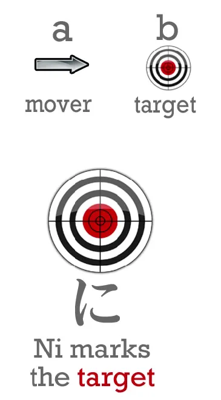
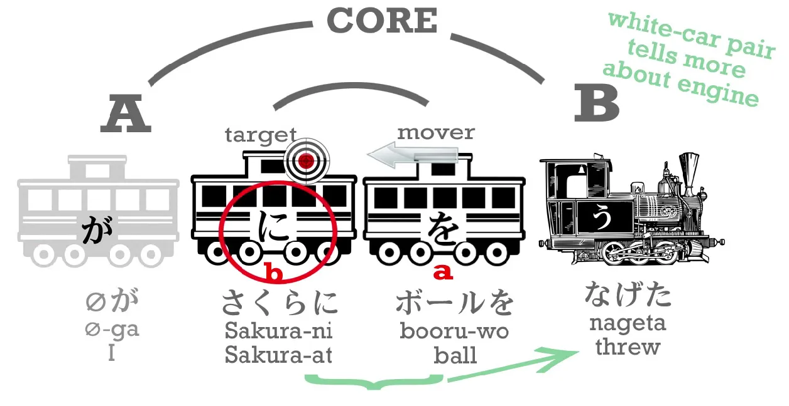
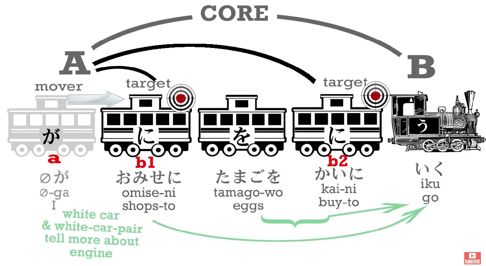
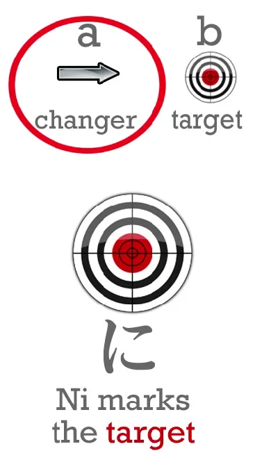
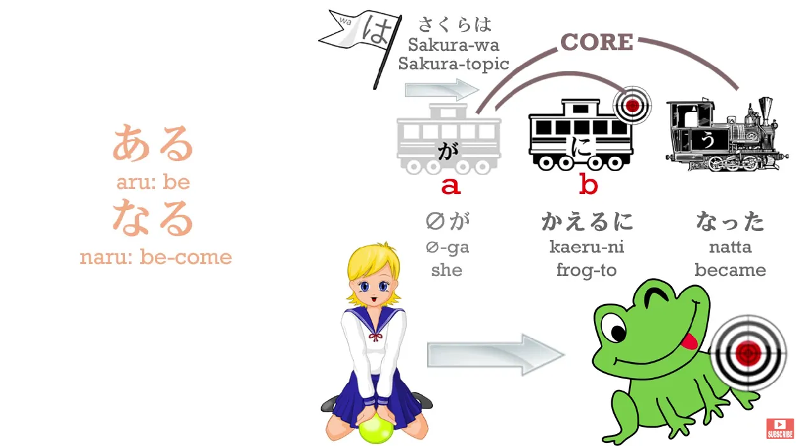
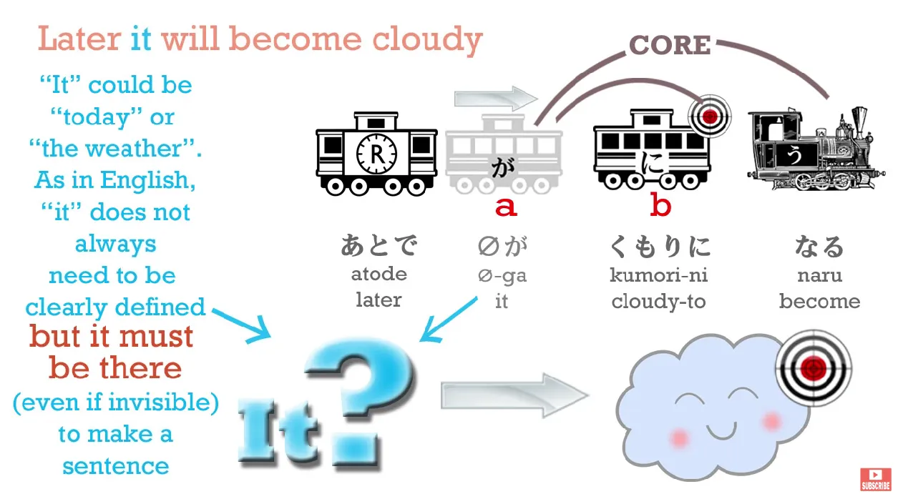
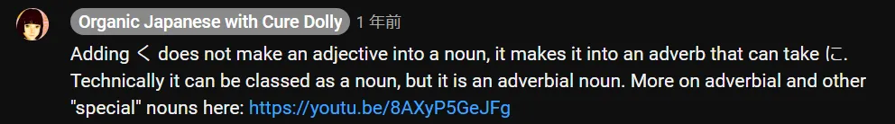
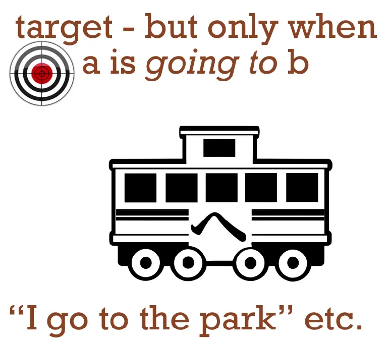

# **8. Partikel &quot;に&quot; dan &quot;へ&quot;**

[**Pelajaran 8: Lokasi, tujuan, dan transformasi — kunci pemahaman partikel &quot;ni&quot; dan &quot;he&quot;**](https://www.youtube.com/watch?v=uqlQYrE2oFM&amp;list;=PLg9uYxuZf8x_A-vcqqyOFZu06WlhnypWj&amp;index;=9)

## Partikel &quot;に&quot;

こんにちは。

Hari ini kita akan membahas partikel <code>に</code>, dan dengan demikian kita akan meningkatkan kemampuan kita. Apa yang saya maksud dengan itu? Dalam tujuh pelajaran sebelumnya, kita telah mempelajari cukup banyak struktur dasar bahasa Jepang. Kita sekarang bisa mengatakan banyak hal jika memiliki kosakata yang cukup. Namun, semua yang bisa kita katakan sangat, sangat konkret.

Kita bisa berbicara tentang melakukan sesuatu dan menjadi sesuatu, yang tentu saja merupakan inti dari setiap kalimat. Namun, kita juga perlu memiliki beberapa konsep yang lebih canggih. Hal-hal seperti tujuan, niat, dan transformasi. Jadi hari ini kita akan melihat penggunaan partikel &quot;に&quot;, beberapa di antaranya masih sangat konkret dan beberapa di antaranya mulai membawa kita ke area yang lebih kompleks.

Nah, kita sudah membahas partikel &quot;に&quot;, bukan? Dan **kita tahu bahwa dalam kalimat logis, partikel ini menandai sasaran akhir dari suatu tindakan.** Jadi <code>(zeroが)さくらにボールをなげた</code> berarti <code>I threw the ball at Sakura</code>.

Bola ditandai dengan を karena itulah benda yang sebenarnya saya lempar. Saya ditandai dengan が terlepas dari apakah Anda bisa melihat saya atau tidak, karena saya adalah orang yang melakukan tindakan melempar. **Namun, Sakura ditandai dengan に karena dia adalah sasaran dari tindakan tersebut, dalam hal ini secara harfiah.**

Sekarang, **partikel &quot;に&quot; hampir selalu menandai sasaran dalam bentuk apa pun. Jadi, jika kita pergi ke suatu tempat, mengirim sesuatu ke suatu tempat, atau meletakkan sesuatu di suatu tempat, kita menggunakan に untuk itu <code>somewhere</code>. Jadi, jika A pergi ke B, maka B ditandai dengan に. B adalah tujuan, sasaran dari perjalanan tersebut.**

Jadi, jika saya pergi ke taman, saya mengatakan <code>(zeroが)こうえんにいく</code>.

Jika saya pergi ke toko, saya mengatakan <code>(zeroが)おみせにいく</code>.

**Jadi, tujuan atau sasaran pergerakan yang sebenarnya dan fisik ditandai dengan に. Namun, kita juga bisa menandai jenis sasaran yang lebih halus.**

Jadi, kita bisa mengatakan <code>(zeroが)おみせにたまごを**かいに**いく</code>. Ini berarti <code>I go to the shops **to buy** eggs</code>.

<code>おみせ</code> adalah <code>shop/s</code> – <code>shop</code> adalah <code>みせ</code> dan kita menambahkan gelar kehormatan <code>お</code> karena kami menghormati orang-orang yang membantu kami memiliki semua hal indah yang beruntung kami miliki. <code>たまご</code> adalah telur – Anda mungkin, jika sudah cukup tua, ingat たまごっち /Tamagotchi, makhluk kecil berbentuk telur yang Anda rawat.

**Dan <code>かい</code> adalah batang い -I-stem <code>かう</code> – untuk membeli.** Akar kata い adalah akar kata yang sangat istimewa dan dapat melakukan banyak hal, **dan juga bisa berdiri sendiri.**

<code>かいにいく</code> berarti <code>[go] in order to buy, for the purpose of buying</code>.

---

Sekarang, Anda mungkin berkata, <code>I thought that logical particles like に and が and を can only mark nouns</code> – dan itu benar sekali. Karena **salah satu hal yang dapat dilakukan oleh akar kata い dari sebuah kata kerja ketika berdiri sendiri adalah mengubah kata kerja tersebut menjadi kata benda yang setara.**

::: info
Lihat Pelajaran 7.5, A-stem &quot;い&quot;, mengubah kata kerja
:::

(A-stem ini juga bisa melakukan hal lain, tapi saya bisa membahasnya lain waktu.)

Jadi **<code>かい</code>, tindakan membeli, adalah kata benda.** Sama seperti dalam bahasa Inggris jika kita mengatakan <code>I like swimming</code>, <code>swimming</code> adalah kata benda, berenang adalah hal yang saya sukai, dan jika kita mengatakan <code>I go to the shop for the purpose of buying eggs</code>, maka itu <code>buying</code> juga merupakan kata benda, itulah yang kita tuju. Dan <code>かい</code> itu sama saja.

---

**Jadi <code>かい</code> adalah hal yang akan kita lakukan dan itu adalah kata benda serta ditandai dengan に.** Jadi, Anda lihat bahwa dalam kalimat ini kita memiliki dua sasaran:

toko-toko – <code>おみせ</code> – adalah target fisik sebenarnya dari perjalanan kita, tempatnya, **dan membeli telur adalah alasan kita pergi, jadi itulah target emosional, target volisional, jenis target yang lebih halus** daripada tempat fisik yang akan kita tuju, tetapi tetaplah sebuah target. **Dan dimungkinkan untuk memiliki dua target dalam kalimat yang sama, keduanya ditandai dengan に.** Dan itulah tepatnya yang kita lakukan di sini.

**Jadi に memberi kita target suatu tindakan dalam arti yang paling harfiah dan juga target volisional, tujuan sebenarnya dari tindakan kita.**

Sekarang, untuk kembali ke hal-hal yang lebih konkret, **kata &quot;に&quot; yang menandai sasaran lokasi sebenarnya ke mana kita pergi, ke mana kita meletakkan sesuatu, juga dapat menandai tempat di mana seseorang atau sesuatu BERADA.**

Jadi saya bisa mengatakan, <code>おみせにいく</code> – <code>I am going to the shops / I will go to the shops</code> – dan kita bisa mengatakan, <code>おみせにいる</code> – <code>I am at the shops</code>.

<code>こうえんにいく</code> – <code>I&#x27;ll go to the park</code>; <code>こうえんにいる</code> -<code>I&#x27;m at the park</code>.

Sekarang kamu lihat, **ini juga merupakan target, karena agar suatu benda berada di suatu tempat, ia pasti pernah sampai di sana pada suatu saat. Jadi <code>に</code> dapat menandai tidak hanya target masa depan, tempat yang akan saya tuju, tetapi juga dapat menandai target masa lalu, tempat yang pernah saya kunjungi dan di mana saya masih berada.**

---

Dan **kita juga menggunakan ini untuk benda mati**: <code>ほんはテーブルのうえにある</code> – <code>The book is on the table</code>. <code>うえ</code> adalah kata benda, dan dalam hal ini berarti <code>on</code> meja. <code>うえ</code> dapat berarti <code>up</code> atau <code>over</code>, dalam hal ini artinya <code>on</code>, dan **selalu merupakan kata benda**, jadi dalam hal ini <code>on of the table</code> adalah tempat di mana buku itu berada:

**tujuan masa lalu buku tersebut, ke mana buku itu pergi dan di mana buku itu kini berada**. **Jadi, に juga dapat menandai tempat di mana suatu benda berada, yaitu tujuan masa lalunya.**

### に menandai tujuan dari suatu transformasi

Dan aspek terakhir dari <code>に</code> yang ingin saya bahas adalah bahwa **に juga dapat menandai tujuan dari suatu transformasi.**

Sama seperti jika A pergi ke B, に menandai B, tempat tujuannya, **jika A berubah menjadi B, menjadi B, maka に juga menandai B**, hal yang menjadi tujuannya, hal yang diubahnya.

Jadi jika saya mengatakan, <code>さくらはかえるになった</code>... <code>かえる</code> adalah <code>frog</code> dan <code>なる</code> adalah kerabat dekat dari <code>ある</code>: <code>ある</code> berarti <code>be</code>; <code>なる</code> berarti <code>become</code>.

Jadi, <code>さくらはかえるになった</code> – <code>Sakura became a frog / Sakura turned into a frog</code>, **dan に menandakan hal yang menjadi dirinya, hal yang berubah menjadi dirinya.**

Sekarang, mungkin kamu berpikir, <code>Mmm, how often do people turn into frogs these days?</code> – dan saya akui hal ini memang jarang terjadi. Namun, **ini adalah hal yang sangat penting untuk dipelajari karena ada berbagai hal sehari-hari yang berubah menjadi hal lain, dan juga kita menggunakan bentuk ungkapan ini jauh lebih sering dalam bahasa Jepang daripada dalam bahasa Inggris.**

---

Misalnya, <code>ことし(zeroが)十八さいになる</code>: <code>ことし</code> adalah <code>this year</code>, <code>十八さい/じゅうはっさい</code> adalah <code>18 years of age</code>. Jadi kita mengatakan, <code>This year (I) become 18</code>. *Atau seperti yang ditunjukkan: <code>This year (I) 18 years old-to become</code>.*

Sekarang dalam bahasa Inggris kita akan mengatakannya sedikit berbeda: kita mungkin akan mengatakan, <code>I turn 18</code> atau <code>I&#x27;ll be 18</code>, tetapi dalam bahasa Jepang kita mengatakan <code>I will become 18 years of age</code>.

Dan jika hari akan mendung, kita mungkin akan mengatakan <code>あとで(zeroが)くもりになる</code> (<code>くもり</code> adalah <code>cloudy</code>; <code>くも</code> adalah awan, <code>くもり</code> adalah keadaan mendung, dan keduanya adalah kata benda).

Kita mengatakan, <code>くもりになる</code> yang berarti <code>become cloudy</code>. *Atau seperti yang diberikan: <code>Cloudy-to become</code>.* Dalam bahasa Inggris kita bisa mengatakan itu. Kita mungkin lebih cenderung mengatakan <code>get cloudy</code> atau sesuatu, tetapi dalam bahasa Jepang kita sering menggunakan <code>become</code> – <code>になる</code> – bentuk ucapan ini sering kali. Jadi ini adalah hal penting untuk dipelajari.

### Penggunaan &quot;に&quot; pada kata sifat (alias menggunakannya sebagai kata keterangan)

**Dan saya harus menambahkan di sini bahwa dalam kasus kata sifat, cara kerjanya sedikit berbeda.** Jadi jika kita ingin mengatakan <code>Sakura is beautiful</code>, kita mengatakan <code>さくらがうつくしい</code> (<code>うつくしい</code> berarti <code>is-beautiful</code>), tetapi jika kita ingin mengatakan <code>Sakura became beautiful</code>, **kita tidak bisa menggunakan に karena <code>うつくしい</code> bukan kata benda.** Itu bukan gerbong, **itu engine**, bukan?

::: info
うつくしい adalah kata sifat/ い -engine.
:::

Jadi apa yang harus kita lakukan?

Yang kita lakukan adalah apa yang kita bahas minggu lalu: **kita mengubah kata sifat itu menjadi akarnya.** Jadi **kita menghilangkan akhiran &quot;い&quot; (-i) dan menambahkan &quot;く&quot; (-ku).**

::: info
Akarnya adalah &quot;うつくし&quot;, lalu tambahkan &quot;く&quot;.
:::

  

::: info
くe mengubah うつくしい menjadi kata keterangan/kata benda keterangan. Lebih lanjut tentang hal ini di Pelajaran 41.

:::

Dan itu saja yang perlu kita lakukan. Begitulah cara menggunakannya: <code>さくらがうつくしくなった</code> – <code>Sakura became beautiful</code>.

<code>なった</code> adalah bentuk lampau dari <code>なる</code> karena <code>なる</code> adalah kata kerja godan (harus kata kerja godan karena tidak berakhiran -いる atau -える, melainkan berakhiran -ある).

Jadi sekarang kita tahu beberapa cara mengekspresikan konsep yang lebih halus seperti niat, tujuan, transformasi – dan kita telah naik level.

## Partikel &quot;へ&quot;

Sebelum kita selesai, saya akan memberikan satu partikel lagi yang belum kita lihat sebelumnya, yaitu &quot;へ&quot;. Dan ini sangat, sangat sederhana. Partikel <code>へ</code> – seperti yang Anda lihat, ini adalah kana &quot;へ&quot; (he), tetapi ketika kita menggunakannya sebagai partikel, kita hanya mengucapkannya sebagai &quot;え&quot;. Dan ini adalah partikel yang sangat sederhana. Ini adalah partikel yang hanya memiliki satu fungsi. Dan partikel ini menggantikan satu, dan hanya satu, dari fungsi <code>に</code>.

Jadi, ketika kita mengatakan ke mana kita akan pergi - <code>A is going to B</code> – kita menandai B dengan に. **Kita juga bisa menandainya dengan へ.**

**Dan itulah satu-satunya fungsi yang dilakukan へ.** Seperti yang saya katakan, ini adalah partikel yang hanya punya satu fungsi. **Ia bahkan tidak bisa menandai tempat di mana sesuatu telah pergi dan masih berada di sana. Ia hanya menandai tempat yang akan dituju oleh sesuatu.**

::: info
sebuah arah, lebih lanjut tentang itu di 8b.
:::

<code>へ</code> sangat sederhana dan bagus untuk memiliki partikel lain, gerbong tambahan, yang ditambahkan ke dalam arsenal Anda, bukan?