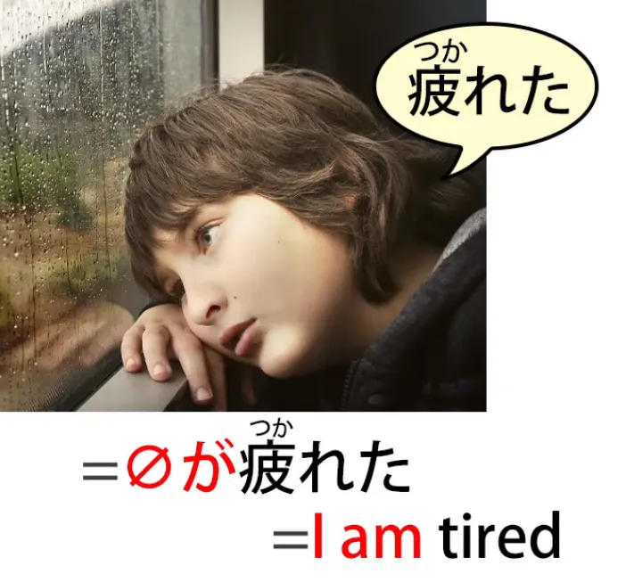
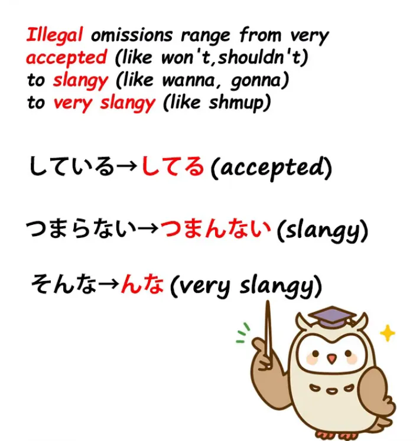
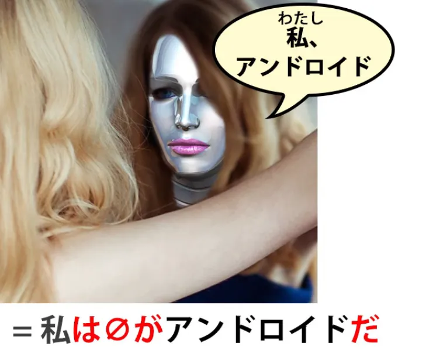
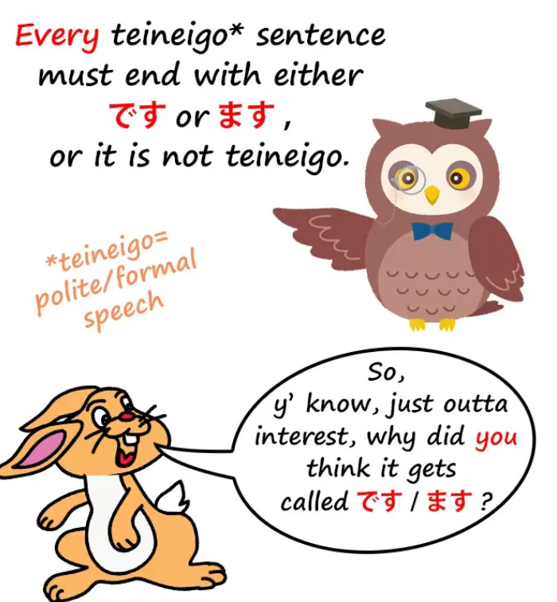
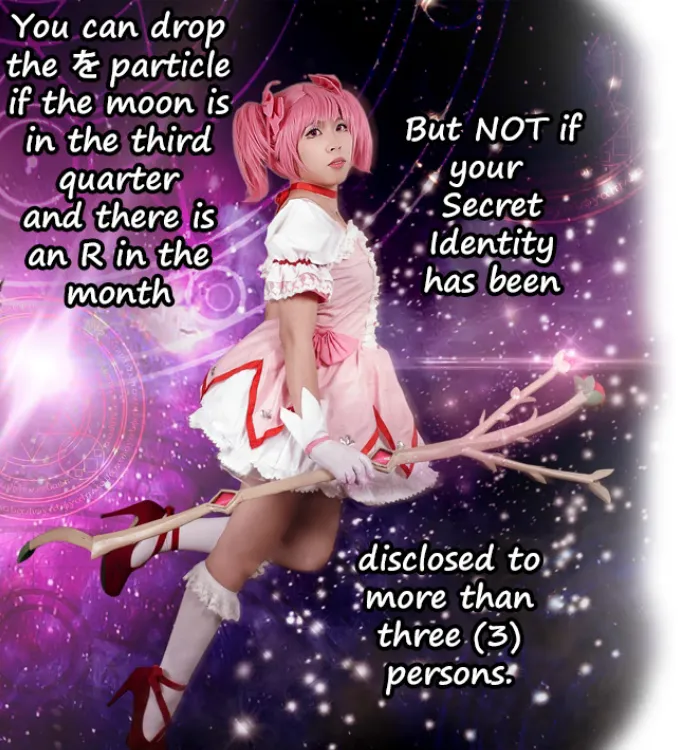

# **80. Partikel yang dihilangkan &amp; penghilangan kata-kata dalam percakapan sehari-hari**

[**Memahami Bahasa Jepang Meskipun Ada Kata yang Dilewatkan! Partikel yang dihilangkan &amp; penghilangan kata-kata dalam percakapan sehari-hari | Pelajaran 80**](https://www.youtube.com/watch?v=wamt3AAJI6M&amp;list;=PLg9uYxuZf8x_A-vcqqyOFZu06WlhnypWj&amp;index;=82&amp;ab;_channel=OrganicJapanesewithCureDolly)

こんにちは。

Begitu kita mulai serius mendalami dan mengonsumsi materi bahasa Jepang yang sebenarnya, yang seringkali bersifat percakapan sehari-hari dan santai, bukan bahasa Jepang dari buku teks, salah satu masalah yang sering dihadapi banyak orang adalah gagasan bahwa...

&quot;Astaga, mereka menghilangkan setengah dari apa yang akan mereka katakan! Mereka menghilangkan ini dan mengabaikan itu, dan bagaimana kita bisa menebak apa yang sebenarnya mereka bicarakan?&quot;

Nah, ini sebenarnya tidak seburuk yang terlihat pada awalnya, tetapi kita perlu tahu apa yang sedang terjadi dan apa yang harus dicari.

Jadi, **pertama-tama mari kita bahas tentang penghilangan dalam bahasa.**

**Secara mendasar, ada dua jenis penghilangan dalam bahasa:**

**penghilangan yang sah dan penghilangan yang tidak sah.**

## Penghilangan yang Sah

**Penghilangan yang sah adalah ketika secara tata bahasa benar-benar sah**

**dalam konteks bahasa tertentu untuk menghilangkan sesuatu.**

Hal ini terjadi dalam bahasa Inggris. Misalnya, jika kita mengatakan dalam bahasa Inggris <code>The night we met</code>, itu dianggap sebagai frasa yang gramatikal. Yang sebenarnya kita maksud adalah <code>The night **that** we met</code>.

Dan **dalam bahasa Prancis atau Spanyol, hal itu tidak bisa dilakukan.**

**Anda tidak bisa menghilangkan <code>that</code>, yang merupakan <code>que</code> dalam bahasa Prancis atau Spanyol.**

**Tetapi dalam bahasa Inggris, Anda bisa.**

Dalam bahasa Inggris, itu merupakan bagian dari aturan tata bahasa Inggris yang memastikan semua orang akan memahami maksud Anda dan Anda diizinkan untuk menghilangkannya. **Anda bisa melakukannya dalam makalah akademis atau dokumen hukum.**

**Anda bisa melakukannya di mana saja. Itu bukan kesalahan tata bahasa.**

Itu bukan penghilangan yang ilegal. **Itu adalah penghilangan yang sah.**

### Subjek tak terlihat

Nah, hal ini terjadi **dalam bahasa Jepang**, dan **contoh yang sangat, sangat umum**, tentu saja, **adalah subjek tak terlihat.**

Jika kita mengatakan <code> *(zeroが)* 疲れた</code>, yang artinya <code>tired</code>, **yang berarti <code>I am tired</code>**, dan **ini seratus persen sah dan gramatikal dalam bahasa Jepang.**

**Anda dapat menggunakannya dalam esai akademis, dokumen hukum, atau di mana saja.**

**Hal ini dipahami sebagai bahasa Jepang yang sepenuhnya gramatikal.**

**Tidak ada keraguan mengenai apa yang Anda maksudkan.**

Pertama, karena **subjek tak terlihat selalu secara default mengacu pada <code>I</code>** dan kedua karena bahasa Jepang, seperti yang kita ketahui, sangat ketat dalam menyatakan bahwa kita hanya dapat berbicara tentang hal-hal yang benar-benar dapat kita ketahui.

Jadi, kita tidak dapat berbicara tentang keadaan emosi orang lain. **Kita tidak dapat berbicara tentang apakah orang lain menyukai atau tidak menyukai sesuatu.**

**Kita hanya bisa mengatakan bahwa mereka tampak menyukai atau tidak menyukainya.**

**Dan kita tidak bisa mengatakan bahwa orang lain lelah.**

Jadi <code>疲れた</code> hanya bisa berarti <code>**zeroが**疲れた/ **私が**疲れた</code>.

Jadi **ini adalah penghilangan yang sah.**

## Penghilangan yang tidak sah

Namun, ada juga banyak penghilangan yang tidak sah yang terjadi di semua bahasa, dan **dalam percakapan santai** dibandingkan dengan percakapan yang sangat formal, **hal itu sepenuhnya sah**.

Jadi **secara ketat hal itu ilegal, tetapi dalam konteks percakapan sehari-hari yang biasa dan santai, hal itu sah.**

Jadi, jenis-jenis penghilangan yang diterima tetapi secara ketat ilegal apa saja yang ada?

Pada dasarnya, ada tiga jenis.

### Menghilangkan sebagian kata atau frasa

Yang pertama adalah ketika kita menghilangkan sebagian kata atau frasa.

Jadi, misalnya, alih-alih <code>している</code> (sedang melakukan / sedang melakukan) kita mengatakan <code>してる</code>; alih-alih <code>しておく</code> (do and put in place) kita mengatakan <code>しとく</code>.

Sekarang, **ini adalah pelanggaran yang begitu umum sehingga sebenarnya tidak berbeda dengan mengatakan** **<code>shouldn&#x27;t</code> atau <code>hadn&#x27;t</code> sebagai ganti <code>should not</code> atau <code>had not</code> dalam bahasa Inggris.**

**Anda bisa menggunakannya hampir di mana saja, tetapi tidak dalam situasi yang paling formal.**

Sedikit lebih rendah dalam skala formalitas, ada ungkapan seperti <code>分かんない</code> sebagai ganti <code>分からない</code>, atau <code>つまんない</code> sebagai ganti <code>つまらない</code>.

Jadi itu salah satu jenisnya, dan meskipun mungkin butuh waktu sebentar untuk terbiasa dengan ungkapan-ungkapan tersebut, begitu Anda menguasainya, mereka tidak lebih sulit daripada hal lain.

---

**Hal lain yang sering terlewatkan adalah apa pun yang melekat pada kata benda.**

Seperti yang telah saya katakan sebelumnya, **Bahasa Jepang adalah bahasa yang sangat berpusat pada kata benda.**

Dan, seperti yang Anda ketahui[[8b]](./8b-particles-explained.md), **kata benda selalu memiliki sesuatu yang melekat padanya**:

**Partikel logis untuk memberi tahu kita peran apa yang dimainkannya dalam kalimat**,

**kadang-kadang partikel non-logis, dan kadang-kadang kopula**.

Sekarang, **hampir semua partikel ini bisa dihilangkan pada saat tertentu.**

**Jika tanpa partikel tersebut sudah jelas peran apa yang dimainkan kata benda dalam kalimat**,

**kita bisa dalam percakapan santai**, bukan dalam bahasa formal, tetapi dalam percakapan santai, **kita bisa menghilangkan partikel tersebut.**

---

**Penanda yang paling sering dihilangkan adalah** **が, を**, dan **penanda topik non-logis は**, serta **kopula <code>だ</code>.**

Jadi, misalnya, jika saya mengatakan <code>私アンドロイド</code>, **saya telah menghilangkan apa yang mungkin seharusnya menjadi は setelah nama saya.**

**Saya juga telah menghilangkan <code>だ</code> setelah <code>アンドロイド</code>**.

Sekarang, jika Anda tahu bahwa saya sedang memperkenalkan diri atau mengatakan sesuatu tentang diri saya, tidak ada keraguan tentang apa yang sedang terjadi di sini.

Dan... saya tidak ingin terlalu jauh kembali ke topik Tae Kim-sensei, saya telah membuat seri tiga bagian tentang hal-hal yang diajarkan Tae Kim-sensei yang sebenarnya tidak seharusnya dia ajarkan, dan saya akan menyertakan tautan ke sana[[77]](./77-real-japanese-structure-vs-tae-kim-structural-review-of-tae-kim-s-japanese-grammar.md)[[78]](./78-breaking-the-core-tae-kim-vs-the-copula-japanese-structure-based-critical-review.md)[[79]](./79-rahasia-lebih-dalam-dari-kopula.md), tetapi yang akan saya lakukan di sini adalah menyampaikan poin yang belum saya sampaikan di sana **yaitu bahwa Tae Kim-sensei mengatakan bahwa karena <code>だ</code> sering dihilangkan dan <code>です</code> tidak dihilangkan,** *(menurutnya)* keduanya sebenarnya bukan hal yang sama, keduanya bukan kopula.

### Mengapa &quot;だ&quot; sering dihilangkan dan &quot;です&quot; tidak

Dan saya sudah membahas hal ini secara mendalam serta menjelaskan betapa berantakannya bahasa Jepang jika Anda mengabaikan kopula, jadi saya tidak akan mengulanginya lagi.

Namun, poin yang ingin saya sampaikan di sini adalah bahwa alasan mengapa <code>だ</code> dapat dihilangkan di tempat-tempat di mana <code>です</code> tidak bisa, ada dua alasan.

Pertama-tama, **mengapa <code>だ</code> dihilangkan sesering itu?**

Nah, jika buku teks mengajarkan struktur dasar bahasa Jepang, hal itu akan jelas, tapi tentu saja mereka tidak melakukannya.

**Hal paling dasar tentang struktur bahasa Jepang adalah bahwa kalimat bahasa Jepang hanya bisa diakhiri dengan salah satu dari tiga cara.**

Dan saya yakin Anda tahu apa saja ketiga cara tersebut, bukan? Mari kita ucapkan bersama-sama.

**Sebuah kalimat dalam bahasa Jepang hanya dapat diakhiri dengan kata kerja, kata sifat, atau kata benda ditambah kopula.**

Sekarang, setelah kita tahu itu, kita tahu mengapa kopula bisa dihilangkan dengan sangat mudah.

**Seperti yang saya katakan sebelumnya, partikel dan kopula dihilangkan** **ketika sudah jelas apa kata benda yang dimaksud tanpa perlu menandainya.** Itulah saat kopula dihilangkan.

---

Sekarang, **jika sebuah kata benda berada di akhir kalimat, kita tahu bahwa itu bukan kalimat kata kerja.**

**Kita tahu bahwa itu bukan kalimat kata sifat.**

**Kita tahu bahwa itu adalah kalimat kata benda ditambah kopula.**

Dan **karena kita tahu itu, kita bisa, jika mau, menghilangkan kopula.**

Dan ini, menurut saya, adalah alasan mengapa Tae Kim-sensei tergoda untuk mengatakan bahwa <code>だ</code> adalah kalimat deklaratif, semacam tanda seru verbal.

Yang dia katakan adalah bahwa orang-orang menggunakan <code>だ</code> ketika mereka ingin menekankan apa yang mereka katakan.

Nah, **ada benarnya juga karena faktanya** **bahwa dalam percakapan santai, Anda selalu bisa menghilangkan kata penghubung dan tetap dimengerti,** **jadi jika Anda berbicara pada tingkat santai di mana Anda mungkin akan menghilangkannya,** **maka saat Anda menyertakannya adalah saat Anda ingin menekankan apa yang Anda katakan.**

---

**Sebenarnya tidak sesederhana itu, karena banyak orang tidak menghilangkannya,** **tidak semua orang menghilangkannya setiap saat.** Ini sedikit lebih rumit dari itu, **tetapi gagasan bahwa ini adalah kalimat deklaratif setidaknya mengandung sedikit kebenaran** **bahwa karena Anda bisa menghilangkannya hampir kapan saja dalam percakapan santai,** **Anda sering menyertakannya karena ingin menekankannya.**

Jadi, jika mudah menghilangkan kopula saat <code>だ</code>, **mengapa tidak mudah menghilangkannya saat <code>です</code>?**

Tae Kim-sensei mengubah hal ini menjadi sebuah argumen utuh untuk fakta bahwa <code>だ</code> dan <code>です</code> adalah dua hal yang berbeda, tetapi jika Anda memikirkannya, sangat jelas mengapa <code>だ</code> mengapa kata penghubung itu dihilangkan (saya sudah menjelaskannya) dan mengapa <code>です</code> tidak dihilangkan.

**<code>です</code> tidak dihilangkan karena ini adalah bahasa formal.**

**Pertama-tama, kita lebih sedikit menghilangkan kata dalam bahasa formal.**

Kita tidak menghilangkan banyak hal dalam kalimat formal seperti yang kita lakukan dalam kalimat informal. **Namun, bahkan jika kita berbicara dalam bahasa formal pada tingkat yang longgar,** **di mana kita bisa menghilangkan beberapa bagian dari kalimat,** **kita tidak akan menghilangkan <code>です</code>.**

Mengapa tidak?

Karena hanya ada satu hal yang mengubah kalimat tingkat 丁寧語 (です / ます) menjadi 丁寧語, **yaitu fakta bahwa kita menambahkan <code>ます</code> kata bantu di akhir kalimat kata kerja** **dan <code>です</code> kata penghubung di akhir kalimat kata benda plus kata penghubung** **dan bahkan, secara berlebihan, di akhir kalimat kata sifat.**

**Jadi, dalam bahasa Inggris, Anda tidak bisa menghilangkan <code>です</code> tanpa menghilangkan &#x27;丁寧語&#x27;.**

Sesederhana itu.

---

Sekarang, **ada berbagai aturan tentang kapan Anda bisa dan tidak bisa** **menghilangkan hal-hal seperti &#x27;を&#x27; dari kalimat santai.**

::: info
Jelas ini cuma bercanda…sekadar jaga-jaga (ノ\*°▽°\*)
:::

**Secara teori, kamu bisa menghilangkan sesuatu kapan saja jika tidak diperlukan.**

**Dalam praktiknya, ada tempat-tempat di mana hal itu terasa alami** **dan tempat-tempat lain di mana hal itu tidak terasa alami.**

Jika Anda ingin tahu aturannya, terkadang aturannya sangat rumit dan bahkan ketika sangat rumit, aturannya tidak selalu berlaku setiap saat.

Tapi Anda tidak perlu tahu itu.

Mengapa Anda tidak perlu mengetahuinya?

Baiklah, mari kita pikirkan hal ini.

**Anda perlu tahu bahwa kata-kata tersebut bisa dihilangkan dan Anda perlu tahu bahwa** **kata-kata tersebut dihilangkan di tempat-tempat di mana Anda sebenarnya bisa menebak apa yang seharusnya ada di sana.**

Begitu Anda tahu itu, Anda tidak akan tersesat di lautan ketidakjelasan yang aneh di mana partikel-partikel dihilangkan dan Anda tidak tahu apa yang seharusnya ada di sana.

**Yang tidak perlu Anda kuasai adalah kemampuan untuk meniru bahasa Jepang kasual** **persis seperti yang dilakukan orang Jepang.**

Dan **itulah satu-satunya alasan mengapa Anda perlu mempelajari daftar aturan yang aneh ini.**

Jika Anda hanya menggunakan semua partikel sepanjang waktu, sesekali, terutama saat Anda berbicara dalam bahasa Jepang kasual, bahasa Jepang Anda akan terdengar sedikit kaku.

Nah, bagaimana dengan itu?

**Bahasa yang diucapkan oleh orang asing biasanya memang terdengar sedikit kaku, bukan?**

Anda mungkin sudah menyadarinya dalam bahasa Inggris.

**Jika Anda akan sering menggunakan bahasa Jepang, secara bertahap, sedikit demi sedikit,** **Anda akan terbiasa dengan bagian-bagian di mana Anda bisa menghilangkan partikel secara alami.**

**Jika Anda tidak akan sering menggunakan bahasa Jepang,** **mengapa Anda ingin duduk dan mempelajari banyak aturan** **hanya agar Anda bisa berpura-pura telah menguasai bahasa Jepang secara alami** **padahal bukan hanya Anda belum melakukannya, tetapi Anda juga tidak berniat melakukannya?**

---

**Jadi saran saya untuk Anda adalah <code>Learn Japanese naturally</code>.**

**Jangan mencoba menghafal sekumpulan aturan ketika yang bisa mereka lakukan hanyalah membuatmu terlihat** **seolah-olah kamu lebih terbiasa dengan bahasa Jepang daripada yang sebenarnya.**

**Namun pada praktiknya, mereka bahkan tidak akan melakukan itu, karena kamu akan membuat kesalahan.**

**Hal penting yang perlu dipahami adalah bagaimana unsur-unsur dihilangkan dalam bahasa Jepang,** **mengapa mereka dihilangkan dalam bahasa Jepang, dan** **bagaimana memahaminya ketika unsur-unsur tersebut telah dihilangkan.**

::: info
Saran yang sangat bagus, Dolly (o≧▽゜)o
:::

### Menghilangkan klausa secara keseluruhan

Jenis hal lain yang dihilangkan, kategori ketiga dari hal-hal yang dihilangkan, pada dasarnya adalah klausa secara keseluruhan.

**Orang sering mengakhiri kalimat dengan bentuk て** **atau <code>because</code> atau <code>but</code> jenis akhiran.**

---

Dan **yang mereka lakukan pada kesempatan-kesempatan ini adalah mengarah** **ke klausa kedua yang akan menambahkan informasi lebih lanjut** **tetapi mereka tidak mengucapkan klausa tersebut.**

Dan hal itu dapat memiliki berbagai tujuan.

**Hal itu bisa mengisyaratkan sesuatu yang tidak ingin mereka katakan.**

**Hal itu bisa mengisyaratkan sesuatu yang menurut mereka terlalu jelas sehingga tidak perlu diucapkan.**

**Atau bisa juga digunakan hanya untuk melunakkan apa yang sedang Anda katakan saat ini** **atau mungkin untuk sedikit memperkuatnya.**

Saya telah membahas hal ini di tempat lain dan saya akan menyertakan tautan ke tempat-tempat di mana saya telah melakukannya[[63]](./63-wild-sentence-enders-in-real-life-japanese- かい - だい - ぜ - ぞ - さ - から - し - ちょうだい.md).

Namun, inilah prinsip-prinsip dasar penghilangan dalam bahasa Jepang, dan begitu Anda mengetahuinya, semuanya menjadi jauh lebih mudah dipahami.
