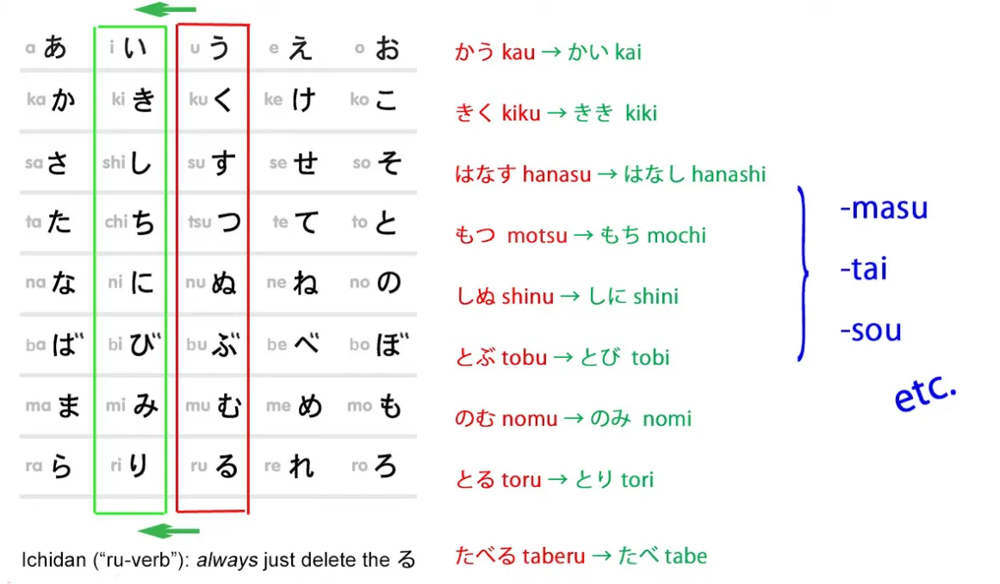
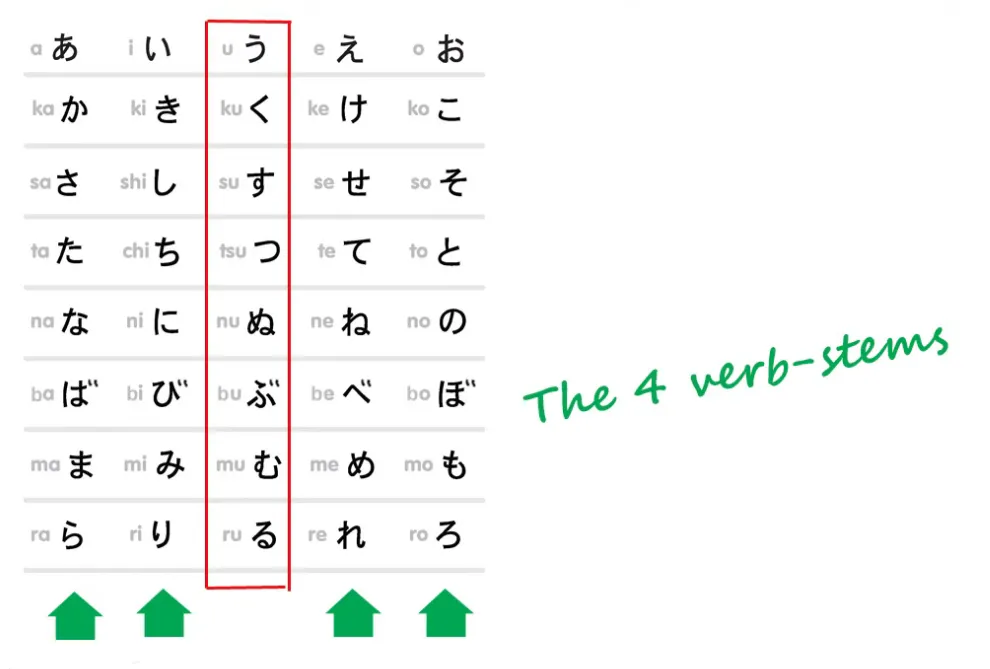
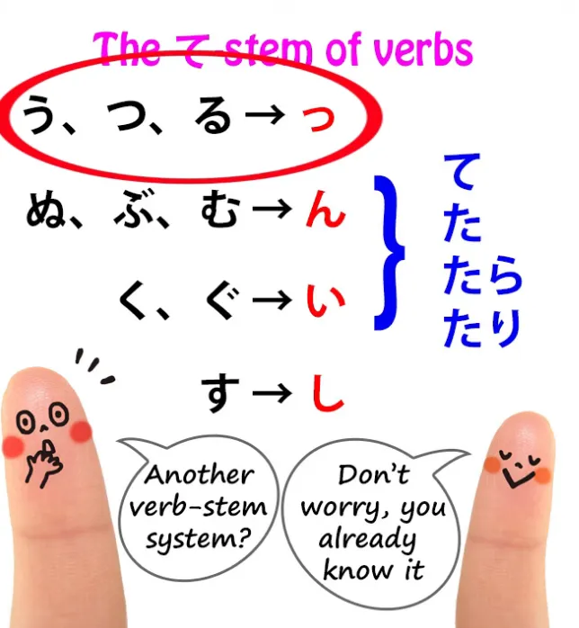
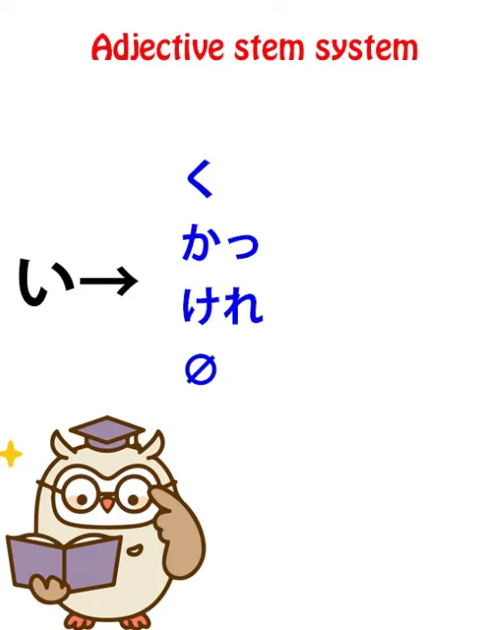
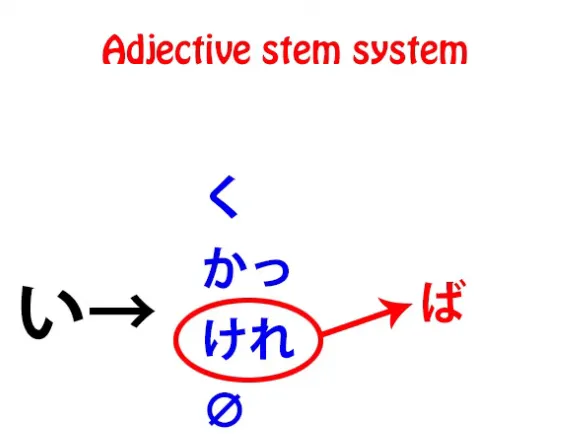
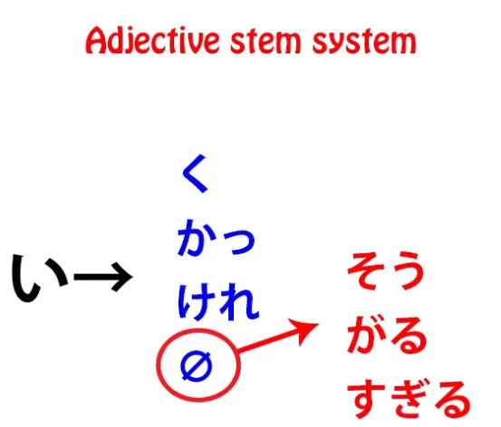
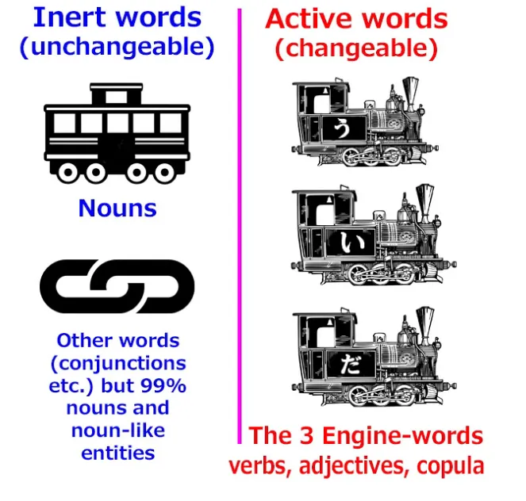
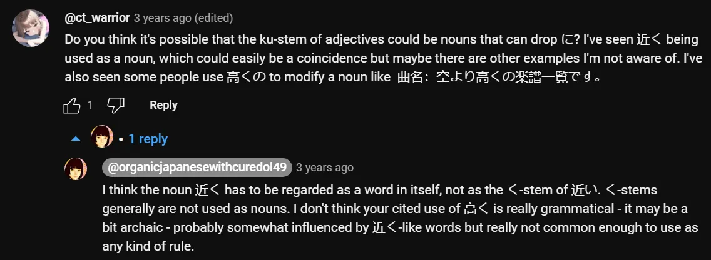

# **81. Prinsip umum semua bentuk kata dalam bahasa Jepang.**

[**Akhirnya! Struktur LENGKAP bahasa Jepang! Prinsip umum semua bentuk kata dalam bahasa Jepang. Pelajaran 81**](https://www.youtube.com/watch?v=uoj5l8-Ppws&amp;list;=PLg9uYxuZf8x_A-vcqqyOFZu06WlhnypWj&amp;ab;_channel=OrganicJapanesewithCureDolly)

こんにちは。

Hari ini kita akan membahas sesuatu yang belum pernah kita bahas sebelumnya, yaitu struktur keseluruhan, global, dan kosmik dari bahasa Jepang. Kita pernah menyentuhnya di masa lalu, tetapi saya belum pernah membahasnya secara menyeluruh. Dan ada alasan mengapa saya tidak melakukannya, yang akan kita bahas sebentar lagi.

Apa yang akan kita bahas dimulai dengan sesuatu yang sudah Anda ketahui, yaitu sistem akar kata. Jika Anda mengikuti pelajaran saya, Anda tahu bahwa tidak ada konjugasi dalam bahasa Jepang.

::: info
Seperti yang Anda ketahui, jangan anggap ini sebagai pernyataan definitif, ini hanya untuk menghindari asosiasi yang muncul dari kata <code>conjugation</code> dalam konteks bahasa-bahasa Eropa, karena sebenarnya ada bentuk konjugasi dalam bahasa Jepang, seperti yang dijelaskan dalam tangkapan layar catatan Pelajaran 7.5 dari buku Dolly.
***Kata kerja hanya melakukan perubahan kecil pada satu kana di akhir,*
:::

**mengubahnya dari kana baris &quot;う&quot; menjadi salah satu dari empat baris lainnya.**

**Kemudian kita menambahkan berbagai jenis kata bantu, kata benda bantu, kata kerja bantu, dan kata sifat bantu.**

Namun, yang tidak saya jelaskan saat memperkenalkan hal ini adalah bahwa hal ini jauh lebih kompleks dari itu. Saya membiarkan Anda berpikir mungkin bahwa bentuk &quot;て&quot;, seperti yang disebut, dan kata sifat memiliki semacam konjugasi minor yang mirip dengan **konjugasi Eropa** dan materi yang diajarkan di buku teks. Ini tidak benar.

Saya tidak membicarakannya terlalu banyak saat itu karena menurut saya sebelum kalian benar-benar menguasai dasar-dasarnya, hal ini bisa terasa agak rumit dan sulit dipahami. Tapi sekarang mari kita bahas dengan benar.

## Kata Aktif &amp; Kata Statis/Inert

Seperti yang Anda ketahui, **ada dua jenis kata dalam bahasa Jepang**, yaitu **kata aktif yang dapat berubah dan kata statis** *(inert)**.**

**Kata aktif yang dapat berubah terdiri dari tiga jenis kata yang dapat menjadi inti kalimat**, yaitu **kata kerja, kata sifat, dan kata penghubung**.

**Kata statis hampir semuanya adalah kata benda, dan mereka tidak pernah berubah sama sekali.** Kata-kata tersebut tidak dapat berubah dengan cara apa pun.

---

Sekarang, **semua kata yang dapat berubah berubah dengan cara yang persis sama**. Kita harus mengetahui dua hal tentang kata-kata tersebut. **Yang pertama adalah bahwa tidak ada yang berubah dalam bentuk dasar sebuah kata kecuali kana terakhir**.

Itu adalah kana baris *う* pada kata kerja atau *い* pada kata sifat.

**Tidak ada yang berada di depan itu yang dapat berubah.** Itu sama tetap, pasti, dan tidak berubah seperti kata benda. Hanya kana terakhir itulah yang bisa berubah **dan kemudian dapat memiliki unsur-unsur yang melekat padanya.**

**Hal kedua yang perlu diketahui adalah bahwa semuanya berubah sesuai dengan sistem pembantu akar kata.** Jadi, meskipun saya memperkenalkan bentuk て seolah-olah itu adalah <code>form</code>, semacam perubahan bentuk atau konjugasi dari kata tersebut, **pada kenyataannya itu adalah sistem akar-penolong tersendiri.**

**Dalam tata bahasa Jepang yang sebenarnya, sebagaimana diajarkan oleh penutur asli Jepang kepada penutur asli Jepang,** **-た, dan -て dianggap sebagai penolong, sebagai entitas tersendiri yang melekat pada akar kata.**

Jadi pada dasarnya **kata kerja tidak memiliki satu sistem akar kata, melainkan dua sistem akar kata.** Dan itulah salah satu alasan mengapa saya tidak langsung memperkenalkannya, karena hal itu terasa sedikit membingungkan pada awalnya.

## Sistem Akar Kata &quot;て&quot;

Sistem akar kata kedua, yaitu akar kata &quot;て&quot;, sudah Anda ketahui. Kita akan membahasnya secara singkat.

### Kelompok &quot;う&quot; - &quot;つ&quot; - &quot;る&quot;

**Ada kelompok う - つ - る, yang mengubah kana terakhir, う, つ, atau る,** **menjadi っ kecil, dan kemudian kita dapat menambahkan - た atau - て.**

### Kelompok ぬ - ぶ - む

**Ada grup ぬ - ぶ - む: ini mengubah kana terakhir, ぬ, む, atau ぶ, menjadi ん,** dan **pengaruh kelembutan kana-kana tersebut serta ん itu sendiri** **mempengaruhi secara eufonik - て atau - た, mengubahnya menjadi で atau - だ.**

### く - Kelompok ぐ

**く dan ぐ berubah menjadi い** — dan sebentar lagi kita akan melihat **bahwa hubungan antara い dan baris kana か, か - き - く - け - こ,** **adalah sesuatu yang terus berperan dalam kata sifat.**

Kita akan membahasnya sebentar lagi.

**く dan ぐ berubah menjadi い, dan dalam kasus ぐ, tanda 〃 pada く, bunyi lembut tersebut,** **sekali lagi memiliki efek eufonik pada - て atau - た yang mengikutinya, mengubahnya menjadi で atau - だ.**

### す <code>group</code>

**Dan terakhir, す dalam bentuk て melakukan hal yang sama persis seperti saat membentuk akar kata い** **dalam sistem akar kata reguler: menjadi し.**

---

Jadi, inilah sistem akar kata kerja kedua, **akar kata &quot;て&quot;**, dan **kita menggunakan ini tidak hanya untuk akhiran &quot;て&quot; dan &quot;た&quot;, tetapi juga untuk menambahkan kata bantu seperti akhiran kondisional &quot;たら&quot; dan &quot;たり&quot;.**

## Sistem Akar Kata Sifat

**Kata sifat juga memiliki sistem akar kata sendiri. Faktanya, kata sifat memiliki empat akar kata.**

**Anda dapat membentuk akar kata sifat dengan menghilangkan い, sama seperti kita menghilangkan る pada kata kerja ichidan,** **atau dengan mengubah い menjadi salah satu dari tiga か -row kana, か, け, atau く.**

---

Dan seperti yang telah kami sebutkan sebelumnya, **ada hubungan antara か -row kana dan い**, sehingga dengan akar kata kerja て, kata kerja yang berakhiran く, き berubah menjadi い, dan hal yang sama berlaku untuk versi ten-ten 〃, ぐ.

**Jadi, kita memiliki empat akar kata untuk kata sifat, dengan menghilangkan い atau mengubahnya menjadi か, け, atau く.**

### Akar kata &quot;く&quot;

**Akar kata &quot;く&quot; menambahkan kata sifat bantu &quot;-ない&quot;, yang mengubah kata sifat menjadi negatif,**

dan juga jika berdiri sendiri — dan seperti yang kita ketahui, akar kata terkadang bisa berdiri sendiri.

**Jadi, A-stem い dari sebuah kata kerja yang berdiri sendiri menjadi kata benda.** **A-stem え yang berdiri sendiri membentuk kalimat imperatif.**

**A-stem く dari sebuah kata sifat yang berdiri sendiri mengubah kata sifat tersebut menjadi kata keterangan.** Jadi, kita dapat mengatakan <code>早い車</code> (mobil yang cepat) atau <code>**速く**走る</code> (lari **cepat***, cepat adalah kata keterangan*).

**Dan く juga digunakan, tentu saja, untuk membentuk bentuk て:** kita hanya menambahkan - て di akhir く.

### Akar kata &quot;か&quot; (かっ)

**Akar kata &quot;か&quot; memiliki tambahan kecil, yaitu &quot;っ&quot;, sehingga menjadi &quot;かっ&quot;** dan kita gunakan itu untuk menambahkan akhiran masa lampau &quot;た&quot;,
sehingga kita mengatakan &quot;かった&quot;: <code>おいしかった</code> (itu enak sekali).

### I-stem &quot;け

&quot; (けれ

)

**Akhiran &quot;け

&quot; juga memiliki penambahan, yaitu -れ

sehingga kita memiliki akhiran -けれ

,** **dan pada itu kita menambahkan penambahan -ば

, yang merupakan bentuk kondisional** (dan saya telah membuat serangkaian video tentang kondisional seperti -ば

dan -たら

, dan saya akan menyertakan tautan di atas dan di bagian informasi di bawah).[[30]](./30-japanese-conditionals- と.md)[[31]](./31-the- ば - れば -conditional.md)[[32]](./32-the- たら - なら -conditionals.md)[[33]](./33-limiting-terms- だけ - しか - ばかり - のみ.md)

### Akar kata nol

**Ketika kita menghilangkan -い

sepenuhnya, kita dapat menggunakannya untuk menggabungkan kata-kata seperti kata benda bantu -そう

,** **yang berarti sesuatu tampak memiliki kualitas tersebut,** dan **juga untuk menggabungkan kata kerja bantu sepertiがる

**.

Jadi, pada akar kata A-stem <code>**欲し**い</code> kita dapat menambahkan **がる** untuk membuat <code>**欲しがる**</code> (**menunjukkan tanda-tanda menginginkan sesuatu, tampak ingin sesuatu**). Atau pada **kata bantu たい**, kita dapat menghilangkan &quot;い&quot; dan menambahkan &quot;がる&quot; sehingga menjadi <code>**たがる**</code> (**menunjukkan tanda-tanda ingin melakukan sesuatu, tampak ingin melakukan sesuatu**).

---

**Jadi, seperti yang Anda lihat, kata sifat memiliki sistem akar kata tersendiri yang dapat kita tambahkan berbagai kata bantu, seperti versi yang lebih kecil dari yang dimiliki kata kerja.**

## Kata Hubung

Lalu, bagaimana dengan kata hubung? Itulah elemen dinamis lainnya, mesin lainnya.

Nah, kopula hanya memiliki satu kana *(dalam hal ini だ)* sebagai awalnya,
jadi umumnya kita menambahkan sesuatu ke sana.

**Kita dapat menambahkan *っ* kecil, untuk membuat akar kata *だ~**, *(saya kira tanda ~ di sini berarti *っ* = *だっ*)* **yang kemudian dapat ditambahkan *-た* (penolong masa lampau) untuk membentuk <code>だった</code>.** Kita dapat menambahkan - ろ, sehingga dapat ditambahkan helper volitional untuk menghasilkan <code>だろう</code>.

**Dan dalam bentuk て, だ-nya sendiri berubah — tentu saja hanya memiliki satu kana, だ adalah kana terakhir — ** **dan itu dapat menjadi <code>で</code> untuk membentuk bentuk て.** Ini sedikit kurang teratur dibandingkan yang lain, tetapi itu sebenarnya karena **hanya ada satu kopula**, sehingga tidak memiliki banyak hal lain dalam kelompok yang sama untuk menjadikannya teratur.

## Ringkasan

Jadi, itulah struktur umum bahasa Jepang.

**Bahasa Jepang memiliki dua jenis kata, yaitu kata aktif dan pasif, serta kata yang berubah dan kata yang tidak berubah.**

**Kata-kata pasif** **tidak bisa berubah sama sekali, tetapi mereka bisa menambahkan partikel yang memberi tahu kita apa yang sedang mereka lakukan.** Dan untungnya, **karena mereka tidak pernah berubah sama sekali, tidak ada yang rumit tentang kata benda.**

**Mereka selalu menambahkan partikel yang sama untuk melakukan fungsi yang sama, terlepas dari kata benda apa yang sedang kita bicarakan.** Jauh lebih sederhana daripada sistem tata bahasa asing.

**Elemen aktif, seperti kata kerja, kata sifat, dan kopula, hanya dapat mengubah kana terakhir** **dan mereka selalu melakukannya sesuai dengan sistem akar-penolong.**

Ketika kita memahami hal itu, semuanya menjadi jauh lebih mudah untuk dipahami dan ditangani.

