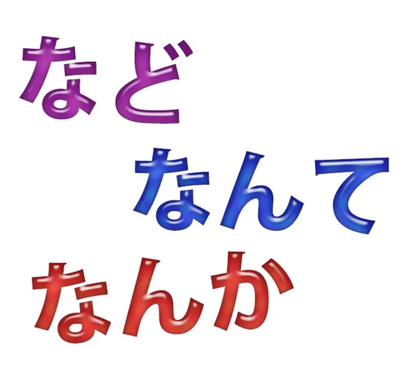
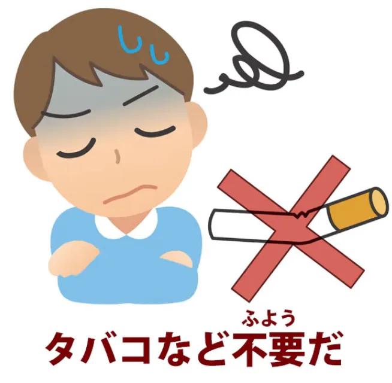
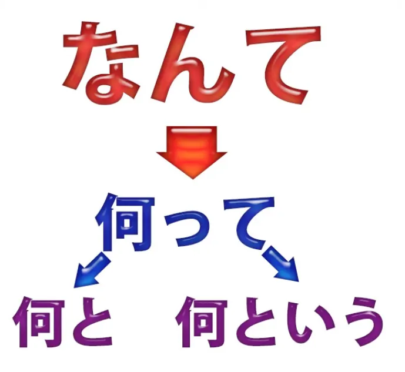
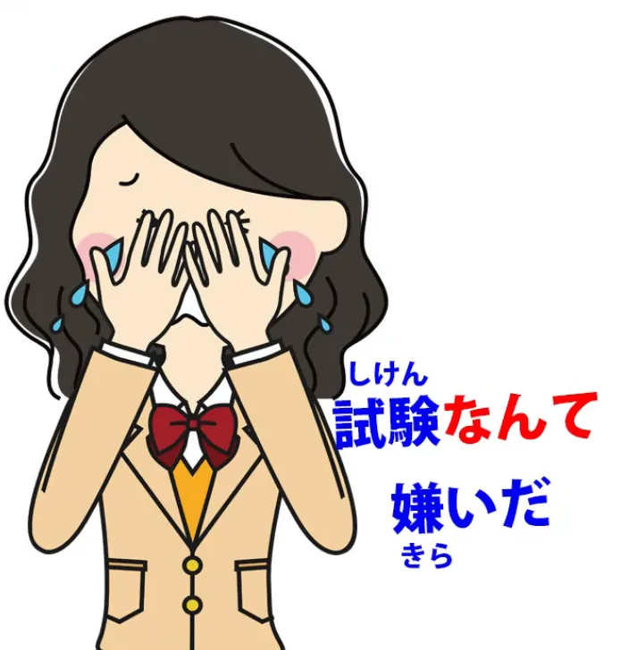
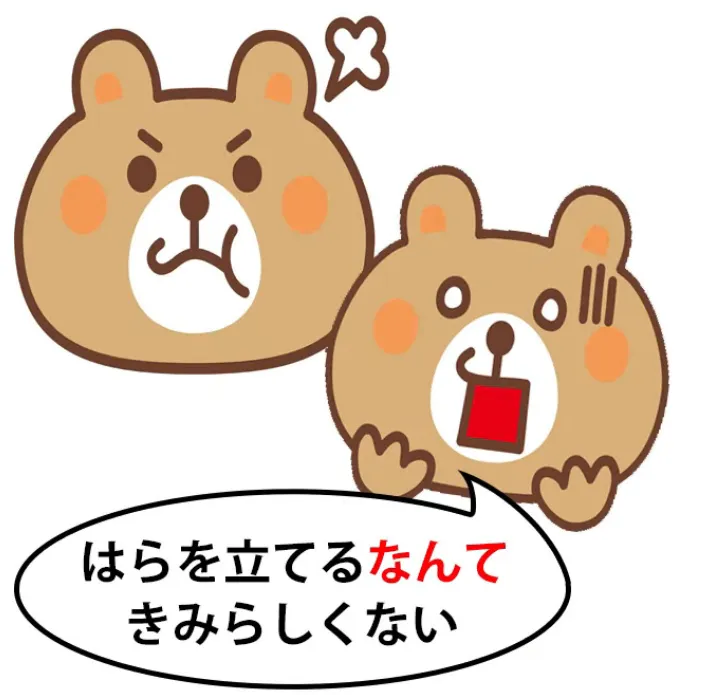
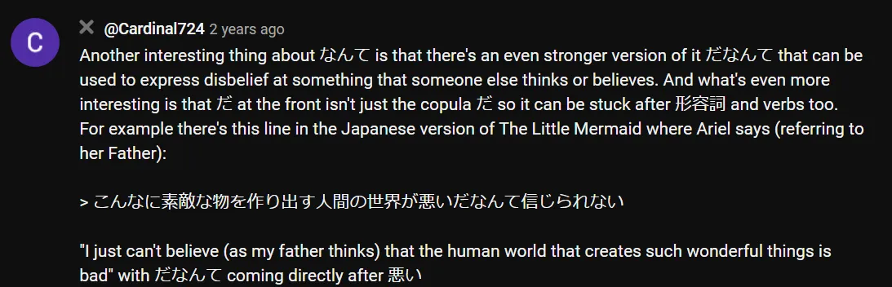
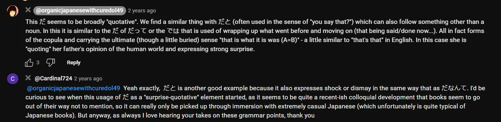

# **82. なんて、なんか、など: Penjelasan 3 Kata Umum.**

[**なんて Nante なんか Nanka など Nado: Penjelasan 3 Kata Umum. Pelajaran 82**](https://www.youtube.com/watch?v=OlUG9ym-b4Y&amp;list;=PLg9uYxuZf8x_A-vcqqyOFZu06WlhnypWj&amp;ab;_channel=OrganicJapanesewithCureDolly)

こんにちは。

Hari ini kita akan membahas tiga kata yang sering Anda temui selama proses imersi. **Kata-kata ini memiliki spektrum makna yang cukup luas, dan itu berarti kamus tidak benar-benar dapat mencakup seluruh rentang maknanya,** terutama ketika, seperti yang sering terjadi, kata-kata tersebut digunakan dalam konteks yang sangat informal. Dan saya ingin mengucapkan terima kasih kepada semua orang yang memberi tahu saya kata-kata mana yang menyulitkan mereka selama proses imersi.

Hal ini membantu saya mengetahui apa yang harus dibahas dan urutan pembahasannya. Banyak orang ingin tahu tentang <code>なんて</code> dan <code>なんか</code>. Jadi, jika Anda memiliki kata-kata yang menyulitkan Anda, silakan tuliskan di kolom Komentar di bawah ini. Sangat membantu untuk mengetahui apa yang menjadi penyebab masalah.

**Jadi, ketiga kata tersebut adalah <code>など</code>, <code>なんて</code> dan <code>なんか</code>.** **Kata-kata ini memiliki arti yang berbeda tetapi tumpang tindih di beberapa area.**

Dan yang paling sederhana adalah <code>など</code>, jadi kita akan mulai dengan itu.

##など

**<code>など</code> pada dasarnya berarti hampir sama dengan <code>etcetera</code> dalam bahasa Inggris, tetapi hal yang perlu diingat dalam bahasa formal** adalah bahwa **istilah ini memiliki status yang lebih tinggi daripada <code>etcetera</code> dalam bahasa Inggris.**

**Dalam bahasa Inggris, <code>etcetera</code> sering dianggap sebagai jalan pintas.** **Ini adalah cara untuk tidak benar-benar mengatakan apa yang Anda maksud.** **Dalam bahasa Jepang, kata ini memiliki status yang jauh lebih tinggi. Spektrum maknanya lebih luas.**

**Anda akan menemukannya baik dalam tulisan yang sepenuhnya formal maupun dalam percakapan dan tulisan informal.** Ini adalah bagian yang tak terpisahkan dari bahasa tersebut.

---

Sebagai contoh **penggunaan formal**-nya, definisi kamus dari kata <code>車窓</code> — dan <code>車窓</code> adalah salah satu kata yang telah saya bahas [**dalam video sebelumnya**](https://www.youtube.com/watch?v=FaSPO5lL0yQ&amp;t;=0s&amp;ab;_channel=OrganicJapanesewithCureDolly), kata-kata yang terdiri dari dua atau lebih kanji yang sebenarnya bukanlah kata dalam arti kata dalam bahasa Inggris, artinya, **mereka sebenarnya adalah frasa**.

**Kata-kata ini menggabungkan dua entitas yang sudah dikenal—yang sudah kita ketahui jika kita sudah banyak belajar bahasa Jepang—menjadi sesuatu yang dalam bahasa Inggris hanya akan disebut frasa.** Jadi, kita bisa memasukkan kata-kata ini ke dalam Anki jika ingin mengingatkan diri sendiri bahwa mereka ada, tetapi **kita tidak boleh memperlakukan mereka sebagai entitas yang sepenuhnya baru.**

**Mereka sebenarnya hanya seperti frasa, dan yang satu ini sangat mirip dengan frasa bahasa Inggris <code>car window</code>, yang bukan kata, melainkan hanya frasa.** Jika kita tahu <code>car</code> dan kita tahu <code>window</code>, kita tahu apa itu <code>car window</code> itu.

Jadi, jika kita tahu <code>車</code> dan kita tahu <code>窓</code> dan kita tahu bacaan kedua kata tersebut, yaitu <code>しゃ</code> dan <code>そう</code>, maka <code>しゃそう</code> sebenarnya tidak menimbulkan masalah, kecuali bahwa **kita perlu mengingat bahwa <code>しゃ</code>, bacaan on-nya <code>車/くるま</code>, merujuk pada jenis kendaraan yang lebih luas.** <code>くるま</code> biasanya hanya berarti <code>自動車/じどうしゃ</code> (sebuah mobil) **sedangkan <code>しゃ</code> dapat merujuk pada segala jenis kendaraan darat.**

Sepeda adalah <code>自転車/じてんしゃ</code>, kereta api adalah <code>電車/でんしゃ</code>, dan seterusnya. Dan definisinya adalah: <code>自動車**など**の窓</code>.

Jadi pada dasarnya itu berarti <code>the window of an automobile, **etcetera**</code>, yang **dalam hal ini berarti segala jenis kendaraan darat yang memiliki jendela**, jadi bukan <code>自転車</code> tetapi <code>電車</code>, dan seterusnya: <code>the window of a vehicle</code>.

::: info
Perhatikan bagaimana partikel &quot;など&quot; di sini digunakan tepat setelah &quot;自転車&quot; (bahkan mendahului partikel &quot;の&quot;).  
&quot;など&quot; tampaknya digunakan langsung setelah kata benda / frasa kata benda seperti partikel lainnya (misalnya, &quot;など&quot; juga merupakan partikel). Namun, jika melihat beberapa kalimat Yomichan di mana partikel ini digunakan, sepertinya partikel ini memiliki prioritas lebih tinggi daripada partikel logis seperti の, が, を, karena partikel ini adalah yang pertama menempel pada/setelah kata benda yang ditempelinya, sedangkan partikel logis baru mengikuti setelah partikel ini menempel. Seperti yang terlihat di atas atau dalam kalimat dari Yomichan:
&gt;大学では<code>**フランス語やドイツ語**</code>など<code>**を**</code>勉強した。

:::

Dan ini <code>など</code> adalah penggunaan kata yang sangat umum.  
**Kata ini digunakan secara bebas dalam bahasa Jepang formal maupun informal.**

### Penggunaan &quot;など&quot; dalam bahasa Jepang informal

**Dalam bahasa Jepang informal, <code>など</code> juga memiliki penggunaan lain**, **yang tumpang tindih dengan dua kata lain yang akan kita bahas.** **Kata ini dapat digunakan untuk merendahkan atau meremehkan kata yang disambungkannya secara halus.**

Sekarang, <code>denigrate</code> dan <code>belittle</code> bukanlah kata yang tepat untuk digunakan di sini, tetapi saya rasa tidak ada kata yang tepat dalam bahasa Inggris. **Kata ini memberikan kesan negatif, yang dalam kasus <code>など</code> biasanya berarti meremehkan atau sedikit menolak apa pun itu.**

Jadi kita mungkin mengatakan, <code>タバコ**など**不要だ</code>, yang berarti <code>I&#x27;ve no use for cigarettes</code>. Sekarang, <code>タバコは不要だ</code> pada dasarnya akan memiliki arti yang sama **(perhatikan bahwa <code>など</code> menghilangkan partikel lain)**. *- jadi Dolly mengonfirmasi pengamatan saya di atas, kecuali bahwa di sini ia secara langsung menghilangkan partikel &quot;は&quot;, kemungkinan karena partikel tersebut tidak logis.*

---

**Perbedaan satu-satunya di sini adalah bahwa <code>など</code> memberikan pandangan yang sedikit meremehkan terhadap rokok.** Jadi, cara kita bisa membacanya adalah seperti ini, dalam bahasa Inggris, <code>I don&#x27;t need stuff like cigarettes</code>. **Sebenarnya, ini tidak berarti secara harfiah.**

**Ini bukan berarti saya tidak membutuhkan rokok, cerutu, pipa, atau hookah.** **Artinya, saya tidak membutuhkan hal semacam itu — itu adalah sesuatu yang tidak saya butuhkan dalam hidup saya.** Dan seperti yang saya katakan, penggunaan ini tumpang tindih dengan dua kata kita yang lain.

**Keduanya <code>なんか</code> dan <code>なんて</code> dapat digunakan dengan cara memberikan konotasi negatif pada kata benda yang mengikutinya.** **Yang paling kuat dan paling kasual di antara ketiganya adalah <code>なんか</code>,** **dan <code>なんて</code> berada di tengah-tengah.**

## なんか

**Jadi, <code>なんか</code> sebenarnya merupakan singkatan dari <code>何か/なにか</code> (sesuatu)**, tetapi memiliki cukup banyak penggunaan dalam bahasa sehari-hari.

Dan ini adalah ungkapan yang merendahkan yang kadang-kadang kita dengar dengan sangat kuat dalam kasus di mana... well, katakanlah dalam sebuah anime, seorang adik perempuan marah pada kakak perempuannya. Dia mungkin berkata, <code>お姉ちゃん**なんか**大嫌い!</code> (Aku benar-benar benci **hal-hal seperti** kakak perempuanku).

Tentu saja, **itu bukan arti harfiah yang dia maksud.** **Dia tidak bermaksud membenci <code>stuff like</code> kakak perempuannya,** **tetapi dengan menggunakan ungkapan ini — <code>stuff like you</code>, <code>stuff like my big sister</code> — ** **kamu menyoroti hal yang kamu bicarakan dengan nada yang sangat merendahkan.**

---

**Bisa juga lebih ringan:** kita bisa mengatakan, <code>サッカー**なんか**興味がない</code> (Aku tidak tertarik **pada hal-hal seperti** sepak bola / Aku tidak tertarik pada sepak bola). **Dan bisa juga lebih meremehkan lagi:** kita mungkin berkata, <code>雨なんか平気だ</code>.

Dan yang kita maksud di sini adalah &quot;*(Hal-hal/Sesuatu seperti)* Hujan tidak menggangguku / Aku tidak terganggu oleh *(hal-hal/sesuatu seperti)* hujan / Aku baik-baik saja dengan *(hal-hal/sesuatu seperti)* hujan&quot;. **Dan <code>なんか</code> hanya menyoroti hujan dengan nada yang sedikit meremehkan,** **menunjukkan betapa sedikitnya kita mengkhawatirkannya.**

### Penggunaan &quot;なんか&quot; terhadap diri sendiri

Dan **istilah ini sering digunakan untuk diri sendiri**, seperti dalam <code>私なんか</code>, dan **ini sering digunakan untuk menekankan posisi yang dirasa inferior** **atau posisi sulit yang sedang dihadapi**, misalnya, <code>私なんかまるで子供扱いだ</code> (Saya diperlakukan seperti anak kecil).

### なんか - singkatan dari なにか / 何か

**Sekarang, makna dasar dari <code>なんか</code>, seperti yang saya katakan, sebenarnya** **adalah singkatan dari <code>なにか / 何か</code>, yaitu <code>something</code>.**

Dan **bisa digunakan hanya sebagai singkatan dari <code>なにか / 何か</code>** dalam, misalnya, <code>**なんか**心配はある?</code>, yang hanya berarti <code>**何か**心配はある</code> atau (Apakah ada **beberapa** kekhawatiran? Apakah **ada sesuatu** yang mengkhawatirkanmu?).

### なんか sebagai <code>something</code>, <code>somewhat</code> untuk membuat hal-hal menjadi lebih samar

Sekarang, **dari sana, hal ini berlanjut untuk mengawali hal-hal secara berurutan, seperti dengan <code>something</code>** **atau <code>somewhat</code> dalam bahasa Inggris, untuk membuatnya sedikit lebih samar.**

Jadi kita mungkin mengatakan <code>**なんか**違う</code> (**ada sesuatu yang** berbeda */ **ada sesuatu** yang berbeda* — Saya tidak yakin apa itu, tapi ada sesuatu yang berbeda).
<code>なんか違う.</code>

### なんか sebagai <code>somehow / for some reason</code>

Sekarang, dari situ artinya menjadi <code>somehow</code>. Jadi kita bisa mengatakan <code>**なんか**好きじゃない</code> (**entah kenapa**, saya tidak suka / **Karena suatu alasan**, saya tidak suka).
<code>**なんか**好きじゃない</code>

### &quot;なんか&quot; dalam percakapan yang sangat santai / asal-asalan sebagai <code>kinda</code> x

Sekarang, dari situ situasinya semakin buruk. **Artinya menjadi semakin kabur.**

**Jadi dalam percakapan yang sangat santai dan (menurut saya) agak asal-asalan,** **kamu bisa mendengar <code>なんか</code> di awal kalimat** **dan kemudian beberapa kali selama kalimat: <code>なんか this, なんか that</code>.**

---

**Dan ketika digunakan seperti itu, sebenarnya digunakan seperti <code>kinda</code> atau <code>like</code> dalam bahasa Inggris.** Dan, sama seperti dalam bahasa Inggris, **ini adalah cara bicara yang ceroboh.** **Ini bukan bahasa Jepang yang baik, tetapi Anda mungkin mendengar orang berbicara seperti ini di beberapa anime, dan sebagainya.**

**Fungsinya sebenarnya, seperti halnya <code>like</code> atau <code>kinda</code> dalam bahasa Inggris, adalah** **hanya untuk membuat hal-hal menjadi sedikit kabur dan** **membebaskan diri dari kebutuhan untuk mengekspresikan diri secara tepat.** Hanya sekadar mengatakan, seperti, apa pun yang terlintas di pikiran Anda, seperti — <code>なんか... なんか... なんか</code>.

Jadi, **kita harus waspada terhadap penggunaan <code>なんか</code>** **dan menyadari bahwa hal itu sebenarnya tidak berarti apa-apa.**

##なんて

**<code>なんて</code> pada dasarnya adalah singkatan dari <code>何って</code>** dan saya sudah membuat video lain tentang ini - って, yang merupakan singkatan dari - と atau <code>-という</code>.  [[18]](./18- って - は -mysteries-explained- おうとする - とする - として - という - っていう.md)

Dan hal yang sama berlaku untuk <code>なんて</code>. Jadi, dalam penggunaan yang paling sederhana dan mendasar, kata ini digunakan, misalnya, dalam kalimat <code>**なんて**言った?</code>, yang berarti <code>**what** did you say?</code>

Penutur bahasa Inggris mungkin tergoda untuk bertanya <code>**なにを**いった?</code> (**apa** yang kamu katakan?). **Tapi itu bukan bahasa Jepang yang wajar.**

Kita bisa mengatakan <code>なんと言った</code>, tetapi sebenarnya **lebih alami dalam percakapan santai** untuk mengatakan <code>**なんて**言った?</code> (**apa** yang baru saja kamu katakan?), yang tidak terlalu mudah diterjemahkan ke dalam bahasa Inggris karena menggunakan partikel kutipan *(と)* tersebut, meskipun **partikel ini telah berubah menjadi <code>なんて</code> dalam percakapan sehari-hari.**

### Partikel kutipan *(the なんて)* sebagai <code>What a (this)</code> atau <code>What a (that)</code>

Sekarang, kamu juga akan sering melihatnya dengan arti <code>what</code> dalam bahasa Inggris seperti yang digunakan dalam ungkapan-ungkapan seperti <code>**What a** nice day!</code>, <code>**What a** stupid person!</code>, <code>**What a** beautiful flower!</code> dan seterusnya.

**Dan ini adalah singkatan dari <code>なんという / 何という</code>, tetapi lebih sering daripada tidak,** **bahkan dalam percakapan yang tidak terlalu santai, digunakan sebagai <code>なんて</code>.** <code>**なんて**美しい景色だ!</code> (**Betapa** indahnya pemandangan ini!)

Dan, sama seperti dalam bahasa Inggris, **ini <code>なんて</code> dapat digunakan untuk mengawali** **reaksi yang cukup kuat terhadap apa pun.** **Reaksi tersebut bisa negatif; bisa juga positif.** **Kita mengatakan <code>what a (this)</code> atau <code>what a (that)</code>.**

### Penggunaan &quot;なんて&quot; secara merendahkan

Sekarang, **istilah ini juga digunakan**, seperti yang telah kita bahas sebelumnya, **dalam konteks merendahkan yang melekat pada kata benda.** Jadi, misalnya, kita bisa mengatakan <code>試験**なんて**嫌いだ</code> (Saya benci ujian); <code>お金**なんて**いらない</code> (Saya tidak mau uang).

**Seperti <code>なんか</code>, kata ini tidak hanya menekankan kata benda yang mengikutinya** **tetapi juga menunjukkan sikap negatif atau meremehkan terhadapnya.**

### Penggunaan &quot;なんて&quot; untuk mengekspresikan keterkejutan

**Dan kata ini juga dapat digunakan di akhir kalimat lengkap untuk mengekspresikan keterkejutan.**

Jadi **dalam arti ini, kata tersebut agak mirip dengan yang pertama** yang telah kita bahas, **yaitu <code>what a (this)</code> atau <code>what a (that)</code>, yang muncul di awal.**

---

**Ungkapan ini juga dapat digunakan di akhir kalimat untuk mengekspresikan keterkejutan atau, dalam beberapa kasus, ketidakpercayaan atau keraguan.** Jadi kita mungkin akan mengatakan, <code>冬に燕を見る**なんて**</code> (melihat burung layang-layang di musim dingin + <code>なんて</code>).

Apa yang <code>なんて</code> yang sedang dilakukannya? Nah, **ini mengubah keseluruhan kalimat menjadi ungkapan**, **mirip dengan <code>what a (this)</code> atau <code>what a (that)</code> .**

**Jadi, yang kita katakan adalah sesuatu seperti <code>Gosh, imagine seeing a swallow in winter!</code>**

---

**Dan penggunaan <code>なんて</code> di bagian akhir, setelah engine dari sebuah pernyataan,** **dapat digunakan sebagai bagian dari kalimat yang lebih panjang.** Jadi, misalnya, kita bisa mengatakan <code>腹を立てる**なんて**君らしくない</code>.

Sekarang, **<code>腹を立てる</code>**secara harfiah berarti <code>stand your stomach</code>, **tetapi ini adalah ekspresi yang berarti <code>get angry</code>.** **Jadi keseluruhan kalimat tersebut berarti <code>getting angry, that&#x27;s not like you</code>.**

Dan saya sudah membahas hal ini <code>らしい</code> dan <code>らしくない</code> di video lain.[[25]](./25- らしい -vs- そうだ - そうです - っぽい -ppoi.md) Jadi, jika Anda belum familiar dengan video-video tersebut, saya akan menyertakan tautan di atas dan di bagian informasi di bawah.

---

Sekarang, **kita bisa menghapus <code>なんて</code> di sini dan tentu saja kita harus memasukkan partikel** dan mengatakan, <code>腹を立てる**のは**君らしくない</code>. **Namun <code>なんて</code> ini mengungkapkan keterkejutan kita tentang hal ini** **karena itu tidak seperti orang yang bersangkutan.**

---

**Dan perhatikan bahwa ini bukan partikel merendahkan <code>なんて</code>, yang melekat pada kata benda.** **Ini melekat pada kalimat lengkap,** **jadi kita mengekspresikan keterkejutan kita tentang seseorang yang marah** **dan kemudian menambahkan komentar bahwa itu tidak seperti dia.**

### なんて sebagai bentuk samar dari という

Dan terakhir, **kita bisa menggunakannya dengan cara yang kurang lebih kembali** **ke makna asli <code>-という</code>, tetapi menambahkan sedikit ketidakjelasan padanya.**

Jadi, jika kita mengatakan <code>山田**なんて**人は知らない</code>, kita berarti <code>I don&#x27;t know anyone **called** Yamada</code>. Sekarang, **bagian <code>なんて</code> di sini bisa diganti dengan <code>-という</code>**: <code>山田**という**人は知らない</code>.

Jadi apa bedanya menggunakan <code>-という</code> dan menggunakan <code>なんて</code>?

---

Nah, <code>山田**という**人は知らない</code> sama seperti mengatakan dalam bahasa Inggris hanya <code>I don&#x27;t know a person **called** Yamada</code>. Namun <code>山田**なんて**人は知らない</code> lebih mirip dengan mengatakan <code>I don&#x27;t know any character **called** Yamada</code>.

**Hal ini menimbulkan lebih banyak keraguan dan pertanyaan dalam keseluruhan konteks.**

Jadi, kita telah membahas penggunaan utama dari ketiga kata atau ungkapan ini di sini. Ini tidak sepenuhnya lengkap, tapi saya rasa ini memberikan kunci dasar tentang cara kerjanya, apa artinya, dan bagaimana penggunaannya.

::: info
Wah, cukup banyak subjudul di bagian ini, heh* (ノ\*°▽°\*)  
Hanya ingin membuatnya sedikit lebih mudah dicari, jika perlu. Selain itu, ini cukup menarik:  

Maaf font-nya sangat kecil, YouTube lagi-lagi menyembunyikan bagian teks jika saya memperbesar tampilan entah kenapa...
:::