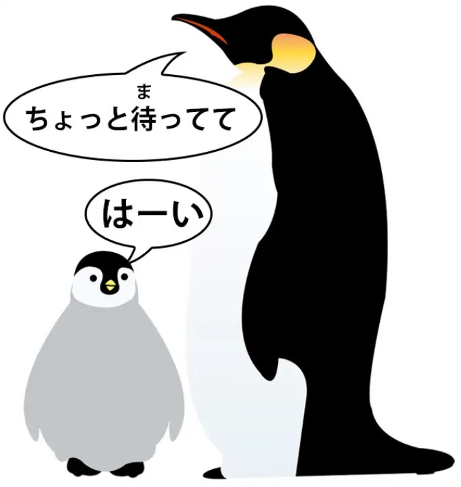
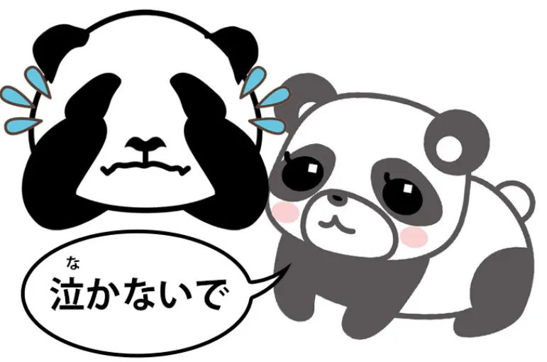
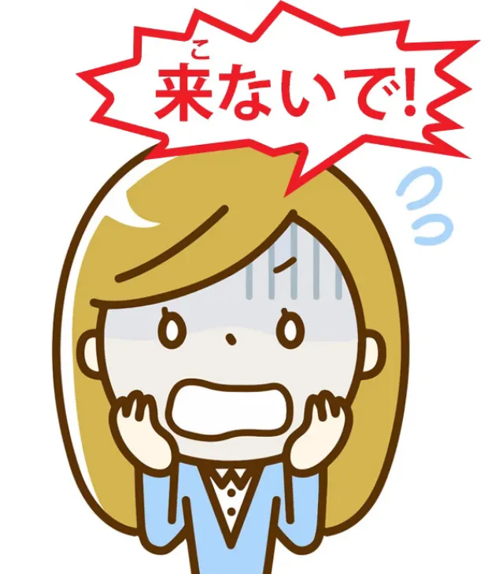
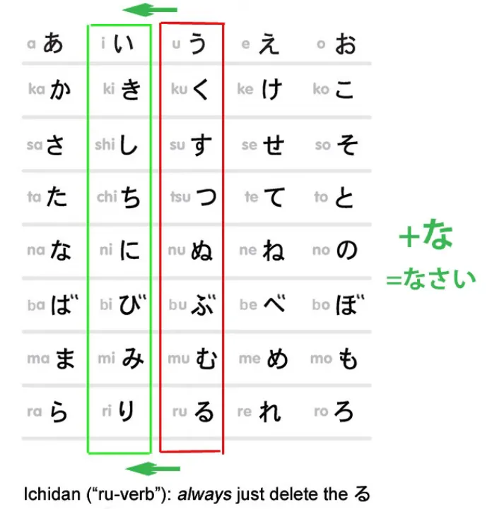
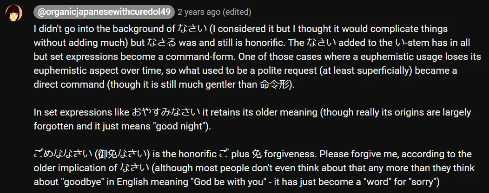
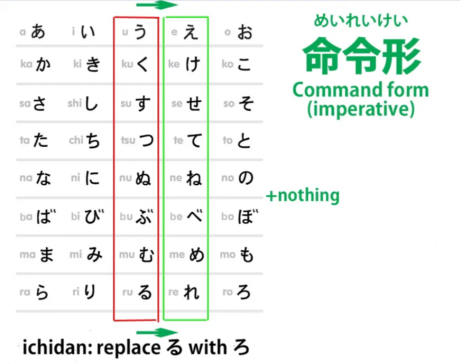
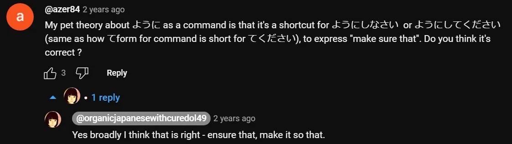

# **83. Tiga Tingkat Perintah dalam Bahasa Jepang: て -bentuk perintah, なさい, な -perintah, bentuk imperatif.** 

[**Tiga Tingkat Perintah dalam Bahasa Jepang: て -bentuk perintah, なさい, な -perintah, bentuk imperatif. Pelajaran 83**](https://www.youtube.com/watch?v=zayeW4AQ0Is&amp;list;=PLg9uYxuZf8x_A-vcqqyOFZu06WlhnypWj&amp;index;=90)

こんにちは。

Hari ini kita akan membahas cara membuat perintah dan permintaan dalam bahasa Jepang. Mungkin sebagian dari kalian sudah mengetahui beberapa di antaranya, tetapi saya rasa kita akan membahas lebih dalam beberapa hal yang mungkin belum kalian sadari.

**Kita akan membahasnya mulai dari yang paling tidak memerintah dan intens hingga yang paling intens**, jadi kita akan mulai dengan yang sudah kita semua kenal, yaitu bentuk &quot;て&quot;.

## Bentuk &quot;て&quot;

Beberapa sumber mungkin mengatakan bahwa bentuk &quot;て&quot; itu sendiri adalah bentuk perintah atau permintaan. **Itu hanya setengah benar. Itu adalah singkatan dari perintah atau permintaan.**

Jika kita mengatakan <code>ちょっと待って</code> (tunggu sebentar), **ini adalah singkatan** dari <code>ちょっと待ってください</code> (tunggu sebentar, tolong)

dan mungkin karena itulah bentuk ini yang paling tidak mungkin menyinggung, meskipun **tetap saja bersifat santai.**

Sekarang, terkadang Anda akan mendengar orang mengatakan bukan <code>ちょっと待って</code> tetapi <code>ちょっと待って**て**</code>. Apa yang terjadi di sini?

Pada dasarnya yang mereka katakan adalah <code>**Wait a little bit and I&#x27;ll be back**</code>. **Implikasinya adalah bahwa masa tunggu akan segera berakhir.**

Dan yang sebenarnya ini adalah singkatan dari <code>ちょっと待って**いて**</code>. Seperti yang kita ketahui <code>待っている</code> berarti <code>exist in a state of waiting</code>, <code>be waiting</code>, dalam bahasa Inggris. **Jadi <code>ちょっと待ってて</code> sebenarnya mengambil ini <code>待っている</code> dan mengubahnyて-form**, **sehingga apa yang diminta atau diperintahkan kepada Anda adalah berada dalam keadaan menunggu.**

Dan implikasinya adalah, **cukup berada dalam keadaan menunggu sebentar saja.** **Dan tentu saja ini tidak harus berupa menunggu, bisa apa saja,** **tetapi implikasinya adalah, lakukan saja sebentar, tinggalkan diri dalam keadaan itu untuk waktu yang singkat.**

---

**Jika kita tidak mengatakan <code>ちょっと</code>** (dan kita tidak harus melakukannya) **tidak ada yang menunjukkan waktu yang singkat, tetapi itulah implikasi yang selalu ada** **dari memberi tahu seseorang dengan bentuk &#x27;て&#x27; untuk berada dalam keadaan tertentu.**

### Bentuk &#x27;て&#x27; dengan kata sifat bantu &#x27;ない&#x27;

Hal lain yang perlu diketahui tentang bentuk て yang digunakan untuk memerintahkan atau meminta seseorang melakukan sesuatu adalah bahwa, seperti yang kita ketahui, **kata sifat negatif yang setara dengan kata kerja apa pun** **dibuat dengan hanya menambahkan kata sifat pembantu <code>ない</code> pada akar kata &quot;あ&quot;.**

**Dan kata sifat bantu <code>ない</code> sebenarnya tidak biasa karena memiliki dua bentuk kata kerja (て).** Kata sifat ini memiliki bentuk reguler (て), yang dibentuk sama seperti bentuk kata kerja lainnya (て), dengan menambahkan - て ke akar kata (く), jadi itu <code>なくて</code>, **tetapi juga memiliki bentuk tidak beraturan て <code>ないで</code>.**

Dan ketika ditambahkan ke kata kerja, bentuk ini hanya digunakan dalam dua jenis situasi.

#### Bentuk tidak beraturan て dari ない 

Yang pertama adalah ketika kita mengatakan <code>do B without doing A</code>, sehingga <code>話さないで歩く</code> berarti <code>walk without talking</code>. **Yang lainnya adalah ketika kita membuat perintah atau permintaan yang berbentuk て.**

Dan sekali lagi, ini adalah singkatan dari <code>ないでください</code>. Jadi jika kita mengatakan <code>**泣かないで**</code> (jangan menangis), **itu menggunakan bentuk sekunder dan khusus て dari <code>ない</code>**, **yang secara khusus digunakan untuk membuat perintah atau permintaan negatif**, **serta untuk satu penggunaan lain yang telah kita bahas.**

Dan terkadang dalam anime, kamu akan mendengar seseorang berteriak, saat monster mendekatinya, <code>来ないで!</code> (jangan datang).

Dalam bahasa Inggris, kita mungkin akan mengatakan <code>Keep away!</code> Dalam bahasa Jepang kita mengatakan <code>来ないで!</code>

::: info

::: 

## なさい

Sekarang, yang berikutnya dalam hierarki perintah kita adalah <code>なさい</code>. **<code>なさい</code> diterapkan pada akar kata kerja い -A-stem**, dan **ketika Anda menambahkan <code>なさい</code> pada akar kata kerja い, Anda mengubahnya menjadi perintah.**

Jadi, <code>起きなさい</code> adalah <code>get up / wake up</code>; <code>落ち着きなさい</code> (tenanglah, diamlah), **kita menempelkan <code>なさい</code> ke akar kata kerja い <code>落ち着く</code>,** **yang berarti <code>calm down</code> atau <code>settle down</code> dan mengubahnya menjadi perintah.**

---

**<code>なさい</code> adalah jenis perintah yang diberikan oleh orang tua kepada anak-anak,** **guru kepada kelas, semacam itu.** **Itu tidak menyinggung jika diberikan oleh seseorang yang berhak memberikannya.**

---

Jadi, misalnya, dalam anime <code>借りぐらしのアリエッティ</code>, ayah Arietty berkata <code>寝なさい</code>. **Itu adalah A-stem kata &quot;い&quot;, yang tentu saja pada kata kerja ichidan kita buat dengan hanya** **menghilangkan akhiran -る dari <code>寝る</code>** (tidur, atau pergi tidur) **ditambah <code>なさい</code>**.

### な - singkatan dari なさい 

**Hal yang bisa membingungkan di sini adalah adanya singkatan <code>なさい</code>** **yang dapat disalahartikan sebagai singkatan lain yang memiliki arti sebaliknya.** **Dan singkatan tersebut adalah <code>な</code>.**

Ketika kita menambahkan <code>な</code> **pada akar kata kerja い**, maka sebenarnya kita sedang menyingkat <code>なさい</code>. **Jadi, jika kita mengatakan <code>準備しな</code>, kita berarti <code>準備しなさい</code> (bersiap-siap, bersiap)**: <code>準備する</code>, akar kata <code>する</code>, <code>し</code> + <code>なさい</code> atau <code>な</code>.

Nah, hal itu sendiri sebenarnya tidak terlalu membingungkan. Yang bisa membingungkan orang adalah jika kita mengatakan, misalnya, <code>バカにするな</code> (jangan mengolok-olok saya, dia);

<code>それを食べるな</code> (jangan makan itu! \[bisa jadi racun\]). **Ini berarti kebalikannya!**

**Kita menggunakan <code>な</code> untuk perintah melakukan sesuatu** **dan perintah untuk tidak melakukan sesuatu.** Jadi, bagaimana cara membedakan keduanya? Untungnya, caranya sangat mudah.

**Jika <code>な</code> terhubung dengan A-stem &quot;い&quot;, maka itu adalah singkatan dari <code>なさい</code>.**

**Selalu begitu.**

---

**Jika tidak terikat pada A-stem い tetapi terikat pada seluruh klausa logis** **seperti pada <code>それを食べるな</code>, maka itu bukan singkatan dari <code>なさい</code>.** **Sebenarnya itu adalah bentuk negatif yang lebih tua terkait dengan <code>ない</code>.**

Jadi sebenarnya, meskipun hal ini mungkin tampak membingungkan pada awalnya dan mungkin memang membingungkan ketika buku teks hanya menyuruh Anda untuk menghafal bentuk-bentuk tertentu yang digunakan, hal ini sebenarnya tidak membingungkan dalam praktiknya.

**Seseorang hanya menempelkannya di mana <code>なさい</code> akan melekat pada akar kata &quot;い&quot;,** **dan itulah yang berarti <code>なさい</code>!** **Yang satunya lagi melengkapi klausa logis yang utuh dengan partikel penegas negatif <code>な</code>.**

::: info
Beberapa info tambahan yang diberikan Dolly tentang &quot;なさい&quot; di kolom komentar

:::

## Bentuk perintah / imperatif yang sebenarnya - 命令形

Dan sekarang kita sampai pada bentuk perintah yang sebenarnya, <code>命令形</code> dalam bahasa Jepang.

**Dan ini dibentuk dengan sangat sederhana dengan menggunakan akar kata perintah -え dari kata kerja godan atau,** **dalam kasus kata kerja ichidan, kita menghilangkan -る seperti biasa, dan menggantinya dengan -ろ.**

Jadi, Anda mungkin mendengar orang berkata dalam anime <code>黙れ!</code> **Itu adalah kata kerja <code>黙る</code>** (diam, tenang) **yang diubah menjadi perintah:** **<code>Be quiet!</code>**

**Dan ini benar-benar cukup tegas.** **Ini lebih kuat dan berpotensi lebih menyinggung daripada <code>うるさい!</code>** (Dan [**saya membuat video di <code>うるさい</code>**](https://www.youtube.com/watch?v=1jBOq1EHwvs) jika Anda ingin menontonnya.)

**Ini tidak secara inheren menyinggung,** 

::: info
bentuk &quot;命令形&quot;
:::

**Jika seseorang benar-benar memiliki hak untuk memberi perintah, mereka mungkin menggunakannya.** **Dan orang-orang yang berbicara kasar mungkin menggunakannya di antara teman-teman atau kepada musuh.**

Anda mungkin sering mendengarnya di anime shounen, di mana orang-orang memang cenderung berbicara kasar. **Hal ini juga dapat mengekspresikan urgensi dalam beberapa kasus.** **Salah satu kasus yang sering Anda dengar adalah ketika seorang karakter berada dalam masalah serius** **dan berseru <code>助けてくれ！</code> yang mirip <code>助けてください！</code>** **tetapi mengubahnya menjadi perintah yang sesungguhnya.**

Sekarang, jelas seseorang yang dalam masalah besar tidak bermaksud menghina atau menyinggung siapa pun yang mungkin membantunya. **Jadi, apa yang <code>くれ</code> melakukan dalam kasus ini adalah mengekspresikan urgensi situasi.**

Namun, bahkan di sini, saya harus mengatakan bahwa saya hanya pernah mendengar **karakter laki-laki menggunakan ini <code>助けてくれ</code>.** Karakter perempuan, bahkan dalam keadaan darurat yang paling genting, cenderung puas dengan <code>助けて!</code>

**Dan ini menunjukkan betapa halusnya <code>命令形</code> bentuk perintah itu sebenarnya.** **<code>くれ</code> adalah satu-satunya bentuk tidak beraturan <code>命令形</code> selain** **dua bentuk tidak beraturan yang sebenarnya beraturan, yaitu <code>する</code> dan <code>くる</code>.**

**Jadi <code>くれる</code> (memberikan ke bawah / kepadaku) menjadi <code>くれ</code>.**

::: info
Jelas, seperti yang ditunjukkan, bentuk &quot;くれ&quot; adalah bentuk dari **&quot;くれる&quot;**; bukan &quot;くる&quot; / &quot;来る&quot; (yang itu memiliki &quot;こい&quot; / &quot;来い&quot;)
:::
---

Dan, seperti yang Anda lihat, **ini adalah jenis kata yang sangat sensitif untuk digunakan,** **karena Anda meminta bantuan tetapi Anda menuntutnya,** **Anda memerintahkan seseorang untuk melakukan bantuan kepada Anda.**

Sekarang, untuk melengkapi, saya akan mengatakan bahwa ada dua cara lain untuk memerintah yang sebagian besar digunakan untuk hal-hal lain tetapi juga dapat digunakan sebagai bentuk perintah.

## Akhiran のだ / んだ

**Salah satunya adalah <code>のだ / んだ</code> yang diletakkan di akhir klausa logis yang lengkap,** dan [**saya telah membuat video tentang <code>のだ / んだ</code> **](https://www.youtube.com/watch?v=lYvIOi8Q3I8), dan saya akan menempatkan tautan ke video tersebut di atas dan di bagian informasi di bawah ini.

Seperti yang saya jelaskan dalam video, **penggunaannya sangat beragam**, **tetapi salah satu penggunaannya adalah mengubah sesuatu menjadi perintah.** Jadi, jika kita mengatakan <code>宿題をする**のだ**</code>, kita secara harfiah mengatakan <code>**It&#x27;s that** (you) do (your) homework</code>.

Ini akan mirip dengan kalimat dalam bahasa Inggris <code>You&#x27;re going to do your homework</code>. **Ini adalah perintah.**

## ように

**Selain itu, <code>ように</code>, yang sebagai seorang ender cenderung lebih dikaitkan dengan** **doa, permohonan, dan permintaan, juga dapat membentuk perintah.**

::: info

::: 

---

Dan alasan utama saya menyebutkan hal ini adalah karena **jika Anda menemukannya** **selama proses imersi dan melihat sesuatu yang biasanya memiliki fungsi lain** **namun terlihat seperti perintah, <code>のだ</code> atau <code>ように</code>, maka jangan bingung karenanya.** **Dalam kasus-kasus ini, itu adalah perintah.**

::: info
Ini mungkin berguna:

:::
