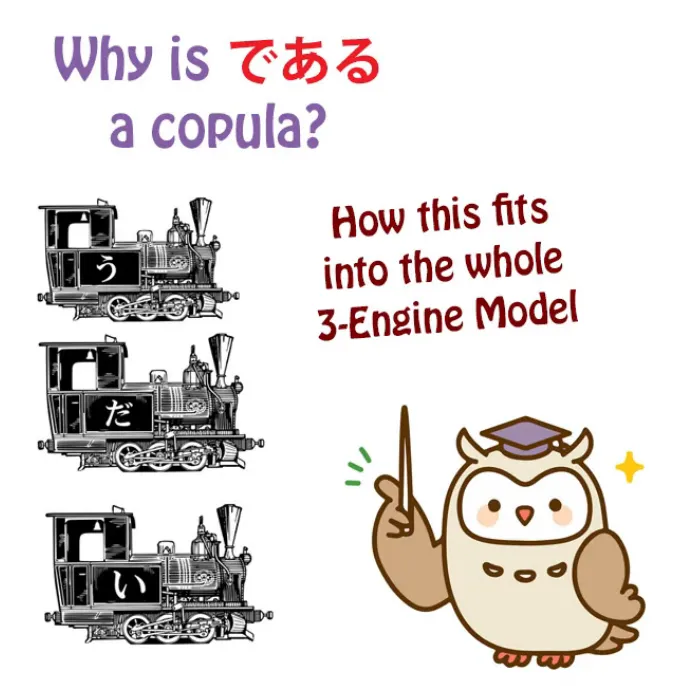
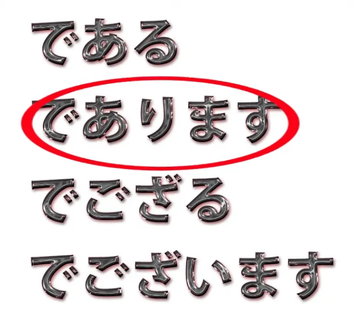
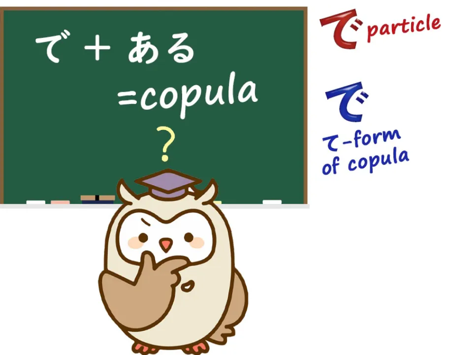
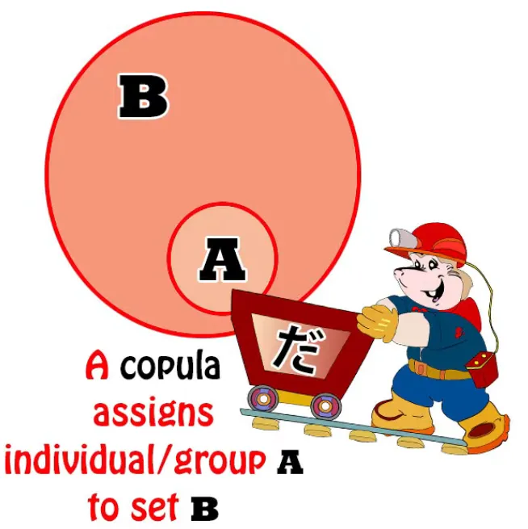
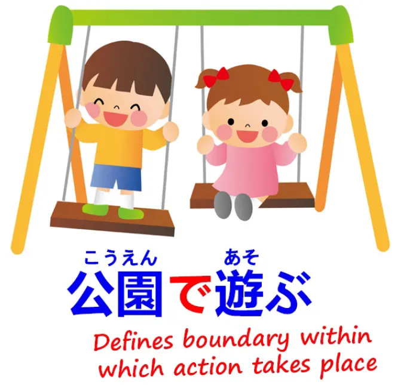
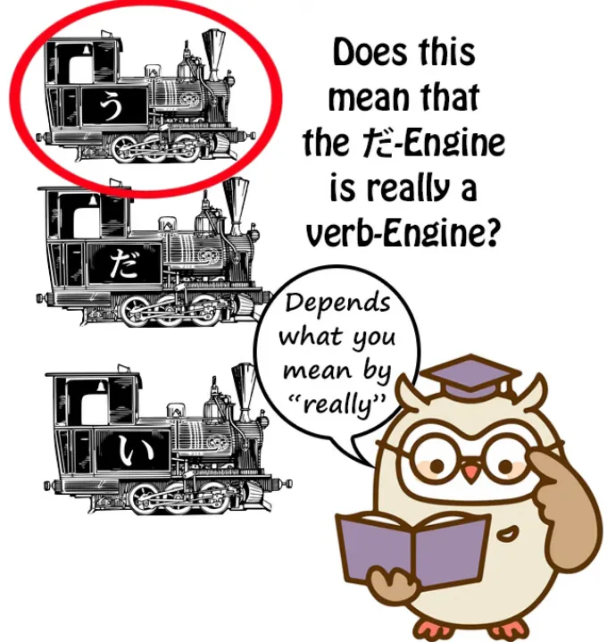
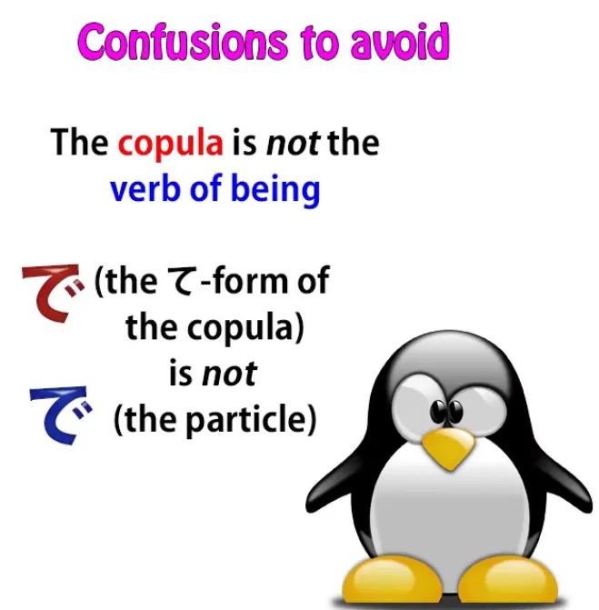
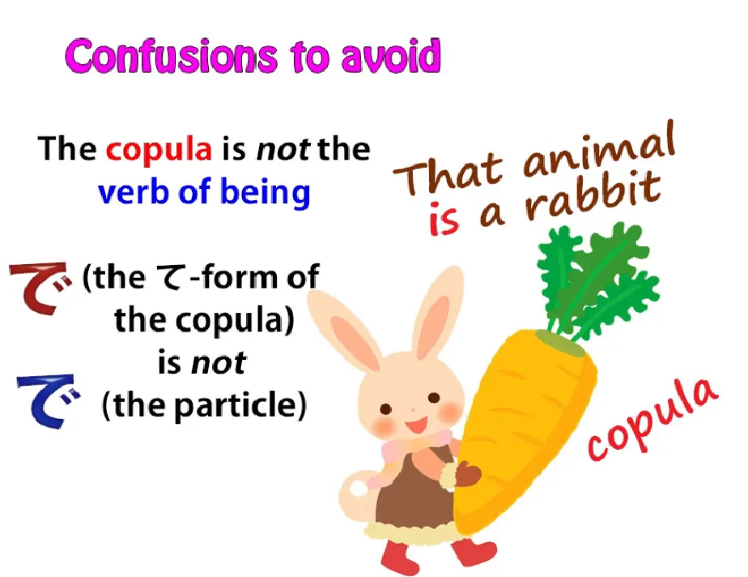
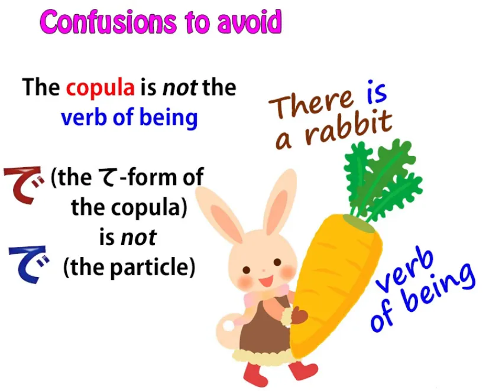

# **84.である

dan Struktur Bahasa Jepang. Apa yang Dapat Kita Pelajari dari Kopula-kopula Lama:である

,であります、でござる、でございます

**

[**De-aru dan Struktur Bahasa Jepang. Apa yang Dapat Kita Pelajari dari Kopula-kopula Lama:である

,であります、でござる、でございます

| Pelajaran 84**](https://www.youtube.com/watch?v=hS02cADsjfI&amp;list;=PLg9uYxuZf8x_A-vcqqyOFZu06WlhnypWj&amp;ab;_channel=OrganicJapanesewithCureDolly)

こんにちは。

Hari ini kita akan membahas kembali elemen bahasa Jepang yang menjadi kunci untuk sekitar sepertiga dari semua kalimat dalam bahasa Jepang, yaitu kopula.

::: info
Perhatikan bagaimana kopula MENYATUKAN A (Subjek) dan B (Predikat), itulah fungsinya.
:::

Nah, saya sudah cukup banyak membahas tentang kopula sebelumnya dan saya akan menyertakan tautan di bagian informasi di bawah ini agar Anda dapat mempelajarinya lebih lanjut.[[40]](./40-3-pitfalls-in-japanese-and-how-to-avoid-them.md)[[41]](./41-5-key-facts-about-the-basic-structure-of-japanese.md)[[55]](./55-rahasia-partikel-で-mengapa-kita-mengatakan-みんなで行く-dan-世界で一番.md)[[77]](./77-real-japanese-structure-vs-tae-kim-structural-review-of-tae-kim-s-japanese-grammar.md)[[79]](./79-deeper-secret-of-the-copula.md)

**Namun hari ini saya ingin membahas bentuk-bentuk kopula yang sedikit kurang umum**
yang akan sering Anda temui selama proses imersi
dan yang menimbulkan pertanyaan tertentu mengenai struktur kopula itu sendiri
yang akan kita bahas.

**Ini adalah: <code>である</code>, <code>であります</code>, <code>でございます</code> dan <code>でござる</code>.**

Sekarang, kita bisa membahas tiga yang terakhir dengan sangat cepat,
**karena semuanya hanyalah variasi dari yang pertama, <code>である</code>.**

## であります

**<code>であります</code> jelas <code>である</code> dengan <code>ます</code> kata bantu yang ditambahkan.**

##でござる

**<code>でござる</code> — <code>ござる</code> hanyalah versi sopan (keigo) dari <code>ある</code>, kata kerja &quot;menjadi&quot;.**

Sekarang, bagaimana kata kerja &quot;menjadi&quot; bisa masuk ke sini? Nah, kita akan membicarakannya sebentar lagi.

**<code>ござる</code> hanya terdiri dari kata kehormatan <code>ご</code> ditambah <code>ざる / 座る</code>,**
**yang awalnya berarti <code>seated</code>, tetapi memiliki makna yang diperluas menjadi <code>existing</code>.**

::: info
座るbiasanya dibaca sebagai すわる, tetapi bacaan On-yomi-nya adalah ざ, oleh karena itu ざる di sini karena saya kira ini merujuk pada makna luasnya dari <code>existing</code>?
:::
**Jadi <code>ござる / ご座る</code> hanya <code>ある</code> dalam bentuk yang lebih formal.**

**Anda tidak akan mendengar <code>でござる</code> banyak sekali karena karena ini adalah bentuk hormat**
**saat ini hampir selalu digunakan dengan <code>ます</code> kata bantu.**

Tapi Anda mungkin akan mendengarnya <code>ござる</code> mungkin dalam drama periode dan hal-hal semacam itu. **Itu adalah bahasa samurai.**

##でございます

**<code>でございます</code> adalah bentuk kata hubung yang digunakan dalam keigo,**
jadi **Anda akan mendengarnya di toko-toko, Anda akan mendengarnya dalam pengumuman publik**,
dan Anda akan mendengarnya digunakan oleh penutur dalam anime dsb yang menggunakan bahasa yang sangat hormat,
mungkin penjahat sekunder yang berbicara kepada penjahat utama.

Jadi, itu saja yang perlu kita bahas mengenai ketiga hal tersebut.

## である

**Namun <code>である</code>, yang merupakan akar dari semuanya, adalah yang perlu kita perhatikan.**

Anda bisa menyebutnya, dalam arti tertentu, **yang <code>straight copula</code>.**

**<code>だ</code> terdengar santai, <code>です</code> terdengar sopan, tetapi <code>である</code> hanya merupakan kopula.**

**Kita melihatnya digunakan dalam konteks di mana kita hanya bersikap objektif,**
**seperti makalah akademis, laporan surat kabar, hal-hal semacam itu.**
**Kita juga akan melihatnya digunakan dalam konteks lain terlepas dari**
**jenis tulisan apa yang digunakan karena kata ini memiliki karakteristik khusus.**

---

**Seperti yang kita ketahui, <code>だ</code> dan <code>です</code> hanya dapat digunakan di akhir klausa logis.**
**Keduanya merupakan penutup klausa logis dan tidak dapat digunakan untuk memodifikasi kata benda di depan.**
**Jika kita ingin memodifikasi kata benda terlebih dahulu dengan kata benda lain yang ditandai oleh kopula,**
**kita hanya dapat melakukannya jika kata benda tersebut bersifat adjektival, karena kata benda adjektival**
**dapat menggunakan bentuk kopula yang memodifikasi terlebih dahulu, yaitu <code>な</code>.**

---

Kita dapat mengatakan <code>花が**綺麗だ**</code> (bunga **cantik-adalah**)
atau kita bisa mengatakan <code>**綺麗な**花</code> (**cantik-adalah** bunga).

Dan justru karena kelompok kata benda ini 
dan saya telah membahas tiga kelompok kata benda khusus
dalam video lain jika Anda ingin melihatnya[[41]](./41-5-key-facts-about-the-basic-structure-of-japanese.md) 
**kelompok kata benda khusus ini, yaitu kata benda adjektival, memiliki sifat**
**bahwa ia dapat menggunakan bentuk kopula yang mendahului, <code>な</code>.**

Ini adalah sesuatu yang tampaknya tidak diketahui oleh buku teks. Mereka tidak memberitahu Anda apa <code>な</code> itu dan mereka mengatakan bahwa kata benda adjektival
sebenarnya adalah sesuatu yang aneh yang disebut <code>な-adjectives</code>. Tapi itu masalah lain.

**Jadi, apa yang harus kita lakukan jika ingin menggunakan kata benda yang ditandai kopula**
**sebagai modifikator awal dan itu bukan kata benda adjektival?**

Nah, kita tidak sering melakukan ini karena
kita bisa mengatasi situasi ini dengan menggunakan <code>の</code>. Namun, dalam beberapa kasus, hal ini tidak berhasil
atau memang bukan yang ingin kita lakukan.

Jadi, misalkan kita ingin mengatakan <code>Sakura **who is** a university student</code>. Sekarang, kita bisa mengatakan <code>大学生**の**さくら</code>, yang artinya <code>the university student Sakura</code>.

Tetapi misalkan kita tidak ingin mengatakan itu. **Misalkan kita sebenarnya ingin mengatakan <code>Sakura who is a university student</code>?** *(membuat klausa relatif)*

Ini tidak persis sama, baik dalam bahasa Jepang maupun Inggris. **Untuk melakukan ini, kita harus menggunakan kata hubung dan**
**kita harus menggunakannya sebagai kata penghubung di depan, jadi kita harus menggunakan <code>である</code>.**

**Itu satu-satunya pilihan kita. Kita tidak bisa menggunakan <code>だ</code> atau <code>です</code>**
**karena keduanya hanya bisa digunakan di akhir klausa logis.**
**Dan kita tidak bisa menggunakan <code>な</code> karena <code>大学生</code> bukanlah kata benda yang berfungsi sebagai kata sifat.**

---

Jadi kita mengatakan <code>大学生**である**さくら</code>. *(Sakura **yang merupakan** seorang mahasiswa)*

Dan kamu akan melihat hal ini terkadang, terutama dalam teks tertulis.

---

**Namun, ada kasus di mana kamu benar-benar tidak punya pilihan sama sekali.**
**Misalnya, jika kamu ingin mengatakan <code>the state of being round</code>**,
Anda akan mengatakan <code>円形**である**さま</code>.

Sekarang, **<code>さま</code> adalah keadaan atau kondisi.**
**Kita tidak bisa benar-benar menggunakan &#x27;の&#x27; di sini; <code>円形のさま</code> tidak benar-benar berfungsi.**

Jadi kita benar-benar harus mengatakan <code>円形**である**さま</code>.

Sekarang, **ketika saya mengatakan bahwa <code>である</code> adalah kopula langsung,**
bukan yang santai, bukan yang sopan, hanya kopula langsung,
ada alasan lain untuk ini,
**karena pada akhirnya dan secara historis
<code>だ</code> hanyalah singkatan dari <code>である</code>**
**dan <code>です</code> adalah singkatan dari <code>であります</code>.**

Jadi, jika Anda telah mengikuti kursus saya, jika Anda telah
dilatih untuk melihat bahasa Jepang secara struktural,
ada beberapa pertanyaan yang mungkin ingin Anda ajukan,
dan beberapa orang telah menanyakannya kepada saya.

Pertama-tama, bukankah saya telah memaparkan copula sebagai unit yang tak terpisahkan dan istimewa,
salah satu dari tiga engine, tetapi
**di sini tampaknya terdiri dari dua elemen,**
**<code>で</code> dan <code>ある</code>, dan terlihat sangat mirip dengan kata kerja.**

Jadi, apa yang terjadi di sini? Dan kemudian,
**mengapa, bagaimanapun juga, elemen-elemen <code>で</code> dan <code>ある</code>**
**menjadi konsep kopula?**

### Mengapa で &amp; ある menjadi kopula

Sekarang, mari kita lihat bagian kedua ini terlebih dahulu, lalu kita akan melihat bagian pertama.

Mengapa <code>で</code> ditambah <code>ある</code> menjadi konsep kopula? **Nah, seperti yang kita ketahui, ada dua <code>で</code>s dalam bahasa Jepang.**
**Ada partikel <code>で</code> dan kemudian ada bentuk て dari kopula.**

Buku teks tidak memberitahukan hal ini kepada Anda. Mereka membiarkan Anda berpikir bahwa semuanya adalah partikel <code>で</code>.

**Tapi seperti yang kita ketahui, ada dua <code>で</code>s.**
**Nah, yang kita bahas di sini jelas adalah partikel <code>で</code>.**

::: info
Huh… lucu juga bahwa hal partikel &quot;で&quot; ini juga merupakan salah satu teoriku tentang &quot;である&quot; (dan &quot;だ&quot;)
:::
**Ini tidak mungkin bentuk て dari kopula karena kopula dasar**
**tidak mungkin terdiri dari dua elemen, salah satunya sudah merupakan bentuk て dari dirinya sendiri.**

Dan untuk memahami apa yang terjadi di sini,
mengapa <code>で</code> dan <code>ある</code> menjadi kopula, kita perlu mengetahui dua hal.

Sekarang, saya telah membuat video tentang keduanya dan saya akan menyertakan tautannya juga,
tetapi mari kita ulas singkat di sini.
::: info
agak sulit untuk mengatakan video mana yang dimaksud Dolly, tetapi jika demikian, tinjau Pelajaran 40, 41, 55, dan 79.
:::
**Dua hal yang perlu kita ketahui adalah pertama-tama apa itu kopula sebenarnya,**
**dan yang kedua adalah apa yang sebenarnya dilakukan partikel <code>で</code> sebenarnya berfungsi.**

#### Apa sebenarnya copula itu / fungsinya

**Copula sebenarnya adalah sesuatu yang menghubungkan dua kata benda, A dan B,**
**dan memberi tahu kita bahwa kata benda A adalah bagian dari sekumpulan yang diwakili oleh kata benda B.**

Itulah yang dilakukan oleh kopula. **Itulah satu-satunya fungsinya.**

Jadi, jika kita mengatakan <code>さくらが日本人だ</code>
**kita sedang mengatakan bahwa Sakura (kata benda A) adalah bagian dari himpunan orang Jepang (kata benda B).**

**Dan terkadang himpunan tersebut bisa berupa himpunan yang hanya berisi satu.**
Jadi, jika kita mengatakan <code>That person over there **is** Sakura</code>, maka kita mengatakan bahwa
**orang di sana termasuk dalam himpunan yang terdiri dari satu orang, yaitu Sakura.**

**Kita tidak sedang membicarakan Sakura-Sakura lainnya.**
**Kita sedang membicarakan Sakura yang spesifik ini.**

---

#### Apa fungsi partikel で

**Jadi, apa yang sebenarnya dilakukan partikel <code>で</code> sebenarnya?**

Saya telah membuat video tentang hal itu dan akan menyertakan tautannya.[[55]](./55-secrets-of-the- で -particle-why-do-we-say- みんなで行く -and- 世界で一番.md)

**Pada dasarnya partikel <code>で</code> mendefinisikan batas, bidang, atau parameter**
**di mana suatu tindakan terjadi atau suatu keadaan berlaku.**

---

**Jadi, penggunaan paling sederhana dari <code>で</code> adalah untuk menyebutkan di mana suatu tindakan terjadi:**
<code>**公園で**遊ぶ</code> (bermain **di taman**) 
**taman, yang ditandai oleh <code>で</code>, adalah bidang, area, parameter, di mana saya bermain;**

<code>**世界で**一番おいしいラーメン</code> (ramen paling lezat **di dunia**) 
**dunia yang ditandai oleh <code>で</code> menandai lapangan, area
di mana ramen ini adalah yang pertama, nomor satu.**

---

**Dan hal ini diperluas sedikit lebih jauh dalam kasus-kasus lain.**
**Bisa jadi bahan yang digunakan untuk membuat sesuatu, alat yang digunakan untuk membuat sesuatu, dll.**
**Dalam semua kasus, hal ini menonjolkan parameter tertentu dari parameter-parameter lain**
**yang memungkinkan proses pembuatan terjadi.**

### Kembali ke である

Sekarang, ketika kita mengambil <code>である</code>, yang dimaksud di sini adalah
**ada (ある) di dalam batas atau parameter tertentu;**
dengan kata lain, **ada di dalam suatu himpunan.**

**Dan itulah yang diberitahukan oleh kopula kepada kita.**
**Ia memberitahu kita himpunan apa, batas apa, di mana sesuatu itu ada.**

Sakura **ada di dalam batas** orang Jepang.

Jika kita mengatakan <code>鷲が鳥**だ**</code> (seekor elang **adalah** seekor burung), kita berarti mengatakan
**seekor elang berada di dalam batas, di dalam parameter, di dalam himpunan, <code>birds</code>.**

Dan inilah yang selalu dilakukan oleh kopula. **Jadi <code>である</code> adalah konstruksi kopula yang sangat tepat.**

Jadi, mari kita lanjut ke pertanyaan kedua.

#### Apakah &quot;である&quot; / kopula adalah kata kerja?

Pertanyaan kedua adalah, **apakah ini berarti bahwa kopula sebenarnya bukan**
**elemen tak terpisahkan dari bahasa Jepang, salah satu dari tiga engine?**
**Dan apakah ini berarti bahwa kopula adalah kata kerja?**

**Karena jelas <code>ある</code> adalah kata kerja, dan karena**
**<code>ある</code> adalah kata kerja sehingga kita dapat menggunakannya sebagai pre-modifier.**

Kita dapat mengatakan <code>大学生**である**さくら</code> karena
**kamu selalu bisa menggunakan kata kerja untuk memodifikasi kata benda di depan.**

Dan jawaban atas pertanyaan ini adalah bahwa ini adalah soal pemodelan.

Saya memodelkan bahasa Jepang dengan cara tertentu. **Memang mungkin untuk memodelkannya dengan cara lain.**

**Dalam tata bahasa Jepang yang diajarkan kepada siswa Jepang, kopula dianggap sebagai kata kerja.**
*(oleh karena itu, kopula memiliki fungsi verbal = secara teoritis dapat dianggap sebagai jenis kata kerja khusus)*

---
Dan pada kenyataannya **kata benda yang berfungsi sebagai kata sifat ditambah kopula disebut <code>形容動詞</code>,**
**yang berarti kata kerja adjektival.**

**Bagian <code>verb</code> bagian yang ditambahkan padanya adalah kopula.**

Jadi **<code>綺麗</code> bukanlah kata kerja adjektival (形容動詞);** <code>**綺麗な**</code> atau <code>**綺麗だ**</code> **adalah sebuah 形容動詞**.
**Dan <code>動詞</code> bagian, bagian kata kerjanya, adalah kopula.**

---

**Namun saya tidak memodelkan kopula sebagai kata kerja.**
**Dan alasannya adalah bahwa dalam struktur tiga engine kami**
**saya membatasi istilah <code>verb</code> hanya pada entitas yang berakhiran う -row kana**
**dan melakukan semua hal yang dilakukan entitas tersebut: kita memiliki empat akar kata, dll.**

::: info
Hal ini semakin menunjukkan bahwa ada berbagai cara untuk memandang bahasa, dan keduanya dapat berfungsi dalam sistem masing-masing, jadi sebaiknya kita menyadari kedua cara tersebut &amp; menggunakannya sesuai yang paling cocok bagi Anda.
:::
**Kopula tidak berfungsi seperti ini dalam bahasa Jepang modern. Kopula berfungsi secara berbeda.**

<code>である</code> telah berevolusi menjadi entitas tersendiri dengan bentuk penghubungnya sendiri (て),
yang dimilikinya, dengan bentuk penghubungnya sendiri, <code>な</code>, yang dimilikinya.

**Kita bisa, jika mau, memodelkan ketiga engine tersebut sebagai kata kerja,**
**karena dalam banyak hal kata sifat juga mirip kata kerja.**
**Namun, kata sifat tidak berfungsi seperti entitas dengan akhiran -う dan tidak berfungsi seperti kopula.**

Jadi, dalam model bahasa Jepang saya,
yang menurut saya merupakan model terbaik untuk digunakan oleh pembelajar bahasa Jepang non-penutur asli,
kami menggunakan struktur tiga engine.

Kita menganggap kata kerja, kata sifat, dan kopula sebagai tiga entitas yang unik.

**Ini bukanlah pernyataan mengenai etimologi bahasa Jepang.**
**Ini bahkan bukan pernyataan mengenai <code>real truth</code> tentang tata bahasa Jepang,**
karena tidak ada <code>real truth</code> dalam tata bahasa.

**Tata bahasa hanyalah sarana untuk menggambarkan**
**fenomena yang sudah ada sebelumnya, yaitu bahasa.**

**Tata bahasa bukanlah kode sumber bahasa.**
**Tata bahasa adalah upaya untuk menggambarkan bahasa dengan memodelkannya.**

Dan saya menggunakan serta merekomendasikan model tiga engine. **Jika Anda lebih suka model lain, silakan gunakan.**

---

**Alasan lain saya mempertahankan perbedaan ini adalah karena sangat penting**
**untuk tidak mengacaukan <code>で</code> bentuk て dari kopula dengan partikel <code>で</code>,**
**dan sangat penting untuk tidak membingungkan konsep kopula**
**dengan kata kerja &#x27;menjadi&#x27;, <code>ある</code>.**

Dan hal itu sangat mudah terjadi pada penutur bahasa Inggris
atau orang-orang yang sangat akrab dengan bahasa Inggris,
**karena dalam bahasa Inggris, kopula dan kata kerja &quot;being&quot;**
**diwakili oleh kata yang sama,**
**yaitu <code>is</code> dan varian-variannya <code>was</code>, <code>am</code>, <code>are</code>, dll.**

Keduanya adalah kata yang sama, tetapi bukan konsep yang sama.

---

**Jadi, ketika kita mengatakan bahwa <code>だ</code> dan <code>です</code> berarti <code>is</code>,**
**ini adalah cara pandang yang membingungkan.**
**Keduanya tidak berarti <code>is</code> dalam semua keadaan;**
**mereka berarti <code>is</code> ketika itu adalah kopula.**

Jadi jika kita mengatakan <code>That animal **is** a rabbit</code>, ini adalah **kopula**.
**Kita memasukkan <code>that animal</code> ke dalam himpunan <code>rabbit</code>.**

---

Jika kita mengatakan <code>There **is** a rabbit</code>, **itu bukan kopula, melainkan kata kerja keberadaan.**
**Kita mengatakan seekor kelinci ada, di tempat itu.**

Sekarang, karena kedua konsep ini sangat mudah disalahartikan,
dan karena buku teks serta teks akademis yang lebih lanjut
sangat, sangat buruk dalam membedakannya,
**saya percaya penting untuk mempertahankan kopula, yang merupakan**
**konsep yang tidak lazim dalam bahasa Inggris, karena bahasa Inggris tidak memiliki kopula khusus,**
**untuk menjaganya tetap terpisah dalam model tiga engine.**

::: info
Ini cukup menarik, [**tautan di sini**](https://www.youtube.com/watch?v=hS02cADsjfI&amp;lc;=Ugwa71x6w5weNeypWEh4AaABAg&amp;ab;_channel=OrganicJapanesewithCureDolly) jika tangkapan layarnya terlalu sulit dibaca. Sangat disarankan untuk membaca seluruh bagian komentar di bawah video ini, karena ada beberapa komentar yang menarik.

:::

