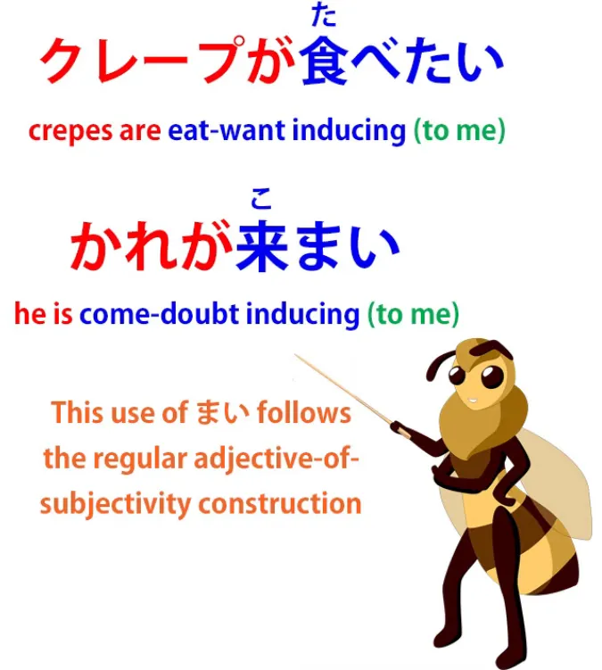

# **85.まい

- penolong negatif**

[**まい

penolong negatif yang tak pernah dijelaskan dengan jelas | Pelajaran 85**](https://www.youtube.com/watch?v=f4A9DK7Rtcw&amp;list;=PLg9uYxuZf8x_A-vcqqyOFZu06WlhnypWj&amp;index;=87&amp;ab;_channel=OrganicJapanesewithCureDolly)

こんにちは。

Hari ini kita akan membahas elemen bahasa Jepang yang tidak biasa namun tidak jarang ditemui, yang pasti akan Anda temui selama proses pembelajaran. Hal ini bisa membingungkan karena tidak ada yang benar-benar menjelaskan apa itu dan fungsinya — dan tentu saja mereka tidak menjelaskan alasannya. Banyak orang yang bertanya kepada saya tentang hal ini belakangan ini, termasuk pendukung Red Kokeshi saya, Bob Nagler, yang berkata, &quot;Apakah Anda pernah membuat video tentang kata kerja ditambah **まい

**? Saya belum menemukan penjelasan yang sangat berguna di mana pun, hanya daftar dengan contoh dan terjemahan yang memberikan gambaran sekilas.&quot;

Ya, memang begitulah keadaannya. Jadi, mari kita buat videonya sekarang.

## Apa ituまい？

**<code>まい</code> adalah kata bantu negatif seperti <code>ず</code> dan <code>ぬ</code>**, yang [**saya buat videonya**](https://www.youtube.com/watch?v=E7Qop8dwP4w) baru-baru ini.

**Dan seperti mereka, ini adalah semacam fosil, salah satu unsur yang tidak sepenuhnya cocok dengan bahasa Jepang modern. Namun, ini cukup sering digunakan, jadi kita perlu memahaminya.**

---

Hal yang tidak biasa pertama tentang partikel ini adalah, tidak seperti kebanyakan partikel bantu, **partikel ini tidak melekat pada salah satu akar kata kerja.**

**Dalam kebanyakan kasus, kata bantu ini langsung ditempelkan di akhir kata kerja.** Jadi, jika kita ingin menempatkannya pada <code>行く</code> kita cukup mengatakan <code>行くまい</code>.

**Hal ini selalu terjadi pada kata kerja godan karena tidak ada cara lain untuk menempelkan <code>まい</code>.**

**Pada kata kerja ichidan, kita bisa menempelkannya ke akar kata kerja ichidan yang universal** (seperti yang kamu tahu, pada kata kerja ichidan, apa pun yang kita lakukan dengannya, kita selalu hanya menghilangkan akhiran -る, lalu menambahkan apa pun yang ingin kita tambahkan). Jadi, misalnya, <code>見る</code> dapat menjadi <code>見まい / みまい</code>, **tetapi sering juga menjadi** <code>見るまい</code>.

**Pada dua kata kerja tidak beraturan**, <code>来る</code> dan <code>する</code>, **mereka bisa menjadi** <code>来るまい</code> dan <code>するまい</code>, **tetapi bisa juga** <code>こまい</code> dan <code>しまい</code>.

---

Sekarang, **secara harfiah, terutama di masa lalu, penggunaan kata kerja ichidan secara utuh dengan <code>まい</code> di bagian akhir mungkin tidak sesuai tata bahasa, tetapi sekarang hal ini begitu umum dilakukan sehingga umumnya diterima.** Anda akan melihatnya di mana-mana di berita televisi atau di mana saja.

---

Jadi, apa ini <code>まい</code>? Nah, **ini sebenarnya semacam saudara dari kata sifat pembantu <code>ない</code>, yaitu kata sifat penegas negatif.** Apa bedanya antara <code>まい</code> dan <code>ない</code> selain dari cara pengikatannya?

Nah, **yang <code>まい</code> sebenarnya adalah bentuk volisional.**

Sekarang, **kata sifat biasanya tidak memiliki bentuk volisional, tetapi dalam kasus ini kita memilikinya, dan bentuk ini memiliki penggunaan tertentu.**

---

**Seperti <code>ない</code>, <code>まい</code> adalah kata sifat, tetapi tidak seperti <code>ない</code> dan hampir semua kata sifat lainnya, kata sifat ini tidak berubah bentuk sama sekali.**

**Anda tidak mengatakan <code>まくて</code> atau <code>まかった</code>. Anda hanya menggunakannya dalam bentuk sederhana dan tidak berubah, <code>まい</code>,** jadi, dalam arti tertentu, kata ini merupakan unsur statis dalam bahasa Jepang, bukan unsur aktif.

**Dan ini sebenarnya cukup wajar, karena hal yang sama juga terjadi pada bentuk volisional positif, bukan?** Kita memiliki bentuk lampau dan bentuk &quot;て&quot; dari kata bantu seperti bentuk reseptif dan kausatif, dan tentu saja <code>ない</code> sendiri, tetapi **kita tidak memiliki bentuk lampau dan bentuk &quot;て&quot;, dll., dari volitional.**

**<code>食べよう</code>: kamu tidak bisa mengubahnya menjadi bentuk lampau, bentuk て-nya tidak ada, karena itu tidak masuk akal untuk volitional.**

## Apa yang tidak bisa dilakukan oleh volitional negatif

Jadi, apa sebenarnya yang dilakukan oleh volitional negatif?

**Ia tidak melakukan semua hal yang dilakukan oleh volitional positif.**

**Anda tidak bisa menggunakannya sebagai ajakan bertindak:** <code>行きましょう</code> (ayo pergi). *(contoh ini adalah volitional positif)*

**Anda tidak bisa mengatakan <code>行くまい</code> (ayo jangan pergi) — itu bukan artinya.**

**Anda tidak bisa menggunakannya untuk**, seperti yang telah saya tunjukkan dalam video lain[[18]](./18- って - は -mysteries-explained- おうとする - とする - として - という - っていう.md), **membentuk konstruksi yang berarti <code>try to do something</code>.**

Jadi **Anda tidak dapat menggunakan <code>まい</code> dalam konstruksi tipe &quot;let&#x27;s-try-not-to-do&quot;.**

## Penggunaan &quot;まい&quot;

Penggunaannya cukup terbatas; ada beberapa penggunaan langsung dan beberapa penggunaan lain yang sebenarnya cukup berguna. Jadi, mari kita lihat.

### Menggunakan &quot;まい&quot; untuk menyatakan bahwa sesuatu tidak mungkin

**Penggunaannya yang paling umum jauh melebihi yang lain adalah untuk menyatakan bahwa sesuatu tidak mungkin.**

**Ini adalah kalimat negatif volisional, jadi sama seperti ketika kita mengutarakan dugaan atau penilaian** — dan **ini sangat sering digunakan dengan kata kerja <code>ある</code>, sehingga kita mengatakan <code>あるまい</code>.**

<code>そんなことはあるまい</code> (itu tidak mungkin / Saya rasa hal seperti itu sama sekali tidak mungkin).

**Namun, hal ini juga berlaku untuk kata kerja lainnya.**

<code>この降りでは彼はこまい</code> (Dalam hujan lebat ini, saya ragu dia akan datang).

Dan **ini agak terkait dengan kata sifat subjektivitas lainnya** yang telah kita bahas di tempat lain (dan saya akan menyertakan tautan untuk itu),[[9]](./9-subjek-kalimat-bahasa-jepang-yang-mengungkapkan-keinginan- ほしい - たい - たがる.md) **seperti <code>欲しい</code>, yang mewakili keinginan kita terhadap sesuatu, atau <code>怖い</code> yang mewakili ketakutan kita terhadap sesuatu.**

Seperti biasa, kata sifat ini mengacu pada hal yang kita inginkan, yang kita takuti, dan sebagainya. Dan **dalam hal ini, kata sifat tersebut mengacu pada hal yang kita anggap tidak mungkin.**

**Hal ini sebenarnya mewakili subjektivitas kita mengenai kemungkinan terjadinya sesuatu.**

#### Padanan bahasa Jepang yang tepat untuk &quot;あるまい

&quot; Jika kita ingin memberikan padanan bahasa Jepang yang tepat, **<code>あるまい</code> secara langsung setara dengan <code>ないだろう</code>  
(tidak ada, menurut dugaan saya) atau <code>ないでしょう</code>**, dan **<code>ではあるまい</code>** secara langsung setara dengan <code>ではないだろう</code>, <code>ではないでしょう</code>, <code>じゃないだろう</code>, <code>じゃないでしょう</code>, *(untuk semua bentuk ini)*

dengan kata lain, **<code>A isn&#x27;t B, I would conjecture, it seems likely</code> dll.**

Dan **hal yang menarik di sini adalah bahwa**, seperti yang kita lihat, **dengan penggunaan dugaan dari kata kerja kehendak **dalam bentuk positifnya yang lebih umum** ini, kita tidak melekatkan kata kerja kehendak tersebut secara langsung pada kata kerja yang sedang kita duga.**

Jadi **kita tidak mengatakan <code>さくらはすぐに帰ろう</code>.**

**Itu tidak berarti <code>Sakura will probably come</code>.**

**Kita mengatakan** <code>さくらはすぐに**来るでしょう** (or だろう)</code>, karena begitulah cara kita melakukannya. **Kita melakukannya dengan kopula volisional saat kita membuat dugaan semacam itu.**

---

**Tetapi dengan <code>まい</code> kita dapat menempelkannya langsung ke kata kerja** seperti yang kita lakukan pada contoh sebelumnya.

<code>そんなことは**あるまい**</code> setara langsung dengan <code>そんなことは**ないでしょう**</code>.

**Dan tidak ada ruang untuk ambiguitas di sini karena <code>まい</code> memiliki rentang makna yang lebih terbatas,** seperti yang baru saja kita bahas, **dibandingkan dengan kopula volisional positif**, jadi kita tidak akan bingung dengan, katakanlah, ajakan bertindak, **karena <code>まい</code> tidak melakukan ajakan untuk tidak bertindak.**

Jadi, **penggunaan paling umum dari <code>まい</code> adalah sebagai kata sifat negatif dari <code>でしょう / だろう</code> konstruksi konjektural ini.**

### まい digunakan untuk keputusan atau tekad yang kuat untuk tidak melakukan sesuatu

**Namun, kata ini juga digunakan untuk satu struktur negasi lain yang secara langsung setara dengan bentuk positifnya.**

Jadi kita bisa mengatakan <code>二度と行くまい</code> (Saya tidak akan pergi ke sana lagi; secara harfiah, saya tidak akan pergi untuk kedua kalinya). Itulah makna umum lainnya.

**Ketika tidak mengekspresikan kemungkinan atau peluang, struktur ini mengekspresikan keputusan atau tekad yang kuat untuk tidak melakukan sesuatu.**

Sekarang, di luar beberapa penggunaan ini, ada juga beberapa konstruksi umum lainnya di mana <code>まい</code> digunakan, dan Anda hampir pasti akan mendengarnya.

### Menggunakan bentuk volisional positif &amp; negatif secara bersamaan

**Seseorang menggunakan bentuk volisional positif dan negatif secara bersamaan, yang berarti apakah kata kerja tersebut dilakukan atau tidak.**

Jadi, misalnya, **<code>行こうか, 行くまいか</code>** berarti **<code>whether I go or not</code>.**

Sekarang, **ini sangat mirip dengan konstruksi** yang telah kita bahas sebelumnya dan yang mungkin sudah Anda ketahui[[39]](./39-the- か -particle-buried-questions- かな - もんか - かどうか.md), **<code>行くかどうか</code>** yang secara harfiah berarti **<code>whether I go or how</code>**, yang dalam bahasa Inggris yang lebih alami akan menjadi <code>whether I go or what</code>.

### Menambahkan し ke konstruksi まい

**Sekarang, konstruksi lain yang sering Anda dengar dibentuk dengan hanya menambahkan <code>し</code>, yang digunakan untuk mencantumkan penyebab sesuatu,** tetapi seperti yang telah kita bahas di tempat lain[[63]](./63-wild-sentence-enders-in-real-life-japanese- かい - だい - ぜ - ぞ - さ - から - し - ちょうだい.md), **sering digunakan sendiri hanya untuk menyiratkan daftar yang berlanjut.**

Dan **ini menghasilkan konstruksi yang agak mirip dengan <code>it isn&#x27;t as if...</code> atau <code>it isn&#x27;t like...</code> dalam bahasa Inggris.**

Jadi jika kita mengatakan <code>金持ちでは**あるまいし**</code> yang kira-kira setara dengan ungkapan **dalam bahasa Inggris** <code>it&#x27;s **not as if** we&#x27;re rich</code>, atau <code>世界が終わるわけが**あるまいし**</code> (bukan **seolah-olah** dunia akan berakhir).

::: info
Dalam teks terjemahan video, kata &quot;が&quot; setelah &quot;わけ&quot; tidak tercatat, tetapi Dolly tampaknya mengucapkannya; hanya saja pengucapannya sangat lemah di sini jika didengarkan dengan seksama.
:::

**Begitulah cara kita mengatakannya dalam bahasa Inggris.**

**Dalam bahasa Jepang**, lebih mirip dengan mengatakan <code>it isn&#x27;t **that** we&#x27;re rich **or something like that**</code> **(itulah <code>し</code> , sesuatu seperti itu).** *(Saya mencoba menyoroti bagian-bagiannya, tetapi terbatas, untungnya gambar video di atas menunjukkannya dengan baik)*

**Dan bentuk volitional kembali menandai hipotesis negatif.**

Seseorang mungkin bertindak seolah-olah dunia akan kiamat, **tapi sebenarnya mungkin tidak.** Kita mungkin terlihat kaya di mata orang lain **tapi, ya, sepertinya kita tidak begitu, bukan?**

Jadi begitulah cara <code>まい</code> alat bantu ini bekerja dalam berbagai penggunaan umum yang berbeda…

::: info
Ini bisa berguna, meskipun tidak terkait di sini. Maaf jika sulit dibaca, perbesar di sini atau [**lihat di sini**](https://www.youtube.com/watch?v=f4A9DK7Rtcw&amp;lc;=UgxlL8--buf4g_Gld_l4AaABAg&amp;ab;_channel=OrganicJapanesewithCureDolly)  

:::
