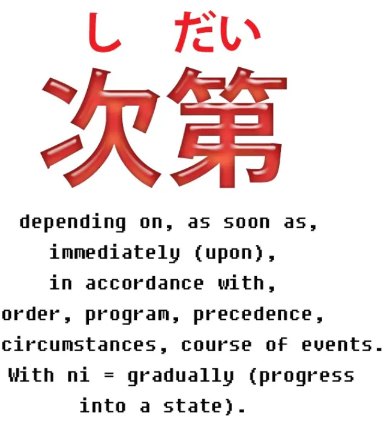
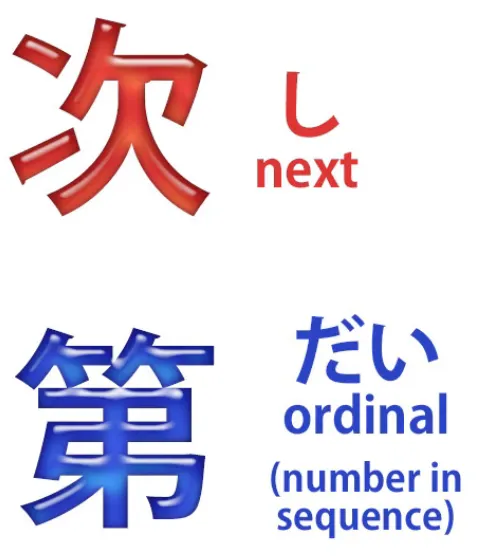
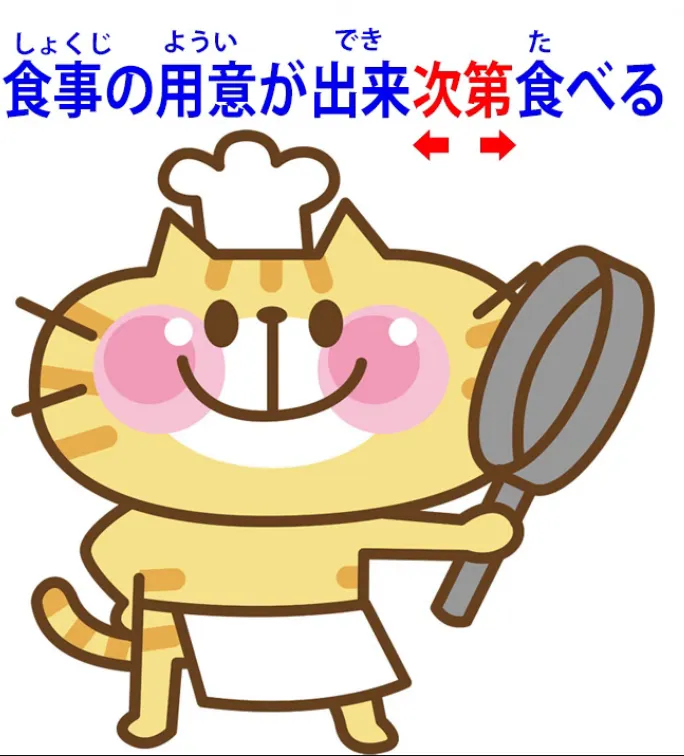
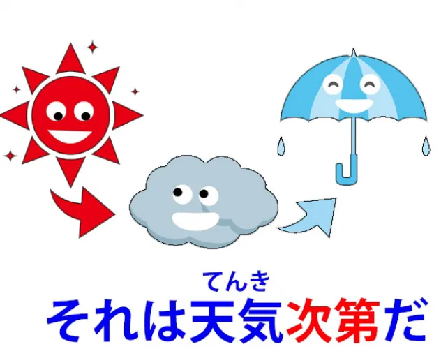

# **86. 次第 (shidai)** 

[**次第 (shidai) - Apa arti sebenarnya dan bagaimana cara kerjanya. Pelajaran 86**](https://www.youtube.com/watch?v=yIv12DTlQl0&amp;list;=PLg9uYxuZf8x_A-vcqqyOFZu06WlhnypWj&amp;index;=90&amp;ab;_channel=OrganicJapanesewithCureDolly)

こんにちは。

Hari ini kita akan membahas salah satu kata yang memiliki daftar arti yang tampaknya tidak berhubungan, jika Anda menganggap kamus Inggris-Jepang secara serius, yang membuatnya terasa sangat sulit. Namun seperti biasa dalam kasus-kasus seperti ini, masalah sebenarnya hanyalah mencoba memasukkan definisi bahasa Inggris yang berbentuk persegi ke dalam lubang bahasa Jepang yang berbentuk bulat. Jadi, jika kita melihat kata tersebut, kita akan dapat memahami apa arti sebenarnya dan bagaimana kata itu sebenarnya berfungsi.

**Kata tersebut adalah <code>次第</code>.**

**Menurut kamus**, kata ini bisa berarti <code>depending on</code>, <code>as soon as</code>, <code>immediately upon</code>, <code>in accordance with</code>, <code>order</code>, <code>program</code>, <code>precedence</code>, <code>circumstances</code>, <code>course of events</code>.

**Dan kemudian kita memiliki apa yang buku teks konvensional suka sebut sebagai <code>grammar point</code>: <code>次第に</code>, yang berarti <code>gradually</code> dalam arti secara bertahap berkembang menjadi suatu keadaan.**

Jadi, bagaimana kita memahami semua ini?

## Apa itu次第？

Baiklah, mari kita mulai dengan melihat <code>次第</code>. **<code>次第</code> terdiri dari dua kanji dan merupakan kata benda.** Dan Anda harus tahu bahwa begitu saya mengatakan kata ini terdiri dari dua kanji dan tidak ada yang lain, kita tahu bahwa ini adalah kata benda. Hanya itu yang bisa menjadi.

**Dan kedua kanji tersebut adalah:**

**yang pertama ini, yaitu kanji yang kita gunakan dalam <code>次</code> (berikutnya), dan itulah artinya, <code>next</code>.**

**Dan yang ini, <code>第</code>, yang merupakan bilangan urutan dalam bahasa Jepang.**

Sekarang, apa itu bilangan urutan? **Dalam bahasa Inggris, bilangan urutan adalah akhiran -st dalam <code>first</code>, -nd dalam <code>second</code>, -rd dalam <code>third</code>, -th dalam <code>fourth</code> dll.** **Dalam bahasa Jepang, untungnya, kita hanya memiliki satu kata bilangan urutan untuk setiap angka dan itu adalah <code>第</code>, dan kita menempatkannya di depan angka, bukan di belakangnya.**

Jadi, jika kita ingin membicarakan episode ketiga dari sebuah anime, kita mengatakan <code>団三話</code>; jadi <code>第</code> adalah yang ke-, <code>三</code> adalah angka tiga, **dan <code>話</code> adalah kata penghubung untuk cerita atau episode.**

Jadi, kita memiliki <code>次 / つぎ</code> kanji, <code>next</code> kanji, yang bacaan on-nya adalah <code>し</code>, dan kita memiliki <code>第 / だい</code>, yang berarti <code>ordinal / sequence / number in sequence</code>.

**Jadi artinya adalah <code>next thing in sequence / next thing in order</code>.**

**Dan satu hal lagi yang perlu kita ketahui tentang kata ini adalah bahwa kata ini umumnya berfungsi dengan melekat pada kata benda lain.**

**Dan ini menghasilkan semacam kata majemuk.**

---

**Jadi, jika kita melekatkan <code>時計</code> ke <code>腕</code>, <code>腕</code> memberitahu kita tentang <code>時計</code>.**

**<code>腕時計</code> adalah <code>arm-clock</code> (sebuah jam tangan).**

Jika kita menggabungkan <code>砂 / すな</code> ke <code>時計</code> maka kita memiliki <code>sand-clock</code> (jam pasir) - 砂時計.
**Dan demikian pula kita membentuk kata benda majemuk ini dengan <code>次第</code> dan apa pun yang disambungkannya.**

## 次第 sebagai <code>as soon as</code> atau <code>immediately upon</code>

**Dan penggunaan paling sederhana dari ini adalah ketika ia menggantikan ungkapan bahasa Inggris <code>as soon as</code> atau <code>immediately upon</code>.**

Jadi, jika kita mengatakan, <code>分かり**次第**お電話します</code>, kita berarti mengatakan, &quot;**Segera setelah** (hal itu) diketahui... (**<code>分かる</code>, diketahui; secara harfiah, menjadi diketahui, menjadi dimengerti**)... **Segera setelah hal itu menjadi dimengerti, saya akan menelepon Anda.&quot;**

---

**Yang Anda lihat di sini adalah A-stem &quot;い&quot; dari <code>分かる</code>** (menjadi dapat dipahami), **yang adalah <code>分かり</code>,** **dan kita sedang membentuk kata benda majemuk, yang berarti &quot;hal berikutnya dalam urutan setelah menjadi dapat dipahami adalah bahwa saya akan menelepon Anda** / **Segera setelah hal itu menjadi dapat dipahami, segera setelah kita mengetahui situasinya, saya akan menelepon Anda.&quot;**

*= 分かり次第お電話します*

---

<code>食事の用意が出来次第食べる.</code>

Jadi, meskipun **di sini kita sebenarnya memiliki klausa logis**: <code>食事の用意が出来る</code> (persiapan untuk makan sudah selesai; secara harfiah, keluar), **kita sebenarnya memiliki akar dari できる di sini, yaitu <code>出来 / でき</code>,** **dan itu terhubung dengan <code>次第</code>.**

Jadi, &quot;**hal berikutnya dalam urutan setelah persiapan selesai adalah makan** / **Segera setelah persiapan makan selesai, kita akan makan**&quot;.

*= 食事の用意が出来次第食べる*

## 次第 sebagai <code>depending upon</code>

Dan dari logika ini, kita kemudian mendapatkan apa yang tampaknya merupakan gagasan yang sama sekali berbeda dalam bahasa Inggris, yaitu <code>depending upon</code>. Jadi kita mungkin akan mengatakan, <code>それは**天気次第**だ</code>.

Dalam bahasa Inggris kita akan mengatakan <code>that **depends on the weather**</code>. Namun dalam bahasa Jepang, yang kita katakan adalah <code>that **follows directly from the weather**</code>.

Dan, **seperti yang Anda lihat, ini adalah cara penyampaian yang berbeda,** **tetapi pada dasarnya artinya sama.**

<code>彼の答えは**気分次第**だ.</code> Nah, itu berarti <code>his answer **follows directly from his mood**</code>. Dengan kata lain, jawabannya **tergantung pada suasana hatinya**.

### Frasa &quot;手当たり次第&quot;

Dan frasa yang berguna untuk diketahui di sini adalah <code>手当たり次第</code>. <code>手当たり</code> adalah <code>手</code> (tangan) dan <code>当たり</code> (sentuhan atau kontak).

**<code>手あたり次第</code> berarti <code>whatever one can lay one&#x27;s hands on / whatever comes to hand</code>.**

Jadi, <code>**手あたり次第本**を読む</code> (saya membaca **buku apa pun yang ada di tangan**). Membaca **buku secara harfiah langsung mengikuti sentuhan tangan pada buku**.

---

**<code>手当たり次第</code> dapat digunakan dalam berbagai macam konstruksi:** Saya makan **apa pun yang ada di tangan**; Saya membaca **apa pun yang ada di tangan**; Saya **melempar apa pun yang ada di tangan** ke tetangga. Dan, **seperti yang Anda lihat, ini adalah bentuk kata benda dari kata kerja ini (menyentuh) <code>当たる</code>,** **yang <code>当たり</code>, yang melekat pada <code>次第</code>.**

### Menempelkan 次第 ke seseorang

**Trik berguna lainnya adalah kita dapat menempelkan <code>次第</code> secara langsung ke seseorang.**

Jadi, jika kita mengatakan <code>**あなた次第**です</code>, pada dasarnya kita mengatakan <code>it&#x27;s **up to you** / it **follows directly from you**</code>.

**Sekarang, ini tidak akan diungkapkan dalam bahasa Inggris sebagai <code>depends on</code>,** **dan sebenarnya jika kita ingin mengatakan <code>it all depends on you</code> dalam bahasa Jepang,** **kita harus menggunakan konstruksi yang sama sekali berbeda.**

---

Dalam spektrum makna bahasa Jepang, **apa <code>あなた次第だ</code> berarti adalah <code>it follows directly from you</code>:** **Itu terserah Anda, bukan terserah orang lain, itu tidak berasal dari saya,** **itu tidak berasal dari orang lain, itu berasal langsung dari Anda, itu terserah Anda.**

---

**Hal penting yang perlu dipahami di sini adalah bahwa meskipun** **spektrum makna bahasa Inggris dan spektrum makna bahasa Jepang berbeda,** **dalam konteks bahasa Jepang, kita selalu berurusan dengan ide dasar yang sama.** **Ini bukan sekadar pilihan acak ide-ide, seperti yang terlihat seolah-olah demikian** **ketika Anda melihatnya dalam kamus Inggris-Jepang.**

## &quot;次第&quot; sebagai <code>according to</code>

**Dari sini kita mendapatkan makna seperti <code>according to</code>:**

<code>値段は**品次第**で違う</code>, yang secara harfiah berarti <code>the price differs **directly following the goods**</code>.

**Sekarang, jika barangnya sama, yang biasanya memang demikian dalam konstruksi semacam ini,** **maka itu berarti kualitas barang tersebut, sama seperti** **<code>天気次第</code> berarti kualitas cuaca, jenis cuaca,** **dan <code>気分次第</code> berarti kualitas suasana hati seseorang, jenis suasana hati.**

**Jadi, <code>品次第</code> berarti jenis barang, kualitas barang.**

---

**Sekarang, kita masih bisa menggunakan <code>depending</code> terjemahan ini** **dan bukan <code>according to</code> terjemahan.** Kita bisa mengatakan, <code>The price **depends on the quality** of the goods</code>.

**Namun, jika kita menggunakan ungkapan seperti** <code>身分**次第**に暮らす</code>, kita berarti <code>live **according to** one&#x27;s station in life, **according to** one&#x27;s means</code>.

**Kita tidak bisa menggunakan <code>depend</code> di sini dalam bahasa Inggris, tetapi seperti yang Anda lihat** **dalam konteks bahasa Jepang, ide dasarnya sama persis.**

---

**<code>身分</code> tidak sepenuhnya dapat diterjemahkan, tetapi artinya adalah posisi seseorang dalam hidup, status seseorang,** **dan, terutama di zaman modern, dapat berarti seberapa banyak uang yang dimiliki seseorang.**

## &quot;次第&quot; sebagai proses, serangkaian keadaan, atau rangkaian peristiwa

**Sekarang, dalam beberapa kasus,** dan di sinilah maknanya menjadi sedikit lebih luas, **<code>しだい</code> (berikutnya dalam urutan) dapat mewakili seluruh urutan.** **Jadi dalam kasus-kasus ini, hal itu dapat berarti hal-hal seperti sebuah proses,** **serangkaian keadaan, atau rangkaian peristiwa.**

Jadi seseorang mungkin berkata, <code>それはこんな**次第**だった</code> (itu adalah **jenis situasi** seperti ini, itu adalah **jenis urutan peristiwa** seperti ini).

## 次第に

Sekarang, kita juga memiliki apa yang buku teks sebut sebagai <code>grammar point</code>, <code>次第に</code>. **Ini hanyalah praktik standar mengambil sebuah kata benda (<code>次第</code> adalah kata benda)** **dan menggunakannya sebagai kata keterangan untuk mendeskripsikan kata kerja.**

**Dan melakukan sesuatu <code>次第に</code>, dengan <code>次第</code> cara,** **adalah sebagai rangkaian langkah atau secara bertahap.**

Jadi, <code>チェシャ猫は**次第に**消えた</code> (Kucing Cheshire menghilang **secara bertahap**).

Atau <code>夜は**次第に**長くなる</code> (malam-malam semakin panjang, **hari demi hari, langkah demi langkah**). **Dan ini selalu menyiratkan suatu proses yang berlangsung seiring waktu** **baik dalam tahap-tahap yang pasti maupun tidak, tetapi berlangsung seiring waktu, sedikit demi sedikit.**

---

**Dan karena hal ini disampaikan sebagai <code>grammar point</code>, hal ini bisa sedikit membingungkan.** **Yang perlu kita perhatikan adalah bahwa tidak setiap penggunaan <code>次第</code> yang diikuti olehに** **sesuai dengan apa yang disebut sebagai poin tata bahasa ini.**

Masalah sebenarnya di sini, yang cenderung tidak dijelaskan, adalah bahwa  
**ketika <code>次第</code> tidak dimodifikasi oleh kata benda lain** **dan berdiri sendiri sebagai kata keterangan independen,** **itulah saat ia memiliki makna ini.**

Jadi, dalam contoh yang kita lihat sebelumnya, <code>身分**次第に**暮らす</code>,

**itu bukanlah contoh dari hal ini. Kata tersebut digunakan sebagai kata keterangan,** **tetapi apa yang memodifikasi <code>暮らす</code> bukan <code>次第</code> sendiri melainkan gabungan <code>身分次第</code>.**

---

**Jadi inilah penggunaan dasar dari <code>次第</code>.** Keduanya tampak sangat berbeda jika dilihat dari sudut pandang bahasa Inggris, **tetapi jika kita melihatnya apa adanya, saya rasa kita dapat melihat bahwa** **<code>次第</code> bekerja dengan cara yang hampir sama setiap saat.**

::: info

:::