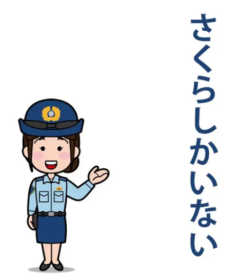
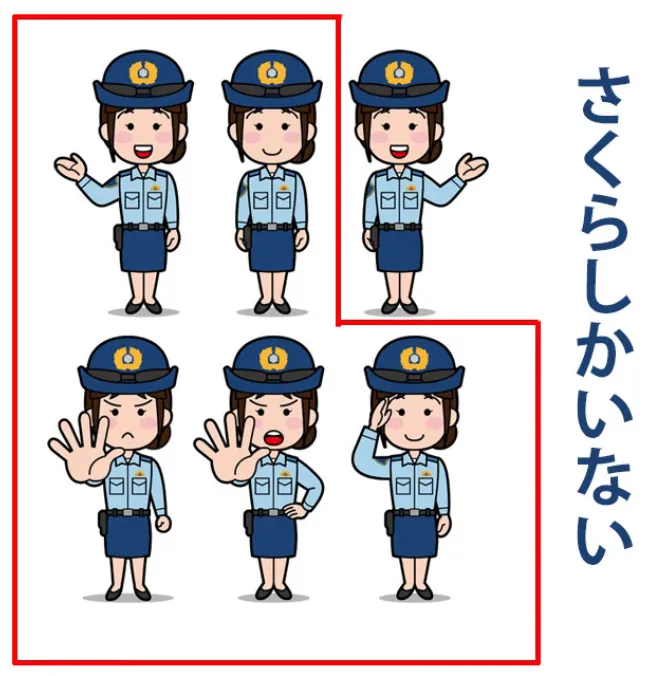
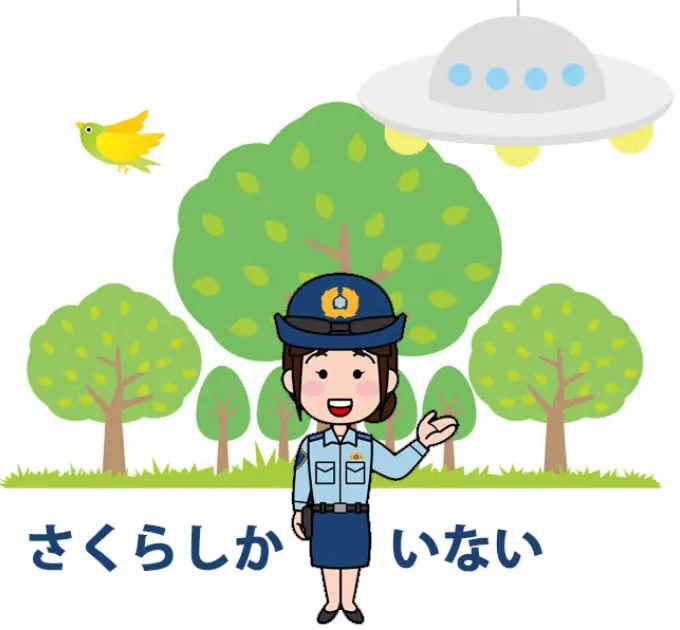
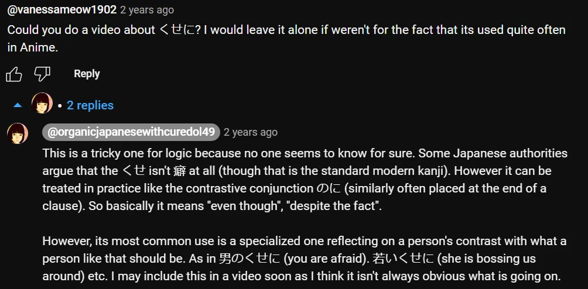

# **87. Struktur Bahasa Jepang yang Terbalik: Kehidupan Aneh しか**

[**Struktur Bahasa Jepang Terbalik: Kehidupan Aneh しか. Bagaimana Sebenarnya Cara Kerjanya. Pelajaran 87**](https://www.youtube.com/watch?v=iEnUH0L6VYs&amp;list;=PLg9uYxuZf8x_A-vcqqyOFZu06WlhnypWj&amp;index;=91&amp;ab;_channel=OrganicJapanesewithCureDolly)

こんにちは。

Hari ini, sayangnya saya tidak punya rusa kutub untuk kalian, tapi saya punya beberapa rusa. Kita akan membahas kata <code>シカ / 鹿</code>, yang, seperti yang mungkin Anda ketahui, berarti <code>deer</code>,
::: info
Sebagai catatan, partikel しか ini berbeda dengan partikel しか dalam pelajaran ini, itulah sebabnya menggunakan Katakana. Ada banyak kata benda しか dan sejenisnya dengan Kanji masing-masing, tetapi hanya ada satu partikel しか
:::

**tetapi ada <code>しか</code> dalam bahasa Jepang yang merupakan partikel** **dan yang memiliki efek yang cukup tidak biasa pada struktur kalimat.**

Jadi kita akan membahas efek tersebut. Salah satu komentator saya mengingatkan saya pada permainan kata yang cukup menarik dalam bahasa Jepang:

<code>ならならしかしかしかられない</code>, / *奈良なら鹿しか叱られない (bagaimana bentuknya dalam Kanji)*

dan dalam bahasa Inggris yang alami, kita akan menerjemahkannya sebagai **<code>In Nara, only the deer get scolded</code>.**

Perlu diketahui di sini bahwa **Nara di wilayah Kansai terkenal dengan rusa-rusanya.** Orang-orang pergi ke Nara untuk melihat rusa (dan untuk hal-hal lain — kota ini adalah kota bersejarah yang indah).

**Secara harfiah, <code>奈良なら</code> tidak berarti <code>in Nara</code>.** **Artinya <code>if it&#x27;s Nara</code> atau, secara lebih alami, <code>in the case of Nara</code>.** Tapi apa arti struktur sisanya?

Inilah yang sebenarnya ditanyakan oleh komentator saya. **Pertanyaannya adalah, &quot;Apa A-car dari kalimat ini?** **Apakah ada zero-A-car di suatu tempat, atau apakah kalimat ini bahkan memiliki A-car sama sekali?&quot;**

Apa A-car dari kalimat seperti ini? **Sekarang, masalahnya sebagian adalah bahwa <code>しか</code> memiliki** **efek yang tidak biasa pada struktur kalimat,** **tetapi juga karena penggunaan kata bantu reseptif di sini** yang membuatnya terlihat sedikit lebih rumit daripada sebenarnya.

## しか

Jadi, mari kita mulai dengan kalimat yang sangat sederhana <code>しか</code> . <code>さくら**しか**いない。</code>

Dalam bahasa Inggris alami, kita akan menerjemahkannya sebagai, <code>There&#x27;s nobody here but Sakura.</code>

**Jadi apa <code>しか</code> yang terjadi di sini?** **<code>しか</code> melakukan dua hal dalam kalimat seperti ini.** **Ia menghilangkan partikel &quot;が&quot; sama seperti <code>か</code>,** jadi ini bukanlah sesuatu yang belum kita kenal.

**Ketika Anda memiliki <code>か</code> dalam kalimat yang juga akan mengandung partikel &quot;が&quot;,** **kita tidak pernah mengatakan <code>がか</code> atau <code>かが</code>.** **<code>か</code> menggantikan partikel &quot;が&quot;, tetapi partikel &quot;が&quot; secara logis masih ada di sana.** **Itulah yang <code>しか</code> juga dilakukan.**

---

**Namun hal lain <code>しか</code> adalah sedikit lebih tidak biasa.**

Saya tidak tahu apakah Anda pernah menggunakan Photoshop, tetapi di Photoshop Anda dapat membalikkan seleksi. **Yang terjadi adalah Anda memilih sebuah objek,**

**Anda menekan tombol untuk membalikkan seleksi tersebut** **dan yang terjadi adalah semua yang berada di luar objek tersebut menjadi terpilih.**

**Objek tersebut adalah satu-satunya hal di sana yang tidak terpilih.**

---

**Inilah tepatnya yang <code>しか</code> melakukannya.** **Sedangkがe, bisa dibilang, memilih sebuah objek, sebuah kata benda,** **dan menandainya sebagai A-car, subjek kalimat,** **<code>しか</code> memilih kata benda tersebut, membalikkan seleksi** **dan menandainya sebagai A-car kalimat.**

**Jadi, segala sesuatu selain kata benda yang dipilih itu** **sekarang menjadi A-car kalimat.**

Jadi, <code>さくら**しか**いない</code> secara harfiah berarti <code>**Everyone other than** Sakura is not here</code>.

Dalam kalimat rusa, yang terlihat sedikit lebih rumit, hal ini persis sama: <code>奈良なら鹿**しか**叱られない</code> (jika itu Nara, **segala sesuatu selain** rusa tidak dimarahi).

**Jadi sekali lagi, kita memilih rusa,** **membalikkan pemilihan menjadi segala sesuatu selain rusa,** **dan kemudian itu menjadi A-car dari kalimat tersebut, yaitu <code>not scolded</code>.**

---

Sekarang, **ada juga klausa relevansi implisit di sini**, jadi ketika kita mengatakan <code>さくらしかいない</code> **kita tidak bermaksud bahwa di sini tidak ada apa-apa selain Sakura:** tidak ada pohon, tidak ada semak, tidak ada piring terbang.

**Yang kita maksud adalah tidak ada siapa pun di sini selain Sakura.**

**Sekarang, <code>いない</code> bagian ini memberi tahu kita hal itu**, tetapi bukan hanya itu, karena **hal ini juga **tidak berarti** bahwa tidak ada kelinci di sini**, **tidak ada burung, tidak ada capybara** (apakah saya mengucapkannya dengan benar?)

::: info
Ini seharusnya hanya memilih relevansi bahwa **tidak ada Sakura lain / tidak ada orang lain** di sana.
:::

**Jadi <code>しか</code> membalikkan pemilihan, tetapi ini juga** **yang bisa disebut <code>smart invert</code>: ini memilih berdasarkan relevansi.**

## &#x27;しか&#x27; dalam kalimat dengan subjek yang ditandai &#x27;が&#x27;

**Namun, dalam beberapa <code>しか</code> kalimat sebenarnya** **ada subjek yang ditandai dengan が, jadi apa yang terjadi di sini?**

Mari kita lihat salah satunya. Misalkan kita mengatakan, <code>タオル**が**一枚**しか**ありません</code>.

Sekali lagi, dalam bahasa Inggris yang alami: <code>There&#x27;s **only** one towel here.</code>
::: info
Perhatikan bagaimana dalam bahasa Jepang mereka menggunakan ありません setelah しか di sini.
:::
**Subjek yang ditandai dengan が adalah <code>towel</code> atau <code>towels</code>.** **Dalam bahasa Jepang, tentu saja, tidak ada perbedaan antara kedua hal tersebut.**

Dan seperti yang saya jelaskan dalam pelajaran saya tentang penghitungan[[71]](./71-japanese-counters-3-simple-rules.md), **penghitungan dalam kalimat semacam ini berfungsi sebagai kata keterangan.** **Hal ini memberi tahu kita lebih banyak tentang engine kalimat, yaitu kata kerja.**

Jadi, jika kita mengatakan <code>泥棒が**三人**いる</code>, kita berarti mengatakan <code>robbers*(=subject)* exist three-**person-ly**</code>. Jika kita mengatakan <code>タオルが**一枚**ある</code>, kita berarti <code>towel*(=subject)* **one-flat-thing-ly** exists</code>.

Jika kita mengatakan <code>タオルが**二枚**ある</code>, kita berarti <code>towel*(=subject)* **two-flat-thing-ly** exists</code>.

Jadi, ketika kita mengatakan <code>タオルが**一枚**しかありません</code>, **subjeknya adalah <code>towels</code>**, **maka kita memiliki hitungan <code>一枚</code> dan itu ditandai dengan <code>しか</code>.** **Jadi kita memilih satu benda datar, satu handuk,** **lalu membalikkan pilihan tersebut ke semua handuk.**

---

**Bukan semua benda datar, karena kita sudah menandai subjek sebagai <code>towel</code>.** **Jadi kita membalikkan penanda, yang berfungsi sebagai kata keterangan,** **dari satu handuk menjadi semua handuk kecuali handuk itu.**

Jadi kita mengatakan <code>towels, **everything but one**, non-exists</code>. Dalam bahasa Inggris alami, <code>There&#x27;s **only one** towel</code>.

*<code>タオルが**一枚しか**ありません</code>*

Dan begitulah cara apa yang mungkin kita sebut struktur pemilihan terbalik dari sebuah <code>しか</code> kalimat.

## &quot;しかない&quot; (Bahasa Gaul)

**Dan saya hanya ingin menambahkan di akhir bahwa** **ada penggunaan <code>しか</code> yang lebih kasual.** **Dan ini adalah saat kita mengatakan <code>しかない</code>.**

Sekarang, dalam <code>しか</code> , jelas kita hanya mengatakan <code>この古い車**しかない**</code>, yang berarti dalam bahasa Inggris alami <code>There&#x27;s only this old car.</code>

**Kita memilih mobil, membalikkan pilihan:** <code>**all cars other than** this old car **non-exist**</code>.

---

**Tapi kita juga bisa menempatkannya <code>しかない</code> di akhir klausa logis** **atau kata kerja yang menggantikan klausa logis.** **Sekarang, ini tidak sepenuhnya gramatikal, tetapi dalam percakapan sehari-hari hal ini sering terjadi.**

Jadi, jika Anda mendengar dalam anime seseorang berkata <code>逃げる**しかない!**</code>, mereka sebenarnya mengatakan <code>(we) **gotta** run!</code> dalam bahasa Inggris alami. Yang mereka katakan secara harfiah adalah, **kami mengambil ini <code>逃げる</code>,** **kami menandainya dengan <code>しか</code> sehingga yang kita pilih** **bukanlah <code>逃げる</code> (lari) melainkan segala hal selain lari.**

Dan sekali lagi, **di sinilah relevansi pemilihan cerdas berperan.** Yang sebenarnya kita katakan adalah <code>**every course of action other than** running *(away)* **doesn&#x27;t exist**</code>.

Ya, tentu saja itu ada, **ini sangat informal**, tetapi sejauh yang kami ketahui itu tidak ada: **tidak ada pilihan lain selain berlari** *(menjauh)*.

---

**Dalam bahasa Inggris** kita mungkin akan mengatakan, <code>**It&#x27;s run or nothing**</code>, dan sekali lagi, **itu tidak sesuai tata bahasa dan karena alasan yang sama** **bahwa bahasa Jepang itu tidak sesuai tata bahasa, bahwa <code>run</code> bukanlah kata benda.**

**Tapi, ketika benda itu mengejarmu, siapa yang peduli dengan tata bahasa?.**
::: info
Beberapa komentar berguna, kurasa, di bawah video…

*Satu hal tambahan tentang &quot;くせに&quot; (癖に?), untuk pelajaran lengkapnya, dia membuat [**video ini**](https://www.youtube.com/watch?v=QvuNXIYqFNM&amp;pp;=ugMICgJqYRABGAHKBRRjdXJlIGRvbGx5IOOBj-OBm-OBqw%3D%3D)* */ Pelajaran 93*
:::