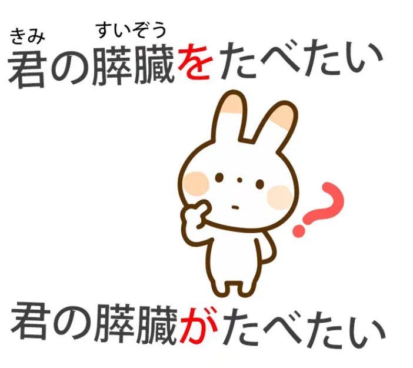
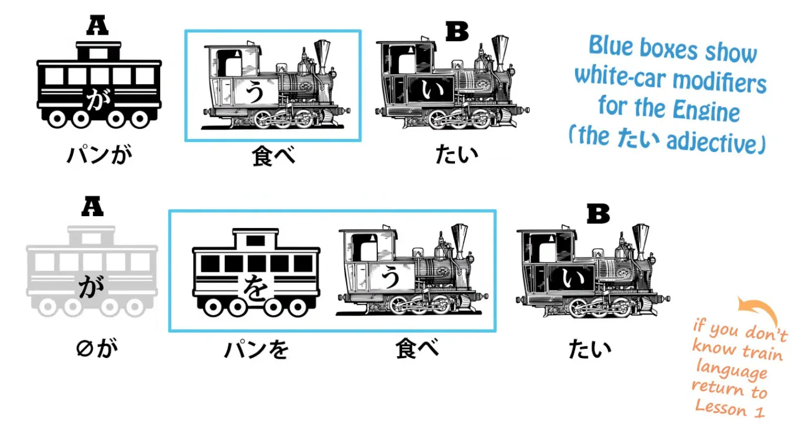
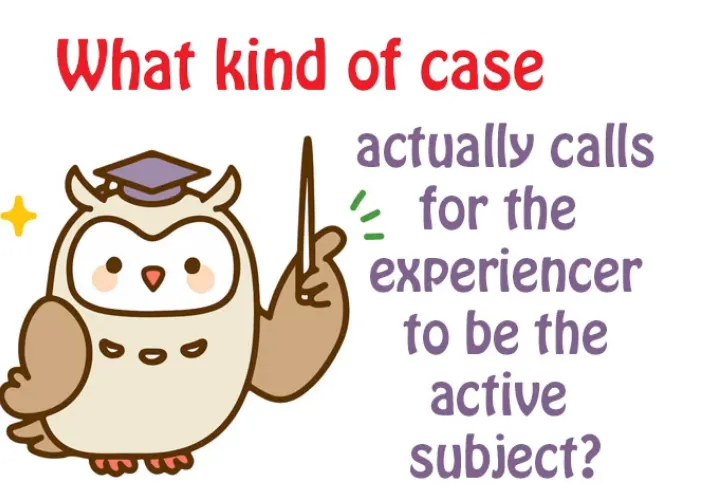
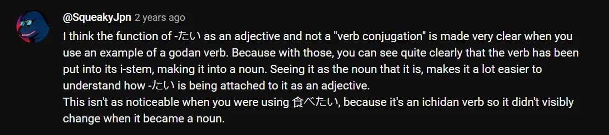

# **88. Xをしたい

vs Xがしたい

** 

[**Inti Bahasa Jepang yang Tak Terkalahkan. Bagaimana logikanya tak pernah gagal. Xをしたい

vs Xがしたい

| Pelajaran 88**](https://www.youtube.com/watch?v=Gi3BmIRZZPs&amp;list;=PLg9uYxuZf8x_A-vcqqyOFZu06WlhnypWj&amp;ab;_channel=OrganicJapanesewithCureDolly)

こんにちは。

Hari ini kita akan membahas struktur dasar inti bahasa Jepang dan sebuah masalah yang mengganggu sebagian orang mengenai hal itu, yang telah saya coba selesaikan[[43]](./43-paradigm-shift-cut-through-the-confusion.md)

namun menurut saya masih ada beberapa kesulitan, jadi hari ini saya akan mencoba menjawab pertanyaan tersebut, semoga ini menjadi yang terakhir kalinya. Dan dalam melakukannya, kita akan melihat teka-teki yang ditimbulkan oleh judul sebuah karya yang sangat populer.

Karya ini telah diadaptasi menjadi manga, anime, dan film live-action: <code>**君の膵臓を**食べたい</code>, yang secara harfiah berarti <code>I want to eat **your pancreas**</code>, dan kita akan membahas mengapa secara harfiah berarti itu sebentar lagi. Saya sebenarnya tidak tahu apa itu pankreas. Saya kira itu adalah stasiun kereta api di London. Tapi ternyata itu adalah organ yang terdapat di dalam tubuh manusia dan segala sesuatunya tidak berjalan baik tanpa itu. Saya tidak begitu paham apa yang akan ditemukan jika melepas panel depan dan belakang tubuh manusia, jadi kita belajar hal baru setiap hari! Itulah mengapa saluran ini diklasifikasikan sebagai saluran edukasi, saya kira.

Jadi, pertanyaan yang akan muncul di benak siapa pun yang memahami struktur bahasa Jepang yang sebenarnya, adalah:

## Mengapa partikel &quot;を&quot; digunakan di sini, bukan partikel &quot;が&quot;?

**Mengapa partikel を digunakan di sini, bukan partikel が?**

Jika kita ingin mengatakan apa yang dalam bahasa Inggris akan menjadi  
<code>I want to eat that **bread**</code> atau <code>I want to eat that **cake**</code>, kita akan mengatakan  
<code>パン**が**食べたい</code>, <code>ケーキ**が**食べたい</code>.

Dan, seperti yang kita lihat, **kata sifat <code>たい</code>**,  
**kata sifat keinginan <code>たい</code>, tidak mengacu pada saya tetapi pada kue.**

**Kue tersebut membawa partikel &quot;が&quot;, sehingga itulah yang dijelaskan oleh kata sifat tersebut.**

---

Dan kebingungan pun muncul[[9]](./9-the-subject-of-the-japanese-sentence-expressing-desire- ほしい - たい - たがる.md) ketika kita menerjemahkan ini secara harfiah sebagai **  
<code>I want to eat cake</code>, karena itu bukan artinya.**

****Artinya** <code>cake is want-inducing (to me)</code>.** *(私は) ケーキが食べたい。*

---

**Namun kita juga tahu bahwa kata sifat subjektivitas ini, seperti kata sifat subjektivitas lainnya,**

**seperti <code>怖い</code> (frightening), dan juga potensi seperti できる atau 食べられる --**

**karena potensi juga merupakan jenis subjektivitas.**

---

**Itu adalah sesuatu yang khas bagi individu, apakah mereka bisa atau tidak bisa melakukan hal tertentu.**

**Hal itu tidak melekat pada benda itu sendiri.**

**Itu akan menjadi <code>可能性</code>.**

---

**Kita tahu bahwa semua ini umumnya mengarah pada hal yang mungkin, hal yang**

**memicu keinginan untuk makan, hal yang menakutkan, dan sebagainya.**

**Namun, polaritasnya juga bisa dibalik.**

**Dan hal itu terbalik terutama ketika tidak ada penyebab yang sebenarnya, penyebab yang terlihat atau**

**nyata dari subjektivitas tersebut.**

## Pembalikan polaritas

Jadi jika kita mengatakan, <code>お腹が空いた、 *(zeroが)* 早く食べたい</code>, *- sepertinya ada 2 klausa, ya?*

kita mengatakan <code>Tummy is empty, I want to eat soon</code>.

**Sekarang, <code>たい</code> menunjuk pada saya, bukan pada hal tertentu, seperti kue atau apa pun.**

Nah, inilah poin yang sebenarnya ditolak oleh beberapa orang dan mereka berkata,  
&quot;Nah, bukankah kita bisa mengatakan bahwa itu sebenarnya tidak mengatakan &#x27;Saya ingin makan&#x27;,  
melainkan &#x27;makanan secara umum membuat saya ingin makan&#x27;?&quot;

**Sebenarnya tidak.**

**Perut kosongmu lah yang membuatmu ingin makan.**

Dan hari ini kita akan melihat beberapa konstruksi, dan yang baru saja kita bahas
adalah salah satunya, yang membuatnya 100% jelas bahwa **bukan hanya dalam kasus di mana tidak ada**
**penyebab subjektivitas, tetapi juga dalam beberapa kasus di mana ada penyebabnya, kata sifat subjektivitas tetap dapat mengubah polaritasnya.**

Sekarang, mengapa orang-orang menolak gagasan ini?

**Faktanya, hal ini tidak asing bahkan dalam bahasa Inggris.**

Kita dapat mengatakan <code>*We* were **happy** that day</code>, dalam hal ini **kata sifat <code>happy</code> menunjuk pada kita**
(kitalah yang bahagia) atau kita bisa mengatakan

<code>That was a **happy** *day*</code>, dan sekarang **kata sifat subjektivitas mengacu pada hari itu, yang merupakan penyebab kebahagiaan kita.**

Kita bisa mengatakan <code>*I* am **suspicious** of her behavior</code> dan **kata sifat <code>suspicious</code> menunjuk ke saya**
(saya adalah orang yang curiga)

atau <code>*her behavior* is **suspicious**</code>, dan sekarang **kata sifat <code>suspicious</code> menunjuk pada perilakunya sebagai penyebab subjektivitasku.**

Jadi ini bukanlah sesuatu yang tidak pernah terjadi, bahkan dalam bahasa Inggris.

Alasannya, menurutku, orang-orang menjadi begitu gelisah tentang hal ini dan begitu bertekad untuk menemukan
cara-cara yang cukup tidak mungkin untuk mengelak darinya adalah hal yang sangat bisa dimengerti.

Itu karena mereka mungkin telah menghabiskan berbulan-bulan atau bahkan bertahun-tahun di dunia yang sangat membingungkan ini
di mana partikel-partikel hanya mengubah maknanya tergantung dari sisi mana mereka bangun tidur pada pagi itu.

::: info
(Dolly di sini 👇 sedang memberikan contoh tentang kebingungan <code>trying to force English into Japanese</code>)  
:::

Jadi, &quot;<code>が</code> biasanya menandai subjek kalimat tetapi juga bisa menandai objek kalimat
seperti dalam **<code>パンが食べたい</code>**, di mana jelas roti bukanlah subjek kalimat;
melainkan saya, &#x27;Saya ingin makan roti&#x27;.&quot;

**Nah, kita tahu bahwa ini bukan kasusnya.**

**Kita tahu bahwa dalam kasus-kasus tersebut, roti-lah yang menjadi subjek; roti-lah yang membuat saya ingin makan.**

---

Dan jika kita mulai mengatakan  
&quot;Bahwa polaritasnya bisa berbalik, bukankah itu juga merusak model struktur bahasa Jepang  
yang menghilangkan semua ambiguitas ini atau justru menimbulkan ambiguitas baru

sehingga, ooh ada aturan khusus yang kadang-kadang menunjuk ke arah ini dan kadang-kadang ke arah itu&quot;, ya, jawabannya adalah tidak, itu tidak berpengaruh pada model.

**Itu sama sekali tidak relevan dengan model tersebut.**

**Apakah kita memilih** untuk mengatakan <code>パン**が**食べたい</code> (roti membuat saya ingin makan) atau

<code>パン**を**食べたい</code> (Saya ingin makan roti) **tidak masalah.**

**Satu-satunya hal yang penting bagi model adalah bahwa partikel-partikel tersebut selalu melakukan hal yang sama.**

Jika kita mengatakan <code>**パンが**食べたい</code>, kita berarti mengatakan <code>**The bread** ***(=Subject)*** is making me want to eat</code>.

*vs*

Jika kita mengatakan <code> *(zeroが)* **パンを**食べたい</code>, kita mengatakan bahwa <code>(I) want to eat **bread**</code> *(=Objek Langsung).*

::: info
Di sini, nol が adalah <code>I</code> Subjek, sedangkan パンを adalah Objek Langsung = roti.
:::

**Dan model tidak peduli cara mana yang kita gunakan.**

**Model melakukan hal yang sama dalam kedua kasus.**

**Semua partikel melakukan hal yang persis sama.**

## Bagaimana cara membenarkan model ini secara gramatikal?

Sekarang, bisakah kita membenarkan ini secara gramatikal?

Jadi, jika kita mengatakan, misalnya, <code>パン**を**食べたい</code>, tentu saja masalahnya di sini adalah bahwa  
**dengan <code>たい</code> kita memiliki kata sifat, sehingga kita memiliki kalimat kata sifat,  
dan kata sifat, seperti yang kita ketahui, tidak dapat memiliki objek langsung.**

Jadi, bagaimana kita bisa mengatakan <code>パンを食べたい</code>?

Dan jawabannya sebenarnya sangat sederhana.

**Bahasa Jepang, seperti yang kita ketahui, sangat mahir dalam menggabungkan unsur-unsur verbal menjadi satu unsur atau memisahkannya sesuka hati.**

**Dan yang terjadi dalam kalimat seperti <code>パンを食べたい</code> adalah bahwa  
**<code>たい</code> tidak lagi hanya terikat pada kata kerja <code>食べる</code>.****

---

**Kita tidak mengatakan <code>パンを</code> dan kemudian <code>食べたい</code>,**

****kita mengatakan <code>パンを食べ...</code> dan <code>たい</code> diterapkan pada seluruh unit tersebut.****

****Yang kami inginkan adalah tindakan <code>パンを食べる</code>, sehingga kami dapat melekatkan <code>たい</code> ke seluruh unit tersebut.****

**Itulah yang membuat konstruksi-konstruksi ini masuk akal.**

---

Dan meskipun <code>パン**を**食べたい</code> **adalah cara yang kurang umum untuk mengatakannya**, dan secara umum

<code>何々**を**食べたい</code> adalah cara yang kurang umum untuk mengatakannya,  
**ada beberapa jenis kalimat di mana cara itulah yang selalu kita gunakan.**

Misalnya, <code>助けたい</code> (ingin membantu) atau <code>守りたい</code> (ingin membela).

**Kita tidak mengatakan** <code>さくら**が**守りたい</code>,

**kita mengatakan** <code>さくら**を**守りたい</code>.

**Dan jika kita berbicara tentang <code>正義</code> (keadilan) atau <code>平和</code> (damai) atau bahkan <code>国</code> (negara), halnya sama.**

**Kita tidak mengatakan Sakura membuatku ingin membelanya, kita tidak mengatakan negara membuatku
ingin membelanya, kita tidak mengatakan keadilan membuatku ingin membelanya, atau perdamaian membuatku ingin membelanya.**

Kita selalu mengatakan <code>I want to defend **Sakura**</code>, <code>I want to defend **justice**</code>,
<code>I want to defend **peace**</code>, <code>I want to defend **the country**</code>.  
*(semua sebagai Objek Langsung, bukan Subjek seperti yang ditunjukkan di atas, karena digunakan dengan partikel &quot;を&quot;)*

Mengapa demikian?

Nah, pada dasarnya **saya pikir alasannya adalah kita tidak sedang membicarakan keinginan yang impulsif.**

**Jika kita melihat roti dan ingin memakannya**, <code>Ah, パン**が**食べたい</code>(**roti membuat saya ingin memakannya**).

---

**Tapi di sini kita berbicara tentang hal-hal yang lebih abstrak, hal-hal yang kurang impulsif.**

**Dan dalam kasus orang, lebih sopan untuk mengatakan**

<code>さくら****を****守りたい</code> daripada <code>さくら**が**守りたい</code>,

**karena kita tidak mengatakan bahwa Sakura adalah sebuah objek** *(secara implikasi dan tata bahasa, memang begitu:D)*

**yang membuat saya ingin membelanya, seperti sepotong roti yang mungkin ingin kita makan,**

**kita mengatakan bahwa tindakan membelanya adalah sesuatu yang ingin saya lakukan,**

**yang lebih bermartabat dalam hal seorang manusia.**

---

**Tetapi dalam kasus, katakanlah, negara, atau perdamaian, atau keadilan, atau bahkan sebuah rumah atau taman,**

****kita berbicara tentang sesuatu yang kurang impulsif dan lebih merupakan keputusan kita sendiri,****

**jika bukan keputusan sadar, maka sebuah pola pikir, cara berpikir yang menjadi milik kita.**

**Jadi kita membicarakan tindakan itu **sebagai milik kita sendiri** daripada sesuatu yang dipicu oleh penyebab eksternal.**

---

Jika kita memang mengatakan <code>パン****を****食べたい</code>,

**ini kemungkinan besar terjadi dalam kondisi di mana kita berbicara secara lebih umum,**

**kita tidak sedang membicarakan aroma roti yang indah itu yang membuat**

**roti tersebut membuat kita ingin memakannya.**

**Kita tidak sedang membicarakan permen yang baru saja kita lihat yang membuat kita ingin memakannya.**

****Kita sedang membicarakan keinginan umum untuk makan roti.****

---

Jadi **kita lebih cenderung mengatakan** <code>**パンを**食べたい時</code> (ketika saya ingin makan **roti***=Objek Langsung*)
::: info
Dalam kalimat di atas, <code>I</code> seharusnya menjadi Subjek, yang tersembunyi dalam bahasa Jepang sebagai subjek nol (が).
:::
****daripada**** <code>**パンが**食べたい時</code> (ketika **roti***=Subjek* membuat saya ingin memakannya).

****Dan ini bukanlah aturan yang tegas dan pasti, tetapi ini adalah semacam kecenderungan,****

**semacam alasan, nuansa, yang menentukan ke arah mana**

**kita cenderung membalik kata sifat keinginan tersebut, dalam hal ini, <code>たい</code>.**

## Jadi mengapa を digunakan dalam 君の膵臓を食べたい?

Jadi jika kita kembali ke <code>君の膵臓**を**食べたい</code>, **mengapa &#x27;を&#x27; digunakan di sini?**

Nah, pada dasarnya **karena sekali lagi ini bukan dorongan untuk makan.**

**Kita tidak melihat pankreas gadis itu dan berpikir betapa lezatnya itu.**

Itu pun akan cukup sulit dilakukan.

**Sesuatu yang lebih halus, lebih abstrak, dan lebih dalam sedang dibahas di sini,
keinginan untuk alasan emosional dan cukup kompleks untuk memakan pankreas seseorang.**

Jadi saya harap kali ini kita benar-benar telah mengakhiri pertanyaan terakhir tentang pergantian polaritas *(dari Pelajaran 43)*.

**Hal itu tidak mengancam model. Dan hal itu memang terjadi.**

****Dan hal itu terjadi karena alasan-alasan yang agak halus, yang mungkin membutuhkan waktu untuk dipahami****

****dan keterlibatan penuh untuk dipahami, karena Anda tidak bisa mempelajari segalanya hanya melalui struktur mentah.****

::: info

Baca [****POHON KOMENTAR INI****](https://www.youtube.com/watch?v=Gi3BmIRZZPs&amp;lc;=UgyOhoQLaj1rzfKcTWV4AaABAg&amp;ab;_channel=OrganicJapanesewithCureDolly) di mana Dolly memberikan beberapa informasi berguna tentang penggunaan が.  
Komentar tersebut juga sedikit menyinggung kasus-kasus di mana terdapat 2 Partikel logis yang terlihat seperti が atau を dalam satu klausa, karena hal ini dapat terjadi pada situasi tertentu seperti pada Adjektiva majemuk seperti 頭がいい.
*Selain itu, [**ini**](https://www.youtube.com/watch?v=Gi3BmIRZZPs&amp;lc;=UgziEAPSnr0SnhrQT8Z4AaABAg.9I_i6CnMTAb9I_ko3FwzJU&amp;ab;_channel=OrganicJapanesewithCureDolly) dapat berguna jika hal-hal terkait &quot;たい&quot; yang digunakan bersama &quot;を&quot; terasa sedikit membingungkan, [**begitu pula dengan ない**](https://www.youtube.com/watch?v=Gi3BmIRZZPs&amp;lc;=UgzdlJPBSPKfEnC5CTt4AaABAg.9KGUKbPabp79KHKmr1rRl_&amp;ab;_channel=OrganicJapanesewithCureDolly).*

*Semoga ini bisa dibaca/dipahami dengan baik &amp; tidak terlalu bertele-tele, tapi ada begitu banyak hal penting yang disebutkan di sini sehingga saya benar-benar tidak punya pilihan lain, sampai-sampai saya bahkan harus menebalkan teks di beberapa bagian agar lebih jelas. Sangat disarankan untuk membaca komentar-komentarnya.*
:::
