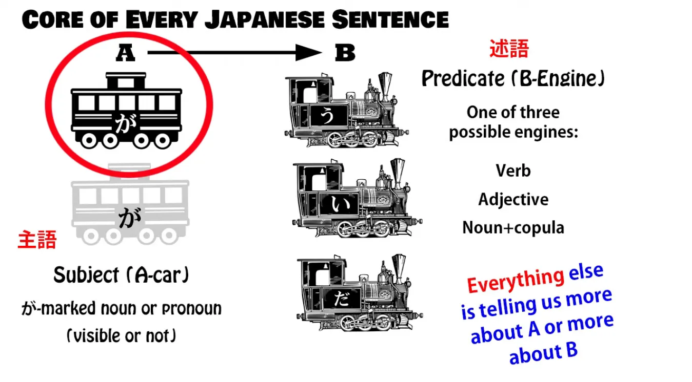
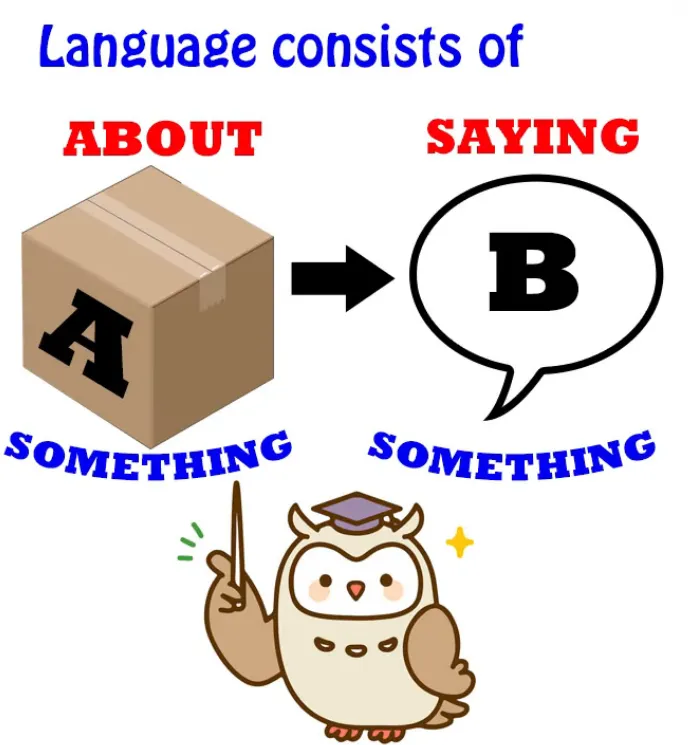
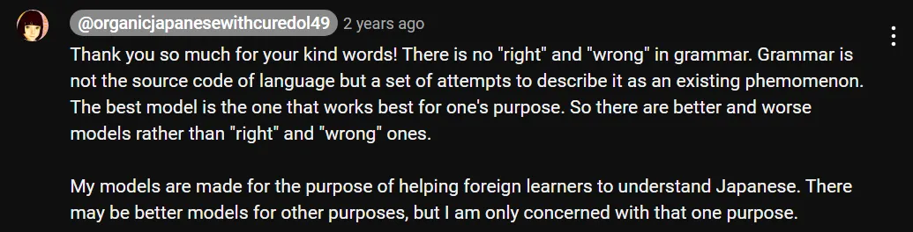
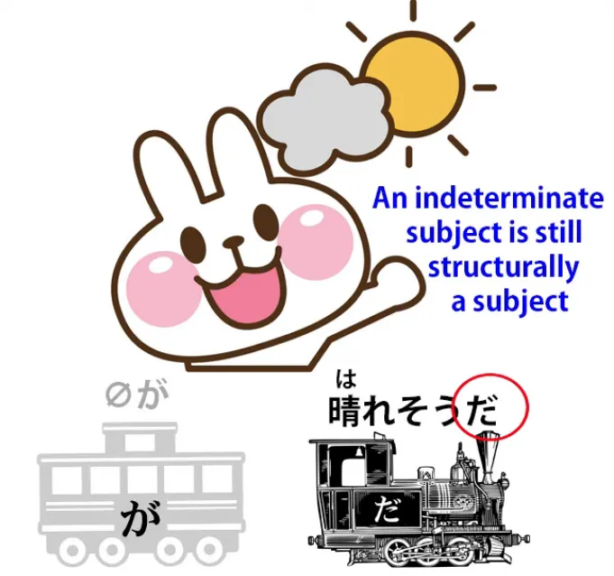
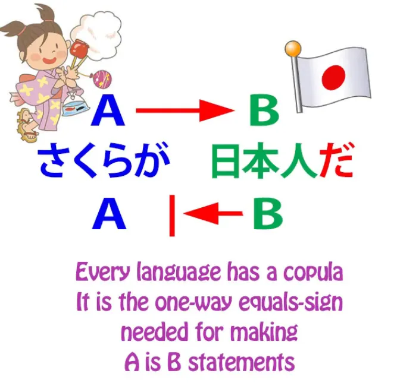
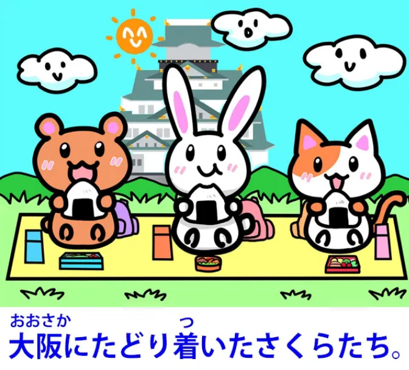
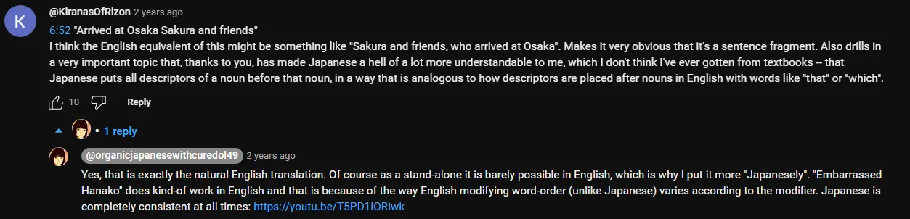
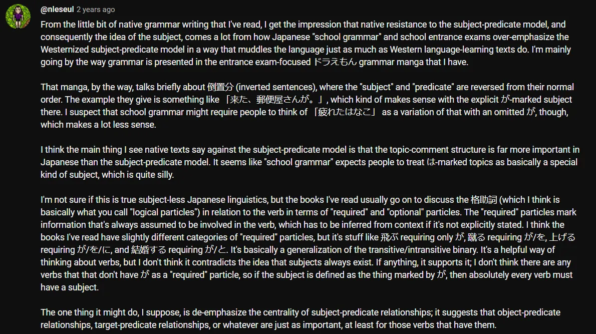

# **89. Mengungkap Rahasia Bahasa Jepang. Subjek Universal** 

[**Mengungkap Misteri Bahasa Jepang. Biarkan bahasa paling logis di dunia bersinar! Pelajaran Subjek Universal 89**](https://www.youtube.com/watch?v=CEgGnitwXGA&amp;list;=PLg9uYxuZf8x_A-vcqqyOFZu06WlhnypWj&amp;ab;_channel=OrganicJapanesewithCureDolly)

こんにちは。

Hari ini kita akan membahas sesuatu yang merupakan dasar utama bahasa Jepang dan yang telah kita bahas sejak pelajaran pertama. **Yaitu, subjek gramatikal, yang dalam bahasa Kereta kalimat kita sebut sebagai <code>A-car</code>.**

Dan seperti yang kita ketahui, setiap kalimat dalam bahasa Jepang harus memiliki **kereta A, subjek, <code>主語</code> dalam bahasa Jepang**, dan **engine B — yaitu predikat, atau <code>述語</code> dalam bahasa Jepang.**

**Dengan kata lain, setiap kalimat sedang mengatakan sesuatu tentang sesuatu.**

Sekarang, beberapa orang berpendapat bahwa tidak ada subjek dalam bahasa Jepang; beberapa guru berpendapat demikian, termasuk Tae Kim-sensei, dan

  
umumnya ini karena mereka tidak memiliki pemahaman yang baik tentang bagaimana bahasa tersebut sebenarnya bekerja. Beberapa orang Jepang, minoritas di kalangan ahli bahasa, juga mengusulkan model tanpa subjek untuk bahasa Jepang.

::: info
Sekali lagi, ini semata-mata karena perbedaan model, sama seperti bagaimana Dolly mengusulkan bahwa tidak ada konjugasi atau kalimat pasif. Biasanya, dalam konteks linguistik tata bahasa Jepang yang berasal dari NATIVE, jika sesuatu disebut sebagai x, secara linguistik hal itu layak digunakan untuk mendeskripsikan bahasa tersebut, tetapi beberapa model memiliki sistemnya sendiri yang mungkin setuju atau tidak setuju dengan hal tersebut, karena berbagai alasan.  
Sama seperti yang dikatakan Dolly di bawah ini, model-model ini ada untuk mendeskripsikan bahasa dalam potongan yang koheren sambil mencari titik temu, tetapi mereka mungkin berbeda dalam beberapa kasus.  
Pilihan model mana yang akan Anda gunakan terserah Anda; pada akhirnya, Anda akan mencapai kemahiran dalam bahasa tersebut, baik dengan cara apa pun, begitu Anda tidak lagi memerlukan penjelasan dan terminologi serta telah menguasai bahasa tersebut secara otomatis. Namun, mempelajari konsensus umum dalam sebagian besar model linguistik (terutama yang asli) tetap membantu.

:::

**Seperti yang telah saya katakan sebelumnya, tata bahasa, struktur, model, atau apa pun sebutannya, bukanlah kode sumber bahasa. Mereka hanyalah sarana untuk mendeskripsikan bahasa setelah fakta.** Jadi mungkin saja merancang model untuk bahasa Jepang yang tidak menggunakan konsep subjek, tetapi pada dasarnya ini hanya akan mengutak-atik terminologi.

Ada orang Jepang yang masuk ke kolom komentar saya dengan nada marah dan mengatakan bahwa saya &quot;memperbarat&quot; bahasa Jepang dengan memperkenalkan konsep subjek. Sekarang, saya pikir jika Anda mengenal karya saya, Anda tahu bahwa saya tidak &quot;memperbaratikan&quot; bahasa Jepang.

Saya mengajarkan bahasa Jepang sebagai bahasa Jepang. **Apakah model tanpa subjek benar-benar valid atau tidak, saya tidak tahu. Saya belum menelitinya.**

**Namun, yang perlu kita tunjukkan adalah bahwa model subjek yang kita gunakan dan yang digunakan oleh sebagian besar ahli bahasa Jepang berfungsi dan selalu berfungsi, sepenuhnya, dapat diandalkan, dan dapat diprediksi.**

## <code>Null-Subject</code>

**Beberapa bahasa disebut <code>null-subject languages</code> dalam linguistik, yang sebenarnya tidak berarti mereka tidak memiliki subjek, melainkan subjek mereka tidak selalu terlihat, yang persis seperti yang kita temui dalam bahasa Jepang.**
::: info
Hal tentang Subjek yang tidak terlihat ini jauh lebih mudah dipahami dalam bahasa Jepang jika bahasa ibu Anda juga memilikinya seperti itu (tentu saja). Itulah sebabnya penutur asli bahasa Inggris cenderung (tentu saja) kesulitan menghadapinya karena bahasa Inggris umumnya membutuhkan Subjek yang dinyatakan secara langsung/terlihat &amp; mengapa ada penjelasan-penjelasan membingungkan yang mencoba memaksakan cara bahasa Inggris <code>Subject must be voiced/visible</code>ke dalam bahasa Jepang.
:::

Dalam bahasa Spanyol, misalnya, **kita umumnya tidak mengatakan**, <code>**Yo** soy Americana</code>, meskipun kita diajarkan untuk melakukannya oleh buku teks. **Dan alasan kita tidak melakukannya adalah karena <code>yo</code> itu berlebihan.**

**<code>Soy</code> menyiratkan <code>I</code>, jadi jika kita hanya mengatakan <code>Soy Americana</code>, itu saja yang perlu kita katakan. Yang lainnya berlebihan. Hal yang sama berlaku dalam bahasa Inggris.**

Jika kita mengatakan <code>I am American</code>, kita sebenarnya tidak memerlukan <code>I</code>, karena <code>am</code> menyiratkan <code>I</code>. **Kita tidak menggunakan <code>am</code> dengan apa pun selain <code>I</code>, jadi <code>I</code> menjadi berlebihan.**

**Hanya saja bahasa Inggris tidak mengizinkan Anda untuk menghilangkannya. Jadi ini hanya soal aturan.** Bahasa Jepang tidak bekerja seperti ini, karena bahasa Jepang tidak memiliki konjugasi seperti <code>am / is / are</code>. Faktanya, bahasa Jepang sama sekali tidak memiliki konjugasi, terlepas dari apa yang dikatakan buku teks.

**Dalam bahasa Jepang, subjek nol ditentukan sepenuhnya dari konteks. Dan ketika konteks tidak menjelaskannya, biasanya secara default menjadi <code>I</code>.**

---

**Ini hampir persis seperti yang dilakukan bahasa Inggris <code>it</code> , kecuali bahwa <code>it</code> dalam bahasa Inggris tidak dihilangkan.**

Jadi jika saya mengatakan <code>**It** fell from the sky / **It** ate my breakfast / **It**&#x27;s half the size of the other one</code>, **Anda tidak akan tahu apa <code>it</code> itu kecuali konteks memberikan jawabannya.**  
**Beginilah cara kerja subjek tak terlihat dalam bahasa Jepang.**

**Fakta bahwa kita dapat melihat dan mendengar <code>it</code> dan kita tidak bisa melihat atau mendengar subjek tak terlihat tidak membuat perbedaan apa pun dalam hal ini.**

Jadi, jika kita mengambil jenis kalimat yang orang coba sebut <code>subjectless</code>, mari kita ambil kalimat seperti <code> *(zeroが)* 疲れた</code>.

**Sekarang, secara harfiah ini hanya berarti <code>Tired</code>, jadi bisa disebut kalimat tanpa subjek, tetapi sama sekali bukan** — kecuali Anda ingin menghindari istilah tersebut <code>subject</code> karena alasan Anda sendiri.

Ketika kita mengatakan <code>疲れた</code>, **kita tidak mengatakan bahwa kelinci di bulan itu lelah. Kita tidak mengatakan bahwa Mickey Mouse lelah.**

**Kita tidak mengatakan bahwa kelelahan menyelimuti alam semesta yang dikenal seperti kabut ungu. Kita mengatakan <code>I am tired</code>.** Jika bukan itu yang dimaksud, bahasa Jepang bukanlah bahasa, karena kita tidak bisa melakukan hal dasar yang harus dilakukan oleh sebuah bahasa, yaitu membuat Pernyataan B tentang Hal A.

Jika saya melihat seorang gadis dan berkata <code> *(zeroが)* 綺麗なのね?</code>

**sekali lagi, saya tidak mengatakan bahwa kelinci di bulan itu cantik atau bahwa kehidupan pada umumnya itu cantik. Saya memiliki subjek yang sangat jelas yang diketahui baik oleh saya maupun pendengar.**

## Subjek yang Tidak Jelas

**Sekarang, ada kasus di mana kita memiliki subjek yang tidak jelas**, dan beberapa orang mungkin mencoba berargumen bahwa setidaknya inilah kalimat-kalimat Jepang mistis tanpa subjek yang kita bicarakan. **Namun sebenarnya, kalimat-kalimat ini tidak berbeda dengan padanan bahasa Inggrisnya.**

Jadi kita mungkin mengatakan <code> *(zeroが)* 晴れそうだ</code>, yang berarti <code>*(***it***)* looks like being fine</code>.

Dan Anda bisa bertanya <code>What looks like being fine? The weather, the day, this part of the world?</code> **Tidak ada jawaban yang pasti.**

**Dan tentu saja hal ini sama dalam bahasa Inggris dan Jepang. Subjeknya tidak ditentukan. Dalam bahasa Inggris, kita tahu ada subjek karena posisinya ditempati oleh <code>it</code>.**

**Bagaimana dengan bahasa Jepang? Apakah kita hanya memaksakan subjek ke dalamnya? Tidak, kita tidak melakukannya. Perhatikan <code>だ</code>, kopula <code>だ</code>.**

Kita semua tahu apa <code>だ</code> itu[[79]](./79-deeper-secret-of-the-copula.md) (&amp; jika Anda tidak tahu, [**saya akan menyertakan tautan video**](https://www.youtube.com/watch?v=euHYPcMoao4) agar Anda bisa mengikutinya).

*---

**Kopula memberi tahu kita bahwa satu hal adalah hal lain.**

Jika kita mengatakan <code>Roses **are** flowers / Mary **is** an artist / Today **is** Saturday</code> **kita sedang menghubungkan satu hal (subjek) dengan hal lain (predikat),  
atau mobil A dengan engine B.**

**Inilah yang <code>だ</code> melakukannya dan itulah satu-satunya yang dilakukannya.**

**Jadi kita tahu bahwa kalimat ini memiliki subjek nol meskipun tidak ditandai oleh <code>it</code>.**

**Kita tidak bisa melihatnya, kita tidak bisa mendengarnya, tetapi kita tahu pasti bahwa ia ada di sana, karena tanpa ia <code>だ</code> sama sekali tidak masuk akal.**

## Kalimat Tanpa Subjek Sejati dalam Bahasa Jepang

**Sekarang, sebenarnya ada satu jenis kalimat dalam bahasa Jepang yang benar-benar tanpa subjek.** Anda juga bisa menemukannya dalam bahasa Inggris, tetapi hal ini sedikit lebih umum dalam bahasa Jepang — namun tidak terlalu umum.

Dan **ini adalah kalimat seperti** <code>大阪にたどり着いた桜たち</code> **atau** <code>恥ずかしくなったハナコ</code>.

::: info
Saya menuliskan nama Hanako dalam huruf Katakana pada kalimat contoh kedua.
:::

**Ini sebenarnya bukan kalimat, dan kebanyakan ahli bahasa tidak akan menganggapnya sebagai kalimat** dalam bahasa Jepang. **Yang sebenarnya adalah kata benda yang dimodifikasi.** Jadi, yang kita katakan adalah <code>Arrived-at-Osaka Sakura and friends</code>.

**Kita tidak mengatakan <code>Sakura and friends arrived at Osaka</code>. Kita hanya mengatakan <code>Sakura and friends</code> dan memodifikasinya dengan kata sifat <code>arrived-at-Osaka</code>.**

**<code>恥ずかしくなったハナコ</code> — Kita tidak mengatakan <code>Hanako became embarrassed</code>, kita mengatakan <code>Embarrassed Hanako</code>.**
::: info
Atau mungkin <code>Hanako, **who became embarrassed**…</code>* 
:::
::: info
Maaf zoom-nya jelek, <code>Youtubed</code> lagi. Modifikasi semacam ini pada dasarnya bisa diterjemahkan ke dalam bahasa Inggris sebagai semacam klausa relatif. Tautan oleh Dolly merujuk ke Pelajaran 46.
:::

Kapan kita menggunakan <code>sentences</code> seperti ini?

Yah, tidak terlalu sering, tapi **mereka bisa digunakan dalam narasi, karena pada dasarnya yang mereka lakukan adalah merangkum sesuatu yang terjadi sebelumnya** — Anda sering melihat ini, misalnya, dalam permainan di mana saat Anda memuatnya, mereka memberi Anda ringkasan singkat tentang apa yang sudah terjadi — atau saat Anda menggambarkan hasil dari sesuatu yang telah terjadi: <code>And the result was, **an embarrassed Hanako**</code>.

**Ini benar-benar, menurut saya, satu-satunya contoh yang bisa kita temukan dari apa yang mungkin disebut kalimat tanpa subjek, tapi sebenarnya bukan kalimat tanpa subjek karena itu bukan kalimat.** **Itu hanyalah kata benda dengan sedikit modifikasi.**

**Jadi, jika Anda menemui hal ini,** dan Anda akan menemui hal ini dari waktu ke waktu jika Anda sedang belajar bahasa Jepang secara imersi, **Anda tidak menemukan kalimat tanpa subjek, melainkan menemukan teknik naratif tertentu yang kadang-kadang digunakan dalam bahasa Jepang.**

Hal ini tentu saja tidak memperkuat argumen orang-orang yang mengatakan bahwa tidak ada subjek dalam bahasa Jepang, karena ini hanyalah sebagian kecil dari kalimat-kalimatdan tentu saja tidak memengaruhi fakta bahwa **kalimat yang sesungguhnya yang memberi tahu kita sesuatu tentang sesuatu selalu memiliki A-car dan B-engine, subjek dan predikat.**

Jika Anda memiliki pertanyaan atau komentar, silakan tulis di kolom Komentar di bawah dan saya akan menjawab seperti biasa. Saya ingin mengucapkan terima kasih kepada para pendukung Gold Kokeshi saya, yang membuat video-video ini menjadi mungkin, serta semua pendukung dan pengikut saya di Patreon dan di mana pun.

Terima kasih kepada semua yang telah membuat ini mungkin dan membantu kami menghilangkan mitos, kebingungan, serta kabut umum yang menyelimuti bahasa Jepang.

Saya rasa ada persepsi di Barat bahwa bahasa Jepang adalah bahasa yang kabur dan tidak berfungsi seperti bahasa lain, dan ada satu atau dua orang Jepang yang, mungkin karena alasan nasionalisme atau keinginan untuk menekankan keunikan bahasa Jepang, memperkuat gagasan ini.

Nah, itu sebenarnya tidak terlalu penting karena audiens mereka pada dasarnya adalah orang Jepang yang bahasa Jepangnya tidak akan rusak oleh model bahasa yang aneh.

Sebaliknya, bahasa Anda sebaiknya tetap berada di jalur yang lurus dan sempit dari analisis subjek-predikat yang lugas. Terima kasih telah menonton pelajaran ini…

::: info
Ini menarik, meski sulit dibaca, lihat di sini* [**di sini**](https://www.youtube.com/watch?v=CEgGnitwXGA&amp;lc;=UgxdWaF1pzid_StWEB14AaABAg&amp;ab;_channel=OrganicJapanesewithCureDolly)*. Disarankan untuk membaca semua komentar.
:::

