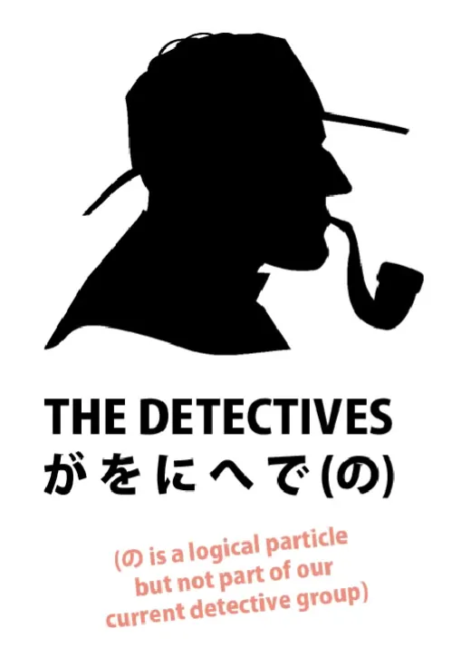
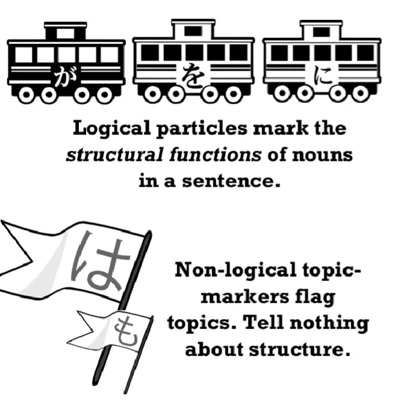
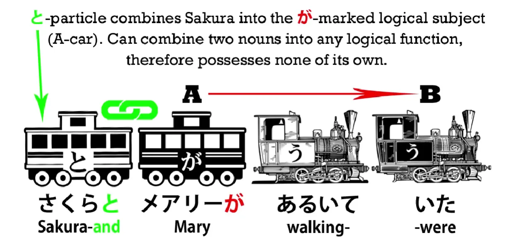
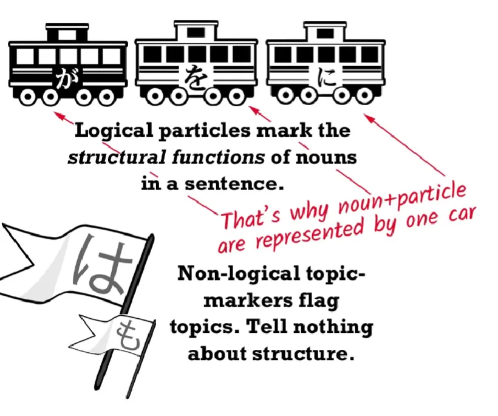
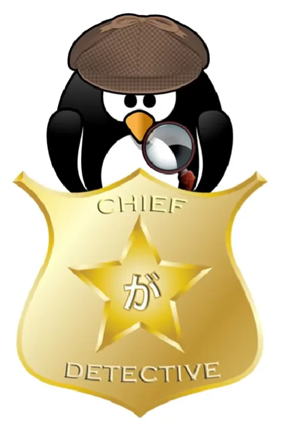
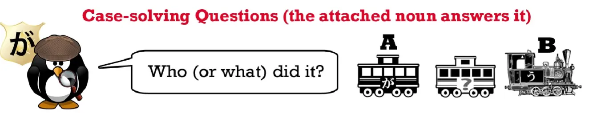
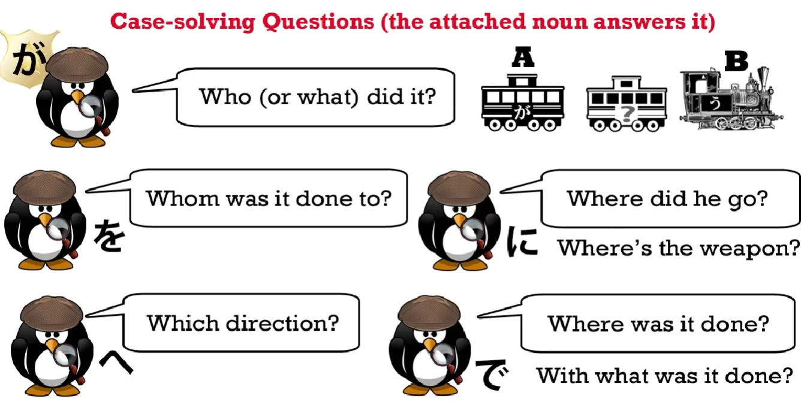
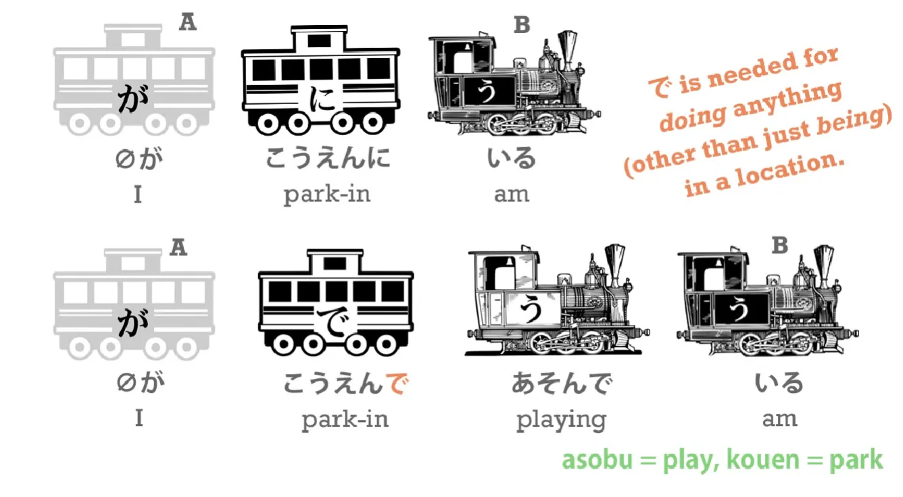
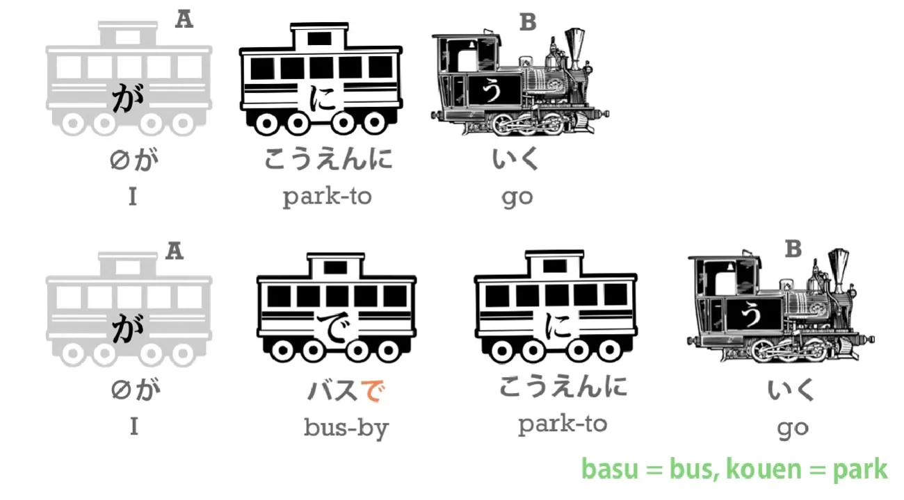

# **8b. Penjelasan tentang Partikel** 

[**Pelajaran 8b: Penjelasan tentang partikel dalam bahasa Jepang. Bagaimana cara kerjanya yang SEBENARNYA.**](https://www.youtube.com/watch?v=dwcTI9qvO-U&list=PLg9uYxuZf8x_A-vcqqyOFZu06WlhnypWj&index=10)

こんにちは.

Hari ini kita akan mendapatkan kunci mutlak untuk membedah setiap kalimat bahasa Jepang. Kita akan merangkum tentang Partikel logis – dan **Partikel logis adalah kunci utama dalam merakit bahasa Jepang.** Jika kamu memiliki pemahaman yang utuh tentang fungsi mereka, kamu pasti bisa memahami struktur kalimat Jepang mana pun. Tanpa pemahaman ini, kamu tidak akan pernah bisa berbahasa Jepang dengan benar. 

Inilah alasan utama kenapa kurikulum bahasa Jepang di sekolah maupun buku teks—yang sering gagal menjelaskan Partikel logis dengan benar—membuat sebagian besar pelajarnya gagap dan tidak bisa berbahasa Jepang secara natural, bahkan setelah mereka lulus ujian tinggi sekalipun. 

Jadi di pelajaran ini, saya akan merangkum semua Partikel logis yang sudah kita pelajari sejauh ini, dan kemudian memperkenalkan anggota Partikel logis utama yang terakhir, yaitu partikel `で` (de). 

Saya akan menjelaskan fungsinya menggunakan analogi pekerjaan seorang detektif polisi. **Karena pada dasarnya, Partikel logislah yang bertugas menginterogasi kata benda dalam sebuah kalimat. Partikel ini membongkar bagaimana hubungan antarkata benda dengan si kata kerja utama, sehingga akhirnya membentuk sebuah struktur jalan cerita kalimat yang utuh.**

Dan inilah yang saya maksud ketika saya memakai istilah "Partikel logis". Orang-orang sering bertanya, `"Apa sih maksudmu dengan Partikel logis?"`

Kita sebenarnya sudah pernah membahas perbedaan fundamental antara Partikel logis dengan Partikel penanda topik (non-logis) di pelajaran sebelumnya. 

**Partikel logislah yang menceritakan kepada kita bagaimana sebuah kalimat saling terhubung secara logika.** **Partikel ini memberitahu kita: siapa melakukan apa, kepada siapa, menggunakan alat apa, di mana, kapan, dan seterusnya.** 
Sedangkan **Partikel penanda topik (`は`/Wa) sama sekali tidak melakukan tugas ini; partikel `は` murni HANYA menunjuk apa topik yang sedang kita diskusikan.**

---

Lalu ada kelompok partikel lain yang saya sebut sebagai partikel "a-logis" (netral). Kelompok ini bukan penanda topik, tapi bukan juga Partikel logis. Contohnya adalah **partikel `と` (to) yang tugasnya cuma menggandengkan dua kata benda.** 

Jadi, jika kita bilang `さくらとメアリーがあるいていた`, itu berarti `Sakura and Mary were walking` (Sakura dan Mary sedang berjalan). 
Coba perhatikan baik-baik:
- **Partikel `が` (ga)** yang memberi tahu kita **siapa pelaku** yang sedang berjalan. 
- **Partikel `と` (to)** murni hanya bertugas **menggandengkan** kedua nama gadis tersebut (seperti kata 'dan'). Partikel ini tidak memberi tahu kita informasi apa pun tentang apa yang mereka lakukan, ke mana mereka pergi, atau detail kejadian lainnya.

Jadi, **Partikel logislah aktor utama yang menceritakan jalan cerita kejadian dalam sebuah kalimat.** 

Satu hukum mutlak lain yang wajib kamu ingat tentang Partikel logis adalah: **mereka SELALU menempel pada sebuah kata benda.** Jika kamu melihat ada sebuah Partikel logis menempel pada suatu elemen, kamu otomatis tahu bahwa kata di depannya tersebut berfungsi sebagai kata benda. Dan **kita harus selalu memperlakukan kata benda beserta partikel yang menempel di belakangnya itu sebagai satu kesatuan pasangan yang tak terpisahkan.** Mereka bekerja sebagai satu tim utuh.

Kombinasi "kata benda + partikel logis" inilah yang membentuk unit-unit pertanyaan dan jawaban logis, yang pada akhirnya merangkai fondasi dasar sebuah kalimat bahasa Jepang. 

Baiklah, mari kita bedah wujud detektifnya satu per satu.

## Partikel が (Ga)

Kepala Biro Investigasi dari seluruh divisi Partikel logis adalah Detektif `が`. 

Dia adalah bos besarnya. **Dia WAJIB hadir di setiap investigasi/kasus.** **Ingat, tidak akan pernah ada kalimat bahasa Jepang tanpa kehadiran `が`**, seperti yang sudah kita buktikan berkali-kali. **Meskipun, terkadang wujudnya tidak bisa kamu lihat** karena dia sedang menyamar sebagai agen tak terlihat (*zero ga*), persis seperti detektif Sherlock Holmes yang jago menyamar. 

Dia juga punya satu kekuatan magis yang tidak dimiliki oleh anak buahnya (Partikel logis lain). **Hanya dia yang bisa beroperasi di dalam kalimat A-adalah-B (Kalimat Deskriptif). Yaitu jenis kalimat yang menceritakan identitas, wujud, atau sifat dari suatu benda (menggunakan *engine* kopula atau *engine*-い).**

---

**Anak buahnya (Partikel logis yang lain) tidak bisa meniru kemampuan ini.** Anak buahnya hanya bisa diturunkan di dalam kalimat tipe A-melakukan-B (Kalimat Tindakan), yaitu kalimat yang digerakkan oleh *engine* kata kerja (*verb*). 
Dengan kata lain, ketika Bos Detektif `が` bisa duduk santai di meja kantor sambil mengerjakan tugas deskriptif, para detektif lapangan lainnya hanya bisa dipanggil untuk mengusut kasus lapangan, tindakan fisik, insiden, dan kejadian yang pelakunya adalah kata kerja. 

Jadi, mari kita lihat bagaimana para detektif lapangan ini membedah sebuah kejadian yang dikendalikan oleh kata kerja. Setiap detektif akan melontarkan satu pertanyaan spesifik. 

Bos Detektif `が` akan selalu mengajukan pertanyaan pamungkas: `"Who did it?"` (Siapa pelakunya?)

Karena ini adalah pertanyaan paling inti dan fundamental dari setiap kalimat (yaitu menuntut jawaban **siapa yang melakukan tindakan tersebut**), maka HANYA gerbong milik Detektif `が` sajalah yang berhak dicat dengan warna hitam. 

Begitu pertanyaan inti sang bos terjawab, barulah para detektif lapangan (Partikel logis lainnya) maju untuk melontarkan pertanyaan tambahan mengenai insiden tersebut. Pertanyaan-pertanyaan inilah yang akhirnya melukiskan detail peristiwa secara utuh. Tentu saja, di dunia nyata kita jarang sekali melihat semua gerbong detektif ini diturunkan berbarengan dalam satu kalimat pendek.

## Partikel を (o), に (ni), へ (e)

**Detektif を (o) bertugas bertanya:** `"Who/what was it done to? Who was the receiver of the action?"` (Tindakan ini dilakukan kepada siapa/apa? Siapa yang menjadi korban/objek dari tindakan ini?)

**Detektif に (ni) bertugas bertanya:** `"Where did he go? Where is the weapon located?"` (Ke mana dia pergi? Di mana sasaran lokasinya berada?)
Detektif `に` selalu menanyakan *tujuan akhir* pergerakan seseorang, atau *lokasi akurat* tempat sesuatu berdiam.

**Detektif へ (e) bertugas bertanya:** `"In what direction did he go?"` (Ke arah mana dia pergi?)

Nah, pertanyaan ini kelihatannya sangat mirip dengan tugas Detektif `に`, bukan?
Memang betul. Tapi ada beda tipisnya. Saat kita tidak tahu pasti alamat/sasaran akhir perginya seseorang, jawaban yang keluar dari interogasi Detektif `へ` biasanya berbunyi "Dia lari ke arah Utara", "Ke Selatan", "Ke Timur", dsb. **Dan tipe jawaban 'arah pandangan kompas' seperti itu TIDAK BISA ditangani oleh Detektif `に`.** 
Atau bisa juga jawabannya berbunyi, "Dia pergi ke arah rumah Sakura" (belum tentu masuk ke rumah Sakura, hanya ke arah sana). Nah, dalam konteks ini, tugas keduanya memang agak sedikit tumpang tindih.

## Partikel で (de)

Sekarang mari kita kenalan dengan anggota terakhir kita, yaitu Detektif `で`.

**Detektif で memiliki dua jenis pertanyaan investigasi utama:** 
1. `"Where was it done?"` (Di lokasi/arena mana *tindakan/kegiatan* itu dilakukan?) 
2. `"With what was it done? What was the weapon?"` (Menggunakan alat bantu apa tindakan itu dilakukan? Apa senjatanya?)

Mari kita bedah fungsi pertamanya (arena kejadian).
Jika kita bilang `(zeroが)こうえんにいる` (Saya **berada** di taman), kita memakai `に` karena `に` menandai *lokasi* eksistensi kita.
Tetapi, jika kita ingin menceritakan sebuah *kegiatan* yang kita lakukan di taman tersebut, misalnya `(I) am playing in the park` (Saya sedang **bermain** di taman), maka kita wajib mengganti detektifnya menjadi `で`. Kalimatnya menjadi `(zeroが)こうえん**で***あそんで*いる`. 

**Rumusnya mutlak: untuk mendeklarasikan 'arena' di mana sebuah kegiatan fisik/aksi dilakukan (bukan sekadar diam atau berada di sana), kita wajib menggunakan partikel `で`.**

Lanjut ke fungsi keduanya (alat bantu).
**Kita juga menggunakan `で` untuk mendeklarasikan sarana tempur (dalam wujud kata benda) yang kita pergunakan untuk mengeksekusi suatu tindakan.** 

Jadi, jika kita bilang `(zeroが)こうえんにいく`, itu artinya `(I) go to the park` (Saya pergi ke taman). Tetapi jika kita bilang `(zeroが)バス**で**こうえんにいく` (Saya pergi ke taman **menggunakan** bus), **kita menugaskan partikel `で` untuk menunjuk sarana yang kita naiki untuk mencapai taman tersebut, yaitu sebuah Bus.**

Jika kita menceritakan bahwa kita memukul paku dengan palu, atau makan dengan sumpit, **kita selalu menugaskan `で` untuk menandai alat bantu tersebut.** 

Contoh lain, jika kita bilang `(zeroが)にほんごをはなす`, artinya kita mengatakan `(I) speak Japanese` (Saya berbicara bahasa Jepang). 
Tetapi jika kita mengubah partikelnya menjadi `(zeroが)にほんご**で**はなす`, secara logika kita sedang mengatakan `(I) speak with Japanese / Japanese is the means by which (I) speak` (Saya berbicara **menggunakan** sarana bahasa Jepang). 

Bila diterjemahkan ke bahasa Inggris, maknanya setara dengan `I speak in Japanese`. Tetapi seperti yang bisa kamu lihat, logika konstruksi bahasa Jepang jauh lebih nyata dan lugas, karena itulah kenyataan yang sedang terjadi di dunia nyata: **kita berbicara 'menggunakan alat bantu' bahasa Jepang.**

---

Satu catatan sisa, tentu saja ada satu pertanyaan krusial lain yang sering diajukan oleh **Detektif に**, yaitu: `"Who was the target of an action done to something else?"` (Siapa/Apa yang menjadi sasaran akhir dari tindakan ini?). *Tapi kita tidak perlu pusing memikirkannya sekarang karena kita sudah mengupas tuntas trik itu di pelajaran khusus tentang に.[[8]](./8-particles-ni-and-e.md)* 

Dan selesai! Semua materi di atas merangkum 100% fungsi dasar dari para anggota Partikel logis utama kita. Seperti yang bisa kamu saksikan sendiri, detektif-detektif inilah yang bercerita kepada kita tentang kronologi kejadian di dalam kalimat Jepang mana pun. 

Jika kita memahami logika interogasi para detektif ini, maka membongkar struktur kalimat bahasa Jepang akan jadi sangat mudah. Sebaliknya, jika tidak paham, kita akan selalu tersesat. Sayangnya, jika kita pasrah pada kurikulum buku teks yang memaksa kita menghafal membabi buta, otak kita pasti akan selalu dibikin *hang* dan kebingungan oleh Partikel logis.

**Mulai sekarang, jangan pernah lagi membiarkan dirimu dikelabui oleh partikel-partikel ini, maka mereka pun akan menjadi teman terbaikmu dalam membongkar setiap kalimat.**
