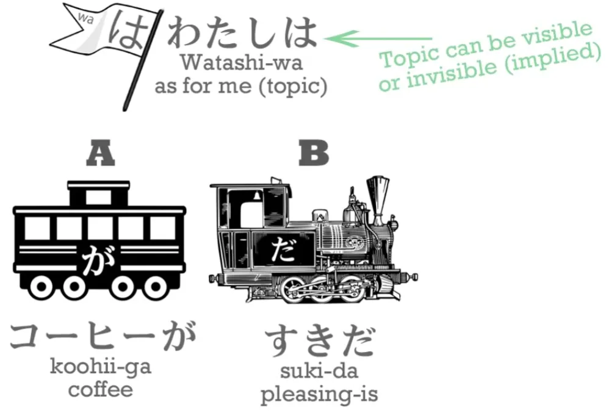
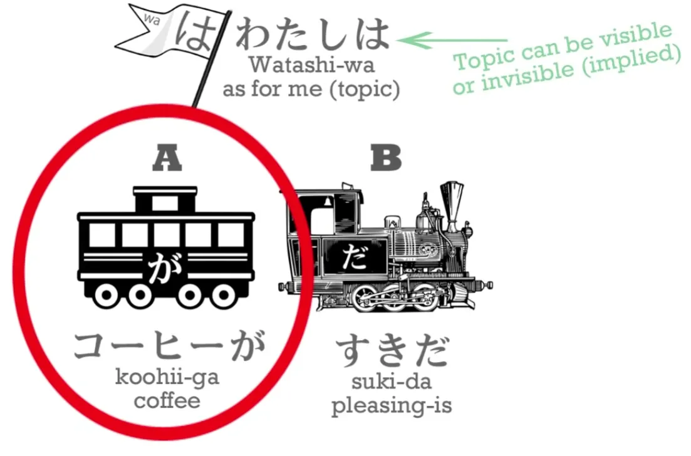
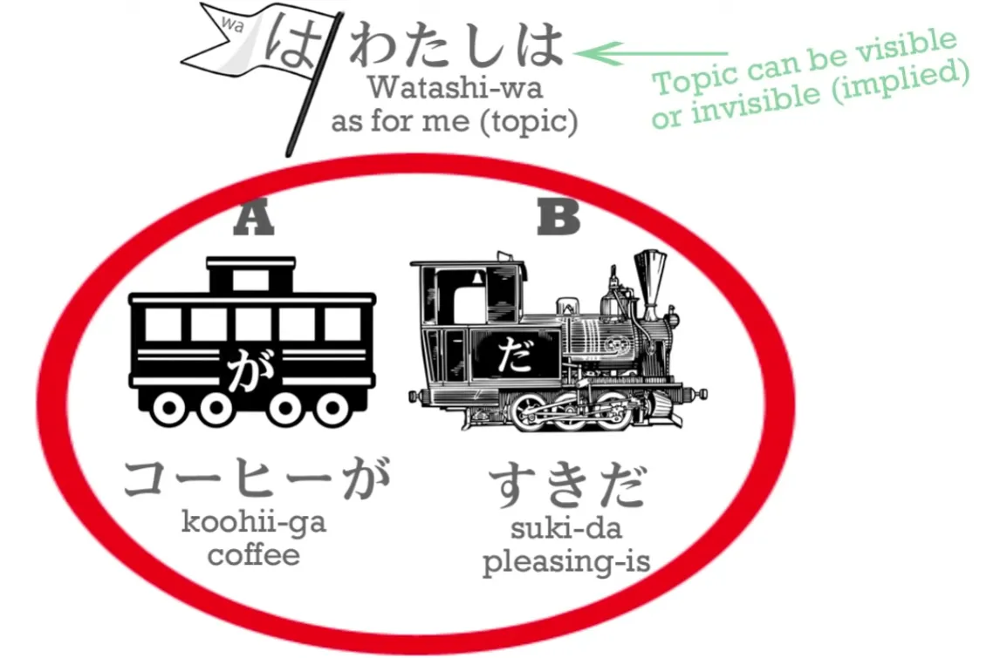
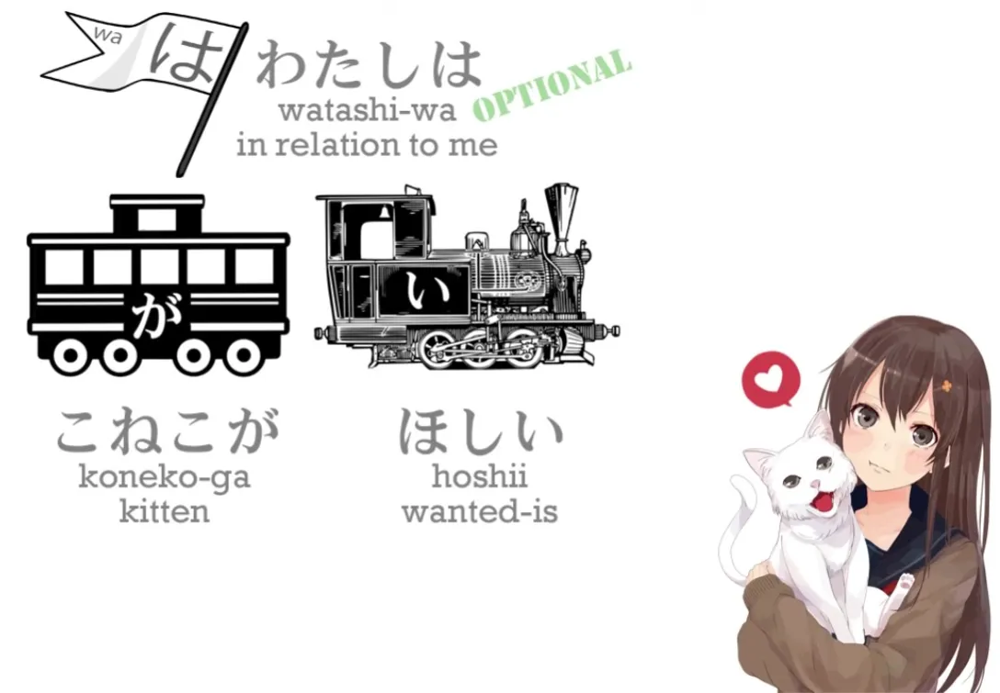
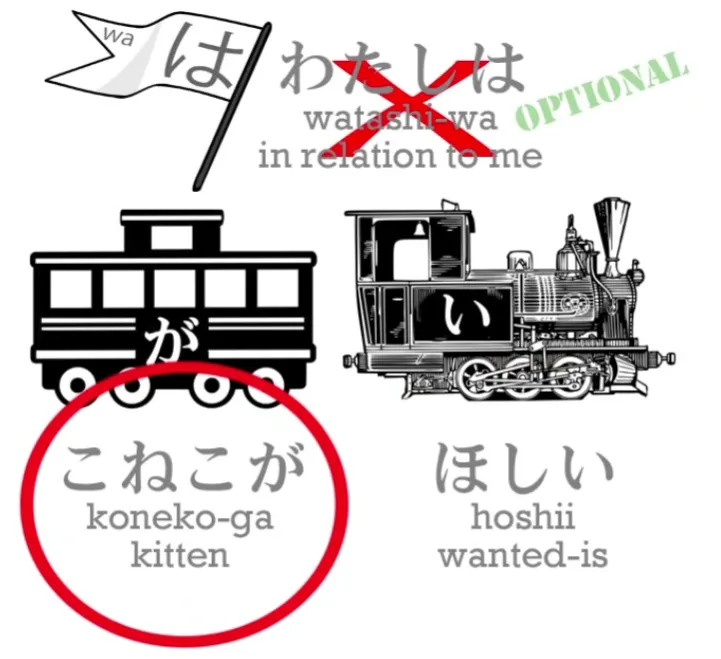
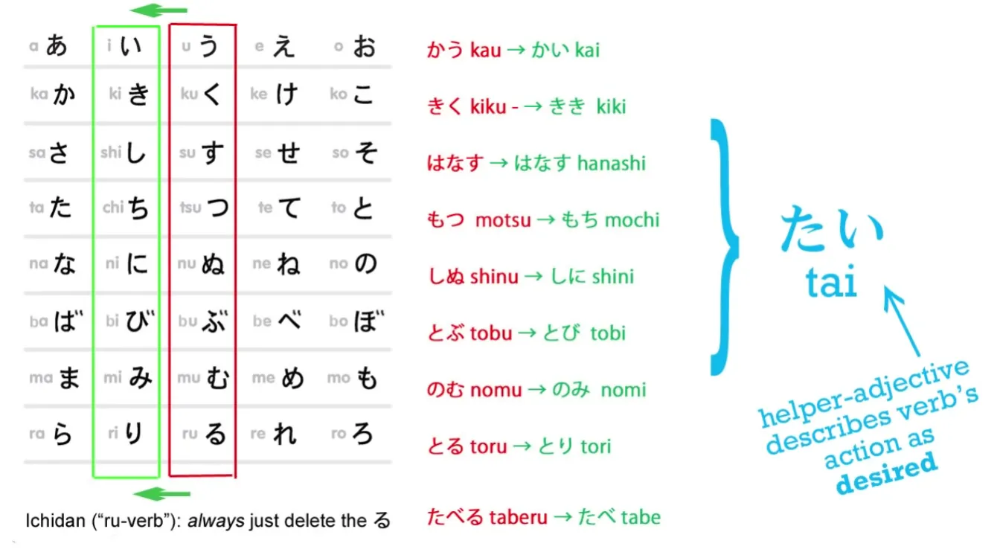
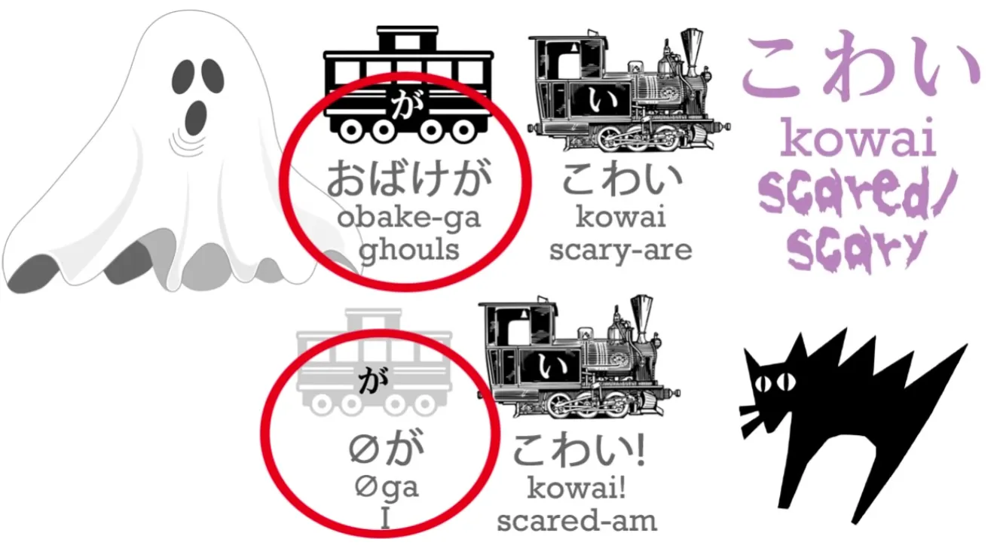
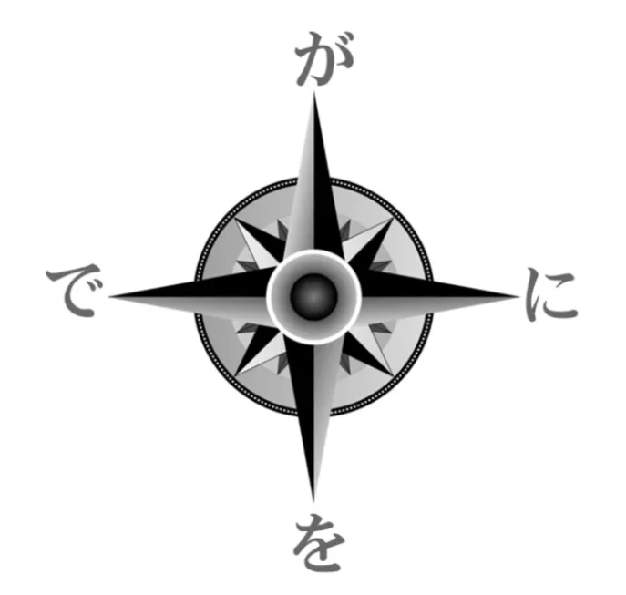
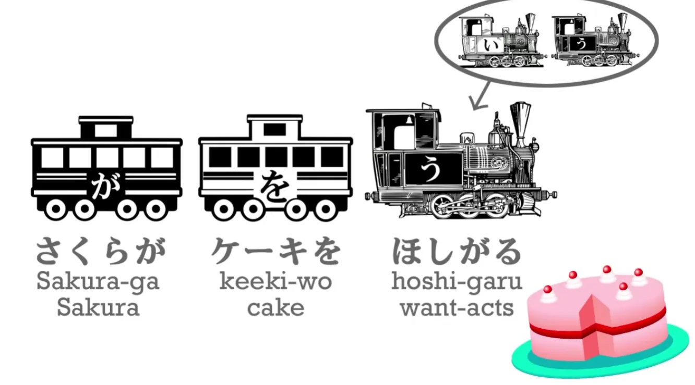

# **9. Subjek Kalimat Bahasa Jepang &amp; Mengungkapkan Keinginan: ほしい, たい, たがる**

[**Pelajaran 9: Bagaimana Buku Pelajaran MERUSAK Kemampuan Bahasa Jepang Anda: Rahasia No. 1! + Mengungkapkan keinginan: hoshii, tai, tagaru**](https://www.youtube.com/watch?v=vk3aKqMQwhM&amp;list;=PLg9uYxuZf8x_A-vcqqyOFZu06WlhnypWj&amp;index;=11)

## Subjek dan ego dalam Bahasa Jepang vs Bahasa Inggris

Bahasa Jepang dan Inggris memiliki pandangan dunia yang sangat berbeda. Dalam beberapa hal, keduanya bertolak belakang. 

**Bahasa Inggris adalah bahasa yang sangat ego-sentris.** Dan ini bukanlah semacam pernyataan moral: **Saya berbicara tentang tata bahasa.** **Bahasa Inggris ingin memiliki <code>ego</code> sebagai penggerak utama, pusat dari setiap kalimat, jika memungkinkan.** Lebih disukai <code>me</code>, jika bukan <code>me</code> maka orang lain, dan jika bukan orang setidaknya seekor hewan. Harus ada semacam <code>ego</code> aktor. 

::: info
**Dolly tampaknya kadang-kadang merujuk pada Subjek sebagai Aktor dan menggunakannya secara bergantian, jadi ingatlah bahwa ketika dia menyebut &quot;Aktor&quot;, dia SEHARUSNYA bermaksud &quot;Subjek&quot;.** Penggunaan ini mungkin membingungkan nanti saat membahas Pasif/Reseptif jika Anda tahu sedikit linguistik dasar… tapi mungkin hanya <code>me</code> masalah…
:::

**Bahasa Jepang sama sekali tidak bekerja seperti itu. Bahasa ini sangat senang memiliki makhluk tak bernyawa sebagai penggerak utama dalam sebuah kalimat. Anda mungkin menyebut ini sebagai cara pandang yang lebih animis terhadap bahasa.** Sekarang, ini mungkin terdengar agak abstrak, tetapi sebenarnya sama sekali tidak abstrak. Mari kita lihat beberapa contoh konkret. Saya akan mulai dengan contoh favorit saya, dan jika Anda pernah mendengarnya sebelumnya, jangan pergi karena kali ini kita akan membahasnya lebih dalam. 

Contoh favorit saya adalah: <code>わたしは**コーヒーが**すきだ.</code> Sekarang, kita bisa menggunakan <code>わたし</code> atau kita bisa tidak mengatakannya *(atau lebih tepatnya tidak perlu mengatakannya)*; maknanya akan tetap dipahami baik kita mengatakannya maupun tidak.

Apa yang diajarkan buku teks, sekolah, dan semua orang kepada Anda adalah bahwa ini berarti <code>I like coffee</code>. Dan <code>I like coffee</code> mungkin saja itulah yang akan kita katakan dalam bahasa Inggris jika kita ingin mengatakan sesuatu yang serupa, **tetapi itu bukanlah arti kalimat ini.** Dan jika Anda telah mengikuti kursus ini hingga titik ini, Anda dapat melihat mengapa hal itu tidak benar.

---

**Poin pertama dan terpenting di sini adalah – perhatikan di mana letak kata kerja utama (が). が menandai kopi.** **Kita tahu bahwa penggerak utama** *(Subjek dalam kalimat aktif)*, **pelaku atau subjek dari sebuah kalimat, selalu ditandai oleh が**, jadi kita tahu bahwa penggerak utama kalimat ini **bukanlah <code>わたし</code> –<code>I</code>**, **melainkan kopi, yang ditandai dengan が.**

**<code>わたし</code> bisa saja memiliki が tak terlihat di belakangnya, tetapi dalam kasus ini tidak bisa**, karena **kita sudah tahu apa が-nya, yaitu kopi. Jadi, kopi itulah yang sedang menjadi atau melakukan sesuatu.** **Dalam bahasa Inggris** kita diajarkan bahwa ini adalah <code>A **does** B</code> kalimat, tetapi kita hanya perlu melihatnya untuk mengetahui bahwa **itu bukan**. **Kalimat ini diakhiri dengan <code>だ</code>** – ini adalah <code>A **is** B</code> kalimat, bukan?

**Kopi itu <code>すき</code>.** Jadi, apa <code>すき</code> artinya? **<code>すき</code> adalah kata benda, dan itu adalah salah satu kata benda yang berfungsi sebagai kata sifat yang telah kita bahas sebelumnya.** Jadi, kata itu memberi tahu kita sesuatu tentang sifat atau kondisi kopi tersebut. Dalam hal ini, **yang diberitahukannya kepada kita adalah bahwa kopi itu menyenangkan. Itulah inti dari kalimat tersebut: <code>Coffee is pleasing.</code>**

**Kata <code>わたしは</code>, baik secara implisit maupun eksplisit, memberi tahu kita dalam konteks siapa kopi tersebut menyenangkan:** <code>**As for me**, coffee is pleasing.</code> **Sekarang, ini sangat sangat sangat penting.** **Karena jika kita tidak tahu itu, jika kita benar-benar percaya bahwa kalimat ini berarti <code>I like coffee</code>, pemahaman kita tentang が dan を akan benar-benar kacau.**

---

**Jika penggerak kalimat ini adalah <code>わたし</code>, maka ia harus ditandai dengan が.** **Jika benda yang menjadi objek tindakan penggerak, yang disukainya, adalah kopi, maka benda itu harus ditandai dengan を.** Jadi, kita memiliki dua partikel, dan dua partikel paling mendasar, yang benar-benar membingungkan dalam pikiran kita. Kita sekarang percaya bahwa terkadが dapat menandai objek kalimat alih-alih subjek, yaitu hal yang menjadi objek tindakan alih-alih pelaku atau subjek kalimat. Dan kita sekarang percaya bahwa objek kalimat, yaitu hal yang menjadi objek tindakan, terkadang dapat ditandai oleh が alih-alih を. **Dan tidak ada satupun dari hal ini yang benar. Itu tidak pernah bisa terjadi. Itu tidak akan pernah terjadi. Dan jika itu bisa terjadi, bahasa Jepang akan menjadi kacau. Dan itulah tepatnya yang terjadi di benak banyak siswa.**

---

Jadi, seperti yang kita lihat dalam kalimat ini, **<code>わたし</code> adalah topik non-logis dari kalimat tersebut.** **Topik tersebut ditandai dengan は. Topik tersebut bukanlah penggerak. Topik tersebut bukanlah subjek.** **<code>コーヒー</code> bukanlah objek, yang akan ditandai dengan を jika memang demikian.** **Itu adalah subjek.** **Dan <code>すき</code> bukanlah kata kerja yang berarti <code>to like</code>; melainkan kata sifat yang berarti <code>to be pleasing</code>.**

---

Jadi, setiap kata dalam kalimat ini dijelaskan secara keliru oleh penjelasan standar. Dan kesalahpahaman semacam ini membuat bahasa Jepang menjadi kacau balau. Nah, apakah ada banyak kasus seperti ini dalam bahasa Jepang?

Jujur saja, tidak masalah apakah banyak atau tidak. Begitu pemahaman Anda tentang partikel-partikel itu kacau, ya sudah kacau. Tapi kebetulan memang banyak. Berbagai macam struktur kalimat dalam bahasa Jepang menimbulkan kesalahpahaman yang sama ini.

---

Misalnya, jika kita mengatakan <code>ほんがわかる</code>, atau <code>わたしはほんがわかる</code>, kita mengatakan **buku itu mudah dipahami**, tetapi teks-teks bahasa Inggris mengatakan bahwa ini berarti <code>I understand the book</code>, dan dalam kasus ini hal itu bahkan lebih tidak bisa dimaafkan, karena sebenarnya tidak ada padanan untuk <code>すき</code> dalam bahasa Inggris, tetapi ada padanan untuk <code>わかる</code>. Artinya <code>understandable</code> atau <code>clear</code>.

Kita bisa mengatakan <code>In relation to me, or just to me, the book is understandable</code>, **dan dengan begitu kita tidak akan sepenuhnya mengacaukan fungsi &quot;が&quot; atau mengira bahwa kata benda yang seharusnya ditandai dengan &quot;を&quot; bisa ditandai dengan &quot;が&quot; secara sembarangan.**

---

Lalu mengapa, setidaknya dalam kasus ini, sekolah dan buku pelajaran tidak menerjemahkannya sesuai dengan arti sebenarnya? <code>**To me, the book is understandable / Speaking of me the book is understandable**.</code> **Karena prasangka untuk menempatkan ego di pusat setiap kalimat begitu kuat sehingga mengesampingkan pembelajaran bahasa Jepang yang benar.** Dan ini bukan sekadar beberapa kasus acak.

Nanti, kita akan membahas bentuk potensial[[10]](./10-helper-verbs-the-potential-helper-verb.md) dan kita akan membahas bentuk reseptif[[13]](./13-passive-conjugation-receptive-helper-verb.md), yang salah dijelaskan sebagai pasif, dan keduanya akan menampilkan bentuk-bentuk dari masalah yang sama. Karena keduanya merupakan topik yang cukup luas, saya tidak akan membahasnya sekarang. Namun, mari kita bahas cara kita mengekspresikan keinginan dalam bahasa Jepang. Mari kita bahas bagaimana bahasa Jepang menangani keinginan. Baik kita menginginkan sesuatu atau ingin melakukan sesuatu, bagaimana kita mengungkapkannya dalam bahasa Jepang?

## Mengekspresikan Keinginan dengan ほしい

Baiklah, misalkan kita menginginkan sesuatu. Misalnya <code>こねこがほしい</code>.

<code>こねこ</code> adalah seekor anak kucing: <code>こ/子</code> adalah anak atau benda kecil dan <code>ねこ</code> adalah kucing. Dan <code>ほしい</code> diterjemahkan ke dalam bahasa Inggris sebagai <code>want</code>. Sekarang, jika Anda melihatnya, hal pertama yang dapat Anda lihat adalah bahwa **itu bukan kata kerja. Itu adalah kata sifat.** Kata itu berakhiran <code>い</code>, bukan <code>う</code>. Dan hal kedua yang bisa Anda lihat, yang paling penting, adalah bahwa **penggerak yang ditandai dengan が dalam kalimat ini bukanlah saya, yang menginginkan kucing. Melainkan kucing itu sendiri, yang diinginkan.**

Jadi, apa <code>ほしい</code> artinya? Nah, sederhananya, artinya <code>is wanted</code>. 
::: info
Ini adalah kata sifat.
:::
<code>In relation to me, the cat is wanted.</code> 
::: info
わたしはねこがほしい.
:::
Dan sekali lagi, jika kita benar-benar percaya bahwa ini berarti <code>I want a cat</code>, kita berpikir bahwa が dapat menandai objek kalimat, objek tindakan, hal yang kita lakukan padanya. Jadi sekali lagi, **kita bingung tentang peran が dalam kalimat, kita bingung tentang peran を dalam kalimat, karena kucing seharusnya ditandai oleh を jika artinya** <code>I want a cat</code>. **Dan kita bingung antara kata kerja dan kata sifat.** Jadi sekali lagi **bahasa Jepang menjadi permainan tebak-tebakan yang aneh di mana partikel dan jenis kata dapat mengubah maknanya secara acak.**

## Mengungkapkan keinginan untuk melakukan sesuatu dengan &quot;たい&quot;

Sekarang, misalkan kita ingin melakukan sesuatu. Dalam bahasa Jepang, kita mengungkapkan keinginan untuk melakukan sesuatu secara berbeda dari cara kita mengungkapkan keinginan untuk memiliki sesuatu. **Dan cara melakukannya adalah dengan menggunakan A-stem &quot;い&quot; lagi.** A-stem &quot;い&quot;, seperti yang saya katakan sebelumnya, adalah A-stem yang sangat penting. Jadi, untuk mengatakan bahwa kita menginginkan sesuatu, kita harus menambahkan **kata sifat keinginan**, yaitu <code>**たい**</code>. **Jadi sekarang kita memiliki sebuah kata sifat.**

Dan apa arti kata sifat ini? **Ini tidak berarti <code>want</code> dalam arti bahasa Inggris.** **Tidak bisa, karena <code>want</code> adalah kata kerja dan <code>たい</code>, yang berakhiran <code>い</code>, adalah kata sifat, bukan?** Jadi, mari kita ambil contoh. Ini adalah contoh yang agak terkenal.

<code>わたしはクレープがたべたい</code>.

Nah, terjemahan bahasa Inggris standar untuk ini adalah <code>I want to eat crepes</code>. Namun, seperti yang Anda lihat, polanya di sini sama persis dengan kasus-kasus lain yang telah kita bahas. **Penggerak yang ditandai denganが <code>わたし</code>, bukan <code>me</code>, melainkan crepes.** **Kelezatan crepes bukanlah kata kerja, melainkan kata sifat.** Dan kita perlu memahami hal ini karena jika tidak, hal ini tidak hanya akan mengacaukan kalimat semacam ini – tetapi juga akan mengacaukan seluruh pemahaman kita tentang kata-kata, partikel, dan struktur bahasa Jepang.

Nah, **sebenarnya tidak ada cara yang bagus untuk menerjemahkan ini ke dalam bahasa Inggris.** Kita harus mengatakan sesuatu seperti <code>In relation to me, crepes are desire-inducing</code>. Dan itu sangat canggung. 
::: info
boleh menggunakan <code>want/wanting</code> sebagai terjemahan. Ingat saja bahwa &quot;たい&quot; bukanlah kata kerja seperti <code>want</code> dalam bahasa Inggris, melainkan sebuah kata sifat. Terjemahan tidaklah penting, yang penting adalah pemahaman.
:::
Dan terkadang orang bertanya kepada saya, &quot;Apakah saya benar-benar harus menggunakan semua terjemahan harfiah yang canggung ini yang Anda berikan, daripada menggunakan bahasa Inggris yang alami?&quot; Dan jawabannya adalah <code>No</code>. **Anda tidak seharusnya berpikir dalam kerangka penjelasan canggung saya atau berpikir dalam kerangka bahasa Inggris yang alami. Anda seharusnya berpikir tentang bahasa Jepang dalam kerangka – tebak apa – bahasa Jepang.** Saya menjelaskannya dalam bahasa Inggris untuk memberi Anda awal dalam melakukannya. **Namun, terjemahan atau penjelasan yang tidak alami ini ada untuk membantu Anda memahami struktur bahasa Jepang, bukan untuk memberi Anda cara menerjemahkan bahasa Jepang.** 

Sekarang, seperti yang saya katakan, polanya sama dalam semua kasus ini, dan saya rasa tidak terlalu sulit untuk dipahami. Tapi sekarang kita akan melihat sesuatu yang mungkin tampak sedikit membingungkan, dan saya jamin itu tidak sulit, jika Anda mengikuti dengan cermat apa yang akan saya katakan. Kita punya kalimat ini di sini: <code>クレープがたべたい</code> tapi bagaimana jika kita tidak memiliki crepes di sini? Bagaimana jika kita hanya mengatakan <code>(zeroが)たべたい</code>? **Sekarang, dalam kalimat ini tidak lagi terdapat apa yang dalam bahasa Inggris disebut sebagai objek keinginan, yang sebenarnya adalah subjek keinginan, pemicu keinginan, dan jelas harus ada nol-kar yang ditandai denganが—atau, seperti yang Anda tahu, kita tidak memiliki kalimat.** Tapi apa itu nol-kar dalam kasus ini?

Nah, hal yang ironis adalah bahwa dalam kasus ini, nol-kar adalah apa yang selama ini dipikirkan oleh buku teks bahasa Inggris. **Itu <code>I</code>.**

Saya benar-benar merupakan penggerak kalimat kali ini, dan hal itu mungkin menjadi salah satu alasan di balik banyak kebingungan yang terjadi mengenai topik ini. <code>わたしがたべたい</code> berarti <code>I want to eat</code> – saya tidak harus makan crepes atau obento Sakura, saya hanya ingin makan. *(Saya ingin makan)* Dan karena tidak ada subjek yang memicu tindakan makan di sini, keinginan untuk makan langsung dikaitkan dengan saya. 

Dan mungkin Anda bertanya – seharusnya Anda bertanya – &quot;Jadi, apa ini - たい? Apakah ini kata sifat yang menggambarkan kondisi sesuatu yang membuat Anda ingin melakukan sesuatu, ataukah ini kata sifat yang menggambarkan keinginan saya?&quot; **Dan jawabannya adalah bisa keduanya.** **Jelas ketika menggambarkan kue, itu juga secara tidak langsung menggambarkan perasaan saya terhadap kue tersebut; itu menggambarkan perasaan yang ditimbulkan kue itu pada saya.** Dan ketika tidak ada kue di sana, atau tidak ada crepe di sini, atau tidak ada obento Sakura di sana, kita hanya menggambarkan perasaanku secara langsung. Dan hal ini sering terjadi dalam bahasa Jepang dengan kata sifat yang menunjukkan keinginan. Misalnya, <code>こわい</code>, yang berarti baik <code>scared</code> atau <code>scary</code>. Jika saya mengatakan, <code>おばけがこわい</code>, saya mengatakan, <code>Ghosts are scary</code>, tetapi jika saya hanya mengatakan <code>こわい</code>, saya bermaksud mengatakan, <code>I am scared</code>.

Nah, apakah ini membingungkan? Sebenarnya tidak membingungkan karena kita memiliki penanda yang memberi tahu kita apa yang harus dilakukan setiap saat. Dan penanda itu adalah &quot;が&quot;. **Dalam kalimat-kalimat ini dan dalam kalimat-kalimat yang jauh lebih rumit, jika kita memperhatikan &quot;が&quot; dan partikel logis lainnya, kita tidak akan pernah salah, karena partikel logis itu tidak pernah, tidak pernah, tidak pernah mengubah fungsinya.** Jadi, kita bisa menggunakannya sebagai kompas kita. **Dan itulah mengapa sangat merusak jika orang-orang diyakinkan bahwa partikel-partikel tersebut dapat mengubah fungsinya, seperti yang dilakukan buku-buku teks.** 

Jika Anda memiliki kompas dan saya berkata kepada Anda, &quot;Ah, ya, kebanyakan waktu kompas menunjuk ke utara, tapi kadang-kadang menunjuk ke selatan dan sebenarnya cukup sering juga menunjuk ke timur&quot;, Anda mungkin sebaiknya tidak memiliki kompas. Saya telah menghancurkan nilai kompas Anda. **Dan hal yang sama berlaku untuk partikel logis. Mereka benar-benar dapat diandalkan. Mereka selalu menunjuk ke utara.** *(Atau mungkin, mereka selalu menunjuk ke arah yang seharusnya, satu arah)* **Mereka tidak pernah mengubah fungsinya.**

Jadi, **jika &quot;が&quot; menandai crepes, maka kita tahu bahwa subjek kalimat, hal yang dibicarakan oleh kalimat tersebut, adalah crepes, bukan yang lain.** **Tetapi jika subjek yang ditandai oleh &quot;が&quot; tidak ada di sana, kita tahu bahwa secara default, subjek tak terlihat biasanya <code>I</code> kecuali ada alasan untuk menganggapnya sebagai hal lain.** Hal ini sama seperti pada contoh belut yang kita berikan dalam pelajaran tentang は. 

Sekarang, saya akan memberi tahu Anda satu hal lagi, dan saya harap saya tidak membebani Anda dengan terlalu banyak informasi dalam pelajaran ini, tetapi hal ini akan memberi Anda kepercayaan diri yang lebih besar tentang apa itu subjek tak terlihat dalam kasus-kasus ini. Dan itu adalah bahwa **Anda tidak dapat menggunakan kata sifat keinginan atau perasaan ini untuk siapa pun selain diri Anda sendiri.**

Jadi **jika saya mengatakan <code>たべたい</code> dan tidak ada yang bisa diたべたいasikan dalam kalimat atau konteks tersebut, maka saya pasti sedang berbicara tentang diri saya sendiri, saya tidak bisa berbicara tentang Anda dan saya tidak bisa berbicara tentang Sakura.** Mengapa tidak? Karena bahasa Jepang tidak mengizinkan kita melakukan itu. **Anda tidak bisa menggunakan <code>-たい</code> tentang orang lain, atau <code>こわい</code> atau <code>ほしい</code> – kita tidak bisa menggunakan hal-hal ini tentang orang lain.**

Bagaimana jika kita ingin mengatakan bahwa orang lain menginginkan sesuatu? Nah, **karena bahasa Jepang adalah bahasa yang sangat logis, bahasa ini tidak mengizinkan kita membuat pernyataan pasti tentang sesuatu yang tidak bisa kita ketahui dengan pasti,** jadi kamu lihat, ini sangat berbeda dari bahasa-bahasa Barat. **Satu hal yang tidak bisa kita ketahui dengan pasti adalah perasaan dalam hati orang lain.** 

Jadi, saya mungkin berpikir bahwa Sakura ingin makan kue, tapi saya tidak tahu itu. Yang saya tahu hanyalah bagaimana dia bertindak, apa yang dia katakan, apa yang dia lakukan, bagaimana penampilannya, tetapi saya tidak tahu apa perasaan dalamnya.

::: info
Perhatikan kata &quot;pernyataan&quot; di sini; &quot;たい&quot; tidak dapat digunakan ketika <code>exhibiting actual knowledge of someone else&#x27;s subjectivity</code> seperti yang Dolly tulis di [**komentar**](https://www.youtube.com/watch?v=vk3aKqMQwhM&amp;lc;=UgwE8cByEhTfyfe0e3h4AaABAg.9Kr0u3ynAsW9KrNJyZGL-o), disarankan untuk membacanya
:::

**Jadi, jika saya ingin membicarakan keinginannya untuk makan kue, saya tidak bisa menggunakan <code>-たい</code>. Dan saya tidak bisa menggunakan <code>こわい</code> untuk menggambarkan ketakutannya, dan saya tidak bisa menggunakan <code>ほしい</code> untuk menggambarkan sesuatu yang mungkin dia inginkan.**

## Mengungkapkan pernyataan keinginan tentang orang lain dengan たがる

Jadi, apa yang harus saya lakukan? **Saya harus menambahkan kata kerja bantu ke kata sifat keinginan tersebut. Saya menghilangkan <code>い</code> い -kata sifat dan menambahkan kata kerja bantu <code>がる</code>.** Dan <code>がる</code> berarti <code>to show signs of / to look as if it is the case</code>. Jadi, jika saya mengatakan, <code>さくらがケーキをほしがる</code> maka saya mengatakan Sakura menunjukkan tanda-tanda ingin kue. Itulah yang secara harfiah saya katakan.

**Dan bahkan jika dia benar-benar mengatakan kepada saya bahwa dia ingin kue, itulah yang tetap saya katakan, karena saya tidak bisa merasakan perasaannya.** Saya hanya tahu apa yang dia lakukan dan katakan. 

Sekarang, mengapa kita menggunakan kata kerja dalam kasus orang lain padahal itu adalah kata sifat dalam kasus diri kita sendiri? Sekali lagi, ini sangat logis. **Saya tidak bisa menggambarkan perasaan orang lain karena saya tidak bisa merasakannya.** **Saya tidak tahu tentang perasaan mereka.** **Saya hanya bisa berbicara tentang tindakan mereka, dan tindakan mereka jelas harus berupa kata kerja.** Jadi, ini adalah hal yang berguna untuk diketahui, tetapi juga membantu kita untuk menjadi sangat jelas ketika kita mengatakan <code>たべたい</code> atau hal lain apa pun — &quot;たい&quot;, atau apa pun <code>ほしい</code>, bahwa jika tidak ada penyebab dari emosi itu, maka subjek tak terlihat itu pasti saya, <code>わたし</code>, karena tidak mungkin orang lain. Kita sebenarnya tidak bisa menggunakannya untuk orang lain.

::: info
Seperti yang sudah disebutkan di atas, Dolly memiliki [**komentar**](https://www.youtube.com/watch?v=vk3aKqMQwhM&amp;lc;=UgwE8cByEhTfyfe0e3h4AaABAg.9Kr0u3ynAsW9KrNJyZGL-o) yang menarik tentang perbandingan たい vs がる.
:::

Jadi, ini cukup banyak informasi dalam satu pelajaran, tetapi memahami hal ini akan memotong jalan Anda langsung melalui area kebingungan dan kesalahpahaman yang besar yang mengganggu banyak pelajar bahasa Jepang selama bertahun-tahun.

::: info
Ini adalah salah satu yang pertama <code>Big Reveals About Japanese</code> oleh Dolly, itulah sebabnya isinya cukup padat. Jangan khawatir, pelajari dengan perlahan, baca ulang, dan periksa komentar di [**video**](https://www.youtube.com/watch?v=vk3aKqMQwhM&amp;list;=PLg9uYxuZf8x_A-vcqqyOFZu06WlhnypWj&amp;index;=13), dan dengan paparan yang cukup, pada akhirnya Anda akan menguasainya. Namun, jelas, seperti yang saya katakan dalam catatan panjang saya di Pelajaran 7.5, ingatlah bahwa Dolly ada di sini hanya untuk memberi Anda gambaran dasar dan tentu saja ini berarti dia menyederhanakan hal-hal agar sesuai dengan modelnya dan karena ini untuk dasar-dasarnya, tetapi jika Anda menggali lebih dalam, hal-hal tidak sesederhana itu dan banyak nuansa yang ada; tata bahasa dan linguistik seringkali cukup rumit dan kompleks, dan hal-hal tidak sesederhana yang kadang-kadang disiratkan oleh Dolly, tetapi demi metode yang dia gunakan, hal ini cukup baik untuk pemahaman dasar.

Jika Anda ingin tahu alasannya, lihat [**diskusi MoeWay Discord ini**](https://discord.com/channels/617136488840429598/1170582570161950752) oleh [**Morg**](https://morg.systems/) (halaman yang LUAR BIASA, ngomong-ngomong!). Selain itu, periksa komentar Morg [**di thread は dan が ini**](https://discord.com/channels/617136488840429598/1151956209100927117/1152970825583054859), karena が tidak selalu hanya penanda subjek. Jadi jangan anggap Dolly sebagai kebenaran mutlak, tapi hanya sebagai cara berguna untuk menguasai dasar-dasar bahasa Jepang yang mendorongmu ke dalam imersi = hal yang benar-benar penting. Dolly tetap sumber penjelasan yang hebat! Namun, hal-hal tidak sesederhana itu jika Anda menjelajah lebih dalam, tetapi jangan khawatir, semuanya akan menjadi jelas begitu Anda benar-benar terbenam dalam bahasa Jepang…
:::
