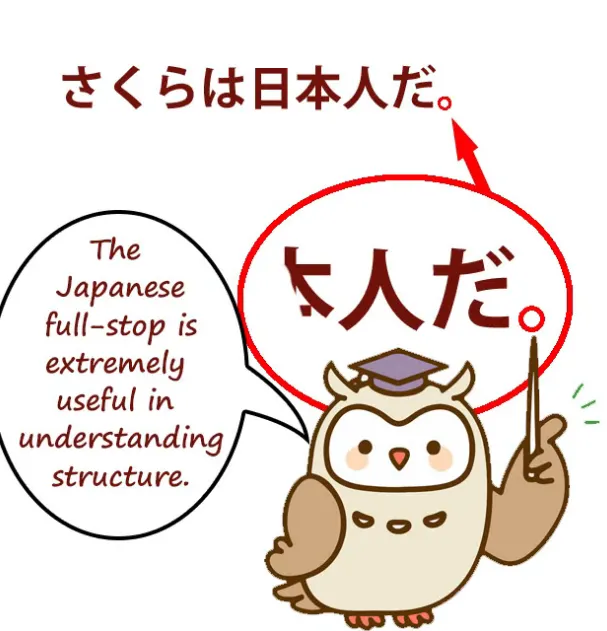
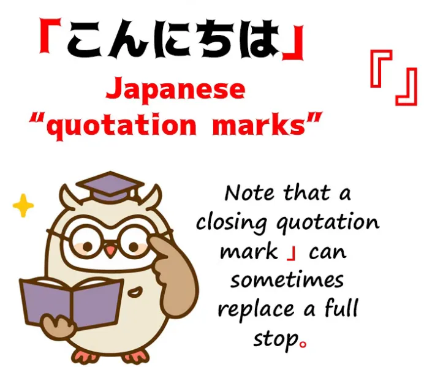
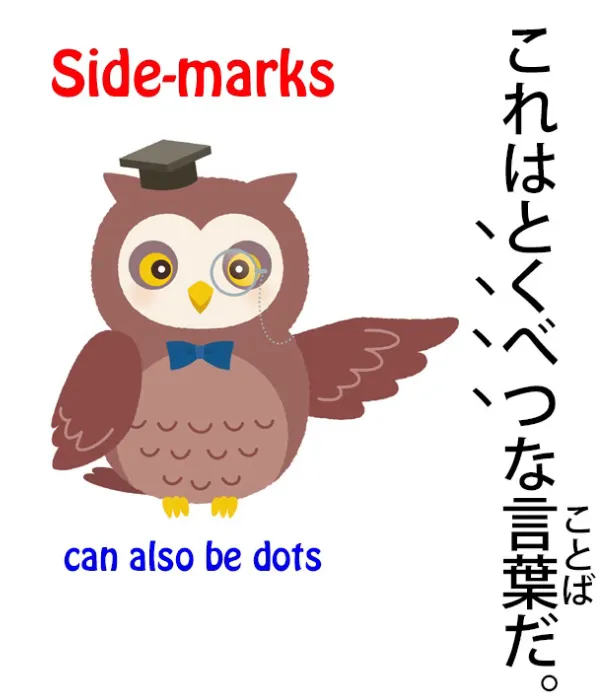
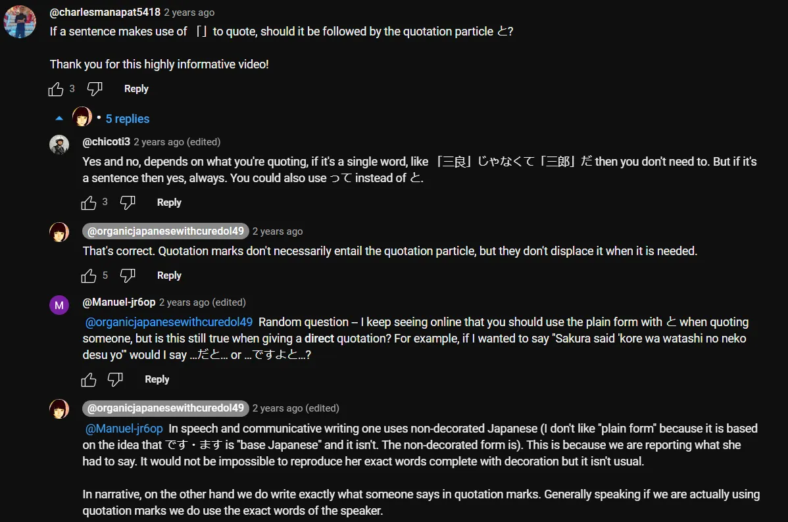

# **90. Tanda Baca dalam Bahasa Jepang: Cara Kerjanya.** 

[**Tanda Baca dalam Bahasa Jepang: Cara Kerjanya yang SEBENARNYA. Pelajaran 90**](https://www.youtube.com/watch?v=LDQlGnqElTU&amp;list;=PLg9uYxuZf8x_A-vcqqyOFZu06WlhnypWj&amp;index;=92&amp;ab;_channel=OrganicJapanesewithCureDolly)

こんにちは。

Hari ini kita akan membahas tanda baca dalam bahasa Jepang.

**Nah, hal pertama yang perlu kita ketahui tentang tanda baca dalam bahasa Jepang adalah bahwa sebagian besar dari tanda baca tersebut relatif baru masuk ke dalam bahasa Jepang.** **Sebagian besar masuk pada era Meiji, sekitar seratus lima puluh tahun yang lalu.**

**Ini terjadi saat Jepang sedang modernisasi, dan salah satu alasan utama masuknya tanda baca tersebut adalah untuk membantu menerjemahkan sastra Barat.**

---

Sekarang, **artinya, dalam kebanyakan kasus, tanda baca dalam bahasa Jepang tidak memiliki makna yang tetap dan struktural seperti tanda baca yang setara dalam bahasa Inggris dan bahasa-bahasa Eropa lainnya.** Jadi, kita perlu mengetahui fungsi tanda baca tersebut dan juga apa yang tidak dilakukannya.

## Titik (。)

Jadi, tanda baca pertama yang akan kita bahas adalah titik dalam bahasa Jepang atau <code>まる / 。</code>, **yang terlihat seperti lingkaran kecil di bagian bawah <code>letter</code>.**

Dan **ini benar-benar pengecualian dari aturan, karena secara struktural sangat jelas.** **Fungsinya adalah mengakhiri kalimat.**

**Dan ini sangat penting bagi kita dalam memahami bagaimana kalimat-kalimat Jepang yang kompleks disusun.**

Mengapa demikian? Nah, **Bahasa Jepang adalah bahasa yang sangat bergantung pada modifikasi.** **Artinya, banyak hal yang dilakukan bahasa lain dengan strategi lain, dilakukan oleh Bahasa Jepang melalui modifikasi**, yaitu, **menggunakan klausa untuk memodifikasi kata benda atau elemen lain dalam kalimat.**

**Sebagian besar beban dalam struktur bahasa Jepang yang tidak dilakukan oleh Partikel logis dilakukan oleh struktur modifikasi ini.**

**Jadi, klausa logis utuh dapat digunakan bukan sebagai klausa logis, melainkan untuk memodifikasi kata benda atau elemen lain.**

Jadi, mari kita lihat bagaimana ini bekerja.

<code>**市場で買って川に落としちゃった**お菓子。</code>

Dan ini berarti <code>The candy **that I bought at the market and done dropped in the river**</code>.

::: info
Saya kira, frasa &quot;done in the translation&quot; digunakan untuk menyoroti terjemahan yang lebih harfiah dari &quot;ちゃった&quot;.
:::

Sekarang, **masalahnya saat kita membaca kalimat yang kompleks adalah kita bisa bingung apakah sesuatu itu klausa logis atau bukan.**

Jadi, **apakah kita mengatakan di sini bahwa saya membeli sesuatu di pasar? Tidak, bukan itu yang dimaksud.** **Apakah kita mengatakan bahwa saya menjatuhkan sesuatu ke sungai?  
Tidak, bukan itu yang dimaksud dalam kalimat ini.**

---

**Kedua hal tersebut hanya berfungsi sebagai kata keterangan <code>お菓子</code>.** **Keduanya memberi tahu kita seperti apa <code>お菓子</code> benda itu:** **yang saya beli di pasar dan yang terjatuh di sungai.**

**Jadi yang kita miliki di sini hanyalah satu kata benda, <code>お菓子</code>, yang telah dimodifikasi secara intensif oleh klausa logis yang tidak berfungsi sebagai klausa logis yang lengkap.**

---

**Kita kemudian dapat menambahkan Partikel logis ke sana <code>お菓子</code> dan menjadikannya klausa logis yang utuh.**

Jadi, kita mungkin akan mengatakan, <code>市場で買って川に落としちゃったお菓子**が**魚さんに食べられた。</code>

Permen*(**=subjek**)* (saya) beli di pasar dan jatuh ke sungai dimakan ikan.

::: info
Jika saya memahami dengan benar, karena kita menandai お菓子 dengan が subjek, kita kini dapat membangun klausa lain darinya, sehingga kita mendapatkan klausa logis lain berupa <code>お菓子が魚さんに食べられた</code>.
:::
*Meskipun お菓子 juga dimodifikasi oleh klausa modifikator di depannya, khususnya <code>市場で買って川に落としちゃった</code>, klausa-klausa tersebut berfungsi di sini hanya sebagai pengubah yang mendeskripsikan お菓子, bukan sebagai klausa logis yang lengkap (berdiri sendiri?). Meskipun ini hanya tebakan saya berdasarkan pemahaman saya.*

**Namun, bagaimana kita memastikan saat membaca kalimat seperti ini apakah kita sedang melihat klausa logis atau pengubah?**

## Bagaimana cara mengetahui apakah itu klausa logis atau pengubah?

Sekarang, **hal penting yang perlu dipahami di sini adalah bahwa dalam segala jenis tulisan bahasa Jepang**  
(kecuali mungkin di Twitter atau semacamnya)  
**sebuah klausa logis harus diakhiri dengan salah satu dari dua cara**, **yaitu dengan <code>まる / 。</code>, yang menandakan bahwa itu adalah akhir dari kalimat lengkap** 

(mungkin ada beberapa partikel penutup kalimat setelahnya, tetapi ini adalah aturan yang sangat ketat dalam bahasa Jepang bahwa **apa pun yang mengakhiri klausa logis adalah B-engine, terlepas dari partikel penutup kalimat apa pun**) 

---

**atau harus diakhiri dengan penghubung klausa yang melengkapi klausa tersebut dan mengarah ke klausa berikutnya.** **Ini bisa berupa bentuk -て, bisa juga kata seperti <code>から</code> atau <code>けれど</code>,** tetapi dengan informasi tersebut, kita dapat memahami apa yang terjadi.

Jadi, mari kita lihat <code>市場で買って川に落としちゃった</code>.

**Itu adalah pasangan klausa logis yang lengkap.**

::: info
Tebakan saya di sini adalah bahwa secara teoritis kalimat tersebut terdiri dari dua klausa logis jika, seperti yang dikatakan Dolly di bawah ini, kita mengasumsikan ada subjek tersembunyi dan objek langsung tersembunyi jika kita menganggap kedua kata kerja tersebut menandai klausa logis masing-masing - 市場で(私がお菓子を)買った dan (私がお菓子を)川に落としちゃった yang kemudian dihubungkan menggunakan bentuk &quot;て&quot;. Di sini, &quot;お菓子&quot; seharusnya menjadi objek langsung, itulah sebabnya &quot;を&quot;, karena &quot;落とす&quot; dan &quot;買う&quot; adalah kata kerja yang mengindikasikan gerakan lain dan memerlukan subjek yang bertindak pada objek langsung. Jelas, penanda topik juga bisa ada di sana, seperti &quot;私は&quot; di awal.
:::
*Namun, klausa-klausa ini digabungkan dan karena diikuti oleh kata benda, mereka berfungsi sebagai modifikator untuk kata benda tersebut. Oleh karena itu, mereka bukan lagi klausa logis dan tidak mengandung unsur-unsur tersembunyi; sebaliknya, mereka merupakan satu modifikator besar untuk kata benda yang mengikuti mereka, dalam hal ini &quot;お菓子&quot;. Sayang sekali saya tidak bisa bertanya kepada Dolly tentang hal ini, karena saya merasa itu akan sangat membantu  
Namun, saya sadar tebakan saya kemungkinan besar salah, jadi tolong ambil dengan sebutir garam.*

**Ini tidak memberitahu kita apa yang kita beli di pasar dan terjatuh ke sungai, tetapi mungkin saja mengasumsikan hal itu.**

**Namun, kita tahu bahwa ini sebenarnya bukan klausa logis karena tidak diakhiri dengan konektor klausa dan tidak diakhiri dengan <code>まる / 。</code>.** **Kalimat itu langsung berlanjut ke kata benda.**

---

**Dan inilah cara kita membedakan antara kata keterangan dan klausa logis.** **Dan kita tahu kapan urutan keseluruhan, kalimat keseluruhan, berakhir karena akan diakhiri dengan <code>まる / 。</code>.**

Dan saya telah membuat video tentang metode menganalisis kalimat Jepang ini dan saya akan menyertakan tautannya agar Anda dapat menontonnya nanti[[34]](./34-understand-any-sentence.md).

**Namun <code>まる / 。</code> ini sangat penting.**

## Komma / 、

Sekarang, yang akan kita bahas selanjutnya adalah komma dalam bahasa Jepang, yang terlihat seperti garis miring kecil di bagian bawah huruf.

**Dan itu agak berlawanan dengan <code>まる / 。</code>, karena tanda baca ini sebenarnya bukan elemen logis dalam kalimat.** **Tanda baca ini diadopsi ke dalam bahasa Jepang, tetapi tidak seperti koma dalam bahasa Inggris atau koma Eropa lainnya, tanda baca ini tidak memiliki aturan logis.**

**Ide-ide seperti memisahkan klausa subordinat dengan koma di kedua ujungnya, hal itu tidak ada dalam bahasa Jepang.** **Anda hanya menempatkan koma di mana pun Anda ingin menandakan jeda. Dan itulah satu-satunya fungsinya.**

Di sekolah-sekolah Jepang, siswa dilarang menggunakan terlalu banyak koma, dan alasan di balik hal ini bukanlah penggunaan koma yang salah, **karena tidak ada yang namanya penggunaan koma yang salah dalam bahasa Jepang.**

**Alasannya adalah koma bukanlah bagian struktural dari bahasa Jepang, sehingga siswa dilarang menggunakannya sebagai penopang dalam menyampaikan makna.** **Jika Anda tidak dapat menyampaikan makna tanpa koma, maka Anda tidak menulis bahasa Jepang yang baik.**

## Tanda tanya / ？(はてな)

Sekarang, yang akan kita bahas selanjutnya adalah tanda tanya atau <code>はてな</code>.

Sekarang, **dalam bahasa Inggris, tanda tanya tunduk pada aturan.** **Jika Anda memiliki pertanyaan, Anda harus mengakhirinya dengan tanda tanya.**

**Dan juga dalam bahasa Inggris, pertanyaan secara struktural berbeda dari pernyataan.**

Jadi jika kita mengatakan, <code>The coffee is hot</code>, itu adalah pernyataan, tetapi jika kita mengatakan, <code>Is the coffee hot?</code> itu adalah pertanyaan.

---

**Dalam bahasa Jepang, kita tidak memiliki perbedaan ini.** **Pernyataan dan pertanyaan memiliki struktur yang persis sama.**

Sekarang, **dalam bahasa Jepang formal** kita memiliki **partikel penanda tanda tanya <code>か</code>**, **yang menunjukkan bahwa itu adalah pertanyaan.**

Namun **dalam bahasa Jepang informal, kita bisa menggunakan <code>か</code> tetapi kebanyakan kita tidak melakukannya.** **Kadang-kadang kita menggunakan partikel penanda pertanyaan <code>の</code>, tetapi itu ambigu karena <code>の</code> juga bisa menjadi penanda pernyataan.**

---

**Satu-satunya cara untuk benar-benar membedakan pertanyaan dari pernyataan dalam bahasa Jepang adalah intonasi naik, yang tentu saja tidak bisa didengar dalam teks.**

**Oleh karena itu, tanda tanya telah menjadi alat yang sangat berguna untuk menunjukkan intonasi naik tersebut, untuk memberi tahu kita bahwa ini adalah pertanyaan, bukan pernyataan.**

**Dalam bahasa Inggris, Anda harus menggunakan tanda tanya di akhir kalimat jika Anda menulis dalam bahasa Inggris yang baku. Dalam bahasa Jepang, tidak ada aturan seperti itu.**

**Jika <code>か</code> penanda ada di sana, Anda tidak perlu menggunakan tanda tanya, tetapi jika Anda ingin memperjelas bahwa sesuatu adalah pertanyaan bukan pernyataan, Anda cukup menambahkan tanda tanya jika diinginkan.**

## Tanda kutip / 「　」

Hal berikutnya yang akan kita bahas adalah tanda kutip.

**Tanda ini terlihat seperti kurung siku kecil di ujung kalimat, dan fungsinya persis sama dengan tanda kutip dalam bahasa Inggris.**

**Tanda ini hanya menunjukkan bahwa sesuatu adalah kutipan: yaitu apa yang dikatakan seseorang.** **Kita tidak menggunakannya untuk apa yang dipikirkan seseorang, seperti yang kadang-kadang kita lakukan dalam bahasa Inggris.**

---

Sekarang, terkadang Anda akan melihat **tanda kutip ganda** seperti ini, 『　』 **dan fungsinya adalah menandai kutipan yang terjadi di dalam kutipan lain.**

## Tanda <code>side-marks</code>Sekarang, hal terakhir yang ingin saya bahas adalah sesuatu yang benar-benar membingungkan banyak orang.

**Dalam bahasa Jepang, terutama buku-buku Jepang**, Anda kadang-kadang akan melihat, **terutama dalam teks vertikal, sekelompok tanda kecil yang terlihat mirip koma Jepang, berjalan di sepanjang sisi kiri sebuah kata atau frasa.**

Apa sebenarnya fungsi tanda-tanda ini?

Sepertinya tidak ada yang menjelaskannya.

**Fungsinya sebenarnya adalah untuk menonjolkan kata atau frasa tersebut atau memberi tahu kita bahwa kata atau frasa tersebut digunakan dalam arti khusus.**

---

**Jadi, fungsi sebenarnya dari tanda-tanda kecil ini mirip dengan menuliskannya dengan huruf miring dalam bahasa Inggris.**

Dan saya menduga tanda-tanda ini awalnya masuk ke dalam bahasa Jepang untuk menggambarkan huruf miring saat menerjemahkan sastra Barat.

**Tidak ada cara untuk benar-benar menulis karakter Jepang dengan huruf miring.** **Tidak ada format miring untuk bahasa Jepang, jadi inilah yang digunakan sebagai gantinya.**

---

**Penekanan ini dan indikasi bahwa sesuatu digunakan dalam arti khusus juga dapat ditunjukkan dengan katakana, tetapi Anda akan melihat hal ini sesekali dalam teks-teks Jepang dan itulah artinya.**

*Tautan Dolly adalah untuk Pelajaran 80.*
