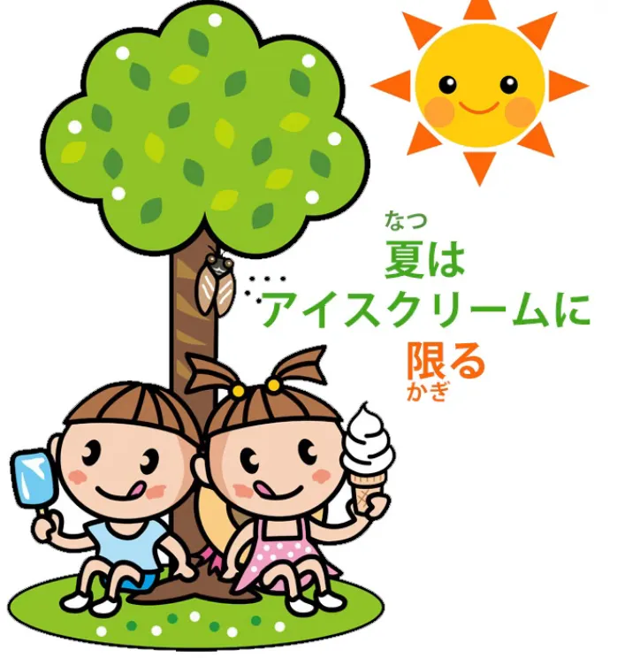
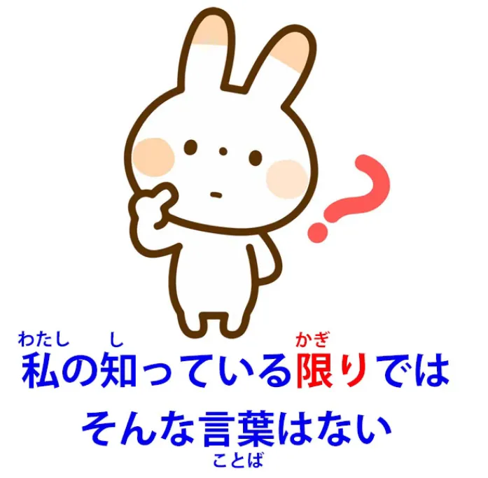
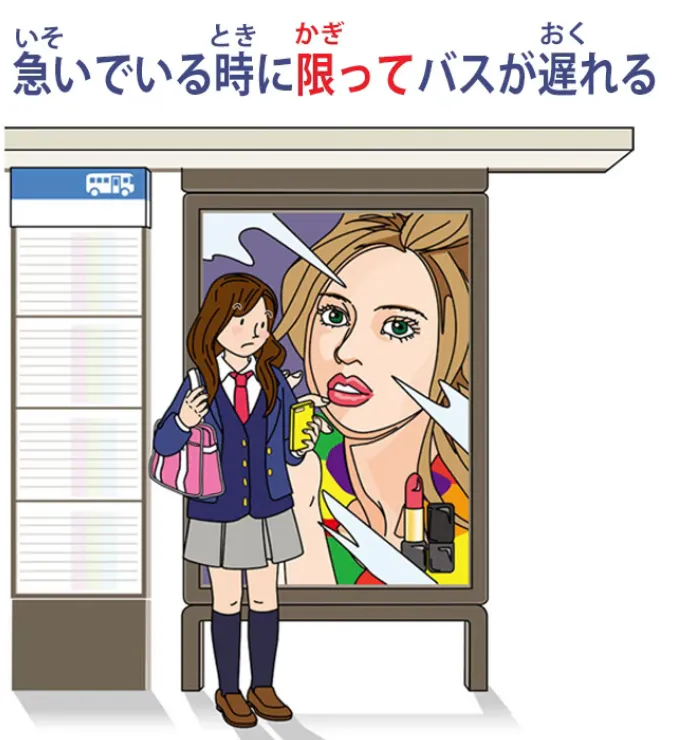
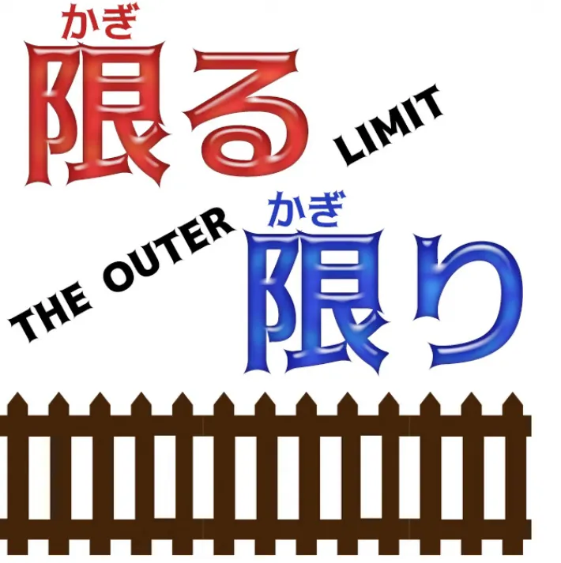
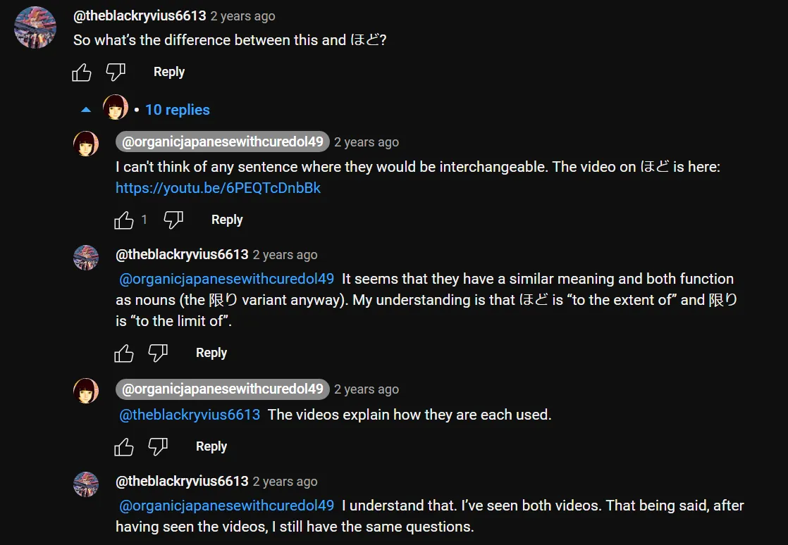
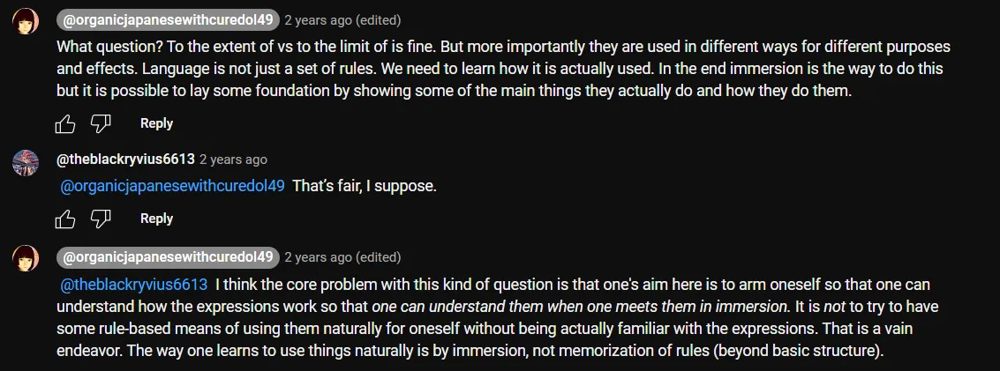
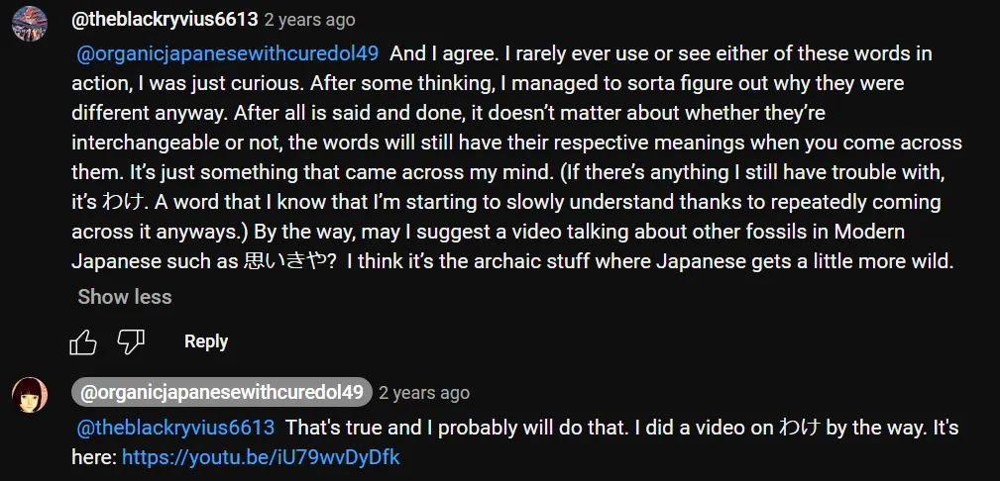

# **91. Outer Limits! 限る &amp; 限り: Berbagai maknanya dan cara kerjanya 知っている限り、とは限らない serta lainnya**

[**Outer Limits! 限る Kagiru 限り Kagiri - Berbagai maknanya dan cara kerjanya 知っている限り、とは限らない dan lainnya**](https://www.youtube.com/watch?v=jWCLPJwZS5E&amp;list;=PLg9uYxuZf8x_A-vcqqyOFZu06WlhnypWj&amp;index;=96&amp;ab;_channel=OrganicJapanesewithCureDolly)

こんにちは。

Hari ini kita akan membahas <code>限る</code> dan <code>限り</code>. **<code>限る</code> adalah kata kerja yang berarti <code>limit</code> atau <code>restrict</code>,** dan **<code>限り</code> adalah A-stem kata &quot;い&quot;, sehingga merupakan bentuk nomina dari kata kerja tersebut.**

Jika Anda tidak tahu tentang akar kata &quot;い&quot; yang membentuk bentuk nomina, saya akan menyertakan tautan video di atas yang menjelaskan semua rahasia dari akar kata &quot;い&quot; yang misterius.[[72]](./72-the-great-connector- い -stem-magic.md)

Sekarang, **bahasa Jepang menyukai ekspresi pembatasan, ekspresi yang berkaitan dengan batas dan batasan.** [**Saya membuat video**](https://www.youtube.com/watch?v=56sy0qfY0Js) tentang <code>うち</code>[[97]](./97-the-meanings-of- うち -home-self-social-boundary-time-marker- いまのうち - そのうち.md) beberapa waktu lalu dan saya akan menempatkan tautan di atas kepala saya dan di bagian informasi di bawah. <code>うち</code> berfokus pada ruang tertutup, pada area di mana kita berada dan segala sesuatu di luarnya.

**<code>限り</code>, di sisi lain, berfokus pada batas-batas ruang tersebut,** **tepi-tepi di mana ruang tersebut tidak menjangkau.** Dan hal ini memunculkan berbagai strategi ekspresi, beberapa di antaranya cukup literal, sementara yang lain sangat metaforis dan dapat membingungkan orang jika mereka tidak memahami asal-usulnya.

## 限る

**Jadi, mari kita mulai dengan penggunaan yang sangat sederhana dari <code>限る</code>.**

<code>出席は招待者に**限る**</code>

**<code>出席</code> adalah kehadiran di acara apa pun itu.** **Hal ini dibatasi pada <code>招待者</code> (orang yang diundang).** **Di luar batas itu, <code>出席</code> tidak ada.** **Anda tidak dapat menghadiri rapat atau acara apa pun kecuali Anda adalah orang yang diundang.**

Sekarang, penggunaan lain yang sebagian besar harfiah adalah <code>声の**限りに**呼んだ</code> (Saya berteriak **sekeras-kerasnya**).

  
Dalam bahasa Inggris, kita mungkin mengatakan <code>the top of my voice</code>.

**Yang kami maksud di sini adalah batas sekeras apa yang bisa dicapai oleh suara saya.**

Jadi, ini cukup harfiah dan mudah dipahami. Namun, ada juga ungkapan-ungkapan yang menurut saya sebagian besar dari Anda pernah dengar dan mungkin sedikit lebih membingungkan.

Jadi, <code>夏はアイスクリイムに**限る**</code> — sekarang, secara kasar dalam bahasa Inggris itu berarti <code>In summer, ice cream **is the best thing**</code>.

Yang sebenarnya kita maksudkan adalah <code>Speaking of summer, when it comes to summer, it **reaches its limit** at ice cream</code>, dengan kata lain, es krim **adalah batas terjauh yang bisa kamu capai** dalam musim panas / es krim **adalah puncak dari** musim panas / **tidak ada yang melebihi** es krim ketika kita berbicara tentang musim panas.

::: info
Tentu saja, ini hanyalah terjemahan alami ke bahasa Inggris, itulah sebabnya sulit untuk menentukan &quot;限る&quot; di sini.
:::
---

Dan ini dapat digunakan dalam berbagai macam ungkapan, misalnya:

<code>運動なら水泳に**限る**</code>  
(jika itu olahraga / jika kita berbicara tentang olahraga, itu **mencapai batasnya** dengan berenang \[<code>水泳</code>\] / berenang **adalah jenis olahraga yang paling baik**).

Dan melanjutkan dari ini, kita mendapatkan ungkapan seperti <code>彼女に**限って**そんなことはしない</code>.

Dan sekali lagi, dalam bahasa Inggris yang lebih santai, ini akan menjadi &quot;Dia **dari semua orang** tidak akan melakukan hal seperti itu / dia akan menjadi **orang terakhir** yang melakukan hal seperti itu&quot;.

Yang sebenarnya kita katakan adalah <code>She is **the very limit of** people who wouldn&#x27;t do such a thing</code>.

---

Jadi, sama seperti es krim yang merupakan **hal terbaik** di musim panas atau berteriak **sekeras-kerasnya**, dia adalah **yang paling ekstrem** di antara orang-orang yang tidak akan melakukan hal semacam itu.

**Orang lain mungkin saja melakukannya, meskipun kamu mengira mereka tidak akan melakukannya,** **tetapi dia adalah batas paling ekstrem dari jenis orang yang tidak akan melakukan hal semacam itu.**

## Penggunaan &quot;限る&quot; secara negatif (tidak terbatas pada x)

Sekarang, **konsep <code>限る</code> (batas) sering digunakan secara negatif untuk menunjukkan bahwa** **sesuatu tidak terbatas pada pernyataan tertentu, gagasan tertentu.**

Jadi, <code>辞書に書いてあることが常に正しいとは限らない</code>.

**Dan ini <code>-とは限らない</code> pada dasarnya merangkum pernyataan sebelumnya** dan menyatakan bahwa hal itu **tidak terbatas pada hal tersebut.**

Jadi, yang kami maksud di sini adalah <code>Things that are written in a dictionary are always correct</code> — **itulah pernyataannya, lalu kita mengutipnya <code>-とは限らない</code>:** <code>**It&#x27;s not necessarily the case that** things written in a dictionary are always correct.</code>

Dan saya rasa kita telah membuktikan kebenarannya dalam berbagai kesempatan.

## 限り

Sekali lagi, ini <code>限り</code> dapat digunakan untuk batas-batas pengetahuan seseorang dan sering kali memang demikian, jadi <code>私の知っている**限り**ではそんな言葉はない</code>.

Jadi, dalam bahasa Inggris kita akan mengatakan <code>As far as I know, there&#x27;s no such word</code>, tetapi strategi ekspresinya di sini adalah memodifikasi kata benda <code>限り</code> — <code>私の知っている**限り**</code> (**batas dari** apa yang saya ketahui): <code>**Up to the limit of** what I know, there is no such word.</code>

Dan sebenarnya dalam kasus ini cukup mirip dengan bahasa Inggris: <code>**as far as** I know / **to the limit of** what I know</code>.

Dan yang menarik di sini adalah **meskipun bahasa Inggris mengatakan** <code>**as far as** I know</code>, **bahasa Jepang mencapai pola umum yang sama dengan memodifikasi kata benda <code>限り</code> (batas).**

Dan seperti yang kita bahas minggu lalu[[90]](./90-japanese-punctuation-how-it-works.md), **modifikasi melakukan sebagian besar pekerjaan berat dalam bahasa Jepang** **yang dilakukan oleh strategi lain dalam bahasa Inggris.**

---

Sekarang, ungkapan umum lainnya yang bisa sedikit membingungkan adalah jenis ungkapan yang kita temukan dalam <code>急いでいる時に**限って**バスが遅れる</code> (**terbatas pada** saat-saat ketika kita sedang terburu-buru, bus datang terlambat).

Sekarang, **ini jelas bukan makna harfiah, tetapi mengekspresikan perasaan yang sering dirasakan,** **bahwa bus atau apa pun yang melakukan sesuatu yang tidak kita inginkan, melakukannya** **tepat pada saat kita sangat tidak menginginkannya atau tidak mampu menanggungnya.**

Jadi, ungkapan yang pada awalnya mungkin tampak sedikit membingungkan ini sebenarnya adalah ungkapan yang sangat alami, yang menurut saya kadang-kadang Anda temukan dalam bahasa Inggris. **Hanya ketika kita benar-benar membutuhkannya, hal itu tidak terjadi.**

### その場限り

Sekarang, ungkapan lainnya adalah <code>その場限り</code>.

Jadi, <code>その場限りことを言う</code> berarti dia mengatakan hal-hal **secara spontan** / dia berbicara tanpa berpikir panjang.

**<code>その場</code>**, yang telah kita bahas dalam video lain, yang akan saya tautkan[[75]](./75-japanese-is-not-english-how-expression-strategies-differ-polite- 英本語 -rude-japanese.md), secara harfiah berarti **<code>that place / the appropriate place / the place one would happen to be at at the time</code>**, tetapi **tentu saja dalam bahasa Jepang seperti dalam bahasa lain, tempat juga bisa berarti waktu atau kesempatan.**

---

Jadi, <code>**その場限り**ことを言う</code> artinya dia mengatakan hal-hal yang **hanya muncul dari kesempatan tertentu dan tidak ada yang lain** — **terbatas pada kesempatan tertentu itu / tidak memiliki relevansi nyata di luar kesempatan tertentu itu.**

Jadi, implikasinya pada dasarnya adalah berbicara tentang hal-hal yang tidak memiliki nilai nyata yang muncul begitu saja dari pikirannya.

### その場限りさ

Dan ungkapan yang sangat umum terkait hal ini adalah <code>喧嘩はその場限りさ</code> – ケンカ dan **ini adalah ungkapan populer, bukan kalimat lengkap.**

::: info
Saya menggunakan bentuk Kanji untuk ケンカ (喧嘩), tetapi keduanya sama-sama benar.
:::
**Yang <code>さ</code> ini lebih ke arah <code>should</code>.** **<code>さ</code> di sini mengatakan <code>that&#x27;s how it ought to be / come on, that&#x27;s how it should be</code>.**

Dan diterjemahkan ke dalam bahasa Inggris sebagai <code>quarrels should not be continued</code>.

Terkadang bahkan diterjemahkan sebagai <code>let not the sun settle on your wrath</code>, yang tentu saja tidak ada hubungannya dengan apa yang sebenarnya dimaksud.

**Namun intinya di sini adalah bahwa pertengkaran harus dibatasi pada <code>その場</code>** **(kesempatan, peristiwa di mana pertengkaran itu muncul).** **Jadi, jika Anda bertengkar dengan seseorang hari ini, Anda tidak boleh melanjutkan pertengkaran itu besok.**

Saran yang sangat baik.

Jadi, inilah berbagai situasi di mana <code>限り / 限る</code> konsep ini diterapkan dalam bahasa Jepang.

Tentu saja ada yang lain, tetapi dengan informasi ini saya rasa Anda akan lebih memahami apa yang sedang terjadi.

::: info
Tautan yang dimaksud adalah [**くらい vs ほど**](https://www.youtube.com/watch?v=6PEQTcDnbBk&amp;ab;_channel=OrganicJapanesewithCureDolly) dan Lesson 68 untuk わけ. Anda dapat memeriksa komentar lain di bawah video seperti biasa.
Bagaimanapun, di sinilah playlist Grammar Dolly yang terdiri dari 93 video secara resmi berakhir. Kita sudah mendekati akhir. Masih ada beberapa video lain yang dikonversi oleh Dolly di bawah ini.*
:::
