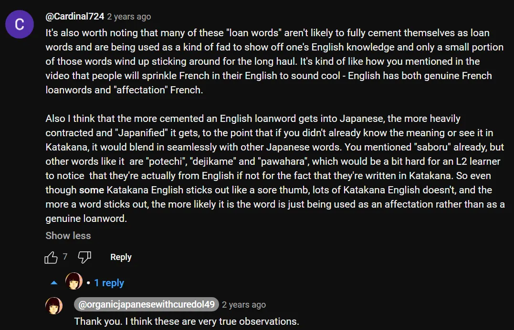

# **92. Akankah Bahasa Inggris &quot;Menelan&quot; Bahasa Jepang? Invasi kata serapan — apakah ini benar-benar ancaman?**

[**Akankah Bahasa Inggris &quot;Menelan&quot; Bahasa Jepang? Invasi kata serapan - apakah ini benar-benar ancaman?**](https://www.youtube.com/watch?v=bPWt-8Ecd7Y&amp;ab;_channel=OrganicJapanesewithCureDolly)

こんにちは。

Hari ini kita akan membahas sesuatu yang telah dibicarakan oleh beberapa orang kepada saya sejak saya memulai saluran ini, dan kita sering melihat artikel serius maupun semi-serius tentang topik ini, biasanya ditulis oleh orang asing, yang memperingatkan orang Jepang tentang bahaya mengerikan bagi bahasa mereka akibat masuknya bahasa Inggris ke dalamnya, serta khawatir bahwa orang Jepang tampaknya tidak menyadari kerusakan yang bisa ditimbulkan oleh hal ini terhadap bahasa mereka dan cara-cara di mana hal itu bisa membuatnya kurang &quot;Jepang&quot;.

Jadi hari ini saya ingin melihat apa yang sebenarnya terjadi di sini, apa yang kemungkinan besar akan terjadi, dan apa yang kemungkinan kecil akan terjadi.

## Alasan Mengapa Begitu Banyak Kata Bahasa Inggris Ada dalam Bahasa Jepang Modern

**Pertama-tama, benar adanya bahwa ada masuknya kata-kata bahasa Inggris ke dalam bahasa Jepang, dan ada empat alasan utama untuk hal ini.**

---

**Yang pertama adalah bahwa bahasa Inggris, tentu saja, adalah bahasa internasional.** Kebanyakan orang mempelajarinya di sekolah karena ini adalah bahasa yang paling berguna untuk dipelajari jika Anda belum menguasainya.

**Dan hal ini, tentu saja, tidak hanya memengaruhi bahasa Jepang.** **Para puris bahasa Prancis telah mengeluhkan kata-kata seperti <code>le weekend</code> dan <code>le football</code> selama lebih dari setengah abad, dan saya rasa hal itu tidak benar-benar merugikan bahasa Prancis.**

---

**Kedua, bahasa Inggris telah menjadi bahasa teknologi, dan teknologi—khususnya teknologi digital—telah mengubah kehidupan manusia secara radikal selama beberapa dekade terakhir serta memperkenalkan banyak istilah baru ke dalam kehidupan mereka.**

Dan karena sebagian besar teknologi ini dikembangkan di Amerika, bahasa yang digunakan untuk istilah-istilah baru tersebut sebagian besar adalah bahasa Inggris.

---

**Dan alasan lainnya — sekali lagi, semua ini saling terkait — adalah bahwa bahasa Inggris, sebagai bahasa internasional, memiliki prestise yang tinggi dalam berbagai hal.** **Bahasa Inggris bisa dianggap keren. Bahasa Inggris bisa dianggap lucu.**

**Dan jika Anda melihat tulisan ajaib dalam bahasa Jepang, kemungkinan besar tulisan tersebut didasarkan pada alfabet Romawi** dan mungkin meniru kata-kata bahasa Inggris **karena bahasa Inggris adalah sesuatu yang asing bagi orang Jepang, tetapi pada saat yang sama sesuatu yang sebenarnya mereka ketahui sedikit, jadi ini adalah semacam unsur asing yang ramah.**

**Dan penggunaan kata-kata Inggris bisa memiliki berbagai efek:** **bisa terlihat imut, bisa terlihat cerdas, bisa terlihat keren.** **Dan ini adalah fenomena yang umum.**

---

**Ketika bahasa Prancis lebih dianggap sebagai bahasa bergengsi tinggi dan kebanyakan penutur bahasa Inggris mempelajarinya, fenomena yang sama juga terjadi.** Orang-orang akan menyisipkan potongan-potongan bahasa Prancis dalam percakapan, penulis akan menggunakan potongan-potongan bahasa Prancis dalam buku, dan hal itu dilakukan untuk terlihat sedikit cerdas, terkadang untuk terlihat lucu.

**Bahasa-bahasa bergengsi cenderung memiliki kata-kata yang dipinjam oleh bahasa lain.**

---

**Sekarang, seperti yang Anda lihat, tidak ada satupun dari hal ini yang sebenarnya unik bagi bahasa Jepang.** Jika Anda berkeliling di negara yang tidak berbahasa Inggris, Anda cenderung melihat kata-kata bahasa Inggris di papan nama, pada produk di toko, dan berbagai hal semacam itu.

Bahasa Inggris ada di mana-mana karena, ya, orang-orang mempelajarinya di sekolah, mereka tahu sedikit bahasa Inggris, dan **bahasa Inggris adalah bahasa internasional, jadi banyak hal sering kali diberi nama dalam bahasa Inggris.**

## Mengapa beberapa orang khawatir tentang bahasa Inggris <code>invading</code> bahasa Jepang?

Jadi, mengapa orang lebih khawatir tentang hal ini dalam bahasa Jepang daripada dalam bahasa lain?

**Saya pikir salah satu alasannya adalah bahwa kata-kata Inggris dalam katakana menonjol.** **Jika Anda mengadopsi kata-kata Inggris ke dalam, misalnya, bahasa Prancis atau Jerman, kata-kata tersebut ditulis dengan aksara yang sama seperti bahasa aslinya.**

**Dan khususnya bagi orang asing, bahasa Inggris yang ditulis dengan katakana terdengar aneh.** **Mereka harus mengubah bentuk bahasa Inggris dengan berbagai cara karena harus menambahkan banyak suku kata.** Jadi semuanya terlihat sangat mencolok, jauh lebih mencolok bagi orang asing daripada bagi penutur asli Jepang.

---

**Namun, hal yang perlu diingat di sini adalah bahwa secara umum, kata-kata pinjaman dari bahasa Inggris tidak menggantikan padanan kata dalam bahasa Jepang, jika memang ada padanan kata dalam bahasa Jepang sejak awal.** **Kata-kata tersebut cenderung digunakan berdampingan, mungkin memiliki implikasi yang sedikit berbeda atau sekadar nuansa yang berbeda.**

---

**Ada beberapa pengecualian untuk hal ini, seperti misalnya kata <code>ライオン</code>, yang kini cenderung menjadi kata utama untuk singa dalam bahasa Jepang.**

**Bahasa Jepang memiliki kata sendiri untuk singa, yaitu <code>獅子 / しし</code>, tetapi saat ini kata tersebut cenderung terdengar agak sastrawi, agak kuno,** dan jika kita akan membicarakan singa, kita cenderung mengatakan <code>ライオン</code>. **Itu sedikit menjadi pengecualian.**

**Jika kita membicarakan gajah, kita mengatakan <code>象 / ぞう</code>.** **Jika kita berbicara tentang harimau, kita mengatakan <code>虎 / とら</code>.** **Sebagian besar hewan liar dikenal dengan nama Jepang mereka meskipun nama Inggrisnya juga dikenal di Jepang.**

**Ada tim bisbol bernama 阪神タイガース,**

**tapi ini adalah contoh khas penggunaan kata asing karena terdengar cukup keren.** **Biasanya jika Anda hanya membicarakan harimau, Anda mengatakan <code>虎 / とら</code>.**

## Sejauh mana bahasa Inggris benar-benar merasuki bahasa Jepang?

Nah, jika Anda ingin melakukan eksperimen kecil untuk melihat sejauh mana bahasa Inggris benar-benar merasuki bahasa Jepang dan menggantikan bahasa tersebut, coba saja lihat sebuah buku Jepang.

**Jika Anda memiliki beberapa buku Jepang di sekitar Anda — saya tidak bermaksud buku teks atau buku bacaan untuk orang asing, tetapi jika Anda hanya memiliki beberapa buku Jepang** baik di rak buku Anda atau di perangkat seluler Anda, **buka dan lihatlah beberapa halaman dari beberapa buku tersebut, lalu perhatikan berapa banyak kata dalam katakana di seluruh halaman tersebut.**

**Dan Anda akan melihat bahwa proporsinya sangat kecil, mungkin satu atau dua di sebagian besar halaman, seringkali tidak ada sama sekali.** **Lalu perhatikan berapa banyak di antaranya yang sebenarnya merupakan nama orang, tempat, atau kata-kata buatan yang ditulis dalam katakana: ini bukan kata serapan.**

**Jumlah kata serapan sebenarnya sebagai proporsi dari halaman teks rata-rata atau percakapan orang biasa sangat kecil.** Apakah jumlahnya meningkat? Mungkin sedikit, tapi tidak benar-benar membuat kemajuan yang signifikan.

---

**Dan hal lain yang perlu diingat adalah bahwa dalam bahasa Jepang, kata-kata asing masuk sebagai kata benda.**

Hampir selalu.

**Ada satu atau dua pengecualian kecil seperti kata <code>サボる</code>, yang berarti <code>not attending school or work</code>, dan itu sebenarnya kata asing yang berasal dari bahasa Prancis <code>sabotage</code>** *- サボ, singkatan dari サボタージュ*, **dan memiliki hiragana - る serta sebenarnya diperlakukan seperti kata kerja.** Namun, ini benar-benar pengecualian yang sangat langka. Anda hanya akan menemukan segelintir kata yang melakukan hal itu dalam bahasa Jepang.

---

**Hampir semua kata bahasa Inggris yang masuk, sama seperti kata-kata bahasa Mandarin yang masuk di masa lalu, masuk sebagai kata benda, terlepas dari apa fungsi aslinya dalam bahasa asalnya.** **Jadi, jika Anda ingin menggunakannya sebagai kata kerja, Anda harus menambahkan <code>する</code>.** **Jika Anda ingin menggunakannya sebagai kata sifat, kata-kata tersebut harus berupa kata benda kata sifat atau Anda hanya perlu menggunakの.**

---

Jadi, secara struktural, bahkan jika kata-kata bahasa Inggris meningkat secara eksponensial, yang sebenarnya tidak terlalu mungkin, hal itu tidak akan berdampak pada struktur bahasa Jepang.

**Bahkan kata-kata Cina yang saat ini membentuk sekitar 60 persen kosakata bahasa Jepang hampir tidak memiliki pengaruh terhadap struktur bahasa yang sebenarnya, cara kalimat sebenarnya bekerja.** Dan ada kesamaan yang menarik di sini, yaitu ketika orang-orang Prancis Norman memerintah Inggris, mereka memberikan kosakata yang sangat, sangat, sangat banyak kepada bahasa Inggris, tetapi sekali lagi hal itu hampir tidak berdampak pada struktur bahasa tersebut.

## Akankah bahasa Inggris terus <code>invading</code> Bahasa Jepang?

Sekarang kita mungkin bertanya, apakah ini akan terus berlanjut, yang disebut sebagai invasi bahasa Inggris ini?

**Dan kita tidak benar-benar bisa menjawabnya karena hal itu bergantung pada prestise bahasa Inggris yang terus berlanjut, yang mungkin atau mungkin tidak akan berlanjut ke masa depan.** **Sepertinya tidak ada kandidat untuk bahasa internasional, tetapi di sisi lain, prestise budaya bahasa Inggris mungkin menurun.** Kita tidak tahu.

---

**Namun, masalahnya adalah bahasa Jepang dengan mudah mengadopsi kata-kata asing.** **Bahasa Jepang tidak mengintegrasikannya ke dalam strukturnya, tetapi menjadikannya bagian dari bahasa dan <code>Japanesify</code> menggunakannya.**

**Bahasa Inggris sebagai fenomena budaya ternyata sangat sedikit menembus pikiran orang Jepang.** Orang Jepang terkenal karena tidak belajar bahasa Inggris.

**Orang Jepang lebih buruk dalam bahasa Inggris dibandingkan kebanyakan kelompok bahasa lainnya.** **Sebagian besar orang Jepang, jika Anda berbicara dengan mereka, akan memiliki kosakata bahasa Inggris yang cukup luas namun pemahaman yang sangat terbatas terhadap bahasa Inggris itu sendiri.**

---

Dan saya pikir ada alasannya, **yaitu bahwa bahasa Jepang lebih dekat daripada bahasa non-Inggris lainnya dalam hal kemandirian budaya.**

::: info
Hal ini memang benar, kebanyakan orang Jepang di internet hanya bergaul dengan konten dan orang Jepang, sehingga mereka tidak terlalu perlu belajar atau menggunakan bahasa Inggris; ini mungkin salah satu alasan mengapa orang Jepang kurang menguasai bahasa Inggris meskipun bahasa tersebut ada di sana, karena saya berpendapat bahwa kebanyakan orang asing belajar bahasa Inggris melalui internet dengan mengonsumsi konten dan berbicara dengan orang lain dalam bahasa Inggris—baik input maupun output yang intensif—karena kebanyakan sistem pendidikan di sekolah bersifat artifisial dan ketinggalan zaman.  
Maksud saya, saya memperoleh sebagian besar kemampuan bahasa Inggris saya melalui internet, buku, dll., bukan di sekolah, dan itulah alasan saya menjadi fasih berbahasa Inggris; jika hanya mengandalkan sekolah, hal ini hampir mustahil.  
Memang, sekolah berguna untuk mempelajari dasar-dasar yang memungkinkan saya mengonsumsi materi.  
Tentu saja, orang Eropa lebih mudah menguasai bahasa Inggris daripada orang Jepang, tetapi menurut saya hal ini tetap berlaku.  
Menyelimuti diri Anda dengan bahasa sebanyak mungkin berarti Anda akan dapat menguasainya lebih cepat, itulah mengapa imersi di negara asing bekerja dengan sangat baik jika Anda mencoba memahami perlahan semua bahasa asing di sekitar Anda (dan mempelajarinya) serta menggunakannya secara perlahan.  
Hal yang penting adalah Anda harus berusaha secara aktif untuk memahami dan menggunakan bahasa tersebut.
:::

**Kebanyakan orang, bahkan jika mereka menggunakan bahasa utama seperti Prancis atau Jerman, tetap membutuhkan bahasa Inggris untuk kebutuhan budaya:** **untuk menggunakan internet, untuk berpartisipasi dalam budaya populer dunia modern.**

---

**Sekarang, budaya populer dunia modern jauh lebih didominasi oleh bahasa Inggris, seperti yang kita ketahui.**

**Namun, bahasa dan negara dengan budaya populer terkuat kedua adalah Jepang dan bahasa Jepang.** **Manga dan anime Jepang populer di seluruh dunia** dan tidak ada yang bisa menyaingi mereka.

Jika Anda bertanya kepada seseorang yang tidak tertarik dengan Jepang atau bahasa Jepang apakah mereka pernah mendengar tentang karakter dan fenomena Jepang seperti Mario, Sailor Moon, beberapa film Ghibli, Zelda, Pokemon, dan sebagainya, sebagian besar dari mereka pasti pernah mendengarnya.

Berapa banyak karakter dari bahasa lain yang diketahui kebanyakan orang? Berapa banyak yang berasal dari Jerman? Berapa banyak yang berasal dari Prancis? Dan ini adalah bahasa-bahasa utama. Berapa banyak yang berasal dari Spanyol? Ini adalah bahasa terbesar di dunia setelah bahasa Inggris.

**Jepang adalah kekuatan budaya populer hingga tingkat yang hanya dikalahkan oleh bahasa Inggris dan tidak dapat disamai oleh bahasa lain mana pun.** **Hal ini membuat mereka mandiri secara budaya dalam cara yang tidak dimiliki oleh kelompok bahasa lain (dengan kemungkinan pengecualian bahasa Tionghoa).**

---

**Jadi, kapan bahasa Jepang akan berubah menjadi semacam bahasa Inggris hibrida?** **Itu tidak akan terjadi.** **Hal itu sebenarnya tidak akan terjadi pada sebagian besar bahasa lain yang mengalami arus masuk bahasa Inggris ke dalamnya.**

**Namun, bahasa Jepang sebenarnya lebih aman daripada yang lain.**

::: info
Disarankan untuk membaca [**komentar-komentar**](https://www.youtube.com/watch?v=bPWt-8Ecd7Y&amp;ab;_channel=OrganicJapanesewithCureDolly) seperti biasa.

:::
