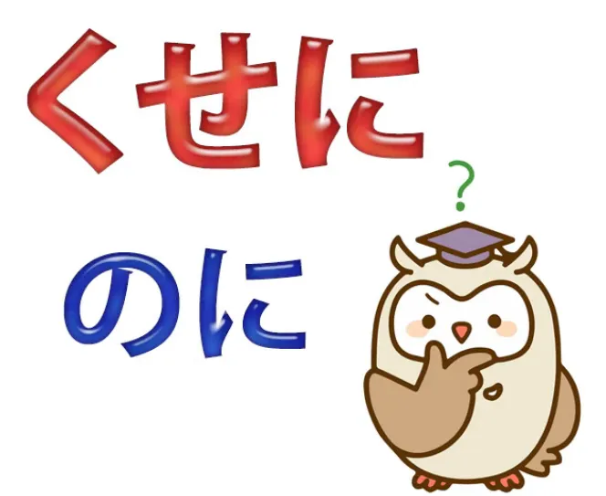
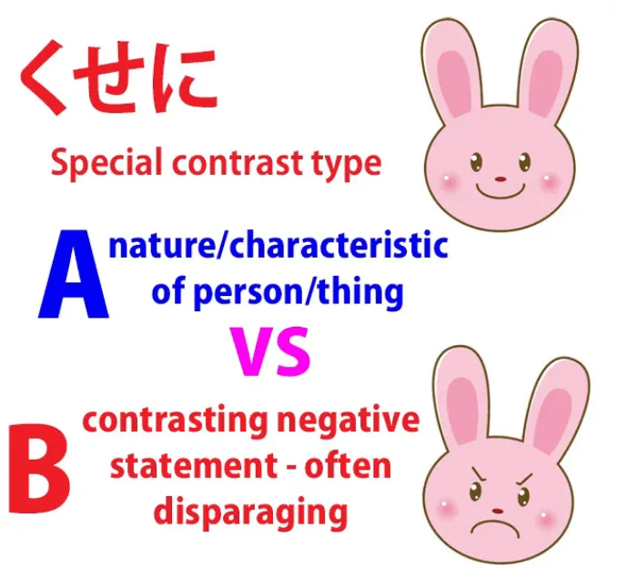
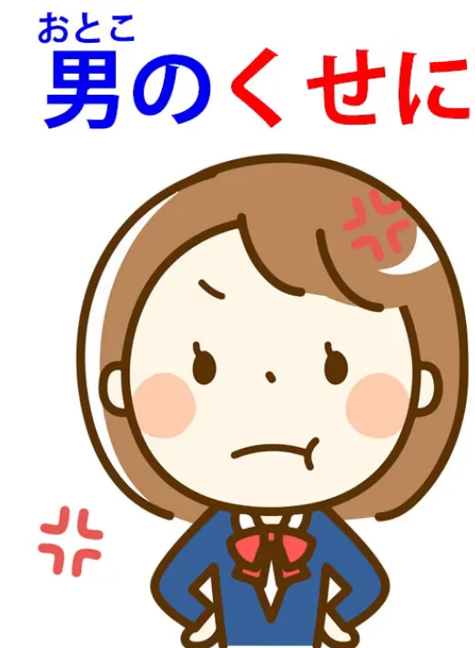
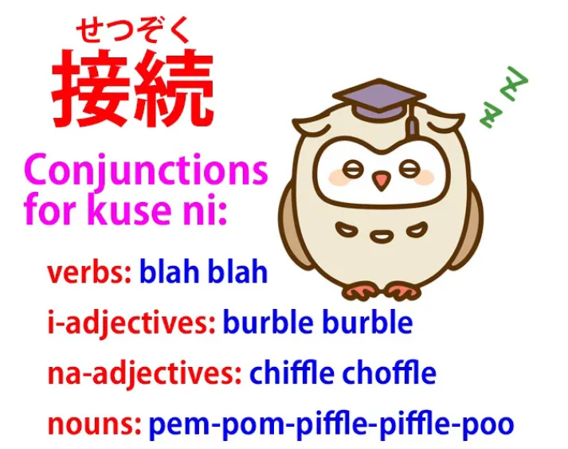
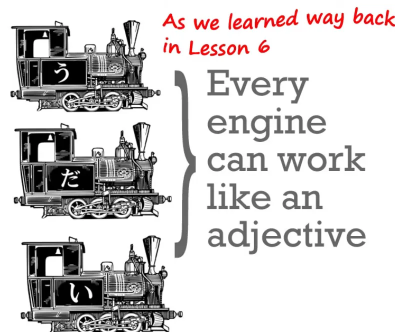

# **93. Mengumpat Mereka dengan &#x27;くせに&#x27;. Begini Cara Kerjanya.**

[**Mengumpat dengan &#x27;Kuse niくせに&#x27;. Bagaimana sebenarnya cara kerjanya.**](https://www.youtube.com/watch?v=QvuNXIYqFNM&amp;ab;_channel=OrganicJapanesewithCureDolly)

こんにちは。

Hari ini kita akan membahas sebuah ungkapan yang sering Anda temui di anime, manga, novel ringan, dan sebagainya, dan bisa membingungkan karena dua alasan. Yang pertama adalah bahwa etimologi yang tampak, dasar kata yang tampak, sangat jelas tetapi sepenuhnya menyesatkan. Dan yang kedua adalah karena cara penggunaannya, seringkali agak tidak jelas ke arah mana ungkapan ini mengarah dan apa yang sebenarnya dilakukannya. Namun, begitu kita memahami hal ini dengan jelas, ungkapan ini sangat, sangat mudah dipahami.

**Ungkapan tersebut adalah <code>くせに</code>.**

Sekarang, masalah etimologisnya adalah bahwa meskipun kita semua tahu apa <code>くせ / 癖</code> ** — artinya <code>habit or idiosyncrasy</code> — ** **tetapi tidak terlalu jelas apa hubungannya dengan ekspresi <code>くせに</code>.** **Dan jawabannya adalah: tidak ada.**

**Beberapa sumber etimologi Jepang memberitahu kita bahwa** **ini <code>くせ</code> sebenarnya adalah <code>くせ</code> pada awalnya,** **tetapi tampaknya tidak ada yang benar-benar tahu pasti.** **Namun intinya adalah bahwa hal itu benar-benar** **hampir tidak ada hubungannya dengan penggunaan modern.**

---

**Yang perlu kita ketahui hanyalah bahwa <code>くせに</code>** **adalah konjungsi kontrasif seperti <code>のに</code>.**

Sekarang, [**saya telah membuat video**](https://www.youtube.com/watch?v=Au5JOtcwE7A) tentang <code>のに</code> dan saya akan menyertakan tautannya di sini, tetapi saya berasumsi bahwa Anda pada dasarnya sudah tahu apa itu dan fungsinya. **<code>のに</code> dan <code>くせに</code> adalah konjungsi kontrasif, yang berarti** **bahwa mereka seperti <code>でも</code> atau <code>けれど</code>.** **Keduanya menghubungkan dua klausa dengan cara yang berarti** **<code>despite Clause A, Clause B / even though Clause A, Clause B</code>.**

---

**Sekarang, <code>くせに</code> memiliki dua kesamaan dengan <code>のに</code>.** **Yang pertama adalah implikasinya umumnya negatif,** **dan yang kedua adalah klausa kedua sering kali dihilangkan.** **Jadi, kita mengatakan, <code>although Clause A...</code>** **dan kemudian tidak melanjutkan dengan menyebutkan apa klausa B itu.** **Kita hanya menyiratkannya.** **<code>のに</code> sering melakukannya, begitu pula <code>くせに</code>.**

## Perbedaan antara &quot;のに&quot; dan &quot;くせに&quot;

**Perbedaan antara <code>のに</code> dan <code>くせに</code> adalah bahwa  
<code>くせに</code> tidak hanya memiliki konotasi negatif** **tetapi juga seringkali memiliki jenis konotasi negatif yang sangat spesifik.**

**Dan penggunaan khusus ini pada dasarnya** **mengambil sifat, karakter, atau posisi seseorang** **lalu membandingkan tindakan mereka dengannya dengan cara** **yang sangat tidak menguntungkan,** **sehingga kita dapat menggunakan <code>のに</code> dalam situasi-situasi ini,** **tetapi <code>のに</code> akan terdengar lebih menyesal.** **<code>くせに</code> terdengar jauh lebih tegas.** **Seringkali terdengar seperti kritik yang keras.**

**Dan, seperti yang kita katakan, ini menciptakan kontras semacam ini,** **kontras antara apa yang kita harapkan dari tipe tertentu** **dan apa yang sebenarnya mereka lakukan, dan ini adalah kontras negatif.**

---

Jadi, misalnya, kita mungkin berkata, <code>お金持ちの**くせに**ケチだ</code> (**meskipun** dia kaya / dia kaya raya, dia pelit).

<code>女の**くせに**部屋が目茶苦茶だ</code> (**meskipun** dia seorang gadis, kamarnya berantakan).

<code>男の**くせに**泣いている</code> (**meskipun** dia laki-laki, dia menangis).

**Dan ini umumnya dimaksudkan sebagai ungkapan yang menyinggung.** **Tujuannya adalah untuk menyampaikan kritik yang keras.** **Jadi, kita mengambil posisi orang tersebut** **dan apa yang kita harapkan dari orang seperti itu** **lalu mengatakan sesuatu yang bertentangan dengannya.**

**Tapi sering kali kita juga mengabaikan hal itu.**

Jadi, misalnya, anggaplah ada orang jahat atau monster yang menerobos masuk ke rumah dan sang pahlawan wanita menghadapi mereka sementara sang pahlawan pria bersembunyi ketakutan di sudut. Sang pahlawan wanita mungkin hanya berkata, <code>男の**くせに**</code>, yang secara harfiah berarti <code>**Despite the fact that** you&#x27;re a man</code> **tetapi kemudian tidak mengatakan apa-apa tentang hal itu.**

Dalam bahasa Inggris, terjemahan yang mungkin tidak struktural tetapi alami adalah <code>And you&#x27;re supposed to be a man</code>.

---

**Dan hal ini bisa menimbulkan kebingungan karena** **dapat menghasilkan konstruksi yang membuat kita bingung tentang apa yang sebenarnya terjadi** **dan ke arah mana <code>くせに</code> yang dimaksud.**

---

Jadi, misalnya, <code>男の**くせに**泣かないでよ</code>. Sekarang, apa yang terjadi di sini? <code>**Despite the fact that** you&#x27;re a man, stop crying</code>?

**Apakah itu yang dimaksud? Nah, tidak, bukan itu.** <code>男の**くせに**</code> **digunakan sebagai penutup seperti pada contoh sebelumnya.** **Dan kemudian <code>泣かないでよ</code> ditambahkan ke hinaan penutup itu,** **seolah-olah, dan itu adalah perintah.**

Saya telah membuat video tentang perintah.[[83]](./83-three-levels-of-command-in-japanese- て -form-commands- なさい - な -commands-imperative-form.md)

**Jadi, <code>泣かないでよ</code> bukan kalimat, melainkan hanya perintah: <code>Stop crying!</code>** Sama seperti dalam bahasa Inggris <code>Stop crying</code> bukanlah kalimat dengan subjek dan predikat. Itu hanya sebuah perintah.

**Jadi sebenarnya kedua pernyataan itu** **seharusnya dipisahkan dengan titik (atau dalam bahasa Jepang <code>まる / 。</code>)** **karena keduanya bukan bagian dari kalimat yang sama,** tetapi keduanya tidak selalu dipisahkan saat Anda melihatnya tertulis dan tidak selalu memiliki jeda yang lebar saat Anda mendengarnya diucapkan.

<code>男のくせに泣かないでよ</code>: **ini adalah dua pernyataan terpisah** dan jika kita tidak memahami hal itu, hal ini dapat membingungkan kita mengenai penggunaan <code>くせに</code>.

---

Hal lain yang bisa membingungkan adalah bahwa **hubungan tersebut mungkin terjadi sebaliknya.**

Secara umum, **kita mengambil sifat-sifat seseorang,** **yang pada dasarnya adalah sifat-sifat baik** — menjadi laki-laki, menjadi perempuan, menjadi kaya — **lalu menambahkan sesuatu yang negatif padanya:** ****Meskipun** kamu seorang perempuan, kamarmu berantakan / **Meskipun** kamu seorang laki-laki, kamu bersembunyi di sudut / **Meskipun** kamu kaya, kamu pelit.

---

**Tapi hal ini juga bisa terjadi sebaliknya.**

Misalnya, kita mungkin mengatakan <code>下手な**くせに**熱心だ</code>. Ini berarti <code>**despite the fact that** he&#x27;s unskilful / useless, he&#x27;s enthusiastic</code>.

**Nah, ini umumnya tidak digunakan dalam arti positif.** Artinya:  
&quot;Ini orang yang keliling-keliling dengan penuh antusiasme, tapi dia tidak berguna, dia tidak bisa melakukan apa-apa&quot;.

---

**Jadi, hal ini juga bisa berlaku sebaliknya dan kita perlu menyadarinya,** karena hal itu bisa menipu kita. **Sebagian besar waktu, konjungsi kontrasif** **berfungsi seperti yang telah kita bahas,** **tetapi tidak harus selalu begitu.**

---

Sekarang, jika ini adalah buku teks atau petunjuk JLPT, kita akan membahas apa yang mereka sebut <code>接続</code> (konjungsi):
::: info
接続 adalah singkatan yang dapat digunakan untuk istilah konjungsi, versi lengkapnya adalah 接続語
:::
bagaimana <code>くせに</code> menempel pada apa yang ada di depannya?

**Kita tahu bagaimana ia menempel pada apa yang ada di belakangnya:** **ia hanyalah penghubung klausa** **jadi apa yang ada di belakangnya adalah klausa kedua, yang bisa dihilangkan.**

Namun, yang akan dibahas dalam teks-teks standar adalah bagaimana ia terhubung dengan apa yang ada di depannya: dengan kata benda digunakan の, dengan kata benda yang berfungsi sebagai kata sifat digunakan - な, sedangkan dengan kata sifat tidak menggunakan apa pun. **Tentu saja, semua ini tidak diperlukan jika Anda telah mempelajari tata bahasa Jepang.**

---

**<code>くせ</code>, apa pun itu, apa pun etimologinya, adalah kata benda.** **Kita sudah tahu itu, karena** **segala sesuatu yang bukan kata kerja atau kata sifat adalah kata benda dalam bahasa Jepang.**

**Apa yang ada di depan <code>くせ</code> yang memodifikasi <code>くせ</code>,** **ia memberi tahu kita jenis <code>くせ</code> yang sedang kita bicarakan.**

---

**Dan hal itu dilakukan dengan cara yang persis sama seperti setiap kata pengubah selalu memodifikasi kata benda.**

**Jadi, jika itu adalah kata benda, yang paling sering terjadi,** **maka kita menggunakan の untuk memodifikasi kata benda lain** yang mengikutinya seperti yang selalu kita lakukan: <code>男**の**くせ / 女**の**くせに</code>. **Jika kebetulan itu adalah kata benda yang berfungsi sebagai kata sifat,** **maka jelas kita menggunakan - な** seperti yang kita lakukan dengan <code>下手**な**くせに</code>. **Dan jika itu adalah kata sifat, jelas kita tidak memerlukan apa pun lagi** — **kata sifat memodifikasi kata benda secara langsung.** Itulah fungsi kata sifat.

---

Jadi, kita mungkin mengatakan <code>**若い**くせにお年寄りに席を譲らない</code> (meskipun dia **masih muda**, dia tidak menyerahkan kursinya kepada orang yang lebih tua). **Jika itu adalah kata kerja, jelas kita hanya akan menggunakan kata kerja tersebut untuk memodifikasi kata benda seperti yang selalu kita lakukan.**

Jadi saya pikir sekarang Anda tidak akan mengalami masalah dengan <code>くせに</code>.

---

Jika Anda memiliki masalah atau pertanyaan, tentang hal itu atau hal lain, silakan tulis di kolom Komentar di bawah dan saya akan menjawab seperti biasa.

Saya ingin mengucapkan terima kasih kepada para pendukung Gold Kokeshi saya, para produser-malaikat yang membuat video-video ini mungkin, serta semua pendukung dan penggemar saya. Salah satu hal yang dilakukan oleh revolusi bahasa Jepang kita bukan hanya menunjukkan teknik-teknik yang harus diterapkan, tetapi juga menunjukkan bahwa kita perlu menerapkannya secara fleksibel.

Beberapa teknik berlaku kadang-kadang dan tidak di waktu lain. Sejarah dan etimologi kata-kata bisa sangat berguna pada kesempatan tertentu, dan saya sudah membuat video tentang hal itu. Dan setiap kali saya membuat video tentang hal itu, meskipun saya menekankan bahwa sejarah dan etimologi tidak selalu sangat berguna, orang-orang mulai bertanya kepada saya, <code>Do you know the history of this, do you know the history of that?</code>Dan ya, tentu saja saya bisa mencarinya di kebanyakan kasus. Anda tidak selalu menemukannya dalam bahasa Inggris, tetapi biasanya bisa menemukannya dalam bahasa Jepang.

**Namun intinya adalah ada situasi** **di mana etimologi sangat membantu kita,** **ada saat-saat di mana itu sama sekali tidak membantu kita,** **ada saat-saat di mana itu bisa membantu kita sedikit** **tapi itu adalah rute yang agak berbelit-belit** **dan kita bisa memotongnya dengan belajar hal-hal melalui metode lain.** **Bagian dari revolusi kita di sini** **adalah menjauh dari pendekatan kaku buku teks.** **Tetapi selalu menerapkan pengetahuan struktural dasar,** **karena pengetahuan struktural memberi kita inti yang kita butuhkan** **untuk menjauh dari menghafal ini dan menghafal itu.**

Terima kasih kepada semua atas bantuan kalian dalam revolusi ini.
