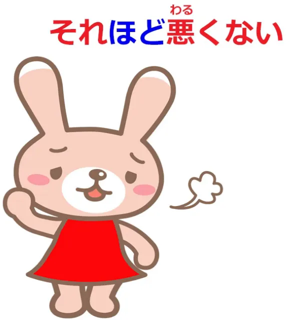
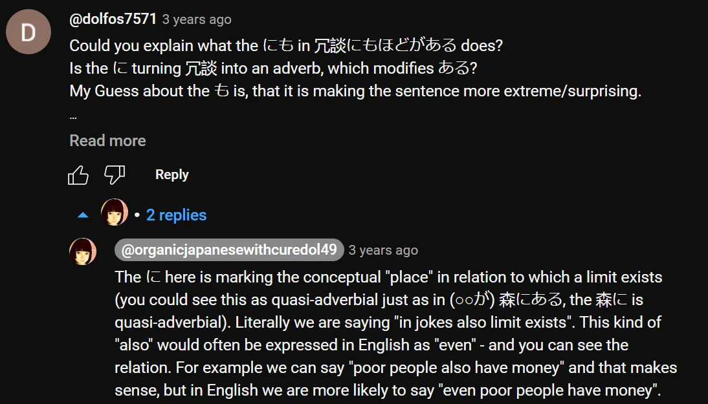
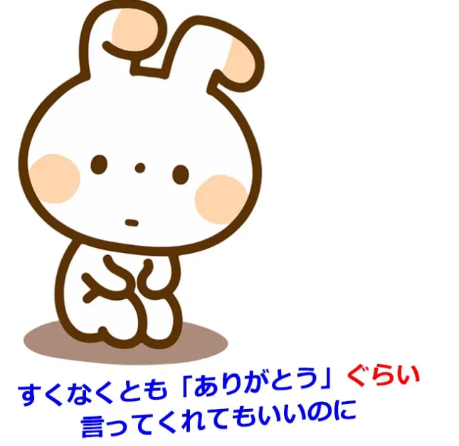

# **94. くらい VS ほど**

[**&quot;くらい&quot; (kurai) VS &quot;ほど&quot; (hodo): Arti dan alasannya.**](https://www.youtube.com/watch?v=6PEQTcDnbBk&amp;ab;_channel=OrganicJapanesewithCureDolly)

こんにちは。

Hari ini kita akan membahas dua kata yang sering membuat orang kesulitan dan bingung saat belajar bahasa Jepang secara imersi, karena keduanya sering kali tidak dijelaskan dengan jelas, sehingga terkadang sulit untuk memahami apa sebenarnya yang dimaksud.

**Kedua kata tersebut adalah <code>くらい</code> dan <code>ほど</code>.**

Sekarang, saya telah menerima banyak permintaan untuk <code>くらい</code>, baik di sini maupun di Patreon saya, dan cukup banyak permintaan untuk <code>ほど</code>. Dan saya akan membahas keduanya secara bersamaan karena menurut saya keduanya dapat saling menjelaskan satu sama lain. Dan sebelum kita mulai, saya hanya ingin mengatakan bahwa jika ada kata-kata yang membuat Anda kesulitan, menghambat pemahaman Anda saat belajar bahasa, silakan tulis di kolom Komentar di bawah dan saya akan membalasnya segera atau menambahkannya ke daftar hal-hal yang perlu saya bahas.

---

Baiklah, jadi, <code>ほど</code> dan <code>くらい</code>. **Keduanya adalah kata benda, tentu saja.**

**Hampir semua hal dalam bahasa Jepang yang bukan kata kerja atau kata sifat, seperti yang kita ketahui, pada dasarnya adalah kata benda atau entitas yang mirip kata benda.**

Jadi, apa itu <code>ほど</code>? Apa itu <code>くらい</code>?

**Keduanya mewakili luas atau jumlah dari... apa pun: waktu, uang, jarak, dll.**

**Namun, perbedaan utama di antara keduanya adalah bahwa <code>ほど</code> cenderung menyiratkan bahwa jumlah atau derajat yang terlibat itu besar,**

---

**dan <code>くらい</code> baik menandainya sebagai tak tentu, sebagai sesuatu yang kita tidak yakin, atau dalam beberapa kasus yang akan kita bahas nanti, bahwa jumlahnya kecil, bahwa jumlahnya kurang dari yang mungkin kita harapkan atau inginkan.**

Jadi, untuk menggambarkan perbedaan ini, mari kita lihat keduanya dalam konstruksi yang sangat sederhana. **<code>これくらい</code> berarti: sekitar sebanyak ini, sekitar sebanyak ini, sekitar sejauh ini, sekitar secepat ini,  
sekitar suhu ini, apa pun.**

**<code>これほど</code> berarti: sebanyak ini, sebanyak ini, sepanas ini, sedingin ini, tetapi menekankan bahwa ini dalam skala besar, dalam derajat yang besar.**

## ほど

Jadi, jika kita mengatakan <code>**これほど悪い**とは思わなかった</code>, kita berarti mengatakan, <code>I didn&#x27;t think it was **this bad**</code>.

**Jadi, <code>これ</code> (ini) yang memodifikasi <code>ほど</code> tidak hanya mengatakan <code>this bad</code>, tetapi juga menyatakan bahwa <code>this bad</code> sangat banyak, ini lebih dari yang mungkin kita harapkan atau inginkan.**

**Secara negatif**, jika kita mengatakan <code>**それほど**悪くない</code>, kita mengatakan <code>it&#x27;s not **that** bad</code>.

Sekarang, **apa yang <code>それ</code> yang dimaksud dalam kasus seperti ini?**

**Bisa jadi merujuk pada sesuatu yang sudah kita sebutkan sebelumnya, pada tingkat atau sejauh mana yang sudah kita bahas,** tetapi juga, sama seperti dalam bahasa Inggris, **<code>それ</code> (atau <code>that</code>) bisa berarti jumlah yang mungkin sudah kita perkirakan.**

---

**Jadi, sekali lagi, hal yang memodifikasi <code>ほど</code>, <code>それ</code>, mewakili jumlah yang besar, batas atas, dan kemudian kita berada di bawah batas atas yang ditandai oleh <code>ほど</code>.**

Jadi, <code>**それほど**悪くない</code> berarti <code>not **that** bad</code> — **baik tidak seburuk itu** seperti yang telah kita bahas atau seperti yang tersirat dalam percakapan, **atau sekadar <code>not that bad</code>**, yang berfungsi persis sama seperti dalam bahasa Inggris — **kata <code>that</code> ketika tidak ada titik acuan, itu hanya berarti apa yang mungkin kita harapkan atau apa yang mungkin terjadi.**

Jadi, jika kita mengatakan dalam bahasa Inggris <code>it&#x27;s not that bad</code>, yang kita maksud adalah **itu tidak terlalu buruk, tidak seburuk yang mungkin terjadi.**

---

Dan hal yang sama berlaku untuk <code>**それほど**悪くない</code>. **Jika kita tidak merujuk pada sesuatu yang spesifik dan terdefinisi <code>that</code>, maka yang kita maksud adalah <code>it&#x27;s not **very** bad / it&#x27;s not **all that** bad</code>.**

Dan sekali lagi, **<code>ほど</code> sering digunakan untuk menandai satu sisi perbandingan, dan sekali lagi <code>ほど</code> mewakili sisi yang lebih besar, batas atas.**

Jadi jika kita mengatakan <code>私は彼女**ほど**若くない</code> kita mengatakan <code>I&#x27;m not **as** young **as** she is</code>,

Saya tidak muda **sejauh** dia, dan **tingkat kemudaan** dia adalah **tingkat yang lebih tinggi** **dan oleh karena itu itulah yang memodifikasi <code>ほど</code>.**

### ほど sebagai kata benda

Sekarang, **<code>ほど</code> dapat digunakan sebagai kata benda yang hampir mandiri yang mewakili batas atas dari sesuatu.**

Jadi, jika kita mengatakan <code>不可能**なほど**</code>, kita berarti (<code>不可能</code>: <code>可能</code> berarti mungkin; <code>不可能</code> berarti tidak mungkin) <code>不可能な**ほど**</code> berarti **batas atas** ketidakmungkinan.

**Ini bukan hanya <code>不可能</code>, bukan hanya mustahil, melainkan <code>ほど</code> dari <code>不可能</code>, ini adalah batas atas <code>不可能</code>, ini adalah puncak ketidakmungkinan.**

Atau <code>不快**なほど**失礼</code> — <code>不快</code> adalah tidak menyenangkan, tidak disukai; <code>失礼</code>, tentu saja, adalah ketidakramahan. Ini adalah ketidakramahan **hingga batas atas** ketidaknyamanan / ketidaksukaan.

---

Dan inilah **<code>ほど</code>adalah tempat kita menggunakan kata benda yang berfungsi sebagai kata sifat dan menambahkan <code>なほど</code>** — **batas atas dari kata benda yang berfungsi sebagai kata sifat tersebut, menggunakan kata benda tersebut untuk memodifikasi <code>ほど</code>** — **seringkali cenderung hal-hal negatif tetapi bisa juga lebih netral,** misalnya, kita mungkin mengatakan <code>不思議**なほど**</code> — **batas tertinggi dari** keanehan, benar-benar aneh.

::: info
Frasa di atas tampaknya merupakan ungkapan yang juga bisa berarti <code>wondrous/marvellous</code>
:::

**Dan ungkapan lain yang sering digunakan dengan <code>ほど</code> adalah <code>ほどがある</code>, dan ini benar-benar berarti ada batas atas.**

**Dan ini biasanya digunakan saat mengeluh tentang sesuatu.**

Jadi kita mengatakan <code>冗談にも**ほどがある**</code>, yang secara harfiah berarti bahkan lelucon **memiliki batas atas**, dan yang biasanya dimaksudkan adalah, apa yang kamu katakan / apa yang kamu lakukan **melampaui** batas lelucon.

Lelucon memiliki **batas atas** dan kamu telah melewatinya. <code>バカにも**ほどがある**</code> (kebodohan **memiliki batas atas**), yang sedikit mirip dengan mengatakan, <code>Even you can&#x27;t be that stupid</code> atau Anda telah melewati **batas atas** kebodohan.

### ほど untuk membuat perbandingan

**Dan mungkin penggunaan paling umum dari <code>ほど</code>,** yang mungkin akan kamu lihat sepanjang waktu, **adalah penggunaannya dalam membentuk perbandingan.**

Sekarang, **ada berbagai jenis perbandingan dalam bahasa Jepang, tetapi <code>ほど</code> digunakan khususnya ketika kita menekankan sifat ekstrem dari sesuatu.**

**Ini sering digunakan untuk perbandingan yang pada dasarnya merupakan hiperbola, tetapi menekankan bahwa sesuatu itu benar-benar seperti apa yang kita katakan.**

Jadi, kita mungkin mengatakan, <code>死ぬ**ほど**暑い</code> (panas **sampai-sampai** bisa mati); <code>肌を刺す**ほど**寒い</code> (dingin **sampai-sampai** menusuk kulit);

<code>信じられない**ほど**美しい景色</code> (pemandangan yang indah **sampai-sampai** tak terbayangkan).

---

**Dan ini <code>ほど</code> yang digunakan untuk hiperbola, untuk tujuan sastra, hanya untuk menekankan suatu poin dengan sangat kuat, mungkin adalah <code>ほど</code> yang akan Anda temui lebih sering daripada yang lain.**

**Ini adalah penggunaan yang sangat umum dari <code>ほど</code>.**

## くらい

Jadi, mari kita lihat <code>くらい</code>. **<code>くらい</code> paling sering digunakan untuk perkiraan.**

Jadi kita mungkin mengatakan, <code>到着するのは八時**ぐらい**です</code> — kita mengatakan bahwa kita akan tiba **sekitar** pukul delapan.

<code>八百円**ぐらい**です</code> (harganya **sekitar** delapan ratus yen). Dan ini sangat jelas.

::: info
&quot;くらい&quot; seperti yang dapat Anda lihat terkadang berubah bunyinya menjadi &quot;ぐらい&quot; dalam beberapa frasa.
:::
*Mengenai waktunya, tampaknya hal itu tidak lagi sejelas sebelumnya, seperti yang dapat dibaca [**di sini**](https://japanese.stackexchange.com/questions/433/is-there-a-rule-for-when-to-use-%E3%81%8F%E3%82%89%E3%81%84-vs-%E3%81%90%E3%82%89%E3%81%84). Namun, tidak perlu terlalu khawatir.*

**Kita menggunakannya setiap kali ingin membicarakan jumlah, derajat, atau tingkat, dan membuatnya terdengar samar, untuk menegaskan bahwa kita tidak membicarakan jumlah atau derajat yang tepat.**

---

**Dan satu-satunya hal yang perlu diingat di sini adalah bahwa terkadang orang Jepang akan menggunakan ini meskipun sebenarnya hal yang dimaksud itu pasti.**

Jadi, misalnya, kita mungkin berkata, <code>どの**くらい**掛かりますか?</code> (**tentang** berapa biayanya?) **Dan kita mungkin meminta perkiraan, jika itu jenis hal di mana Anda meminta perkiraan, tetapi kita juga mungkin menanyakan harga dalam kasus di mana kita mengharapkan penjual mengetahui harga yang tepat, namun entah mengapa terasa sedikit kurang mendesak untuk menanyakan harga perkiraan daripada harga yang tepat.**

---

**Dan orang-orang juga terkadang melakukan hal ini saat membicarakan waktu kedatangan atau... apa pun.**

**Dan ini sebagian karena orang Jepang pada umumnya sangat teliti, jadi jika mereka merasa ada kemungkinan waktu atau fakta apa pun sedikit berbeda dari yang mereka katakan, rasanya lebih aman untuk membuatnya sedikit kabur agar tidak terikat pada sesuatu yang pasti yang mungkin tidak benar-benar terjadi.**

### &quot;くらい&quot; sebagai bentuk yang sedikit dari sesuatu = <code>at least</code>

Sekarang, **penggunaan lain dari <code>くらい</code> (atau <code>ぐらい</code>)**, seperti yang saya sebutkan sebelumnya, **berbicara tentang suatu cakupan dan menekankan bahwa cakupan tersebut adalah yang kita anggap kecil, bukan yang besar yang <code>ほど</code> diimplikasikan.**

Jadi, jika kita mengatakan <code>今日**くらい**家族と過ごそう</code>, kita berarti <code>Today, **at least**, let&#x27;s spend as a family</code>.

**Dan hal itulah <code>くらい</code> yang memberikan <code>at least</code> makna.**

**Hal ini menunjukkan bahwa ketika kita mengatakan <code>today</code> kita tidak hanya mengatakan <code>today</code>, kita menyiratkan bahwa mungkin kita tidak banyak menghabiskan waktu sebagai keluarga, mungkin kita tidak akan bisa menghabiskan waktu sebagai keluarga lagi, tapi setidaknya hari ini mari kita habiskan waktu sebagai keluarga.**

#### くらい sebagai ungkapan keluhan

**Dan seringkali ungkapan ini <code>くらい</code> digunakan ketika seseorang mengeluh tentang sesuatu dan ketika seseorang sebenarnya mengatakan bahwa tidak hanya <code>くらい</code> kecil, tetapi bahkan yang kecil <code>くらい</code> tidak muncul.**

**Dan ketika digunakan seperti itu, ungkapan ini sering disertai dengan <code>at least</code> seperti <code>少なくとも</code> atau <code>せめて</code>, dan sering diakhiri dengan penanda penyesalan seperti <code>のに</code>.**

---

Jadi, kita mungkin mengatakan, <code>少なくとも「ありがとう」**ぐらい**言ってくれてもいいのに</code>, yang secara harfiah adalah <code>at least **as little as** thank you if you kindly said would be good but...</code>

Dalam bahasa Inggris sehari-hari, kita mungkin akan mengatakan <code>You might at least say thank you</code>.

Yang kami maksud di sini adalah bahwa **sekecil apa pun** ucapan terima kasih, jika Anda berkenan mengatakannya, sudah cukup, **dan kami menambahkan <code>のに</code>, yang,** seperti [**sudah saya jelaskan di tempat lain**](https://www.youtube.com/watch?v=Au5JOtcwE7A), **sebenarnya adalah penghubung klausa kontrasif.**

**Penghubung ini digunakan untuk menghubungkan satu klausa logis dengan klausa lain guna membentuk kalimat lengkap dengan implikasi <code>but</code>bahwa klausa kedua agak bertolak belakang atau bertentangan dengan yang pertama, tetapi sering digunakan seperti ini sebagai penutup kalimat.**

Dan implikasinya di sini adalah, akan lebih baik jika Anda mengucapkan **sekadar** terima kasih, **tetapi** (Anda bahkan tidak melakukan itu).

Jadi, semoga ini memperjelas <code>くらい</code> dan <code>ほど</code>.
