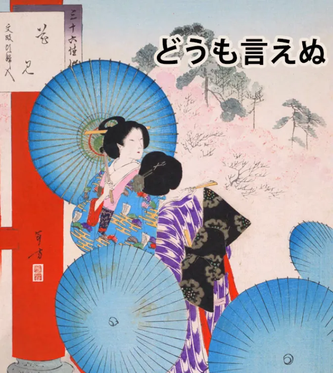
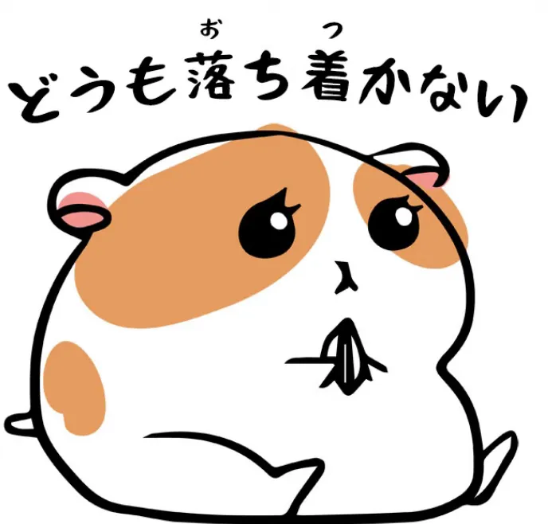
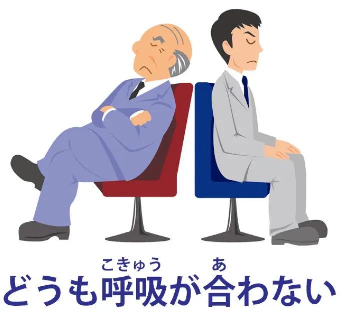
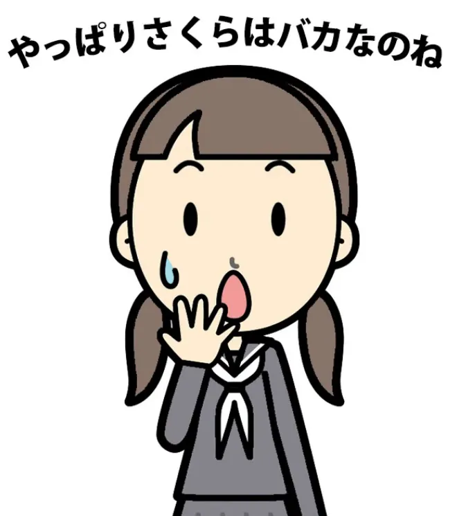
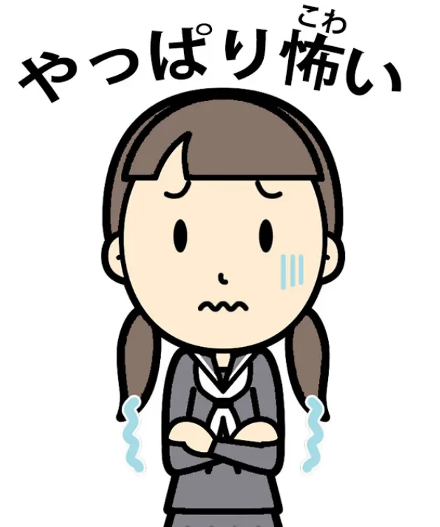
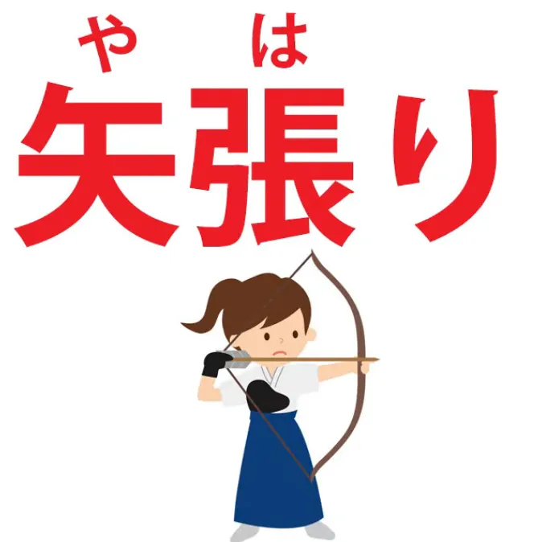
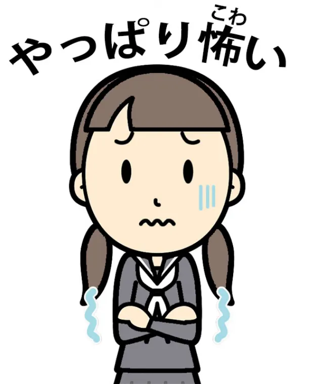
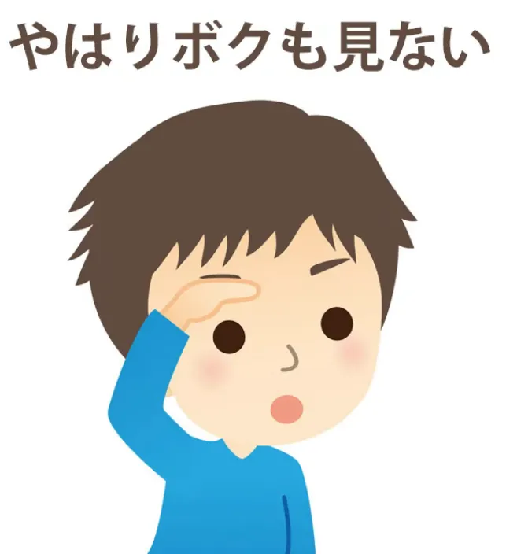
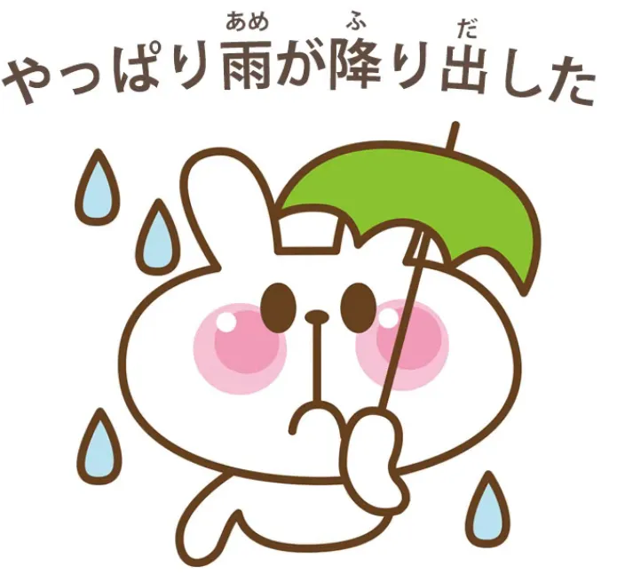
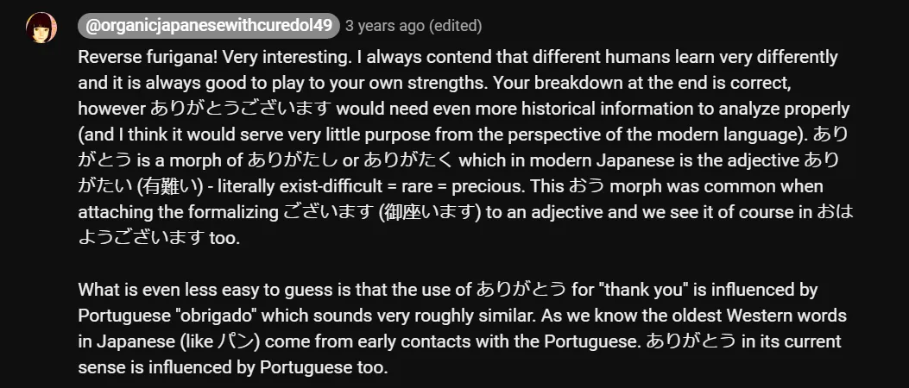

# **95. Memanfaatkan Riwayat Kata dengan Cerdasどうも、やっぱり、やはり

** 

[**Kosa Kata Mendalam - Menggunakan Sejarah Kata dengan Cerdasどうも

(doumo)、やっぱり

(yappari)、やはり

(yahari)**](https://www.youtube.com/watch?v=WUmByRnrx_U&amp;ab;_channel=OrganicJapanesewithCureDolly)

こんにちは。

Hari ini kita akan membahas pertanyaan yang kadang muncul karena saya mempelajari bahasa Jepang secara struktural, dan orang-orang kadang bertanya, **&quot;Apakah mengetahui sejarah bahasa dan asal-usul kata-katanya membantu dalam memahami struktur detail bahasa tersebut?&quot;**

Dan jawaban saya atas pertanyaan itu bersifat pragmatis, karena pendekatan saya secara keseluruhan memang pragmatis, dan jawabannya adalah, **<code>I would say most of the time no, but some of the time yes.</code>** Saya berasumsi bahwa sebagian besar orang yang menonton video ini ingin belajar menggunakan bahasa Jepang, membacanya, mendengarnya, mengucapkannya, dan menuliskannya, serta pada dasarnya tidak tertarik pada sejarah bahasa tersebut. **Jika kita tertarik pada sejarah bahasa, itu adalah masalah yang berbeda.**

**hanya dari sudut pandang penguasaan bahasa, hal itu hanya akan membebani pikiran kita dengan informasi yang sebenarnya tidak terlalu kita butuhkan.** **Namun, ada kalanya pengetahuan tentang sejarah bahasa menjadi sangat berguna dan ada kalanya teka-teki struktural tidak dapat sepenuhnya dipecahkan tanpa pengetahuan tersebut.** Dan saya akan mencoba memberi tahu Anda di mana hal itu terjadi dan memberikan informasi yang diperlukan.

**Ada juga saat-saat,** yang mungkin terdengar aneh, **ketika bukan sejarah bahasa yang sebenarnya, melainkan sejarah rakyat, atau gagasan etimologis yang sebenarnya tidak benar, justru bisa sangat berguna.**

Itu terdengar aneh, saya tahu, tapi mengapa demikian? Nah, itu karena **salah satu hal tentang sejarah bahasa dan mengapa seringkali tidak terlalu berguna adalah bahwa ia tidak memberitahu kita tentang bagaimana bahasa itu berfungsi sekarang, melainkan tentang bagaimana bahasa itu berfungsi beberapa ratus tahun yang lalu.** Dan kita tidak terlalu perlu tahu hal itu.

**Di sisi lain, etimologi rakyat, yaitu gagasan tentang asal-usul kata yang sebenarnya tidak benar secara historis, cenderung mewakili pandangan orang-orang masa kini tentang bagaimana bahasa tersebut benar-benar berfungsi saat ini.** **Dan karena etimologi rakyat ini berasal dari orang-orang yang berbahasa Jepang dalam lingkungan Jepang, etimologi tersebut cenderung dipengaruhi oleh pemahaman orang Jepang tentang bagaimana bahasa tersebut bekerja saat ini, bukan bagaimana bahasa tersebut bekerja di masa lalu, saat kata-kata tersebut terbentuk.**

Jadi, kita akan mengambil beberapa contoh, dan kita akan mulai dengan satu contoh di mana sejarah sebenarnya dari bahasa tersebut berguna bagi kita. Dan saya akan mengambil komentar dari Algirion-san yang berkomentar, *&quot;Salah satu kata yang sedikit membingungkan saya adalah **どうも**.* *Kata ini sering digunakan sebagai sapaan.* *Namun, saya membayangkan arti harfiahnya kira-kira &#x27;dengan cara apa pun&#x27;.* *Mungkin ini bukan masalah yang terlalu penting, tapi saya tetap penasaran bagaimana kata itu bisa menjadi **hello** dari sana.&quot;*

## どうも

Nah, ini pertanyaan yang menarik, dan sebenarnya bukan masalah yang terlalu penting ketika kita membicarakan arti-arti yang lebih umum dari <code>どうも</code>, ketika artinya <code>thank you</code> atau semacam itu. **Ini menjadi masalah yang lebih kritis ketika kita melihat arti lain yang dimilikinya yang tampaknya tidak terkait sama sekali tetapi sebenarnya tidak.**

---

**Ketika kita melihat di kamus, kita menemukan banyak definisi untuk <code>どうも</code>:**
terima kasih, terima kasih, banyak, sangat, dan juga hal-hal seperti entah bagaimana, terlepas dari diri sendiri, sekeras apa pun usaha seseorang, tidak peduli seberapa keras seseorang mencoba untuk melakukan atau tidak melakukan.

**Dan seperti yang Anda lihat, hal-hal tersebut tampaknya tidak ada hubungannya dengan makna yang lebih umum dari kata tersebut dan sangat membantu kita untuk mengetahui dari mana <code>どうも</code> sebenarnya berasal.**

Salah satu alasan saya mengutip komentar Algirion-san adalah karena dia sebenarnya sudah memahami strukturnya dengan benar. *<code>I imagine the literal meaning is along the lines of &#x27;in any way&#x27;.</code>* Dan memang begitu.

**Masalahnya di sini adalah bahwa kecuali kita tahu sedikit lebih banyak tentang sejarahnya, hal itu tidak akan membawa kita cukup jauh.**

---

**<code>どうも</code> sebenarnya bermula pada era Edo dan merupakan singkatan dari ungkapan <code>どうも言えぬ</code>.** **Dan itu berarti <code>in any way</code> — bagian <code>どうも</code> bagian berarti <code>in any way</code> — dan <code>言えぬ</code> berarti <code>unable to say</code>.**

Penegasan negatif - ぬ adalah sesuatu yang [**sudah saya bahas dalam video terbaru**](https://www.youtube.com/watch?v=E7Qop8dwP4w), jadi jika Anda belum mengetahuinya, saya akan menyertakan tautan di atas.

**Dan dalam sebagian besar penggunaan yang lebih umum, kata ini digunakan pada periode Edo bersama dengan kata <code>ほど</code>.** Dan saya juga baru-baru ini membuat video tentang <code>ほど</code> juga, jadi saya akan menyertakan tautannya.[[94]](./94- くらい -vs- ほど.md)

**Jadi, <code>どうも言えぬほど</code>:**

<code>どうも言えぬ</code> berarti <code>I&#x27;m not able in any way to say</code>; **<code>どうも言えぬほど</code> berarti <code>to the extent that I&#x27;m not able in any way to say</code>.**

---

**Dan sekarang kita mulai melihat bagaimana hal ini diterapkan pada penggunaan paling umum dari <code>どうも</code>.**

**<code>どうもありがとうございます</code> berarti bukan hanya <code>Thank you</code> tetapi <code>I&#x27;m thankful to a degree (ほど) that I am unable in any means to express / I&#x27;m inexpressibly grateful</code>.**

<code>**どうも**すみません</code>: <code>I&#x27;m **inexpressibly** sorry</code>.

**Tentu saja ini adalah hiperbola dan, seperti yang selalu terjadi pada hiperbola ketika mereka menjadi ungkapan baku dalam bahasa, hiperbola tersebut kehilangan banyak kekuatannya, sehingga pada akhirnya hanya berarti <code>very</code>.**

Jadi, <code>**どうも**すみません</code> (Saya **sangat** menyesal); <code>**どうも**ありがとうございます</code> (Terima kasih **sangat**).

---

**Dan ini melekat pada ekspresi himpunan dasar seperti 挨拶 hingga titik di mana ia dapat digunakan untuk menggantikan 挨拶 bahkan dalam kasus di mana tidak jelas apa 挨拶-nya.**

**Jadi kita dapat menggunakan <code>どうも</code> untuk menggantikan &quot;goodbye&quot; dan &quot;hello&quot; 挨拶.**

**Kita hanya mengatakan <code>very much</code>:** <code>I&#x27;m **very** happy to be seeing you</code>; <code>I&#x27;m **very much** looking forward to meeting again</code>. **Ini hanya menjadi semacam pengganti umum untuk &quot;挨拶&quot;.**

---

**Dan ini sangat berguna karena agak bersemangat, terdengar menyenangkan dan sopan, tidak terlalu formal, tidak terlalu informal, ini hanya ungkapan yang sangat berguna untuk digunakan sebagai pengganti &quot;挨拶&quot;.**

**Tentu saja, ungkapan ini menggantikan ungkapan lain di mana penggunaannya lebih masuk akal, sehingga kita bisa mengatakan <code>どうも</code> untuk <code>I&#x27;m sorry</code>, dan <code>どうも</code> untuk <code>thank you</code>.**

Jadi, inilah penggunaan yang lebih umum.

---

Sekarang, arti lain dalam kamus: entah bagaimana, terlepas dari kehendak sendiri, tidak peduli seberapa keras seseorang berusaha atau tidak berusaha — hal-hal semacam itu.

**Kita dapat melihat bahwa ini sebenarnya <code>どうも言えぬ</code> tanpa <code>ほど</code>.** Kita hanya mengatakan **<code>どうも言えぬ</code>** (Saya tidak bisa **dengan cara apa pun** mengungkapkannya).

Jadi jika kita mengatakan <code>**どうも**落ち付かない</code> (**entah bagaimana** saya tidak bisa tenang, tidak bisa menenangkan diri).

**<code>どうも</code> (entah bagaimana), yang aslinya <code>どうも言えぬ</code>:**
Aku tidak bisa **dengan cara apa pun** mengatakan alasannya, tapi aku tidak bisa tenang.

<code>**どうも**呼吸が合わない</code> (**entah kenapa** kami tidak cocok).

<code>Our breaths don&#x27;t come together</code>, secara harfiah.

**Entah kenapa** kita tidak cocok — saya tidak mungkin bisa menjelaskan mengapa, tapi **entah kenapa** memang begitu.

---

**Dan mulai saat itu, jika kita tidak bisa melakukan sesuatu atau akhirnya tidak melakukannya, dan tidak peduli seberapa keras kita mencoba melakukannya atau tidak melakukannya, hal itu tidak terjadi...**

<code>**どうも**言えぬ</code> (Saya tidak bisa mengatakan mengapa, **tapi memang begitulah adanya**).

**Jadi begitulah mengapa &quot;tidak bisa diungkapkan&quot; (どうも) memiliki rentang makna yang begitu luas.** Dan jika kita mengaitkannya kembali dengan konsep tidak bisa mengekspresikan sama sekali, kita bisa melihat bagaimana semuanya terjadi, dan menurut saya hal itu membuatnya jauh lebih mudah untuk dipahami dan ditangani.

## やっぱり / やはり

Sekarang, **satu hal yang akan kita bahas mengenai etimologi yang salah adalah <code>やっぱり</code>, yang juga menggunakan bentuk yang sedikit lebih formal <code>やはり</code>.**

**Ini mirip dengan <code>日本 / にほん</code>, yang juga bisa diucapkan sebagai <code>にっぽん</code>.** **<code>やはり</code> dapat diucapkan sebagai <code>やっぱり</code>.**

---

**Dan cara paling umum kita mendengarnya adalah dengan arti <code>just as we thought, just as we understood</code>.**

Jadi, jika Sakura melakukan sesuatu yang sangat konyol, kita mungkin akan berkata, <code>**やっぱり**さくらはバカなのね</code> (**Seperti yang kita duga**, Sakura itu bodoh).

Sekarang, **cara lain** yang sering kita dengar dalam imersi, anime, atau tempat lain, **adalah ketika sebuah perasaan muncul dalam diri kita dan sering kali mengubah pikiran kita.**

Jadi, misalnya, jika tokoh utama wanita kita melihat sebuah rumah yang menakutkan dan dia berkata, <code>Ooh, that&#x27;s really scary, I&#x27;m not going in there</code> lalu dia mengambil keputusan, menguatkan hatinya, dan berkata, <code>Right, I&#x27;m going in</code> (よし行くぞ) dan dia pun melangkah masuk, membuka pintu, melihat sekeliling, dan berkata <code>**やっぱり**怖い</code> *(Seperti yang diduga, (tempat ini) menakutkan)* dan memutuskan untuk tidak masuk juga.

Sekarang, apa yang terjadi di sini?

Kamus sekali lagi memberikan rentang arti yang cukup luas, beberapa di antaranya jarang kita dengar tetapi semuanya merupakan bagian dari arti kata tersebut, seperti **tetap, seperti sebelumnya, meskipun begitu, bagaimanapun juga, bagaimanapun juga, dan sebagainya.**

Bagaimana semua ini cocok dengan <code>やっぱり</code>?

Sekarang, ada etimologi populer untuk <code>やっぱり</code>.

<code>やっぱり</code> ditulis dalam kanji seperti ini.  
*(atau lebih tepatnya やはり karena situs tersebut tidak menyediakan opsi dengan やっぱり)*

**Jangan menuliskannya seperti ini karena Anda akan terlihat seperti orang yang telah mempelajari Heisig namun tidak tahu mana yang ditulis dalam kanji dan mana yang tidak.**

*Catatan: Ini memang saran yang bagus, karena salah satu hal dalam bahasa Jepang adalah mengetahui kapan suatu ungkapan memiliki bentuk Kanji yang sudah usang/tidak perlu yang umumnya tidak lagi digunakan di luar tulisan-tulisan tertentu dalam bahasa sehari-hari. Secara umum, setidaknya melalui keyboard Jepang, apa yang disarankan kepada Anda pertama kali kemungkinan adalah versi yang paling umum; ungkapan umum dan kata fungsi cenderung tidak menggunakan Kanji, dan menulis setiap kata dalam Kanji mungkin terlihat berlebihan. Anda akan terbiasa dengan kata-kata yang tidak cenderung menggunakan bentuk Kanji-nya seiring Anda semakin banyak membaca.*

*Meskipun demikian, beberapa penulis mungkin menggunakan bentuk Kanji yang sudah usang/berlebihan untuk meniru latar belakang kuno, dll.*

**Namun, inilah Kanji-nya: <code>やはり</code>.**

**Seperti yang Anda lihat, ada panah dan ada kanji untuk meregangkan, mengencangkan, atau mengencangkan.**

---

**Dan kanji-kanji ini sebenarnya bukanlah kanji aslinya dan tampaknya hanya digunakan untuk bunyinya.**

**Jadi, etimologi populer di sini tidak akurat secara historis.**

Namun, yang dimaksud adalah bahwa kanji-kanji ini, yang digunakan untuk menarik panah dengan kencang pada busur — apa yang terjadi saat kita menarik panah dengan kencang pada busur?

Nah, pada titik ini kita sedang fokus, bukan, pada sasaran. Dan dalam panahan Zen — dan panahan Jepang cukup didasarkan pada Zen — kita seharusnya tidak melihat apa pun selain sasaran itu.

Sekarang, misalkan kita teralihkan. Misalkan kita melihat sekeliling, melihat sesuatu, mendengar suara gemerisik, atau seseorang berbicara kepada kita.

**Jika kita adalah pemanah yang baik, segera setelah itu kita kembali ke <code>やはり</code>, sasaran busur yang ditarik kencang di mana kita tidak melihat apa pun selain itu.**

**Jadi, intinya adalah kembali ke fokus awal kita.** Inilah yang kita maksud ketika membicarakan Sakura.

**Kita selalu menganggap dia bodoh, dan <code>やっぱり</code> dia memang bodoh.**

**Hal ini juga berlaku untuk perasaan, yang dalam arti tertentu merupakan fokus yang lebih kuat daripada pikiran.**

Jadi, **jika pada awalnya ada sesuatu yang terasa menakutkan, lalu kita memutuskan untuk pergi dan menghadapinya, dan ketika kita sampai di sana, <code>やっぱり</code> itu memang menakutkan, kita ditarik kembali ke fokus awal kita.**

**Sekarang, apa yang kita lakukan tentang hal ini tergantung pada kita.** **Kita mungkin memutuskan untuk tidak masuk; kita mungkin memutuskan untuk masuk.** **Tapi bagaimanapun juga, kita telah ditarik kembali ke <code>やっぱり</code>, fokus awal itu.**

---

Lalu bagaimana dengan definisi kamus lainnya ini?

**Seperti yang sering terjadi pada definisi kamus bahasa Inggris, hal-hal ini sebenarnya tidak <code>やはり / やっぱり</code> benar-benar memiliki arti yang begitu mendalam, melainkan ungkapan-ungkapan dalam bahasa Inggris yang spektrum maknanya tumpang tindih dengan makna <code>やはり</code> pada titik-titik tertentu.**

---

Jadi, **ketika kita mengambil kata-kata <code>either</code> dan <code>also</code>,** yang sebenarnya memiliki arti yang sama **dalam konteks tertentu** dalam bahasa Inggris... **Hanya saja bahasa Inggris menggunakan satu kata untuk bentuk negatif dan kata lain untuk bentuk positif, sedangkan bahasa Jepang tidak.**

Jadi, misalnya, jika kita mengatakan <code>やはり...</code> (dan dalam kasus seperti ini biasanya <code>やはり</code>) <code>**やはり**僕も見ない</code> (Saya juga tidak melihatnya **sama sekali**).

Apa yang <code>やはり</code> yang ada di sana?

**Tentu saja kita tidak mengatakan <code>I didn&#x27;t see it either</code> kecuali orang lain telah mengatakan bahwa mereka tidak melihatnya.**

**Jadi yang kita lakukan di sini adalah kembali ke fokus awal percakapan:**

A: &quot;Kamu tidak melihatnya?

B: Ya.. (menekankan poin dengan mengatakan bahwa kita kembali ke fokus itu)  
Aku juga **tidak** melihatnya.&quot;

---

<code>僕も**やはり**行きました</code> (Aku juga pergi / Aku **juga** pergi).

Sekali lagi, **orang lain telah mengatakan bahwa mereka pergi dan kita menekankan kalimat pembuka (も) dengan mengatakan <code>やはり</code>**, **kembali ke fokus awal bagian percakapan ini, yaitu fakta bahwa kamu pergi,** <code>well, ****やはり**** — **original focus** — I went **too**.</code>

---

Dan ini bisa digunakan untuk konsep-konsep yang bahkan melampaui apa yang dijelaskan kamus.

Misalnya, **ini bisa berarti <code>predictably</code>:**

<code>**やっぱり**雨が降り出した.</code>

Sekarang, **dalam kasus ini kita mungkin tidak secara khusus berpikir bahwa akan turun hujan, tetapi yang kita katakan adalah, ya, semua orang tahu bahwa hujan turun pada kesempatan-kesempatan seperti ini.**

Jadi, **kembali ke apa yang mungkin menjadi fokus awal kita, jika kita memilikinya,** <code>**やっぱり**雨が降り出した</code> atau seperti yang mungkin Anda katakan dalam bahasa Inggris, <code>**Just as you might have expected**, it rained</code>.

---

Jadi, semoga ini membantu dalam memahami kata-kata yang sangat umum ini.

Dan **untungnya, menurut saya, tidak terlalu sering kita perlu mengetahui informasi historis di luar struktur biasa sebuah kata untuk memahaminya.**

Tapi jelas ada kasus-kasus, **terutama dengan ungkapan yang diambil dari peribahasa dan hal-hal semacam itu, di mana mengetahui peribahasanya membantu, dan dalam beberapa kasus dengan kata-kata sebenarnya seperti ini di mana mengetahui <code>どうも</code> artinya yang asli.**

**Dan dalam kasus <code>やっぱり</code>, ini adalah konsep yang sebenarnya tidak kita miliki dalam bahasa Inggris, yaitu konsep yang berfokus pada makna asli, dan meskipun ini adalah etimologi rakyat, bukan etimologi historis, hal ini benar-benar membantu kita memahami bagaimana orang Jepang memandang dan memahami ungkapan tersebut.**

::: info
Seperti biasa, Anda dapat memeriksa [**komentar**](https://www.youtube.com/watch?v=WUmByRnrx_U&amp;ab;_channel=OrganicJapanesewithCureDolly) video ini untuk beberapa hal menarik.

:::
