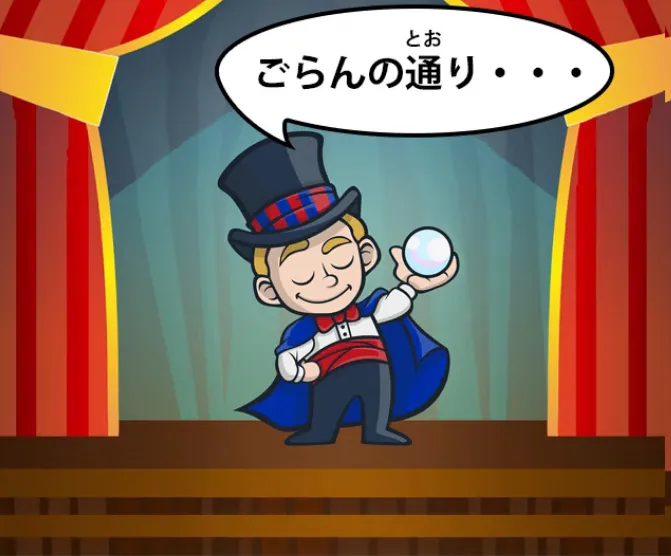
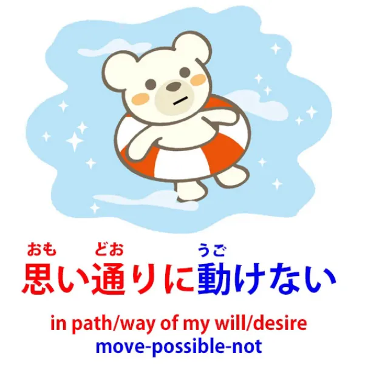
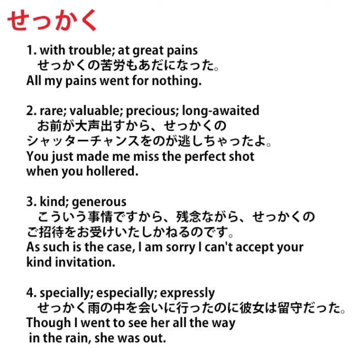
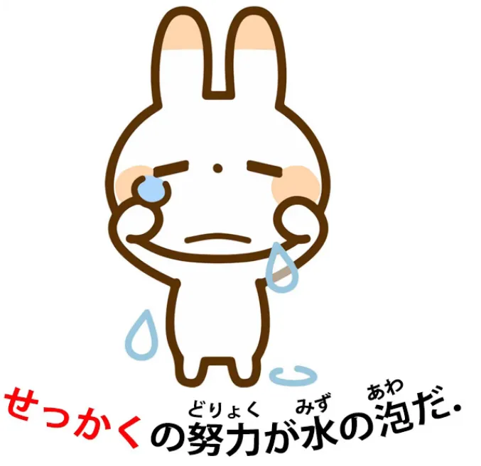
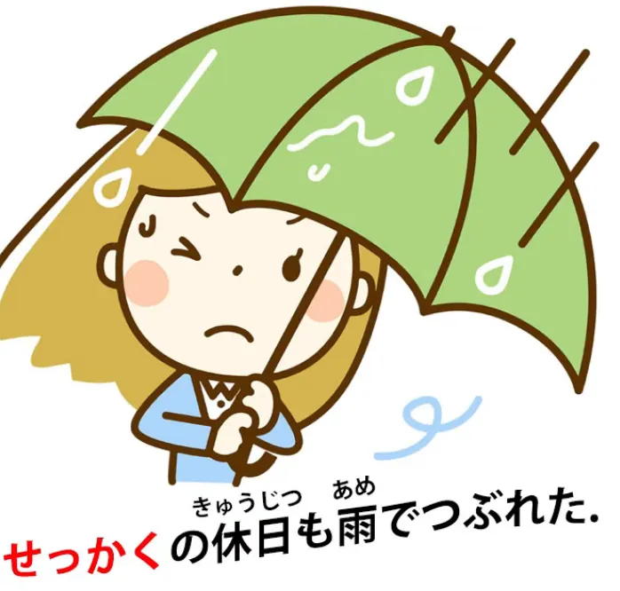

# **96. 通り dan せっかく: Sebuah jalan metaforis dan sebuah kata yang tak dapat diterjemahkan.**

[**通り dan せっかく: Sebuah jalan metaforis dan sebuah kata yang tak terjemahkan.**](https://www.youtube.com/watch?v=G3qc0esEbvE&amp;ab;_channel=OrganicJapanesewithCureDolly)

こんにちは, dan selamat datang di 令和三年 *(2021)*.

Kurang dari dua tahun yang lalu *(video ini dari tahun 2021)* era Reiwa dimulai *(2019)* dengan gelombang harapan akan era baru yang indah. Kemudian datanglah Reiwa 2 *(2020)*, yang dengan cepat berubah menjadi tahun yang cukup bencana. Itu seharusnya menjadi tahun Olimpiade Tokyo, dan kita semua tahu apa yang terjadi pada acara tersebut.

Namun, saya tetap percaya bahwa Reiwa akan menjadi era baru yang indah dan mungkin 令和三年 akan mulai menunjukkan hal itu kepada kita. Hari ini kita akan membahas dua kata yang baru-baru ini ditanyakan kepada saya.

## 通り 

**Yang pertama adalah <code>通り</code> dalam penggunaannya bersama kata-kata lain.**

**<code>通り</code> tentu saja, jika berdiri sendiri, merupakan akar kata &quot;い&quot; dari A-stem <code>通る</code> (melewati).**

**Dan sebagai kata benda, artinya jalan atau jalur, atau tindakan melewati.**

### その通り

**Kemudian kata ini digunakan dalam ungkapan seperti <code>その通り</code>** dan arti harfiahnya adalah **<code>that road, or that way of travelling, that way of passing through</code>**.

**Dan yang sebenarnya dimaksud adalah <code>that&#x27;s right / you&#x27;re absolutely right</code>.**

Bagaimana bisa memiliki arti seperti itu?

**Sebenarnya, ungkapan ini menyatakan bahwa cara berpikir Anda, jalan, jalur, atau lintasan yang Anda tempuh dalam berpikir, adalah yang benar: <code>その通り</code>.**

Sedikit mirip dalam bahasa Inggris dengan mengatakan <code>you&#x27;re on the right track</code>, kecuali bahwa <code>you&#x27;re on the right track</code> dalam bahasa Inggris akan menyiratkan bahwa Anda belum sepenuhnya sampai di sana, **tetapi <code>その通り</code> berarti Anda berpikir tepat di jalur yang benar, Anda sudah sampai, Anda mengerti, Anda benar.**

### ごらんの通り / ご覧の通り

**Ungkapan lain yang menggunakan <code>通り</code> adalah <code>ごらんの通り</code>.**

Nah, <code>ごらん</code> ketika ditulis dalam kanji, ditulis seperti ini.

::: info
御覧 adalah versi Kanji lengkap dari ごらん, bahkan dengan bentuk hormat &quot;ご&quot; dalam bentuk Kanji, tetapi menggunakan Kanji secara berlebihan untuk segala hal juga tidak terlalu praktis, namun hal ini tergantung pada kata-kata dan penggunaannya.
:::
Jadi **Anda dapat melihat bahwa <code>ご</code> adalah bentuk hormat; <code>覧</code> sebenarnya adalah cara lain untuk menulis kata <code>見る</code>.**

Sekarang, [**saya membuat video**](https://www.youtube.com/watch?v=6Kh1AJx77Ng) beberapa waktu lalu tentang kata <code>見る</code> (melihat atau menonton) dan lima kanji berbeda yang dapat digunakan untuk menuliskannya.

*見る, 観る, 看る, 診る, 視る*

**Dan saya katakan saat itu bahwa sebenarnya ada lebih banyak lagi.** Saya tidak memperkenalkannya karena tidak terlalu umum, dan yang ini *(覧る)* juga bukan cara penulisan yang umum <code>見る</code> juga.

Namun, dengan cara membacanya <code>らん</code> , kata ini digunakan, dan **<code>ごらん / ご覧</code> merupakan cara yang sopan untuk mengatakan <code>the act of looking or seeing</code>.**

**Jadi <code>ご覧の通り</code>, mirip dengan <code>その通り</code>**, berarti **<code>as you can see / along the lines of your seeing is correct</code>,** sama seperti apa yang Anda katakan atau pikirkan itu benar.

**<code>ご覧の通り</code> (seperti yang Anda lihat).**

### 思い通り

**Ungkapan <code>通り</code> adalah <code>おもいどおり / 思い通り</code>.**

Sekarang, **di sini tentu saja kita menggunakan akar kata い -I-stem dari <code>思う</code>,** yang diterjemahkan sebagai <code>think</code> dalam bahasa Inggris **tetapi sebenarnya memiliki arti yang lebih luas, yaitu <code>feel</code>.**

**Namun <code>思い</code> sering kali juga berarti kehendak seseorang, keinginan seseorang,** dan saya menyebutkan hal ini dalam video sebelumnya[[42]](./42-basic-word-confusion- まま.md) ketika saya menjelaskan bagaimana **<code>思いのまま</code>** berarti **<code>in the unchanged condition of one&#x27;s will or desire</code>.** Dan saya akan menyertakan tautan untuk itu jika Anda tertarik untuk menelusurinya lebih lanjut.

**<code>思い通り</code> berarti <code>in the road, the track, the course of one&#x27;s will or desire</code>, jadi artinya membuat sesuatu berjalan atau menginginkan sesuatu berjalan sesuai dengan kehendak seseorang / sesuai dengan keinginan seseorang.**

---

**Dan itu bisa berupa apa saja, mulai dari keinginan egois hingga, misalnya saat Anda berada di air, ingin tubuh Anda bergerak sesuai dengan cara yang Anda inginkan,** yang tidak selalu terjadi saat Anda berada di air.

## せっかく

**Sekarang, kata lain yang sering ditanyakan kepada saya adalah <code>せっかく</code>.**

Sekarang, <code>せっかく</code> memiliki berbagai definisi jika Anda melihat di kamus.

**Kata ini didefinisikan sebagai &quot;dengan kesulitan, susah payah; langka, berharga, istimewa, dinanti-nantikan; baik hati, dermawan; khusus, secara tegas&quot;,** yang merupakan banyak sekali makna untuk satu kata.

**Namun pada dasarnya semuanya bermuara pada hal yang sama, yaitu gagasan bahwa sesuatu itu berharga dan dalam arti tertentu tak tergantikan.**

### せっかく sebagai <code>do x with great effort / trouble and is too precious to replace</code>

Sekarang, **mungkin implikasi yang paling umum adalah bahwa banyak kesulitan telah dihabiskan untuk hal tersebut.**

Jadi, jika kita mengatakan <code>せっかくの努力が水の泡だ</code>, **kita sebenarnya <code>My **せっかく** efforts have come to nothing</code>,** secara harfiah <code>...are foam on the water / bubbles on the water</code>.

Jadi kita bisa melihat bahwa jelas ini adalah penggunaan yang paling umum, penggunaan yang mungkin paling sering dipikirkan orang, **yaitu <code>with great effort / with great trouble / having taken the effort (to do something)</code>.**

---

Kita mungkin mengatakan <code>**せっかく**東京に来た, we ought to go to Sanrio Puroland</code>,

**karena jika Anda sudah repot-repot pergi jauh-jauh ke Tokyo, akan sedikit sia-sia jika Anda tidak mengunjungi Sanrio Puroland** dan melihat Hello Kitty, My Melody, Pom Pom Purin, serta semua karakter menawan yang tinggal di sana, seperti Little Twin Stars.

**Jika suatu saat <code>せっかく</code> pernah ke Tokyo, Anda benar-benar harus pergi ke sana.**

---

Tapi kembali ke topik yang sedang dibahas.

**Namun, intinya <code>せっかく</code> bukan hanya tentang usaha yang mungkin telah dilakukan, melainkan fakta bahwa sesuatu itu langka, berharga, dan sulit digantikan.**

**Pergi ke Tokyo sulit digantikan karena begitu Anda pergi, Anda harus bersusah payah untuk kembali ke sana lagi.**

Namun, Anda mungkin juga berkata <code>**せっかく**の休日も雨で潰れた</code> (**<code>せっかく</code>** hari libur / hari istirahat itu rusak karena hujan).

**Dan itu <code>せっかく</code> karena hal itu relatif langka. Anda tidak mendapatkan banyak hari libur.**

Jadi, sama seperti pergi jauh-jauh ke Tokyo atau melakukan segala upaya untuk melakukan sesuatu, **itu <code>せっかく</code>, itu berharga, langka, dan sulit digantikan.**

<code>あの広告が**せっかく**の風景を損なう</code> (iklan-iklan itu / papan iklan itu merusak **<code>せっかく</code>** pemandangan).

**Dan sekali lagi, <code>せっかく</code> dalam hal ini tidak berarti kerja keras, tidak berarti kelangkaan dalam arti tidak sering terjadi, itu hanya berarti bahwa pemandangan itu adalah sesuatu yang indah dan unik serta tak tergantikan, dan sedang dirusak oleh papan iklan.**

---

**Dan sebenarnya tidak ada kata yang bisa menggantikan <code>せっかく</code> dalam bahasa Inggris.**

Ini adalah kata yang menurut saya dalam beberapa hal dipengaruhi oleh budaya Jepang. **Gagasan tentang betapa berharganya sakura** *(pohon)* karena **ia hanya mekar sebentar dan dengan cepat diterbangkan angin atau dihantam hujan.**

Kesedihan, kesementaraan, <code>儚い</code> sifat kehidupan, serta kebutuhan untuk menghargai apa yang langka dan berharga saat ia berlalu, selagi kita masih bisa.

::: info
Hal ini terasa sangat berbeda ketika kita menyadari bahwa Dolly meninggal dunia pada tahun itu… R.I.P. 🙁
:::
.
