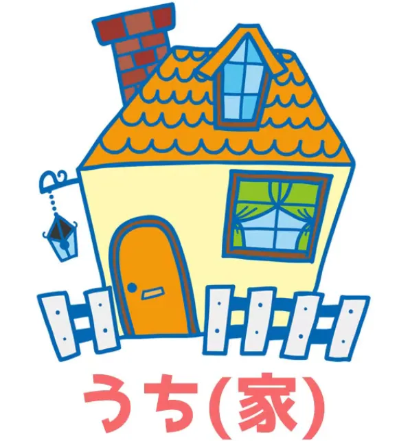
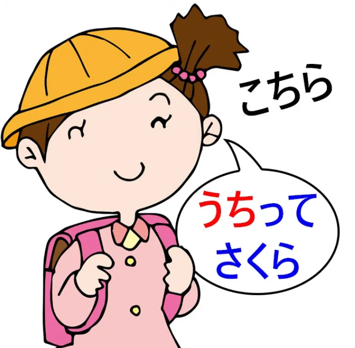
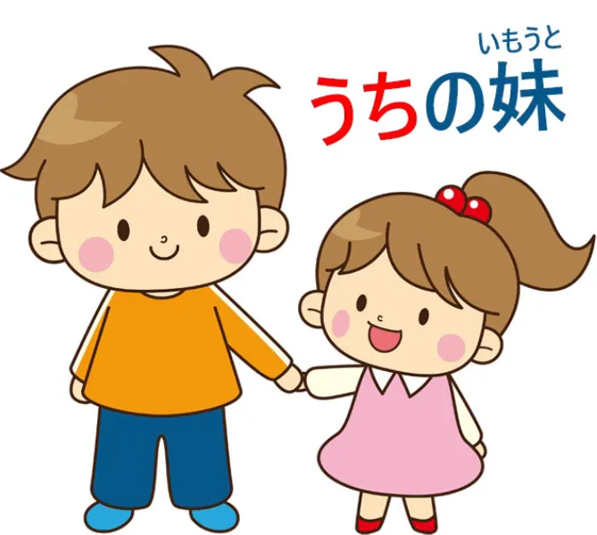
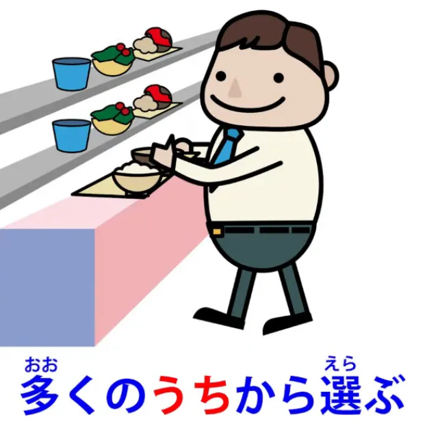
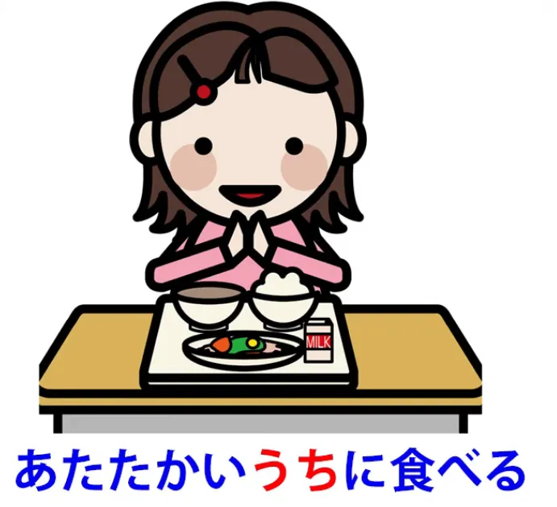
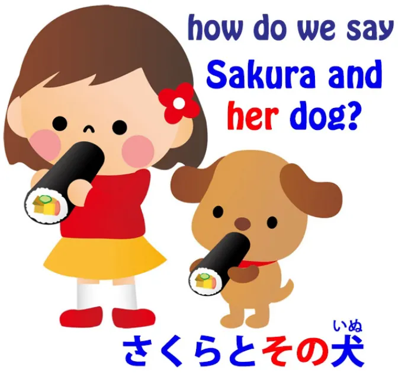
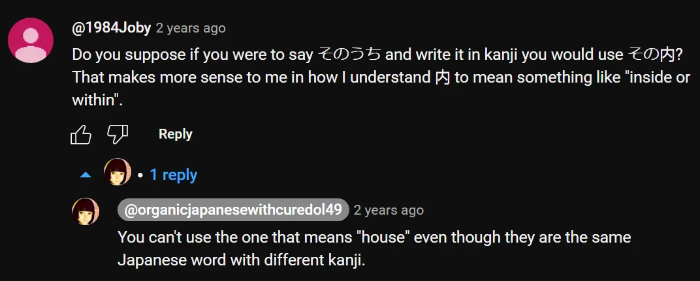

# **97. Makna-makna うち: Rumah, Diri, Batas sosial, Penanda waktu: いまのうち、そのうち**

[**Bahasa dan Budaya: Arti dari うち: Rumah, Diri, Batas Sosial, Penanda Waktu: いまのうち、そのうち**](https://www.youtube.com/watch?v=56sy0qfY0Js&amp;ab;_channel=OrganicJapanesewithCureDolly)

こんにちは。

Hari ini kita akan membahas sebuah kata yang memiliki daftar panjang definisi di kamus, banyak di antaranya tampaknya tidak ada hubungannya satu sama lain. Saya bahkan tidak akan membahas daftar ini. Kita hanya akan membahas kata tersebut dan arti sebenarnya, serta melihat bagaimana kata tersebut bisa memiliki begitu banyak makna tambahan.

**Kata tersebut adalah <code>うち</code> dan ini adalah salah satu kata yang Anda pelajari sejak awal dalam bahasa Jepang.**

**Mungkin konteks pertama di mana Anda mempelajarinya adalah bahwa ini adalah cara alternatif untuk mengucapkan kanji ini** *(家)*. **Bisa jadi <code>いえ</code> tetapi bisa juga <code>うち</code>, dan keduanya berarti <code>house</code>.**

**Ini adalah satu-satunya cara kita dapat menggunakan kanji ini.**

---

**Yang lain <code>うち</code> adalah ini - 内, dan saya rasa kita tidak seharusnya menganggapnya sebagai kata yang berbeda, karena ini adalah kata asli Jepang yang kemudian diberi kanji Tiongkok, dan seperti biasa, kanji tersebut sedikit membantu membedakan arti yang tepat.** Tapi hanya sedikit di sini.

---

Jadi, **ketika <code>うち</code> berarti <code>house</code> *(家)*, perbedaannya antara <code>いえ</code> dan <code>うち</code> adalah bahwa <code>いえ</code> merujuk pada bangunan fisik, rumah itu sendiri.** **<code>うち</code> merujuk pada apa yang mungkin Anda sebut sebagai bagian dalam spiritual dari rumah:** **keluarga, kehidupan yang berlangsung di dalam rumah.**

Dalam batas tertentu, kita dapat mengatakan bahwa hal ini agak mirip dengan perbedaan dalam bahasa Inggris antara kata-kata <code>house</code> dan <code>home</code>. **Jika kita mengatakan bahwa kita sedang mengunjungi rumah seseorang, kita biasanya mengatakan <code>うち</code> karena <code>house</code> dalam arti keluarga mereka, rumah mereka.** **Itulah yang kita kunjungi. Kita tidak mengunjungi bangunan fisiknya.**

Dan sebagai catatan kecil, **kadang-kadang Anda mungkin menemui ungkapan seperti <code>さくらんち</code>.** **Ini adalah singkatan yang sangat umum untuk <code>さくらのうち</code>.**

**Jadi, ini sebenarnya memberi kita dasar untuk semua makna lain dari <code>うち</code>,** apa pun kanji yang digunakan untuk menuliskannya: **gagasan tentang interior spiritual, sebuah ruang tertutup, yang didefinisikan, seolah-olah, oleh isinya.**

## うち sebagai arti <code>me</code> / 私 dll.

Nah, lain kali kamu menemui <code>うち</code> mungkin saat Anda menemui, dalam anime atau semacamnya, seorang gadis yang **menggunakan Kansai-ben**, **dan biasanya dia akan mengatakan <code>うち</code> bukan <code>私</code>.**

**Jadi <code>うち</code> dapat berarti <code>me</code>, khususnya feminin,** **khususnya dialek Kansai, meskipun tidak terbatas pada itu.**

---

**Dan ini sangat menarik karena cukup mirip dengan saat** **<code>こちら</code> digunakan untuk berarti <code>me</code>;** **sekali lagi, yang <code>こちら</code> berarti <code>this side (the side that includes me)</code>.**

Dan hal ini benar-benar harus dipahami dalam konteks fakta bahwa **perbedaan antara individu dan keluarga atau kelompok tempat individu tersebut berada jauh lebih samar dalam bahasa Jepang dibandingkan dalam budaya Barat, dan di masa lalu bahkan lebih samar daripada sekarang.**

---

**Ketika orang Jepang berbicara tentang, katakanlah, <code>my little sister</code>, secara umum mereka tidak akan mengatakan <code>僕の妹</code> atau <code>私の妹</code>.** Mereka cenderung mengatakan <code>**うち**の妹</code> (adik perempuan dari **rumah kami** / adik perempuan dari **keluarga kami** / adik perempuan dari **kelompok kami**).

Dan bahkan <code>**うち**のきょう</code>, yang <code>the religion of **our house**, **our family**, **our group**</code>, **karena agama masih dalam banyak hal dianggap dalam bahasa Jepang sebagai sesuatu yang diwariskan, bagian dari kelompok keluarga seseorang,** **bukan sebagai keputusan atau komitmen individu.**

## うち vs そと

**Sekarang, dari sini kita mendapatkan perbedaan yang sangat mendasar dalam bahasa Jepang,** **yaitu antara konsep <code>うち / 内</code> dan <code>そと / 外</code>.** **<code>うち</code> merujuk pada kelompok yang menjadi bagiannya, yaitu in-group;** **<code>そと</code> merujuk pada segala sesuatu di luar kelompok tersebut.**

Dan hal ini memiliki implikasi yang luas bagi budaya Jepang serta bahasa Jepang.

---

**Misalnya, kata-kata seperti <code>くれる</code> dan <code>あげる</code>, yang umumnya** **dijelaskan sebagai melepaskan sesuatu dari diri sendiri atau** **menerima sesuatu ke dalam diri sendiri,** **tidak terbatas secara ketat pada diri sendiri.**

---

**Sebenarnya, hal ini merujuk pada <code>うち</code>, yang bisa** **berarti diri sendiri tetapi juga bisa berarti kelompok tempat seseorang berada.** **Jadi, ketika kita berbicara tentang seseorang <code>くれる</code>-ing kepada saudara perempuan atau teman** **ini karena kita menganggap saudara perempuan atau teman tersebut sebagai bagian dari <code>うち</code>,** oleh karena itu ini adalah memberikan kepada <code>us</code>.

**Dan terkadang Anda akan melihat <code>くれる</code> digunakan bahkan di mana** **tidak ada hubungan yang ketat antara pembicara dan orang yang menerima,** **tetapi jika pembicara mengidentifikasikan diri dengan orang tersebut, menganggap mereka pada titik ini** **setidaknya sebagai lebih <code>うち</code> daripada <code>そと</code> itu <code>くれる</code> adalah tepat.**

---

Jadi kita dapat melihat bahwa konsep keseluruhan <code>うち / そと</code>, yang memiliki implikasi budaya yang luas yang tidak akan saya bahas, juga memiliki implikasi bagi struktur tata bahasa yang kita gunakan.

## うち digunakan untuk mendefinisikan kelompok yang x menjadi bagiannya

Sekarang, mengembangkan hal ini, **<code>うち</code> dapat digunakan untuk mendefinisikan sebuah kelompok di mana apa pun merupakan bagiannya.** Jadi kita dapat mengatakan <code>多くの**うち**から選ぶ</code>, yang berarti <code>choose from a large number</code> atau, secara ketat, <code>choose from **a group consisting** of a large number</code>.

**Jadi <code>うち</code> di sini merujuk pada kelompok dari mana seseorang memilih.**

---

**Dan hal ini bisa menjadi sedikit lebih abstrak dari itu.** **Ini bisa merujuk pada <code>うち</code> waktu, sebuah ruang waktu,** **dan sekali lagi, sebuah ruang yang didefinisikan oleh isinya.**

Jadi, kita mungkin mengatakan <code>温かい**うち**に食べる</code>, yang berarti <code>eat it **while** it&#x27;s warm</code>. <code>Eat it **while** it&#x27;s hot</code>, seperti yang akan kita katakan dalam bahasa Inggris. <code>**温かいうち**</code> adalah <code>うち</code>, **ruang tersebut, periode tersebut, di mana makanan masih hangat.**

Jadi **itu adalah ruang yang didefinisikan oleh isinya, seperti jenis-jenis <code>うち</code>.** **Kapan <code>うち</code> berakhir? Itu berakhir ketika makanan tidak lagi hangat.**

Demikian pula, <code>若い**うち**</code> (**selama** seseorang masih muda) — seseorang harus melakukan ini, melakukan itu, **selama** ia masih muda. ** <code>うち</code>, batas waktu, ditentukan oleh isinya.**

**Selama** seseorang masih muda, ia berada di dalam <code>若い**うち**</code>. **Ketika seseorang tidak lagi muda, di situlah batas-batas batasan tersebut terletak.**

### 今のうち

Dan **hal ini dapat meluas ke penggunaan yang mungkin sedikit membingungkan pada awalnya.** Jadi, misalnya, <code>**今のうち**</code>, yang merupakan frasa yang sering Anda dengar di anime dan sejenisnya. Misalnya, ketika musuh telah dilumpuhkan dan sekaranglah saatnya untuk melakukan pemurnian magis, seseorang mungkin akan berteriak <code>**今のうち**!</code>

Dan artinya secara harfiah adalah <code>**in the house of now** / **in the enclosure of now**</code>. **Itu tidak selalu berarti <code>this absolute instant</code>,** **tetapi artinya <code>while now continues</code>.**

---

Apa <code>now</code> dalam kasus ini? Nah, **<code>now</code> berarti situasi seperti apa adanya saat ini,** dalam hal ini, **selama** penjahat itu masih bisa diselamatkan, **selama** dia tidak berdaya, **selama** kita benar-benar bisa melakukan apa yang perlu kita lakukan.

Itu bisa berarti, **selama** kita masih bisa melarikan diri. Itu bisa berarti, **selama** Pintu Besar belum tertutup. Dengan kata lain, <code>**今のうち**</code> adalah <code>**while the circumstances that prevail at the moment continue to prevail**</code>.

**Begitu mereka tidak lagi berkuasa, kamu tidak akan lagi <code>今のうち</code>.**

### そのうち

Dan satu lagi yang mungkin tampak membingungkan adalah <code>そのうち</code>.

Sekarang, **<code>そのうち</code>** diterjemahkan sebagai berarti, dan memang berarti, **<code>sooner or later / at some time in the future / it will eventually happen / by and by</code>.** Jadi mengapa <code>そのうち</code> berarti demikian?

Untuk memahaminya, kita tidak hanya harus memahami <code>うち</code> tetapi kita juga harus memahami sedikit lebih banyak tentang <code>その</code>.

#### Apa arti &quot;その&quot;

Sekarang, saya telah membuat video[[75]](./75-japanese-is-not-english-how-expression-strategies-differ-polite- 英本語 -rude-japanese.md) di mana saya menjelaskan berbagai hal tentang penggunaan <code>その</code> dalam bahasa Jepang. **Kata ini sangat sering menggantikan apa yang dalam bahasa Inggris disebut kata ganti.** Jadi, jika kita mengatakan <code>さくらと**その**犬</code>, kita **tidak** mengatakan <code>Sakura and that dog</code>.

Kita mengatakan <code>Sakura and **her** dog</code>.

**<code>その</code> sering kali menyiratkan sesuatu yang berkaitan dengan apa yang sedang kita bicarakan.** **Dan ini adalah salah satu strategi yang digunakan** **mengingat fakta bahwa bahasa Jepang tidak terlalu sering menggunakan kata ganti.**

---

Penggunaan yang agak lebih abstrak adalah, misalnya, dalam definisi kamus seperti <code>**立ち会う**</code>, yang berarti <code>**be in a place as a witness**</code>, dan definisi dalam bahasa Jepang adalah <code>証人として**その**場に出る</code> yang berarti <code>as a witness, appear in **that** place, come out in **that** place</code>. **Tapi apa <code>that place</code> artinya dalam situasi ini?** **Apa <code>その</code> sebenarnya yang dimaksud?**

**Artinya, tempat apa pun itu, tempat yang sesuai dengan situasi saat ini.**

#### Jadi, apa arti dari &quot;そのうち&quot;?

Dan **inilah jenis <code>その</code> yang digunakan <code>そのうち</code>.** **<code>そのうち</code> selama rentang waktu yang sesuai** **dengan apa pun yang sedang kita bicarakan (itu akan terjadi).**

**<code>そのうち</code> berarti hal itu akan terjadi dalam rentang waktu** **yang wajar untuk hal itu terjadi,** yang mungkin terdengar sedikit samar, tetapi tidak lebih samar daripada ungkapan bahasa Inggris yang setara seperti <code>one of these days / sooner or later / before long</code>. **Ini sedikit lebih spesifik karena cenderung menyiratkan** **waktu yang tidak terlalu terlambat sehingga masih berguna.**

Jadi, inilah sebenarnya bagaimana <code>うち</code> makna ungkapan ini meluas dari makna yang cukup spesifik menjadi makna yang semakin abstrak, yang semuanya terkait erat dengan makna dasarnya.

::: info
**Jika Anda sudah sampai sejauh ini, saya mengucapkan terima kasih dan Anda luar biasa!**

*Akhirnya, kita telah sampai di akhir… butuh waktu sekitar 1,5 tahun untuk mengeditnya, jadi saya akan istirahat sebentar, tepat waktu untuk tahun 2024:D Meskipun saya kira nanti masih perlu memperbarui bagian 26-78.
Perjalanan yang cukup panjang memang (\*^ω^)八(⌒▽⌒)
Dolly memiliki total 204 video, jadi masih ada sekitar 100-an video, tapi sayangnya itu di luar jangkauan energiku saat ini, mungkin aku akan menambahkan beberapa video dari waktu ke waktu jika aku merasa ingin melakukannya jika aku menemukan cara yang bagus untuk menyalin subtitle dan semuanya (97 pelajaran ini sudah ada di sini sebelum saya menjadi editor).*

*Saya ingin menambahkan beberapa [****video imersi****](https://www.youtube.com/watch?v=xhEnMieHtec&amp;list;=PLg9uYxuZf8x_iLm90ie4ewro0lFedXncO&amp;ab;_channel=OrganicJapanesewithCureDolly) dan [****video penguasaan kosakata / kanji****](https://www.youtube.com/watch?v=3rT1zaHSmog&amp;list;=PLg9uYxuZf8x-W5kcce4zVNwK_JHjxHK5x&amp;ab;_channel=OrganicJapanesewithCureDolly) terutama, karena menurut saya video-video tersebut sangat berguna. Meskipun sekarang saya ingin fokus pada latihan menulis sebanyak-banyaknya.
Bagaimanapun, transkrip ini seharusnya sudah cukup mencakup hal-hal umum yang bisa Anda perkuat sendiri; pada tahap ini, dasar-dasarnya seharusnya sudah cukup kuat.*

*---
Teruslah berupaya dan konsumsi banyak sekali konten bahasa Jepang yang sebenarnya &amp; jika bisa, gunakanlah bahasa tersebut. Itulah cara seseorang menguasainya. Teruslah berupaya &amp; semuanya akan menjadi lebih mudah.*

*Tentu saja, untuk berbagai macam sumber daya, Anda dapat memeriksa [****dokumen Sumber Daya saya****](https://docs.google.com/document/d/1kxYa53a2UjnpMZyHdU-YNuctkq6wHT3cJ00Z5poj2hY/edit#heading=h.pl6re36m6uy2) di halaman pertama.
Sekali lagi, satu-satunya cara <code>Git Gud</code> adalah dengan meluangkan waktu dan usaha yang AKTIF! 頑張ります!
Anda dapat menghubungi saya di [****Discord****](https://discord.com/users/501133947044888605) atau melalui email jika ada hal yang perlu dibahas.*

*Terutama jika Anda menemukan kesalahan ketik atau informasi/catatan yang salah, atau jika Anda memiliki saran, dll.*

***Saya berterima kasih kepada orang-orang yang menghubungi saya dengan kata-kata baik, melaporkan kesalahan, dll., umpan balik membuat saya sangat senang!***

***Sebagai penutup, saya ingin mengucapkan terima kasih kepada [**Nunko**](https://discordapp.com/users/367391904343523339) (sebelumnya Dinuz) dari [**MoeWay**](https://learnjapanese.moe/) atas transkrip ini secara keseluruhan dan karena mengizinkan saya tidak hanya mengeditnya, tetapi juga menjadikan saya pemiliknya di masa mendatang.
Saya sangat menghargainya! Pastikan untuk mengunjungi MoeWay dan bergabung dengan Discord mereka! Komunitas yang luar biasa.
Tentu saja, saya juga ingin mengucapkan terima kasih kepada setiap editor yang bekerja pada transkrip ini, baik sebelum saya datang maupun setelahnya, yang memberikan bantuan dalam pengeditan!
Saya berterima kasih kepada kalian semua dan terima kasih atas kontribusi kalian!***

***Selesai** (setidaknya untuk saat ini…)*

:::

[1] Robert Van Valin, <code>Semantic Macroroles in Role and Reference Grammar,</code> Role and Reference Grammar, 2002, [**https://rrg.caset.buffalo.edu/rrg/vanvalin\_papers/SemMRsRRG.pdf**](https://rrg.caset.buffalo.edu/rrg/vanvalin_papers/SemMRsRRG.pdf), hlm. 1-3. Sebagai cadangan. Dari catatan panjang di Pelajaran 13 (entah kenapa mode tanpa halaman menempatkan kutipan catatan kaki di sini &amp; saya tidak bisa menggunakan judul yang bisa dilipat tanpa itu…)
